::: {.callout-note title = "Tóm tắt"}

Long nhãn có tên khoa học Dimocarpus longan Lour, họ Bồ hòn (Sapindaceae). Cây bản địa của Ấn Độ, Nam Trung Quốc và Tây Bắc Bán đảo Malaysia.Ở Việt Nam đâu cũng có, nhưng nhiều và quý nhất là nhãn Hưng Yên. Ngoài công dụng làm thực phẩm, long nhân nhục là một vị thuốc nhân dân dùng để bồi bổ, chữa các bệnh hay quên, thần kinh kém, hay hoảng hốt, thần kinh suy nhược, không ngủ được. Cùi khô (long nhãn nhục) chứa nước, chất tan trong nước glucoza, sacaroza, axit taetric, chất có nitơ. Trong một số nghiên cứu cho thấy long nhãn có tác dụng chống oxy hóa, căng cường miễn dịch...

:::

## I. Thông tin về dược liệu 

::: {.panel-tabset}

### Định danh

- Dược liệu tiếng Việt: Long Nhãn - Cùi
- Dược liệu tiếng Trung: nan (nan)
- Dược liệu tiếng Anh: nan
- Dược liệu latin thông dụng: Arillus Longan
- Dược liệu latin kiểu DĐVN: *nan*
- Dược liệu latin kiểu DĐVN: *nan*
- Dược liệu latin kiểu thông tư: *nan*
- Bộ phận dùng: Cùi (Arillus)

### Mô tả dược liệu 

**Theo dược điển Việt nam V:** nan 
 
**Mô tả dược liệu theo thông tư chế biến dược liệu theo phương pháp cổ truyền:** nan

### Chế biến 

**Chế biến theo dược điển việt nam V**: nan 

**Chế biến theo thông tư:** nan

::: 

## II. Thông tin về thực vật

Dược liệu **Long Nhãn - Cùi** từ bộ phận **Cùi** từ loài *Dimocarpus longan*.

**Mô tả thực vật:** Cây nhãn cao 5-7m. Lá rườm ra, vỏ cây xù xì, sắc xám, nhiều cành, nhiều lá um tùm, xanh tươi luôn, không hay héo và rụng như là các cây khác. Lá kép hình lông chim, mọc so le gồm 5 đến 9 lá chét hẹp, dài 7-20cm, rộng 2,5-5cm. Mùa xuân vào các tháng 2-3-4 có hoa màu vàng nhạt, mọc thành chùm ở đầu cành hay kẽ lá, đài 5-6 rằng, tràng 5-6, nhị 6-10, bầu 2-3 6. Quả có vỏ ngoài màu vàng xám, hầu như nhẫn (chỉ có một ô của bầu phát triển thành quả, các ô kia tiêu giảm đi). Hạt đen nhánh có áo hạt trắng bao bọc.

*Tài liệu tham khảo:* "Những cây thuốc và vị thuốc Việt Nam" - Đỗ Tất Lợi 
Trong dược điển Việt nam, loài *Dimocarpus longan* được sử dụng làm dược liệu.

            
::: {.callout-note title = "Phân loại thực vật của *Dimocarpus longan*"}

**Kingdom:** Plantae 

**Phylum:** Tracheophyta 

**Order:** Sapindales 
 
**Family:** Sapindaceae 
 
**Genus:** Dimocarpus 
 
**Species:** *Dimocarpus longan* 
 

:::

::: {style="display: grid;grid-template-columns: repeat(auto-fill, minmax(150px, 1fr));grid-gap: 1em;"}
{ group="GIBF" }

{ group="GIBF" }

{ group="GIBF" }

{ group="GIBF" }

{ group="GIBF" }
:::

**Phân bố trên thế giới:** Thailand, nan, United States of America, French Guiana, China, Chinese Taipei, Hong Kong, Réunion, Malaysia, India, Indonesia

**Phân bố tại Việt nam:** Không có ghi nhận ở Việt Nam

<iframe src="Arillus Longan/map_distribution.html" width="100%" height="600" style="border:none;"></iframe>

## III. Thành phần hóa học

Theo tài liệu của GS. Đỗ Tất Lợi:  (1) Quercitrin
2-amino-4-(hydroxymethyl)hex-5-ynoic acid
Friedelin
Adenosine...
    

Theo cơ sở dữ liệu lotus, loài *Dimocarpus longan* đã phân lập và xác định được **46** hoạt chất thuộc về các nhóm Flavonoids, Tannins, Purine nucleosides, Sphingolipids, Pyrimidine nucleosides, Steroids and steroid derivatives, Carboxylic acids and derivatives, Organooxygen compounds, Imidazopyrimidines, Benzene and substituted derivatives, Fatty Acyls, Purine nucleotides, Prenol lipids trong bảng dưới đây.
        
| chemicalTaxonomyClassyfireClass     |   smiles_count |
|:------------------------------------|---------------:|
| Benzene and substituted derivatives |             93 |
| Carboxylic acids and derivatives    |             18 |
| Fatty Acyls                         |             60 |
| Flavonoids                          |            321 |
| Imidazopyrimidines                  |             18 |
| Organooxygen compounds              |             78 |
| Prenol lipids                       |            295 |
| Purine nucleosides                  |            156 |
| Purine nucleotides                  |            182 |
| Pyrimidine nucleosides              |            154 |
| Sphingolipids                       |            142 |
| Steroids and steroid derivatives    |            275 |
| Tannins                             |             42 |

Danh sách chi tiết các hoạt chất như sau: 

::: {style="display: grid;grid-template-columns: repeat(auto-fill, minmax(150px, 1fr));grid-gap: 1em;"}

                                                              
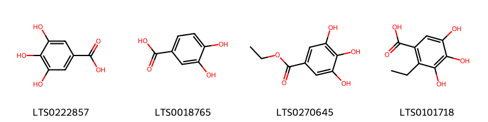{ group="compound" description="Cấu trúc hóa học của các hoạt chất thuộc nhóm *Benzene and substituted derivatives* là galop [(LTS0222857)](https://lotus.naturalproducts.net/compound/lotus_id/LTS0222857), 3,4-dihydroxybenzoic acid [(LTS0018765)](https://lotus.naturalproducts.net/compound/lotus_id/LTS0018765), ethyl gallate [(LTS0270645)](https://lotus.naturalproducts.net/compound/lotus_id/LTS0270645), 2-ethyl-3,4,5-trihydroxybenzoic acid [(LTS0101718)](https://lotus.naturalproducts.net/compound/lotus_id/LTS0101718)." }

                                                              
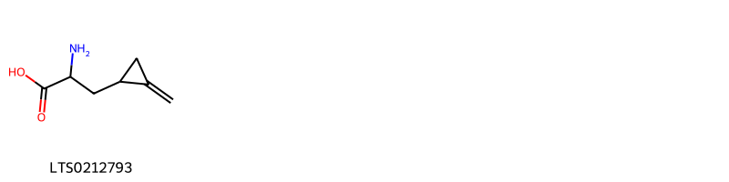{ group="compound" description="Cấu trúc hóa học của các hoạt chất thuộc nhóm *Carboxylic acids and derivatives* là hypoglycine a [(LTS0212793)](https://lotus.naturalproducts.net/compound/lotus_id/LTS0212793)." }

                                                              
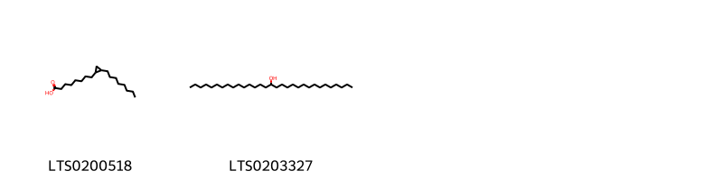{ group="compound" description="Cấu trúc hóa học của các hoạt chất thuộc nhóm *Fatty Acyls* là dihydrosterculic acid [(LTS0200518)](https://lotus.naturalproducts.net/compound/lotus_id/LTS0200518), 16-hentriacontanol [(LTS0203327)](https://lotus.naturalproducts.net/compound/lotus_id/LTS0203327)." }

                                                              
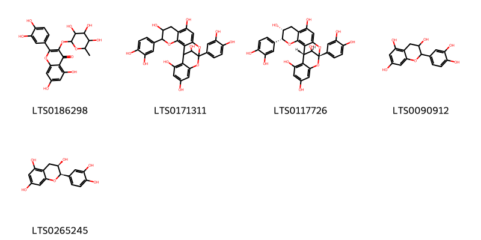{ group="compound" description="Cấu trúc hóa học của các hoạt chất thuộc nhóm *Flavonoids* là quercitrin [(LTS0186298)](https://lotus.naturalproducts.net/compound/lotus_id/LTS0186298), procyanidin a1 [(LTS0171311)](https://lotus.naturalproducts.net/compound/lotus_id/LTS0171311), proanthocyanidin a2 [(LTS0117726)](https://lotus.naturalproducts.net/compound/lotus_id/LTS0117726), catechol [(LTS0090912)](https://lotus.naturalproducts.net/compound/lotus_id/LTS0090912), ent-epicatechin [(LTS0265245)](https://lotus.naturalproducts.net/compound/lotus_id/LTS0265245)." }

                                                              
{ group="compound" description="Cấu trúc hóa học của các hoạt chất thuộc nhóm *Imidazopyrimidines* là leucon [(LTS0114351)](https://lotus.naturalproducts.net/compound/lotus_id/LTS0114351)." }

                                                              
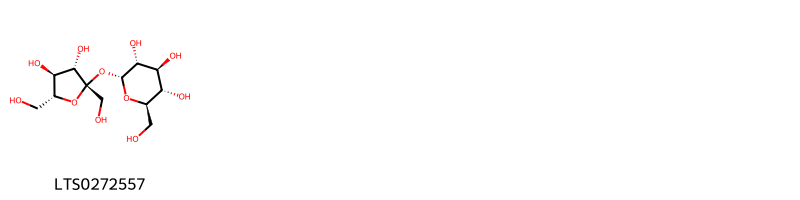{ group="compound" description="Cấu trúc hóa học của các hoạt chất thuộc nhóm *Organooxygen compounds* là sucrose [(LTS0272557)](https://lotus.naturalproducts.net/compound/lotus_id/LTS0272557)." }

                                                              
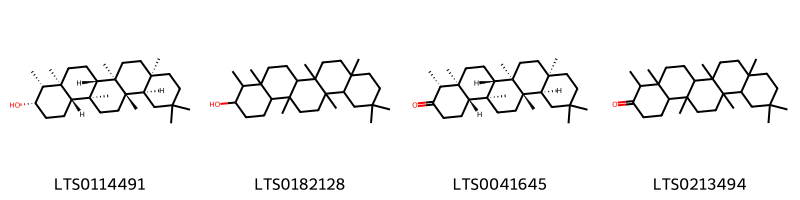{ group="compound" description="Cấu trúc hóa học của các hoạt chất thuộc nhóm *Prenol lipids* là epi-friedelanol [(LTS0114491)](https://lotus.naturalproducts.net/compound/lotus_id/LTS0114491), 4,4a,6b,8a,11,11,12b,14a-octamethyl-hexadecahydropicen-3-ol [(LTS0182128)](https://lotus.naturalproducts.net/compound/lotus_id/LTS0182128), (-)-friedelin [(LTS0041645)](https://lotus.naturalproducts.net/compound/lotus_id/LTS0041645), friedelin [(LTS0213494)](https://lotus.naturalproducts.net/compound/lotus_id/LTS0213494)." }

                                                              
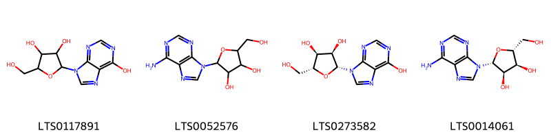{ group="compound" description="Cấu trúc hóa học của các hoạt chất thuộc nhóm *Purine nucleosides* là inosine [(LTS0117891)](https://lotus.naturalproducts.net/compound/lotus_id/LTS0117891), adenosine [(LTS0052576)](https://lotus.naturalproducts.net/compound/lotus_id/LTS0052576), (-)-inosine [(LTS0273582)](https://lotus.naturalproducts.net/compound/lotus_id/LTS0273582), adenosine [(LTS0014061)](https://lotus.naturalproducts.net/compound/lotus_id/LTS0014061)." }

                                                              
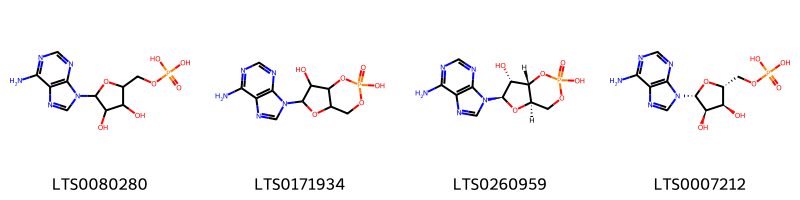{ group="compound" description="Cấu trúc hóa học của các hoạt chất thuộc nhóm *Purine nucleotides* là adenosine monophosphate [(LTS0080280)](https://lotus.naturalproducts.net/compound/lotus_id/LTS0080280), cyclic amp [(LTS0171934)](https://lotus.naturalproducts.net/compound/lotus_id/LTS0171934), cyclic adenosine monophosphate [(LTS0260959)](https://lotus.naturalproducts.net/compound/lotus_id/LTS0260959), adenosine monophosphate [(LTS0007212)](https://lotus.naturalproducts.net/compound/lotus_id/LTS0007212)." }

                                                              
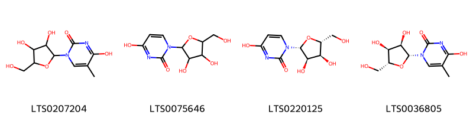{ group="compound" description="Cấu trúc hóa học của các hoạt chất thuộc nhóm *Pyrimidine nucleosides* là 1-[3,4-dihydroxy-5-(hydroxymethyl)oxolan-2-yl]-4-hydroxy-5-methylpyrimidin-2-one [(LTS0207204)](https://lotus.naturalproducts.net/compound/lotus_id/LTS0207204), 1-[3,4-dihydroxy-5-(hydroxymethyl)oxolan-2-yl]-4-hydroxypyrimidin-2-one [(LTS0075646)](https://lotus.naturalproducts.net/compound/lotus_id/LTS0075646), uridine [(LTS0220125)](https://lotus.naturalproducts.net/compound/lotus_id/LTS0220125), 5-methyluridine [(LTS0036805)](https://lotus.naturalproducts.net/compound/lotus_id/LTS0036805)." }

                                                              
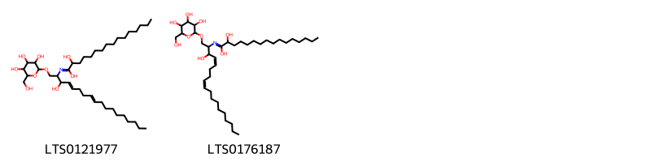{ group="compound" description="Cấu trúc hóa học của các hoạt chất thuộc nhóm *Sphingolipids* là 2-hydroxy-n-(3-hydroxy-1-{[3,4,5-trihydroxy-6-(hydroxymethyl)oxan-2-yl]oxy}octadeca-4,8-dien-2-yl)hexadecanimidic acid [(LTS0121977)](https://lotus.naturalproducts.net/compound/lotus_id/LTS0121977), 2-hydroxy-n-[(4z,8z)-3-hydroxy-1-{[3,4,5-trihydroxy-6-(hydroxymethyl)oxan-2-yl]oxy}octadeca-4,8-dien-2-yl]hexadecanimidic acid [(LTS0176187)](https://lotus.naturalproducts.net/compound/lotus_id/LTS0176187)." }

                                                              
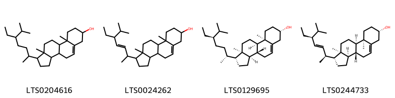{ group="compound" description="Cấu trúc hóa học của các hoạt chất thuộc nhóm *Steroids and steroid derivatives* là stigmast-5-en-3-ol, (3β)- [(LTS0204616)](https://lotus.naturalproducts.net/compound/lotus_id/LTS0204616), stigmasterol [(LTS0024262)](https://lotus.naturalproducts.net/compound/lotus_id/LTS0024262), (1r,3ar,3br,7s,9ar,9br,11ar)-1-[(2r,5r)-5-ethyl-6-methylheptan-2-yl]-9a,11a-dimethyl-1h,2h,3h,3ah,3bh,4h,6h,7h,8h,9h,9bh,10h,11h-cyclopenta[a]phenanthren-7-ol [(LTS0129695)](https://lotus.naturalproducts.net/compound/lotus_id/LTS0129695), (1r,3ar,3br,7s,9ar,9br,11ar)-1-[(2s,3e,5s)-5-ethyl-6-methylhept-3-en-2-yl]-9a,11a-dimethyl-1h,2h,3h,3ah,3bh,4h,6h,7h,8h,9h,9bh,10h,11h-cyclopenta[a]phenanthren-7-ol [(LTS0244733)](https://lotus.naturalproducts.net/compound/lotus_id/LTS0244733)." }

                                                              
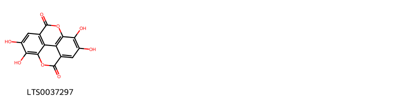{ group="compound" description="Cấu trúc hóa học của các hoạt chất thuộc nhóm *Tannins* là ellagic acid [(LTS0037297)](https://lotus.naturalproducts.net/compound/lotus_id/LTS0037297)." }

:::

---

## IV. Tác dụng dược lý

Theo tài liệu quốc tế: nan

---

## V. Dược điển Việt Nam V

### Soi bột

nan

::: {#listing-soibot}
:::

### Vi phẫu

nan

::: {#listing-viphau}
:::

### Định tính

nan

### Định lượng

nan

### Thông tin khác 

- **Độ ẩm:** nan
- **Bảo quản:** nan

## VI. Dược điển Hồng kong

::: {#listing-DDHK}
:::

---

## VII. Y dược học cổ truyền

::: {.callout-note title = "nan" }

**Tên vị thuốc:** nan

**Tính:** nan

**Vị:** nan

**Quy kinh:**  nan

**Công năng chủ trị:** nan

**Phân loại theo thông tư:** nan

**Tác dụng theo y dược cổ truyền:** nan

**Chú ý:** nan

**Kiêng kỵ:** nan 

:::

::: {#listing-ViThuoc}
:::

