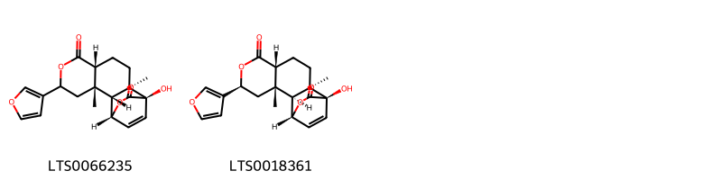
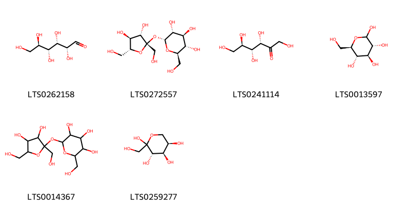
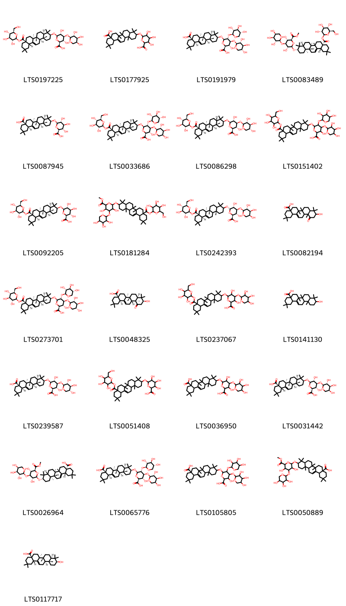
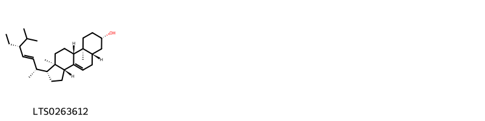

::: {.callout-note title = "Tóm tắt"}

Gấc (Áo hạt), tên khoa học Arillus Momordicae cochinchinensis, là phần áo đỏ bao quanh hạt của cây Gấc (Momordica cochinchinensis (Lour.) Spreng.), thuộc họ Bí (Cucurbitaceae). Đây là loài dây leo thân thảo, mọc hoang và được trồng phổ biến ở Việt Nam, đặc biệt tại miền Bắc. Gấc có nguồn gốc ở Đông Nam Á, Nam-Trung Trung Quốc, Ấn Độ và các đảo Đông Nam Á, đã được di thực đến một số khu vực như quần đảo Andaman, Nicobar và Trinidad-Tobago. Trong y học cổ truyền, dược liệu có vị ngọt, tính bình, quy vào kinh Can, Tỳ, Vị, được sử dụng để bổ tỳ, thanh can, sáng mắt, chữa quáng gà, khô mắt, suy dinh dưỡng ở trẻ em và hỗ trợ phụ nữ mang thai, cho con bú. Cây có tác dụng làm lành vết thương, hỗ trợ tăng cân, bảo vệ nhiễm sắc thể và cải thiện thị lực.Thành phần hóa học chính gồm carotenoid (lycopen, β-caroten), saponin (momordicin), vitamin E, acid béo (oleic, linoleic, stearic) và polyphenol.

:::

## I. Thông tin về dược liệu 

::: {.panel-tabset}

### Định danh

- Dược liệu tiếng Việt: Gấc - Áo Hạt
- Dược liệu tiếng Trung: ? (?)
- Dược liệu tiếng Anh: ?
- Dược liệu latin thông dụng: Arillus Momordicae Cochinchinensis
- Dược liệu latin kiểu DĐVN: *Embryo Nelumbinis Nuciferae*
- Dược liệu latin kiểu DĐVN: *nan*
- Dược liệu latin kiểu thông tư: *nan*
- Bộ phận dùng: Áo Hạt (Arillus)

### Mô tả dược liệu 

**Theo dược điển Việt nam V:** Dược liệu là những màng dày khoảng 1 mm, dài 2 cm đến 3 cm, rộng 2 cm đến 2,5 cm, màu đỏ cam, bề mặt nhăn nheo. Thể chất khô giòn, dễ gãy vụn, mùi hăng nhẹ, vị nhạt. 
 
**Mô tả dược liệu theo thông tư chế biến dược liệu theo phương pháp cổ truyền:** nan

### Chế biến 

**Chế biến theo dược điển việt nam V**: Quả gấc chín, bổ lấy hạt, phơi hoặc sấy hay đồ chín cho bớt dính, bóc lấy áo hạt, ép lấy dầu hoặc phơi hoặc sấy khô ở nhiệt độ 40 °C’ đến 60 °c. Màng áo hạt gấc dùng chế dầu gấc. 

**Chế biến theo thông tư:** nan

::: 

## II. Thông tin về thực vật

Dược liệu **Gấc - Áo Hạt** từ bộ phận **Áo Hạt** từ loài *Momordica cochinchinensis*.

**Mô tả thực vật:** Gấc là 1 loại dây leo, mỗi năm khô héo một lần nhưng năm sau vào mùa xuân, từ gốc lại mọc ra nhiều thân mới. Mỗi gốc có nhiều dây, mỗi dây có nhiều đốt, mỗi đốt có lá. Lá mọc so le, chia thùy khía sâu tới 1/3 hay 1/2 phiến. Đường kính phiến lá 12-20cm, phía đáy lá hình tim, mặt trên lá màu xanh lục sẫm, sờ ram ráp. Hoa nở vào các tháng 4-5. đực cái riêng biệt. Cánh hoa màu vàng nhạt. Tháng 6 có quả non, hình bầu dục dài 15-20cm, đít nhọn, ngoài có nhiều gai mềm đỏ đẹp. Trong quả có nhiều hạt xếp thành hàng dọc, quanh hạt có màng màu đỏ máu; khi bóc màng đỏ thấy có một lớp vỏ cứng đen, quanh mép có răng cưa tù và rộng hạt dài chừng 25-35cm, rộng 19-31mm, dày 5-10mm, trông gần giống con ba ba nhỏ bằng gỗ, do đó có tên là mộc miết tử (mộc là gỗ, miết là con ba ba). Trong hạt có nhân, chứa nhiều dầu.

*Tài liệu tham khảo:* "Những cây thuốc và vị thuốc Việt Nam" - Đỗ Tất Lợi 
Trong dược điển Việt nam, loài *Momordica cochinchinensis* được sử dụng làm dược liệu.

            
::: {.callout-note title = "Phân loại thực vật của *Momordica cochinchinensis*"}

**Kingdom:** Plantae 

**Phylum:** Tracheophyta 

**Order:** Cucurbitales 
 
**Family:** Cucurbitaceae 
 
**Genus:** Momordica 
 
**Species:** *Momordica cochinchinensis* 
 

:::

::: {style="display: grid;grid-template-columns: repeat(auto-fill, minmax(150px, 1fr));grid-gap: 1em;"}
{ group="GIBF" }

{ group="GIBF" }

{ group="GIBF" }

{ group="GIBF" }

{ group="GIBF" }

{ group="GIBF" }

{ group="GIBF" }

{ group="GIBF" }

{ group="GIBF" }
:::

**Phân bố trên thế giới:** nan, India, Malaysia, China, Chinese Taipei, Indonesia, United States of America, Hong Kong, Viet Nam, Thailand, Australia, Philippines

**Phân bố tại Việt nam:** Lào Cai, Bến Tre, Hà Nội, Ninh Bình, Tiền Giang

<iframe src="Arillus Momordicae Cochinchinensis/map_distribution.html" width="100%" height="600" style="border:none;"></iframe>

## III. Thành phần hóa học

Theo tài liệu của GS. Đỗ Tất Lợi:  Nhóm hóa học:
- Carotenoid: Lycopen, β-caroten, zeaxanthin.
- Saponin: Momordicin.
- Vitamin: Vitamin E (tocopherol).
- Chất béo: Acid oleic, acid linoleic, acid stearic.
- Hợp chất phenolic: Các polyphenol có tác dụng chống oxy hóa.
Tên hoạt chất làm biomarker:
- Lycopen và β-caroten
    

Theo cơ sở dữ liệu lotus, loài *Momordica cochinchinensis* đã phân lập và xác định được **35** hoạt chất thuộc về các nhóm Naphthopyrans, Steroids and steroid derivatives, Prenol lipids, Organooxygen compounds trong bảng dưới đây.
        
| chemicalTaxonomyClassyfireClass   |   smiles_count |
|:----------------------------------|---------------:|
| Naphthopyrans                     |            150 |
| Organooxygen compounds            |            262 |
| Prenol lipids                     |           3771 |
| Steroids and steroid derivatives  |             90 |

Danh sách chi tiết các hoạt chất như sau: 

::: {style="display: grid;grid-template-columns: repeat(auto-fill, minmax(150px, 1fr));grid-gap: 1em;"}

                                                              
{ group="compound" description="Cấu trúc hóa học của các hoạt chất thuộc nhóm *Naphthopyrans* là (1r,2r,3s,8r,11r,12r)-5-(furan-3-yl)-12-hydroxy-3,11-dimethyl-6,14-dioxatetracyclo[10.2.2.0²,¹¹.0³,⁸]hexadec-15-ene-7,13-dione [(LTS0066235)](https://lotus.naturalproducts.net/compound/lotus_id/LTS0066235), columbin [(LTS0018361)](https://lotus.naturalproducts.net/compound/lotus_id/LTS0018361)." }

                                                              
{ group="compound" description="Cấu trúc hóa học của các hoạt chất thuộc nhóm *Organooxygen compounds* là (+)-glucose [(LTS0262158)](https://lotus.naturalproducts.net/compound/lotus_id/LTS0262158), sucrose [(LTS0272557)](https://lotus.naturalproducts.net/compound/lotus_id/LTS0272557), keto-d-fructose [(LTS0241114)](https://lotus.naturalproducts.net/compound/lotus_id/LTS0241114), glucose [(LTS0013597)](https://lotus.naturalproducts.net/compound/lotus_id/LTS0013597), granulated sugar [(LTS0014367)](https://lotus.naturalproducts.net/compound/lotus_id/LTS0014367), d-fructopyranose [(LTS0259277)](https://lotus.naturalproducts.net/compound/lotus_id/LTS0259277)." }

                                                              
{ group="compound" description="Cấu trúc hóa học của các hoạt chất thuộc nhóm *Prenol lipids* là (2s,3s,4s,5r,6r)-6-{[(3s,4ar,6ar,6bs,8as,12as,14ar,14br)-4,4,6a,6b,11,11,14b-heptamethyl-8a-({[(2s,3r,4s,5s,6r)-3,4,5-trihydroxy-6-(hydroxymethyl)oxan-2-yl]oxy}carbonyl)-1,2,3,4a,5,6,7,8,9,10,12,12a,14,14a-tetradecahydropicen-3-yl]oxy}-3,5-dihydroxy-4-{[(2s,3r,4s,5s)-3,4,5-trihydroxyoxan-2-yl]oxy}oxane-2-carboxylic acid [(LTS0197225)](https://lotus.naturalproducts.net/compound/lotus_id/LTS0197225), 6-[(8a-carboxy-4,4,6a,6b,11,11,14b-heptamethyl-1,2,3,4a,5,6,7,8,9,10,12,12a,14,14a-tetradecahydropicen-3-yl)oxy]-3,4,5-trihydroxyoxane-2-carboxylic acid [(LTS0177925)](https://lotus.naturalproducts.net/compound/lotus_id/LTS0177925), (2s,3s,4s,5r,6r)-6-{[(3s,4ar,6ar,6bs,8as,12ar,14ar,14br)-8a-carboxy-4,4,6a,6b,11,11,14b-heptamethyl-1,2,3,4a,5,6,7,8,9,10,12,12a,14,14a-tetradecahydropicen-3-yl]oxy}-3-hydroxy-4,5-bis({[(2s,3r,4s,5r)-3,4,5-trihydroxyoxan-2-yl]oxy})oxane-2-carboxylic acid [(LTS0191979)](https://lotus.naturalproducts.net/compound/lotus_id/LTS0191979), methyl (2s,3s,4s,5r,6r)-6-{[(3s,4ar,6ar,6bs,8as,12ar,14ar,14br)-4,4,6a,6b,11,11,14b-heptamethyl-8a-({[(2s,3r,4s,5s,6r)-3,4,5-trihydroxy-6-(hydroxymethyl)oxan-2-yl]oxy}carbonyl)-1,2,3,4a,5,6,7,8,9,10,12,12a,14,14a-tetradecahydropicen-3-yl]oxy}-3,5-dihydroxy-4-{[(2s,3r,4s,5s)-3,4,5-trihydroxyoxan-2-yl]oxy}oxane-2-carboxylate [(LTS0083489)](https://lotus.naturalproducts.net/compound/lotus_id/LTS0083489), (2s,3s,4s,5r,6r)-6-{[(3s,4ar,6ar,6bs,8as,12ar,14ar,14br)-8a-carboxy-4,4,6a,6b,11,11,14b-heptamethyl-1,2,3,4a,5,6,7,8,9,10,12,12a,14,14a-tetradecahydropicen-3-yl]oxy}-3,4,5-trihydroxyoxane-2-carboxylic acid [(LTS0087945)](https://lotus.naturalproducts.net/compound/lotus_id/LTS0087945), (2s,3s,4s,5r,6r)-6-{[(3s,4ar,6ar,6bs,8as,12ar,14ar,14br)-4,4,6a,6b,11,11,14b-heptamethyl-8a-({[(2s,3r,4s,5s,6r)-3,4,5-trihydroxy-6-(hydroxymethyl)oxan-2-yl]oxy}carbonyl)-1,2,3,4a,5,6,7,8,9,10,12,12a,14,14a-tetradecahydropicen-3-yl]oxy}-3-hydroxy-5-{[(2s,3r,4s,5r)-3,4,5-trihydroxyoxan-2-yl]oxy}-4-{[(2s,3r,4s,5s)-3,4,5-trihydroxyoxan-2-yl]oxy}oxane-2-carboxylic acid [(LTS0033686)](https://lotus.naturalproducts.net/compound/lotus_id/LTS0033686), (2s,3s,4s,5r,6r)-6-{[(3s,4as,6ar,6bs,8as,12ar,14ar,14br)-4,4,6a,6b,11,11,14b-heptamethyl-8a-({[(2s,3r,4s,5s,6r)-3,4,5-trihydroxy-6-(hydroxymethyl)oxan-2-yl]oxy}carbonyl)-1,2,3,4a,5,6,7,8,9,10,12,12a,14,14a-tetradecahydropicen-3-yl]oxy}-3,5-dihydroxy-4-{[(2s,3r,4s,5r)-3,4,5-trihydroxyoxan-2-yl]oxy}oxane-2-carboxylic acid [(LTS0086298)](https://lotus.naturalproducts.net/compound/lotus_id/LTS0086298), 6-{[4,4,6a,6b,11,11,14b-heptamethyl-8a-({[3,4,5-trihydroxy-6-(hydroxymethyl)oxan-2-yl]oxy}carbonyl)-1,2,3,4a,5,6,7,8,9,10,12,12a,14,14a-tetradecahydropicen-3-yl]oxy}-3-hydroxy-4,5-bis[(3,4,5-trihydroxyoxan-2-yl)oxy]oxane-2-carboxylic acid [(LTS0151402)](https://lotus.naturalproducts.net/compound/lotus_id/LTS0151402), (2s,3s,4s,5r,6r)-6-{[(3s,4ar,6ar,6bs,8as,12ar,14ar,14br)-4,4,6a,6b,11,11,14b-heptamethyl-8a-({[(2s,3r,4s,5s,6r)-3,4,5-trihydroxy-6-(hydroxymethyl)oxan-2-yl]oxy}carbonyl)-1,2,3,4a,5,6,7,8,9,10,12,12a,14,14a-tetradecahydropicen-3-yl]oxy}-3,4,5-trihydroxyoxane-2-carboxylic acid [(LTS0092205)](https://lotus.naturalproducts.net/compound/lotus_id/LTS0092205), methyl 6-{[4,4,6a,6b,11,11,14b-heptamethyl-8a-({[3,4,5-trihydroxy-6-(hydroxymethyl)oxan-2-yl]oxy}carbonyl)-1,2,3,4a,5,6,7,8,9,10,12,12a,14,14a-tetradecahydropicen-3-yl]oxy}-3,5-dihydroxy-4-[(3,4,5-trihydroxyoxan-2-yl)oxy]oxane-2-carboxylate [(LTS0181284)](https://lotus.naturalproducts.net/compound/lotus_id/LTS0181284), (2s,3s,4s,5r,6s)-6-{[(6ar,6bs,8as,12ar,14br)-4,4,6a,6b,11,11,14b-heptamethyl-8a-({[(2s,3r,4s,5s,6r)-3,4,5-trihydroxy-6-(hydroxymethyl)oxan-2-yl]oxy}carbonyl)-1,2,3,4a,5,6,7,8,9,10,12,12a,14,14a-tetradecahydropicen-3-yl]oxy}-3,5-dihydroxy-4-{[(2s,3r,4s,5s)-3,4,5-trihydroxyoxan-2-yl]oxy}oxane-2-carboxylic acid [(LTS0242393)](https://lotus.naturalproducts.net/compound/lotus_id/LTS0242393), 10-hydroxy-2,2,6a,6b,9,9,12a-heptamethyl-12-oxo-3,4,5,6,7,8,8a,10,11,12b,13,14b-dodecahydro-1h-picene-4a-carboxylic acid [(LTS0082194)](https://lotus.naturalproducts.net/compound/lotus_id/LTS0082194), (2s,3s,4s,5r,6r)-6-{[(3s,4ar,6ar,6bs,8as,12ar,14ar,14br)-4,4,6a,6b,11,11,14b-heptamethyl-8a-({[(2s,3r,4s,5s,6r)-3,4,5-trihydroxy-6-(hydroxymethyl)oxan-2-yl]oxy}carbonyl)-1,2,3,4a,5,6,7,8,9,10,12,12a,14,14a-tetradecahydropicen-3-yl]oxy}-3-hydroxy-4,5-bis({[(2s,3r,4s,5r)-3,4,5-trihydroxyoxan-2-yl]oxy})oxane-2-carboxylic acid [(LTS0273701)](https://lotus.naturalproducts.net/compound/lotus_id/LTS0273701), (4as,6as,6br,8as,10s,12as,12br,14br)-10-hydroxy-2,2,6a,6b,9,9,12a-heptamethyl-12-oxo-3,4,5,6,7,8,8a,10,11,12b,13,14b-dodecahydro-1h-picene-4a-carboxylic acid [(LTS0048325)](https://lotus.naturalproducts.net/compound/lotus_id/LTS0048325), 6-{[4,4,6a,6b,11,11,14b-heptamethyl-8a-({[3,4,5-trihydroxy-6-(hydroxymethyl)oxan-2-yl]oxy}carbonyl)-1,2,3,4a,5,6,7,8,9,10,12,12a,14,14a-tetradecahydropicen-3-yl]oxy}-3,5-dihydroxy-4-[(3,4,5-trihydroxyoxan-2-yl)oxy]oxane-2-carboxylic acid [(LTS0237067)](https://lotus.naturalproducts.net/compound/lotus_id/LTS0237067), oleanolic acid [(LTS0141130)](https://lotus.naturalproducts.net/compound/lotus_id/LTS0141130), (2s,3s,4s,5r,6r)-6-{[(3s,4ar,6ar,6bs,8as,12ar,14ar,14br)-8a-carboxy-4,4,6a,6b,11,11,14b-heptamethyl-1,2,3,4a,5,6,7,8,9,10,12,12a,14,14a-tetradecahydropicen-3-yl]oxy}-3,5-dihydroxy-4-{[(2s,3r,4s,5r)-3,4,5-trihydroxyoxan-2-yl]oxy}oxane-2-carboxylic acid [(LTS0239587)](https://lotus.naturalproducts.net/compound/lotus_id/LTS0239587), 6-{[4,4,6a,6b,11,11,14b-heptamethyl-8a-({[3,4,5-trihydroxy-6-(hydroxymethyl)oxan-2-yl]oxy}carbonyl)-1,2,3,4a,5,6,7,8,9,10,12,12a,14,14a-tetradecahydropicen-3-yl]oxy}-3,4,5-trihydroxyoxane-2-carboxylic acid [(LTS0051408)](https://lotus.naturalproducts.net/compound/lotus_id/LTS0051408), 6-[(8a-carboxy-4,4,6a,6b,11,11,14b-heptamethyl-1,2,3,4a,5,6,7,8,9,10,12,12a,14,14a-tetradecahydropicen-3-yl)oxy]-3,5-dihydroxy-4-[(3,4,5-trihydroxyoxan-2-yl)oxy]oxane-2-carboxylic acid [(LTS0036950)](https://lotus.naturalproducts.net/compound/lotus_id/LTS0036950), (2s,3s,4s,5r,6r)-6-{[(3s,4ar,6ar,6bs,8as,12as,14ar,14br)-8a-carboxy-4,4,6a,6b,11,11,14b-heptamethyl-1,2,3,4a,5,6,7,8,9,10,12,12a,14,14a-tetradecahydropicen-3-yl]oxy}-3,5-dihydroxy-4-{[(2s,3r,4s,5s)-3,4,5-trihydroxyoxan-2-yl]oxy}oxane-2-carboxylic acid [(LTS0031442)](https://lotus.naturalproducts.net/compound/lotus_id/LTS0031442), (4as,6as,6br,8ar,10s,12ar,12br,14br)-10-{[(2r,3r,4s,5s,6s)-3,5-dihydroxy-6-(methoxycarbonyl)-4-{[(2s,3r,4s,5s)-3,4,5-trihydroxyoxan-2-yl]oxy}oxan-2-yl]oxy}-2,2,6a,6b,9,9,12a-heptamethyl-1,3,4,5,6,7,8,8a,10,11,12,12b,13,14b-tetradecahydropicene-4a-carboxylic acid [(LTS0026964)](https://lotus.naturalproducts.net/compound/lotus_id/LTS0026964), (2s,3s,4s,5r,6r)-6-{[(3s,4ar,6ar,6bs,8as,12ar,14ar,14br)-8a-carboxy-4,4,6a,6b,11,11,14b-heptamethyl-1,2,3,4a,5,6,7,8,9,10,12,12a,14,14a-tetradecahydropicen-3-yl]oxy}-3-hydroxy-5-{[(2s,3r,4s,5r)-3,4,5-trihydroxyoxan-2-yl]oxy}-4-{[(2s,3r,4s,5s)-3,4,5-trihydroxyoxan-2-yl]oxy}oxane-2-carboxylic acid [(LTS0065776)](https://lotus.naturalproducts.net/compound/lotus_id/LTS0065776), 6-[(8a-carboxy-4,4,6a,6b,11,11,14b-heptamethyl-1,2,3,4a,5,6,7,8,9,10,12,12a,14,14a-tetradecahydropicen-3-yl)oxy]-3-hydroxy-4,5-bis[(3,4,5-trihydroxyoxan-2-yl)oxy]oxane-2-carboxylic acid [(LTS0105805)](https://lotus.naturalproducts.net/compound/lotus_id/LTS0105805), 10-{[3,5-dihydroxy-6-(methoxycarbonyl)-4-[(3,4,5-trihydroxyoxan-2-yl)oxy]oxan-2-yl]oxy}-2,2,6a,6b,9,9,12a-heptamethyl-1,3,4,5,6,7,8,8a,10,11,12,12b,13,14b-tetradecahydropicene-4a-carboxylic acid [(LTS0050889)](https://lotus.naturalproducts.net/compound/lotus_id/LTS0050889), oleanolic acid [(LTS0117717)](https://lotus.naturalproducts.net/compound/lotus_id/LTS0117717)." }

                                                              
{ group="compound" description="Cấu trúc hóa học của các hoạt chất thuộc nhóm *Steroids and steroid derivatives* là spinasterol [(LTS0263612)](https://lotus.naturalproducts.net/compound/lotus_id/LTS0263612)." }

:::

---

## IV. Tác dụng dược lý

Theo tài liệu quốc tế: nan

---

## V. Dược điển Việt Nam V

### Soi bột

Bột màu đỏ cam, soi kính hiển vi thấy: Mảnh mô mềm gồm các tế bào hình đa giác, kích thước tương đối đều, thành hơi dày, xếp sít nhau, đều đặn. Nhiều hạt dầu tròn nhỏ màu cam. Rải rác có các khối chất màu nâu đen. nn

::: {#listing-soibot}
:::

### Vi phẫu

nan

::: {#listing-viphau}
:::

### Định tính

Phương pháp sắc ký lớp mỏng (Phụ lục 5.4). Bản mỏng’. Silicagel G Dung môi khai triển: Cyclohexan – ether ethylic (4 : l). Dung dịch thử: Lấy 1 g bột thô dược liệu, thêm 10 ml ether dầu hỏa (40 °C đến 60 °Q (77), ngâm trong 1 h, lọc. Cô dịch lọc đến cắn. Hòa can trong 1 ml ether dầu hỏa (40 °c đến 60 °C (TT) làm dung dịch chấm sắc ký. Dung dịch đối chiếu: Dung dịch β-caroten nồng độ 0,1 mg/ml trong ether dầu hỏa (40 °c đến 60 °C) (TT)   Cách tiến hành: Chấm riêng biệt lên bản mỏng 10 pl mỗi dung dịch trên. Triển khai sắc ký cho đến khi dung môi đi được khoảng 12 cm, lấy bản mỏng ra, để khô ở nhiệt độ phòng. Ọuan sát dưới ánh sáng thường. Trên sắc ký đồ của dung dịch thử phải có vết chính cùng màu, cùng giá trị Rf với vết của β-caroten trên sắc ký đồ của dung dịch đối chiếu.

### Định lượng

Chất chiết được trong dược liệu Cân chính xác 10 g bột dược liệu vào một bình nón nút mài dung tích 250 ml. Thêm 100 ml ether dầu hỏa (40 °c đến 60 °C), đun hồi lưu trên cách thủy ấm trong 30 min. Để lắng, gạn lấy dịch chiết. Chiết như trên 2 lần nữa, mỗi lần với 50 ml ether dầu hỏa (40 °c đến 60 °C). Lọc dịch chiết và tập trung các dịch lọc vào một chén đã cân bì, cô dịch lọc trên cách thủy đến khi hết ether dầu hỏa. Để nguội trong bình hút ẩm. Cân và tính kết quả. Hàm lượng cắn dầu không được ít hơn 8,0 % tính theo dược liệu khô kiệt.

### Thông tin khác 

- **Độ ẩm:** Không quá 10,0 % (Phụ lục 12.13).
- **Bảo quản:** Để nơi khô, mát.

## VI. Dược điển Hồng kong

::: {#listing-DDHK}
:::

---

## VII. Y dược học cổ truyền

::: {.callout-note title = "nan" }

**Tên vị thuốc:** nan

**Tính:** nan

**Vị:** nan

**Quy kinh:**  nan

**Công năng chủ trị:** Cam, binh. Vào kinh can, tỳ, vị.

**Phân loại theo thông tư:** nan

**Tác dụng theo y dược cổ truyền:** nan

**Chú ý:** nan

**Kiêng kỵ:** nan 

:::

::: {#listing-ViThuoc}
:::

