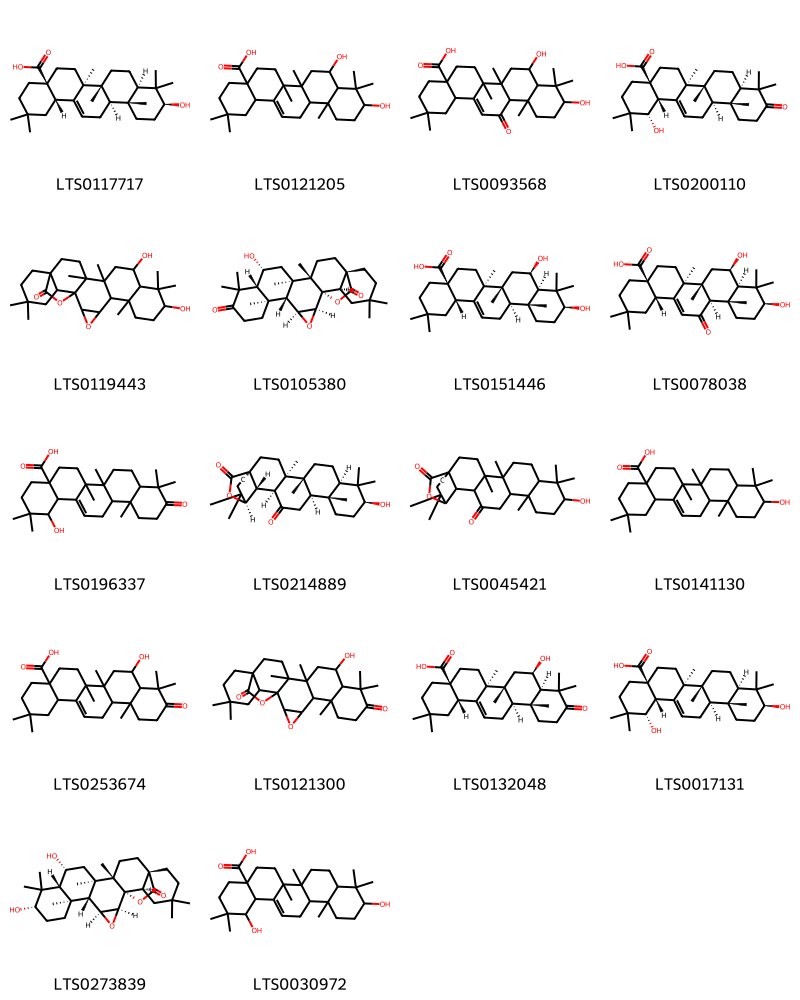

::: {.callout-note title = "Tóm tắt"}

Cánh kiến trắng (Benzoinum), tên khoa học là Styrax tonkinensis (Pierre) Craib ex Hardw., thuộc họ bồ đề (Styracaceae). Cây phân bố chủ yếu ở các tỉnh miền núi nước ta như Hòa Bình, Hà Tĩnh, Thanh Hóa, và Nghệ An, đồng thời cũng có ở các quốc gia như Campuchia, Lào, Thái Lan và Trung Quốc. Thành phần hóa học của cánh kiến trắng rất phong phú, bao gồm các triterpenoid, neolignan, và các hợp chất thơm như axit benzoic, vanillin, dehydrodivanillin. Cánh kiến trắng có tác dụng dược lý bao gồm chống khối u, bảo vệ thần kinh, chống viêm, kháng khuẩn và chống oxy hóa. Cánh kiến trắng đã được sử dụng trong y học cổ truyền để khai khiếu trấn tĩnh, khư hủ sinh cơ, chỉ khái. Trong đông y, cánh kiến trắng được dùng trong trị sản hậu huyết vậng, tâm phúc đông thống, trẻ em kinh giản, phong thấp đau lưng, trúng phong hôn mê, suyễn khan, cảm mạo, trúng thử, đau dạ dày và ngoại thương xuất huyết. Lá dùng trị ho do phế nhiệt. Dùng ngoài làm mau lành các vết thương, chữa nẻ vú. Hiện nay cánh kiến trắng dùng trong chữa viêm phế quản kinh niên và xổ nước đường hô hấp.

:::

## I. Thông tin về dược liệu 

::: {.panel-tabset}

### Định danh

- Dược liệu tiếng Việt: Cánh Kiến Trắng - Nhựa
- Dược liệu tiếng Trung: nan (nan)
- Dược liệu tiếng Anh: nan
- Dược liệu latin thông dụng: Benzoinum
- Dược liệu latin kiểu DĐVN: *Radix Boehmeriae Niveae*
- Dược liệu latin kiểu DĐVN: *nan*
- Dược liệu latin kiểu thông tư: *nan*
- Bộ phận dùng: Nhựa (Benzoinum)

### Mô tả dược liệu 

**Theo dược điển Việt nam V:** nan 
 
**Mô tả dược liệu theo thông tư chế biến dược liệu theo phương pháp cổ truyền:** nan

### Chế biến 

**Chế biến theo dược điển việt nam V**: nan 

**Chế biến theo thông tư:** nan

::: 

## II. Thông tin về thực vật

Dược liệu **Cánh Kiến Trắng - Nhựa** từ bộ phận **Nhựa** từ loài *Styrax tonkinensis*.

**Mô tả thực vật:** Cánh kiến trắng là một cây nhỏ, có thể cao chừng 15m. Búp non phủ lông mịn màu vàng nhạt. Lá mọc so le, có cuống. Phiến lá nguyên, hình trứng, tròn ở phía dưới, nhọn dài ở đầu, mặt dưới màu trắng nhạt. Lá dài 6-15cm, rộng 2-2,5cm. Hoa nhỏ trắng thơm mọc thành chùm, ít phân nhánh mang ít hoa. Quả hình cầu, đường kính 10-16mm phía dưới mang đài còn sót lại, mặt ngoài quả có lông hình sao.

*Tài liệu tham khảo:* "Những cây thuốc và vị thuốc Việt Nam" - Đỗ Tất Lợi 
Trong dược điển Việt nam, loài *Styrax tonkinensis* được sử dụng làm dược liệu.

            
::: {.callout-note title = "Phân loại thực vật của *Styrax tonkinensis*"}

**Kingdom:** Plantae 

**Phylum:** Tracheophyta 

**Order:** Ericales 
 
**Family:** Styracaceae 
 
**Genus:** Styrax 
 
**Species:** *Styrax tonkinensis* 
 

:::

::: {style="display: grid;grid-template-columns: repeat(auto-fill, minmax(150px, 1fr));grid-gap: 1em;"}
{ group="GIBF" }

{ group="GIBF" }

{ group="GIBF" }

{ group="GIBF" }

{ group="GIBF" }

{ group="GIBF" }

{ group="GIBF" }
:::

**Phân bố trên thế giới:** Thailand, nan, China, Canada, Lao People’s Democratic Republic, Viet Nam

**Phân bố tại Việt nam:** 宣光省, Ha Noi

<iframe src="Benzoinum/map_distribution.html" width="100%" height="600" style="border:none;"></iframe>

## III. Thành phần hóa học

Theo tài liệu của GS. Đỗ Tất Lợi:  (1) Nhóm hóa học: 
- Triterpenoid: 6beta-hydroxy-3-oxo-11alpha,12alpha-epoxyolean-28,13beta-olide; 3beta,6beta-dihydroxy-11alpha,12alpha-epoxyolean-28,13beta-olide; 3beta, 6beta-dihydroxy-11-oxo-olean-12-en-28-oic acid; 3beta-hydroxy-12-oxo-13Halpha-olean-28,19beta-olide; 19alpha -hydroxy-3-oxo-olean-12-en-28-oic acid; 6beta-hydroxy-3-oxo-olean-12-en-28-oic acid; sumaresinolic acid, siaresinolic axit, axit oleanolic; 3b,6b-dihydroxy-12-oxo13Ha-olean-28,19b-olide và 3-oxoolean-11,13(18)-dien-28,19b-olide
- Neolignan: tonkinensisin A, B và C 
- Các hợp chất thơm gồm: axit benzoic, vanillin, dehydrodivanillin, axit vanillic, aldehyde coniferyl, trans-(tetrahydro-2-(4-hydroxy-3-metoxyphenyl)-5-oxofuran-3-yl)metyl benzoat và 3-(4-hydroxy-3-metoxyphenyl)-2- oxopropyl benzoat. 
- Ngoài ra còn có các thành phần khác như benzoat coniferyl, cinnamat benzyl, Acid benzoic tự do, acid hydroxy-19 oleanolic và các vết nanillin
(2) Tên hoạt chất là biomaker: 
- Dược điển Việt Nam: acid balsamic 
- Dược điển Trung Quốc: acid balsamic, acid benzoic
    

Theo cơ sở dữ liệu lotus, loài *Styrax tonkinensis* đã phân lập và xác định được **18** hoạt chất thuộc về các nhóm Prenol lipids trong bảng dưới đây.
        
| chemicalTaxonomyClassyfireClass   |   smiles_count |
|:----------------------------------|---------------:|
| Prenol lipids                     |           1531 |

Danh sách chi tiết các hoạt chất như sau: 

::: {style="display: grid;grid-template-columns: repeat(auto-fill, minmax(150px, 1fr));grid-gap: 1em;"}

                                                              
{ group="compound" description="Cấu trúc hóa học của các hoạt chất thuộc nhóm *Prenol lipids* là oleanolic acid [(LTS0117717)](https://lotus.naturalproducts.net/compound/lotus_id/LTS0117717), 8,10-dihydroxy-2,2,6a,6b,9,9,12a-heptamethyl-1,3,4,5,6,7,8,8a,10,11,12,12b,13,14b-tetradecahydropicene-4a-carboxylic acid [(LTS0121205)](https://lotus.naturalproducts.net/compound/lotus_id/LTS0121205), 8,10-dihydroxy-2,2,6a,6b,9,9,12a-heptamethyl-13-oxo-3,4,5,6,7,8,8a,10,11,12,12b,14b-dodecahydro-1h-picene-4a-carboxylic acid [(LTS0093568)](https://lotus.naturalproducts.net/compound/lotus_id/LTS0093568), (1s,4ar,6as,6br,8ar,12ar,12br,14bs)-1-hydroxy-2,2,6a,6b,9,9,12a-heptamethyl-10-oxo-3,4,5,6,7,8,8a,11,12,12b,13,14b-dodecahydro-1h-picene-4a-carboxylic acid [(LTS0200110)](https://lotus.naturalproducts.net/compound/lotus_id/LTS0200110), 9,12-dihydroxy-6,10,10,14,15,21,21-heptamethyl-3,24-dioxaheptacyclo[16.5.2.0¹,¹⁵.0²,⁴.0⁵,¹⁴.0⁶,¹¹.0¹⁸,²³]pentacosan-25-one [(LTS0119443)](https://lotus.naturalproducts.net/compound/lotus_id/LTS0119443), (1s,2s,4s,5r,6s,11r,12r,14r,15s,18s,23r)-12-hydroxy-6,10,10,14,15,21,21-heptamethyl-3,24-dioxaheptacyclo[16.5.2.0¹,¹⁵.0²,⁴.0⁵,¹⁴.0⁶,¹¹.0¹⁸,²³]pentacosane-9,25-dione [(LTS0105380)](https://lotus.naturalproducts.net/compound/lotus_id/LTS0105380), sumaresinolic acid [(LTS0151446)](https://lotus.naturalproducts.net/compound/lotus_id/LTS0151446), (4as,6as,6br,8r,8ar,10s,12as,12br,14bs)-8,10-dihydroxy-2,2,6a,6b,9,9,12a-heptamethyl-13-oxo-3,4,5,6,7,8,8a,10,11,12,12b,14b-dodecahydro-1h-picene-4a-carboxylic acid [(LTS0078038)](https://lotus.naturalproducts.net/compound/lotus_id/LTS0078038), 1-hydroxy-2,2,6a,6b,9,9,12a-heptamethyl-10-oxo-3,4,5,6,7,8,8a,11,12,12b,13,14b-dodecahydro-1h-picene-4a-carboxylic acid [(LTS0196337)](https://lotus.naturalproducts.net/compound/lotus_id/LTS0196337), (1r,4r,5r,8r,10s,13r,14r,17s,18s,19r)-10-hydroxy-4,5,9,9,13,20,20-heptamethyl-24-oxahexacyclo[17.3.2.0¹,¹⁸.0⁴,¹⁷.0⁵,¹⁴.0⁸,¹³]tetracosane-16,23-dione [(LTS0214889)](https://lotus.naturalproducts.net/compound/lotus_id/LTS0214889), 10-hydroxy-4,5,9,9,13,20,20-heptamethyl-24-oxahexacyclo[17.3.2.0¹,¹⁸.0⁴,¹⁷.0⁵,¹⁴.0⁸,¹³]tetracosane-16,23-dione [(LTS0045421)](https://lotus.naturalproducts.net/compound/lotus_id/LTS0045421), oleanolic acid [(LTS0141130)](https://lotus.naturalproducts.net/compound/lotus_id/LTS0141130), 8-hydroxy-2,2,6a,6b,9,9,12a-heptamethyl-10-oxo-3,4,5,6,7,8,8a,11,12,12b,13,14b-dodecahydro-1h-picene-4a-carboxylic acid [(LTS0253674)](https://lotus.naturalproducts.net/compound/lotus_id/LTS0253674), 12-hydroxy-6,10,10,14,15,21,21-heptamethyl-3,24-dioxaheptacyclo[16.5.2.0¹,¹⁵.0²,⁴.0⁵,¹⁴.0⁶,¹¹.0¹⁸,²³]pentacosane-9,25-dione [(LTS0121300)](https://lotus.naturalproducts.net/compound/lotus_id/LTS0121300), (4as,6as,6br,8r,8ar,12ar,12br,14bs)-8-hydroxy-2,2,6a,6b,9,9,12a-heptamethyl-10-oxo-3,4,5,6,7,8,8a,11,12,12b,13,14b-dodecahydro-1h-picene-4a-carboxylic acid [(LTS0132048)](https://lotus.naturalproducts.net/compound/lotus_id/LTS0132048), siaresinol [(LTS0017131)](https://lotus.naturalproducts.net/compound/lotus_id/LTS0017131), (1s,2s,4s,5r,6s,9s,11r,12r,14r,15s,18s,23r)-9,12-dihydroxy-6,10,10,14,15,21,21-heptamethyl-3,24-dioxaheptacyclo[16.5.2.0¹,¹⁵.0²,⁴.0⁵,¹⁴.0⁶,¹¹.0¹⁸,²³]pentacosan-25-one [(LTS0273839)](https://lotus.naturalproducts.net/compound/lotus_id/LTS0273839), 1,10-dihydroxy-2,2,6a,6b,9,9,12a-heptamethyl-1,3,4,5,6,7,8,8a,10,11,12,12b,13,14b-tetradecahydropicene-4a-carboxylic acid [(LTS0030972)](https://lotus.naturalproducts.net/compound/lotus_id/LTS0030972)." }

:::

---

## IV. Tác dụng dược lý

Theo tài liệu quốc tế: nan

---

## V. Dược điển Việt Nam V

### Soi bột

nan

::: {#listing-soibot}
:::

### Vi phẫu

nan

::: {#listing-viphau}
:::

### Định tính

nan

### Định lượng

nan

### Thông tin khác 

- **Độ ẩm:** nan
- **Bảo quản:** nan

## VI. Dược điển Hồng kong

::: {#listing-DDHK}
:::

---

## VII. Y dược học cổ truyền

::: {.callout-note title = "nan" }

**Tên vị thuốc:** nan

**Tính:** nan

**Vị:** nan

**Quy kinh:**  nan

**Công năng chủ trị:** nan

**Phân loại theo thông tư:** nan

**Tác dụng theo y dược cổ truyền:** nan

**Chú ý:** nan

**Kiêng kỵ:** nan 

:::

::: {#listing-ViThuoc}
:::

