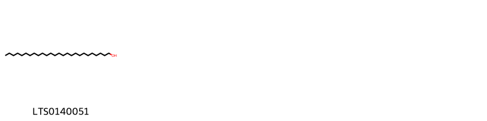
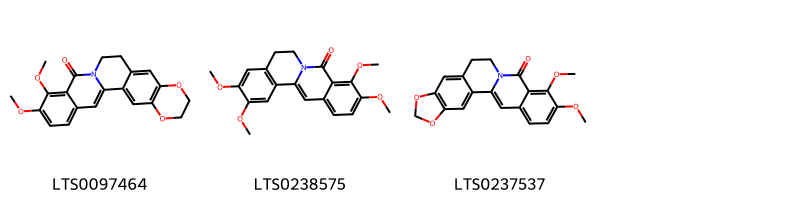
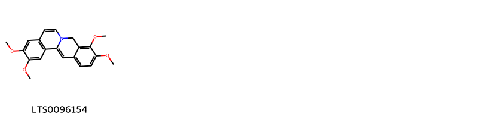
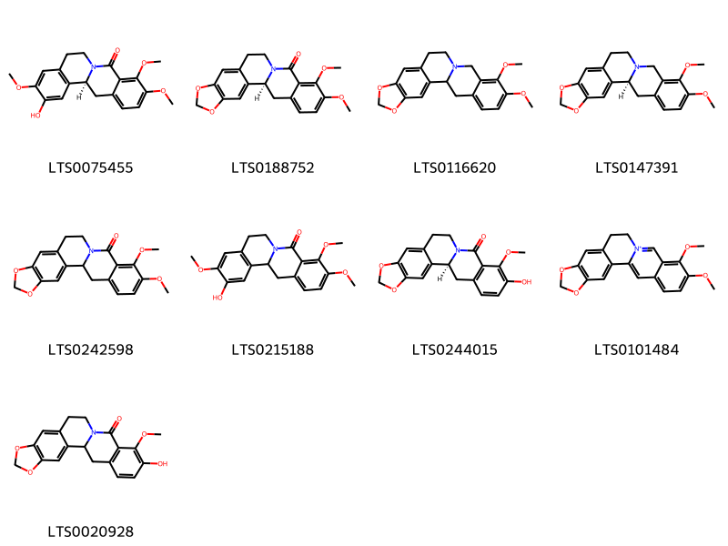
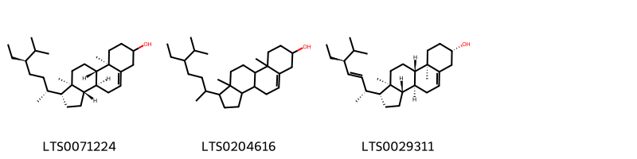

::: {.callout-note title = "Tóm tắt"}

nan

:::

## I. Thông tin về dược liệu 

::: {.panel-tabset}

### Định danh

- Dược liệu tiếng Việt: Vàng Đắng - Thân
- Dược liệu tiếng Trung: nan (nan)
- Dược liệu tiếng Anh: nan
- Dược liệu latin thông dụng: Caulls Coscinii Fenestrati
- Dược liệu latin kiểu DĐVN: *Caulls Coscinii Fenestrati*
- Dược liệu latin kiểu DĐVN: *nan*
- Dược liệu latin kiểu thông tư: *nan*
- Bộ phận dùng: Thân (Caulls)

### Mô tả dược liệu 

**Theo dược điển Việt nam V:** Thân hình trụ tròn, đường kính 2 cm trở lên, gần thẳng hoặc hơi cong, đôi khi có bướu phình to. Mặt ngoài màu vàng đất hoặc nâu. có khi loang lổ, nhiều vết nhăn dọc, nông, đôi khi có vết sẹo tròn do vết tích của cành con. Mặt cắt ngang để lộ lớp vỏ mỏng, vòng gỗ dày chiếm khoảng 4/5 đường kính thân, màu vàng rơm, có tia hình nan hoa bánh xe, lỗ chỗ nhiều chấm nhỏ (mạch gỗ). Chất cứng khó bẻ, không mùi, vị đắng. 
 
**Mô tả dược liệu theo thông tư chế biến dược liệu theo phương pháp cổ truyền:** nan

### Chế biến 

**Chế biến theo dược điển việt nam V**: Thu hái quanh năm, cạo vỏ, cắt thành đoạn dài 10 cm đến 13 cm, phơi hoặc sấy khô ở nhiệt độ từ 50 °C đến 60°C n Bào chế  Rửa sạch, thái thành lát mỏng, phơi, hoặc sấy khô ờ nhiệt độ từ 50  °C đến 60 °C. Có thể dùng dể tán hột vả chiết xuất. 

**Chế biến theo thông tư:** nan

::: 

## II. Thông tin về thực vật

Dược liệu **Vàng Đắng - Thân** từ bộ phận **Thân** từ loài *Coscinium fenestratum*.

**Mô tả thực vật:** nan

*Tài liệu tham khảo:* nan 
Trong dược điển Việt nam, loài *Coscinium fenestratum* được sử dụng làm dược liệu.

            
::: {.callout-note title = "Phân loại thực vật của *Coscinium fenestratum*"}

**Kingdom:** Plantae 

**Phylum:** Tracheophyta 

**Order:** Ranunculales 
 
**Family:** Menispermaceae 
 
**Genus:** Coscinium 
 
**Species:** *Coscinium fenestratum* 
 

:::

::: {style="display: grid;grid-template-columns: repeat(auto-fill, minmax(150px, 1fr));grid-gap: 1em;"}
{ group="GIBF" }

{ group="GIBF" }

{ group="GIBF" }

{ group="GIBF" }

{ group="GIBF" }

{ group="GIBF" }

{ group="GIBF" }

{ group="GIBF" }

{ group="GIBF" }

{ group="GIBF" }
:::

**Phân bố trên thế giới:** nan, Thailand, unknown or invalid, Cambodia, Malaysia, India, Indonesia, Singapore, Sri Lanka, Lao People’s Democratic Republic, Viet Nam

**Phân bố tại Việt nam:** Đà Nẵng, Quang Binh, Dong Nai

<iframe src="Caulls Coscinii Fenestrati/map_distribution.html" width="100%" height="600" style="border:none;"></iframe>

## III. Thành phần hóa học

Theo tài liệu của GS. Đỗ Tất Lợi:  nan
    

Theo cơ sở dữ liệu lotus, loài *Coscinium fenestratum* đã phân lập và xác định được **17** hoạt chất thuộc về các nhóm Phenol ethers, Steroids and steroid derivatives, Isoquinolines and derivatives, Fatty Acyls, Protoberberine alkaloids and derivatives trong bảng dưới đây.
        
| chemicalTaxonomyClassyfireClass          |   smiles_count |
|:-----------------------------------------|---------------:|
| Fatty Acyls                              |             27 |
| Isoquinolines and derivatives            |            134 |
| Phenol ethers                            |             42 |
| Protoberberine alkaloids and derivatives |            397 |
| Steroids and steroid derivatives         |            221 |

Danh sách chi tiết các hoạt chất như sau: 

::: {style="display: grid;grid-template-columns: repeat(auto-fill, minmax(150px, 1fr));grid-gap: 1em;"}

                                                              
{ group="compound" description="Cấu trúc hóa học của các hoạt chất thuộc nhóm *Fatty Acyls* là ceryl alcohol [(LTS0140051)](https://lotus.naturalproducts.net/compound/lotus_id/LTS0140051)." }

                                                              
{ group="compound" description="Cấu trúc hóa học của các hoạt chất thuộc nhóm *Isoquinolines and derivatives* là 10,11-dimethoxy-2,3,6,7-tetrahydro-1,4-dioxa-8-azapentaphen-9-one [(LTS0097464)](https://lotus.naturalproducts.net/compound/lotus_id/LTS0097464), 3,4,10,11-tetramethoxy-7,8-dihydro-6-azatetraphen-5-one [(LTS0238575)](https://lotus.naturalproducts.net/compound/lotus_id/LTS0238575), 8-oxyberberine [(LTS0237537)](https://lotus.naturalproducts.net/compound/lotus_id/LTS0237537)." }

                                                              
{ group="compound" description="Cấu trúc hóa học của các hoạt chất thuộc nhóm *Phenol ethers* là 3,4,10,11-tetramethoxy-5h-6-azatetraphene [(LTS0096154)](https://lotus.naturalproducts.net/compound/lotus_id/LTS0096154)." }

                                                              
{ group="compound" description="Cấu trúc hóa học của các hoạt chất thuộc nhóm *Protoberberine alkaloids and derivatives* là (12bs)-11-hydroxy-3,4,10-trimethoxy-7,8,12b,13-tetrahydro-6-azatetraphen-5-one [(LTS0075455)](https://lotus.naturalproducts.net/compound/lotus_id/LTS0075455), (1s)-16,17-dimethoxy-5,7-dioxa-13-azapentacyclo[11.8.0.0²,¹⁰.0⁴,⁸.0¹⁵,²⁰]henicosa-2,4(8),9,15,17,19-hexaen-14-one [(LTS0188752)](https://lotus.naturalproducts.net/compound/lotus_id/LTS0188752), canadin [(LTS0116620)](https://lotus.naturalproducts.net/compound/lotus_id/LTS0116620), (s)-canadine [(LTS0147391)](https://lotus.naturalproducts.net/compound/lotus_id/LTS0147391), 16,17-dimethoxy-5,7-dioxa-13-azapentacyclo[11.8.0.0²,¹⁰.0⁴,⁸.0¹⁵,²⁰]henicosa-2,4(8),9,15,17,19-hexaen-14-one [(LTS0242598)](https://lotus.naturalproducts.net/compound/lotus_id/LTS0242598), 11-hydroxy-3,4,10-trimethoxy-7,8,12b,13-tetrahydro-6-azatetraphen-5-one [(LTS0215188)](https://lotus.naturalproducts.net/compound/lotus_id/LTS0215188), (1s)-17-hydroxy-16-methoxy-5,7-dioxa-13-azapentacyclo[11.8.0.0²,¹⁰.0⁴,⁸.0¹⁵,²⁰]henicosa-2,4(8),9,15(20),16,18-hexaen-14-one [(LTS0244015)](https://lotus.naturalproducts.net/compound/lotus_id/LTS0244015), berberine [(LTS0101484)](https://lotus.naturalproducts.net/compound/lotus_id/LTS0101484), 17-hydroxy-16-methoxy-5,7-dioxa-13-azapentacyclo[11.8.0.0²,¹⁰.0⁴,⁸.0¹⁵,²⁰]henicosa-2,4(8),9,15(20),16,18-hexaen-14-one [(LTS0020928)](https://lotus.naturalproducts.net/compound/lotus_id/LTS0020928)." }

                                                              
{ group="compound" description="Cấu trúc hóa học của các hoạt chất thuộc nhóm *Steroids and steroid derivatives* là stigmast-5-en-3-ol [(LTS0071224)](https://lotus.naturalproducts.net/compound/lotus_id/LTS0071224), stigmast-5-en-3-ol, (3β)- [(LTS0204616)](https://lotus.naturalproducts.net/compound/lotus_id/LTS0204616), phytosterol [(LTS0029311)](https://lotus.naturalproducts.net/compound/lotus_id/LTS0029311)." }

:::

---

## IV. Tác dụng dược lý

Theo tài liệu quốc tế: nan

---

## V. Dược điển Việt Nam V

### Soi bột

Mảnh mạch mạng, mạch điểm, có nhiều tế bào mô cứng màu vàng tươi hình thoi, hình nhiều cạnh, hình chữ nhật thành dày khoang rộng hay hẹp. Sợi có thành dày, ông trao đổi rõ hoặc không có. Hạt tinh bột hình chuông đứng riêng lẻ hay kép đôi, kép ba, đường kính 8 µm đến 10 µm. Tinh thể calci oxalat hình quả nhỏ, dài khoảng 8 µm rải rác trong mô mềm, đôi khi có tinh thể calci oxalat hình lăng trụ trong khoang tế bào mỏ cứng.

::: {#listing-soibot}
:::

### Vi phẫu

Lớp bần tế bào hình chữ nhật dẹt, xếp đều đặn. Mỏ mềm vỏ rải rác có nhiều đám tế bào mô cứng, thành dày, có ống trao đổi. Đám sợi đứng trước libe (cách vòng mô cứng), vòng mô cứng ngoài liên tục, bao lên đầu các đám libe hình bán nguyệt. Tầng sinh gỗ. Gỗ cấp 2, mạch gỗ tròn to. tế bào mô mềm gỗ thành dày. Tia tủy rộng. Vòng mô cứng trong liên tục gồm tế bào thành dày có vân đồng tâm, trong tủy rải rác có tế bào mô cứng riêng lẻ.

::: {#listing-viphau}
:::

### Định tính

Lấy 0,10 g bột dược liệu cho vào ống nghiệm, thêm 10 ml nước ngâm khoảng 2 h. lọc lấy 2 ml dịch lọc cho vào ống nghiệm khác, nhỏ thêm 1 ml acid sulfuric (TT), để nguội, nhỏ từ từ theo thành ống 1 ml nước brom bão hòa (TT), ờ giữa hai lớp dung dịch xuất hiện một vòng đỏ sẫm. Lấy 0,10 g bột dược liệu cho vào ống nghiệm, thêm 1 ml ethanol 90 % (TT), ngâm 10 min đến 15 min, nhỏ 1 đến 2 giọt dịch chiết ethanol lên phiến kính, hơ nóng nhẹ đến gần khô, thêm 1 giọt acid hydrocloric (TT), đậy lá kính, để yên 5 min đến 10 min, soi kính hiển vi thấy nhiều tinh thể hình kim màu vàng riêng lò và xếp thành bó. Quan sát dưới ánh sáng từ ngoại ở bước sóng 366 nm, bột dược liệu phát quang màu vàng sáng. Phương pháp sắc ký lớp mỏng (Phụ lục 5.4). Bản mỏng: Silica gel GF254. Dung môi khai triển. n-Butanol – acid acetic – nước (7:1: 2). Dung dịch thử: Lấy 0,10 g bột dược liệu, thêm 5 ml ethanol 90 % (TT), đun hồi lưu trên cách thủy 15 min. Lọc, được dung dịch thử. Dung dịch đối chiếu: Hòa tan berberin clorid chuẩn vào ethanol 90 % (TT) để được dung dịch có nồng độ 0,1 %. Cách tiến hành: Chấm riêng biệt lên bản mỏng 20 µl mỗi dung dịch trên. Sau khi triển khai sắc ký, lấy bản mỏng ra. Để khô trong không khí, phun lên bản mỏng thuốc thử Dragendorff (TT). Trên sắc ký đồ của dung dịch thử phải có vết cùng màu đỏ cam và cùng giá trị Rf với vết berberin thu được trên sắc ký đồ của dung dịch đối chiếu.

### Định lượng

Phương pháp sắc ký lỏng (Phụ lục 5.3). Pha động: Hỗn hợp gồm Acetonitril – dung dịch acid phosphoric 0.1% (50 : 50), thêm vào mỗi 100 ml hỗn hợp 0.1 g natri dodecylsulfonat (TT). Dung dịch chuẩn: Hòa tan berberin clorid chuẩn trong pha động để được dung dịch có nồng độ chính xác khoảng 0,1 mg/ml. Dung dịch thử: Cân chính xác khoảng 0,1 g bột dược liệu (qua rây 710) vào bình định mức 100 ml thêm 80 ml pha động, lắc siêu âm trong 40 min, để nguội, thêm pha động đến vạch, lắc đều. lọc. Điều kiện sắc ký: Cột kích thước (25 cm X 4,6 mm) được nhồi pha tĩnh C (5 µm). Derector quang phổ tử ngoại đặt ờ bước sóng 265 nm. Tốc độ dòng: 1,0 – 1,5 ml/min. Cách tiến hành: Tiến hành sắc ký 5 µl dung dịch chuẩn, số đĩa lý thuyết của cột tính theo pic berberin clorid không được thấp hơn 4000 Tiến hành sắc ký riêng biệt 5 µl dung dịch chuẩn và 5 – 20 µl dung dịch thử (dùng thế tích tiêm thích hợp sao cho diện tích pic berberin trong sắc ký đồ của dung dịch thử tương ứng với dung dịch chuẩn). Căn cứ vào diện tích pic thu được từ dung dịch thử, dung dịch chuẩn và hàm lượng C20H18NO4Cl của berberin clorid chuẩn, tính hàm lượng berberin clorid trong dược liệu. Hàm lượng berberin clorid (C20H18NO4Cl) trong dược liệu không được ít hơn 1,5 %, tính theo dược liệu khô kiệt

### Thông tin khác 

- **Độ ẩm:** Không quá 13,0 % (Phụ lục 9.6, 1 g, 100 °C, 4 h).
- **Bảo quản:**  Nơi khô mát, tránh mốc mọt.

## VI. Dược điển Hồng kong

::: {#listing-DDHK}
:::

---

## VII. Y dược học cổ truyền

::: {.callout-note title = "nan" }

**Tên vị thuốc:** nan

**Tính:** nan

**Vị:** nan

**Quy kinh:**  nan

**Công năng chủ trị:**  Khổ, hàn. Vào kinh tỷ. vị. can. đơm, đại tràng.

**Phân loại theo thông tư:** nan

**Tác dụng theo y dược cổ truyền:** nan

**Chú ý:** nan

**Kiêng kỵ:** nan 

:::

::: {#listing-ViThuoc}
:::

