::: {.callout-note title = "Tóm tắt"}

Sen (Nelumbo nucifera Gaertn.), thuộc họ Sen (Nelumbonaceae). Đây là một loại cây thủy sinh quen thuộc, phân bố ở khắp Việt Nam. Phần mầm của hạt sen, hay còn gọi là tâm sen, từ lâu đã được sử dụng trong y học cổ truyền. Với vị đắng, tính hàn, tâm sen có khả năng thanh nhiệt, an thần, giúp cải thiện giấc ngủ và giảm căng thẳng. Y học hiện đại đã chứng minh, tâm sen có khả năng an thần, bình tĩnh dục tính và ổn định nhịp tim. Chính nhờ những thành phần hóa học phong phú, đặc biệt là các alkaloid như liensinin, isoliensinin… đã góp phần làm nên những giá trị dược liệu đặc trưng của tâm sen.

:::

## I. Thông tin về dược liệu 

::: {.panel-tabset}

### Định danh

- Dược liệu tiếng Việt: Sen - Cây Mầm
- Dược liệu tiếng Trung: nan (nan)
- Dược liệu tiếng Anh: nan
- Dược liệu latin thông dụng: Embryo Nelumbinis Nuciferae
- Dược liệu latin kiểu DĐVN: *nan*
- Dược liệu latin kiểu DĐVN: *nan*
- Dược liệu latin kiểu thông tư: *nan*
- Bộ phận dùng: Cây Mầm (Embryo)

### Mô tả dược liệu 

**Theo dược điển Việt nam V:** nan 
 
**Mô tả dược liệu theo thông tư chế biến dược liệu theo phương pháp cổ truyền:** nan

### Chế biến 

**Chế biến theo dược điển việt nam V**: nan 

**Chế biến theo thông tư:** nan

::: 

## II. Thông tin về thực vật

Dược liệu **Sen - Cây Mầm** từ bộ phận **Cây Mầm** từ loài *Nelumbo nucifera*.

**Mô tả thực vật:** Sen là một loại cây mọc ở dưới nước, thân rễ hình trụ mọc ở trong bùn thường gọi là ngó sen hay ngẫu tiết, ăn được, lá (liên diệp) mọc lên khỏi mặt nước, cuống lá dài, có gai nhỏ, phiến lá hình khiên, to, đường kính 60-70cm có gần toả tròn. Hoa to màu trắng hay đỏ hồng, đều lưỡng tính. Đài 3-5, màu lục. Tràng gồm rất nhiều cánh màu hồng hay trắng một phần, những cánh ngoài còn có màu lục như lá đài. Nhị nhiều, bao phấn 2 ô, nứt theo một kẽ dọc. Trung đới mọc dài ra thành một phần hình trắng thường gọi là gạo sen dùng để ướp chè. Nhiều lá noãn rời nhau đựng trong một để hoa loe ra thành hình ngược gọi là gương sen hay liên phòng. Mỗi lá noãn có 1-2 tiểu noãn. Quả (thường gọi là hạt sen) chứa một hạt (liên nhục) không nội nhũ. Hai lá mầm dày. Chồi mầm (liên tâm) gồm 4 lá non gập vào phía trong.

*Tài liệu tham khảo:* "Những cây thuốc và vị thuốc Việt Nam" - Đỗ Tất Lợi 
Trong dược điển Việt nam, loài *Nelumbo nucifera* được sử dụng làm dược liệu. 
Chưa có thông tin về loài này trên gibf

## III. Thành phần hóa học

Theo tài liệu của GS. Đỗ Tất Lợi:  (1) Nhóm hóa học: 
- Alkaloid: liensinin, isoliensinin, methyl-corypalin, neferin, lotusin, 1(p.hydroxybenzyl) 6,7-dihydroxy-1,2,3,4-tetra- hydroisoquinolin.
(2) Biomaker
- Nuciferin (Dược điển Việt Nam)
- Liensinine (Dược điển Đài Loan)

    

Theo cơ sở dữ liệu lotus, loài *Nelumbo nucifera* đã phân lập và xác định được **169** hoạt chất thuộc về các nhóm Cinnamic acids and derivatives, Aporphines, Diazines, Sulfonyl halides, Tetrahydroisoquinolines, Organooxygen compounds, Benzene and substituted derivatives, Isoquinolines and derivatives, Glycerolipids, Prenol lipids, Purine nucleosides, Steroids and steroid derivatives, Proaporphines, Fatty Acyls, Benzofurans, Flavonoids, Phenol ethers, Saturated hydrocarbons, Phenols, Unsaturated hydrocarbons trong bảng dưới đây.
        
| chemicalTaxonomyClassyfireClass     |   smiles_count |
|:------------------------------------|---------------:|
| Aporphines                          |            889 |
| Benzene and substituted derivatives |             59 |
| Benzofurans                         |             37 |
| Cinnamic acids and derivatives      |            107 |
| Diazines                            |              8 |
| Fatty Acyls                         |            286 |
| Flavonoids                          |           2120 |
| Glycerolipids                       |             89 |
| Isoquinolines and derivatives       |           1191 |
| Organooxygen compounds              |            365 |
| Phenol ethers                       |             15 |
| Phenols                             |             37 |
| Prenol lipids                       |            604 |
| Proaporphines                       |             88 |
| Purine nucleosides                  |             50 |
| Saturated hydrocarbons              |            105 |
| Steroids and steroid derivatives    |            661 |
| Sulfonyl halides                    |             27 |
| Tetrahydroisoquinolines             |             23 |
| Unsaturated hydrocarbons            |             52 |

Danh sách chi tiết các hoạt chất như sau: 

::: {style="display: grid;grid-template-columns: repeat(auto-fill, minmax(150px, 1fr));grid-gap: 1em;"}

                                                              
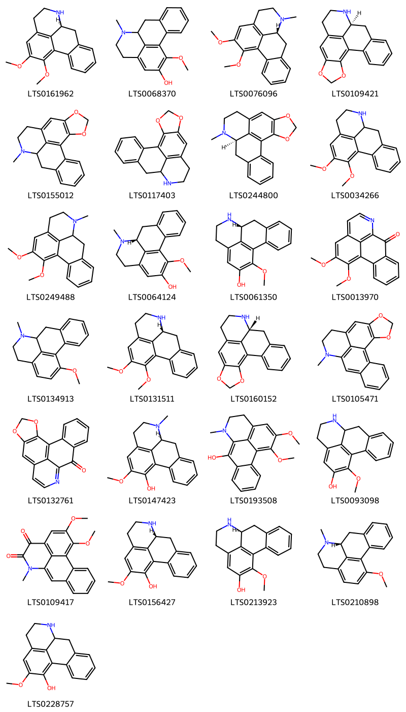{ group="compound" description="Cấu trúc hóa học của các hoạt chất thuộc nhóm *Aporphines* là (9s)-15,16-dimethoxy-10-azatetracyclo[7.7.1.0²,⁷.0¹³,¹⁷]heptadeca-1(16),2,4,6,13(17),14-hexaene [(LTS0161962)](https://lotus.naturalproducts.net/compound/lotus_id/LTS0161962), 16-methoxy-10-methyl-10-azatetracyclo[7.7.1.0²,⁷.0¹³,¹⁷]heptadeca-1(17),2,4,6,13,15-hexaen-15-ol [(LTS0068370)](https://lotus.naturalproducts.net/compound/lotus_id/LTS0068370), nuciferine [(LTS0076096)](https://lotus.naturalproducts.net/compound/lotus_id/LTS0076096), (12s)-3,5-dioxa-11-azapentacyclo[10.7.1.0²,⁶.0⁸,²⁰.0¹⁴,¹⁹]icosa-1(20),2(6),7,14,16,18-hexaene [(LTS0109421)](https://lotus.naturalproducts.net/compound/lotus_id/LTS0109421), 11-methyl-3,5-dioxa-11-azapentacyclo[10.7.1.0²,⁶.0⁸,²⁰.0¹⁴,¹⁹]icosa-1(20),2(6),7,14,16,18-hexaene [(LTS0155012)](https://lotus.naturalproducts.net/compound/lotus_id/LTS0155012), 3,5-dioxa-11-azapentacyclo[10.7.1.0²,⁶.0⁸,²⁰.0¹⁴,¹⁹]icosa-1(20),2(6),7,14,16,18-hexaene [(LTS0117403)](https://lotus.naturalproducts.net/compound/lotus_id/LTS0117403), (12r)-11-methyl-3,5-dioxa-11-azapentacyclo[10.7.1.0²,⁶.0⁸,²⁰.0¹⁴,¹⁹]icosa-1(20),2(6),7,14,16,18-hexaene [(LTS0244800)](https://lotus.naturalproducts.net/compound/lotus_id/LTS0244800), nornuciferine [(LTS0034266)](https://lotus.naturalproducts.net/compound/lotus_id/LTS0034266), nuciferine [(LTS0249488)](https://lotus.naturalproducts.net/compound/lotus_id/LTS0249488), (9r)-16-methoxy-10-methyl-10-azatetracyclo[7.7.1.0²,⁷.0¹³,¹⁷]heptadeca-1(17),2,4,6,13,15-hexaen-15-ol [(LTS0064124)](https://lotus.naturalproducts.net/compound/lotus_id/LTS0064124), r-(-)-asimilobine [(LTS0061350)](https://lotus.naturalproducts.net/compound/lotus_id/LTS0061350), lysicamine [(LTS0013970)](https://lotus.naturalproducts.net/compound/lotus_id/LTS0013970), 16-methoxy-10-methyl-10-azatetracyclo[7.7.1.0²,⁷.0¹³,¹⁷]heptadeca-1(17),2,4,6,13,15-hexaene [(LTS0134913)](https://lotus.naturalproducts.net/compound/lotus_id/LTS0134913), (9r)-15,16-dimethoxy-10-azatetracyclo[7.7.1.0²,⁷.0¹³,¹⁷]heptadeca-1(16),2,4,6,13(17),14-hexaene [(LTS0131511)](https://lotus.naturalproducts.net/compound/lotus_id/LTS0131511), anonaine [(LTS0160152)](https://lotus.naturalproducts.net/compound/lotus_id/LTS0160152), 11-methyl-3,5-dioxa-11-azapentacyclo[10.7.1.0²,⁶.0⁸,²⁰.0¹⁴,¹⁹]icosa-1(20),2(6),7,12,14(19),15,17-heptaene [(LTS0105471)](https://lotus.naturalproducts.net/compound/lotus_id/LTS0105471), liriodenine [(LTS0132761)](https://lotus.naturalproducts.net/compound/lotus_id/LTS0132761), (9s)-15-methoxy-10-methyl-10-azatetracyclo[7.7.1.0²,⁷.0¹³,¹⁷]heptadeca-1(16),2,4,6,13(17),14-hexaen-16-ol [(LTS0147423)](https://lotus.naturalproducts.net/compound/lotus_id/LTS0147423), 15,16-dimethoxy-10-methyl-10-azatetracyclo[7.7.1.0²,⁷.0¹³,¹⁷]heptadeca-1(17),2(7),3,5,8,13,15-heptaen-8-ol [(LTS0193508)](https://lotus.naturalproducts.net/compound/lotus_id/LTS0193508), 16-methoxy-10-azatetracyclo[7.7.1.0²,⁷.0¹³,¹⁷]heptadeca-1(17),2,4,6,13,15-hexaen-15-ol [(LTS0093098)](https://lotus.naturalproducts.net/compound/lotus_id/LTS0093098), 15,16-dimethoxy-10-methyl-10-azatetracyclo[7.7.1.0²,⁷.0¹³,¹⁷]heptadeca-1(17),2(7),3,5,8,13,15-heptaene-11,12-dione [(LTS0109417)](https://lotus.naturalproducts.net/compound/lotus_id/LTS0109417), (-)-caaverine [(LTS0156427)](https://lotus.naturalproducts.net/compound/lotus_id/LTS0156427), asimilobine [(LTS0213923)](https://lotus.naturalproducts.net/compound/lotus_id/LTS0213923), (9r)-16-methoxy-10-methyl-10-azatetracyclo[7.7.1.0²,⁷.0¹³,¹⁷]heptadeca-1(17),2,4,6,13,15-hexaene [(LTS0210898)](https://lotus.naturalproducts.net/compound/lotus_id/LTS0210898), 15-methoxy-10-azatetracyclo[7.7.1.0²,⁷.0¹³,¹⁷]heptadeca-1(16),2,4,6,13(17),14-hexaen-16-ol [(LTS0228757)](https://lotus.naturalproducts.net/compound/lotus_id/LTS0228757)." }

                                                              
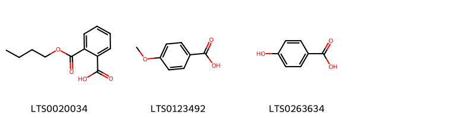{ group="compound" description="Cấu trúc hóa học của các hoạt chất thuộc nhóm *Benzene and substituted derivatives* là mono-n-butylphthalate [(LTS0020034)](https://lotus.naturalproducts.net/compound/lotus_id/LTS0020034), p-anisic acid [(LTS0123492)](https://lotus.naturalproducts.net/compound/lotus_id/LTS0123492), p-hydroxybenzoic acid [(LTS0263634)](https://lotus.naturalproducts.net/compound/lotus_id/LTS0263634)." }

                                                              
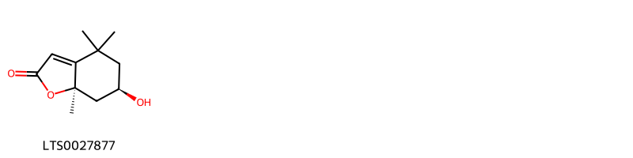{ group="compound" description="Cấu trúc hóa học của các hoạt chất thuộc nhóm *Benzofurans* là (6r,7ar)-6-hydroxy-4,4,7a-trimethyl-6,7-dihydro-5h-1-benzofuran-2-one [(LTS0027877)](https://lotus.naturalproducts.net/compound/lotus_id/LTS0027877)." }

                                                              
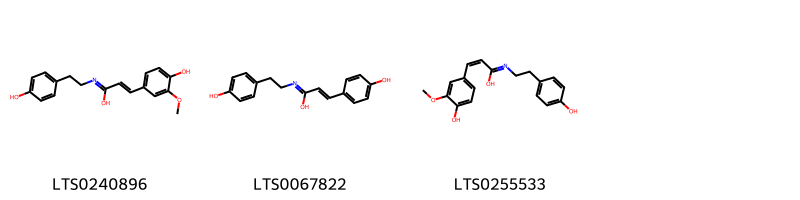{ group="compound" description="Cấu trúc hóa học của các hoạt chất thuộc nhóm *Cinnamic acids and derivatives* là 3-(4-hydroxy-3-methoxyphenyl)-n-[2-(4-hydroxyphenyl)ethyl]prop-2-enimidic acid [(LTS0240896)](https://lotus.naturalproducts.net/compound/lotus_id/LTS0240896), (2e)-3-(4-hydroxyphenyl)-n-[2-(4-hydroxyphenyl)ethyl]prop-2-enimidic acid [(LTS0067822)](https://lotus.naturalproducts.net/compound/lotus_id/LTS0067822), (2z)-3-(4-hydroxy-3-methoxyphenyl)-n-[2-(4-hydroxyphenyl)ethyl]prop-2-enimidic acid [(LTS0255533)](https://lotus.naturalproducts.net/compound/lotus_id/LTS0255533)." }

                                                              
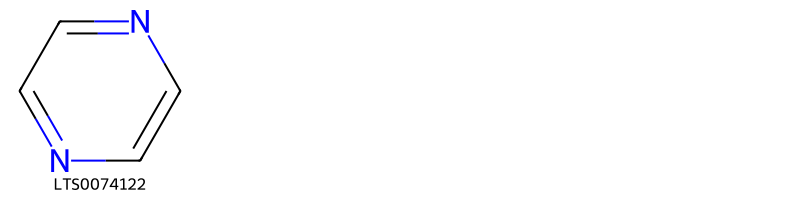{ group="compound" description="Cấu trúc hóa học của các hoạt chất thuộc nhóm *Diazines* là pyrazine [(LTS0074122)](https://lotus.naturalproducts.net/compound/lotus_id/LTS0074122)." }

                                                              
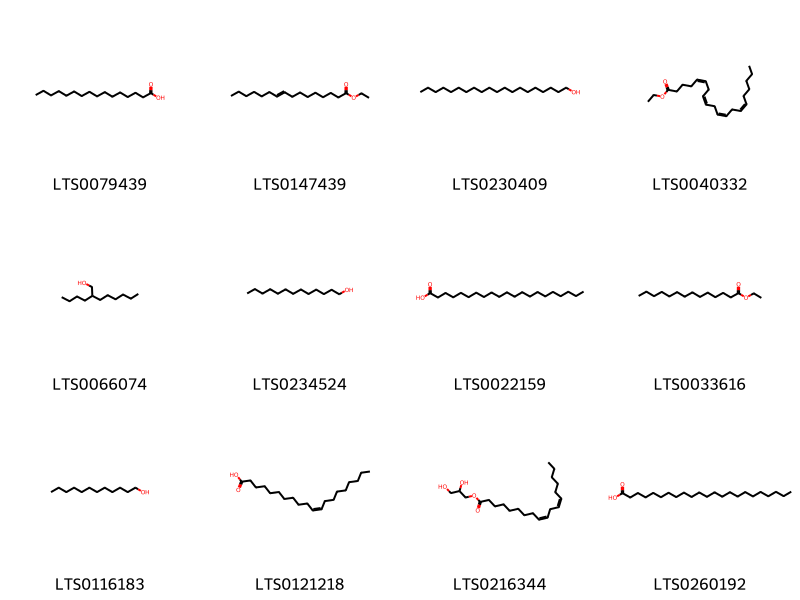{ group="compound" description="Cấu trúc hóa học của các hoạt chất thuộc nhóm *Fatty Acyls* là palmitic acid [(LTS0079439)](https://lotus.naturalproducts.net/compound/lotus_id/LTS0079439), ethyl hexadec-9-enoate [(LTS0147439)](https://lotus.naturalproducts.net/compound/lotus_id/LTS0147439), arachidyl alcohol [(LTS0230409)](https://lotus.naturalproducts.net/compound/lotus_id/LTS0230409), ethyl arachidonate [(LTS0040332)](https://lotus.naturalproducts.net/compound/lotus_id/LTS0040332), butyloctanol [(LTS0066074)](https://lotus.naturalproducts.net/compound/lotus_id/LTS0066074), tridecanol [(LTS0234524)](https://lotus.naturalproducts.net/compound/lotus_id/LTS0234524), heneicosanoic acid [(LTS0022159)](https://lotus.naturalproducts.net/compound/lotus_id/LTS0022159), ethylmyristate [(LTS0033616)](https://lotus.naturalproducts.net/compound/lotus_id/LTS0033616), 1-dodecanol [(LTS0116183)](https://lotus.naturalproducts.net/compound/lotus_id/LTS0116183), cis-11-eicosenoic acid [(LTS0121218)](https://lotus.naturalproducts.net/compound/lotus_id/LTS0121218), glyceryl 1-linoleate [(LTS0216344)](https://lotus.naturalproducts.net/compound/lotus_id/LTS0216344), tricosanoic acid [(LTS0260192)](https://lotus.naturalproducts.net/compound/lotus_id/LTS0260192)." }

                                                              
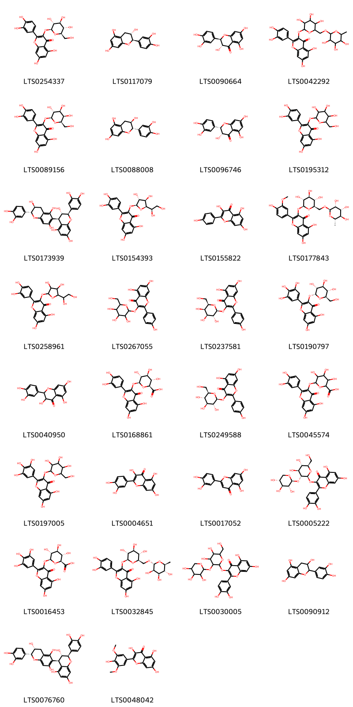{ group="compound" description="Cấu trúc hóa học của các hoạt chất thuộc nhóm *Flavonoids* là isoquercetin [(LTS0254337)](https://lotus.naturalproducts.net/compound/lotus_id/LTS0254337), (+)-catechol [(LTS0117079)](https://lotus.naturalproducts.net/compound/lotus_id/LTS0117079), (+)-taxifolin [(LTS0090664)](https://lotus.naturalproducts.net/compound/lotus_id/LTS0090664), rutin [(LTS0042292)](https://lotus.naturalproducts.net/compound/lotus_id/LTS0042292), hyperoside [(LTS0089156)](https://lotus.naturalproducts.net/compound/lotus_id/LTS0089156), α catechin [(LTS0088008)](https://lotus.naturalproducts.net/compound/lotus_id/LTS0088008), (+)-epitaxifolin [(LTS0096746)](https://lotus.naturalproducts.net/compound/lotus_id/LTS0096746), 2-(3,4-dihydroxyphenyl)-5,7-dihydroxy-3-{[3,4,5-trihydroxy-6-(hydroxymethyl)oxan-2-yl]oxy}chromen-4-one [(LTS0195312)](https://lotus.naturalproducts.net/compound/lotus_id/LTS0195312), (2r,3s,4r)-2-(3,4-dihydroxyphenyl)-4-[(2r,3s)-2-(3,4-dihydroxyphenyl)-3,5,7-trihydroxy-3,4-dihydro-2h-1-benzopyran-6-yl]-3,4-dihydro-2h-1-benzopyran-3,5,7-triol [(LTS0173939)](https://lotus.naturalproducts.net/compound/lotus_id/LTS0173939), quercetin-3-glucoside [(LTS0154393)](https://lotus.naturalproducts.net/compound/lotus_id/LTS0154393), kaempherol [(LTS0155822)](https://lotus.naturalproducts.net/compound/lotus_id/LTS0155822), narcissin [(LTS0177843)](https://lotus.naturalproducts.net/compound/lotus_id/LTS0177843), 3-{[5-(1,2-dihydroxyethyl)-3,4-dihydroxyoxolan-2-yl]oxy}-2-(3,4-dihydroxyphenyl)-5,7-dihydroxychromen-4-one [(LTS0258961)](https://lotus.naturalproducts.net/compound/lotus_id/LTS0258961), trifolin [(LTS0267055)](https://lotus.naturalproducts.net/compound/lotus_id/LTS0267055), trifolin [(LTS0237581)](https://lotus.naturalproducts.net/compound/lotus_id/LTS0237581), 5,7-dihydroxy-3-{[(2r,3r,4s,5s,6r)-3,4,5-trihydroxy-6-(hydroxymethyl)oxan-2-yl]oxy}-2-(3,4,5-trihydroxyphenyl)chromen-4-one [(LTS0190797)](https://lotus.naturalproducts.net/compound/lotus_id/LTS0190797), 2,3-dihydroquercetin [(LTS0040950)](https://lotus.naturalproducts.net/compound/lotus_id/LTS0040950), querciturone [(LTS0168861)](https://lotus.naturalproducts.net/compound/lotus_id/LTS0168861), astragalin [(LTS0249588)](https://lotus.naturalproducts.net/compound/lotus_id/LTS0249588), miquelianin [(LTS0045574)](https://lotus.naturalproducts.net/compound/lotus_id/LTS0045574), 5,7-dihydroxy-3-{[3,4,5-trihydroxy-6-(hydroxymethyl)oxan-2-yl]oxy}-2-(3,4,5-trihydroxyphenyl)chromen-4-one [(LTS0197005)](https://lotus.naturalproducts.net/compound/lotus_id/LTS0197005), quercetin [(LTS0004651)](https://lotus.naturalproducts.net/compound/lotus_id/LTS0004651), luteolin [(LTS0017052)](https://lotus.naturalproducts.net/compound/lotus_id/LTS0017052), 3-{[(2s,3r,4s,5s,6r)-4,5-dihydroxy-6-(hydroxymethyl)-3-{[(2s,3r,4s,5r)-3,4,5-trihydroxyoxan-2-yl]oxy}oxan-2-yl]oxy}-2-(3,4-dihydroxyphenyl)-5,7-dihydroxychromen-4-one [(LTS0005222)](https://lotus.naturalproducts.net/compound/lotus_id/LTS0005222), myricetin 3-o-glucuronide [(LTS0016453)](https://lotus.naturalproducts.net/compound/lotus_id/LTS0016453), 3-rutinosyl quercetin [(LTS0032845)](https://lotus.naturalproducts.net/compound/lotus_id/LTS0032845), 3-{[4,5-dihydroxy-6-(hydroxymethyl)-3-[(3,4,5-trihydroxyoxan-2-yl)oxy]oxan-2-yl]oxy}-2-(3,4-dihydroxyphenyl)-5,7-dihydroxychromen-4-one [(LTS0030005)](https://lotus.naturalproducts.net/compound/lotus_id/LTS0030005), catechol [(LTS0090912)](https://lotus.naturalproducts.net/compound/lotus_id/LTS0090912), (2r,3s,4r)-2-(3,4-dihydroxyphenyl)-4-[(2r,3r)-2-(3,4-dihydroxyphenyl)-3,5,7-trihydroxy-3,4-dihydro-2h-1-benzopyran-6-yl]-3,4-dihydro-2h-1-benzopyran-3,5,7-triol [(LTS0076760)](https://lotus.naturalproducts.net/compound/lotus_id/LTS0076760), syringetin [(LTS0048042)](https://lotus.naturalproducts.net/compound/lotus_id/LTS0048042)." }

                                                              
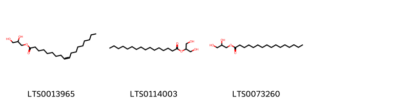{ group="compound" description="Cấu trúc hóa học của các hoạt chất thuộc nhóm *Glycerolipids* là oleoyl glycerol [(LTS0013965)](https://lotus.naturalproducts.net/compound/lotus_id/LTS0013965), glyceryl 2-palmitate [(LTS0114003)](https://lotus.naturalproducts.net/compound/lotus_id/LTS0114003), glyceryl palmitate [(LTS0073260)](https://lotus.naturalproducts.net/compound/lotus_id/LTS0073260)." }

                                                              
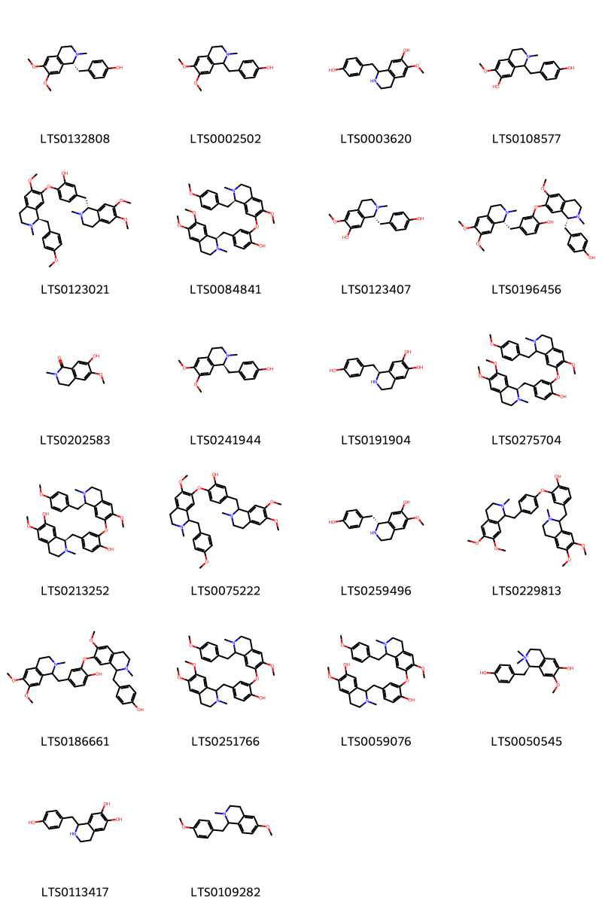{ group="compound" description="Cấu trúc hóa học của các hoạt chất thuộc nhóm *Isoquinolines and derivatives* là armepavine [(LTS0132808)](https://lotus.naturalproducts.net/compound/lotus_id/LTS0132808), (+/-)-armepavine [(LTS0002502)](https://lotus.naturalproducts.net/compound/lotus_id/LTS0002502), (rs)-coclaurine [(LTS0003620)](https://lotus.naturalproducts.net/compound/lotus_id/LTS0003620), 1-[(4-hydroxyphenyl)methyl]-6-methoxy-2-methyl-3,4-dihydro-1h-isoquinolin-7-ol [(LTS0108577)](https://lotus.naturalproducts.net/compound/lotus_id/LTS0108577), 5-{[(1r)-6,7-dimethoxy-2-methyl-3,4-dihydro-1h-isoquinolin-1-yl]methyl}-2-{[(1r)-6-methoxy-1-[(4-methoxyphenyl)methyl]-2-methyl-3,4-dihydro-1h-isoquinolin-7-yl]oxy}phenol [(LTS0123021)](https://lotus.naturalproducts.net/compound/lotus_id/LTS0123021), 4-{[(1r)-6,7-dimethoxy-2-methyl-3,4-dihydro-1h-isoquinolin-1-yl]methyl}-2-{[(1r)-6-methoxy-1-[(4-methoxyphenyl)methyl]-2-methyl-3,4-dihydro-1h-isoquinolin-7-yl]oxy}phenol [(LTS0084841)](https://lotus.naturalproducts.net/compound/lotus_id/LTS0084841), 2-methyl-1betah-coclaurine [(LTS0123407)](https://lotus.naturalproducts.net/compound/lotus_id/LTS0123407), 4-{[(1r)-6,7-dimethoxy-2-methyl-3,4-dihydro-1h-isoquinolin-1-yl]methyl}-2-{[(1r)-1-[(4-hydroxyphenyl)methyl]-6-methoxy-2-methyl-3,4-dihydro-1h-isoquinolin-7-yl]oxy}phenol [(LTS0196456)](https://lotus.naturalproducts.net/compound/lotus_id/LTS0196456), thalifolin [(LTS0202583)](https://lotus.naturalproducts.net/compound/lotus_id/LTS0202583), (+)-armepavine [(LTS0241944)](https://lotus.naturalproducts.net/compound/lotus_id/LTS0241944), (-)-higenamine [(LTS0191904)](https://lotus.naturalproducts.net/compound/lotus_id/LTS0191904), 4-{[(1r)-6,7-dimethoxy-2-methyl-3,4-dihydro-1h-isoquinolin-1-yl]methyl}-2-({6-methoxy-1-[(4-methoxyphenyl)methyl]-2-methyl-3,4-dihydro-1h-isoquinolin-7-yl}oxy)phenol [(LTS0275704)](https://lotus.naturalproducts.net/compound/lotus_id/LTS0275704), (1r)-1-[(4-hydroxy-3-{[(1r)-6-methoxy-1-[(4-methoxyphenyl)methyl]-2-methyl-3,4-dihydro-1h-isoquinolin-7-yl]oxy}phenyl)methyl]-6-methoxy-2-methyl-3,4-dihydro-1h-isoquinolin-7-ol [(LTS0213252)](https://lotus.naturalproducts.net/compound/lotus_id/LTS0213252), 5-[(6,7-dimethoxy-2-methyl-3,4-dihydro-1h-isoquinolin-1-yl)methyl]-2-({6-methoxy-1-[(4-methoxyphenyl)methyl]-2-methyl-3,4-dihydro-1h-isoquinolin-7-yl}oxy)phenol [(LTS0075222)](https://lotus.naturalproducts.net/compound/lotus_id/LTS0075222), (+)-coclaurine [(LTS0259496)](https://lotus.naturalproducts.net/compound/lotus_id/LTS0259496), dauricine [(LTS0229813)](https://lotus.naturalproducts.net/compound/lotus_id/LTS0229813), 4-[(6,7-dimethoxy-2-methyl-3,4-dihydro-1h-isoquinolin-1-yl)methyl]-2-({1-[(4-hydroxyphenyl)methyl]-6-methoxy-2-methyl-3,4-dihydro-1h-isoquinolin-7-yl}oxy)phenol [(LTS0186661)](https://lotus.naturalproducts.net/compound/lotus_id/LTS0186661), 4-[(6,7-dimethoxy-2-methyl-3,4-dihydro-1h-isoquinolin-1-yl)methyl]-2-({6-methoxy-1-[(4-methoxyphenyl)methyl]-2-methyl-3,4-dihydro-1h-isoquinolin-7-yl}oxy)phenol [(LTS0251766)](https://lotus.naturalproducts.net/compound/lotus_id/LTS0251766), 1-{[4-hydroxy-3-({6-methoxy-1-[(4-methoxyphenyl)methyl]-2-methyl-3,4-dihydro-1h-isoquinolin-7-yl}oxy)phenyl]methyl}-6-methoxy-2-methyl-3,4-dihydro-1h-isoquinolin-7-ol [(LTS0059076)](https://lotus.naturalproducts.net/compound/lotus_id/LTS0059076), lotusine [(LTS0050545)](https://lotus.naturalproducts.net/compound/lotus_id/LTS0050545), higenamine [(LTS0113417)](https://lotus.naturalproducts.net/compound/lotus_id/LTS0113417), 6-methoxy-1-[(4-methoxyphenyl)methyl]-2-methyl-3,4-dihydro-1h-isoquinoline [(LTS0109282)](https://lotus.naturalproducts.net/compound/lotus_id/LTS0109282)." }

                                                              
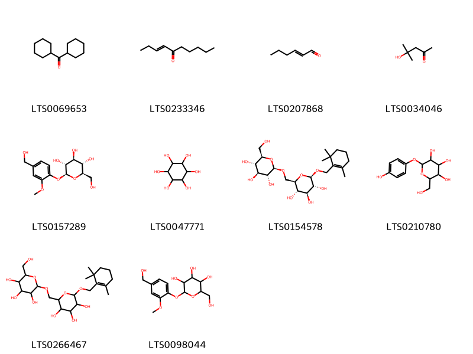{ group="compound" description="Cấu trúc hóa học của các hoạt chất thuộc nhóm *Organooxygen compounds* là methanone, dicyclohexyl- [(LTS0069653)](https://lotus.naturalproducts.net/compound/lotus_id/LTS0069653), dec-3-en-5-one [(LTS0233346)](https://lotus.naturalproducts.net/compound/lotus_id/LTS0233346), (e)-2-hexenal [(LTS0207868)](https://lotus.naturalproducts.net/compound/lotus_id/LTS0207868), diacetone alcohol [(LTS0034046)](https://lotus.naturalproducts.net/compound/lotus_id/LTS0034046), vanilloloside [(LTS0157289)](https://lotus.naturalproducts.net/compound/lotus_id/LTS0157289), (-)-inositol [(LTS0047771)](https://lotus.naturalproducts.net/compound/lotus_id/LTS0047771), (2r,3s,4s,5r,6r)-2-({[(2r,3r,4s,5s,6r)-3,4,5-trihydroxy-6-(hydroxymethyl)oxan-2-yl]oxy}methyl)-6-[(2,6,6-trimethylcyclohex-1-en-1-yl)methoxy]oxane-3,4,5-triol [(LTS0154578)](https://lotus.naturalproducts.net/compound/lotus_id/LTS0154578), arbutin [(LTS0210780)](https://lotus.naturalproducts.net/compound/lotus_id/LTS0210780), 2-({[3,4,5-trihydroxy-6-(hydroxymethyl)oxan-2-yl]oxy}methyl)-6-[(2,6,6-trimethylcyclohex-1-en-1-yl)methoxy]oxane-3,4,5-triol [(LTS0266467)](https://lotus.naturalproducts.net/compound/lotus_id/LTS0266467), 2-(hydroxymethyl)-6-[4-(hydroxymethyl)-2-methoxyphenoxy]oxane-3,4,5-triol [(LTS0098044)](https://lotus.naturalproducts.net/compound/lotus_id/LTS0098044)." }

                                                              
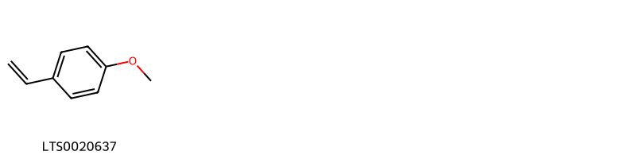{ group="compound" description="Cấu trúc hóa học của các hoạt chất thuộc nhóm *Phenol ethers* là 4-vinylanisole [(LTS0020637)](https://lotus.naturalproducts.net/compound/lotus_id/LTS0020637)." }

                                                              
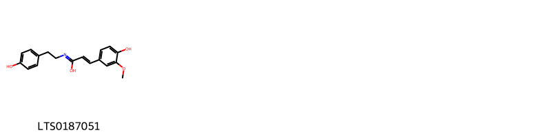{ group="compound" description="Cấu trúc hóa học của các hoạt chất thuộc nhóm *Phenols* là (2e)-3-(4-hydroxy-3-methoxyphenyl)-n-[2-(4-hydroxyphenyl)ethyl]prop-2-enimidic acid [(LTS0187051)](https://lotus.naturalproducts.net/compound/lotus_id/LTS0187051)." }

                                                              
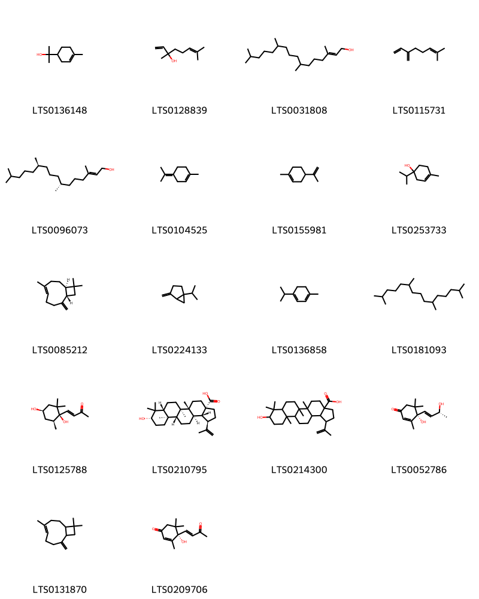{ group="compound" description="Cấu trúc hóa học của các hoạt chất thuộc nhóm *Prenol lipids* là terpineol [(LTS0136148)](https://lotus.naturalproducts.net/compound/lotus_id/LTS0136148), linalool, (+-)- [(LTS0128839)](https://lotus.naturalproducts.net/compound/lotus_id/LTS0128839), phytol [(LTS0031808)](https://lotus.naturalproducts.net/compound/lotus_id/LTS0031808), α-myrcene [(LTS0115731)](https://lotus.naturalproducts.net/compound/lotus_id/LTS0115731), phytol [(LTS0096073)](https://lotus.naturalproducts.net/compound/lotus_id/LTS0096073), terpinolene [(LTS0104525)](https://lotus.naturalproducts.net/compound/lotus_id/LTS0104525), limonene,  [(LTS0155981)](https://lotus.naturalproducts.net/compound/lotus_id/LTS0155981), 4-terpineol [(LTS0253733)](https://lotus.naturalproducts.net/compound/lotus_id/LTS0253733), caryophyllene [(LTS0085212)](https://lotus.naturalproducts.net/compound/lotus_id/LTS0085212), sabinene [(LTS0224133)](https://lotus.naturalproducts.net/compound/lotus_id/LTS0224133), terpinene [(LTS0136858)](https://lotus.naturalproducts.net/compound/lotus_id/LTS0136858), pristane [(LTS0181093)](https://lotus.naturalproducts.net/compound/lotus_id/LTS0181093), (3e)-4-[(1r,4r,6s)-1,4-dihydroxy-2,2,6-trimethylcyclohexyl]but-3-en-2-one [(LTS0125788)](https://lotus.naturalproducts.net/compound/lotus_id/LTS0125788), betulinic acid [(LTS0210795)](https://lotus.naturalproducts.net/compound/lotus_id/LTS0210795), 9-hydroxy-5a,5b,8,8,11a-pentamethyl-1-(prop-1-en-2-yl)-hexadecahydrocyclopenta[a]chrysene-3a-carboxylic acid [(LTS0214300)](https://lotus.naturalproducts.net/compound/lotus_id/LTS0214300), (6s,9r)-vomifoliol [(LTS0052786)](https://lotus.naturalproducts.net/compound/lotus_id/LTS0052786), caryophyllene [(LTS0131870)](https://lotus.naturalproducts.net/compound/lotus_id/LTS0131870), dehydrovomifoliol [(LTS0209706)](https://lotus.naturalproducts.net/compound/lotus_id/LTS0209706)." }

                                                              
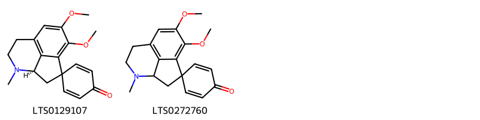{ group="compound" description="Cấu trúc hóa học của các hoạt chất thuộc nhóm *Proaporphines* là pronuciferine [(LTS0129107)](https://lotus.naturalproducts.net/compound/lotus_id/LTS0129107), 10',11'-dimethoxy-5'-methyl-5'-azaspiro[cyclohexane-1,2'-tricyclo[6.3.1.0⁴,¹²]dodecane]-1'(11'),2,5,8'(12'),9'-pentaen-4-one [(LTS0272760)](https://lotus.naturalproducts.net/compound/lotus_id/LTS0272760)." }

                                                              
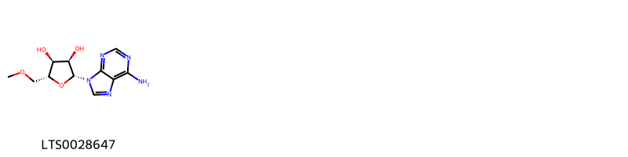{ group="compound" description="Cấu trúc hóa học của các hoạt chất thuộc nhóm *Purine nucleosides* là (2r,3r,4s,5r)-2-(6-aminopurin-9-yl)-5-(methoxymethyl)oxolane-3,4-diol [(LTS0028647)](https://lotus.naturalproducts.net/compound/lotus_id/LTS0028647)." }

                                                              
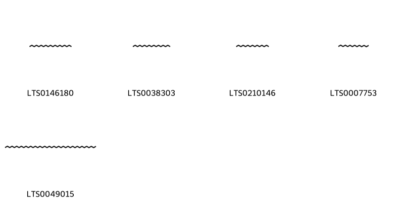{ group="compound" description="Cấu trúc hóa học của các hoạt chất thuộc nhóm *Saturated hydrocarbons* là nonadecane [(LTS0146180)](https://lotus.naturalproducts.net/compound/lotus_id/LTS0146180), heptadecane [(LTS0038303)](https://lotus.naturalproducts.net/compound/lotus_id/LTS0038303), pentadecane [(LTS0210146)](https://lotus.naturalproducts.net/compound/lotus_id/LTS0210146), tetradecane [(LTS0007753)](https://lotus.naturalproducts.net/compound/lotus_id/LTS0007753), tetracontane [(LTS0049015)](https://lotus.naturalproducts.net/compound/lotus_id/LTS0049015)." }

                                                              
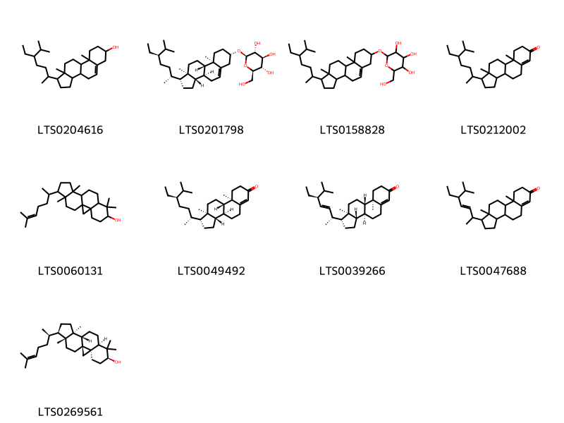{ group="compound" description="Cấu trúc hóa học của các hoạt chất thuộc nhóm *Steroids and steroid derivatives* là stigmast-5-en-3-ol, (3β)- [(LTS0204616)](https://lotus.naturalproducts.net/compound/lotus_id/LTS0204616), sitogluside [(LTS0201798)](https://lotus.naturalproducts.net/compound/lotus_id/LTS0201798), 2-{[1-(5-ethyl-6-methylheptan-2-yl)-9a,11a-dimethyl-1h,2h,3h,3ah,3bh,4h,6h,7h,8h,9h,9bh,10h,11h-cyclopenta[a]phenanthren-7-yl]oxy}-6-(hydroxymethyl)oxane-3,4,5-triol [(LTS0158828)](https://lotus.naturalproducts.net/compound/lotus_id/LTS0158828), 1-(5-ethyl-6-methylheptan-2-yl)-9a,11a-dimethyl-1h,2h,3h,3ah,3bh,4h,5h,8h,9h,9bh,10h,11h-cyclopenta[a]phenanthren-7-one [(LTS0212002)](https://lotus.naturalproducts.net/compound/lotus_id/LTS0212002), cycloartenol [(LTS0060131)](https://lotus.naturalproducts.net/compound/lotus_id/LTS0060131), β-sitostenone [(LTS0049492)](https://lotus.naturalproducts.net/compound/lotus_id/LTS0049492), (1r,3as,3bs,9ar,9bs,11ar)-1-[(2r,3e,5s)-5-ethyl-6-methylhept-3-en-2-yl]-9a,11a-dimethyl-1h,2h,3h,3ah,3bh,4h,5h,8h,9h,9bh,10h,11h-cyclopenta[a]phenanthren-7-one [(LTS0039266)](https://lotus.naturalproducts.net/compound/lotus_id/LTS0039266), 1-(5-ethyl-6-methylhept-3-en-2-yl)-9a,11a-dimethyl-1h,2h,3h,3ah,3bh,4h,5h,8h,9h,9bh,10h,11h-cyclopenta[a]phenanthren-7-one [(LTS0047688)](https://lotus.naturalproducts.net/compound/lotus_id/LTS0047688), cycloartenol [(LTS0269561)](https://lotus.naturalproducts.net/compound/lotus_id/LTS0269561)." }

                                                              
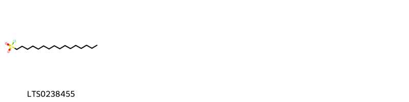{ group="compound" description="Cấu trúc hóa học của các hoạt chất thuộc nhóm *Sulfonyl halides* là hexadecane-1-sulfonyl chloride [(LTS0238455)](https://lotus.naturalproducts.net/compound/lotus_id/LTS0238455)." }

                                                              
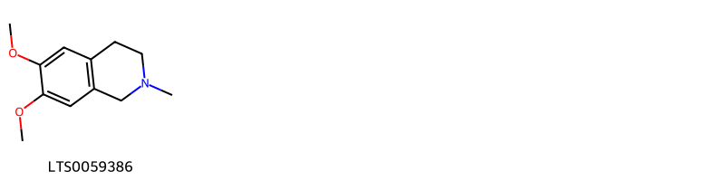{ group="compound" description="Cấu trúc hóa học của các hoạt chất thuộc nhóm *Tetrahydroisoquinolines* là 6,7-dimethoxy-2-methyl-3,4-dihydro-1h-isoquinoline [(LTS0059386)](https://lotus.naturalproducts.net/compound/lotus_id/LTS0059386)." }

                                                              
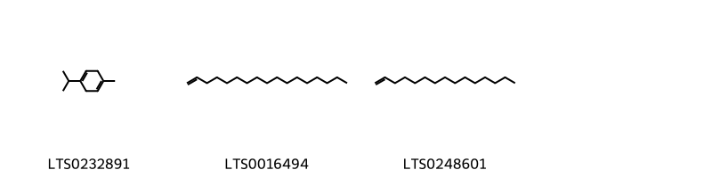{ group="compound" description="Cấu trúc hóa học của các hoạt chất thuộc nhóm *Unsaturated hydrocarbons* là α terpinene [(LTS0232891)](https://lotus.naturalproducts.net/compound/lotus_id/LTS0232891), heptadecene [(LTS0016494)](https://lotus.naturalproducts.net/compound/lotus_id/LTS0016494), 1-pentadecene [(LTS0248601)](https://lotus.naturalproducts.net/compound/lotus_id/LTS0248601)." }

:::

---

## IV. Tác dụng dược lý

Theo tài liệu quốc tế: nan

---

## V. Dược điển Việt Nam V

### Soi bột

nan

::: {#listing-soibot}
:::

### Vi phẫu

nan

::: {#listing-viphau}
:::

### Định tính

nan

### Định lượng

nan

### Thông tin khác 

- **Độ ẩm:** nan
- **Bảo quản:** nan

## VI. Dược điển Hồng kong

::: {#listing-DDHK}
:::

---

## VII. Y dược học cổ truyền

::: {.callout-note title = "nan" }

**Tên vị thuốc:** nan

**Tính:** nan

**Vị:** nan

**Quy kinh:**  nan

**Công năng chủ trị:** nan

**Phân loại theo thông tư:** nan

**Tác dụng theo y dược cổ truyền:** nan

**Chú ý:** nan

**Kiêng kỵ:** nan 

:::

::: {#listing-ViThuoc}
:::

