::: {.callout-note title = "Tóm tắt"}

Cúc hoa vàng có tên khoa học là Chrysanthemum indicum L., thuộc họ Cúc (Asteraceae). Phân bố trên thế giới tại China North-Central, China South-Central, China Southeast, East Himalaya, Inner Mongolia, Japan, Korea, Laos, Manchuria, Nepal, Taiwan, Vietnam. Ở Việt Nam được trồng nhiều tại các làng Nghĩa Trai (Hưng Yên), Nhật Tân (Hà Nội) và Tế Tiêu (Hà Tây). Trong dân gian cây được dùng làm thuốc chữa các chứng nhức đầu, đau mắt, chảy nước mắt, cao huyết áp, sốt, thanh nhiệt giải độc, kháng khuẩn, chống viêm. Trong cây chứa nhiều hoạt chất như flavonoid (Luteolin), vitamin A và tinh dầu. 

:::

## I. Thông tin về dược liệu 

::: {.panel-tabset}

### Định danh

- Dược liệu tiếng Việt: Cúc Hoa Vàng - Cụm Hoa
- Dược liệu tiếng Trung: 野菊花 (Ye Ju Hua)
- Dược liệu tiếng Anh: Chrysanthemum Indicum
- Dược liệu latin thông dụng: Flos Chrysanthemi Indici
- Dược liệu latin kiểu DĐVN: *Herba Ocimi Gratissimi*
- Dược liệu latin kiểu DĐVN: *Chrysanthemi Indici Flos*
- Dược liệu latin kiểu thông tư: *nan*
- Bộ phận dùng: Hoa (Flos)

### Mô tả dược liệu 

**Theo dược điển Việt nam V:** Cụm hoa hình đầu, màu vàng hơi nâu, đôi khi còn đính cuống; đường kính 0,5 – 1,2 cm. Tổng bao gồm 4 – 5 hàng lá bắc, mặt ngoài màu xanh hơi xám hoặc nâu nhạt, ở giữa hai bên mép rất nhạt và khô xác. Có 2 loại hoa: Hoa hình lưỡi nhỏ một vòng, đơn tính, không đều ở phía ngoài; nhiều hoa hình ống, đều, mẫu năm, lưỡng tính ở phía trong. Chất nhẹ, mùi thơm, vị đắng. 
 
**Mô tả dược liệu theo thông tư chế biến dược liệu theo phương pháp cổ truyền:** nan

### Chế biến 

**Chế biến theo dược điển việt nam V**: Thu hái vào mùa thu đông, lúc trời khô ráo hái hoa, đem xông lưu huỳnh, nén chặt khoảng một đêm tới khi thấy nước chảy ra có màu đen thì đem phơi nắng hoặc sấy ở 40 – 50 oC đến khô. 

**Chế biến theo thông tư:** nan

::: 

## II. Thông tin về thực vật

Dược liệu **Cúc Hoa Vàng - Cụm Hoa** từ bộ phận **Hoa** từ loài *Chrysanthemum indicum*.

**Mô tả thực vật:** Lá mọc so le, có thùy sâu, mép có nhiều răng, không cuống. Cụm hoa hình đầu ở nách lá hay ở đỉnh cành, đường kính 1-1,5cm, cuống dài 2-5cm. Lá bắc xếp 3-4 hàng. Các hoa vòng ngoài hình lưỡi xếp 2 vòng, các hoa ở trong hình ống, màu vàng. Quả bế, không có mào lông.

*Tài liệu tham khảo:* "Từ điển cây thuốc Việt Nam" - Võ Văn Chi 
Trong dược điển Việt nam, loài *Chrysanthemum indicum* được sử dụng làm dược liệu.

            
::: {.callout-note title = "Phân loại thực vật của *Chrysanthemum indicum*"}

**Kingdom:** Plantae 

**Phylum:** Tracheophyta 

**Order:** Asterales 
 
**Family:** Asteraceae 
 
**Genus:** Chrysanthemum 
 
**Species:** *Chrysanthemum indicum* 
 

:::

::: {style="display: grid;grid-template-columns: repeat(auto-fill, minmax(150px, 1fr));grid-gap: 1em;"}
{ group="GIBF" }

{ group="GIBF" }

{ group="GIBF" }

{ group="GIBF" }

{ group="GIBF" }

{ group="GIBF" }

{ group="GIBF" }

{ group="GIBF" }
:::

**Phân bố trên thế giới:** Germany, France, Spain, Switzerland, Chinese Taipei, China, Portugal, Hong Kong, Bulgaria, Italy, New Zealand, Japan, India, Korea, Republic of, Macao, Ukraine, Viet Nam

**Phân bố tại Việt nam:** Không có ghi nhận ở Việt Nam

<iframe src="Flos Chrysanthemi Indici/map_distribution.html" width="100%" height="600" style="border:none;"></iframe>

## III. Thành phần hóa học

Theo tài liệu của GS. Đỗ Tất Lợi:  - Cây chứa tinh dầu trong đó có Chrysol, chrysanthenone, artoglasin A, acaciin, linarin còn có yejuhualactone, chrysanthemin. Chất màu của hoa là do có chrysanthemaxanthin . Có Flavonoid (luteolin) dưới dạng glucosid, các hydrocacbon. Hạt chứa 15,8 % chất dầu nửa khô. Trong các hoa có các chất adenin, cholin, stachydrin, vitamin A.
    

Theo cơ sở dữ liệu lotus, loài *Chrysanthemum indicum* đã phân lập và xác định được **152** hoạt chất thuộc về các nhóm Allyl-type 1,3-dipolar organic compounds, Flavonoids, Carboxylic acids and derivatives, Organooxygen compounds, Benzene and substituted derivatives, Polycyclic hydrocarbons, Saturated hydrocarbons, Fatty Acyls, Tetrahydrofurans, Prenol lipids, Furanoid lignans, Unsaturated hydrocarbons trong bảng dưới đây.
        
| chemicalTaxonomyClassyfireClass          |   smiles_count |
|:-----------------------------------------|---------------:|
| Allyl-type 1,3-dipolar organic compounds |             26 |
| Benzene and substituted derivatives      |            111 |
| Carboxylic acids and derivatives         |             23 |
| Fatty Acyls                              |            144 |
| Flavonoids                               |           1635 |
| Furanoid lignans                         |             50 |
| Organooxygen compounds                   |            611 |
| Polycyclic hydrocarbons                  |             49 |
| Prenol lipids                            |           3400 |
| Saturated hydrocarbons                   |             45 |
| Tetrahydrofurans                         |             36 |
| Unsaturated hydrocarbons                 |             36 |

Danh sách chi tiết các hoạt chất như sau: 

::: {style="display: grid;grid-template-columns: repeat(auto-fill, minmax(150px, 1fr));grid-gap: 1em;"}

                                                              
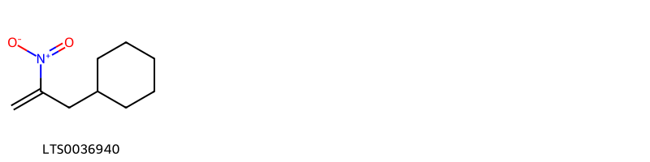{ group="compound" description="Cấu trúc hóa học của các hoạt chất thuộc nhóm *Allyl-type 1,3-dipolar organic compounds* là (2-nitroprop-2-en-1-yl)cyclohexane [(LTS0036940)](https://lotus.naturalproducts.net/compound/lotus_id/LTS0036940)." }

                                                              
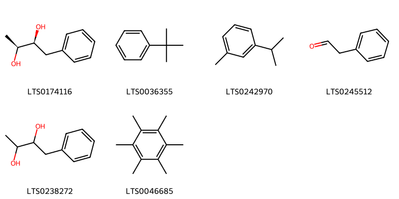{ group="compound" description="Cấu trúc hóa học của các hoạt chất thuộc nhóm *Benzene and substituted derivatives* là (2s,3s)-1-phenylbutane-2,3-diol [(LTS0174116)](https://lotus.naturalproducts.net/compound/lotus_id/LTS0174116), t-butylbenzene [(LTS0036355)](https://lotus.naturalproducts.net/compound/lotus_id/LTS0036355), m-cymene [(LTS0242970)](https://lotus.naturalproducts.net/compound/lotus_id/LTS0242970), phenylacetaldehyde [(LTS0245512)](https://lotus.naturalproducts.net/compound/lotus_id/LTS0245512), 1-phenylbutane-2,3-diol [(LTS0238272)](https://lotus.naturalproducts.net/compound/lotus_id/LTS0238272), hexamethylbenzene [(LTS0046685)](https://lotus.naturalproducts.net/compound/lotus_id/LTS0046685)." }

                                                              
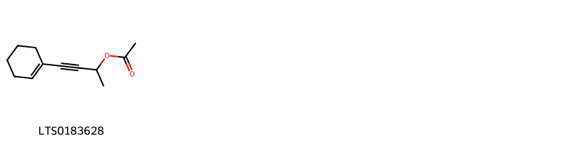{ group="compound" description="Cấu trúc hóa học của các hoạt chất thuộc nhóm *Carboxylic acids and derivatives* là 4-(cyclohex-1-en-1-yl)but-3-yn-2-yl acetate [(LTS0183628)](https://lotus.naturalproducts.net/compound/lotus_id/LTS0183628)." }

                                                              
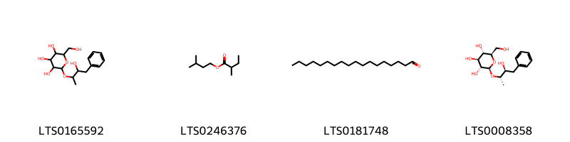{ group="compound" description="Cấu trúc hóa học của các hoạt chất thuộc nhóm *Fatty Acyls* là 2-[(3-hydroxy-4-phenylbutan-2-yl)oxy]-6-(hydroxymethyl)oxane-3,4,5-triol [(LTS0165592)](https://lotus.naturalproducts.net/compound/lotus_id/LTS0165592), isoamyl 2-methylbutyrate [(LTS0246376)](https://lotus.naturalproducts.net/compound/lotus_id/LTS0246376), octadecanal [(LTS0181748)](https://lotus.naturalproducts.net/compound/lotus_id/LTS0181748), (2r,3r,4s,5s,6r)-2-{[(2s,3s)-3-hydroxy-4-phenylbutan-2-yl]oxy}-6-(hydroxymethyl)oxane-3,4,5-triol [(LTS0008358)](https://lotus.naturalproducts.net/compound/lotus_id/LTS0008358)." }

                                                              
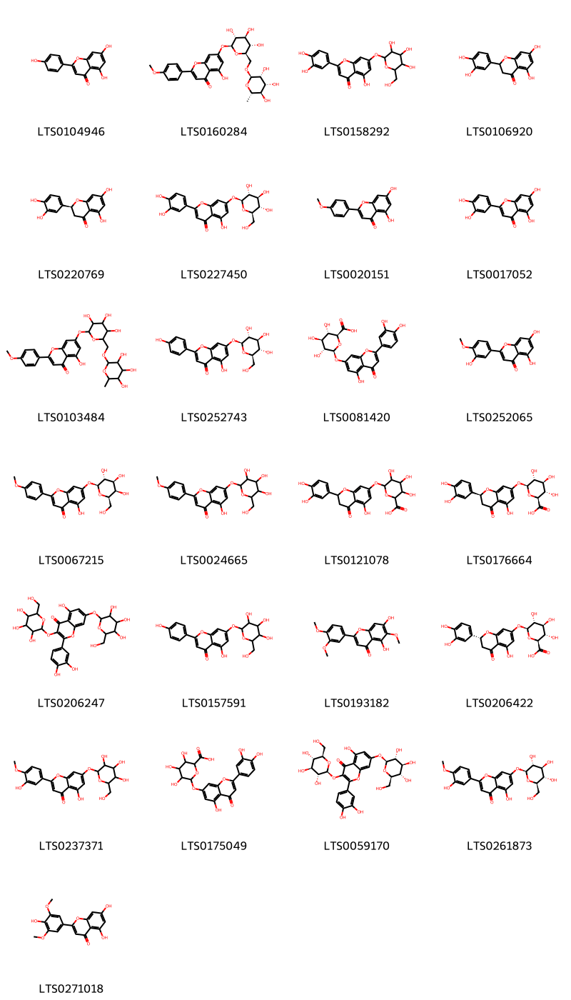{ group="compound" description="Cấu trúc hóa học của các hoạt chất thuộc nhóm *Flavonoids* là chamomile [(LTS0104946)](https://lotus.naturalproducts.net/compound/lotus_id/LTS0104946), linarin [(LTS0160284)](https://lotus.naturalproducts.net/compound/lotus_id/LTS0160284), 2-(3,4-dihydroxyphenyl)-5-hydroxy-7-{[3,4,5-trihydroxy-6-(hydroxymethyl)oxan-2-yl]oxy}chromen-4-one [(LTS0158292)](https://lotus.naturalproducts.net/compound/lotus_id/LTS0158292), (+/-)-eriodictyol [(LTS0106920)](https://lotus.naturalproducts.net/compound/lotus_id/LTS0106920), eriodictyol [(LTS0220769)](https://lotus.naturalproducts.net/compound/lotus_id/LTS0220769), luteolin 7-o-glucoside [(LTS0227450)](https://lotus.naturalproducts.net/compound/lotus_id/LTS0227450), acacetin [(LTS0020151)](https://lotus.naturalproducts.net/compound/lotus_id/LTS0020151), luteolin [(LTS0017052)](https://lotus.naturalproducts.net/compound/lotus_id/LTS0017052), 5-hydroxy-2-(4-methoxyphenyl)-7-[(3,4,5-trihydroxy-6-{[(3,4,5-trihydroxy-6-methyloxan-2-yl)oxy]methyl}oxan-2-yl)oxy]chromen-4-one [(LTS0103484)](https://lotus.naturalproducts.net/compound/lotus_id/LTS0103484), apigenin 7-o-β-glucoside [(LTS0252743)](https://lotus.naturalproducts.net/compound/lotus_id/LTS0252743), luteolin 7-o-glucuronide [(LTS0081420)](https://lotus.naturalproducts.net/compound/lotus_id/LTS0081420), diosmetin [(LTS0252065)](https://lotus.naturalproducts.net/compound/lotus_id/LTS0252065), 5-hydroxy-2-(4-methoxyphenyl)-7-{[(2s,3r,4s,5r,6r)-3,4,5-trihydroxy-6-(hydroxymethyl)oxan-2-yl]oxy}chromen-4-one [(LTS0067215)](https://lotus.naturalproducts.net/compound/lotus_id/LTS0067215), 5-hydroxy-2-(4-methoxyphenyl)-7-{[3,4,5-trihydroxy-6-(hydroxymethyl)oxan-2-yl]oxy}chromen-4-one [(LTS0024665)](https://lotus.naturalproducts.net/compound/lotus_id/LTS0024665), eriodictyol 7-glucuronide [(LTS0121078)](https://lotus.naturalproducts.net/compound/lotus_id/LTS0121078), (2s,3s,4s,5r,6s)-6-{[(2s)-2-(3,4-dihydroxyphenyl)-5-hydroxy-4-oxo-2,3-dihydro-1-benzopyran-7-yl]oxy}-3,4,5-trihydroxyoxane-2-carboxylic acid [(LTS0176664)](https://lotus.naturalproducts.net/compound/lotus_id/LTS0176664), 2-(3,4-dihydroxyphenyl)-5-hydroxy-3,7-bis({[3,4,5-trihydroxy-6-(hydroxymethyl)oxan-2-yl]oxy})chromen-4-one [(LTS0206247)](https://lotus.naturalproducts.net/compound/lotus_id/LTS0206247), apigetrin [(LTS0157591)](https://lotus.naturalproducts.net/compound/lotus_id/LTS0157591), eupatilin [(LTS0193182)](https://lotus.naturalproducts.net/compound/lotus_id/LTS0193182), (2s,3s,4s,5r,6s)-6-{[(2r)-2-(3,4-dihydroxyphenyl)-5-hydroxy-4-oxo-2,3-dihydro-1-benzopyran-7-yl]oxy}-3,4,5-trihydroxyoxane-2-carboxylic acid [(LTS0206422)](https://lotus.naturalproducts.net/compound/lotus_id/LTS0206422), 5-hydroxy-2-(3-hydroxy-4-methoxyphenyl)-7-{[3,4,5-trihydroxy-6-(hydroxymethyl)oxan-2-yl]oxy}chromen-4-one [(LTS0237371)](https://lotus.naturalproducts.net/compound/lotus_id/LTS0237371), 6-{[2-(3,4-dihydroxyphenyl)-5-hydroxy-4-oxochromen-7-yl]oxy}-3,4,5-trihydroxyoxane-2-carboxylic acid [(LTS0175049)](https://lotus.naturalproducts.net/compound/lotus_id/LTS0175049), quercetin 3,7-diglucoside [(LTS0059170)](https://lotus.naturalproducts.net/compound/lotus_id/LTS0059170), 5-hydroxy-2-(3-hydroxy-4-methoxyphenyl)-7-{[(2s,3r,4s,5s,6r)-3,4,5-trihydroxy-6-(hydroxymethyl)oxan-2-yl]oxy}chromen-4-one [(LTS0261873)](https://lotus.naturalproducts.net/compound/lotus_id/LTS0261873), tricin [(LTS0271018)](https://lotus.naturalproducts.net/compound/lotus_id/LTS0271018)." }

                                                              
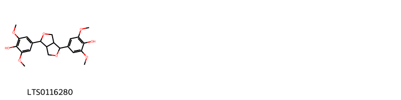{ group="compound" description="Cấu trúc hóa học của các hoạt chất thuộc nhóm *Furanoid lignans* là syringaresinol [(LTS0116280)](https://lotus.naturalproducts.net/compound/lotus_id/LTS0116280)." }

                                                              
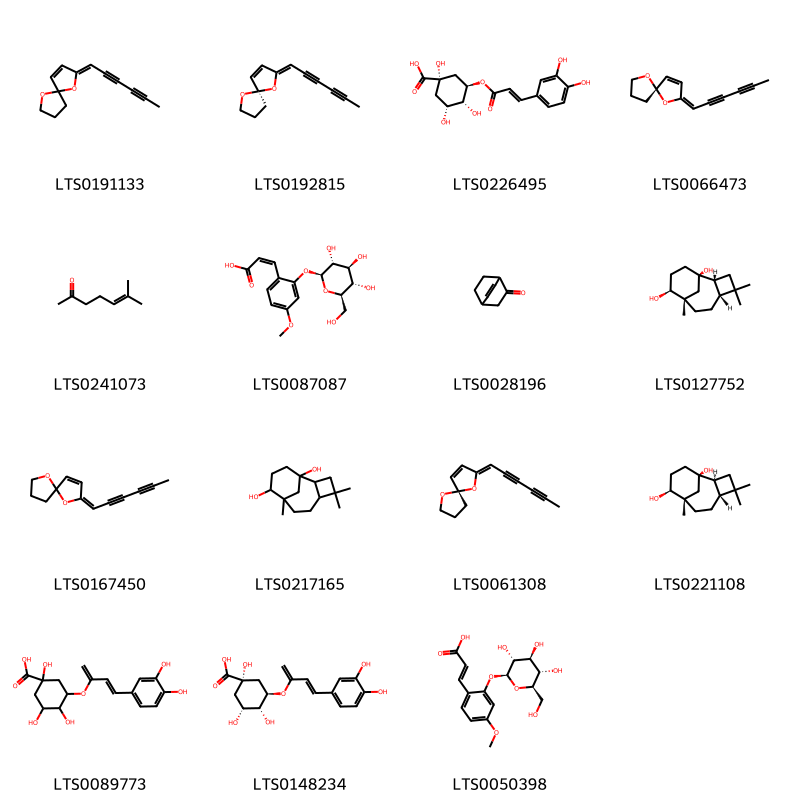{ group="compound" description="Cấu trúc hóa học của các hoạt chất thuộc nhóm *Organooxygen compounds* là 2-(hexa-2,4-diyn-1-ylidene)-1,6-dioxaspiro[4.4]non-3-ene [(LTS0191133)](https://lotus.naturalproducts.net/compound/lotus_id/LTS0191133), (2z,5r)-2-(hexa-2,4-diyn-1-ylidene)-1,6-dioxaspiro[4.4]non-3-ene [(LTS0192815)](https://lotus.naturalproducts.net/compound/lotus_id/LTS0192815), chlorogenic acid [(LTS0226495)](https://lotus.naturalproducts.net/compound/lotus_id/LTS0226495), (2e,5s)-2-(hexa-2,4-diyn-1-ylidene)-1,6-dioxaspiro[4.4]non-3-ene [(LTS0066473)](https://lotus.naturalproducts.net/compound/lotus_id/LTS0066473), 6-methyl-5-hepten-2-one [(LTS0241073)](https://lotus.naturalproducts.net/compound/lotus_id/LTS0241073), (2z)-3-(4-methoxy-2-{[(2s,3r,4s,5s,6r)-3,4,5-trihydroxy-6-(hydroxymethyl)oxan-2-yl]oxy}phenyl)prop-2-enoic acid [(LTS0087087)](https://lotus.naturalproducts.net/compound/lotus_id/LTS0087087), bicyclo[2.2.2]oct-5-en-2-one [(LTS0028196)](https://lotus.naturalproducts.net/compound/lotus_id/LTS0028196), (1r,2r,5r,8s,9s)-4,4,8-trimethyltricyclo[6.3.1.0²,⁵]dodecane-1,9-diol [(LTS0127752)](https://lotus.naturalproducts.net/compound/lotus_id/LTS0127752), (e)-tonghaosu [(LTS0167450)](https://lotus.naturalproducts.net/compound/lotus_id/LTS0167450), 4,4,8-trimethyltricyclo[6.3.1.0²,⁵]dodecane-1,9-diol [(LTS0217165)](https://lotus.naturalproducts.net/compound/lotus_id/LTS0217165), (2z,5s)-2-(hexa-2,4-diyn-1-ylidene)-1,6-dioxaspiro[4.4]non-3-ene [(LTS0061308)](https://lotus.naturalproducts.net/compound/lotus_id/LTS0061308), (1r,2s,5r,8s,9s)-4,4,8-trimethyltricyclo[6.3.1.0²,⁵]dodecane-1,9-diol [(LTS0221108)](https://lotus.naturalproducts.net/compound/lotus_id/LTS0221108), 3-{[4-(3,4-dihydroxyphenyl)buta-1,3-dien-2-yl]oxy}-1,4,5-trihydroxycyclohexane-1-carboxylic acid [(LTS0089773)](https://lotus.naturalproducts.net/compound/lotus_id/LTS0089773), (1s,3r,4r,5r)-3-{[(3e)-4-(3,4-dihydroxyphenyl)buta-1,3-dien-2-yl]oxy}-1,4,5-trihydroxycyclohexane-1-carboxylic acid [(LTS0148234)](https://lotus.naturalproducts.net/compound/lotus_id/LTS0148234), (2e)-3-(4-methoxy-2-{[(2s,3r,4s,5s,6r)-3,4,5-trihydroxy-6-(hydroxymethyl)oxan-2-yl]oxy}phenyl)prop-2-enoic acid [(LTS0050398)](https://lotus.naturalproducts.net/compound/lotus_id/LTS0050398)." }

                                                              
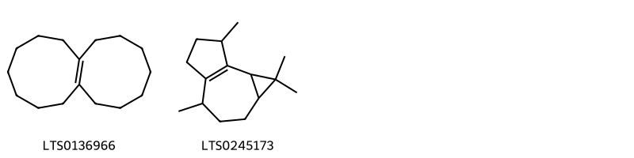{ group="compound" description="Cấu trúc hóa học của các hoạt chất thuộc nhóm *Polycyclic hydrocarbons* là 1,2,3,4,5,6,7,8,9,10,11,12,13,14-tetradecahydrononalene [(LTS0136966)](https://lotus.naturalproducts.net/compound/lotus_id/LTS0136966), 1,1,4,7-tetramethyl-1ah,2h,3h,4h,5h,6h,7h,7bh-cyclopropa[e]azulene [(LTS0245173)](https://lotus.naturalproducts.net/compound/lotus_id/LTS0245173)." }

                                                              
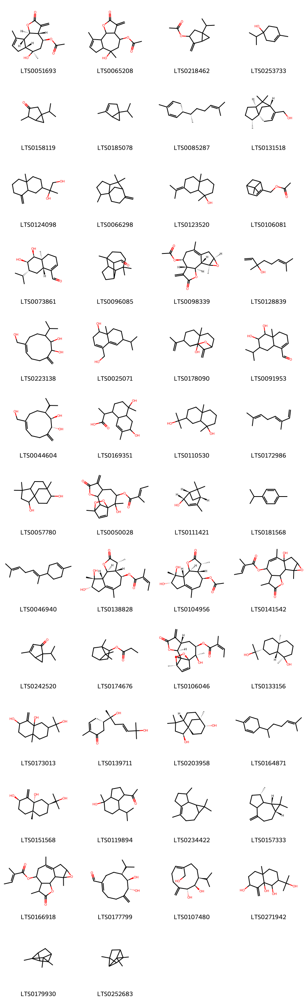{ group="compound" description="Cấu trúc hóa học của các hoạt chất thuộc nhóm *Prenol lipids* là (3ar,4s,6r,6ar,9ar,9br)-6-hydroxy-6,9-dimethyl-3-methylidene-2-oxo-3ah,4h,5h,6ah,7h,9ah,9bh-azuleno[4,5-b]furan-4-yl acetate [(LTS0051693)](https://lotus.naturalproducts.net/compound/lotus_id/LTS0051693), 6-hydroxy-6,9-dimethyl-3-methylidene-2-oxo-3ah,4h,5h,6ah,7h,9ah,9bh-azuleno[4,5-b]furan-4-yl acetate [(LTS0065208)](https://lotus.naturalproducts.net/compound/lotus_id/LTS0065208), 1-isopropyl-4-methylidenebicyclo[3.1.0]hexan-3-yl acetate [(LTS0218462)](https://lotus.naturalproducts.net/compound/lotus_id/LTS0218462), 4-terpineol [(LTS0253733)](https://lotus.naturalproducts.net/compound/lotus_id/LTS0253733), 3-isothujone [(LTS0158119)](https://lotus.naturalproducts.net/compound/lotus_id/LTS0158119), α-thujene [(LTS0185078)](https://lotus.naturalproducts.net/compound/lotus_id/LTS0185078), zingiberene [(LTS0085287)](https://lotus.naturalproducts.net/compound/lotus_id/LTS0085287), [(1s,2r,5s,7r)-2,6,6-trimethyltricyclo[5.3.1.0¹,⁵]undec-8-en-8-yl]methanol [(LTS0131518)](https://lotus.naturalproducts.net/compound/lotus_id/LTS0131518), 2-(4a-methyl-8-methylidene-octahydronaphthalen-2-yl)propane-1,2-diol [(LTS0124098)](https://lotus.naturalproducts.net/compound/lotus_id/LTS0124098), 2,6,6-trimethyl-8-methylidenetricyclo[5.3.1.0¹,⁵]undecane [(LTS0066298)](https://lotus.naturalproducts.net/compound/lotus_id/LTS0066298), 1,4a-dimethyl-7-(propan-2-ylidene)-hexahydro-2h-naphthalen-1-ol [(LTS0123520)](https://lotus.naturalproducts.net/compound/lotus_id/LTS0123520), myrtenyl acetate [(LTS0106081)](https://lotus.naturalproducts.net/compound/lotus_id/LTS0106081), (4as,5s,6r,7r,8ar)-5,6-dihydroxy-7-isopropyl-4a-methyl-4,5,6,7,8,8a-hexahydro-3h-naphthalene-1-carbaldehyde [(LTS0073861)](https://lotus.naturalproducts.net/compound/lotus_id/LTS0073861), 3,3,7-trimethyltricyclo[5.4.0.0²,⁹]undecane-8-carbaldehyde [(LTS0096085)](https://lotus.naturalproducts.net/compound/lotus_id/LTS0096085), arteglasin a [(LTS0098339)](https://lotus.naturalproducts.net/compound/lotus_id/LTS0098339), linalool, (+-)- [(LTS0128839)](https://lotus.naturalproducts.net/compound/lotus_id/LTS0128839), 6-(hydroxymethyl)-3-isopropyl-10-methylidenecyclodec-6-ene-1,2-diol [(LTS0223138)](https://lotus.naturalproducts.net/compound/lotus_id/LTS0223138), 4-(hydroxymethyl)-6-isopropyl-8a-methyl-2,6,7,8-tetrahydro-1h-naphthalen-1-ol [(LTS0025071)](https://lotus.naturalproducts.net/compound/lotus_id/LTS0025071), chrysantherol [(LTS0178090)](https://lotus.naturalproducts.net/compound/lotus_id/LTS0178090), 5,6-dihydroxy-7-isopropyl-4a-methyl-4,5,6,7,8,8a-hexahydro-3h-naphthalene-1-carbaldehyde [(LTS0091953)](https://lotus.naturalproducts.net/compound/lotus_id/LTS0091953), kikkanol d [(LTS0044604)](https://lotus.naturalproducts.net/compound/lotus_id/LTS0044604), 2-(4,6-dihydroxy-4,7-dimethyl-2,3,4a,5,6,8a-hexahydro-1h-naphthalen-1-yl)propanoic acid [(LTS0169351)](https://lotus.naturalproducts.net/compound/lotus_id/LTS0169351), 7-(2-hydroxypropan-2-yl)-1,4a-dimethyl-octahydronaphthalen-1-ol [(LTS0110530)](https://lotus.naturalproducts.net/compound/lotus_id/LTS0110530), 3,7-dimethyl-1,3,6-octatriene [(LTS0172986)](https://lotus.naturalproducts.net/compound/lotus_id/LTS0172986), 4,4,8-trimethyltricyclo[6.3.1.0¹,⁵]dodecane-2,9-diol [(LTS0057780)](https://lotus.naturalproducts.net/compound/lotus_id/LTS0057780), 2-hydroxy-2,11-dimethyl-6-methylidene-7-oxo-8,12,13-trioxatetracyclo[9.2.2.0¹,¹⁰.0⁵,⁹]pentadec-14-en-3-yl 2-methylbut-2-enoate [(LTS0050028)](https://lotus.naturalproducts.net/compound/lotus_id/LTS0050028), (s)-cis-verbenol [(LTS0111421)](https://lotus.naturalproducts.net/compound/lotus_id/LTS0111421), cymene [(LTS0181568)](https://lotus.naturalproducts.net/compound/lotus_id/LTS0181568), (e)-α-bisabolene [(LTS0046940)](https://lotus.naturalproducts.net/compound/lotus_id/LTS0046940), (3r,3ar,4s,8s,9r,9as,9bs)-8,9-dihydroxy-3,6,9-trimethyl-2-oxo-3h,3ah,4h,5h,7h,8h,9ah,9bh-azuleno[4,5-b]furan-4-yl (2z)-2-methylbut-2-enoate [(LTS0138828)](https://lotus.naturalproducts.net/compound/lotus_id/LTS0138828), (3r,3ar,4s,8s,9r,9as,9bs)-8,9-dihydroxy-3,6,9-trimethyl-2-oxo-3h,3ah,4h,5h,7h,8h,9ah,9bh-azuleno[4,5-b]furan-4-yl acetate [(LTS0104956)](https://lotus.naturalproducts.net/compound/lotus_id/LTS0104956), 10-hydroxy-5,9,14-trimethyl-4-oxo-3,13-dioxatetracyclo[8.4.0.0²,⁶.0¹²,¹⁴]tetradec-8-en-7-yl 2-methylbut-2-enoate [(LTS0141542)](https://lotus.naturalproducts.net/compound/lotus_id/LTS0141542), umbellulone [(LTS0242520)](https://lotus.naturalproducts.net/compound/lotus_id/LTS0242520), isobornyl propionate [(LTS0174676)](https://lotus.naturalproducts.net/compound/lotus_id/LTS0174676), (1s,2r,3r,5s,9s,10s,11r)-2-hydroxy-2,11-dimethyl-6-methylidene-7-oxo-8,12,13-trioxatetracyclo[9.2.2.0¹,¹⁰.0⁵,⁹]pentadec-14-en-3-yl (2z)-2-methylbut-2-enoate [(LTS0106046)](https://lotus.naturalproducts.net/compound/lotus_id/LTS0106046), proximadiol [(LTS0133156)](https://lotus.naturalproducts.net/compound/lotus_id/LTS0133156), 7-(2-hydroxypropan-2-yl)-4a-methyl-1-methylidene-hexahydro-2h-naphthalene-2,8a-diol [(LTS0173013)](https://lotus.naturalproducts.net/compound/lotus_id/LTS0173013), indicumenone [(LTS0139711)](https://lotus.naturalproducts.net/compound/lotus_id/LTS0139711), clovanediol [(LTS0203958)](https://lotus.naturalproducts.net/compound/lotus_id/LTS0203958), 2-methyl-5-(6-methylhept-5-en-2-yl)cyclohexa-1,3-diene [(LTS0164871)](https://lotus.naturalproducts.net/compound/lotus_id/LTS0164871), (2r,4ar,7s,8ar)-7-(2-hydroxypropan-2-yl)-4a-methyl-1-methylidene-hexahydro-2h-naphthalene-2,8a-diol [(LTS0151568)](https://lotus.naturalproducts.net/compound/lotus_id/LTS0151568), 1-(4-hydroxy-7-isopropyl-4-methyl-octahydroinden-1-yl)ethanone [(LTS0119894)](https://lotus.naturalproducts.net/compound/lotus_id/LTS0119894), 1,1,4,7-tetramethyl-1ah,2h,3h,5h,6h,7h,7ah,7bh-cyclopropa[e]azulene [(LTS0234422)](https://lotus.naturalproducts.net/compound/lotus_id/LTS0234422), (1ar,7s,7bs)-1,1,7-trimethyl-4-methylidene-octahydro-1ah-cyclopropa[e]azulene [(LTS0157333)](https://lotus.naturalproducts.net/compound/lotus_id/LTS0157333), 5,9,14-trimethyl-4-oxo-3,13-dioxatetracyclo[8.4.0.0²,⁶.0¹²,¹⁴]tetradec-9-en-7-yl 2-methylbut-2-enoate [(LTS0166918)](https://lotus.naturalproducts.net/compound/lotus_id/LTS0166918), kikkanol e [(LTS0177799)](https://lotus.naturalproducts.net/compound/lotus_id/LTS0177799), kikkanol f [(LTS0107480)](https://lotus.naturalproducts.net/compound/lotus_id/LTS0107480), 2-(2-hydroxypropan-2-yl)-4a-methyl-8-methylidene-hexahydro-1h-naphthalene-1,7,8a-triol [(LTS0271942)](https://lotus.naturalproducts.net/compound/lotus_id/LTS0271942), tricyclene [(LTS0179930)](https://lotus.naturalproducts.net/compound/lotus_id/LTS0179930), 1,3,3-trimethyltricyclo[2.2.1.0²,⁶]heptane [(LTS0252683)](https://lotus.naturalproducts.net/compound/lotus_id/LTS0252683), 8,9-dihydroxy-3,6,9-trimethyl-2-oxo-3h,3ah,4h,5h,7h,8h,9ah,9bh-azuleno[4,5-b]furan-4-yl 2-methylbut-2-enoate [(LTS0184066)](https://lotus.naturalproducts.net/compound/lotus_id/LTS0184066), α-bisabolol [(LTS0250984)](https://lotus.naturalproducts.net/compound/lotus_id/LTS0250984), 1-[(1s,3ar,4r,7s,7as)-4-hydroxy-7-isopropyl-4-methyl-octahydroinden-1-yl]ethanone [(LTS0258092)](https://lotus.naturalproducts.net/compound/lotus_id/LTS0258092), (-)-α-curcumene [(LTS0216936)](https://lotus.naturalproducts.net/compound/lotus_id/LTS0216936), (1r,2r,4as,7s,8as)-2-(2-hydroxypropan-2-yl)-4a-methyl-8-methylidene-hexahydro-1h-naphthalene-1,7,8a-triol [(LTS0050012)](https://lotus.naturalproducts.net/compound/lotus_id/LTS0050012), 6,7-dihydroxy-8-isopropyl-5-methylidenecyclodec-1-ene-1-carbaldehyde [(LTS0272785)](https://lotus.naturalproducts.net/compound/lotus_id/LTS0272785), (6,7-dihydroxy-8-isopropyl-5-methylidenecyclodec-1-en-1-yl)methyl acetate [(LTS0222184)](https://lotus.naturalproducts.net/compound/lotus_id/LTS0222184), verbenone [(LTS0264577)](https://lotus.naturalproducts.net/compound/lotus_id/LTS0264577), kikkanol b [(LTS0064169)](https://lotus.naturalproducts.net/compound/lotus_id/LTS0064169), bornyl acetate [(LTS0060565)](https://lotus.naturalproducts.net/compound/lotus_id/LTS0060565), 1-isopropyl-4-methylbicyclo[3.1.0]hex-3-en-2-ol [(LTS0217646)](https://lotus.naturalproducts.net/compound/lotus_id/LTS0217646), 2-[(5r)-6,10-dimethylspiro[4.5]dec-6-en-2-yl]propan-2-ol [(LTS0220783)](https://lotus.naturalproducts.net/compound/lotus_id/LTS0220783), (1s,2r,3r,5s,9s,10s,11r)-2-hydroxy-2,11-dimethyl-6-methylidene-7-oxo-8,12,13-trioxatetracyclo[9.2.2.0¹,¹⁰.0⁵,⁹]pentadec-14-en-3-yl acetate [(LTS0100237)](https://lotus.naturalproducts.net/compound/lotus_id/LTS0100237), kikkanol a [(LTS0221193)](https://lotus.naturalproducts.net/compound/lotus_id/LTS0221193), kikkanol c [(LTS0152811)](https://lotus.naturalproducts.net/compound/lotus_id/LTS0152811), 6-isopropyl-8a-methyl-4-methylidene-hexahydro-1h-naphthalene-1,4a,5-triol [(LTS0051728)](https://lotus.naturalproducts.net/compound/lotus_id/LTS0051728), thymol [(LTS0168527)](https://lotus.naturalproducts.net/compound/lotus_id/LTS0168527), 1-isopropyl-4-methylbicyclo[3.1.0]hexan-3-ol [(LTS0051406)](https://lotus.naturalproducts.net/compound/lotus_id/LTS0051406), (1s,2s,5s,6r,7s,12r,14s)-5,9,14-trimethyl-4-oxo-3,13-dioxatetracyclo[8.4.0.0²,⁶.0¹²,¹⁴]tetradec-9-en-7-yl (2z)-2-methylbut-2-enoate [(LTS0068312)](https://lotus.naturalproducts.net/compound/lotus_id/LTS0068312), 6,10,14-trimethylpentadecan-2-one [(LTS0258077)](https://lotus.naturalproducts.net/compound/lotus_id/LTS0258077), 4,7,7-trimethylbicyclo[4.1.0]hept-2-ene [(LTS0156738)](https://lotus.naturalproducts.net/compound/lotus_id/LTS0156738), curcumene [(LTS0190074)](https://lotus.naturalproducts.net/compound/lotus_id/LTS0190074), nerolidol isomers [(LTS0007569)](https://lotus.naturalproducts.net/compound/lotus_id/LTS0007569), (e,z)-α-farnesene [(LTS0061525)](https://lotus.naturalproducts.net/compound/lotus_id/LTS0061525), (2s)-2-[(1s,4s,4as,6r,8as)-4,6-dihydroxy-4,7-dimethyl-2,3,4a,5,6,8a-hexahydro-1h-naphthalen-1-yl]propanoic acid [(LTS0256045)](https://lotus.naturalproducts.net/compound/lotus_id/LTS0256045), [(1e,6r,7r,8s)-6,7-dihydroxy-8-isopropyl-5-methylidenecyclodec-1-en-1-yl]methyl acetate [(LTS0064054)](https://lotus.naturalproducts.net/compound/lotus_id/LTS0064054), terpinene [(LTS0136858)](https://lotus.naturalproducts.net/compound/lotus_id/LTS0136858), (1r,2s,5s,6r,7s,10s,12r,14s)-10-hydroxy-5,9,14-trimethyl-4-oxo-3,13-dioxatetracyclo[8.4.0.0²,⁶.0¹²,¹⁴]tetradec-8-en-7-yl (2z)-2-methylbut-2-enoate [(LTS0014104)](https://lotus.naturalproducts.net/compound/lotus_id/LTS0014104), chrysanthenone [(LTS0001245)](https://lotus.naturalproducts.net/compound/lotus_id/LTS0001245), (2r)-2-[(2r,4ar,8as)-4a-methyl-8-methylidene-octahydronaphthalen-2-yl]propane-1,2-diol [(LTS0019600)](https://lotus.naturalproducts.net/compound/lotus_id/LTS0019600), cedrene [(LTS0023956)](https://lotus.naturalproducts.net/compound/lotus_id/LTS0023956), [(1z,6r,7r,8s)-6,7-dihydroxy-8-isopropyl-5-methylidenecyclodec-1-en-1-yl]methyl acetate [(LTS0235997)](https://lotus.naturalproducts.net/compound/lotus_id/LTS0235997), cuminol [(LTS0021403)](https://lotus.naturalproducts.net/compound/lotus_id/LTS0021403), 8,9-dihydroxy-3,6,9-trimethyl-2-oxo-3h,3ah,4h,5h,7h,8h,9ah,9bh-azuleno[4,5-b]furan-4-yl acetate [(LTS0001798)](https://lotus.naturalproducts.net/compound/lotus_id/LTS0001798), sabinene hydrate [(LTS0236165)](https://lotus.naturalproducts.net/compound/lotus_id/LTS0236165), 2-hydroxy-2,11-dimethyl-6-methylidene-7-oxo-8,12,13-trioxatetracyclo[9.2.2.0¹,¹⁰.0⁵,⁹]pentadec-14-en-3-yl acetate [(LTS0091949)](https://lotus.naturalproducts.net/compound/lotus_id/LTS0091949), (1s,2s,5s,6r,7s,12r,14s)-5,9,14-trimethyl-4-oxo-3,13-dioxatetracyclo[8.4.0.0²,⁶.0¹²,¹⁴]tetradec-9-en-7-yl (2e)-2-methylbut-2-enoate [(LTS0049425)](https://lotus.naturalproducts.net/compound/lotus_id/LTS0049425), 4-isopropyl-6-methyl-1-methylidene-3,4,4a,7,8,8a-hexahydro-2h-naphthalene [(LTS0111070)](https://lotus.naturalproducts.net/compound/lotus_id/LTS0111070)." }

                                                              
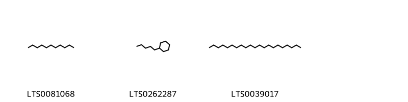{ group="compound" description="Cấu trúc hóa học của các hoạt chất thuộc nhóm *Saturated hydrocarbons* là undecane [(LTS0081068)](https://lotus.naturalproducts.net/compound/lotus_id/LTS0081068), pentylcyclohexane [(LTS0262287)](https://lotus.naturalproducts.net/compound/lotus_id/LTS0262287), heneicosane [(LTS0039017)](https://lotus.naturalproducts.net/compound/lotus_id/LTS0039017)." }

                                                              
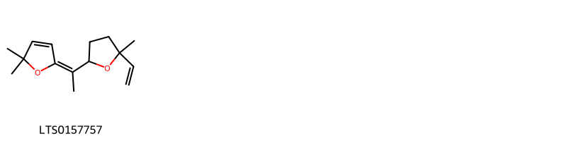{ group="compound" description="Cấu trúc hóa học của các hoạt chất thuộc nhóm *Tetrahydrofurans* là (5e)-5-[1-(5-ethenyl-5-methyloxolan-2-yl)ethylidene]-2,2-dimethylfuran [(LTS0157757)](https://lotus.naturalproducts.net/compound/lotus_id/LTS0157757)." }

                                                              
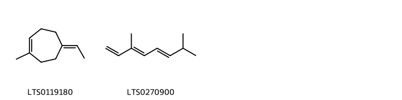{ group="compound" description="Cấu trúc hóa học của các hoạt chất thuộc nhóm *Unsaturated hydrocarbons* là 5-ethylidene-1-methylcyclohept-1-ene [(LTS0119180)](https://lotus.naturalproducts.net/compound/lotus_id/LTS0119180), (3e,5e)-3,7-dimethylocta-1,3,5-triene [(LTS0270900)](https://lotus.naturalproducts.net/compound/lotus_id/LTS0270900)." }

:::

---

## IV. Tác dụng dược lý

Theo tài liệu quốc tế: To remove toxic heat.

---

## V. Dược điển Việt Nam V

### Soi bột

Bột hoa màu vàng, mùi thơm. Soi kính hiển vi thấy: Mảnh cánh hoa màu vàng có tế bào thành mỏng nhăn nheo. Mảnh lá bắc có tế bào dài thành mỏng và tế bào dài thành dầy, có ống trao đổi rõ. Hạt phấn hoa hình cầu có gai, màu vàng. Lông che chở bị gẫy vụn. Mảnh núm nhụy có tế bào đầu tròn, kết lớp lên nhau, ở đầu núm tế bào dài nhô ra.

::: {#listing-soibot}
:::

### Vi phẫu

nan

::: {#listing-viphau}
:::

### Định tính

Lấy 3 g bột dược liệu, thêm 20 ml ethanol 96% (TT), đun sôi dưới ống sinh hàn hồi lưu khoảng 30 phút; lọc. Dịch lọc để làm phản ứng sau:Lấy 2 ml dịch lọc, thêm ít bột magnesi (TT) và 3 – 4 giọt acid hydrocloric (TT), đun nóng sẽ xuất hiện màu đỏ. Phương pháp sắc ký lớp mỏng (Phụ lục 5.4). Bản mỏng: Silica gel G. Dung môi khai triển: Ethyl acetat – acid formic – nước (8 : 1: 1). Dung dịch thử: Phần dịch lọc còn lại ở mục A được bốc hơi tới cắn; hoà tan cắn trong 20 ml nước nóng, lọc rồi lắc 2 lần với ethyl acetat (TT), mỗi lần 10 ml, tập trung dịch chiết, cô tới cắn, hoà cắn trong 1 ml ethanol (TT) được dung dịch thử. Dung dịch đối chiếu: Lấy 3 g Cúc hoa vàng (mẫu chuẩn), tiến hành chiết như mẫu thử. Cách tiến hành: Chấm lên bản mỏng 5 ml mỗi dung dịch trên, triển khai sắc ký đến khi dung môi đi được 15 cm, lấy bản mỏng ra, để khô ở nhiệt độ phòng, hiện màu bằng hơi amoniac (TT). Trên sắc ký đồ của dung dịch thử phải có 6 vết, trong đó 4 vết màu vàng nâu và 2 vết màu vàng xanh có cùng giá trị Rf  và màu sắc với các vết của dung dịch đối chiếu. c. Phương pháp sắc ký lớp mỏng (Phụ lục 5.4). Bản mỏng: Silica gel 6OF254. Dung môi khai triển: Ethyl acetat – 2-butanol – nước – acid formic (25 : 3 : 1 : 1). Dung dịch thử: Lấy 1 g bột dược liệu, thêm 20 ml methanol (TT), lắc siêu âm trong 10 min, lọc. Cô dịch lọc trên cách thủy đến cạn. Hòa cắn trong 1 ml ethanol (TT) được dung dịch thử. Dung dịch đối chiếu: Lấy 1 g bột Cúc hoa vàng (mẫu chuẩn), tiến hành chiết như mô tả ở phần Dung dịch thử. Cách tiến hành: Chấm riêng biệt lên bản mỏng 10 µl mỗi dung dịch trên. Sau khi khai triển, lấy bản mỏng ra khỏi bình sắc ký, để bay hơi hết dung môi ở nhiệt độ phòng. Phun dung dịch sắt (III) clorid 5 % trong ethanol (TT) đến khi hiện rõ vết. Quan sát dưới ánh sáng thường. Trên sắc ký đồ của dung dịch thử phải có các vết có cùng màu sắc và giá trị Rf với các vết trên sắc ký đồ của dung dịch đối chiếu.

### Định lượng

Chất chiết được trong dược liệu Không được ít hơn 30,0 % tỉnh theo dược liệu khô kiệt. Tiến hành theo phương pháp chiết nóng (Phụ lục 12.10), dùng ethanol 50 % (TT) làm dung môi.

### Thông tin khác 

- **Độ ẩm:** Không quá 13% (Phụ lục 12.13).
- **Bảo quản:** Để nơi khô, định kỳ xông lưu huỳnh. nn

## VI. Dược điển Hồng kong

::: {#listing-DDHK}
:::

---

## VII. Y dược học cổ truyền

::: {.callout-note title = "Cúc hoa" }

**Tên vị thuốc:** Cúc hoa

**Tính:** mát

**Vị:** ngọt hơi đắng

**Quy kinh:**  Tỳ vị, phế, thận

**Công năng chủ trị:** Thanh nhiệt, giải độc, tán phong, minh mục.Chủ trị: Các chứng hoa mắt, chóng mặt, nhức đầu, đau mắt đỏ, chảy nhiều nước mắt, huyết áp cao, đinh độc mụn nhọt, sưng đau.

**Phân loại theo thông tư:** nan

**Tác dụng theo y dược cổ truyền:** nan

**Chú ý:** nan

**Kiêng kỵ:** Tỳ vị hư hàn ỉa chảy không nên dùng. 

:::

::: {#listing-ViThuoc}
:::

