::: {.callout-note title = "Tóm tắt"}

nan

:::

## I. Thông tin về dược liệu 

::: {.panel-tabset}

### Định danh

- Dược liệu tiếng Việt: Kim Ngân - Hoa
- Dược liệu tiếng Trung: ? (?)
- Dược liệu tiếng Anh: ?
- Dược liệu latin thông dụng: Flos Lonicerae
- Dược liệu latin kiểu DĐVN: *nan*
- Dược liệu latin kiểu DĐVN: *Lonicerae Flos*
- Dược liệu latin kiểu thông tư: *nan*
- Bộ phận dùng: Hoa (Flos)

### Mô tả dược liệu 

**Theo dược điển Việt nam V:** Nụ hoa hình ống hơi cong queo, dài 1 cm đến 5 cm, đầu to, đường kính khoảng 0,2 cm đến 0,5 cm. Mặt ngoài màu vàng đến nâu, phủ đầy lông ngắn. Phía dưới ống tràng có 5 lá đài nhò, màu lục. Bóp mạnh đầu nụ sẽ thấy 5 nhị và 1 vòi nhụy. Mùi thơm nhẹ, vị hơi đắng. Hoa đã nở dài từ 2 cm đến 5 cm, tràng chia thành 2 môi cuộn ngược lại. Môi trên xẻ thành 4 thùy, môi dưới nguyên. Nhị và vòi nhụy thường thò ra ngoài tràng hoa. 
 
**Mô tả dược liệu theo thông tư chế biến dược liệu theo phương pháp cổ truyền:** nan

### Chế biến 

**Chế biến theo dược điển việt nam V**: Hái nụ hoa có lẫn ít hoa đã nở, loại bỏ tạp chất, phơi trong bóng râm hay sấy nhẹ đến khô. 

**Chế biến theo thông tư:** nan

::: 

## II. Thông tin về thực vật

Dược liệu **Kim Ngân - Hoa** từ bộ phận **Hoa** từ loài *Lonicera japonica*.

**Mô tả thực vật:** nan

*Tài liệu tham khảo:* nan 
Trong dược điển Việt nam, loài *Lonicera japonica* được sử dụng làm dược liệu.

            
::: {.callout-note title = "Phân loại thực vật của *Lonicera japonica*"}

**Kingdom:** Plantae 

**Phylum:** Tracheophyta 

**Order:** Dipsacales 
 
**Family:** Caprifoliaceae 
 
**Genus:** Lonicera 
 
**Species:** *Lonicera japonica* 
 

:::

::: {style="display: grid;grid-template-columns: repeat(auto-fill, minmax(150px, 1fr));grid-gap: 1em;"}
{ group="GIBF" }

{ group="GIBF" }

{ group="GIBF" }

{ group="GIBF" }

{ group="GIBF" }

{ group="GIBF" }

{ group="GIBF" }

{ group="GIBF" }
:::

**Phân bố trên thế giới:** nan, Netherlands, Belgium, Niue, Portugal, New Zealand, Spain, Argentina, Chinese Taipei, Italy, South Africa, Brazil, Hungary, Réunion, United States of America, United Kingdom of Great Britain and Northern Ireland, Australia

**Phân bố tại Việt nam:** Không có ghi nhận ở Việt Nam

<iframe src="Flos Lonicerae/map_distribution.html" width="100%" height="600" style="border:none;"></iframe>

## III. Thành phần hóa học

Theo tài liệu của GS. Đỗ Tất Lợi:  nan
    

Theo cơ sở dữ liệu lotus, loài *Lonicera japonica* đã phân lập và xác định được **213** hoạt chất thuộc về các nhóm Cinnamic acids and derivatives, Saccharolipids, Carboxylic acids and derivatives, Diazines, Organooxygen compounds, Benzene and substituted derivatives, Indoles and derivatives, Isoquinolines and derivatives, Macrolides and analogues, Prenol lipids, Tannins, Steroids and steroid derivatives, Flavonolignans, Fatty Acyls, Tetrahydrofurans, Flavonoids, Sphingolipids, Saturated hydrocarbons, Phenols, Unsaturated hydrocarbons trong bảng dưới đây.
        
| chemicalTaxonomyClassyfireClass     |   smiles_count |
|:------------------------------------|---------------:|
|                                     |             19 |
| Benzene and substituted derivatives |            447 |
| Carboxylic acids and derivatives    |             29 |
| Cinnamic acids and derivatives      |             19 |
| Diazines                            |             13 |
| Fatty Acyls                         |            285 |
| Flavonoids                          |           1130 |
| Flavonolignans                      |             56 |
| Indoles and derivatives             |             45 |
| Isoquinolines and derivatives       |             14 |
| Macrolides and analogues            |             20 |
| Organooxygen compounds              |           2415 |
| Phenols                             |             36 |
| Prenol lipids                       |          11564 |
| Saccharolipids                      |            115 |
| Saturated hydrocarbons              |             22 |
| Sphingolipids                       |            613 |
| Steroids and steroid derivatives    |             63 |
| Tannins                             |            224 |
| Tetrahydrofurans                    |             22 |
| Unsaturated hydrocarbons            |             24 |

Danh sách chi tiết các hoạt chất như sau: 

::: {style="display: grid;grid-template-columns: repeat(auto-fill, minmax(150px, 1fr));grid-gap: 1em;"}

                                                              
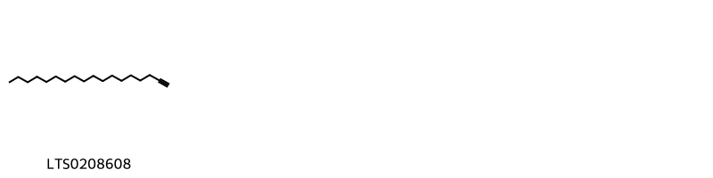{ group="compound" description="Cấu trúc hóa học của các hoạt chất thuộc nhóm ** là octadec-1-yne [(LTS0208608)](https://lotus.naturalproducts.net/compound/lotus_id/LTS0208608)." }

                                                              
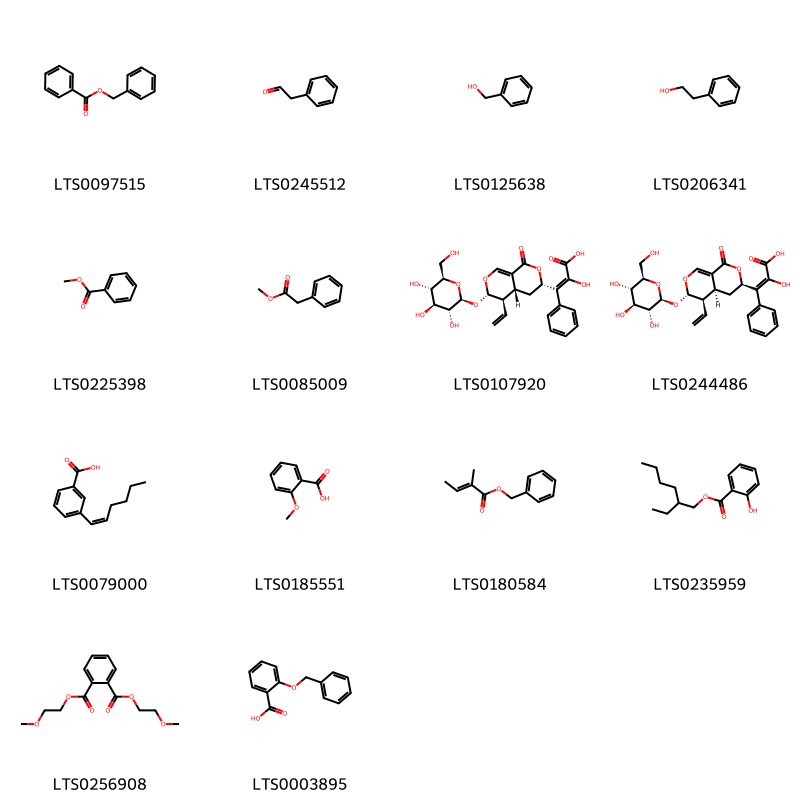{ group="compound" description="Cấu trúc hóa học của các hoạt chất thuộc nhóm *Benzene and substituted derivatives* là benzyl benzoate [(LTS0097515)](https://lotus.naturalproducts.net/compound/lotus_id/LTS0097515), phenylacetaldehyde [(LTS0245512)](https://lotus.naturalproducts.net/compound/lotus_id/LTS0245512), benzyl alcohol [(LTS0125638)](https://lotus.naturalproducts.net/compound/lotus_id/LTS0125638), 2-phenyl-ethanol [(LTS0206341)](https://lotus.naturalproducts.net/compound/lotus_id/LTS0206341), methyl benzoate [(LTS0225398)](https://lotus.naturalproducts.net/compound/lotus_id/LTS0225398), methyl phenylacetate [(LTS0085009)](https://lotus.naturalproducts.net/compound/lotus_id/LTS0085009), loniphenyruviridoside c [(LTS0107920)](https://lotus.naturalproducts.net/compound/lotus_id/LTS0107920), (2e)-3-[(3r,4as,5r,6s)-5-ethenyl-1-oxo-6-{[(2s,3r,4s,5s,6r)-3,4,5-trihydroxy-6-(hydroxymethyl)oxan-2-yl]oxy}-3h,4h,4ah,5h,6h-pyrano[3,4-c]pyran-3-yl]-2-hydroxy-3-phenylprop-2-enoic acid [(LTS0244486)](https://lotus.naturalproducts.net/compound/lotus_id/LTS0244486), 3-[(1z)-hex-1-en-1-yl]benzoic acid [(LTS0079000)](https://lotus.naturalproducts.net/compound/lotus_id/LTS0079000), o-anisic acid [(LTS0185551)](https://lotus.naturalproducts.net/compound/lotus_id/LTS0185551), benzyl tiglate [(LTS0180584)](https://lotus.naturalproducts.net/compound/lotus_id/LTS0180584), octisalate [(LTS0235959)](https://lotus.naturalproducts.net/compound/lotus_id/LTS0235959), bis(methoxyethyl)phthalate [(LTS0256908)](https://lotus.naturalproducts.net/compound/lotus_id/LTS0256908), 2-(benzyloxy)benzoic acid [(LTS0003895)](https://lotus.naturalproducts.net/compound/lotus_id/LTS0003895)." }

                                                              
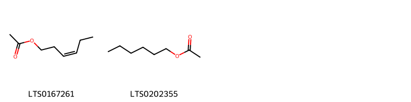{ group="compound" description="Cấu trúc hóa học của các hoạt chất thuộc nhóm *Carboxylic acids and derivatives* là (z)-3-hexenyl acetate [(LTS0167261)](https://lotus.naturalproducts.net/compound/lotus_id/LTS0167261), hexyl acetate [(LTS0202355)](https://lotus.naturalproducts.net/compound/lotus_id/LTS0202355)." }

                                                              
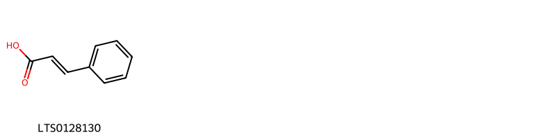{ group="compound" description="Cấu trúc hóa học của các hoạt chất thuộc nhóm *Cinnamic acids and derivatives* là cinnamic acid [(LTS0128130)](https://lotus.naturalproducts.net/compound/lotus_id/LTS0128130)." }

                                                              
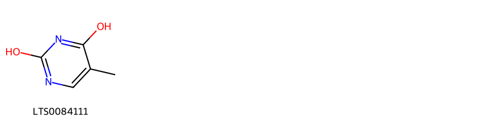{ group="compound" description="Cấu trúc hóa học của các hoạt chất thuộc nhóm *Diazines* là 5-methylpyrimidine-2,4-dione [(LTS0084111)](https://lotus.naturalproducts.net/compound/lotus_id/LTS0084111)." }

                                                              
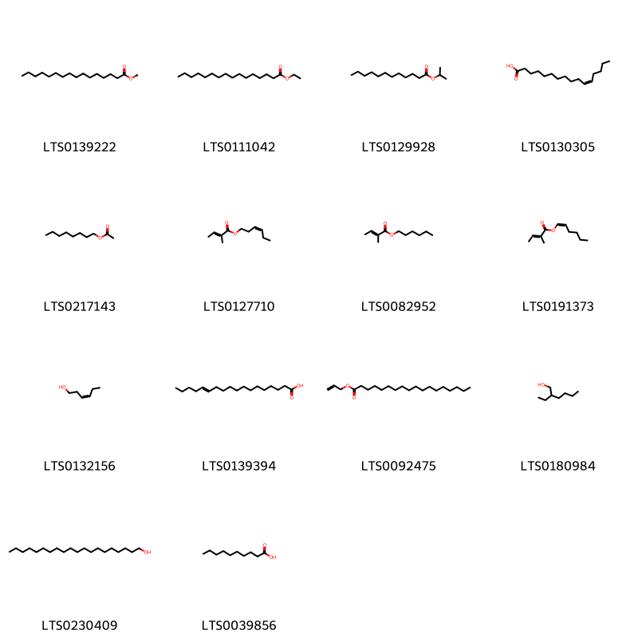{ group="compound" description="Cấu trúc hóa học của các hoạt chất thuộc nhóm *Fatty Acyls* là methyl palmitate [(LTS0139222)](https://lotus.naturalproducts.net/compound/lotus_id/LTS0139222), ethyl palmitate [(LTS0111042)](https://lotus.naturalproducts.net/compound/lotus_id/LTS0111042), isopropyl laurate [(LTS0129928)](https://lotus.naturalproducts.net/compound/lotus_id/LTS0129928), 11-hexadecenoic acid [(LTS0130305)](https://lotus.naturalproducts.net/compound/lotus_id/LTS0130305), octyl acetate [(LTS0217143)](https://lotus.naturalproducts.net/compound/lotus_id/LTS0217143), (3z)-hexenyl tiglate [(LTS0127710)](https://lotus.naturalproducts.net/compound/lotus_id/LTS0127710), hexyl (2e)-2-methylbut-2-enoate [(LTS0082952)](https://lotus.naturalproducts.net/compound/lotus_id/LTS0082952), (1z)-hex-1-en-1-yl (2e)-2-methylbut-2-enoate [(LTS0191373)](https://lotus.naturalproducts.net/compound/lotus_id/LTS0191373), cis-3-hexenol [(LTS0132156)](https://lotus.naturalproducts.net/compound/lotus_id/LTS0132156), (13e)-octadec-13-enoic acid [(LTS0139394)](https://lotus.naturalproducts.net/compound/lotus_id/LTS0139394), allyl stearate [(LTS0092475)](https://lotus.naturalproducts.net/compound/lotus_id/LTS0092475), 2-ethylhexanol [(LTS0180984)](https://lotus.naturalproducts.net/compound/lotus_id/LTS0180984), arachidyl alcohol [(LTS0230409)](https://lotus.naturalproducts.net/compound/lotus_id/LTS0230409), capric acid [(LTS0039856)](https://lotus.naturalproducts.net/compound/lotus_id/LTS0039856)." }

                                                              
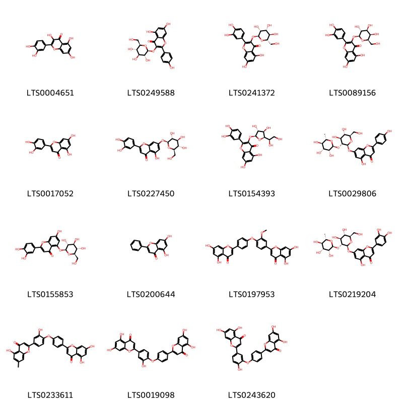{ group="compound" description="Cấu trúc hóa học của các hoạt chất thuộc nhóm *Flavonoids* là quercetin [(LTS0004651)](https://lotus.naturalproducts.net/compound/lotus_id/LTS0004651), astragalin [(LTS0249588)](https://lotus.naturalproducts.net/compound/lotus_id/LTS0249588), 2-(3,4-dihydroxyphenyl)-5,7-dihydroxy-3-{[(2s,3r,4r,5r,6s)-3,4,5-trihydroxy-6-(hydroxymethyl)oxan-2-yl]oxy}chromen-4-one [(LTS0241372)](https://lotus.naturalproducts.net/compound/lotus_id/LTS0241372), hyperoside [(LTS0089156)](https://lotus.naturalproducts.net/compound/lotus_id/LTS0089156), luteolin [(LTS0017052)](https://lotus.naturalproducts.net/compound/lotus_id/LTS0017052), luteolin 7-o-glucoside [(LTS0227450)](https://lotus.naturalproducts.net/compound/lotus_id/LTS0227450), quercetin-3-glucoside [(LTS0154393)](https://lotus.naturalproducts.net/compound/lotus_id/LTS0154393), rhoifolin [(LTS0029806)](https://lotus.naturalproducts.net/compound/lotus_id/LTS0029806), 2-(3,4-dihydroxyphenyl)-7-hydroxy-5-{[(2s,3r,4s,5s,6r)-3,4,5-trihydroxy-6-(hydroxymethyl)oxan-2-yl]oxy}chromen-4-one [(LTS0155853)](https://lotus.naturalproducts.net/compound/lotus_id/LTS0155853), chrysin [(LTS0200644)](https://lotus.naturalproducts.net/compound/lotus_id/LTS0200644), 2-{4-[4-(5,7-dihydroxy-4-oxochromen-2-yl)phenoxy]-3-methoxyphenyl}-5,7-dihydroxychromen-4-one [(LTS0197953)](https://lotus.naturalproducts.net/compound/lotus_id/LTS0197953), lonicerin [(LTS0219204)](https://lotus.naturalproducts.net/compound/lotus_id/LTS0219204), 2-{4-[4-(5,7-dihydroxy-4-oxochromen-2-yl)phenoxy]-3-hydroxyphenyl}-5-hydroxy-7-methylchromen-4-one [(LTS0233611)](https://lotus.naturalproducts.net/compound/lotus_id/LTS0233611), 2-{4-[4-(5,7-dihydroxy-4-oxochromen-2-yl)-2-hydroxyphenoxy]phenyl}-5,7-dihydroxychromen-4-one [(LTS0019098)](https://lotus.naturalproducts.net/compound/lotus_id/LTS0019098), ochnaflavone [(LTS0243620)](https://lotus.naturalproducts.net/compound/lotus_id/LTS0243620)." }

                                                              
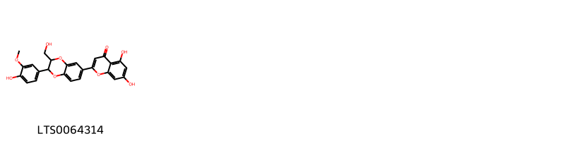{ group="compound" description="Cấu trúc hóa học của các hoạt chất thuộc nhóm *Flavonolignans* là 5,7-dihydroxy-2-[2-(4-hydroxy-3-methoxyphenyl)-3-(hydroxymethyl)-2,3-dihydro-1,4-benzodioxin-6-yl]chromen-4-one [(LTS0064314)](https://lotus.naturalproducts.net/compound/lotus_id/LTS0064314)." }

                                                              
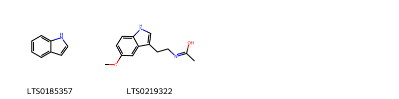{ group="compound" description="Cấu trúc hóa học của các hoạt chất thuộc nhóm *Indoles and derivatives* là indole [(LTS0185357)](https://lotus.naturalproducts.net/compound/lotus_id/LTS0185357), n-[2-(5-methoxy-1h-indol-3-yl)ethyl]ethanimidic acid [(LTS0219322)](https://lotus.naturalproducts.net/compound/lotus_id/LTS0219322)." }

                                                              
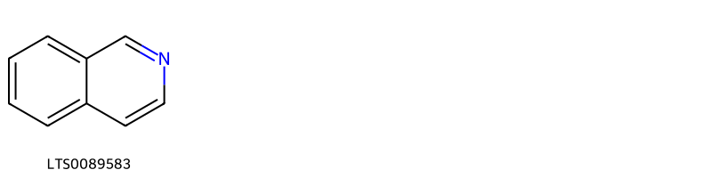{ group="compound" description="Cấu trúc hóa học của các hoạt chất thuộc nhóm *Isoquinolines and derivatives* là isoquinoline [(LTS0089583)](https://lotus.naturalproducts.net/compound/lotus_id/LTS0089583)." }

                                                              
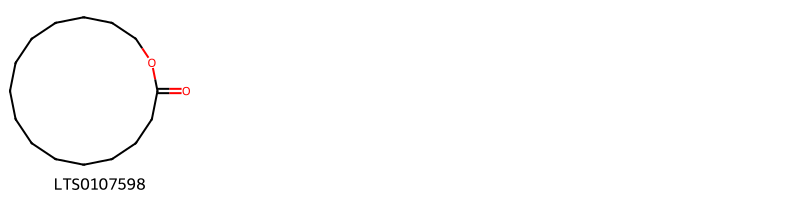{ group="compound" description="Cấu trúc hóa học của các hoạt chất thuộc nhóm *Macrolides and analogues* là exaltolide [(LTS0107598)](https://lotus.naturalproducts.net/compound/lotus_id/LTS0107598)." }

                                                              
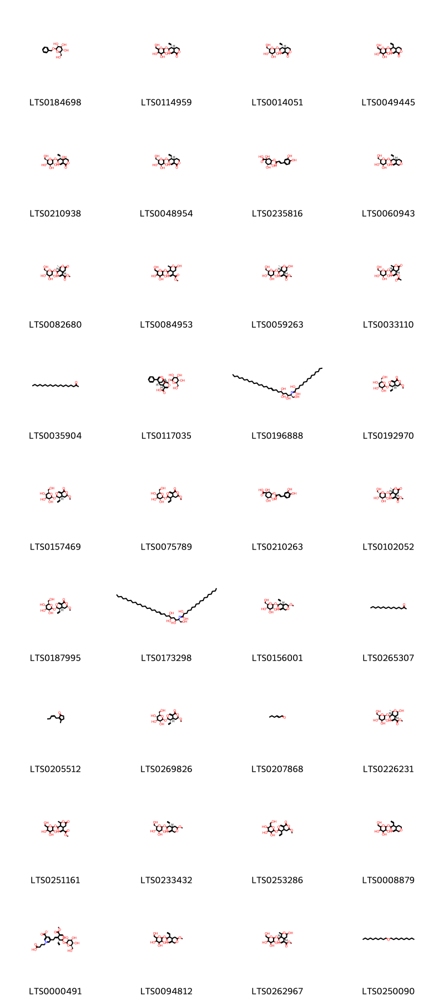{ group="compound" description="Cấu trúc hóa học của các hoạt chất thuộc nhóm *Organooxygen compounds* là benzyl β-d-glucoside [(LTS0184698)](https://lotus.naturalproducts.net/compound/lotus_id/LTS0184698), (4as,5r,6s)-5-ethenyl-6-{[3,4,5-trihydroxy-6-(hydroxymethyl)oxan-2-yl]oxy}-3h,4h,4ah,5h,6h-pyrano[3,4-c]pyran-1-one [(LTS0114959)](https://lotus.naturalproducts.net/compound/lotus_id/LTS0114959), sweroside [(LTS0014051)](https://lotus.naturalproducts.net/compound/lotus_id/LTS0014051), 5-ethenyl-6-{[3,4,5-trihydroxy-6-(hydroxymethyl)oxan-2-yl]oxy}-3h,4h,4ah,5h,6h-pyrano[3,4-c]pyran-1-one [(LTS0049445)](https://lotus.naturalproducts.net/compound/lotus_id/LTS0049445), swertiamarin [(LTS0210938)](https://lotus.naturalproducts.net/compound/lotus_id/LTS0210938), (4as,5s,6s)-5-ethenyl-6-{[(2s,3s,4s,5s,6r)-3,4,5-trihydroxy-6-(hydroxymethyl)oxan-2-yl]oxy}-3h,4h,4ah,5h,6h-pyrano[3,4-c]pyran-1-one [(LTS0048954)](https://lotus.naturalproducts.net/compound/lotus_id/LTS0048954), neochlorogenic acid [(LTS0235816)](https://lotus.naturalproducts.net/compound/lotus_id/LTS0235816), (2s,3r,4s,5s,6r)-2-{[(3s,4r,4as)-4-ethenyl-3h,4h,4ah,5h,6h,8h-pyrano[3,4-c]pyran-3-yl]oxy}-6-(hydroxymethyl)oxane-3,4,5-triol [(LTS0060943)](https://lotus.naturalproducts.net/compound/lotus_id/LTS0060943), methyl (1s,4as,8s,8as)-8-methyl-6-oxo-1-{[(2s,3r,4s,5s,6r)-3,4,5-trihydroxy-6-(hydroxymethyl)oxan-2-yl]oxy}-1h,4ah,5h,8h,8ah-pyrano[3,4-c]pyran-4-carboxylate [(LTS0082680)](https://lotus.naturalproducts.net/compound/lotus_id/LTS0082680), methyl 6-hydroxy-8-methyl-1-{[3,4,5-trihydroxy-6-(hydroxymethyl)oxan-2-yl]oxy}-1h,4ah,5h,6h,8h,8ah-pyrano[3,4-c]pyran-4-carboxylate [(LTS0084953)](https://lotus.naturalproducts.net/compound/lotus_id/LTS0084953), morroniside [(LTS0059263)](https://lotus.naturalproducts.net/compound/lotus_id/LTS0059263), (1s,4as,8as)-8-methyl-6-oxo-1-{[(2s,3r,4s,5s,6r)-3,4,5-trihydroxy-6-(hydroxymethyl)oxan-2-yl]oxy}-1h,4ah,5h,8h,8ah-pyrano[3,4-c]pyran-4-yl acetate [(LTS0033110)](https://lotus.naturalproducts.net/compound/lotus_id/LTS0033110), 2-nonadecanone [(LTS0035904)](https://lotus.naturalproducts.net/compound/lotus_id/LTS0035904), (1r,2s,3s,7s,9r)-10-phenyl-3-{[(2s,3r,4s,5s,6r)-3,4,5-trihydroxy-6-(hydroxymethyl)oxan-2-yl]oxy}-4,12-dioxatricyclo[7.3.1.0²,⁷]trideca-5,10-diene-6-carboxylic acid [(LTS0117035)](https://lotus.naturalproducts.net/compound/lotus_id/LTS0117035), (2r)-2-hydroxy-n-[(2s,3s,5r,6s,9e)-1,3,5,6-tetrahydroxyhexacos-9-en-2-yl]pentadecanimidic acid [(LTS0196888)](https://lotus.naturalproducts.net/compound/lotus_id/LTS0196888), (3r,4as,5s,6s)-5-ethenyl-3-methoxy-6-{[(2s,3s,4r,5s,6s)-3,4,5-trihydroxy-6-(hydroxymethyl)oxan-2-yl]oxy}-3h,4h,4ah,5h,6h-pyrano[3,4-c]pyran-1-one [(LTS0192970)](https://lotus.naturalproducts.net/compound/lotus_id/LTS0192970), (3r,4as,5r,6s)-5-ethenyl-3-methoxy-6-{[(2s,3r,4s,5s,6r)-3,4,5-trihydroxy-6-(hydroxymethyl)oxan-2-yl]oxy}-3h,4h,4ah,5h,6h-pyrano[3,4-c]pyran-1-one [(LTS0157469)](https://lotus.naturalproducts.net/compound/lotus_id/LTS0157469), 5-ethenyl-3-methoxy-6-{[(2s,3r,4s,5s,6r)-3,4,5-trihydroxy-6-(hydroxymethyl)oxan-2-yl]oxy}-3h,4h,4ah,5h,6h-pyrano[3,4-c]pyran-1-one [(LTS0075789)](https://lotus.naturalproducts.net/compound/lotus_id/LTS0075789), isochlorogenic acid [(LTS0210263)](https://lotus.naturalproducts.net/compound/lotus_id/LTS0210263), methyl (1s,4as,8s,8as)-8-methyl-6-oxo-1-{[(2r,3s,4r,5s,6s)-3,4,5-trihydroxy-6-(hydroxymethyl)oxan-2-yl]oxy}-1h,4ah,5h,8h,8ah-pyrano[3,4-c]pyran-4-carboxylate [(LTS0102052)](https://lotus.naturalproducts.net/compound/lotus_id/LTS0102052), (3s,4as,5r,6s)-5-ethenyl-3-methoxy-6-{[(2s,3r,4s,5s,6r)-3,4,5-trihydroxy-6-(hydroxymethyl)oxan-2-yl]oxy}-3h,4h,4ah,5h,6h-pyrano[3,4-c]pyran-1-one [(LTS0187995)](https://lotus.naturalproducts.net/compound/lotus_id/LTS0187995), (2r)-2-hydroxy-n-[(2s,3s,5r,6s,9e)-1,3,5,6-tetrahydroxyoctacos-9-en-2-yl]octadecanimidic acid [(LTS0173298)](https://lotus.naturalproducts.net/compound/lotus_id/LTS0173298), (2s,3r,4s,5s,6r)-2-{[(3s,4r,4as,6r)-4-ethenyl-6-methoxy-3h,4h,4ah,5h,6h,8h-pyrano[3,4-c]pyran-3-yl]oxy}-6-(hydroxymethyl)oxane-3,4,5-triol [(LTS0156001)](https://lotus.naturalproducts.net/compound/lotus_id/LTS0156001), 2-pentadecanone [(LTS0265307)](https://lotus.naturalproducts.net/compound/lotus_id/LTS0265307), jasmone [(LTS0205512)](https://lotus.naturalproducts.net/compound/lotus_id/LTS0205512), (3s,4as,5s,6s)-5-ethenyl-3-methoxy-6-{[(2s,3r,4s,5s,6r)-3,4,5-trihydroxy-6-(hydroxymethyl)oxan-2-yl]oxy}-3h,4h,4ah,5h,6h-pyrano[3,4-c]pyran-1-one [(LTS0269826)](https://lotus.naturalproducts.net/compound/lotus_id/LTS0269826), (e)-2-hexenal [(LTS0207868)](https://lotus.naturalproducts.net/compound/lotus_id/LTS0207868), methyl (1s,4as,6s,8s,8as)-6-hydroxy-8-methyl-1-{[(2s,3r,4s,5s,6r)-3,4,5-trihydroxy-6-(hydroxymethyl)oxan-2-yl]oxy}-1h,4ah,5h,6h,8h,8ah-pyrano[3,4-c]pyran-4-carboxylate [(LTS0226231)](https://lotus.naturalproducts.net/compound/lotus_id/LTS0226231), methyl 8-methyl-6-oxo-1-{[3,4,5-trihydroxy-6-(hydroxymethyl)oxan-2-yl]oxy}-1h,4ah,5h,8h,8ah-pyrano[3,4-c]pyran-4-carboxylate [(LTS0251161)](https://lotus.naturalproducts.net/compound/lotus_id/LTS0251161), (2s,3r,4s,5s,6r)-2-{[(3s,4r,4as,6s)-4-ethenyl-6-methoxy-3h,4h,4ah,5h,6h,8h-pyrano[3,4-c]pyran-3-yl]oxy}-6-(hydroxymethyl)oxane-3,4,5-triol [(LTS0233432)](https://lotus.naturalproducts.net/compound/lotus_id/LTS0233432), 5-ethenyl-3-methoxy-6-{[3,4,5-trihydroxy-6-(hydroxymethyl)oxan-2-yl]oxy}-3h,4h,4ah,5h,6h-pyrano[3,4-c]pyran-1-one [(LTS0253286)](https://lotus.naturalproducts.net/compound/lotus_id/LTS0253286), 2-({4-ethenyl-3h,4h,4ah,5h,6h,8h-pyrano[3,4-c]pyran-3-yl}oxy)-6-(hydroxymethyl)oxane-3,4,5-triol [(LTS0008879)](https://lotus.naturalproducts.net/compound/lotus_id/LTS0008879), lonijaposide h [(LTS0000491)](https://lotus.naturalproducts.net/compound/lotus_id/LTS0000491), 2-({4-ethenyl-6-methoxy-3h,4h,4ah,5h,6h,8h-pyrano[3,4-c]pyran-3-yl}oxy)-6-(hydroxymethyl)oxane-3,4,5-triol [(LTS0094812)](https://lotus.naturalproducts.net/compound/lotus_id/LTS0094812), methyl (4as,8as)-6-hydroxy-8-methyl-1-{[3,4,5-trihydroxy-6-(hydroxymethyl)oxan-2-yl]oxy}-1h,4ah,5h,6h,8h,8ah-pyrano[3,4-c]pyran-4-carboxylate [(LTS0262967)](https://lotus.naturalproducts.net/compound/lotus_id/LTS0262967), didecyl ether [(LTS0250090)](https://lotus.naturalproducts.net/compound/lotus_id/LTS0250090)." }

                                                              
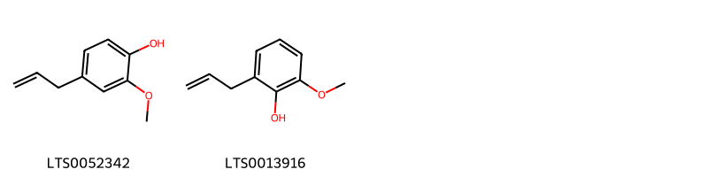{ group="compound" description="Cấu trúc hóa học của các hoạt chất thuộc nhóm *Phenols* là eugenol [(LTS0052342)](https://lotus.naturalproducts.net/compound/lotus_id/LTS0052342), 2-methoxy-6-(prop-2-en-1-yl)phenol [(LTS0013916)](https://lotus.naturalproducts.net/compound/lotus_id/LTS0013916)." }

                                                              
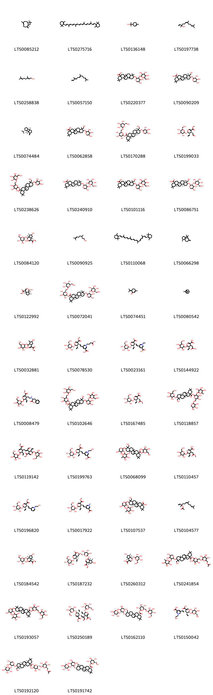{ group="compound" description="Cấu trúc hóa học của các hoạt chất thuộc nhóm *Prenol lipids* là caryophyllene [(LTS0085212)](https://lotus.naturalproducts.net/compound/lotus_id/LTS0085212), β-carotene [(LTS0275716)](https://lotus.naturalproducts.net/compound/lotus_id/LTS0275716), terpineol [(LTS0136148)](https://lotus.naturalproducts.net/compound/lotus_id/LTS0136148), nerolidol [(LTS0197738)](https://lotus.naturalproducts.net/compound/lotus_id/LTS0197738), geraniol [(LTS0258838)](https://lotus.naturalproducts.net/compound/lotus_id/LTS0258838), farnesene [(LTS0057150)](https://lotus.naturalproducts.net/compound/lotus_id/LTS0057150), 10-[(4,5-dihydroxy-3-{[3,4,5-trihydroxy-6-(hydroxymethyl)oxan-2-yl]oxy}oxan-2-yl)oxy]-2,2,6a,6b,9,9,12a-heptamethyl-1,3,4,5,6,7,8,8a,10,11,12,12b,13,14b-tetradecahydropicene-4a-carboxylic acid [(LTS0220377)](https://lotus.naturalproducts.net/compound/lotus_id/LTS0220377), hederagenin 3-o-arabinoside [(LTS0090209)](https://lotus.naturalproducts.net/compound/lotus_id/LTS0090209), β-bourbonene [(LTS0074484)](https://lotus.naturalproducts.net/compound/lotus_id/LTS0074484), 9-(hydroxymethyl)-2,2,6a,6b,9,12a-hexamethyl-10-[(3,4,5-trihydroxyoxan-2-yl)oxy]-1,3,4,5,6,7,8,8a,10,11,12,12b,13,14b-tetradecahydropicene-4a-carboxylic acid [(LTS0062858)](https://lotus.naturalproducts.net/compound/lotus_id/LTS0062858), (2s,3r,4s,5s,6r)-3,4,5-trihydroxy-6-({[(2r,3r,4s,5s,6r)-3,4,5-trihydroxy-6-(hydroxymethyl)oxan-2-yl]oxy}methyl)oxan-2-yl (4as,6as,6br,8ar,9r,10s,12ar,12br,14bs)-9-(hydroxymethyl)-2,2,6a,6b,9,12a-hexamethyl-10-{[(2s,3r,4s,5s)-3,4,5-trihydroxyoxan-2-yl]oxy}-1,3,4,5,6,7,8,8a,10,11,12,12b,13,14b-tetradecahydropicene-4a-carboxylate [(LTS0170288)](https://lotus.naturalproducts.net/compound/lotus_id/LTS0170288), (-)-secologanin [(LTS0199033)](https://lotus.naturalproducts.net/compound/lotus_id/LTS0199033), 3,4,5-trihydroxy-6-({[3,4,5-trihydroxy-6-(hydroxymethyl)oxan-2-yl]oxy}methyl)oxan-2-yl 9-(hydroxymethyl)-2,2,6a,6b,9,12a-hexamethyl-10-[(3,4,5-trihydroxyoxan-2-yl)oxy]-1,3,4,5,6,7,8,8a,10,11,12,12b,13,14b-tetradecahydropicene-4a-carboxylate [(LTS0238626)](https://lotus.naturalproducts.net/compound/lotus_id/LTS0238626), (4as,6as,6br,8ar,10s,12ar,12br,14bs)-10-{[(2s,3r,4s,5s)-4,5-dihydroxy-3-{[(2s,3r,4s,5s,6r)-3,4,5-trihydroxy-6-(hydroxymethyl)oxan-2-yl]oxy}oxan-2-yl]oxy}-2,2,6a,6b,9,9,12a-heptamethyl-1,3,4,5,6,7,8,8a,10,11,12,12b,13,14b-tetradecahydropicene-4a-carboxylic acid [(LTS0240910)](https://lotus.naturalproducts.net/compound/lotus_id/LTS0240910), 10-[(4,5-dihydroxy-3-{[3,4,5-trihydroxy-6-(hydroxymethyl)oxan-2-yl]oxy}oxan-2-yl)oxy]-9-(hydroxymethyl)-2,2,6a,6b,9,12a-hexamethyl-1,3,4,5,6,7,8,8a,10,11,12,12b,13,14b-tetradecahydropicene-4a-carboxylic acid [(LTS0101116)](https://lotus.naturalproducts.net/compound/lotus_id/LTS0101116), cauloside c [(LTS0086751)](https://lotus.naturalproducts.net/compound/lotus_id/LTS0086751), loganin [(LTS0084120)](https://lotus.naturalproducts.net/compound/lotus_id/LTS0084120), citronellol, (+-)- [(LTS0090925)](https://lotus.naturalproducts.net/compound/lotus_id/LTS0090925), 1,3,3-trimethyl-2-[(9e,11e,13e,15e,17e)-3,7,12,16-tetramethyl-18-(2,6,6-trimethylcyclohex-1-en-1-yl)octadeca-1,3,5,7,9,11,13,15,17-nonaen-1-yl]cyclohex-1-ene [(LTS0110068)](https://lotus.naturalproducts.net/compound/lotus_id/LTS0110068), 2,6,6-trimethyl-8-methylidenetricyclo[5.3.1.0¹,⁵]undecane [(LTS0066298)](https://lotus.naturalproducts.net/compound/lotus_id/LTS0066298), 7-deoxyloganetin [(LTS0122992)](https://lotus.naturalproducts.net/compound/lotus_id/LTS0122992), (2s,3r,4s,5s,6r)-3,4,5-trihydroxy-6-({[(2r,3r,4s,5s,6r)-3,4,5-trihydroxy-6-(hydroxymethyl)oxan-2-yl]oxy}methyl)oxan-2-yl (4as,6as,6br,8ar,10s,12ar,12br,14bs)-10-{[(2s,3r,4s,5s)-4,5-dihydroxy-3-{[(2s,3r,4s,5s,6r)-3,4,5-trihydroxy-6-(hydroxymethyl)oxan-2-yl]oxy}oxan-2-yl]oxy}-2,2,6a,6b,9,9,12a-heptamethyl-1,3,4,5,6,7,8,8a,10,11,12,12b,13,14b-tetradecahydropicene-4a-carboxylate [(LTS0072041)](https://lotus.naturalproducts.net/compound/lotus_id/LTS0072041), piperitenone [(LTS0074451)](https://lotus.naturalproducts.net/compound/lotus_id/LTS0074451), 2,6,6-trimethylbicyclo[3.1.1]hept-1-ene [(LTS0080542)](https://lotus.naturalproducts.net/compound/lotus_id/LTS0080542), methyl 6-hydroxy-7-methyl-1-{[3,4,5-trihydroxy-6-(hydroxymethyl)oxan-2-yl]oxy}-1h,4ah,5h,6h,7h,7ah-cyclopenta[c]pyran-4-carboxylate [(LTS0032881)](https://lotus.naturalproducts.net/compound/lotus_id/LTS0032881), 3-carboxy-1-(3-carboxypropyl)-5-[(1e)-2-[(2s,3r,4s)-3-ethenyl-5-(methoxycarbonyl)-2-{[(2s,3r,4s,5s,6r)-3,4,5-trihydroxy-6-(hydroxymethyl)oxan-2-yl]oxy}-3,4-dihydro-2h-pyran-4-yl]ethenyl]pyridin-1-ium [(LTS0078530)](https://lotus.naturalproducts.net/compound/lotus_id/LTS0078530), 3-carboxy-5-[(1e)-2-[(2s,3r,4s)-5-carboxylato-3-ethenyl-2-{[(2s,3r,4s,5s,6r)-3,4,5-trihydroxy-6-(hydroxymethyl)oxan-2-yl]oxy}-3,4-dihydro-2h-pyran-4-yl]ethenyl]-1-ethylpyridin-1-ium [(LTS0023161)](https://lotus.naturalproducts.net/compound/lotus_id/LTS0023161), 4-(carboxymethyl)-5-ethenyl-6-{[3,4,5-trihydroxy-6-(hydroxymethyl)oxan-2-yl]oxy}-5,6-dihydro-4h-pyran-3-carboxylic acid [(LTS0144922)](https://lotus.naturalproducts.net/compound/lotus_id/LTS0144922), 2-({2-[3-ethenyl-5-(methoxycarbonyl)-2-{[3,4,5-trihydroxy-6-(hydroxymethyl)oxan-2-yl]oxy}-3,4-dihydro-2h-pyran-4-yl]ethyl}amino)-3-phenylpropanoic acid [(LTS0008479)](https://lotus.naturalproducts.net/compound/lotus_id/LTS0008479), 3,4,5-trihydroxy-6-({[3,4,5-trihydroxy-6-(hydroxymethyl)oxan-2-yl]oxy}methyl)oxan-2-yl 10-[(4,5-dihydroxy-3-{[3,4,5-trihydroxy-6-(hydroxymethyl)oxan-2-yl]oxy}oxan-2-yl)oxy]-9-(hydroxymethyl)-2,2,6a,6b,9,12a-hexamethyl-1,3,4,5,6,7,8,8a,10,11,12,12b,13,14b-tetradecahydropicene-4a-carboxylate [(LTS0102646)](https://lotus.naturalproducts.net/compound/lotus_id/LTS0102646), (4s,5r,6s)-5-ethenyl-4-(2-methoxy-2-oxoethyl)-6-{[(2s,3r,4s,5s,6r)-3,4,5-trihydroxy-6-(hydroxymethyl)oxan-2-yl]oxy}-5,6-dihydro-4h-pyran-3-carboxylic acid [(LTS0167485)](https://lotus.naturalproducts.net/compound/lotus_id/LTS0167485), 4,5-dihydroxy-3-[(3,4,5-trihydroxy-6-methyloxan-2-yl)oxy]-6-{[(3,4,5-trihydroxyoxan-2-yl)oxy]methyl}oxan-2-yl 9-(hydroxymethyl)-2,2,6a,6b,9,12a-hexamethyl-10-{[3,4,5-trihydroxy-6-(hydroxymethyl)oxan-2-yl]oxy}-1,3,4,5,6,7,8,8a,10,11,12,12b,13,14b-tetradecahydropicene-4a-carboxylate [(LTS0118857)](https://lotus.naturalproducts.net/compound/lotus_id/LTS0118857), methyl 5-ethenyl-4-{3-[3-ethenyl-5-(methoxycarbonyl)-2-{[3,4,5-trihydroxy-6-(hydroxymethyl)oxan-2-yl]oxy}-3,4-dihydro-2h-pyran-4-yl]-4-oxobut-2-en-1-yl}-6-{[3,4,5-trihydroxy-6-(hydroxymethyl)oxan-2-yl]oxy}-5,6-dihydro-4h-pyran-3-carboxylate [(LTS0119142)](https://lotus.naturalproducts.net/compound/lotus_id/LTS0119142), 3-carboxy-5-[(1e)-2-[(2s,3r,4s)-3-ethenyl-5-(methoxycarbonyl)-2-{[(2s,3r,4s,5s,6r)-3,4,5-trihydroxy-6-(hydroxymethyl)oxan-2-yl]oxy}-3,4-dihydro-2h-pyran-4-yl]ethenyl]-1-(2-hydroxyethyl)pyridin-1-ium [(LTS0199763)](https://lotus.naturalproducts.net/compound/lotus_id/LTS0199763), 3,4,5-trihydroxy-6-(hydroxymethyl)oxan-2-yl 10-({4,5-dihydroxy-3-[(3,4,5-trihydroxy-6-methyloxan-2-yl)oxy]oxan-2-yl}oxy)-9-(hydroxymethyl)-2,2,6a,6b,9,12a-hexamethyl-1,3,4,5,6,7,8,8a,10,11,12,12b,13,14b-tetradecahydropicene-4a-carboxylate [(LTS0068099)](https://lotus.naturalproducts.net/compound/lotus_id/LTS0068099), 5-ethenyl-4-(2-methoxy-2-oxoethyl)-6-{[3,4,5-trihydroxy-6-(hydroxymethyl)oxan-2-yl]oxy}-5,6-dihydro-4h-pyran-3-carboxylic acid [(LTS0110457)](https://lotus.naturalproducts.net/compound/lotus_id/LTS0110457), 3-[(1e)-2-[(2s,3r,4s)-3-ethenyl-5-(methoxycarbonyl)-2-{[(2s,3r,4s,5s,6r)-3,4,5-trihydroxy-6-(hydroxymethyl)oxan-2-yl]oxy}-3,4-dihydro-2h-pyran-4-yl]ethenyl]-1-(2-hydroxyethyl)pyridin-1-ium [(LTS0196820)](https://lotus.naturalproducts.net/compound/lotus_id/LTS0196820), lonijaposide g [(LTS0017922)](https://lotus.naturalproducts.net/compound/lotus_id/LTS0017922), 10-({4,5-dihydroxy-3-[(3,4,5-trihydroxy-6-methyloxan-2-yl)oxy]oxan-2-yl}oxy)-9-(hydroxymethyl)-2,2,6a,6b,9,12a-hexamethyl-1,3,4,5,6,7,8,8a,10,11,12,12b,13,14b-tetradecahydropicene-4a-carboxylic acid [(LTS0107537)](https://lotus.naturalproducts.net/compound/lotus_id/LTS0107537), 3,7,11-trimethyldodeca-1,6,10-trien-3-yl acetate [(LTS0104577)](https://lotus.naturalproducts.net/compound/lotus_id/LTS0104577), methyl (1s,4as,6s,7s,7ar)-6-hydroxy-7-methyl-1-{[(2s,3r,4s,5s,6r)-3,4,5-trihydroxy-6-(hydroxymethyl)oxan-2-yl]oxy}-1h,4ah,5h,6h,7h,7ah-cyclopenta[c]pyran-4-carboxylate [(LTS0184542)](https://lotus.naturalproducts.net/compound/lotus_id/LTS0184542), methyl (1s,4as,6s,7r,7as)-1-{[(2s,3r,4s,5s,6r)-6-({[(3r,4as,5r,6s)-5-ethenyl-1-oxo-6-{[(2s,3r,4s,5s,6r)-3,4,5-trihydroxy-6-(hydroxymethyl)oxan-2-yl]oxy}-3h,4h,4ah,5h,6h-pyrano[3,4-c]pyran-3-yl]oxy}methyl)-3,4,5-trihydroxyoxan-2-yl]oxy}-6-hydroxy-7-methyl-1h,4ah,5h,6h,7h,7ah-cyclopenta[c]pyran-4-carboxylate [(LTS0187232)](https://lotus.naturalproducts.net/compound/lotus_id/LTS0187232), (1s,4as,6s,7s,7as)-6-hydroxy-7-methyl-1-{[(2s,3r,4s,5s,6r)-3,4,5-trihydroxy-6-(hydroxymethyl)oxan-2-yl]oxy}-1h,4ah,5h,6h,7h,7ah-cyclopenta[c]pyran-4-carboxylic acid [(LTS0260312)](https://lotus.naturalproducts.net/compound/lotus_id/LTS0260312), 6-[({6-[(acetyloxy)methyl]-3,4,5-trihydroxyoxan-2-yl}oxy)methyl]-3,4,5-trihydroxyoxan-2-yl 10-({4,5-dihydroxy-3-[(3,4,5-trihydroxy-6-methyloxan-2-yl)oxy]oxan-2-yl}oxy)-9-(hydroxymethyl)-2,2,6a,6b,9,12a-hexamethyl-1,3,4,5,6,7,8,8a,10,11,12,12b,13,14b-tetradecahydropicene-4a-carboxylate [(LTS0241854)](https://lotus.naturalproducts.net/compound/lotus_id/LTS0241854), 3,4,5-trihydroxy-6-({[3,4,5-trihydroxy-6-(hydroxymethyl)oxan-2-yl]oxy}methyl)oxan-2-yl 10-({4,5-dihydroxy-3-[(3,4,5-trihydroxy-6-methyloxan-2-yl)oxy]oxan-2-yl}oxy)-2,2,6a,6b,9,9,12a-heptamethyl-1,3,4,5,6,7,8,8a,10,11,12,12b,13,14b-tetradecahydropicene-4a-carboxylate [(LTS0193057)](https://lotus.naturalproducts.net/compound/lotus_id/LTS0193057), methyl (4s,5r,6s)-5-ethenyl-4-[(2e)-3-[(2s,3r,4r)-3-ethenyl-5-(methoxycarbonyl)-2-{[(2s,3r,4s,5s,6r)-3,4,5-trihydroxy-6-(hydroxymethyl)oxan-2-yl]oxy}-3,4-dihydro-2h-pyran-4-yl]-4-oxobut-2-en-1-yl]-6-{[(2s,3r,4s,5s,6r)-3,4,5-trihydroxy-6-(hydroxymethyl)oxan-2-yl]oxy}-5,6-dihydro-4h-pyran-3-carboxylate [(LTS0250189)](https://lotus.naturalproducts.net/compound/lotus_id/LTS0250189), (2s,3r,4s,5s,6r)-3,4,5-trihydroxy-6-({[(2r,3r,4s,5s,6r)-3,4,5-trihydroxy-6-(hydroxymethyl)oxan-2-yl]oxy}methyl)oxan-2-yl (4as,6as,6br,9r,10s,12ar)-10-{[(2s,3r,4s,5s)-4,5-dihydroxy-3-{[(2s,3r,4r,5r,6s)-3,4,5-trihydroxy-6-methyloxan-2-yl]oxy}oxan-2-yl]oxy}-9-(hydroxymethyl)-2,2,6a,6b,9,12a-hexamethyl-1,3,4,5,6,7,8,8a,10,11,12,12b,13,14b-tetradecahydropicene-4a-carboxylate [(LTS0162110)](https://lotus.naturalproducts.net/compound/lotus_id/LTS0162110), 5-carboxy-3-[(1e)-2-[(2r,3s,4s)-5-carboxy-3-ethenyl-2-{[(2s,3r,4s,5r,6r)-3,4,5-trihydroxy-6-(hydroxymethyl)oxan-2-yl]oxy}-3,4-dihydro-2h-pyran-4-yl]ethenyl]-1-(2-hydroxyethyl)-2h-pyridin-2-yl [(LTS0150042)](https://lotus.naturalproducts.net/compound/lotus_id/LTS0150042), (2s,3r,4s,5s,6r)-6-({[(2r,3r,4s,5s,6r)-6-[(acetyloxy)methyl]-3,4,5-trihydroxyoxan-2-yl]oxy}methyl)-3,4,5-trihydroxyoxan-2-yl (4as,6as,6br,8ar,9r,10s,12ar,12br,14bs)-10-{[(2s,3r,4s,5s)-4,5-dihydroxy-3-{[(2s,3r,4r,5r,6s)-3,4,5-trihydroxy-6-methyloxan-2-yl]oxy}oxan-2-yl]oxy}-9-(hydroxymethyl)-2,2,6a,6b,9,12a-hexamethyl-1,3,4,5,6,7,8,8a,10,11,12,12b,13,14b-tetradecahydropicene-4a-carboxylate [(LTS0192120)](https://lotus.naturalproducts.net/compound/lotus_id/LTS0192120), (2s,3r,4s,5s,6r)-3,4,5-trihydroxy-6-(hydroxymethyl)oxan-2-yl (4as,6as,6br,8ar,9r,10s,12ar,12br,14bs)-10-{[(2s,3r,4s,5s)-4,5-dihydroxy-3-{[(2s,3r,4r,5r,6s)-3,4,5-trihydroxy-6-methyloxan-2-yl]oxy}oxan-2-yl]oxy}-9-(hydroxymethyl)-2,2,6a,6b,9,12a-hexamethyl-1,3,4,5,6,7,8,8a,10,11,12,12b,13,14b-tetradecahydropicene-4a-carboxylate [(LTS0191742)](https://lotus.naturalproducts.net/compound/lotus_id/LTS0191742), lonijaposide n [(LTS0090217)](https://lotus.naturalproducts.net/compound/lotus_id/LTS0090217), 4,5-dihydroxy-3-[(3,4,5-trihydroxy-6-methyloxan-2-yl)oxy]-6-{[(3,4,5-trihydroxyoxan-2-yl)oxy]methyl}oxan-2-yl 10-({4,5-dihydroxy-3-[(3,4,5-trihydroxy-6-methyloxan-2-yl)oxy]oxan-2-yl}oxy)-9-(hydroxymethyl)-2,2,6a,6b,9,12a-hexamethyl-1,3,4,5,6,7,8,8a,10,11,12,12b,13,14b-tetradecahydropicene-4a-carboxylate [(LTS0164634)](https://lotus.naturalproducts.net/compound/lotus_id/LTS0164634), methyl (1s,4as,6s,7s,7as)-6-hydroxy-7-methyl-1-{[(2s,3r,4s,5s,6r)-3,4,5-trihydroxy-6-(hydroxymethyl)oxan-2-yl]oxy}-1h,4ah,5h,6h,7h,7ah-cyclopenta[c]pyran-4-carboxylate [(LTS0213092)](https://lotus.naturalproducts.net/compound/lotus_id/LTS0213092), phytofluene [(LTS0181914)](https://lotus.naturalproducts.net/compound/lotus_id/LTS0181914), methyl (4s,5r,6r)-5-ethenyl-4-(2-oxoethyl)-6-{[(2s,3r,4s,5s,6r)-3,4,5-trihydroxy-6-(hydroxymethyl)oxan-2-yl]oxy}-5,6-dihydro-4h-pyran-3-carboxylate [(LTS0246845)](https://lotus.naturalproducts.net/compound/lotus_id/LTS0246845), (2s,3r,4s,5s,6r)-4,5-dihydroxy-3-{[(2s,3r,4r,5r,6s)-3,4,5-trihydroxy-6-methyloxan-2-yl]oxy}-6-({[(2s,3r,4s,5r)-3,4,5-trihydroxyoxan-2-yl]oxy}methyl)oxan-2-yl (4as,6as,6br,8ar,9r,10s,12ar,12br,14br)-10-{[(2s,3r,4s,5s)-4,5-dihydroxy-3-{[(2s,3r,4r,5r,6s)-3,4,5-trihydroxy-6-methyloxan-2-yl]oxy}oxan-2-yl]oxy}-9-(hydroxymethyl)-2,2,6a,6b,9,12a-hexamethyl-1,3,4,5,6,7,8,8a,10,11,12,12b,13,14b-tetradecahydropicene-4a-carboxylate [(LTS0245060)](https://lotus.naturalproducts.net/compound/lotus_id/LTS0245060), (4s,5r,6s)-4-(carboxymethyl)-5-ethenyl-6-{[(2s,3r,4s,5s,6r)-3,4,5-trihydroxy-6-(hydroxymethyl)oxan-2-yl]oxy}-5,6-dihydro-4h-pyran-3-carboxylic acid [(LTS0242890)](https://lotus.naturalproducts.net/compound/lotus_id/LTS0242890), dipsacoside b [(LTS0161777)](https://lotus.naturalproducts.net/compound/lotus_id/LTS0161777), 4,5-dihydroxy-3-[(3,4,5-trihydroxy-6-methyloxan-2-yl)oxy]-6-{[(3,4,5-trihydroxyoxan-2-yl)oxy]methyl}oxan-2-yl 9-(hydroxymethyl)-2,2,6a,6b,9,12a-hexamethyl-10-[(3,4,5-trihydroxyoxan-2-yl)oxy]-1,3,4,5,6,7,8,8a,10,11,12,12b,13,14b-tetradecahydropicene-4a-carboxylate [(LTS0107255)](https://lotus.naturalproducts.net/compound/lotus_id/LTS0107255), (4s,5r,6s)-4-(carboxymethyl)-5-ethenyl-6-{[(2r,3s,4r,5r,6s)-3,4,5-trihydroxy-6-(hydroxymethyl)oxan-2-yl]oxy}-5,6-dihydro-4h-pyran-3-carboxylic acid [(LTS0267795)](https://lotus.naturalproducts.net/compound/lotus_id/LTS0267795), (2s,3r,4s,5s,6r)-4,5-dihydroxy-3-{[(2s,3r,4r,5r,6s)-3,4,5-trihydroxy-6-methyloxan-2-yl]oxy}-6-({[(2r,3r,4r,5s)-3,4,5-trihydroxyoxan-2-yl]oxy}methyl)oxan-2-yl (4as,6as,6br,8ar,9r,10s,12ar,12br,14bs)-9-(hydroxymethyl)-2,2,6a,6b,9,12a-hexamethyl-10-{[(2r,3r,4s,5s,6r)-3,4,5-trihydroxy-6-(hydroxymethyl)oxan-2-yl]oxy}-1,3,4,5,6,7,8,8a,10,11,12,12b,13,14b-tetradecahydropicene-4a-carboxylate [(LTS0195682)](https://lotus.naturalproducts.net/compound/lotus_id/LTS0195682), lonijaposide l [(LTS0203192)](https://lotus.naturalproducts.net/compound/lotus_id/LTS0203192), 3-carboxy-5-[(1e)-2-[(2s,3r,4s)-5-carboxylato-3-ethenyl-2-{[(2s,3r,4s,5s,6r)-3,4,5-trihydroxy-6-(hydroxymethyl)oxan-2-yl]oxy}-3,4-dihydro-2h-pyran-4-yl]ethenyl]-1-(3-carboxypropyl)pyridin-1-ium [(LTS0073819)](https://lotus.naturalproducts.net/compound/lotus_id/LTS0073819), [(2s,3r,4s)-3-ethenyl-5-(methoxycarbonyl)-2-{[(2s,3r,4s,5s,6r)-3,4,5-trihydroxy-6-(hydroxymethyl)oxan-2-yl]oxy}-3,4-dihydro-2h-pyran-4-yl]acetic acid [(LTS0101012)](https://lotus.naturalproducts.net/compound/lotus_id/LTS0101012), zeta-carotene [(LTS0218266)](https://lotus.naturalproducts.net/compound/lotus_id/LTS0218266), (2s)-2-({2-[(2s,3r,4s)-3-ethenyl-5-(methoxycarbonyl)-2-{[(2s,3r,4s,5s,6r)-3,4,5-trihydroxy-6-(hydroxymethyl)oxan-2-yl]oxy}-3,4-dihydro-2h-pyran-4-yl]ethyl}amino)-3-phenylpropanoic acid [(LTS0100816)](https://lotus.naturalproducts.net/compound/lotus_id/LTS0100816), lonijaposide c [(LTS0100755)](https://lotus.naturalproducts.net/compound/lotus_id/LTS0100755), methyl 4-(2,2-dimethoxyethyl)-5-ethenyl-6-{[3,4,5-trihydroxy-6-(hydroxymethyl)oxan-2-yl]oxy}-5,6-dihydro-4h-pyran-3-carboxylate [(LTS0218607)](https://lotus.naturalproducts.net/compound/lotus_id/LTS0218607), loganic acid [(LTS0231203)](https://lotus.naturalproducts.net/compound/lotus_id/LTS0231203), 3,4,5-trihydroxy-6-({[3,4,5-trihydroxy-6-(hydroxymethyl)oxan-2-yl]oxy}methyl)oxan-2-yl 10-[(4,5-dihydroxy-3-{[3,4,5-trihydroxy-6-(hydroxymethyl)oxan-2-yl]oxy}oxan-2-yl)oxy]-2,2,6a,6b,9,9,12a-heptamethyl-1,3,4,5,6,7,8,8a,10,11,12,12b,13,14b-tetradecahydropicene-4a-carboxylate [(LTS0080846)](https://lotus.naturalproducts.net/compound/lotus_id/LTS0080846), (2s,3r,4s,5s,6r)-4,5-dihydroxy-3-{[(2s,3r,4r,5r,6s)-3,4,5-trihydroxy-6-methyloxan-2-yl]oxy}-6-({[(2s,3r,4s,5r)-3,4,5-trihydroxyoxan-2-yl]oxy}methyl)oxan-2-yl (4as,6as,6br,8ar,9r,10s,12ar,12br,14bs)-9-(hydroxymethyl)-2,2,6a,6b,9,12a-hexamethyl-10-{[(2r,3r,4s,5s,6r)-3,4,5-trihydroxy-6-(hydroxymethyl)oxan-2-yl]oxy}-1,3,4,5,6,7,8,8a,10,11,12,12b,13,14b-tetradecahydropicene-4a-carboxylate [(LTS0226310)](https://lotus.naturalproducts.net/compound/lotus_id/LTS0226310), methyl (4s,5r,6s)-5-ethenyl-4-[(2z)-3-[(2s,3r,4r)-3-ethenyl-5-(methoxycarbonyl)-2-{[(2s,3r,4s,5s,6r)-3,4,5-trihydroxy-6-(hydroxymethyl)oxan-2-yl]oxy}-3,4-dihydro-2h-pyran-4-yl]-4-oxobut-2-en-1-yl]-6-{[(2s,3r,4s,5s,6r)-3,4,5-trihydroxy-6-(hydroxymethyl)oxan-2-yl]oxy}-5,6-dihydro-4h-pyran-3-carboxylate [(LTS0218395)](https://lotus.naturalproducts.net/compound/lotus_id/LTS0218395), (2s,3r,4s,5s,6r)-4,5-dihydroxy-3-{[(2s,3r,4r,5r,6s)-3,4,5-trihydroxy-6-methyloxan-2-yl]oxy}-6-({[(2s,3r,4s,5r)-3,4,5-trihydroxyoxan-2-yl]oxy}methyl)oxan-2-yl (4as,6as,6br,8ar,9r,10s,12ar,12br,14bs)-10-{[(2s,3r,4s,5s)-4,5-dihydroxy-3-{[(2s,3r,4r,5r,6s)-3,4,5-trihydroxy-6-methyloxan-2-yl]oxy}oxan-2-yl]oxy}-9-(hydroxymethyl)-2,2,6a,6b,9,12a-hexamethyl-1,3,4,5,6,7,8,8a,10,11,12,12b,13,14b-tetradecahydropicene-4a-carboxylate [(LTS0212920)](https://lotus.naturalproducts.net/compound/lotus_id/LTS0212920), methyl 4-[(4,5-dimethyl-1,3-dioxolan-2-yl)methyl]-5-ethenyl-6-{[3,4,5-trihydroxy-6-(hydroxymethyl)oxan-2-yl]oxy}-5,6-dihydro-4h-pyran-3-carboxylate [(LTS0188388)](https://lotus.naturalproducts.net/compound/lotus_id/LTS0188388), 7-deoxyloganetic acid [(LTS0040000)](https://lotus.naturalproducts.net/compound/lotus_id/LTS0040000), polyprenol [(LTS0209244)](https://lotus.naturalproducts.net/compound/lotus_id/LTS0209244), (10e,12e,14e)-2,6,10,14,19,23,27,31-octamethyldotriaconta-2,6,10,12,14,16,18,22,26,30-decaene [(LTS0022128)](https://lotus.naturalproducts.net/compound/lotus_id/LTS0022128), lonijaposide m [(LTS0047239)](https://lotus.naturalproducts.net/compound/lotus_id/LTS0047239), lonijaposide e [(LTS0248338)](https://lotus.naturalproducts.net/compound/lotus_id/LTS0248338), [3-ethenyl-5-(methoxycarbonyl)-2-{[3,4,5-trihydroxy-6-(hydroxymethyl)oxan-2-yl]oxy}-3,4-dihydro-2h-pyran-4-yl]acetic acid [(LTS0036880)](https://lotus.naturalproducts.net/compound/lotus_id/LTS0036880), methyl (4s,5r,6s)-4-{[(4r,5s)-4,5-dimethyl-1,3-dioxolan-2-yl]methyl}-5-ethenyl-6-{[(2s,3r,4s,5s,6r)-3,4,5-trihydroxy-6-(hydroxymethyl)oxan-2-yl]oxy}-5,6-dihydro-4h-pyran-3-carboxylate [(LTS0256042)](https://lotus.naturalproducts.net/compound/lotus_id/LTS0256042), farnesol [(LTS0059667)](https://lotus.naturalproducts.net/compound/lotus_id/LTS0059667), (2s,3r,4s,5s,6r)-3,4,5-trihydroxy-6-({[(2r,3r,4s,5s,6r)-3,4,5-trihydroxy-6-(hydroxymethyl)oxan-2-yl]oxy}methyl)oxan-2-yl (4as,6as,6br,8ar,9r,10s,12ar,12br,14bs)-10-{[(2s,3r,4s,5s)-4,5-dihydroxy-3-{[(2s,3r,4s,5s,6r)-3,4,5-trihydroxy-6-(hydroxymethyl)oxan-2-yl]oxy}oxan-2-yl]oxy}-9-(hydroxymethyl)-2,2,6a,6b,9,12a-hexamethyl-1,3,4,5,6,7,8,8a,10,11,12,12b,13,14b-tetradecahydropicene-4a-carboxylate [(LTS0016604)](https://lotus.naturalproducts.net/compound/lotus_id/LTS0016604), (2s,3r,4s,5s,6r)-4,5-dihydroxy-3-{[(2s,3r,4r,5r,6s)-3,4,5-trihydroxy-6-methyloxan-2-yl]oxy}-6-({[(2s,3r,4s,5r)-3,4,5-trihydroxyoxan-2-yl]oxy}methyl)oxan-2-yl (4as,6as,6br,8ar,9r,10s,12ar,12br,14br)-9-(hydroxymethyl)-2,2,6a,6b,9,12a-hexamethyl-10-{[(2s,3r,4s,5s)-3,4,5-trihydroxyoxan-2-yl]oxy}-1,3,4,5,6,7,8,8a,10,11,12,12b,13,14b-tetradecahydropicene-4a-carboxylate [(LTS0129400)](https://lotus.naturalproducts.net/compound/lotus_id/LTS0129400), methyl (4s,5s,6s)-4-{[(2s,4r,5s)-4,5-dimethyl-1,3-dioxolan-2-yl]methyl}-5-ethenyl-6-{[(2s,3r,4s,5s,6r)-3,4,5-trihydroxy-6-(hydroxymethyl)oxan-2-yl]oxy}-5,6-dihydro-4h-pyran-3-carboxylate [(LTS0270646)](https://lotus.naturalproducts.net/compound/lotus_id/LTS0270646), methyl (4s,5s,6s)-4-{[(2r,4r,5s)-4,5-dimethyl-1,3-dioxolan-2-yl]methyl}-5-ethenyl-6-{[(2s,3r,4s,5s,6r)-3,4,5-trihydroxy-6-(hydroxymethyl)oxan-2-yl]oxy}-5,6-dihydro-4h-pyran-3-carboxylate [(LTS0014246)](https://lotus.naturalproducts.net/compound/lotus_id/LTS0014246), 3,4,5-trihydroxy-6-({[3,4,5-trihydroxy-6-(hydroxymethyl)oxan-2-yl]oxy}methyl)oxan-2-yl 10-({4,5-dihydroxy-3-[(3,4,5-trihydroxy-6-methyloxan-2-yl)oxy]oxan-2-yl}oxy)-9-(hydroxymethyl)-2,2,6a,6b,9,12a-hexamethyl-1,3,4,5,6,7,8,8a,10,11,12,12b,13,14b-tetradecahydropicene-4a-carboxylate [(LTS0125941)](https://lotus.naturalproducts.net/compound/lotus_id/LTS0125941), methyl (4s,5r,6s)-4-(2,2-dimethoxyethyl)-5-ethenyl-6-{[(2s,3r,4s,5s,6r)-3,4,5-trihydroxy-6-(hydroxymethyl)oxan-2-yl]oxy}-5,6-dihydro-4h-pyran-3-carboxylate [(LTS0266081)](https://lotus.naturalproducts.net/compound/lotus_id/LTS0266081), lonijaposide k [(LTS0037684)](https://lotus.naturalproducts.net/compound/lotus_id/LTS0037684), loniphenyruviridoside d [(LTS0014480)](https://lotus.naturalproducts.net/compound/lotus_id/LTS0014480), methyl (4s,5r,6s)-4-{[(2r,4r,5s)-4,5-dimethyl-1,3-dioxolan-2-yl]methyl}-5-ethenyl-6-{[(2s,3r,4s,5s,6r)-3,4,5-trihydroxy-6-(hydroxymethyl)oxan-2-yl]oxy}-5,6-dihydro-4h-pyran-3-carboxylate [(LTS0027684)](https://lotus.naturalproducts.net/compound/lotus_id/LTS0027684), isophytol [(LTS0015331)](https://lotus.naturalproducts.net/compound/lotus_id/LTS0015331), α-hederin [(LTS0024551)](https://lotus.naturalproducts.net/compound/lotus_id/LTS0024551), carvacrol [(LTS0012882)](https://lotus.naturalproducts.net/compound/lotus_id/LTS0012882), (2s,3r,4s,5s,6r)-3,4,5-trihydroxy-6-({[(2r,3r,4s,5s,6r)-3,4,5-trihydroxy-6-(hydroxymethyl)oxan-2-yl]oxy}methyl)oxan-2-yl (4as,6as,6br,8ar,10s,12ar,12br,14bs)-10-{[(2s,3r,4s,5s)-4,5-dihydroxy-3-{[(2s,3r,4r,5r,6s)-3,4,5-trihydroxy-6-methyloxan-2-yl]oxy}oxan-2-yl]oxy}-2,2,6a,6b,9,9,12a-heptamethyl-1,3,4,5,6,7,8,8a,10,11,12,12b,13,14b-tetradecahydropicene-4a-carboxylate [(LTS0051871)](https://lotus.naturalproducts.net/compound/lotus_id/LTS0051871), (2s,3r,4s,5s,6r)-3,4,5-trihydroxy-6-({[(2r,3r,4s,5s,6r)-3,4,5-trihydroxy-6-(hydroxymethyl)oxan-2-yl]oxy}methyl)oxan-2-yl (4as,6as,6br,8ar,10s,12ar,12br,14bs)-2,2,6a,6b,9,9,12a-heptamethyl-10-{[(2s,3r,4s,5s)-3,4,5-trihydroxyoxan-2-yl]oxy}-1,3,4,5,6,7,8,8a,10,11,12,12b,13,14b-tetradecahydropicene-4a-carboxylate [(LTS0006048)](https://lotus.naturalproducts.net/compound/lotus_id/LTS0006048), 2-(3,7,12,16,20,24-hexamethylpentacosa-1,3,5,7,9,11,13,15,17,19,23-undecaen-1-yl)-1,3,3-trimethylcyclohex-1-ene [(LTS0086978)](https://lotus.naturalproducts.net/compound/lotus_id/LTS0086978), methyl (4s,5r,6s)-4-{[(2s,4r,5s)-4,5-dimethyl-1,3-dioxolan-2-yl]methyl}-5-ethenyl-6-{[(2s,3r,4s,5s,6r)-3,4,5-trihydroxy-6-(hydroxymethyl)oxan-2-yl]oxy}-5,6-dihydro-4h-pyran-3-carboxylate [(LTS0017687)](https://lotus.naturalproducts.net/compound/lotus_id/LTS0017687), methyl 1-[(6-{[(5-ethenyl-1-oxo-6-{[3,4,5-trihydroxy-6-(hydroxymethyl)oxan-2-yl]oxy}-3h,4h,4ah,5h,6h-pyrano[3,4-c]pyran-3-yl)oxy]methyl}-3,4,5-trihydroxyoxan-2-yl)oxy]-6-hydroxy-7-methyl-1h,4ah,5h,6h,7h,7ah-cyclopenta[c]pyran-4-carboxylate [(LTS0100913)](https://lotus.naturalproducts.net/compound/lotus_id/LTS0100913), 3,4,5-trihydroxy-6-({[3,4,5-trihydroxy-6-(hydroxymethyl)oxan-2-yl]oxy}methyl)oxan-2-yl 2,2,6a,6b,9,9,12a-heptamethyl-10-[(3,4,5-trihydroxyoxan-2-yl)oxy]-1,3,4,5,6,7,8,8a,10,11,12,12b,13,14b-tetradecahydropicene-4a-carboxylate [(LTS0234984)](https://lotus.naturalproducts.net/compound/lotus_id/LTS0234984), (1r,4r,6s,10s)-4,12,12-trimethyl-9-methylidene-5-oxatricyclo[8.2.0.0⁴,⁶]dodecane [(LTS0029123)](https://lotus.naturalproducts.net/compound/lotus_id/LTS0029123), zeta-carotene [(LTS0007334)](https://lotus.naturalproducts.net/compound/lotus_id/LTS0007334), secologanin [(LTS0235060)](https://lotus.naturalproducts.net/compound/lotus_id/LTS0235060), lonijaposide i [(LTS0027760)](https://lotus.naturalproducts.net/compound/lotus_id/LTS0027760), gamma-carotene [(LTS0108535)](https://lotus.naturalproducts.net/compound/lotus_id/LTS0108535), 5-carboxy-3-[(1e)-2-[(2s,3r,4r)-3-ethenyl-5-(methoxycarbonyl)-2-{[(2s,3r,4s,5s,6r)-3,4,5-trihydroxy-6-(hydroxymethyl)oxan-2-yl]oxy}-3,4-dihydro-2h-pyran-4-yl]ethenyl]-1-(2-hydroxyethyl)-2h-pyridin-2-yl [(LTS0042207)](https://lotus.naturalproducts.net/compound/lotus_id/LTS0042207), geranylacetone [(LTS0231623)](https://lotus.naturalproducts.net/compound/lotus_id/LTS0231623)." }

                                                              
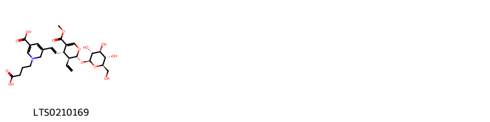{ group="compound" description="Cấu trúc hóa học của các hoạt chất thuộc nhóm *Saccharolipids* là 5-carboxy-1-(3-carboxypropyl)-3-[(1e)-2-[(2r,3s,4s)-3-ethenyl-5-(methoxycarbonyl)-2-{[(2s,3r,4s,5s,6r)-3,4,5-trihydroxy-6-(hydroxymethyl)oxan-2-yl]oxy}-3,4-dihydro-2h-pyran-4-yl]ethenyl]-2h-pyridin-2-yl [(LTS0210169)](https://lotus.naturalproducts.net/compound/lotus_id/LTS0210169)." }

                                                              
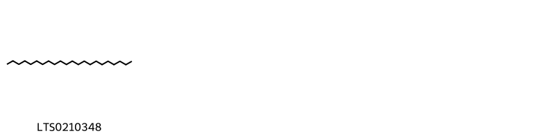{ group="compound" description="Cấu trúc hóa học của các hoạt chất thuộc nhóm *Saturated hydrocarbons* là docosane [(LTS0210348)](https://lotus.naturalproducts.net/compound/lotus_id/LTS0210348)." }

                                                              
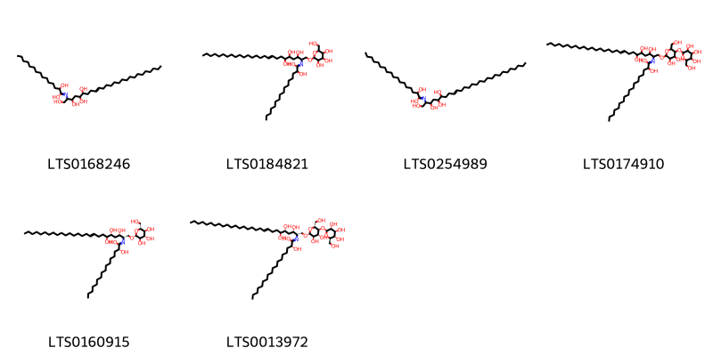{ group="compound" description="Cấu trúc hóa học của các hoạt chất thuộc nhóm *Sphingolipids* là 2-hydroxy-n-(1,3,5,6-tetrahydroxyhexacos-9-en-2-yl)pentadecanimidic acid [(LTS0168246)](https://lotus.naturalproducts.net/compound/lotus_id/LTS0168246), 2-hydroxy-n-(3,5,6-trihydroxy-1-{[3,4,5-trihydroxy-6-(hydroxymethyl)oxan-2-yl]oxy}hexacos-9-en-2-yl)hexadecanimidic acid [(LTS0184821)](https://lotus.naturalproducts.net/compound/lotus_id/LTS0184821), 2-hydroxy-n-(1,3,5,6-tetrahydroxyoctacos-9-en-2-yl)octadecanimidic acid [(LTS0254989)](https://lotus.naturalproducts.net/compound/lotus_id/LTS0254989), n-(1-{[3,4-dihydroxy-6-(hydroxymethyl)-5-{[3,4,5-trihydroxy-6-(hydroxymethyl)oxan-2-yl]oxy}oxan-2-yl]oxy}-3,5,6-trihydroxyoctacos-9-en-2-yl)-2-hydroxyoctadecanimidic acid [(LTS0174910)](https://lotus.naturalproducts.net/compound/lotus_id/LTS0174910), (2r)-2-hydroxy-n-[(2s,3s,5r,6s,9e)-3,5,6-trihydroxy-1-{[(2r,3r,4s,5s,6r)-3,4,5-trihydroxy-6-(hydroxymethyl)oxan-2-yl]oxy}hexacos-9-en-2-yl]hexadecanimidic acid [(LTS0160915)](https://lotus.naturalproducts.net/compound/lotus_id/LTS0160915), (2r)-n-[(2s,3s,5r,6s,9e)-1-{[(2r,3r,4r,5s,6r)-3,4-dihydroxy-6-(hydroxymethyl)-5-{[(2s,3r,4s,5s,6r)-3,4,5-trihydroxy-6-(hydroxymethyl)oxan-2-yl]oxy}oxan-2-yl]oxy}-3,5,6-trihydroxyoctacos-9-en-2-yl]-2-hydroxyoctadecanimidic acid [(LTS0013972)](https://lotus.naturalproducts.net/compound/lotus_id/LTS0013972)." }

                                                              
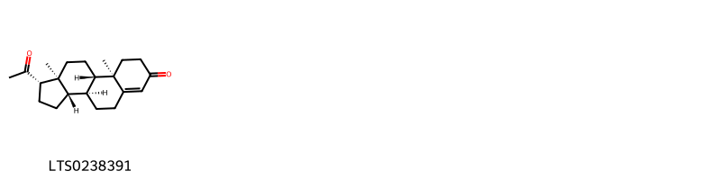{ group="compound" description="Cấu trúc hóa học của các hoạt chất thuộc nhóm *Steroids and steroid derivatives* là progesterone [(LTS0238391)](https://lotus.naturalproducts.net/compound/lotus_id/LTS0238391)." }

                                                              
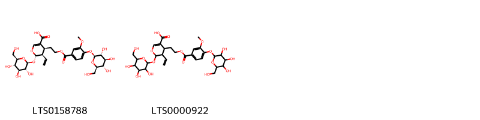{ group="compound" description="Cấu trúc hóa học của các hoạt chất thuộc nhóm *Tannins* là (4s,5r,6s)-5-ethenyl-4-[2-(3-methoxy-4-{[(2s,3r,4s,5s,6r)-3,4,5-trihydroxy-6-(hydroxymethyl)oxan-2-yl]oxy}benzoyloxy)ethyl]-6-{[(2s,3r,4s,5s,6r)-3,4,5-trihydroxy-6-(hydroxymethyl)oxan-2-yl]oxy}-5,6-dihydro-4h-pyran-3-carboxylic acid [(LTS0158788)](https://lotus.naturalproducts.net/compound/lotus_id/LTS0158788), 5-ethenyl-4-[2-(3-methoxy-4-{[3,4,5-trihydroxy-6-(hydroxymethyl)oxan-2-yl]oxy}benzoyloxy)ethyl]-6-{[3,4,5-trihydroxy-6-(hydroxymethyl)oxan-2-yl]oxy}-5,6-dihydro-4h-pyran-3-carboxylic acid [(LTS0000922)](https://lotus.naturalproducts.net/compound/lotus_id/LTS0000922)." }

                                                              
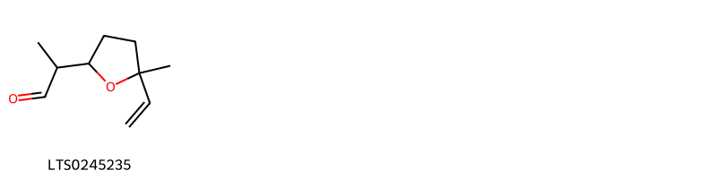{ group="compound" description="Cấu trúc hóa học của các hoạt chất thuộc nhóm *Tetrahydrofurans* là lilac aldehyde [(LTS0245235)](https://lotus.naturalproducts.net/compound/lotus_id/LTS0245235)." }

                                                              
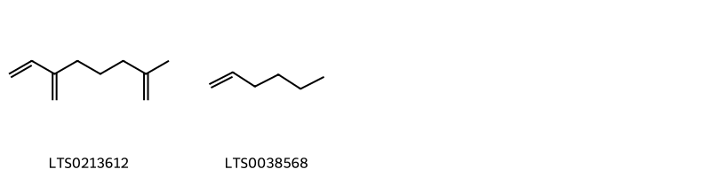{ group="compound" description="Cấu trúc hóa học của các hoạt chất thuộc nhóm *Unsaturated hydrocarbons* là 2-methyl-6-methylideneocta-1,7-diene [(LTS0213612)](https://lotus.naturalproducts.net/compound/lotus_id/LTS0213612), 1-hexene [(LTS0038568)](https://lotus.naturalproducts.net/compound/lotus_id/LTS0038568)." }

:::

---

## IV. Tác dụng dược lý

Theo tài liệu quốc tế: nan

---

## V. Dược điển Việt Nam V

### Soi bột

Bột màu vàng nâu nhạt, có mùi thơm nhẹ. Hạt phấn hình cầu, đường kính 53 µm đến 62 µm, màu vàng, có 3 lỗ rãnh nảy mầm rõ, bề mặt có nhiều gai nhỏ, thưa. Lông tiết gồm 2 loại: Lông tiết đầu hình chùy cấu tạo bởi 20 tế bào đến 30 tế bào và lông tiết đầu hình cầu gồm khoảng 10 tế bào. Lông che chở đơn bào cũng gồm 2 loại: Một loại thành dày, nhăn hoặc có những chấm lồi nhỏ, một loại thành mỏng, vết lồi rất rõ. Mảnh biểu bì cánh hoa có lông tiết, lông che chở.

::: {#listing-soibot}
:::

### Vi phẫu

nan

::: {#listing-viphau}
:::

### Định tính

A. Lấy 5 g bột dược liệu cho vào bình nón có dung tích 100 ml, thêm 20 ml <i>ethanol 90 % (TT)</i>. Lắc kỹ, đun cách thủy trong 15 min, lọc. Cô dịch lọc trên cách thủy đến khi còn khoảng 5 ml. Lấy 1 ml dung dịch vào ống nghiệm, thêm 2 giọt đến 3 giọt <i>dung dịch acid hydrocloric 10% (TT)</i> và một ít bột <i>magnesi (TT)</i> hoặc bột <i>kẽm (TT),</i> dung dịch chuyển từ màu vàng sang da cam đến đỏ. B. Lấy 1 g bột dược liệu cho vào ống nghiệm, thêm 10 ml nước cất, lắc nhẹ trong 5 min, lọc. Cho vào 2 ống nghiệm, mỗi ống 2 ml dịch lọc. Thêm 2 giọt đến 3 giọt <i>dung dịch natri hydroxyd 10 % (TT)</i> vào ống nghiệm thứ nhất, dung dịch có màu vàng đậm hơn so với ống nghiệm thứ hai không thêm dung dịch natri hydroxyd 10 %. C. Phương pháp sắc ký lớp mỏng (Phụ lục 5.4). <i>Bản mỏng: Silica gel 60F254</i>. <i>Dung môi khai triển:</i> <i>Butyl acetal – acid formic – nước</i> (7: 2,5 : 2,5). Dung dịch thử: Lấy 0,2 g bột dược liệu thêm 10 ml <i>methanol (TT)</i> lắc siêu âm trong 20 min, để nguội, lọc. Bốc hơi dịch lọc trên cách thủy đến cắn. Hòa tan cắn trong 2 ml <i>ethanol (TT).</i> <i>Dung dịch chất đối chiếu:</i> Hòa tan acid clorogenic chuẩn trong <i>ethanol (TT)</i> để được dung dịch có nồng độ 1 mg/ml. <i>Dung dịch dược liệu đối chiếu:</i> Lấy 0,2 g bột Kim ngân hoa (mẫu chuẩn), chiết như mô tả ở phần Dung dịch thử. <i>Cách tiến hành:</i> Chấm riêng biệt lên bản mỏng 10 µl mỗi dung dịch trên. Sau khi triển khai sắc ký, lấy bản mỏng ra, để khô ở nhiệt độ phòng. Quan sát dưới ánh sáng tử ngoại ở bước sóng 366 nm. Trên sắc ký đồ của dung dịch thử phải có các vết cùng màu sắc và giá trị Rf với các vết trên sắc ký đồ của dung dịch dược liệu đối chiếu hoặc có vết cùng màu sắc và giá trị Rf với các vết trên sắc ký đồ của dung dịch chất đối chiếu.

### Định lượng

Phương pháp sắc ký lỏng (Phụ lục 5.3). <i>Pha động: Acetonitril – dung dịch acid phosphoric 0,4 %</i> (13: 87) <i>Dung dịch chuẩn:</i> Hòa tan acid clorogenic chuẩn trong <i>methanol 50 % (TT)</i> để được dung dịch có nồng độ 0,15 mg/ml. <i>Dung dịch thử:</i> Cân chính xác khoảng 0,5 g bột dược liệu (qua rây số 355) vào bình nón nút mài dung tích 100 ml, thêm chính xác 50,0 ml <i>methanol 50 % (TT),</i> đậy nắp, cân xác định khối lượng. Lắc siêu âm trong 30 min, để nguội, cân lại và bổ sung khối lượng mất đi bằng <i>methanol 50 % (TT)</i> nếu cần, lắc đều, lọc qua màng lọc 0,45 µm. <i>Điều kiện sắc ký:</i> Cột kích thước (25 cm X 4,6 mm) được nhồi pha tĩnh C (5 µm). Detector quang phổ tử ngoại đặt ở bước sóng 327 nm. Tốc độ dòng: 1,0 ml/min. Thể tích tiêm: 10 µl. <i>Cách tiến hành:</i> Tiến hành sắc ký dung dịch chuẩn và ghi sắc ký đồ. Số đĩa lý thuyết của cột tính theo pic của acid clorogenic không được ít hơn 1000. Tiến hành sắc ký dung dịch thử. Ghi sắc ký đồ. Tính hàm lượng acid clorogenic trong dược liệu dựa vào diện tích pic thu được trên sắc ký đồ của dung dịch thử, dung dịch chuẩn và hàm lượng C16H18O9 của acid clorogenic chuẩn.Hàm lượng acid clorogenic (C16H18O9) trong dược liệu không được ít hơn 1,5 % tính theo dược liệu khô kiệt.

### Thông tin khác 

- **Độ ẩm:** Không quá 12,0 % (Phụ lục 9.6, 1 g, 85 °C, 4 h).
- **Bảo quản:** nan

## VI. Dược điển Hồng kong

::: {#listing-DDHK}
:::

---

## VII. Y dược học cổ truyền

::: {.callout-note title = "Kim ngân hoa" }

**Tên vị thuốc:** Kim ngân hoa

**Tính:** Hàn

**Vị:** Cam

**Quy kinh:**  Phế, Vị, Tâm

**Công năng chủ trị:** Thanh nhiệt, giải độc, tán phong nhiệt. Chủ trị: Ung nhọt, ban sởi, mày đay, lở ngứa, cảm mạo phong nhiệt, ôn bệnh phát nhiệt, nhiệt độc huyết lị.

**Phân loại theo thông tư:** nan

**Tác dụng theo y dược cổ truyền:** nan

**Chú ý:** nan

**Kiêng kỵ:** Tỳ vị hư hàn ỉa chảy, hoặc vết thương, mụn nhọt có mủ loãng do khí hư; mụn nhọt đă có mủ, vỡ loét không nên dùng. 

:::

::: {#listing-ViThuoc}
:::

