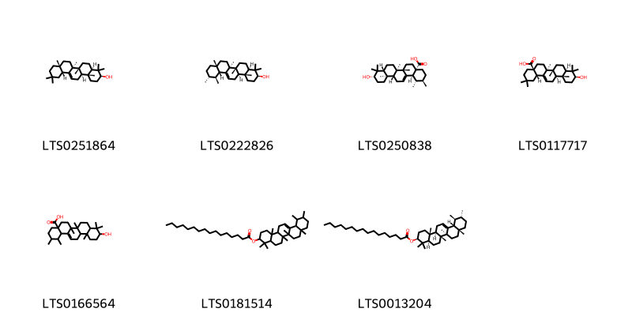
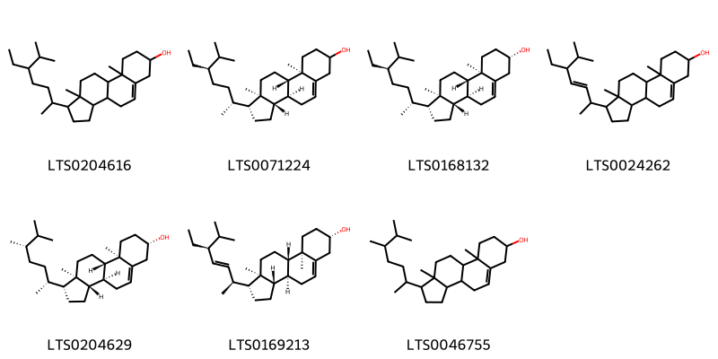

::: {.callout-note title = "Tóm tắt"}

Cơm cháy (Hoa) có tên khoa học là Flos Sambuci javanicae, thuộc loài Sambucus javanica Blume, họ Sambucaceae. Cây mọc hoang và được trồng ở hầu khắp đất nước ta. Theo y học cổ truyền, hoa cây cơm cháy có vị đắng, tính ấm có tác dụng tiêu phù lợi tiểu, trừ hàn thấp . Các thầy thuốc thường dùng hoa đã được phơi khô làm thuốc lợi tiểu, làm ra mồ hôi, chữa phù trong hội chứng thận hư, chữa viêm đau khớp. Các nhà nghiên cứu đã phát hiện ra thành phần hoá học trong hoa cơm cháy có chứa nhóm: Flavonoid, Anthocyanin, Triterpen và triterpenoid, acid béo tự do và ankan với tác dụng được chứng minh có khả năng chống viêm, chống oxy hoá và tăng cường miễn dịch. 

:::

## I. Thông tin về dược liệu 

::: {.panel-tabset}

### Định danh

- Dược liệu tiếng Việt: Cơm Cháy - Hoa
- Dược liệu tiếng Trung: ? (?)
- Dược liệu tiếng Anh: ?
- Dược liệu latin thông dụng: Flos Sambuci Javanicae
- Dược liệu latin kiểu DĐVN: *Herba Ocimi Tenuiflori*
- Dược liệu latin kiểu DĐVN: *nan*
- Dược liệu latin kiểu thông tư: *nan*
- Bộ phận dùng: Hoa (Flos)

### Mô tả dược liệu 

**Theo dược điển Việt nam V:** Hoa khô màu từ vàng nhạt đến vàng nâu, mùi hắc đặc biệt, đường kính 1,5 mm đến 2,5 mm. Năm tràng hoa hình bánh xe, đầu nhọn. Bộ nhị gồm 5 nhị xếp xen kẽ cánh hoa. Bao phấn 2 ô, nứt dọc, hướng ngoài. Bộ nhụy cấu tạo bởi 3 lá noãn chia bầu thành 3 ô, mỗi ô mang 1 noãn. Một số hoa không sinh sản biến thành thể tuyến hình chén, đường kính 1 mm đến 2 mm. 
 
**Mô tả dược liệu theo thông tư chế biến dược liệu theo phương pháp cổ truyền:** nan

### Chế biến 

**Chế biến theo dược điển việt nam V**: Hoa được thu hái ngay sau khi nở, đem phơi khô hoặc sấy khô ở nhiệt độ 50 °C đến 60 °C. Khi dùng cần vi sao. 

**Chế biến theo thông tư:** nan

::: 

## II. Thông tin về thực vật

Dược liệu **Cơm Cháy - Hoa** từ bộ phận **Hoa** từ loài *Sambucus javanica*.

**Mô tả thực vật:** Loài cây này có thể sống đến nhiều năm và có chiều cao lên tới 3m. Thân cây tròn gần như xốp, màu lục nhạt và mịn. Cành cây lớn trong và rỗng, có tủy trắng xốp và nhiều lỗ bên ngoài. Lá cây mềm, mọc đối và có các lá chét kép lông chim lẻ, bao gồm từ 3 đến 9 lá chét, có kích thước dài 8-15cm, rộng 3-5cm, với các mặt lá có khía răng. Cuống lá có rãnh phía trên và loe rộng ở phía gốc, trở thành bẹ. Cây có hoa nhỏ màu trắng, mọc thành xim, giống như tán kép. Quả mọng của cây có hình cầu, màu đỏ hoặc đen sau khi chín, và chứa 3 hạt dẹt. 

*Tài liệu tham khảo:* "Từ điển cây thuốc Việt Nam" - Võ Văn Chi 
Trong dược điển Việt nam, loài *Sambucus javanica* được sử dụng làm dược liệu.

            
::: {.callout-note title = "Phân loại thực vật của *Sambucus javanica*"}

**Kingdom:** Plantae 

**Phylum:** Tracheophyta 

**Order:** Dipsacales 
 
**Family:** Viburnaceae 
 
**Genus:** Sambucus 
 
**Species:** *Sambucus javanica* 
 

:::

::: {style="display: grid;grid-template-columns: repeat(auto-fill, minmax(150px, 1fr));grid-gap: 1em;"}
{ group="GIBF" }

{ group="GIBF" }

{ group="GIBF" }

{ group="GIBF" }

{ group="GIBF" }

{ group="GIBF" }

{ group="GIBF" }
:::

**Phân bố trên thế giới:** Chinese Taipei, China

**Phân bố tại Việt nam:** Không có ghi nhận ở Việt Nam

<iframe src="Flos Sambuci Javanicae/map_distribution.html" width="100%" height="600" style="border:none;"></iframe>

## III. Thành phần hóa học

Theo tài liệu của GS. Đỗ Tất Lợi:  1. Nhóm hoá học: 
- Flavonoid 
- Acid béo tự do và ankan 
- Anthocyanin 
- Triterpen và triterpenoid 
2. Tên hoạt chất: Oleaolic acid 
    

Theo cơ sở dữ liệu lotus, loài *Sambucus javanica* đã phân lập và xác định được **14** hoạt chất thuộc về các nhóm Steroids and steroid derivatives, Prenol lipids trong bảng dưới đây.
        
| chemicalTaxonomyClassyfireClass   |   smiles_count |
|:----------------------------------|---------------:|
| Prenol lipids                     |            639 |
| Steroids and steroid derivatives  |            492 |

Danh sách chi tiết các hoạt chất như sau: 

::: {style="display: grid;grid-template-columns: repeat(auto-fill, minmax(150px, 1fr));grid-gap: 1em;"}

                                                              
{ group="compound" description="Cấu trúc hóa học của các hoạt chất thuộc nhóm *Prenol lipids* là β-amyrin [(LTS0251864)](https://lotus.naturalproducts.net/compound/lotus_id/LTS0251864), amyrin [(LTS0222826)](https://lotus.naturalproducts.net/compound/lotus_id/LTS0222826), ursolic acid [(LTS0250838)](https://lotus.naturalproducts.net/compound/lotus_id/LTS0250838), oleanolic acid [(LTS0117717)](https://lotus.naturalproducts.net/compound/lotus_id/LTS0117717), 10-hydroxy-1,2,6a,6b,9,9,12a-heptamethyl-2,3,4,5,6,7,8,8a,10,11,12,12b,13,14b-tetradecahydro-1h-picene-4a-carboxylic acid [(LTS0166564)](https://lotus.naturalproducts.net/compound/lotus_id/LTS0166564), 4,4,6a,6b,8a,11,12,14b-octamethyl-2,3,4a,5,6,7,8,9,10,11,12,12a,14,14a-tetradecahydro-1h-picen-3-yl hexadecanoate [(LTS0181514)](https://lotus.naturalproducts.net/compound/lotus_id/LTS0181514), (3s,4ar,6ar,6bs,8ar,11r,12s,12ar,14ar,14br)-4,4,6a,6b,8a,11,12,14b-octamethyl-2,3,4a,5,6,7,8,9,10,11,12,12a,14,14a-tetradecahydro-1h-picen-3-yl hexadecanoate [(LTS0013204)](https://lotus.naturalproducts.net/compound/lotus_id/LTS0013204)." }

                                                              
{ group="compound" description="Cấu trúc hóa học của các hoạt chất thuộc nhóm *Steroids and steroid derivatives* là stigmast-5-en-3-ol, (3β)- [(LTS0204616)](https://lotus.naturalproducts.net/compound/lotus_id/LTS0204616), stigmast-5-en-3-ol [(LTS0071224)](https://lotus.naturalproducts.net/compound/lotus_id/LTS0071224), sitosterol [(LTS0168132)](https://lotus.naturalproducts.net/compound/lotus_id/LTS0168132), stigmasterol [(LTS0024262)](https://lotus.naturalproducts.net/compound/lotus_id/LTS0024262), 22,23-dihydrobrassicasterol [(LTS0204629)](https://lotus.naturalproducts.net/compound/lotus_id/LTS0204629), (1r,3as,3bs,7s,9ar,9bs,11ar)-1-[(2s,3e,5s)-5-ethyl-6-methylhept-3-en-2-yl]-9a,11a-dimethyl-1h,2h,3h,3ah,3bh,4h,6h,7h,8h,9h,9bh,10h,11h-cyclopenta[a]phenanthren-7-ol [(LTS0169213)](https://lotus.naturalproducts.net/compound/lotus_id/LTS0169213), campesterol [(LTS0046755)](https://lotus.naturalproducts.net/compound/lotus_id/LTS0046755)." }

:::

---

## IV. Tác dụng dược lý

Theo tài liệu quốc tế: nan

---

## V. Dược điển Việt Nam V

### Soi bột

Bột màu vàng nâu, mùi hắc đặc biệt, không vị. Mảnh mô mềm cánh hoa gồm các tế bào hình đa giác, xếp đều đặn, mảnh mô mang lỗ khí, lông tiết đa bào. Hạt phấn màu vàng, hình tròn, có 3 lỗ nảy mầm, lớp vỏ ngoài sù sì, đứng riêng lẻ hay tụ lại thành đám. Mảnh mạch xoắn, mạch điểm.

::: {#listing-soibot}
:::

### Vi phẫu

nan

::: {#listing-viphau}
:::

### Định tính

Lấy 10 g bột dược liệu vào túi giấy lọc, cho vào bình Soxhlet, chiết bằng ether dầu hỏa (30 oC đến 60 °C) (TT) đến khi dịch chiết không Còn màu xanh. Lấy bã ra để bay hơi hết ether dầu hoả. Cho bã vào bình nón, thêm 30 ml ethanol 90 % (TT), đun cách thủy 15 min, lọc nóng. Lấy dịch chiết làm các phản ứng: Nhỏ 1 giọt dịch chiết lên tờ giấy lọc, để khô rồi hơ lên miệng lọ có chứa amoniac (TT), màu vàng của vết dịch chiết sẽ tăng lên. Cho 2 ml dịch chiết vào ống nghiệm, nhỏ 2 đến 3 giọt dung dịch natri hydroxyd 10 % (TT) vào ống nghiệm thấy xuất hiện kết tủa màu vàng, tiếp tục thêm 1 ml nước cắt, tủa sẽ tan. Cho 2 ml dịch chiết vào ống nghiệm, thêm một ít bột magnesi (TT) và 3 đến 4 giọt acid hydrocloric (TT) rồi đun trong cách thủy, dung dịch xuất hiện màu hồng.

### Định lượng

Chất chiết được trong dược liệu Không ít hơn 25,0 % tính theo dược liệu khô kiệt. Tiến hành theo phương pháp chiết nóng (Phụ lục 12.10), dùng nước làm dung môi.

### Thông tin khác 

- **Độ ẩm:** Không quá 12,0 % (Phụ lục 9.6, 1 g, 85 °c, 4 h).
- **Bảo quản:** Trong bao bì kín. Để nơi khô ráo, tránh sâu mọt. nn

## VI. Dược điển Hồng kong

::: {#listing-DDHK}
:::

---

## VII. Y dược học cổ truyền

::: {.callout-note title = "nan" }

**Tên vị thuốc:** nan

**Tính:** nan

**Vị:** nan

**Quy kinh:**  nan

**Công năng chủ trị:** Vị đắng, tính ấm, hơi có độc. Vào kinh can, thận. nn

**Phân loại theo thông tư:** nan

**Tác dụng theo y dược cổ truyền:** nan

**Chú ý:** nan

**Kiêng kỵ:** Những người tỳ vị hư hàn, phân sống nát, không nên dùng. 

:::

::: {#listing-ViThuoc}
:::

