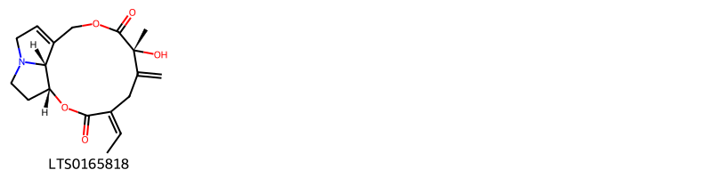
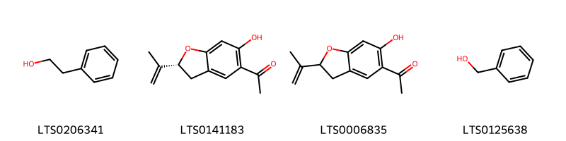
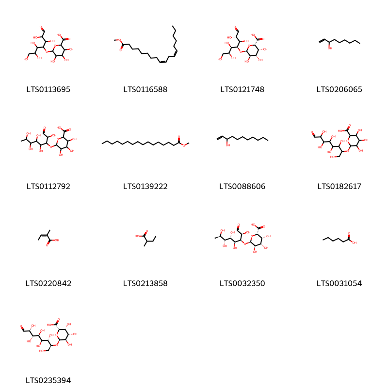
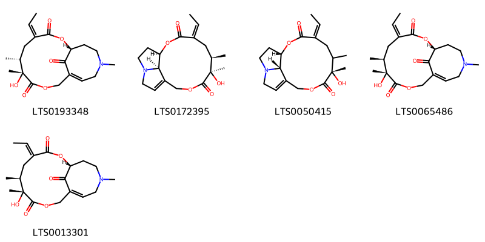
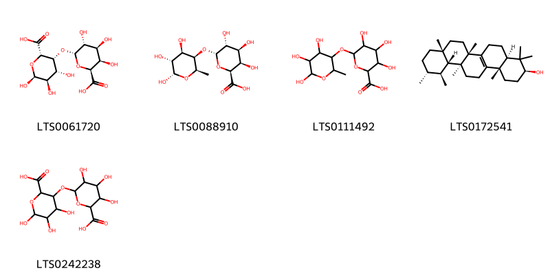
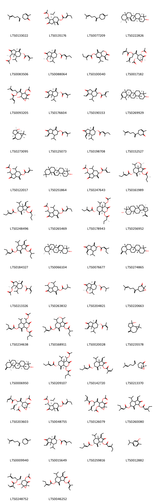
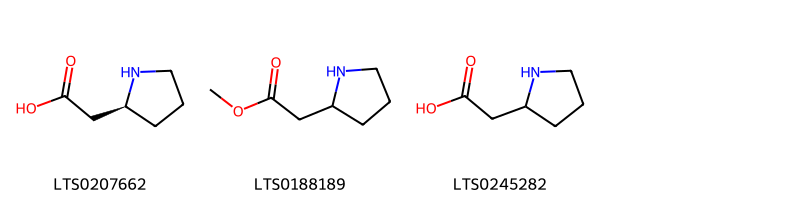
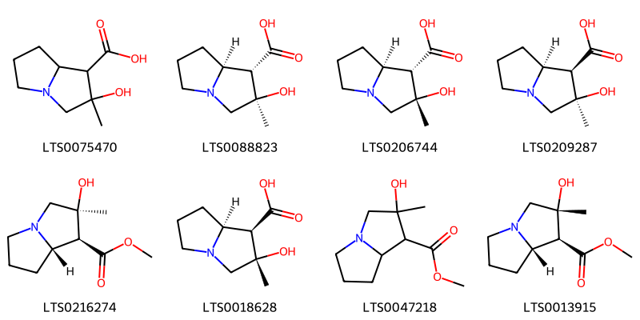
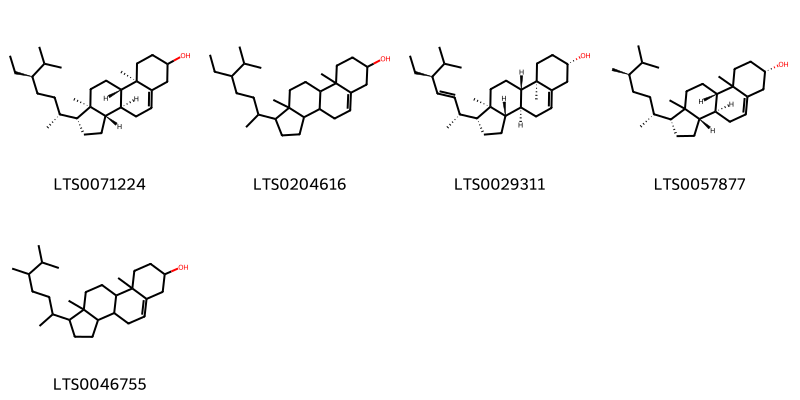
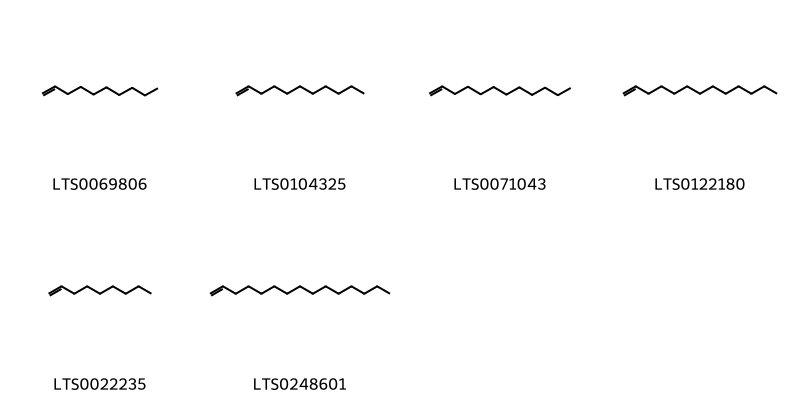

::: {.callout-note title = "Tóm tắt"}

Khoản Đông Hoa (Flos Tussilaginis farfarae) là cụm hoa chưa nở đã phơi hay sấy khô của cây Khoản đông (Tussilago farfara L.), thuộc họ Cúc (Asteraceae). Loài cây này phân bố tại Trung Quốc, nhiều nước châu Âu và chỉ mới thấy có một số người trồng từ giống nhập của nước ngoài ở Việt Nam. Theo y học cổ truyền, hoa và lá khoản đông được sử dụng như một vị thuốc lâu đời, có vị cay, ngọt, tính ôn, không độc, với tác dụng ôn phế, hạ khí, hóa đờm, chỉ ho. Thành phần hóa học bao gồm alkaloid và terpenoid, các este, alcohol, và hydrocarbon với chất tiềm năng là Tussilagine.

:::

## I. Thông tin về dược liệu 

::: {.panel-tabset}

### Định danh

- Dược liệu tiếng Việt: Khoản Đông Hoa - Cụm Hoa Chưa Nở Đã Phơi Sấy Khô
- Dược liệu tiếng Trung: 款冬花 (Kuan Dong Hua)
- Dược liệu tiếng Anh: Tussilago Farfara
- Dược liệu latin thông dụng: Flos Tussilaginis
- Dược liệu latin kiểu DĐVN: *Semen Lablab*
- Dược liệu latin kiểu DĐVN: *Farfarae Flos*
- Dược liệu latin kiểu thông tư: *Flos Tussilaginis farfarae*
- Bộ phận dùng: Hoa (Flos)

### Mô tả dược liệu 

**Theo dược điển Việt nam V:** Cụm hoa là một đầu hình chùy dài, thường là 2 đến 3 cụm hoa cùng mọc trên 1 cành hoặc mọc đơn độc, dài 2 cm đến 2,5 cm, phần trên rộng hơn và phần dưới thon dần. Đỉnh cuống cụm hoa có nhiều lá bắc dạng vẩy. Mặt ngoài của lá bắc đỏ tía hoặc đỏ nhạt, mặt trong được phủ kín bởi những đám lông trắng như bông. Mùi thơm, vị hơi đắng và cay. 
 
**Mô tả dược liệu theo thông tư chế biến dược liệu theo phương pháp cổ truyền:** nan

### Chế biến 

**Chế biến theo dược điển việt nam V**: Thu hoạch vào tháng 12 hoặc khi trời lạnh, hoa vẫn còn dưới đất, thu lấy nụ, loại bỏ cuống hoa, đất cát, phơi âm can hoặc sấy nhẹ đến khô. Bào chế Khoản đông hoa: Loại bỏ tạp chất và cuống hoa còn sót lại. Khoản đông hoa chế mật: Lấy Mật ong, có thể hòa loãng bằng một lượng nước sôi, trộn đều mật với Khoản đông hoa, ủ cho thấm đều, cho vào chảo sao nhỏ lửa cho đến khi sờ không dính tay, lẩy ra để nguội. Dùng 2,5 kg Mật ong cho 10 kg Khoản đông hoa. 

**Chế biến theo thông tư:** nan

::: 

## II. Thông tin về thực vật

Dược liệu **Khoản Đông Hoa - Cụm Hoa Chưa Nở Đã Phơi Sấy Khô** từ bộ phận **Hoa** từ loài *Tussilago farfara*.

**Mô tả thực vật:** Cụm hoa là một đầu hình chùy dài, thường là 2 đến 3 cụm hoa cùng mọc trên 1 cành hoặc mọc đơn độc, dài 2 cm đến 2,5 cm, phần trên rộng hơn và phần dưới thon dần. Đỉnh cuống cụm hoa có nhiều lá bắc dạng vẩy. Mặt ngoài của lá bắc đỏ tía hoặc đỏ nhạt, mặt trong được phủ kín bởi những đám lông trắng như bông. Mùi thơm, vị hơi đắng và cay.

*Tài liệu tham khảo:* "Những cây thuốc và vị thuốc Việt Nam" - Đỗ Tất Lợi 
Trong dược điển Việt nam, loài *Tussilago farfara* được sử dụng làm dược liệu.

            
::: {.callout-note title = "Phân loại thực vật của *Tussilago farfara*"}

**Kingdom:** Plantae 

**Phylum:** Tracheophyta 

**Order:** Asterales 
 
**Family:** Asteraceae 
 
**Genus:** Tussilago 
 
**Species:** *Tussilago farfara* 
 

:::

::: {style="display: grid;grid-template-columns: repeat(auto-fill, minmax(150px, 1fr));grid-gap: 1em;"}
{ group="GIBF" }

{ group="GIBF" }

{ group="GIBF" }

{ group="GIBF" }

{ group="GIBF" }

{ group="GIBF" }

{ group="GIBF" }

{ group="GIBF" }

{ group="GIBF" }

{ group="GIBF" }
:::

**Phân bố trên thế giới:** France, Germany, Switzerland, Czechia, Netherlands, Austria, Hungary, Spain, Poland, Russian Federation, Montenegro, United Kingdom of Great Britain and Northern Ireland, Türkiye, Serbia, United States of America, Moldova, Republic of, Croatia, Italy, Slovenia, Norway, Canada, Armenia, Denmark, Slovakia, Ireland

**Phân bố tại Việt nam:** Không có ghi nhận ở Việt Nam

<iframe src="Flos Tussilaginis/map_distribution.html" width="100%" height="600" style="border:none;"></iframe>

## III. Thành phần hóa học

Theo tài liệu của GS. Đỗ Tất Lợi:  1) Nhóm hóa học: (+)-homoproline, (r)-β-bisabolene, Amyrin, Decene, Methyl linoleate, 2-phenyl-ethanol, Senkirkine, 1-nonen-3-ol, (-)-spathulenol, Isobauerenol, Β-amyrin, Seneciphylline, Senecionine, Methyl palmitate, Benzyl alcohol, 1-pentadecene, Carvacrol, Isotussilagine, Nonene,...
2) Tên hoạt chất là biomaker trong dược điển Việt Nam: Tussilagine
    

Theo cơ sở dữ liệu lotus, loài *Tussilago farfara* đã phân lập và xác định được **102** hoạt chất thuộc về các nhóm Steroids and steroid derivatives, Organooxygen compounds, Benzene and substituted derivatives, Pyrrolizidines, Pyrrolidines, Fatty Acyls, Macrolides and analogues, Prenol lipids, Unsaturated hydrocarbons trong bảng dưới đây.
        
| chemicalTaxonomyClassyfireClass     |   smiles_count |
|:------------------------------------|---------------:|
|                                     |             59 |
| Benzene and substituted derivatives |             85 |
| Fatty Acyls                         |            556 |
| Macrolides and analogues            |            315 |
| Organooxygen compounds              |            356 |
| Prenol lipids                       |           3430 |
| Pyrrolidines                        |             48 |
| Pyrrolizidines                      |            252 |
| Steroids and steroid derivatives    |            348 |
| Unsaturated hydrocarbons            |             76 |

Danh sách chi tiết các hoạt chất như sau: 

::: {style="display: grid;grid-template-columns: repeat(auto-fill, minmax(150px, 1fr));grid-gap: 1em;"}

                                                              
{ group="compound" description="Cấu trúc hóa học của các hoạt chất thuộc nhóm ** là seneciphylline [(LTS0165818)](https://lotus.naturalproducts.net/compound/lotus_id/LTS0165818)." }

                                                              
{ group="compound" description="Cấu trúc hóa học của các hoạt chất thuộc nhóm *Benzene and substituted derivatives* là 2-phenyl-ethanol [(LTS0206341)](https://lotus.naturalproducts.net/compound/lotus_id/LTS0206341), 6-hydroxytremetone [(LTS0141183)](https://lotus.naturalproducts.net/compound/lotus_id/LTS0141183), 1-[6-hydroxy-2-(prop-1-en-2-yl)-2,3-dihydro-1-benzofuran-5-yl]ethanone [(LTS0006835)](https://lotus.naturalproducts.net/compound/lotus_id/LTS0006835), benzyl alcohol [(LTS0125638)](https://lotus.naturalproducts.net/compound/lotus_id/LTS0125638)." }

                                                              
{ group="compound" description="Cấu trúc hóa học của các hoạt chất thuộc nhóm *Fatty Acyls* là 3,4,5-trihydroxy-6-[(1,2,3,5,6-pentahydroxy-7-oxoheptan-4-yl)oxy]oxane-2-carboxylic acid [(LTS0113695)](https://lotus.naturalproducts.net/compound/lotus_id/LTS0113695), methyl linoleate [(LTS0116588)](https://lotus.naturalproducts.net/compound/lotus_id/LTS0116588), (2s,3r,4s,5r,6s)-3,4,5-trihydroxy-6-{[(2s,3r,4s,5r,6s)-1,2,3,5,6-pentahydroxy-7-oxoheptan-4-yl]oxy}oxane-2-carboxylic acid [(LTS0121748)](https://lotus.naturalproducts.net/compound/lotus_id/LTS0121748), 1-nonen-3-ol [(LTS0206065)](https://lotus.naturalproducts.net/compound/lotus_id/LTS0206065), 3,4,5-trihydroxy-6-[(2,4,5,6,7-pentahydroxy-1-oxooctan-3-yl)oxy]oxane-2-carboxylic acid [(LTS0112792)](https://lotus.naturalproducts.net/compound/lotus_id/LTS0112792), methyl palmitate [(LTS0139222)](https://lotus.naturalproducts.net/compound/lotus_id/LTS0139222), undec-1-en-3-ol [(LTS0088606)](https://lotus.naturalproducts.net/compound/lotus_id/LTS0088606), 6-[(1,3,4,5,6,7-hexahydroxy-8-oxooctan-2-yl)oxy]-3,4,5-trihydroxyoxane-2-carboxylic acid [(LTS0182617)](https://lotus.naturalproducts.net/compound/lotus_id/LTS0182617), angelic acid [(LTS0220842)](https://lotus.naturalproducts.net/compound/lotus_id/LTS0220842), 2-methylbutanoic acid [(LTS0213858)](https://lotus.naturalproducts.net/compound/lotus_id/LTS0213858), (2s,3r,4s,5r,6s)-3,4,5-trihydroxy-6-{[(2s,3s,4s,5s,6r,7r)-2,4,5,6,7-pentahydroxy-1-oxooctan-3-yl]oxy}oxane-2-carboxylic acid [(LTS0032350)](https://lotus.naturalproducts.net/compound/lotus_id/LTS0032350), hexanoic acid [(LTS0031054)](https://lotus.naturalproducts.net/compound/lotus_id/LTS0031054), (2s,3r,4s,5r,6s)-6-{[(2s,3s,4s,5s,6s,7r)-1,3,4,5,6,7-hexahydroxy-8-oxooctan-2-yl]oxy}-3,4,5-trihydroxyoxane-2-carboxylic acid [(LTS0235394)](https://lotus.naturalproducts.net/compound/lotus_id/LTS0235394)." }

                                                              
{ group="compound" description="Cấu trúc hóa học của các hoạt chất thuộc nhóm *Macrolides and analogues* là senkirkine [(LTS0193348)](https://lotus.naturalproducts.net/compound/lotus_id/LTS0193348), senecionine [(LTS0172395)](https://lotus.naturalproducts.net/compound/lotus_id/LTS0172395), (1s,4z,7s,17s)-4-ethylidene-7-hydroxy-6,7-dimethyl-2,9-dioxa-14-azatricyclo[9.5.1.0¹⁴,¹⁷]heptadec-11-ene-3,8-dione [(LTS0050415)](https://lotus.naturalproducts.net/compound/lotus_id/LTS0050415), (1r,4z,6s,7r,11z)-4-ethylidene-7-hydroxy-6,7,14-trimethyl-2,9-dioxa-14-azabicyclo[9.5.1]heptadec-11-ene-3,8,17-trione [(LTS0065486)](https://lotus.naturalproducts.net/compound/lotus_id/LTS0065486), (1r,4e,6s,7r,11z)-4-ethylidene-7-hydroxy-6,7,14-trimethyl-2,9-dioxa-14-azabicyclo[9.5.1]heptadec-11-ene-3,8,17-trione [(LTS0013301)](https://lotus.naturalproducts.net/compound/lotus_id/LTS0013301)." }

                                                              
{ group="compound" description="Cấu trúc hóa học của các hoạt chất thuộc nhóm *Organooxygen compounds* là (2s,3r,4s,5r,6s)-6-{[(2s,3r,4r,5r,6s)-2-carboxy-4,5,6-trihydroxyoxan-3-yl]oxy}-3,4,5-trihydroxyoxane-2-carboxylic acid [(LTS0061720)](https://lotus.naturalproducts.net/compound/lotus_id/LTS0061720), (2s,3r,4s,5r,6s)-3,4,5-trihydroxy-6-{[(2r,3r,4r,5r,6s)-4,5,6-trihydroxy-2-methyloxan-3-yl]oxy}oxane-2-carboxylic acid [(LTS0088910)](https://lotus.naturalproducts.net/compound/lotus_id/LTS0088910), 3,4,5-trihydroxy-6-[(4,5,6-trihydroxy-2-methyloxan-3-yl)oxy]oxane-2-carboxylic acid [(LTS0111492)](https://lotus.naturalproducts.net/compound/lotus_id/LTS0111492), isobauerenol [(LTS0172541)](https://lotus.naturalproducts.net/compound/lotus_id/LTS0172541), 6-[(2-carboxy-4,5,6-trihydroxyoxan-3-yl)oxy]-3,4,5-trihydroxyoxane-2-carboxylic acid [(LTS0242238)](https://lotus.naturalproducts.net/compound/lotus_id/LTS0242238)." }

                                                              
{ group="compound" description="Cấu trúc hóa học của các hoạt chất thuộc nhóm *Prenol lipids* là (5r)-2-methyl-5-(6-methylhepta-1,5-dien-2-yl)cyclohex-2-en-1-one [(LTS0133022)](https://lotus.naturalproducts.net/compound/lotus_id/LTS0133022), (1r,3ar,5r,7s,7as)-1-[1-(acetyloxy)ethyl]-7-isopropyl-4-methylidene-2-oxo-hexahydro-1h-inden-5-yl (2e)-3-methylpent-2-enoate [(LTS0135176)](https://lotus.naturalproducts.net/compound/lotus_id/LTS0135176), (r)-β-bisabolene [(LTS0077209)](https://lotus.naturalproducts.net/compound/lotus_id/LTS0077209), amyrin [(LTS0222826)](https://lotus.naturalproducts.net/compound/lotus_id/LTS0222826), (1s,3ar,5r,7s,7as)-1-[(1r)-1-(acetyloxy)ethyl]-7-isopropyl-4-methylidene-2-oxo-hexahydro-1h-inden-5-yl 3-methylbut-2-enoate [(LTS0083506)](https://lotus.naturalproducts.net/compound/lotus_id/LTS0083506), (1s,3ar,5r,7s,7as)-1-[(1r)-1-hydroxyethyl]-7-isopropyl-4-methylidene-2-oxo-hexahydro-1h-inden-5-yl (2e)-3-methylpent-2-enoate [(LTS0088064)](https://lotus.naturalproducts.net/compound/lotus_id/LTS0088064), (4z)-4-ethylidene-5-isopropyl-8-methylidene-3-oxo-1,4a,7,8a-tetrahydro-2-benzopyran-7-yl (2e)-3-methylpent-2-enoate [(LTS0100040)](https://lotus.naturalproducts.net/compound/lotus_id/LTS0100040), 2-[(1s,2r,4s,6s)-2,4-bis(acetyloxy)-6-methyl-5-oxo-7-oxabicyclo[4.1.0]heptan-3-yl]-6-methylhepta-1,5-dien-3-yl (2z)-2-methylbut-2-enoate [(LTS0017182)](https://lotus.naturalproducts.net/compound/lotus_id/LTS0017182), 2-[4-(acetyloxy)-2-hydroxy-6-methyl-5-oxo-7-oxabicyclo[4.1.0]heptan-3-yl]-6-methylhepta-1,5-dien-3-yl 2-methylbut-2-enoate [(LTS0093205)](https://lotus.naturalproducts.net/compound/lotus_id/LTS0093205), (1z,3ar,5r,7s,7as)-1-ethylidene-7-isopropyl-4-methylidene-2-oxo-hexahydroinden-5-yl 3-methylbut-2-enoate [(LTS0176604)](https://lotus.naturalproducts.net/compound/lotus_id/LTS0176604), 1-ethylidene-7-isopropyl-4-methylidene-2-oxo-hexahydroinden-5-yl 2-methylbut-2-enoate [(LTS0190153)](https://lotus.naturalproducts.net/compound/lotus_id/LTS0190153), (4ar,6ar,6br,8as,12ar,12br,14ar,14br)-4,4,6a,6b,8a,11,12,14b-octamethyl-2,3,4a,5,6,7,8,9,12,12a,12b,13,14,14a-tetradecahydro-1h-picen-3-ol [(LTS0269929)](https://lotus.naturalproducts.net/compound/lotus_id/LTS0269929), (-)-spathulenol [(LTS0273095)](https://lotus.naturalproducts.net/compound/lotus_id/LTS0273095), 1-ethylidene-7-isopropyl-4-methylidene-2-oxo-hexahydroinden-5-yl 3-methylbut-2-enoate [(LTS0125073)](https://lotus.naturalproducts.net/compound/lotus_id/LTS0125073), (1e,3ar,5r,7s,7as)-1-ethylidene-7-isopropyl-4-methylidene-2-oxo-hexahydroinden-5-yl (2e)-3-methylpent-2-enoate [(LTS0198708)](https://lotus.naturalproducts.net/compound/lotus_id/LTS0198708), 2-methyl-5-(6-methylhepta-1,5-dien-2-yl)cyclohex-2-en-1-one [(LTS0152527)](https://lotus.naturalproducts.net/compound/lotus_id/LTS0152527), 1-[1-(acetyloxy)ethyl]-7-isopropyl-4-methylidene-2-oxo-hexahydro-1h-inden-5-yl 3-methylbut-2-enoate [(LTS0122017)](https://lotus.naturalproducts.net/compound/lotus_id/LTS0122017), β-amyrin [(LTS0251864)](https://lotus.naturalproducts.net/compound/lotus_id/LTS0251864), 1-[1-(acetyloxy)ethyl]-7-isopropyl-4-methylidene-2-oxo-hexahydro-1h-inden-5-yl 2-methylbut-2-enoate [(LTS0247643)](https://lotus.naturalproducts.net/compound/lotus_id/LTS0247643), (1s,3s,3ar,5r,7s,7as)-1-[(1r)-1-hydroxyethyl]-7-isopropyl-3-{[(2r)-2-methylbutanoyl]oxy}-4-methylidene-2-oxo-hexahydro-1h-inden-5-yl (2e)-3-methylpent-2-enoate [(LTS0161989)](https://lotus.naturalproducts.net/compound/lotus_id/LTS0161989), (1z,3s,3ar,5r,7s,7as)-1-ethylidene-7-isopropyl-3-{[(2r)-2-methylbutanoyl]oxy}-4-methylidene-2-oxo-hexahydroinden-5-yl (2e)-3-methylpent-2-enoate [(LTS0248496)](https://lotus.naturalproducts.net/compound/lotus_id/LTS0248496), 1-[1-(acetyloxy)ethyl]-7-isopropyl-4-methylidene-2-oxo-hexahydro-1h-inden-5-yl (2e)-3-methylpent-2-enoate [(LTS0265469)](https://lotus.naturalproducts.net/compound/lotus_id/LTS0265469), (1r,4s,4as,5s,7r,8ar)-4-[(1r)-1-(acetyloxy)ethyl]-5-isopropyl-1-{[(2r)-2-methylbutanoyl]oxy}-8-methylidene-3-oxo-hexahydro-1h-2-benzopyran-7-yl (2e)-3-methylpent-2-enoate [(LTS0178943)](https://lotus.naturalproducts.net/compound/lotus_id/LTS0178943), lupeol [(LTS0256952)](https://lotus.naturalproducts.net/compound/lotus_id/LTS0256952), 1-ethylidene-7-isopropyl-3-[(2-methylbutanoyl)oxy]-4-methylidene-2-oxo-hexahydroinden-5-yl 3-methylpent-2-enoate [(LTS0184327)](https://lotus.naturalproducts.net/compound/lotus_id/LTS0184327), (3s,4ar,6bs,8ar,11r,12s,12ar,12bs,14ar,14br)-4,4,6b,8a,11,12,12b,14b-octamethyl-2,3,4a,5,7,8,9,10,11,12,12a,13,14,14a-tetradecahydro-1h-picen-3-ol [(LTS0066104)](https://lotus.naturalproducts.net/compound/lotus_id/LTS0066104), (1e)-1-ethylidene-7-isopropyl-4-methylidene-2-oxo-hexahydroinden-5-yl 3-methylpent-2-enoate [(LTS0076677)](https://lotus.naturalproducts.net/compound/lotus_id/LTS0076677), (6ar,6br,8ar,14br)-4,4,6a,6b,8a,12,14b-heptamethyl-11-methylidene-hexadecahydropicen-3-ol [(LTS0274865)](https://lotus.naturalproducts.net/compound/lotus_id/LTS0274865), (1s,3ar,5r,7s,7as)-1-[(1r)-1-(acetyloxy)ethyl]-7-isopropyl-4-methylidene-2-oxo-hexahydro-1h-inden-5-yl (2z)-2-methylbut-2-enoate [(LTS0213326)](https://lotus.naturalproducts.net/compound/lotus_id/LTS0213326), 1-(1-hydroxyethyl)-7-isopropyl-4-methylidene-2-oxo-hexahydro-1h-inden-5-yl 3-methylbutanoate [(LTS0263832)](https://lotus.naturalproducts.net/compound/lotus_id/LTS0263832), (1s,3ar,5r,7s,7as)-1-[(1r)-1-hydroxyethyl]-7-isopropyl-4-methylidene-2-oxo-hexahydro-1h-inden-5-yl 3-methylbutanoate [(LTS0204821)](https://lotus.naturalproducts.net/compound/lotus_id/LTS0204821), 1-methyl-4-(6-methylhepta-1,5-dien-2-yl)-7-oxabicyclo[4.1.0]heptan-2-one [(LTS0220663)](https://lotus.naturalproducts.net/compound/lotus_id/LTS0220663), 4-[1-(acetyloxy)ethyl]-5-isopropyl-1-[(2-methylbutanoyl)oxy]-8-methylidene-3-oxo-hexahydro-1h-2-benzopyran-7-yl 3-methylpent-2-enoate [(LTS0234638)](https://lotus.naturalproducts.net/compound/lotus_id/LTS0234638), 1-(1-hydroxyethyl)-7-isopropyl-3-[(2-methylbutanoyl)oxy]-4-methylidene-2-oxo-hexahydro-1h-inden-5-yl 3-methylpent-2-enoate [(LTS0168911)](https://lotus.naturalproducts.net/compound/lotus_id/LTS0168911), (1z,3ar,5r,7s,7as)-1-ethylidene-7-isopropyl-4-methylidene-2-oxo-hexahydroinden-5-yl (2z)-2-methylbut-2-enoate [(LTS0020028)](https://lotus.naturalproducts.net/compound/lotus_id/LTS0020028), spathulenol [(LTS0235578)](https://lotus.naturalproducts.net/compound/lotus_id/LTS0235578), taraxasterol [(LTS0006950)](https://lotus.naturalproducts.net/compound/lotus_id/LTS0006950), (1r,4s,4as,5s,7r,8ar)-4-[(1r)-1-(acetyloxy)ethyl]-5-isopropyl-1-[(2-methylbutanoyl)oxy]-8-methylidene-3-oxo-hexahydro-1h-2-benzopyran-7-yl (2e)-3-methylpent-2-enoate [(LTS0209107)](https://lotus.naturalproducts.net/compound/lotus_id/LTS0209107), (1z,3s,3ar,5r,7s,7as)-1-ethylidene-7-isopropyl-3-{[(2z)-2-methylbut-2-enoyl]oxy}-4-methylidene-2-oxo-hexahydroinden-5-yl (2e)-3-methylpent-2-enoate [(LTS0142720)](https://lotus.naturalproducts.net/compound/lotus_id/LTS0142720), (1r,4s,6r)-1-methyl-4-(6-methylhepta-1,5-dien-2-yl)-7-oxabicyclo[4.1.0]heptan-2-one [(LTS0213370)](https://lotus.naturalproducts.net/compound/lotus_id/LTS0213370), (3s)-2-[(1s,2r,3r,4s,6s)-2,4-bis(acetyloxy)-6-methyl-5-oxo-7-oxabicyclo[4.1.0]heptan-3-yl]-6-methylhepta-1,5-dien-3-yl (2z)-2-methylbut-2-enoate [(LTS0203603)](https://lotus.naturalproducts.net/compound/lotus_id/LTS0203603), (1r,3ar,5r,7s,7as)-1-[(1r)-1-(acetyloxy)ethyl]-7-isopropyl-4-methylidene-2-oxo-hexahydro-1h-inden-5-yl (2e)-3-methylpent-2-enoate [(LTS0048755)](https://lotus.naturalproducts.net/compound/lotus_id/LTS0048755), 2-[2,4-bis(acetyloxy)-6-methyl-5-oxo-7-oxabicyclo[4.1.0]heptan-3-yl]-6-methylhepta-1,5-dien-3-yl 2-methylbut-2-enoate [(LTS0126079)](https://lotus.naturalproducts.net/compound/lotus_id/LTS0126079), 3-ethylidene-4-isopropyl-7-methylidene-6-[(3-methylpent-2-enoyl)oxy]-2-oxo-hexahydroinden-1-yl 3-methylpent-2-enoate [(LTS0260080)](https://lotus.naturalproducts.net/compound/lotus_id/LTS0260080), (-)-β-bisabolene [(LTS0009940)](https://lotus.naturalproducts.net/compound/lotus_id/LTS0009940), (1z,3ar,5r,7s,7as)-1-ethylidene-7-isopropyl-4-methylidene-2-oxo-hexahydroinden-5-yl (2e)-3-methylpent-2-enoate [(LTS0015649)](https://lotus.naturalproducts.net/compound/lotus_id/LTS0015649), (1s,3z,3as,4s,6r,7ar)-3-ethylidene-4-isopropyl-7-methylidene-6-{[(2e)-3-methylpent-2-enoyl]oxy}-2-oxo-hexahydroinden-1-yl (2e)-3-methylpent-2-enoate [(LTS0259816)](https://lotus.naturalproducts.net/compound/lotus_id/LTS0259816), carvacrol [(LTS0012882)](https://lotus.naturalproducts.net/compound/lotus_id/LTS0012882), (3s)-2-[(1r,2s,3s,4r,6r)-4-(acetyloxy)-2-hydroxy-6-methyl-5-oxo-7-oxabicyclo[4.1.0]heptan-3-yl]-6-methylhepta-1,5-dien-3-yl (2z)-2-methylbut-2-enoate [(LTS0248752)](https://lotus.naturalproducts.net/compound/lotus_id/LTS0248752), 1-ethylidene-7-isopropyl-3-[(2-methylbut-2-enoyl)oxy]-4-methylidene-2-oxo-hexahydroinden-5-yl 3-methylpent-2-enoate [(LTS0046252)](https://lotus.naturalproducts.net/compound/lotus_id/LTS0046252), 1-(1-hydroxyethyl)-7-isopropyl-4-methylidene-2-oxo-hexahydro-1h-inden-5-yl 3-methylpent-2-enoate [(LTS0108686)](https://lotus.naturalproducts.net/compound/lotus_id/LTS0108686)." }

                                                              
{ group="compound" description="Cấu trúc hóa học của các hoạt chất thuộc nhóm *Pyrrolidines* là (+)-homoproline [(LTS0207662)](https://lotus.naturalproducts.net/compound/lotus_id/LTS0207662), methyl 2-(pyrrolidin-2-yl)acetate [(LTS0188189)](https://lotus.naturalproducts.net/compound/lotus_id/LTS0188189), (+/-)-homoproline [(LTS0245282)](https://lotus.naturalproducts.net/compound/lotus_id/LTS0245282)." }

                                                              
{ group="compound" description="Cấu trúc hóa học của các hoạt chất thuộc nhóm *Pyrrolizidines* là 2-hydroxy-2-methyl-hexahydropyrrolizine-1-carboxylic acid [(LTS0075470)](https://lotus.naturalproducts.net/compound/lotus_id/LTS0075470), (1s,2r,7as)-2-hydroxy-2-methyl-hexahydropyrrolizine-1-carboxylic acid [(LTS0088823)](https://lotus.naturalproducts.net/compound/lotus_id/LTS0088823), (1s,2s,7as)-2-hydroxy-2-methyl-hexahydropyrrolizine-1-carboxylic acid [(LTS0206744)](https://lotus.naturalproducts.net/compound/lotus_id/LTS0206744), (1r,2r,7as)-2-hydroxy-2-methyl-hexahydropyrrolizine-1-carboxylic acid [(LTS0209287)](https://lotus.naturalproducts.net/compound/lotus_id/LTS0209287), tussilagine [(LTS0216274)](https://lotus.naturalproducts.net/compound/lotus_id/LTS0216274), (1r,2s,7as)-2-hydroxy-2-methyl-hexahydropyrrolizine-1-carboxylic acid [(LTS0018628)](https://lotus.naturalproducts.net/compound/lotus_id/LTS0018628), methyl 2-hydroxy-2-methyl-hexahydropyrrolizine-1-carboxylate [(LTS0047218)](https://lotus.naturalproducts.net/compound/lotus_id/LTS0047218), isotussilagine [(LTS0013915)](https://lotus.naturalproducts.net/compound/lotus_id/LTS0013915)." }

                                                              
{ group="compound" description="Cấu trúc hóa học của các hoạt chất thuộc nhóm *Steroids and steroid derivatives* là stigmast-5-en-3-ol [(LTS0071224)](https://lotus.naturalproducts.net/compound/lotus_id/LTS0071224), stigmast-5-en-3-ol, (3β)- [(LTS0204616)](https://lotus.naturalproducts.net/compound/lotus_id/LTS0204616), phytosterol [(LTS0029311)](https://lotus.naturalproducts.net/compound/lotus_id/LTS0029311), (1r,3as,3bs,7s,9bs)-1-[(2r,5r)-5,6-dimethylheptan-2-yl]-9a,11a-dimethyl-1h,2h,3h,3ah,3bh,4h,6h,7h,8h,9h,9bh,10h,11h-cyclopenta[a]phenanthren-7-ol [(LTS0057877)](https://lotus.naturalproducts.net/compound/lotus_id/LTS0057877), campesterol [(LTS0046755)](https://lotus.naturalproducts.net/compound/lotus_id/LTS0046755)." }

                                                              
{ group="compound" description="Cấu trúc hóa học của các hoạt chất thuộc nhóm *Unsaturated hydrocarbons* là decene [(LTS0069806)](https://lotus.naturalproducts.net/compound/lotus_id/LTS0069806), 1-undecene [(LTS0104325)](https://lotus.naturalproducts.net/compound/lotus_id/LTS0104325), 1-dodecene [(LTS0071043)](https://lotus.naturalproducts.net/compound/lotus_id/LTS0071043), 1-tridecene [(LTS0122180)](https://lotus.naturalproducts.net/compound/lotus_id/LTS0122180), nonene [(LTS0022235)](https://lotus.naturalproducts.net/compound/lotus_id/LTS0022235), 1-pentadecene [(LTS0248601)](https://lotus.naturalproducts.net/compound/lotus_id/LTS0248601)." }

:::

---

## IV. Tác dụng dược lý

Theo tài liệu quốc tế: To relieve cough and resolve phlegm to nourish the lung to keep the adverse qi downward.

---

## V. Dược điển Việt Nam V

### Soi bột

Màu vàng hơi nâu nhạt, thô, không mịn, bết vào nhau thành từng mảng do có nhiều lông quyện vào. Soi kính hiển vi thấy: Nhiều mảnh biểu bì cánh hoa có tế bào hình đa giác to, trong tế bào lác đác có sắc tố màu vàng nâu nhạt. Nhiều mảnh biểu bì lá bẳc có các tế bào hình đa giác và các lỗ khí; trong một số tế bào có sắc tố màu đỏ hơi nâu. Nhiều lông đơn bào xoắn, trắng bông. Hạt phấn hình cầu màu vàng, màng ngoài có gai. Bó mạch gỗ màu đỏ cam. Mảnh đầu nhụy. nn

::: {#listing-soibot}
:::

### Vi phẫu

nan

::: {#listing-viphau}
:::

### Định tính

A. Lấy 1 g bột dược liệu thêm 10 ml ethanol 96 % (TT), đun sôi, lắc kỹ, lọc. Lấy 1 ml dịch lọc thêm 1 giọt dung dịch sắt (III) clorid 5 % (TT), có màu xám đen và có tủa. B. Phương pháp sắc ký lớp mỏng (Phụ lục 5.4). Bản mỏng: Silica gel G Dung môi khai triển: Cyclohexan – ethyl acetat (9,5 : 0,5). Dung dịch thử: Lấy 2 g bột dược liệu, thêm 2 ml ether dầu hỏa (40 °C đến 60 °C) (TT), ngâm và thỉnh thoảng lắc trong 1 h. Lọc, bốc hơi tự nhiên đến cắn. Hòa cắn trong 1 ml cloroform (TT). Dung dịch đối chiếu: Lẩy 2 g bột Khoản đông hoa (mẫu chuẩn), chiết như mô tả ở phần Dung dịch thử. Cách tiến hành: Chấm riêng biệt lên bản mỏng 20 μl mỗi dung dịch trên. Sau khi triển khai sắc ký, lấy bản mỏng ra, để khô ngoài không khí hay sấy nhẹ cho bav hết dung môi. Quan sát dưới ánh sáng tử ngoại ờ bước sóng 366 nm sau đó phun dung dịch vanilin – acid sulfuric (TT), sấy 105 °C cho đển khi xuất hiện vết. Quan sát dưới ánh sáng thường. Trên sắc ký đồ của dung dịch thử phải có các vết có cùng màu sắc và giá trị Rf với các vết trên sắc ký đồ của dung dịch đối chiếu.

### Định lượng

Chất chiết được trong dược liệu Chất chiết được bằng ethanol: Không dưới 20,0 %, tính theo dược liệu khô kiệt. Tiến hành theo phương pháp chiết nóng (Phụ lục 12.10), dùng ethanol 96 % (TT) làm dung môi.

### Thông tin khác 

- **Độ ẩm:** Không quá 14,0 % (Phụ lục 12.13).
- **Bảo quản:** Nơi khô, mát, tránh mốc mọt.

## VI. Dược điển Hồng kong

::: {#listing-DDHK}
:::

---

## VII. Y dược học cổ truyền

::: {.callout-note title = "nan" }

**Tên vị thuốc:** nan

**Tính:** nan

**Vị:** nan

**Quy kinh:**  nan

**Công năng chủ trị:** Tân, cam, ôn. Quy vào kinh phế.

**Phân loại theo thông tư:** Chỉ ho bình suyễn, hóa đàm

**Tác dụng theo y dược cổ truyền:** nan

**Chú ý:** nan

**Kiêng kỵ:** Không dùng cho người âm hư phế nhiệt, phế ráo. 

:::

::: {#listing-ViThuoc}
:::

