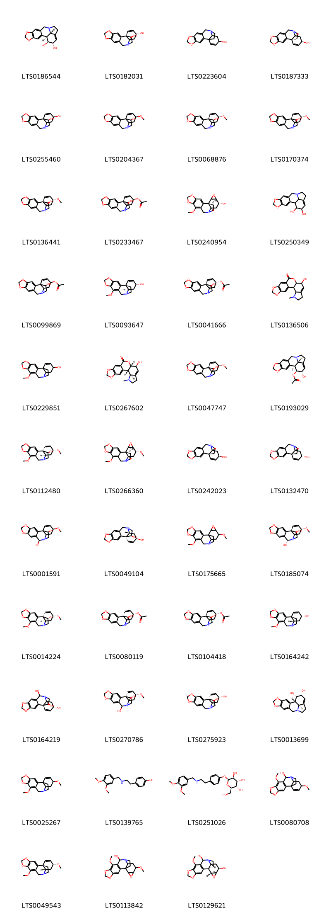
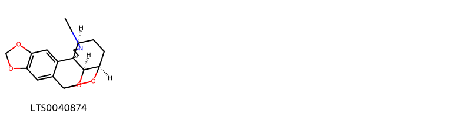
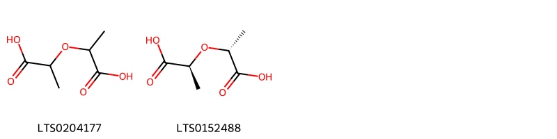
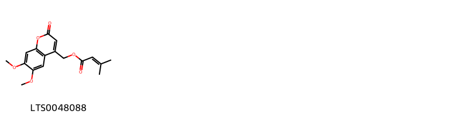
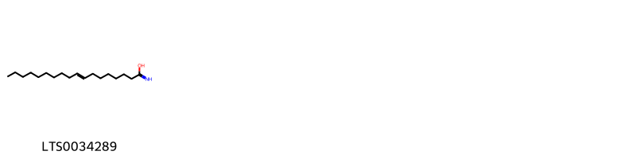
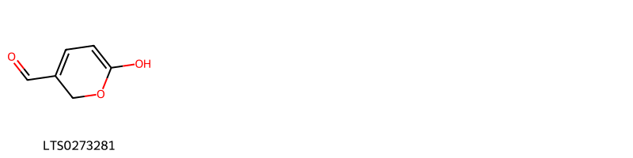
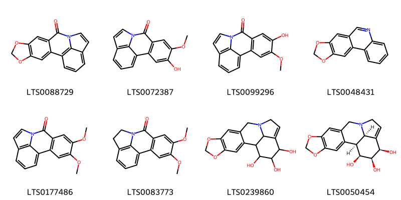
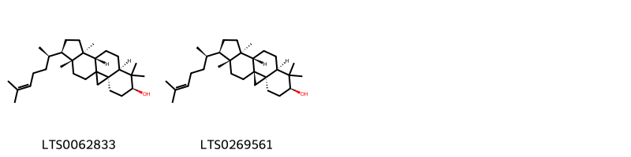
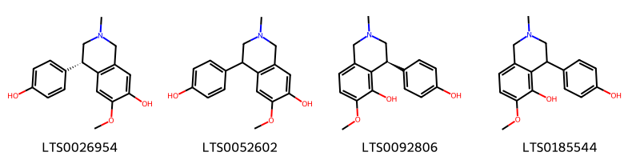

::: {.callout-note title = "Tóm tắt"}

Trinh nữ hoàng cung (Lá) (Folium Crini latifolii) là lá đã phơi hoặc sấy khô của cây Trinh nữ hoàng cung (Crinum latifolium L.), thuộc họ Thủy tiên (Amaryllidaceae). Trinh nữ hoàng cung phân bố chủ yếu ở các khu vực Nam Á và Đông Nam Á như Ấn Độ, Myanmar, Thái Lan, Lào, Campuchia, và Việt Nam. Tại Việt Nam, cây mọc hoang và được trồng ở cả ba miền Bắc, Trung, Nam. Theo y học cổ truyền, Trinh nữ hoàng cung có vị đắng, tính mát, với công năng lợi niệu, nhuyễn kiên, tán kết, tiêu u, và giải độc. Lá thường được dùng chữa tiểu tiện bí dắt, u xơ tuyến tiền liệt, u vú, u tử cung, và đau dạ dày. Lá tươi và thân hành có thể dùng ngoài, hơ nóng xoa bóp vào chỗ sưng đau do thấp khớp hoặc sang chấn. Tác dụng dược lý của Trinh nữ hoàng cung bao gồm kháng viêm, kháng khuẩn, chống oxy hóa, giảm đau, điều hòa kinh nguyệt, chống ung thư, và bảo vệ gan. Thành phần hóa học chính là nhóm alkaloid, trong đó có crinamidin, được xác định qua sắc ký lớp mỏng. 

:::

## I. Thông tin về dược liệu 

::: {.panel-tabset}

### Định danh

- Dược liệu tiếng Việt: Trinh Nữ Hoàng Cung - Lá
- Dược liệu tiếng Trung: nan (nan)
- Dược liệu tiếng Anh: nan
- Dược liệu latin thông dụng: Folium Crini Latifolii
- Dược liệu latin kiểu DĐVN: *nan*
- Dược liệu latin kiểu DĐVN: *nan*
- Dược liệu latin kiểu thông tư: *nan*
- Bộ phận dùng: Lá (Folium)

### Mô tả dược liệu 

**Theo dược điển Việt nam V:** nan 
 
**Mô tả dược liệu theo thông tư chế biến dược liệu theo phương pháp cổ truyền:** nan

### Chế biến 

**Chế biến theo dược điển việt nam V**: nan 

**Chế biến theo thông tư:** nan

::: 

## II. Thông tin về thực vật

Dược liệu **Trinh Nữ Hoàng Cung - Lá** từ bộ phận **Lá** từ loài *Crinum latifolium*.

**Mô tả thực vật:** " Những cây thuốc và vị thuốc Việt Nam " - Đỗ Tất Lợi
Mô tả cây: Trinh nữ hoàng cung là một loại cỏ, thân hành như củ hành tây to, đường kính 10-15cm, bẹ lá úp vào nhau thành một thân giả dài khoảng 10-15cm, có nhiều lá mỏng kéo dài từ 80-100cm, rộng 3-8cm, hai bên mép lá lượn sóng. Gân lá song song, mặt trên lá lõm thành rãnh, mặt dưới lá có một sống lá nổi rất rõ, đầu bẹ lá nơi sát đất có màu tím. Hoa mọc thành tán gồm 6-18 hoa, trên một cán hoa dài 30-60cm . Cánh hoa màu trắng có điểm màu tím đỏ, từ thân hành mọc rất nhiều củ con có thể tách ra để trồng riêng dễ dàng.

*Tài liệu tham khảo:* "Những cây thuốc và vị thuốc Việt Nam" - Đỗ Tất Lợi 
Trong dược điển Việt nam, loài *Crinum latifolium* được sử dụng làm dược liệu.

            
::: {.callout-note title = "Phân loại thực vật của *Crinum latifolium*"}

**Kingdom:** Plantae 

**Phylum:** Tracheophyta 

**Order:** Asparagales 
 
**Family:** Amaryllidaceae 
 
**Genus:** Crinum 
 
**Species:** *Crinum latifolium* 
 

:::

::: {style="display: grid;grid-template-columns: repeat(auto-fill, minmax(150px, 1fr));grid-gap: 1em;"}
{ group="GIBF" }

{ group="GIBF" }

{ group="GIBF" }

{ group="GIBF" }

{ group="GIBF" }

{ group="GIBF" }

{ group="GIBF" }

{ group="GIBF" }

{ group="GIBF" }

{ group="GIBF" }

{ group="GIBF" }

{ group="GIBF" }

{ group="GIBF" }

{ group="GIBF" }

{ group="GIBF" }

{ group="GIBF" }

{ group="GIBF" }

{ group="GIBF" }
:::

**Phân bố trên thế giới:** nan, Marshall Islands, Jamaica, Sri Lanka, Seychelles, Saint Helena, Ascension and Tristan da Cunha, Guadeloupe, Hong Kong, unknown or invalid, Angola, Japan, Martinique, Saint Barthélemy, British Indian Ocean Territory, Madagascar, Indonesia, United Kingdom of Great Britain and Northern Ireland, India, Brazil, Thailand, China, Malaysia, Puerto Rico

**Phân bố tại Việt nam:** Không có ghi nhận ở Việt Nam

<iframe src="Folium Crini Latifolii/map_distribution.html" width="100%" height="600" style="border:none;"></iframe>

## III. Thành phần hóa học

Theo tài liệu của GS. Đỗ Tất Lợi:  Nhóm hóa học: alkaloid 
Tên hoạt chất biomaker: 
            +Sắc ký lớp mỏng: Việc so sánh vết của mẫu thử với vết của crinamidin chuẩn cho thấy sự hiện diện của crinamidin trong dược liệu.
    

Theo cơ sở dữ liệu lotus, loài *Crinum latifolium* đã phân lập và xác định được **63** hoạt chất thuộc về các nhóm Amaryllidaceae alkaloids, Tetrahydroisoquinolines, Steroids and steroid derivatives, Pyrans, Carboxylic acids and derivatives, Quinolines and derivatives, Fatty Acyls, Coumarins and derivatives, Benzopyrans trong bảng dưới đây.
        
| chemicalTaxonomyClassyfireClass   |   smiles_count |
|:----------------------------------|---------------:|
| Amaryllidaceae alkaloids          |           2172 |
| Benzopyrans                       |             57 |
| Carboxylic acids and derivatives  |             50 |
| Coumarins and derivatives         |             38 |
| Fatty Acyls                       |             24 |
| Pyrans                            |             16 |
| Quinolines and derivatives        |            295 |
| Steroids and steroid derivatives  |            180 |
| Tetrahydroisoquinolines           |            144 |

Danh sách chi tiết các hoạt chất như sau: 

::: {style="display: grid;grid-template-columns: repeat(auto-fill, minmax(150px, 1fr));grid-gap: 1em;"}

                                                              
{ group="compound" description="Cấu trúc hóa học của các hoạt chất thuộc nhóm *Amaryllidaceae alkaloids* là lycorine [(LTS0186544)](https://lotus.naturalproducts.net/compound/lotus_id/LTS0186544), hamayne [(LTS0182031)](https://lotus.naturalproducts.net/compound/lotus_id/LTS0182031), 5,7-dioxa-12-azapentacyclo[10.5.2.0¹,¹³.0²,¹⁰.0⁴,⁸]nonadeca-2,4(8),9,16-tetraen-15-ol [(LTS0223604)](https://lotus.naturalproducts.net/compound/lotus_id/LTS0223604), crinine [(LTS0187333)](https://lotus.naturalproducts.net/compound/lotus_id/LTS0187333), 5,7-dioxa-12-azapentacyclo[10.5.2.0¹,¹³.0²,¹⁰.0⁴,⁸]nonadeca-2,4(8),9,16-tetraene-15,18-diol [(LTS0255460)](https://lotus.naturalproducts.net/compound/lotus_id/LTS0255460), 15-methoxy-5,7-dioxa-12-azapentacyclo[10.5.2.0¹,¹³.0²,¹⁰.0⁴,⁸]nonadeca-2,4(8),9,16-tetraen-18-ol [(LTS0204367)](https://lotus.naturalproducts.net/compound/lotus_id/LTS0204367), (1s,15r,18r)-15-methoxy-5,7-dioxa-12-azapentacyclo[10.5.2.0¹,¹³.0²,¹⁰.0⁴,⁸]nonadeca-2,4(8),9,16-tetraen-18-ol [(LTS0068876)](https://lotus.naturalproducts.net/compound/lotus_id/LTS0068876), (1s,13s,15r,18s)-15-methoxy-5,7-dioxa-12-azapentacyclo[10.5.2.0¹,¹³.0²,¹⁰.0⁴,⁸]nonadeca-2,4(8),9,16-tetraen-18-ol [(LTS0170374)](https://lotus.naturalproducts.net/compound/lotus_id/LTS0170374), crinamine [(LTS0136441)](https://lotus.naturalproducts.net/compound/lotus_id/LTS0136441), (1s,13s,15s,18s)-18-hydroxy-5,7-dioxa-12-azapentacyclo[10.5.2.0¹,¹³.0²,¹⁰.0⁴,⁸]nonadeca-2,4(8),9,16-tetraen-15-yl acetate [(LTS0233467)](https://lotus.naturalproducts.net/compound/lotus_id/LTS0233467), crinamidine [(LTS0240954)](https://lotus.naturalproducts.net/compound/lotus_id/LTS0240954), lycorine [(LTS0250349)](https://lotus.naturalproducts.net/compound/lotus_id/LTS0250349), 18-hydroxy-5,7-dioxa-12-azapentacyclo[10.5.2.0¹,¹³.0²,¹⁰.0⁴,⁸]nonadeca-2,4(8),9,16-tetraen-15-yl acetate [(LTS0099869)](https://lotus.naturalproducts.net/compound/lotus_id/LTS0099869), (1s,13r,15r)-9-methoxy-5,7-dioxa-12-azapentacyclo[10.5.2.0¹,¹³.0²,¹⁰.0⁴,⁸]nonadeca-2,4(8),9,16-tetraen-15-ol [(LTS0093647)](https://lotus.naturalproducts.net/compound/lotus_id/LTS0093647), 3-o-acetylhamayne [(LTS0041666)](https://lotus.naturalproducts.net/compound/lotus_id/LTS0041666), 9-hydroxy-4-methyl-11,16,18-trioxa-4-azapentacyclo[11.7.0.0²,¹⁰.0³,⁷.0¹⁵,¹⁹]icosa-1(20),7,13,15(19)-tetraen-12-one [(LTS0136506)](https://lotus.naturalproducts.net/compound/lotus_id/LTS0136506), 9-methoxy-5,7-dioxa-12-azapentacyclo[10.5.2.0¹,¹³.0²,¹⁰.0⁴,⁸]nonadeca-2,4(8),9,16-tetraen-15-ol [(LTS0229851)](https://lotus.naturalproducts.net/compound/lotus_id/LTS0229851), hippeastrine [(LTS0267602)](https://lotus.naturalproducts.net/compound/lotus_id/LTS0267602), (1s,13r,15r,18s)-15-methoxy-5,7-dioxa-12-azapentacyclo[10.5.2.0¹,¹³.0²,¹⁰.0⁴,⁸]nonadeca-2,4(8),9,16-tetraen-18-ol [(LTS0047747)](https://lotus.naturalproducts.net/compound/lotus_id/LTS0047747), 1-o-acetyllycorine [(LTS0193029)](https://lotus.naturalproducts.net/compound/lotus_id/LTS0193029), ambelline [(LTS0112480)](https://lotus.naturalproducts.net/compound/lotus_id/LTS0112480), undulatine [(LTS0266360)](https://lotus.naturalproducts.net/compound/lotus_id/LTS0266360), (1r,13s,15r)-5,7-dioxa-12-azapentacyclo[10.5.2.0¹,¹³.0²,¹⁰.0⁴,⁸]nonadeca-2,4(8),9,16-tetraen-15-ol [(LTS0242023)](https://lotus.naturalproducts.net/compound/lotus_id/LTS0242023), (1r,13s,15s)-5,7-dioxa-12-azapentacyclo[10.5.2.0¹,¹³.0²,¹⁰.0⁴,⁸]nonadeca-2,4(8),9,16-tetraen-15-ol [(LTS0132470)](https://lotus.naturalproducts.net/compound/lotus_id/LTS0132470), 15-methoxy-5,7-dioxa-12-azapentacyclo[10.5.2.0¹,¹³.0²,¹⁰.0⁴,⁸]nonadeca-2,4(8),9,16-tetraene-11,18-diol [(LTS0001591)](https://lotus.naturalproducts.net/compound/lotus_id/LTS0001591), (1s,13r,15r,18s)-5,7-dioxa-12-azapentacyclo[10.5.2.0¹,¹³.0²,¹⁰.0⁴,⁸]nonadeca-2,4(8),9,16-tetraene-15,18-diol [(LTS0049104)](https://lotus.naturalproducts.net/compound/lotus_id/LTS0049104), 9,15-dimethoxy-5,7,17-trioxa-12-azahexacyclo[10.6.2.0¹,¹³.0²,¹⁰.0⁴,⁸.0¹⁶,¹⁸]icosa-2,4(8),9-triene [(LTS0175665)](https://lotus.naturalproducts.net/compound/lotus_id/LTS0175665), (1s,11r,13s,15r,18s)-15-methoxy-5,7-dioxa-12-azapentacyclo[10.5.2.0¹,¹³.0²,¹⁰.0⁴,⁸]nonadeca-2,4(8),9,16-tetraene-11,18-diol [(LTS0185074)](https://lotus.naturalproducts.net/compound/lotus_id/LTS0185074), (1r,13r,15r,18s)-9,15-dimethoxy-5,7-dioxa-12-azapentacyclo[10.5.2.0¹,¹³.0²,¹⁰.0⁴,⁸]nonadeca-2,4(8),9,16-tetraen-18-ol [(LTS0014224)](https://lotus.naturalproducts.net/compound/lotus_id/LTS0014224), 3-o-acetylhamayne [(LTS0080119)](https://lotus.naturalproducts.net/compound/lotus_id/LTS0080119), (1s,13r,15r,18s)-18-hydroxy-5,7-dioxa-12-azapentacyclo[10.5.2.0¹,¹³.0²,¹⁰.0⁴,⁸]nonadeca-2,4(8),9,16-tetraen-15-yl acetate [(LTS0104418)](https://lotus.naturalproducts.net/compound/lotus_id/LTS0104418), (1s,13s,15r)-9-methoxy-5,7-dioxa-12-azapentacyclo[10.5.2.0¹,¹³.0²,¹⁰.0⁴,⁸]nonadeca-2,4(8),9,16-tetraen-15-ol [(LTS0164242)](https://lotus.naturalproducts.net/compound/lotus_id/LTS0164242), (1r,13s,15s,18s)-5,7-dioxa-12-azapentacyclo[10.5.2.0¹,¹³.0²,¹⁰.0⁴,⁸]nonadeca-2,4(8),9,16-tetraene-11,15,18-triol [(LTS0164219)](https://lotus.naturalproducts.net/compound/lotus_id/LTS0164219), (1r,13s,15r,18s)-15-methoxy-5,7-dioxa-12-azapentacyclo[10.5.2.0¹,¹³.0²,¹⁰.0⁴,⁸]nonadeca-2,4(8),9,16-tetraene-11,18-diol [(LTS0270786)](https://lotus.naturalproducts.net/compound/lotus_id/LTS0270786), hamayne [(LTS0275923)](https://lotus.naturalproducts.net/compound/lotus_id/LTS0275923), (1s,17r,18s,19s)-5,7-dioxa-12-azapentacyclo[10.6.1.0²,¹⁰.0⁴,⁸.0¹⁵,¹⁹]nonadeca-2,4(8),9,15-tetraene-17,18-diol [(LTS0013699)](https://lotus.naturalproducts.net/compound/lotus_id/LTS0013699), 9,15-dimethoxy-5,7-dioxa-12-azapentacyclo[10.5.2.0¹,¹³.0²,¹⁰.0⁴,⁸]nonadeca-2,4(8),9,16-tetraene [(LTS0025267)](https://lotus.naturalproducts.net/compound/lotus_id/LTS0025267), 4-(2-{[(3,4-dimethoxyphenyl)methyl]amino}ethyl)phenol [(LTS0139765)](https://lotus.naturalproducts.net/compound/lotus_id/LTS0139765), (2s,3s,4r,5s,6r)-2-[4-(2-{[(3,4-dimethoxyphenyl)methyl]amino}ethyl)phenoxy]-6-(hydroxymethyl)oxane-3,4,5-triol [(LTS0251026)](https://lotus.naturalproducts.net/compound/lotus_id/LTS0251026), 9,15-dimethoxy-5,7-dioxa-12-azapentacyclo[10.5.2.0¹,¹³.0²,¹⁰.0⁴,⁸]nonadeca-2(10),3,8,16-tetraen-11-ol [(LTS0080708)](https://lotus.naturalproducts.net/compound/lotus_id/LTS0080708), (1s,13s,15r)-9,15-dimethoxy-5,7-dioxa-12-azapentacyclo[10.5.2.0¹,¹³.0²,¹⁰.0⁴,⁸]nonadeca-2,4(8),9,16-tetraene [(LTS0049543)](https://lotus.naturalproducts.net/compound/lotus_id/LTS0049543), 9,15-dimethoxy-5,7,17-trioxa-12-azahexacyclo[10.6.2.0¹,¹³.0²,¹⁰.0⁴,⁸.0¹⁶,¹⁸]icosa-2(10),3,8-trien-11-ol [(LTS0113842)](https://lotus.naturalproducts.net/compound/lotus_id/LTS0113842), (1s,13r,15r,16s,18r)-9-methoxy-5,7,17-trioxa-12-azahexacyclo[10.6.2.0¹,¹³.0²,¹⁰.0⁴,⁸.0¹⁶,¹⁸]icosa-2(10),3,8-triene-11,15-diol [(LTS0129621)](https://lotus.naturalproducts.net/compound/lotus_id/LTS0129621)." }

                                                              
{ group="compound" description="Cấu trúc hóa học của các hoạt chất thuộc nhóm *Benzopyrans* là (11s,15r,18r,19s)-14-methyl-5,7,20,21-tetraoxa-14-azahexacyclo[16.2.1.0²,¹⁰.0⁴,⁸.0¹¹,¹⁵.0¹¹,¹⁹]henicosa-2,4(8),9-triene [(LTS0040874)](https://lotus.naturalproducts.net/compound/lotus_id/LTS0040874)." }

                                                              
{ group="compound" description="Cấu trúc hóa học của các hoạt chất thuộc nhóm *Carboxylic acids and derivatives* là 2-(1-carboxyethoxy)propanoic acid [(LTS0204177)](https://lotus.naturalproducts.net/compound/lotus_id/LTS0204177), (2s)-2-[(1r)-1-carboxyethoxy]propanoic acid [(LTS0152488)](https://lotus.naturalproducts.net/compound/lotus_id/LTS0152488)." }

                                                              
{ group="compound" description="Cấu trúc hóa học của các hoạt chất thuộc nhóm *Coumarins and derivatives* là (6,7-dimethoxy-2-oxochromen-4-yl)methyl 3-methylbut-2-enoate [(LTS0048088)](https://lotus.naturalproducts.net/compound/lotus_id/LTS0048088)." }

                                                              
{ group="compound" description="Cấu trúc hóa học của các hoạt chất thuộc nhóm *Fatty Acyls* là octadec-8-enimidic acid [(LTS0034289)](https://lotus.naturalproducts.net/compound/lotus_id/LTS0034289)." }

                                                              
{ group="compound" description="Cấu trúc hóa học của các hoạt chất thuộc nhóm *Pyrans* là 6-hydroxy-2h-pyran-3-carbaldehyde [(LTS0273281)](https://lotus.naturalproducts.net/compound/lotus_id/LTS0273281)." }

                                                              
{ group="compound" description="Cấu trúc hóa học của các hoạt chất thuộc nhóm *Quinolines and derivatives* là 5,7-dioxa-12-azapentacyclo[10.6.1.0²,¹⁰.0⁴,⁸.0¹⁵,¹⁹]nonadeca-1(19),2(10),3,8,13,15,17-heptaen-11-one [(LTS0088729)](https://lotus.naturalproducts.net/compound/lotus_id/LTS0088729), 4-hydroxy-5-methoxy-9-azatetracyclo[7.6.1.0²,⁷.0¹²,¹⁶]hexadeca-1(15),2(7),3,5,10,12(16),13-heptaen-8-one [(LTS0072387)](https://lotus.naturalproducts.net/compound/lotus_id/LTS0072387), 5-hydroxy-4-methoxy-9-azatetracyclo[7.6.1.0²,⁷.0¹²,¹⁶]hexadeca-1(15),2(7),3,5,10,12(16),13-heptaen-8-one [(LTS0099296)](https://lotus.naturalproducts.net/compound/lotus_id/LTS0099296), trisphaeridine [(LTS0048431)](https://lotus.naturalproducts.net/compound/lotus_id/LTS0048431), 4,5-dimethoxy-9-azatetracyclo[7.6.1.0²,⁷.0¹²,¹⁶]hexadeca-1(15),2(7),3,5,10,12(16),13-heptaen-8-one [(LTS0177486)](https://lotus.naturalproducts.net/compound/lotus_id/LTS0177486), oxoassoanine [(LTS0083773)](https://lotus.naturalproducts.net/compound/lotus_id/LTS0083773), 5,7-dioxa-12-azapentacyclo[10.6.1.0²,¹⁰.0⁴,⁸.0¹⁵,¹⁹]nonadeca-2,4(8),9,14-tetraene-16,17,18-triol [(LTS0239860)](https://lotus.naturalproducts.net/compound/lotus_id/LTS0239860), (1s,16r,17s,18s,19r)-5,7-dioxa-12-azapentacyclo[10.6.1.0²,¹⁰.0⁴,⁸.0¹⁵,¹⁹]nonadeca-2,4(8),9,14-tetraene-16,17,18-triol [(LTS0050454)](https://lotus.naturalproducts.net/compound/lotus_id/LTS0050454)." }

                                                              
{ group="compound" description="Cấu trúc hóa học của các hoạt chất thuộc nhóm *Steroids and steroid derivatives* là (3r,6s,8r,11s,12s,15r,16r)-7,7,12,16-tetramethyl-15-[(2r)-6-methylhept-5-en-2-yl]pentacyclo[9.7.0.0¹,³.0³,⁸.0¹²,¹⁶]octadecan-6-ol [(LTS0062833)](https://lotus.naturalproducts.net/compound/lotus_id/LTS0062833), cycloartenol [(LTS0269561)](https://lotus.naturalproducts.net/compound/lotus_id/LTS0269561)." }

                                                              
{ group="compound" description="Cấu trúc hóa học của các hoạt chất thuộc nhóm *Tetrahydroisoquinolines* là cherylline [(LTS0026954)](https://lotus.naturalproducts.net/compound/lotus_id/LTS0026954), 4-(4-hydroxyphenyl)-6-methoxy-2-methyl-3,4-dihydro-1h-isoquinolin-7-ol [(LTS0052602)](https://lotus.naturalproducts.net/compound/lotus_id/LTS0052602), (4s)-4-(4-hydroxyphenyl)-6-methoxy-2-methyl-3,4-dihydro-1h-isoquinolin-5-ol [(LTS0092806)](https://lotus.naturalproducts.net/compound/lotus_id/LTS0092806), 4-(4-hydroxyphenyl)-6-methoxy-2-methyl-3,4-dihydro-1h-isoquinolin-5-ol [(LTS0185544)](https://lotus.naturalproducts.net/compound/lotus_id/LTS0185544)." }

:::

---

## IV. Tác dụng dược lý

Theo tài liệu quốc tế: nan

---

## V. Dược điển Việt Nam V

### Soi bột

nan

::: {#listing-soibot}
:::

### Vi phẫu

nan

::: {#listing-viphau}
:::

### Định tính

nan

### Định lượng

nan

### Thông tin khác 

- **Độ ẩm:** nan
- **Bảo quản:** nan

## VI. Dược điển Hồng kong

::: {#listing-DDHK}
:::

---

## VII. Y dược học cổ truyền

::: {.callout-note title = "nan" }

**Tên vị thuốc:** nan

**Tính:** nan

**Vị:** nan

**Quy kinh:**  nan

**Công năng chủ trị:** nan

**Phân loại theo thông tư:** nan

**Tác dụng theo y dược cổ truyền:** nan

**Chú ý:** nan

**Kiêng kỵ:** nan 

:::

::: {#listing-ViThuoc}
:::

