::: {.callout-note title = "Tóm tắt"}

Lá Mã đề (Folium Plantaginis) là lá đã phơi sấy khô của cây Mã đề (Plantago major L) thuộc họ Plantaginaceae. Phân bố khắp Việt Nam cũng như gần hết các quốc gia trên thế giới. Mã đề là loại cây cỏ sống lâu năm, thân ngắn, lá mọc thành cụm ở gốc, cuống dài, phiến lá hình thìa hay hình trứng, có gân dọc theo sống lá và đồng quy ở ngọn và gốc lá. Mã đề chứa nhiều thành phần hóa học  iridoid, acid phenolic, flavonoid, lá có chất nhầy, chất đắng, carotin, vitamin C, vitamin K. Có tác dụng thanh nhiệt trừ đờm, lợi tiểu. dùng để trị ho, viêm phế quản, bí tiểu tiện thường được sử dụng dưới dạng nước sắc.

:::

## I. Thông tin về dược liệu 

::: {.panel-tabset}

### Định danh

- Dược liệu tiếng Việt: Mã Đề - Lá
- Dược liệu tiếng Trung: ? (?)
- Dược liệu tiếng Anh: ?
- Dược liệu latin thông dụng: Folium Plantaginis
- Dược liệu latin kiểu DĐVN: *Folium Plantaginis*
- Dược liệu latin kiểu DĐVN: *Plantaginis Herba*
- Dược liệu latin kiểu thông tư: *nan*
- Bộ phận dùng: Lá (Folium)

### Mô tả dược liệu 

**Theo dược điển Việt nam V:** Lá nhăn nheo, nhàu nát, giống như cái thìa, đỉnh tù, đáy  thuôn hẹp, dài 7 cm đến 10 cm, rộng 5 cm đến 7 cm. Mặt  trên lá màu lục sẫm, mặt dưới màu lục nhạt. Phiến lá dày,  nhẵn. Mép nguyên có 3 đến 5 gân hình cung, lồi nhiều về  phía mặt dưới lá. Cuống dài 5 cm đến 10 cm, rộng ra về  phía gốc. 
 
**Mô tả dược liệu theo thông tư chế biến dược liệu theo phương pháp cổ truyền:** nan

### Chế biến 

**Chế biến theo dược điển việt nam V**: Hái lá lúc cây sắp ra hoa hay đang ra hoa, rửa sạch, phơi  hay sấy khô ở 40 °C đến 50 °C. 

**Chế biến theo thông tư:** nan

::: 

## II. Thông tin về thực vật

Dược liệu **Mã Đề - Lá** từ bộ phận **Lá** từ loài *Plantago major*.

**Mô tả thực vật:** Mã đề là loại cây cỏ sống lâu năm, thân ngắn, lá mọc thành cụm ở gốc, cuống dài, phiến lá hình thìa hay hình trứng, có gân dọc theo sống lá và đồng quy ở ngọn và gốc lá. Hoa đều, lưỡng tính, đài 4, xếp chéo, đính nhau ở gốc; tràng hoa mỏng, có 4 thùy hình tam giác nhọn, xếp xen kẽ với các lá đài. Nhị 4 chỉ nhị mảnh, dài, 2 lá noãn chứa nhiều tiểu noãn. Quả hộp trong chứa nhiều hạt màu nâu đen bóng.

*Tài liệu tham khảo:* "Những cây thuốc và vị thuốc Việt Nam" - Đỗ Tất Lợi 
Trong dược điển Việt nam, loài *Plantago major* được sử dụng làm dược liệu.

            
::: {.callout-note title = "Phân loại thực vật của *Plantago major*"}

**Kingdom:** Plantae 

**Phylum:** Tracheophyta 

**Order:** Lamiales 
 
**Family:** Plantaginaceae 
 
**Genus:** Plantago 
 
**Species:** *Plantago major* 
 

:::

::: {style="display: grid;grid-template-columns: repeat(auto-fill, minmax(150px, 1fr));grid-gap: 1em;"}
{ group="GIBF" }

{ group="GIBF" }

{ group="GIBF" }

{ group="GIBF" }

{ group="GIBF" }

{ group="GIBF" }
:::

**Phân bố trên thế giới:** Germany, Switzerland, Haiti, Chile, Netherlands, Spain, Mexico, Chinese Taipei, Colombia, Sweden, Hong Kong, South Africa, Australia, Russian Federation, Portugal, Honduras, United Kingdom of Great Britain and Northern Ireland, Brazil, Argentina, Ukraine, Thailand, United States of America, China, Norway, New Zealand, Canada, Ecuador, Greece, Puerto Rico, Denmark, Austria

**Phân bố tại Việt nam:** Không có ghi nhận ở Việt Nam

<iframe src="Folium Plantaginis/map_distribution.html" width="100%" height="600" style="border:none;"></iframe>

## III. Thành phần hóa học

Theo tài liệu của GS. Đỗ Tất Lợi:  (1) iridoid, acid phenolic, flavonoid
(2) Iridoid: aucubosid, catalpol
      flavonoid: apigenin, scutelarein, baicalein, nopirin
      acidcinamic, acid ferulic, acid cafeic, caroten, vitamin K, vitamin C
    

Theo cơ sở dữ liệu lotus, loài *Plantago major* đã phân lập và xác định được **159** hoạt chất thuộc về các nhóm Cinnamic acids and derivatives, Benzofurans, Flavonoids, Tannins, Steroids and steroid derivatives, Carboxylic acids and derivatives, Organooxygen compounds, Benzene and substituted derivatives, Saturated hydrocarbons, Fatty Acyls, Hydroxy acids and derivatives, Phenols, Prenol lipids trong bảng dưới đây.
        
| chemicalTaxonomyClassyfireClass     |   smiles_count |
|:------------------------------------|---------------:|
| Benzene and substituted derivatives |            129 |
| Benzofurans                         |             64 |
| Carboxylic acids and derivatives    |             85 |
| Cinnamic acids and derivatives      |           4363 |
| Fatty Acyls                         |             62 |
| Flavonoids                          |           1274 |
| Hydroxy acids and derivatives       |             38 |
| Organooxygen compounds              |           1402 |
| Phenols                             |             14 |
| Prenol lipids                       |           2284 |
| Saturated hydrocarbons              |            295 |
| Steroids and steroid derivatives    |            348 |
| Tannins                             |            818 |

Danh sách chi tiết các hoạt chất như sau: 

::: {style="display: grid;grid-template-columns: repeat(auto-fill, minmax(150px, 1fr));grid-gap: 1em;"}

                                                              
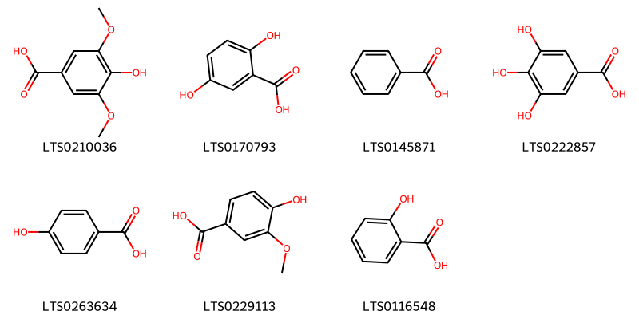{ group="compound" description="Cấu trúc hóa học của các hoạt chất thuộc nhóm *Benzene and substituted derivatives* là syringic acid [(LTS0210036)](https://lotus.naturalproducts.net/compound/lotus_id/LTS0210036), 2,5-dihydroxybenzoic acid [(LTS0170793)](https://lotus.naturalproducts.net/compound/lotus_id/LTS0170793), benzoic acid [(LTS0145871)](https://lotus.naturalproducts.net/compound/lotus_id/LTS0145871), galop [(LTS0222857)](https://lotus.naturalproducts.net/compound/lotus_id/LTS0222857), p-hydroxybenzoic acid [(LTS0263634)](https://lotus.naturalproducts.net/compound/lotus_id/LTS0263634), vanillic acid [(LTS0229113)](https://lotus.naturalproducts.net/compound/lotus_id/LTS0229113), salicyclic acid [(LTS0116548)](https://lotus.naturalproducts.net/compound/lotus_id/LTS0116548)." }

                                                              
{ group="compound" description="Cấu trúc hóa học của các hoạt chất thuộc nhóm *Benzofurans* là loliolide [(LTS0254454)](https://lotus.naturalproducts.net/compound/lotus_id/LTS0254454), loliolide [(LTS0119422)](https://lotus.naturalproducts.net/compound/lotus_id/LTS0119422)." }

                                                              
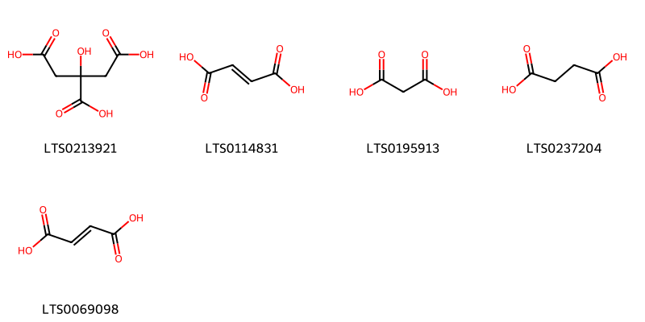{ group="compound" description="Cấu trúc hóa học của các hoạt chất thuộc nhóm *Carboxylic acids and derivatives* là citric acid [(LTS0213921)](https://lotus.naturalproducts.net/compound/lotus_id/LTS0213921), fumaric acid [(LTS0114831)](https://lotus.naturalproducts.net/compound/lotus_id/LTS0114831), malonic acid [(LTS0195913)](https://lotus.naturalproducts.net/compound/lotus_id/LTS0195913), succinic acid [(LTS0237204)](https://lotus.naturalproducts.net/compound/lotus_id/LTS0237204), butenedioic acid [(LTS0069098)](https://lotus.naturalproducts.net/compound/lotus_id/LTS0069098)." }

                                                              
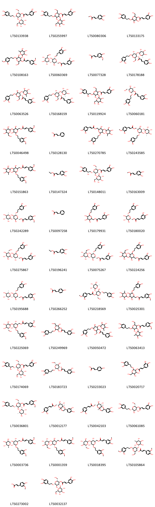{ group="compound" description="Cấu trúc hóa học của các hoạt chất thuộc nhóm *Cinnamic acids and derivatives* là (2r,3r,4r,5r,6r)-6-[2-(3,4-dihydroxyphenyl)ethoxy]-5-hydroxy-2-(hydroxymethyl)-4-{[(2r,3r,4s,5s,6r)-3,4,5-trihydroxy-6-(hydroxymethyl)oxan-2-yl]oxy}oxan-3-yl (2e)-3-(3,4-dihydroxyphenyl)prop-2-enoate [(LTS0133938)](https://lotus.naturalproducts.net/compound/lotus_id/LTS0133938), 6-[2-(3,4-dihydroxyphenyl)ethoxy]-5-hydroxy-2-(hydroxymethyl)-4-{[3,4,5-trihydroxy-6-(hydroxymethyl)oxan-2-yl]oxy}oxan-3-yl 3-(3,4-dihydroxyphenyl)prop-2-enoate [(LTS0255997)](https://lotus.naturalproducts.net/compound/lotus_id/LTS0255997), methyl 3-(3,4-dihydroxyphenyl)prop-2-enoate [(LTS0080306)](https://lotus.naturalproducts.net/compound/lotus_id/LTS0080306), 6-[2-(3,4-dihydroxyphenyl)ethoxy]-4,5-dihydroxy-2-(hydroxymethyl)oxan-3-yl 3-(3,4-dihydroxyphenyl)prop-2-enoate [(LTS0133175)](https://lotus.naturalproducts.net/compound/lotus_id/LTS0133175), 5-hydroxy-6-[2-(3-hydroxy-4-methoxyphenyl)ethoxy]-2-(hydroxymethyl)-4-[(3,4,5-trihydroxy-6-methyloxan-2-yl)oxy]oxan-3-yl 3-(4-hydroxy-3-methoxyphenyl)prop-2-enoate [(LTS0108163)](https://lotus.naturalproducts.net/compound/lotus_id/LTS0108163), [(2r,3r,4s,5r,6r)-6-[2-(3,4-dihydroxyphenyl)ethoxy]-3,5-dihydroxy-4-{[(2r,3r,4s,5s,6r)-3,4,5-trihydroxy-6-(hydroxymethyl)oxan-2-yl]oxy}oxan-2-yl]methyl (2e)-3-(3,4-dihydroxyphenyl)prop-2-enoate [(LTS0060369)](https://lotus.naturalproducts.net/compound/lotus_id/LTS0060369), ferulic acid [(LTS0077328)](https://lotus.naturalproducts.net/compound/lotus_id/LTS0077328), (2r,3r,4r,5r,6r)-6-[2-(3,4-dihydroxyphenyl)ethoxy]-5-hydroxy-2-(hydroxymethyl)-4-{[(2s,3r,4s,5r,6s)-3,4,5-trihydroxy-6-methyloxan-2-yl]oxy}oxan-3-yl (2e)-3-(3,4-dihydroxyphenyl)prop-2-enoate [(LTS0178188)](https://lotus.naturalproducts.net/compound/lotus_id/LTS0178188), (3r,4r,6r)-6-[2-(3,4-dihydroxyphenyl)ethoxy]-5-hydroxy-2-(hydroxymethyl)-4-{[(2s,3s,5r)-3,4,5-trihydroxy-6-methyloxan-2-yl]oxy}oxan-3-yl (2e)-3-(3,4-dihydroxyphenyl)prop-2-enoate [(LTS0063526)](https://lotus.naturalproducts.net/compound/lotus_id/LTS0063526), verbascoside [(LTS0168159)](https://lotus.naturalproducts.net/compound/lotus_id/LTS0168159), 6-[2-(3,4-dihydroxyphenyl)-2-hydroxyethoxy]-5-hydroxy-2-(hydroxymethyl)-4-{[3,4,5-trihydroxy-6-(hydroxymethyl)oxan-2-yl]oxy}oxan-3-yl 3-(3,4-dihydroxyphenyl)prop-2-enoate [(LTS0119924)](https://lotus.naturalproducts.net/compound/lotus_id/LTS0119924), (2r,3r,4s,5s,6r)-2-[2-(3,4-dihydroxyphenyl)ethoxy]-4,5-dihydroxy-6-(hydroxymethyl)oxan-3-yl (2e)-3-(3,4-dihydroxyphenyl)prop-2-enoate [(LTS0060181)](https://lotus.naturalproducts.net/compound/lotus_id/LTS0060181), {3,5-dihydroxy-6-[2-(3-hydroxy-4-methoxyphenyl)ethoxy]-4-{[3,4,5-trihydroxy-6-(hydroxymethyl)oxan-2-yl]oxy}oxan-2-yl}methyl 3-(4-hydroxy-3-methoxyphenyl)prop-2-enoate [(LTS0046498)](https://lotus.naturalproducts.net/compound/lotus_id/LTS0046498), cinnamic acid [(LTS0128130)](https://lotus.naturalproducts.net/compound/lotus_id/LTS0128130), {6-[2-(3,4-dihydroxyphenyl)ethoxy]-3,5-dihydroxy-4-[(3,4,5-trihydroxy-6-methyloxan-2-yl)oxy]oxan-2-yl}methyl 3-(3,4-dihydroxyphenyl)prop-2-enoate [(LTS0270785)](https://lotus.naturalproducts.net/compound/lotus_id/LTS0270785), [(2r,3r,4s,5r,6r)-6-[2-(3,4-dihydroxyphenyl)ethoxy]-3,5-dihydroxy-4-{[(2s,3r,4r,5r,6s)-3,4,5-trihydroxy-6-methyloxan-2-yl]oxy}oxan-2-yl]methyl (2e)-3-(3-hydroxy-4-methoxyphenyl)prop-2-enoate [(LTS0243585)](https://lotus.naturalproducts.net/compound/lotus_id/LTS0243585), {3,5-dihydroxy-6-[2-(3-hydroxy-4-methoxyphenyl)ethoxy]-4-[(3,4,5-trihydroxy-6-methyloxan-2-yl)oxy]oxan-2-yl}methyl 3-(4-hydroxy-3-methoxyphenyl)prop-2-enoate [(LTS0151863)](https://lotus.naturalproducts.net/compound/lotus_id/LTS0151863), ethyl caffeate [(LTS0147324)](https://lotus.naturalproducts.net/compound/lotus_id/LTS0147324), (2r,3r,4r,5r,6r)-6-[(2r)-2-(3,4-dihydroxyphenyl)-2-hydroxyethoxy]-5-hydroxy-2-(hydroxymethyl)-4-{[(2s,3r,4s,5s,6r)-3,4,5-trihydroxy-6-(hydroxymethyl)oxan-2-yl]oxy}oxan-3-yl (2e)-3-(3,4-dihydroxyphenyl)prop-2-enoate [(LTS0148011)](https://lotus.naturalproducts.net/compound/lotus_id/LTS0148011), methyl caffeate [(LTS0163009)](https://lotus.naturalproducts.net/compound/lotus_id/LTS0163009), [(2r,3r,4s,5r,6r)-6-[2-(3,4-dihydroxyphenyl)ethoxy]-3,5-dihydroxy-4-{[(2s,3r,4r,5r,6s)-3,4,5-trihydroxy-6-methyloxan-2-yl]oxy}oxan-2-yl]methyl (2e)-3-(4-hydroxy-3-methoxyphenyl)prop-2-enoate [(LTS0242289)](https://lotus.naturalproducts.net/compound/lotus_id/LTS0242289), phenylacrylic acid [(LTS0097258)](https://lotus.naturalproducts.net/compound/lotus_id/LTS0097258), {6-[2-(3,4-dihydroxyphenyl)ethoxy]-3,4,5-trihydroxyoxan-2-yl}methyl 3-(3,4-dihydroxyphenyl)prop-2-enoate [(LTS0179931)](https://lotus.naturalproducts.net/compound/lotus_id/LTS0179931), calceolarioside b [(LTS0180020)](https://lotus.naturalproducts.net/compound/lotus_id/LTS0180020), [(2r,3s,4s,5r,6s)-6-[2-(3,4-dihydroxyphenyl)ethoxy]-3,5-dihydroxy-4-{[(2s,3s,4r,5r,6s)-3,4,5-trihydroxy-6-(hydroxymethyl)oxan-2-yl]oxy}oxan-2-yl]methyl (2e)-3-(3,4-dihydroxyphenyl)prop-2-enoate [(LTS0275867)](https://lotus.naturalproducts.net/compound/lotus_id/LTS0275867), ethyl 3-(3,4-dihydroxyphenyl)prop-2-enoate [(LTS0196241)](https://lotus.naturalproducts.net/compound/lotus_id/LTS0196241), [(2r,3r,4s,5r,6r)-6-[2-(3,4-dihydroxyphenyl)ethoxy]-3,5-dihydroxy-4-{[(2s,3r,4s,5s,6r)-3,4,5-trihydroxy-6-(hydroxymethyl)oxan-2-yl]oxy}oxan-2-yl]methyl (2e)-3-(3,4-dihydroxyphenyl)prop-2-enoate [(LTS0075267)](https://lotus.naturalproducts.net/compound/lotus_id/LTS0075267), {6-[2-(3,4-dihydroxyphenyl)ethoxy]-3,5-dihydroxy-4-{[3,4,5-trihydroxy-6-(hydroxymethyl)oxan-2-yl]oxy}oxan-2-yl}methyl 3-(3,4-dihydroxyphenyl)prop-2-enoate [(LTS0224256)](https://lotus.naturalproducts.net/compound/lotus_id/LTS0224256), [(2r,3r,4s,5r,6r)-6-[2-(3,4-dihydroxyphenyl)ethoxy]-3,5-dihydroxy-4-{[(2r,3r,4r,5r,6s)-3,4,5-trihydroxy-6-methyloxan-2-yl]oxy}oxan-2-yl]methyl (2e)-3-(4-hydroxy-3-methoxyphenyl)prop-2-enoate [(LTS0195688)](https://lotus.naturalproducts.net/compound/lotus_id/LTS0195688), para-coumaric acid [(LTS0266252)](https://lotus.naturalproducts.net/compound/lotus_id/LTS0266252), (2r,3r,4r,5r,6r)-6-[2-(3,4-dihydroxyphenyl)ethoxy]-5-hydroxy-2-(hydroxymethyl)-4-{[(2s,3r,4r,5r,6s)-3,4,5-trihydroxy-6-methyloxan-2-yl]oxy}oxan-3-yl (2e)-3-(3-hydroxy-4-methoxyphenyl)prop-2-enoate [(LTS0218569)](https://lotus.naturalproducts.net/compound/lotus_id/LTS0218569), {6-[2-(3,4-dihydroxyphenyl)ethoxy]-3,5-dihydroxy-4-[(3,4,5-trihydroxy-6-methyloxan-2-yl)oxy]oxan-2-yl}methyl 3-(4-hydroxy-3-methoxyphenyl)prop-2-enoate [(LTS0025301)](https://lotus.naturalproducts.net/compound/lotus_id/LTS0025301), [(2r,3r,4s,5r,6r)-3,5-dihydroxy-6-[2-(3-hydroxy-4-methoxyphenyl)ethoxy]-4-{[(2r,3r,4r,5s,6r)-3,4,5-trihydroxy-6-(hydroxymethyl)oxan-2-yl]oxy}oxan-2-yl]methyl (2e)-3-(4-hydroxy-3-methoxyphenyl)prop-2-enoate [(LTS0225069)](https://lotus.naturalproducts.net/compound/lotus_id/LTS0225069), 2-[2-(3,4-dihydroxyphenyl)ethoxy]-3,5-dihydroxy-6-(hydroxymethyl)oxan-4-yl 3-(3,4-dihydroxyphenyl)prop-2-enoate [(LTS0249969)](https://lotus.naturalproducts.net/compound/lotus_id/LTS0249969), 6-[2-(3,4-dihydroxyphenyl)ethoxy]-5-hydroxy-2-(hydroxymethyl)-4-[(3,4,5-trihydroxy-6-methyloxan-2-yl)oxy]oxan-3-yl 3-(3,4-dihydroxyphenyl)prop-2-enoate [(LTS0050472)](https://lotus.naturalproducts.net/compound/lotus_id/LTS0050472), 6-[2-(3,4-dihydroxyphenyl)ethoxy]-5-hydroxy-2-(hydroxymethyl)-4-[(3,4,5-trihydroxy-6-methyloxan-2-yl)oxy]oxan-3-yl 3-(4-hydroxy-3-methoxyphenyl)prop-2-enoate [(LTS0063413)](https://lotus.naturalproducts.net/compound/lotus_id/LTS0063413), hellicoside [(LTS0174069)](https://lotus.naturalproducts.net/compound/lotus_id/LTS0174069), (2r,3r,4s,5r,6r)-2-[2-(3,4-dihydroxyphenyl)ethoxy]-3,5-dihydroxy-6-(hydroxymethyl)oxan-4-yl (2e)-3-(3,4-dihydroxyphenyl)prop-2-enoate [(LTS0183723)](https://lotus.naturalproducts.net/compound/lotus_id/LTS0183723), hydroxycinnamic acid [(LTS0233023)](https://lotus.naturalproducts.net/compound/lotus_id/LTS0233023), 2-[2-(3,4-dihydroxyphenyl)ethoxy]-4,5-dihydroxy-6-(hydroxymethyl)oxan-3-yl 3-(3,4-dihydroxyphenyl)prop-2-enoate [(LTS0020717)](https://lotus.naturalproducts.net/compound/lotus_id/LTS0020717), (2r,3r,4r,5r,6r)-6-[2-(3,4-dihydroxyphenyl)ethoxy]-5-hydroxy-2-(hydroxymethyl)-4-{[(2r,3r,4r,5r,6s)-3,4,5-trihydroxy-6-methyloxan-2-yl]oxy}oxan-3-yl (2e)-3-(4-hydroxy-3-methoxyphenyl)prop-2-enoate [(LTS0036801)](https://lotus.naturalproducts.net/compound/lotus_id/LTS0036801), [(2s,4ar,6r,7s,8s,8ar)-2-(3,4-dihydroxyphenyl)-7,8-dihydroxy-hexahydro-2h-pyrano[2,3-b][1,4]dioxin-6-yl]methyl (2e)-3-(3,4-dihydroxyphenyl)prop-2-enoate [(LTS0012177)](https://lotus.naturalproducts.net/compound/lotus_id/LTS0012177), [(4ar,6r,7s,8s,8ar)-2-(3,4-dihydroxyphenyl)-7,8-dihydroxy-hexahydro-2h-pyrano[2,3-b][1,4]dioxin-6-yl]methyl (2e)-3-(3,4-dihydroxyphenyl)prop-2-enoate [(LTS0042103)](https://lotus.naturalproducts.net/compound/lotus_id/LTS0042103), (2r,3s,4r,5r,6r)-6-[2-(3,4-dihydroxyphenyl)ethoxy]-4,5-dihydroxy-2-(hydroxymethyl)oxan-3-yl (2e)-3-(3,4-dihydroxyphenyl)prop-2-enoate [(LTS0061085)](https://lotus.naturalproducts.net/compound/lotus_id/LTS0061085), [(2r,3r,4s,5r,6r)-3,5-dihydroxy-6-[2-(3-hydroxy-4-methoxyphenyl)ethoxy]-4-{[(2s,3r,4r,5r,6s)-3,4,5-trihydroxy-6-methyloxan-2-yl]oxy}oxan-2-yl]methyl (2e)-3-(4-hydroxy-3-methoxyphenyl)prop-2-enoate [(LTS0003736)](https://lotus.naturalproducts.net/compound/lotus_id/LTS0003736), [(2r,3s,4s,5s,6s)-3,5-dihydroxy-6-[2-(3-hydroxy-4-methoxyphenyl)ethoxy]-4-{[(2r,3s,4s,5s,6s)-3,4,5-trihydroxy-6-(hydroxymethyl)oxan-2-yl]oxy}oxan-2-yl]methyl (2e)-3-(4-hydroxy-3-methoxyphenyl)prop-2-enoate [(LTS0001359)](https://lotus.naturalproducts.net/compound/lotus_id/LTS0001359), [(2r,3r,4s,5r,6r)-3,5-dihydroxy-6-[2-(3-hydroxy-4-methoxyphenyl)ethoxy]-4-{[(2r,3r,4s,5s,6r)-3,4,5-trihydroxy-6-(hydroxymethyl)oxan-2-yl]oxy}oxan-2-yl]methyl (2e)-3-(4-hydroxy-3-methoxyphenyl)prop-2-enoate [(LTS0018395)](https://lotus.naturalproducts.net/compound/lotus_id/LTS0018395), (2r,3r,4r,5r,6r)-5-hydroxy-6-[2-(3-hydroxy-4-methoxyphenyl)ethoxy]-2-(hydroxymethyl)-4-{[(2s,3r,4r,5r,6s)-3,4,5-trihydroxy-6-methyloxan-2-yl]oxy}oxan-3-yl (2e)-3-(4-hydroxy-3-methoxyphenyl)prop-2-enoate [(LTS0105864)](https://lotus.naturalproducts.net/compound/lotus_id/LTS0105864), ferulic acid [(LTS0273002)](https://lotus.naturalproducts.net/compound/lotus_id/LTS0273002), plantamajoside [(LTS0032137)](https://lotus.naturalproducts.net/compound/lotus_id/LTS0032137), [(2r,3r,4s,5r,6r)-6-[2-(3,4-dihydroxyphenyl)ethoxy]-3,5-dihydroxy-4-{[(2r,3r,4r,5r,6s)-3,4,5-trihydroxy-6-methyloxan-2-yl]oxy}oxan-2-yl]methyl (2e)-3-(3,4-dihydroxyphenyl)prop-2-enoate [(LTS0126301)](https://lotus.naturalproducts.net/compound/lotus_id/LTS0126301), [2-(3,4-dihydroxyphenyl)-7,8-dihydroxy-hexahydro-2h-pyrano[2,3-b][1,4]dioxin-6-yl]methyl 3-(3,4-dihydroxyphenyl)prop-2-enoate [(LTS0043685)](https://lotus.naturalproducts.net/compound/lotus_id/LTS0043685)." }

                                                              
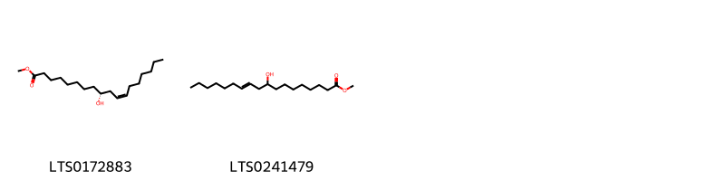{ group="compound" description="Cấu trúc hóa học của các hoạt chất thuộc nhóm *Fatty Acyls* là methyl (9r,11z)-9-hydroxyoctadec-11-enoate [(LTS0172883)](https://lotus.naturalproducts.net/compound/lotus_id/LTS0172883), methyl 9-hydroxyoctadec-11-enoate [(LTS0241479)](https://lotus.naturalproducts.net/compound/lotus_id/LTS0241479)." }

                                                              
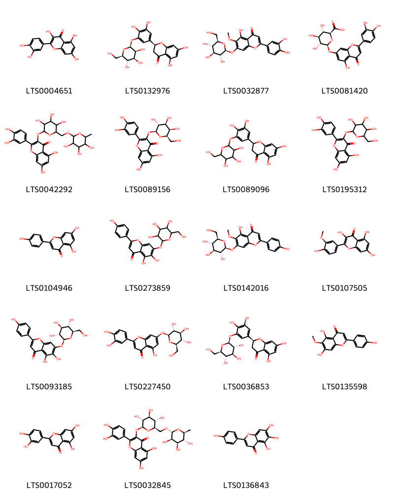{ group="compound" description="Cấu trúc hóa học của các hoạt chất thuộc nhóm *Flavonoids* là quercetin [(LTS0004651)](https://lotus.naturalproducts.net/compound/lotus_id/LTS0004651), (2s)-2-(3,4-dihydroxy-5-{[(2s,3s,4s,5s,6r)-3,4,5-trihydroxy-6-(hydroxymethyl)oxan-2-yl]oxy}phenyl)-5,7-dihydroxy-2,3-dihydro-1-benzopyran-4-one [(LTS0132976)](https://lotus.naturalproducts.net/compound/lotus_id/LTS0132976), nepitrin [(LTS0032877)](https://lotus.naturalproducts.net/compound/lotus_id/LTS0032877), luteolin 7-o-glucuronide [(LTS0081420)](https://lotus.naturalproducts.net/compound/lotus_id/LTS0081420), rutin [(LTS0042292)](https://lotus.naturalproducts.net/compound/lotus_id/LTS0042292), hyperoside [(LTS0089156)](https://lotus.naturalproducts.net/compound/lotus_id/LTS0089156), plantagoside [(LTS0089096)](https://lotus.naturalproducts.net/compound/lotus_id/LTS0089096), 2-(3,4-dihydroxyphenyl)-5,7-dihydroxy-3-{[3,4,5-trihydroxy-6-(hydroxymethyl)oxan-2-yl]oxy}chromen-4-one [(LTS0195312)](https://lotus.naturalproducts.net/compound/lotus_id/LTS0195312), chamomile [(LTS0104946)](https://lotus.naturalproducts.net/compound/lotus_id/LTS0104946), 5,6-dihydroxy-2-(4-hydroxyphenyl)-7-{[3,4,5-trihydroxy-6-(hydroxymethyl)oxan-2-yl]oxy}chromen-4-one [(LTS0273859)](https://lotus.naturalproducts.net/compound/lotus_id/LTS0273859), homoplantaginin [(LTS0142016)](https://lotus.naturalproducts.net/compound/lotus_id/LTS0142016), isorhamnetin [(LTS0107505)](https://lotus.naturalproducts.net/compound/lotus_id/LTS0107505), plantaginin [(LTS0093185)](https://lotus.naturalproducts.net/compound/lotus_id/LTS0093185), luteolin 7-o-glucoside [(LTS0227450)](https://lotus.naturalproducts.net/compound/lotus_id/LTS0227450), plantagoside [(LTS0036853)](https://lotus.naturalproducts.net/compound/lotus_id/LTS0036853), hispidulin [(LTS0135598)](https://lotus.naturalproducts.net/compound/lotus_id/LTS0135598), luteolin [(LTS0017052)](https://lotus.naturalproducts.net/compound/lotus_id/LTS0017052), 3-rutinosyl quercetin [(LTS0032845)](https://lotus.naturalproducts.net/compound/lotus_id/LTS0032845), scutellarein [(LTS0136843)](https://lotus.naturalproducts.net/compound/lotus_id/LTS0136843)." }

                                                              
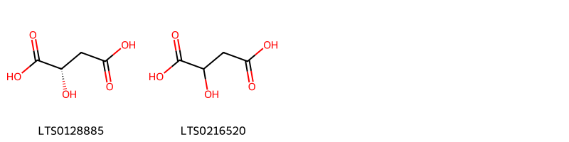{ group="compound" description="Cấu trúc hóa học của các hoạt chất thuộc nhóm *Hydroxy acids and derivatives* là (-)-malic acid [(LTS0128885)](https://lotus.naturalproducts.net/compound/lotus_id/LTS0128885), malic acid [(LTS0216520)](https://lotus.naturalproducts.net/compound/lotus_id/LTS0216520)." }

                                                              
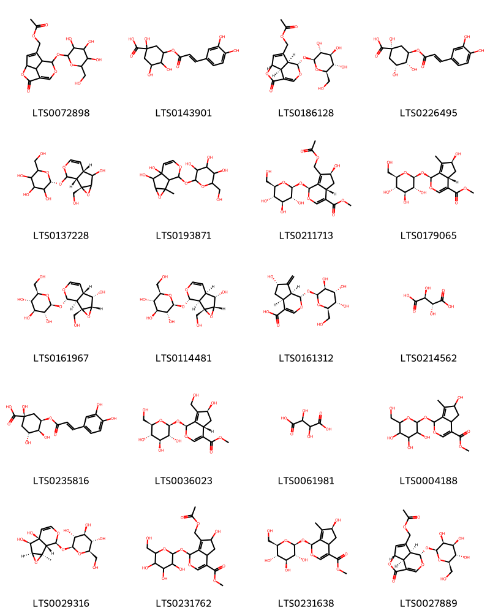{ group="compound" description="Cấu trúc hóa học của các hoạt chất thuộc nhóm *Organooxygen compounds* là asperuloside [(LTS0072898)](https://lotus.naturalproducts.net/compound/lotus_id/LTS0072898), 3-{[3-(3,4-dihydroxyphenyl)prop-2-enoyl]oxy}-1,4,5-trihydroxycyclohexane-1-carboxylic acid [(LTS0143901)](https://lotus.naturalproducts.net/compound/lotus_id/LTS0143901), asperuloside [(LTS0186128)](https://lotus.naturalproducts.net/compound/lotus_id/LTS0186128), chlorogenic acid [(LTS0226495)](https://lotus.naturalproducts.net/compound/lotus_id/LTS0226495), (2r)-2-{[(1r,2s,6s)-5-hydroxy-2-(hydroxymethyl)-3,9-dioxatricyclo[4.4.0.0²,⁴]dec-7-en-10-yl]oxy}-6-(hydroxymethyl)oxane-3,4,5-triol [(LTS0137228)](https://lotus.naturalproducts.net/compound/lotus_id/LTS0137228), 2-({5,6-dihydroxy-2-methyl-3,9-dioxatricyclo[4.4.0.0²,⁴]dec-7-en-10-yl}oxy)-6-(hydroxymethyl)oxane-3,4,5-triol [(LTS0193871)](https://lotus.naturalproducts.net/compound/lotus_id/LTS0193871), methyl (1s,4as,6s)-7-[(acetyloxy)methyl]-6-hydroxy-1-{[(2s,3r,4s,5s,6r)-3,4,5-trihydroxy-6-(hydroxymethyl)oxan-2-yl]oxy}-1h,4ah,5h,6h-cyclopenta[c]pyran-4-carboxylate [(LTS0211713)](https://lotus.naturalproducts.net/compound/lotus_id/LTS0211713), methyl (1s,4as,6s)-6-hydroxy-7-methyl-1-{[(2s,3r,4s,5s,6r)-3,4,5-trihydroxy-6-(hydroxymethyl)oxan-2-yl]oxy}-1h,4ah,5h,6h-cyclopenta[c]pyran-4-carboxylate [(LTS0179065)](https://lotus.naturalproducts.net/compound/lotus_id/LTS0179065), (2s,3r,4s,5s,6r)-2-{[(1s,2s,4s,5s,6s,10s)-5-hydroxy-2-(hydroxymethyl)-3,9-dioxatricyclo[4.4.0.0²,⁴]dec-7-en-10-yl]oxy}-6-(hydroxymethyl)oxane-3,4,5-triol [(LTS0161967)](https://lotus.naturalproducts.net/compound/lotus_id/LTS0161967), catalpol [(LTS0114481)](https://lotus.naturalproducts.net/compound/lotus_id/LTS0114481), (1s,4as,6s,7as)-6-hydroxy-7-methylidene-1-{[(2s,3s,4r,5s,6r)-3,4,5-trihydroxy-6-(hydroxymethyl)oxan-2-yl]oxy}-1h,4ah,5h,6h,7ah-cyclopenta[c]pyran-4-carboxylic acid [(LTS0161312)](https://lotus.naturalproducts.net/compound/lotus_id/LTS0161312), (-)-tartaric acid [(LTS0214562)](https://lotus.naturalproducts.net/compound/lotus_id/LTS0214562), neochlorogenic acid [(LTS0235816)](https://lotus.naturalproducts.net/compound/lotus_id/LTS0235816), methyl (1s,4as,6s)-6-hydroxy-7-(hydroxymethyl)-1-{[(2s,3r,4s,5s,6r)-3,4,5-trihydroxy-6-(hydroxymethyl)oxan-2-yl]oxy}-1h,4ah,5h,6h-cyclopenta[c]pyran-4-carboxylate [(LTS0036023)](https://lotus.naturalproducts.net/compound/lotus_id/LTS0036023), (.+-.)-tartaric acid [(LTS0061981)](https://lotus.naturalproducts.net/compound/lotus_id/LTS0061981), methyl 6-hydroxy-7-methyl-1-{[3,4,5-trihydroxy-6-(hydroxymethyl)oxan-2-yl]oxy}-1h,4ah,5h,6h-cyclopenta[c]pyran-4-carboxylate [(LTS0004188)](https://lotus.naturalproducts.net/compound/lotus_id/LTS0004188), antirrhinoside [(LTS0029316)](https://lotus.naturalproducts.net/compound/lotus_id/LTS0029316), methyl 7-[(acetyloxy)methyl]-6-hydroxy-1-{[3,4,5-trihydroxy-6-(hydroxymethyl)oxan-2-yl]oxy}-1h,4ah,5h,6h-cyclopenta[c]pyran-4-carboxylate [(LTS0231762)](https://lotus.naturalproducts.net/compound/lotus_id/LTS0231762), methyl (1s,6s)-6-hydroxy-7-methyl-1-{[(2s,3r,4s,5s,6r)-3,4,5-trihydroxy-6-(hydroxymethyl)oxan-2-yl]oxy}-1h,4ah,5h,6h-cyclopenta[c]pyran-4-carboxylate [(LTS0231638)](https://lotus.naturalproducts.net/compound/lotus_id/LTS0231638), [(4r,7s,8s,11s)-2-oxo-8-{[(2s,3s,4s,5s,6r)-3,4,5-trihydroxy-6-(hydroxymethyl)oxan-2-yl]oxy}-3,9-dioxatricyclo[5.3.1.0⁴,¹¹]undeca-1(10),5-dien-6-yl]methyl acetate [(LTS0027889)](https://lotus.naturalproducts.net/compound/lotus_id/LTS0027889)." }

                                                              
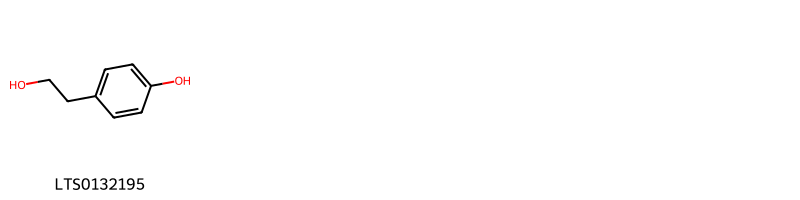{ group="compound" description="Cấu trúc hóa học của các hoạt chất thuộc nhóm *Phenols* là tyrosol [(LTS0132195)](https://lotus.naturalproducts.net/compound/lotus_id/LTS0132195)." }

                                                              
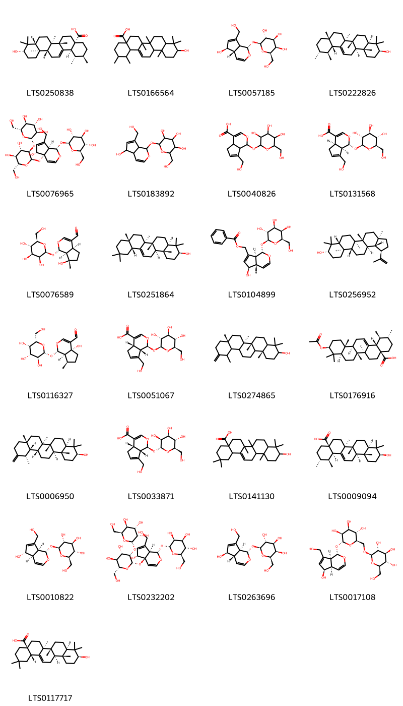{ group="compound" description="Cấu trúc hóa học của các hoạt chất thuộc nhóm *Prenol lipids* là ursolic acid [(LTS0250838)](https://lotus.naturalproducts.net/compound/lotus_id/LTS0250838), 10-hydroxy-1,2,6a,6b,9,9,12a-heptamethyl-2,3,4,5,6,7,8,8a,10,11,12,12b,13,14b-tetradecahydro-1h-picene-4a-carboxylic acid [(LTS0166564)](https://lotus.naturalproducts.net/compound/lotus_id/LTS0166564), (2s,3r,4s,5r,6r)-2-{[(1s,4as,5r)-5-hydroxy-7-(hydroxymethyl)-1h,4ah,5h,7ah-cyclopenta[c]pyran-1-yl]oxy}-6-(hydroxymethyl)oxane-3,4,5-triol [(LTS0057185)](https://lotus.naturalproducts.net/compound/lotus_id/LTS0057185), amyrin [(LTS0222826)](https://lotus.naturalproducts.net/compound/lotus_id/LTS0222826), (2s,3r,4s,5s,6r)-2-{[(2r,3r,4s,5s,6r)-2-{[(1s,4as,5r,7ar)-5-hydroxy-7-(hydroxymethyl)-1-{[(2s,3r,4s,5s,6r)-3,4,5-trihydroxy-6-(hydroxymethyl)oxan-2-yl]oxy}-1h,5h,7ah-cyclopenta[c]pyran-4a-yl]oxy}-4,5-dihydroxy-6-(hydroxymethyl)oxan-3-yl]oxy}-6-(hydroxymethyl)oxane-3,4,5-triol [(LTS0076965)](https://lotus.naturalproducts.net/compound/lotus_id/LTS0076965), aucubin [(LTS0183892)](https://lotus.naturalproducts.net/compound/lotus_id/LTS0183892), 7-(hydroxymethyl)-1-{[3,4,5-trihydroxy-6-(hydroxymethyl)oxan-2-yl]oxy}-1h,4ah,5h,7ah-cyclopenta[c]pyran-4-carboxylic acid [(LTS0040826)](https://lotus.naturalproducts.net/compound/lotus_id/LTS0040826), (1r,4ar,7ar)-7-(hydroxymethyl)-1-{[(2s,3r,4s,5s,6r)-3,4,5-trihydroxy-6-(hydroxymethyl)oxan-2-yl]oxy}-1h,4ah,5h,7ah-cyclopenta[c]pyran-4-carboxylic acid [(LTS0131568)](https://lotus.naturalproducts.net/compound/lotus_id/LTS0131568), (1s,4as,7s,7as)-7-hydroxy-7-methyl-1-{[(2s,3s,4s,5s,6r)-3,4,5-trihydroxy-6-(hydroxymethyl)oxan-2-yl]oxy}-1h,4ah,5h,6h,7ah-cyclopenta[c]pyran-4-carbaldehyde [(LTS0076589)](https://lotus.naturalproducts.net/compound/lotus_id/LTS0076589), β-amyrin [(LTS0251864)](https://lotus.naturalproducts.net/compound/lotus_id/LTS0251864), [(1s,4as,5r,7as)-5-hydroxy-1-{[(2s,3r,4s,5r,6r)-3,4,5-trihydroxy-6-(hydroxymethyl)oxan-2-yl]oxy}-1h,4ah,5h,7ah-cyclopenta[c]pyran-7-yl]methyl benzoate [(LTS0104899)](https://lotus.naturalproducts.net/compound/lotus_id/LTS0104899), lupeol [(LTS0256952)](https://lotus.naturalproducts.net/compound/lotus_id/LTS0256952), (1s,4ar,7r,7ar)-4a-hydroxy-7-methyl-1-{[(2r,3s,4r,5s,6s)-3,4,5-trihydroxy-6-(hydroxymethyl)oxan-2-yl]oxy}-1h,5h,6h,7h,7ah-cyclopenta[c]pyran-4-carbaldehyde [(LTS0116327)](https://lotus.naturalproducts.net/compound/lotus_id/LTS0116327), geniposidic acid [(LTS0051067)](https://lotus.naturalproducts.net/compound/lotus_id/LTS0051067), (6ar,6br,8ar,14br)-4,4,6a,6b,8a,12,14b-heptamethyl-11-methylidene-hexadecahydropicen-3-ol [(LTS0274865)](https://lotus.naturalproducts.net/compound/lotus_id/LTS0274865), (1s,2r,4as,6as,6br,8ar,10s,12ar,12br,14bs)-10-(acetyloxy)-1,2,6a,6b,9,9,12a-heptamethyl-2,3,4,5,6,7,8,8a,10,11,12,12b,13,14b-tetradecahydro-1h-picene-4a-carboxylic acid [(LTS0176916)](https://lotus.naturalproducts.net/compound/lotus_id/LTS0176916), taraxasterol [(LTS0006950)](https://lotus.naturalproducts.net/compound/lotus_id/LTS0006950), (1s,4as,7as)-7-(hydroxymethyl)-1-{[(2r,3s,4s,5s,6r)-3,4,5-trihydroxy-6-(hydroxymethyl)oxan-2-yl]oxy}-1h,4ah,5h,7ah-cyclopenta[c]pyran-4-carboxylic acid [(LTS0033871)](https://lotus.naturalproducts.net/compound/lotus_id/LTS0033871), oleanolic acid [(LTS0141130)](https://lotus.naturalproducts.net/compound/lotus_id/LTS0141130), (1s,2r,4as,6as,6br,8ar,10s,12ar,12br,14br)-10-hydroxy-1,2,6a,6b,9,9,12a-heptamethyl-2,3,4,5,6,7,8,8a,10,11,12,12b,13,14b-tetradecahydro-1h-picene-4a-carboxylic acid [(LTS0009094)](https://lotus.naturalproducts.net/compound/lotus_id/LTS0009094), aucubin [(LTS0010822)](https://lotus.naturalproducts.net/compound/lotus_id/LTS0010822), (2s,3s,4s,5s,6s)-2-{[(2s,3s,4s,5s,6r)-2-{[(1s,4ar,5r,7ar)-5-hydroxy-7-(hydroxymethyl)-1-{[(2r,3s,4s,5s,6r)-3,4,5-trihydroxy-6-(hydroxymethyl)oxan-2-yl]oxy}-1h,5h,7ah-cyclopenta[c]pyran-4a-yl]oxy}-4,5-dihydroxy-6-(hydroxymethyl)oxan-3-yl]oxy}-6-(hydroxymethyl)oxane-3,4,5-triol [(LTS0232202)](https://lotus.naturalproducts.net/compound/lotus_id/LTS0232202), (2s,3r,4s,5r,6r)-2-{[(1s,4as,5r,7as)-5-hydroxy-7-(hydroxymethyl)-1h,4ah,5h,7ah-cyclopenta[c]pyran-1-yl]oxy}-6-(hydroxymethyl)oxane-3,4,5-triol [(LTS0263696)](https://lotus.naturalproducts.net/compound/lotus_id/LTS0263696), (2r,3s,4s,5s,6r)-2-{[(1s,4ar,5r,7as)-5-hydroxy-7-(hydroxymethyl)-1h,4ah,5h,7ah-cyclopenta[c]pyran-1-yl]oxy}-6-({[(2r,3r,4s,5s,6r)-3,4,5-trihydroxy-6-(hydroxymethyl)oxan-2-yl]oxy}methyl)oxane-3,4,5-triol [(LTS0017108)](https://lotus.naturalproducts.net/compound/lotus_id/LTS0017108), oleanolic acid [(LTS0117717)](https://lotus.naturalproducts.net/compound/lotus_id/LTS0117717)." }

                                                              
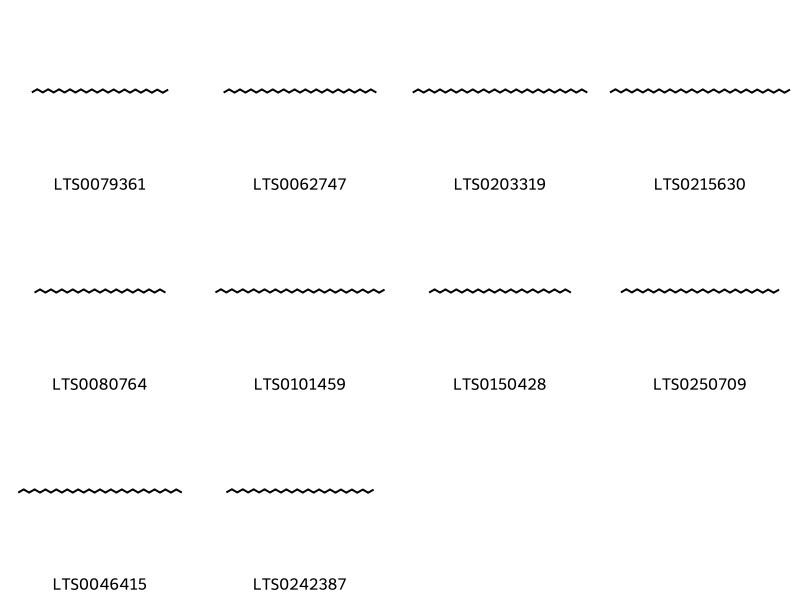{ group="compound" description="Cấu trúc hóa học của các hoạt chất thuộc nhóm *Saturated hydrocarbons* là hexacosane [(LTS0079361)](https://lotus.naturalproducts.net/compound/lotus_id/LTS0079361), nonacosane [(LTS0062747)](https://lotus.naturalproducts.net/compound/lotus_id/LTS0062747), tritriacontane [(LTS0203319)](https://lotus.naturalproducts.net/compound/lotus_id/LTS0203319), tetratriacontane [(LTS0215630)](https://lotus.naturalproducts.net/compound/lotus_id/LTS0215630), pentacosane [(LTS0080764)](https://lotus.naturalproducts.net/compound/lotus_id/LTS0080764), dotriacontane [(LTS0101459)](https://lotus.naturalproducts.net/compound/lotus_id/LTS0101459), heptacosane [(LTS0150428)](https://lotus.naturalproducts.net/compound/lotus_id/LTS0150428), triacontane [(LTS0250709)](https://lotus.naturalproducts.net/compound/lotus_id/LTS0250709), hentriacontane [(LTS0046415)](https://lotus.naturalproducts.net/compound/lotus_id/LTS0046415), octacosane [(LTS0242387)](https://lotus.naturalproducts.net/compound/lotus_id/LTS0242387)." }

                                                              
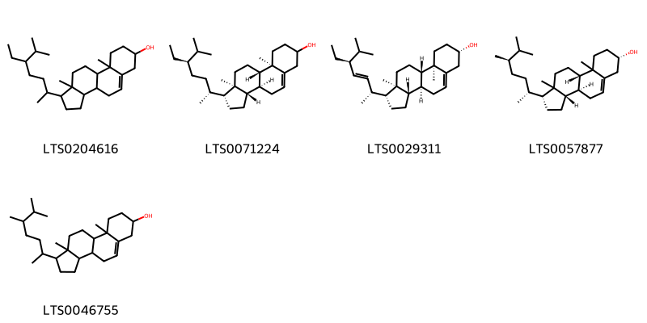{ group="compound" description="Cấu trúc hóa học của các hoạt chất thuộc nhóm *Steroids and steroid derivatives* là stigmast-5-en-3-ol, (3β)- [(LTS0204616)](https://lotus.naturalproducts.net/compound/lotus_id/LTS0204616), stigmast-5-en-3-ol [(LTS0071224)](https://lotus.naturalproducts.net/compound/lotus_id/LTS0071224), phytosterol [(LTS0029311)](https://lotus.naturalproducts.net/compound/lotus_id/LTS0029311), (1r,3as,3bs,7s,9bs)-1-[(2r,5r)-5,6-dimethylheptan-2-yl]-9a,11a-dimethyl-1h,2h,3h,3ah,3bh,4h,6h,7h,8h,9h,9bh,10h,11h-cyclopenta[a]phenanthren-7-ol [(LTS0057877)](https://lotus.naturalproducts.net/compound/lotus_id/LTS0057877), campesterol [(LTS0046755)](https://lotus.naturalproducts.net/compound/lotus_id/LTS0046755)." }

                                                              
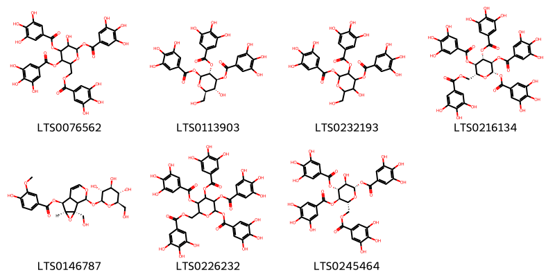{ group="compound" description="Cấu trúc hóa học của các hoạt chất thuộc nhóm *Tannins* là 3-hydroxy-4,5-bis(3,4,5-trihydroxybenzoyloxy)-6-[(3,4,5-trihydroxybenzoyloxy)methyl]oxan-2-yl 3,4,5-trihydroxybenzoate [(LTS0076562)](https://lotus.naturalproducts.net/compound/lotus_id/LTS0076562), (2r,3r,4s,5r,6s)-3-hydroxy-2-(hydroxymethyl)-5,6-bis(3,4,5-trihydroxybenzoyloxy)oxan-4-yl 3,4,5-trihydroxybenzoate [(LTS0113903)](https://lotus.naturalproducts.net/compound/lotus_id/LTS0113903), 3-hydroxy-2-(hydroxymethyl)-5,6-bis(3,4,5-trihydroxybenzoyloxy)oxan-4-yl 3,4,5-trihydroxybenzoate [(LTS0232193)](https://lotus.naturalproducts.net/compound/lotus_id/LTS0232193), (2s,3r,4s,5r,6r)-3,4,5-tris(3,4,5-trihydroxybenzoyloxy)-6-[(3,4,5-trihydroxybenzoyloxy)methyl]oxan-2-yl 3,4,5-trihydroxybenzoate [(LTS0216134)](https://lotus.naturalproducts.net/compound/lotus_id/LTS0216134), (2s,4s,5s,10s)-2-(hydroxymethyl)-10-{[(2s,3r,4s,5s,6r)-3,4,5-trihydroxy-6-(hydroxymethyl)oxan-2-yl]oxy}-3,9-dioxatricyclo[4.4.0.0²,⁴]dec-7-en-5-yl 4-hydroxy-3-methoxybenzoate [(LTS0146787)](https://lotus.naturalproducts.net/compound/lotus_id/LTS0146787), 3,4,5-tris(3,4,5-trihydroxybenzoyloxy)-6-[(3,4,5-trihydroxybenzoyloxy)methyl]oxan-2-yl 3,4,5-trihydroxybenzoate [(LTS0226232)](https://lotus.naturalproducts.net/compound/lotus_id/LTS0226232), (2s,3r,4r,5r,6r)-3-hydroxy-4,5-bis(3,4,5-trihydroxybenzoyloxy)-6-[(3,4,5-trihydroxybenzoyloxy)methyl]oxan-2-yl 3,4,5-trihydroxybenzoate [(LTS0245464)](https://lotus.naturalproducts.net/compound/lotus_id/LTS0245464)." }

:::

---

## IV. Tác dụng dược lý

Theo tài liệu quốc tế: nan

---

## V. Dược điển Việt Nam V

### Soi bột

Màu xám nâu nhạt, vị hơi chát, hơi đắng, hơi mặn. Soi  kính hiển vi thấy mảnh biểu bì trên và dưới gồm tế bào  thành mỏng ngoằn ngoèo mang lỗ khí và lông tiết. Lỗ khí  có tế bào bạn hình dạng thay đổi, biểu bì trên có nhiều hơn  biểu bì dưới. Lông tiết có đầu 2 tế bào, chân đa bào đính  trên tế bào tròn, thành mỏng, xung quanh có nhiều đường  vân tỏa ra, có khi lông đã rụng để lại vết tích của chân  lông. Mảnh cuống lá gồm tế bào hình nhiều cạnh mang  lông tiết đầu 2 tế bào. Mảnh mạch.

::: {#listing-soibot}
:::

### Vi phẫu

Biểu bì trên và dưới gồm một lớp tế bào hình gần vuông,  xếp đều đặn có chứa lỗ khí và lỏng tiết. Lớp mỏ dày góc  dưới gán lá xếp sảt biểu bì, gồm những tế bào hình nhiều  cạnh. Mô mềm gồm những tế bào hình tròn hoặc nhiều  cạnh, thành mỏng và hơi uốn lượn, có khoảng gian bào  hình nhiều cạnh. Bó libe-gỗ hình tròn xếp giữa gân lá gồm:  vòng nội bì bao bọc xung quanh, cung libe xếp sát cung  mô dày dưới, gỗ ở trên libe, mạch gỗ xếp nơi nhau thành  dãy thẳng hàng. nn

::: {#listing-viphau}
:::

### Định tính

A.Lấy 1 g bột dược liệu, tiến hành vi thăng hoa (Phụ lục 12.2), soi kính hiển vi thấy có tinh thể hình kim. B. Lấy 0,5 g bột dược liệu, thêm 5 ml nước, đun sôi 1 min rồi để nguội, lọc. Lấy 1 giọt dịch lọc nhỏ lên phiến kính,  hơ nhẹ trên đèn cồn cho khô, đem soi kính hiển vi thấy có  tinh thể hình vuông và hình chữ nhật. C. Dưới ánh sáng từ ngoại bước sóng 366 nm, bột dược  liệu phát quang màu nâu.

### Định lượng

nan

### Thông tin khác 

- **Độ ẩm:** Không quá 13,0 % (Phụ lục 9.6, 1 g, 105 °C, 4 h).
- **Bảo quản:** Để nơi khô mát.

## VI. Dược điển Hồng kong

::: {#listing-DDHK}
:::

---

## VII. Y dược học cổ truyền

::: {.callout-note title = "nan" }

**Tên vị thuốc:** nan

**Tính:** nan

**Vị:** nan

**Quy kinh:**  nan

**Công năng chủ trị:** Cam, hàn. Vào các kinh can, phế, thận, tiêu trường, bàng  quang.

**Phân loại theo thông tư:** nan

**Tác dụng theo y dược cổ truyền:** nan

**Chú ý:** nan

**Kiêng kỵ:** Phụ nữ có thai dùng phải thận trọng. Người già thận kém,  đái đêm nhiêu không nên dùng. 

:::

::: {#listing-ViThuoc}
:::

