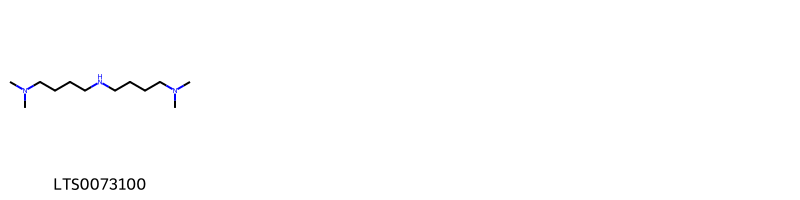

::: {.callout-note title = "Tóm tắt"}

Lá ngoi (Folium Solani erianthi) là lá đã phơi hay sấy khô của cây Ngoi (Solanum erianthum D. Don), họ Cà (Solanaceae). Cây phân bố rộng rãi ở các vùng nhiệt đới và cận nhiệt đới, đặc biệt là Đông Nam Á và Nam Á. Lá Ngoi có vị đắng, cay, tính ấm, có độc. Dược liều dụng trị đau dạ dày, phong thấp tê bại, mụn nhọt ung độc, đòn ngã tổn thương, gẫy xương, bệnh bạch cầu hạt mạn tính, dùng ngoài trị viêm da có mủ, lòi dom, hắc lào, lao hạch. Lá ngoi có chứa nhiều hợp chất có hoạt tính sinh học như: Glycoalcaloid (đặc biệt là Solasonin, solamargine, solasodine), Flavonoid, Tinh dầu.

:::

## I. Thông tin về dược liệu 

::: {.panel-tabset}

### Định danh

- Dược liệu tiếng Việt: Ngoi - Lá
- Dược liệu tiếng Trung: nan (nan)
- Dược liệu tiếng Anh: nan
- Dược liệu latin thông dụng: Folium Solani Erianthi
- Dược liệu latin kiểu DĐVN: *nan*
- Dược liệu latin kiểu DĐVN: *nan*
- Dược liệu latin kiểu thông tư: *nan*
- Bộ phận dùng: Lá (Folium)

### Mô tả dược liệu 

**Theo dược điển Việt nam V:** nan 
 
**Mô tả dược liệu theo thông tư chế biến dược liệu theo phương pháp cổ truyền:** nan

### Chế biến 

**Chế biến theo dược điển việt nam V**: nan 

**Chế biến theo thông tư:** nan

::: 

## II. Thông tin về thực vật

Dược liệu **Ngoi - Lá** từ bộ phận **Lá** từ loài *Solanum erianthum*.

**Mô tả thực vật:** - Cây  nhỏ, cao 1.5 - 5m.
- Thân và cành có lông hình sao màu vàng nhạt, cành non mọc tỏa rộng.
- Lá mọc so le, hình trái xoan hoặc hình trứng, dài 12 - 20cm, rộng 6 - 11cm, gốc hình nêm, đầu thuôn nhọn, mép nguyên; hai mặt phủ lông mịn, cuống lá dài 3 - 5cm.
- Cụm hoa mọc ở kẽ lá hoặc cành bên thành xim phân nhánh, có lông mịn như len, nhiều hoa màu trắng: đài nhẵn hình phễu, xẻ 5 thùy nhọn; tràng dài gấp 2 lần đài; cánh hoa có lông tơ ở mặt ngoài; nhị 5, bao phấn nứt ngang ở đỉnh; bầu có lông.
- Quả nhỏ, mọng, hình cầu, khi chín màu vàng, chứa nhiều hạt có vân mạng.
- Mùa hoa quả: tháng 3 - 11.

*Tài liệu tham khảo:* Tài liệu khác 
Trong dược điển Việt nam, loài *Solanum erianthum* được sử dụng làm dược liệu.

            
::: {.callout-note title = "Phân loại thực vật của *Solanum erianthum*"}

**Kingdom:** Plantae 

**Phylum:** Tracheophyta 

**Order:** Solanales 
 
**Family:** Solanaceae 
 
**Genus:** Solanum 
 
**Species:** *Solanum erianthum* 
 

:::

::: {style="display: grid;grid-template-columns: repeat(auto-fill, minmax(150px, 1fr));grid-gap: 1em;"}
{ group="GIBF" }

{ group="GIBF" }

{ group="GIBF" }

{ group="GIBF" }

{ group="GIBF" }

{ group="GIBF" }

{ group="GIBF" }

{ group="GIBF" }
:::

**Phân bố trên thế giới:** Thailand, United States of America, Mexico, Chinese Taipei, Honduras, China, Hong Kong, Haiti, Dominican Republic, Colombia, Belize, India, Cuba, Jamaica

**Phân bố tại Việt nam:** Không có ghi nhận ở Việt Nam

<iframe src="Folium Solani Erianthi/map_distribution.html" width="100%" height="600" style="border:none;"></iframe>

## III. Thành phần hóa học

Theo tài liệu của GS. Đỗ Tất Lợi:  Các nghiên cứu đã chỉ ra rằng, trong cây ngoi có chứa nhiều hợp chất có hoạt tính sinh học, trong đó đáng chú ý là các nhóm hợp chất sau:
- Glycoalcaloid: Đây là nhóm hợp chất đặc trưng của họ cà (Solanaceae), bao gồm solasonin, solamargine, solasodine, solaverbascin, solaverin I, II, III, solaverol A, B. Các hợp chất này có tác dụng chống viêm, giảm đau, kháng khuẩn và chống ung thư.
- Flavonoid: Nhóm hợp chất này có tác dụng chống oxy hóa, bảo vệ tế bào, giảm viêm.
- Tinh dầu: Tinh dầu của cây ngoi chứa các thành phần như monoterpen, sesquiterpen, có tác dụng kháng khuẩn, chống nấm.
    

Theo cơ sở dữ liệu lotus, loài *Solanum erianthum* đã phân lập và xác định được **1** hoạt chất thuộc về các nhóm Organonitrogen compounds trong bảng dưới đây.
        
| chemicalTaxonomyClassyfireClass   |   smiles_count |
|:----------------------------------|---------------:|
| Organonitrogen compounds          |             19 |

Danh sách chi tiết các hoạt chất như sau: 

::: {style="display: grid;grid-template-columns: repeat(auto-fill, minmax(150px, 1fr));grid-gap: 1em;"}

                                                              
{ group="compound" description="Cấu trúc hóa học của các hoạt chất thuộc nhóm *Organonitrogen compounds* là (4-{[4-(dimethylamino)butyl]amino}butyl)dimethylamine [(LTS0073100)](https://lotus.naturalproducts.net/compound/lotus_id/LTS0073100)." }

:::

---

## IV. Tác dụng dược lý

Theo tài liệu quốc tế: nan

---

## V. Dược điển Việt Nam V

### Soi bột

nan

::: {#listing-soibot}
:::

### Vi phẫu

nan

::: {#listing-viphau}
:::

### Định tính

nan

### Định lượng

nan

### Thông tin khác 

- **Độ ẩm:** nan
- **Bảo quản:** nan

## VI. Dược điển Hồng kong

::: {#listing-DDHK}
:::

---

## VII. Y dược học cổ truyền

::: {.callout-note title = "nan" }

**Tên vị thuốc:** nan

**Tính:** nan

**Vị:** nan

**Quy kinh:**  nan

**Công năng chủ trị:** nan

**Phân loại theo thông tư:** nan

**Tác dụng theo y dược cổ truyền:** nan

**Chú ý:** nan

**Kiêng kỵ:** nan 

:::

::: {#listing-ViThuoc}
:::

