::: {.callout-note title = "Tóm tắt"}

nan

:::

## I. Thông tin về dược liệu 

::: {.panel-tabset}

### Định danh

- Dược liệu tiếng Việt: Ngưu Bàng - Quả
- Dược liệu tiếng Trung: 牛蒡子 (Niu Bang Zi)
- Dược liệu tiếng Anh: Arctium Lappa
- Dược liệu latin thông dụng: Fructus Arcti Lappae
- Dược liệu latin kiểu DĐVN: *Fructus Arcti Lappae*
- Dược liệu latin kiểu DĐVN: *Arctii Fructus*
- Dược liệu latin kiểu thông tư: *nan*
- Bộ phận dùng: Quả (Fructus)

### Mô tả dược liệu 

**Theo dược điển Việt nam V:** Quả hình trứng ngược dài, hơi dẹt, hơi cong, dài 5 mm  đến 7 mm, rộng 2 mm đến 3 mm. Mặt ngoài màu nâu hơi  xám, có đốm màu đến, có vài gân dọc, thường có 1 đến 2  gân giữa tương đối rõ. Đỉnh tròn tù, hơi rộng, có vòng tròn  ờ đỉnh và vết vòi nhụy nhọn còn sốt lại ở chính giữa. Đáy  quả hơi hẹp lại. vỏ quả tương đối cứng, khi nứt ra, trong  có một hạt. Vỏ hạt mỏng, hai lá mầm màu trắng hơi vàng,  có dầu. Không mùi, vị đắng, hơi cay và tê lưỡi. 
 
**Mô tả dược liệu theo thông tư chế biến dược liệu theo phương pháp cổ truyền:** nan

### Chế biến 

**Chế biến theo dược điển việt nam V**: Thu hoạch vào mùa thu, hái lấy chùm quả chín, phơi khô,  . đập nhẹ lấy quả, loại bỏ tạp chất rồi lại phơi khô. Bào chế Ngưu bằng tử: Loại bỏ tạp chất, rửa sạch, phơi khô, khi  dùng đập thành từng mảnh. Ngưu bằng tử sao: Cho Ngưu bằng tử sạch vào nồi, sao  nhỏ lửa đến khi hơi phồng lên, hơi có mùi thơm. Khi dùng  giã nát. 

**Chế biến theo thông tư:** nan

::: 

## II. Thông tin về thực vật

Dược liệu **Ngưu Bàng - Quả** từ bộ phận **Quả** từ loài *Arctium lappa*.

**Mô tả thực vật:** nan

*Tài liệu tham khảo:* nan 
Trong dược điển Việt nam, loài *Arctium lappa* được sử dụng làm dược liệu.

            
::: {.callout-note title = "Phân loại thực vật của *Arctium lappa*"}

**Kingdom:** Plantae 

**Phylum:** Tracheophyta 

**Order:** Asterales 
 
**Family:** Asteraceae 
 
**Genus:** Arctium 
 
**Species:** *Arctium lappa* 
 

:::

::: {style="display: grid;grid-template-columns: repeat(auto-fill, minmax(150px, 1fr));grid-gap: 1em;"}
{ group="GIBF" }

{ group="GIBF" }

{ group="GIBF" }

{ group="GIBF" }

{ group="GIBF" }

{ group="GIBF" }

{ group="GIBF" }

{ group="GIBF" }

{ group="GIBF" }

{ group="GIBF" }

{ group="GIBF" }

{ group="GIBF" }

{ group="GIBF" }
:::

**Phân bố trên thế giới:** Germany, France, Switzerland, Czechia, Belgium, Netherlands, Spain, Poland, Sweden, Russian Federation, United Kingdom of Great Britain and Northern Ireland, Brazil, Ukraine, United States of America, Kazakhstan, Italy, Norway, Canada, Denmark, Austria, Luxembourg

**Phân bố tại Việt nam:** Không có ghi nhận ở Việt Nam

<iframe src="Fructus Arcti Lappae/map_distribution.html" width="100%" height="600" style="border:none;"></iframe>

## III. Thành phần hóa học

Theo tài liệu của GS. Đỗ Tất Lợi:  nan
    

Theo cơ sở dữ liệu lotus, loài *Arctium lappa* đã phân lập và xác định được **151** hoạt chất thuộc về các nhóm 2-arylbenzofuran flavonoids, Lignan glycosides, Bi- and oligothiophenes, Dibenzylbutane lignans, Steroids and steroid derivatives, Carboxylic acids and derivatives, Organooxygen compounds, Benzene and substituted derivatives, Diazines, Fatty Acyls, Epoxides, Phenols, Prenol lipids, Furanoid lignans, Unsaturated hydrocarbons trong bảng dưới đây.
        
| chemicalTaxonomyClassyfireClass     |   smiles_count |
|:------------------------------------|---------------:|
| 2-arylbenzofuran flavonoids         |           2399 |
| Benzene and substituted derivatives |             23 |
| Bi- and oligothiophenes             |            349 |
| Carboxylic acids and derivatives    |            622 |
| Diazines                            |             11 |
| Dibenzylbutane lignans              |            237 |
| Epoxides                            |             46 |
| Fatty Acyls                         |             38 |
| Furanoid lignans                    |           2659 |
| Lignan glycosides                   |            245 |
| Organooxygen compounds              |            661 |
| Phenols                             |             61 |
| Prenol lipids                       |           1749 |
| Steroids and steroid derivatives    |            185 |
| Unsaturated hydrocarbons            |            131 |

Danh sách chi tiết các hoạt chất như sau: 

::: {style="display: grid;grid-template-columns: repeat(auto-fill, minmax(150px, 1fr));grid-gap: 1em;"}

                                                              
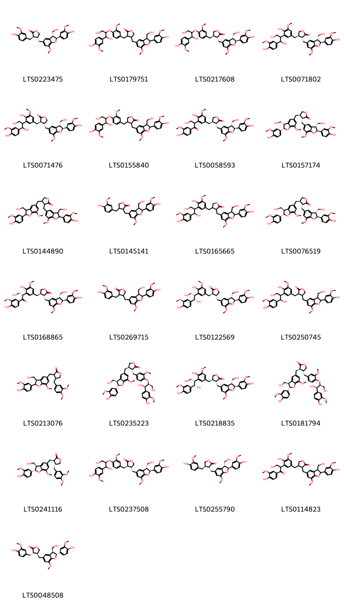{ group="compound" description="Cấu trúc hóa học của các hoạt chất thuộc nhóm *2-arylbenzofuran flavonoids* là lappaol a [(LTS0223475)](https://lotus.naturalproducts.net/compound/lotus_id/LTS0223475), 3-[(4-{[1,3-dihydroxy-1-(4-hydroxy-3-methoxyphenyl)propan-2-yl]oxy}-3-methoxyphenyl)methyl]-4-{[2-(4-hydroxy-3-methoxyphenyl)-3-(hydroxymethyl)-7-methoxy-2,3-dihydro-1-benzofuran-5-yl]methyl}oxolan-2-one [(LTS0179751)](https://lotus.naturalproducts.net/compound/lotus_id/LTS0179751), (3r,4r)-4-[(4-{[1,3-dihydroxy-1-(4-hydroxy-3-methoxyphenyl)propan-2-yl]oxy}-3-methoxyphenyl)methyl]-3-{[(2s,3r)-2-(4-hydroxy-3-methoxyphenyl)-3-(hydroxymethyl)-7-methoxy-2,3-dihydro-1-benzofuran-5-yl]methyl}oxolan-2-one [(LTS0217608)](https://lotus.naturalproducts.net/compound/lotus_id/LTS0217608), arctignan d [(LTS0071802)](https://lotus.naturalproducts.net/compound/lotus_id/LTS0071802), arctignan e [(LTS0071476)](https://lotus.naturalproducts.net/compound/lotus_id/LTS0071476), 4-[(4-{[1,3-dihydroxy-1-(4-hydroxy-3-methoxyphenyl)propan-2-yl]oxy}-3-methoxyphenyl)methyl]-3-{[2-(4-hydroxy-3-methoxyphenyl)-3-(hydroxymethyl)-7-methoxy-2,3-dihydro-1-benzofuran-5-yl]methyl}oxolan-2-one [(LTS0155840)](https://lotus.naturalproducts.net/compound/lotus_id/LTS0155840), (3r,4r)-4-({4-hydroxy-3-[3-hydroxy-1-(4-hydroxy-3-methoxyphenyl)-1-oxopropan-2-yl]-5-methoxyphenyl}methyl)-3-{[(2s,3r)-2-(4-hydroxy-3-methoxyphenyl)-3-(hydroxymethyl)-7-methoxy-2,3-dihydro-1-benzofuran-5-yl]methyl}oxolan-2-one [(LTS0058593)](https://lotus.naturalproducts.net/compound/lotus_id/LTS0058593), (3r,4r)-3-{[(2s,3r)-2-(4-hydroxy-3-methoxyphenyl)-3-(hydroxymethyl)-7-methoxy-2,3-dihydro-1-benzofuran-5-yl]methyl}-4-{[(2s,3s)-2-(4-hydroxy-3-methoxyphenyl)-3-(hydroxymethyl)-7-methoxy-2,3-dihydro-1-benzofuran-5-yl]methyl}oxolan-2-one [(LTS0157174)](https://lotus.naturalproducts.net/compound/lotus_id/LTS0157174), 3,4-bis({[2-(4-hydroxy-3-methoxyphenyl)-3-(hydroxymethyl)-7-methoxy-2,3-dihydro-1-benzofuran-5-yl]methyl})oxolan-2-one [(LTS0144890)](https://lotus.naturalproducts.net/compound/lotus_id/LTS0144890), 3-{[2-(4-hydroxy-3-methoxyphenyl)-3-(hydroxymethyl)-7-methoxy-2,3-dihydro-1-benzofuran-5-yl]methyl}-4-[(4-hydroxy-3-methoxyphenyl)methyl]oxolan-2-one [(LTS0145141)](https://lotus.naturalproducts.net/compound/lotus_id/LTS0145141), 4-({3-[1,3-dihydroxy-1-(4-hydroxy-3-methoxyphenyl)propan-2-yl]-4-hydroxy-5-methoxyphenyl}methyl)-3-{[2-(4-hydroxy-3-methoxyphenyl)-3-(hydroxymethyl)-7-methoxy-2,3-dihydro-1-benzofuran-5-yl]methyl}oxolan-2-one [(LTS0165665)](https://lotus.naturalproducts.net/compound/lotus_id/LTS0165665), lappaol f [(LTS0076519)](https://lotus.naturalproducts.net/compound/lotus_id/LTS0076519), (3r,4r)-4-({4-hydroxy-3-[(2s)-3-hydroxy-1-(4-hydroxy-3-methoxyphenyl)-1-oxopropan-2-yl]-5-methoxyphenyl}methyl)-3-{[(2s,3r)-2-(4-hydroxy-3-methoxyphenyl)-3-(hydroxymethyl)-7-methoxy-2,3-dihydro-1-benzofuran-5-yl]methyl}oxolan-2-one [(LTS0168865)](https://lotus.naturalproducts.net/compound/lotus_id/LTS0168865), 4-{[2-(4-hydroxy-3-methoxyphenyl)-3-(hydroxymethyl)-7-methoxy-2,3-dihydro-1-benzofuran-5-yl]methyl}-3-[(4-hydroxy-3-methoxyphenyl)methyl]oxolan-2-one [(LTS0269715)](https://lotus.naturalproducts.net/compound/lotus_id/LTS0269715), (3r,4r)-3-({3-[(1s,2s)-1,3-dihydroxy-1-(4-hydroxy-3-methoxyphenyl)propan-2-yl]-4-hydroxy-5-methoxyphenyl}methyl)-4-{[(2s,3r)-2-(4-hydroxy-3-methoxyphenyl)-3-(hydroxymethyl)-7-methoxy-2,3-dihydro-1-benzofuran-5-yl]methyl}oxolan-2-one [(LTS0122569)](https://lotus.naturalproducts.net/compound/lotus_id/LTS0122569), 3-({3-[1,3-dihydroxy-1-(4-hydroxy-3-methoxyphenyl)propan-2-yl]-4-hydroxy-5-methoxyphenyl}methyl)-4-{[2-(4-hydroxy-3-methoxyphenyl)-3-(hydroxymethyl)-7-methoxy-2,3-dihydro-1-benzofuran-5-yl]methyl}oxolan-2-one [(LTS0250745)](https://lotus.naturalproducts.net/compound/lotus_id/LTS0250745), 4-[(3,4-dimethoxyphenyl)methyl]-3-{[2-(4-hydroxy-3-methoxyphenyl)-3-(hydroxymethyl)-7-methoxy-2,3-dihydro-1-benzofuran-5-yl]methyl}oxolan-2-one [(LTS0213076)](https://lotus.naturalproducts.net/compound/lotus_id/LTS0213076), (3r,4r)-3-[(4-{[(1r,2s)-1,3-dihydroxy-1-(4-hydroxy-3-methoxyphenyl)propan-2-yl]oxy}-3-methoxyphenyl)methyl]-4-{[(2s,3r)-2-(4-hydroxy-3-methoxyphenyl)-3-(hydroxymethyl)-7-methoxy-2,3-dihydro-1-benzofuran-5-yl]methyl}oxolan-2-one [(LTS0235223)](https://lotus.naturalproducts.net/compound/lotus_id/LTS0235223), (3r,4r)-4-({3-[(1s,2s)-1,3-dihydroxy-1-(4-hydroxy-3-methoxyphenyl)propan-2-yl]-4-hydroxy-5-methoxyphenyl}methyl)-3-{[(2s,3r)-2-(4-hydroxy-3-methoxyphenyl)-3-(hydroxymethyl)-7-methoxy-2,3-dihydro-1-benzofuran-5-yl]methyl}oxolan-2-one [(LTS0218835)](https://lotus.naturalproducts.net/compound/lotus_id/LTS0218835), (3r,4r)-4-[(4-{[(1r,2s)-1,3-dihydroxy-1-(4-hydroxy-3-methoxyphenyl)propan-2-yl]oxy}-3-methoxyphenyl)methyl]-3-{[(2s,3r)-2-(4-hydroxy-3-methoxyphenyl)-3-(hydroxymethyl)-7-methoxy-2,3-dihydro-1-benzofuran-5-yl]methyl}oxolan-2-one [(LTS0181794)](https://lotus.naturalproducts.net/compound/lotus_id/LTS0181794), lappaol b [(LTS0241116)](https://lotus.naturalproducts.net/compound/lotus_id/LTS0241116), (3r,4r)-3-[(4-{[1,3-dihydroxy-1-(4-hydroxy-3-methoxyphenyl)propan-2-yl]oxy}-3-methoxyphenyl)methyl]-4-{[(2s,3r)-2-(4-hydroxy-3-methoxyphenyl)-3-(hydroxymethyl)-7-methoxy-2,3-dihydro-1-benzofuran-5-yl]methyl}oxolan-2-one [(LTS0237508)](https://lotus.naturalproducts.net/compound/lotus_id/LTS0237508), (3r,4r)-3-{[(2s,3r)-2-(4-hydroxy-3-methoxyphenyl)-3-(hydroxymethyl)-7-methoxy-2,3-dihydro-1-benzofuran-5-yl]methyl}-4-[(4-hydroxy-3-methoxyphenyl)methyl]oxolan-2-one [(LTS0255790)](https://lotus.naturalproducts.net/compound/lotus_id/LTS0255790), 4-({4-hydroxy-3-[3-hydroxy-1-(4-hydroxy-3-methoxyphenyl)-1-oxopropan-2-yl]-5-methoxyphenyl}methyl)-3-{[2-(4-hydroxy-3-methoxyphenyl)-3-(hydroxymethyl)-7-methoxy-2,3-dihydro-1-benzofuran-5-yl]methyl}oxolan-2-one [(LTS0114823)](https://lotus.naturalproducts.net/compound/lotus_id/LTS0114823), (3s,4s)-4-{[(2r,3s)-2-(4-hydroxy-3-methoxyphenyl)-3-(hydroxymethyl)-7-methoxy-2,3-dihydro-1-benzofuran-5-yl]methyl}-3-[(4-hydroxy-3-methoxyphenyl)methyl]oxolan-2-one [(LTS0048508)](https://lotus.naturalproducts.net/compound/lotus_id/LTS0048508)." }

                                                              
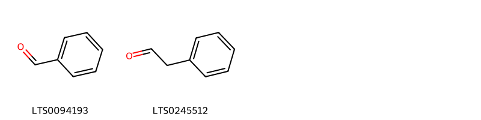{ group="compound" description="Cấu trúc hóa học của các hoạt chất thuộc nhóm *Benzene and substituted derivatives* là benzaldehyde [(LTS0094193)](https://lotus.naturalproducts.net/compound/lotus_id/LTS0094193), phenylacetaldehyde [(LTS0245512)](https://lotus.naturalproducts.net/compound/lotus_id/LTS0245512)." }

                                                              
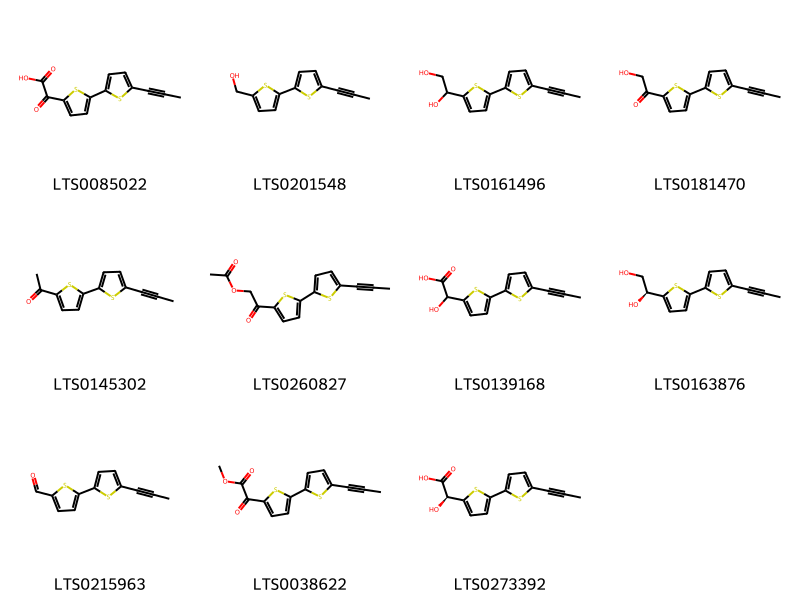{ group="compound" description="Cấu trúc hóa học của các hoạt chất thuộc nhóm *Bi- and oligothiophenes* là arctic acid b [(LTS0085022)](https://lotus.naturalproducts.net/compound/lotus_id/LTS0085022), arctinol a [(LTS0201548)](https://lotus.naturalproducts.net/compound/lotus_id/LTS0201548), arctinol b [(LTS0161496)](https://lotus.naturalproducts.net/compound/lotus_id/LTS0161496), arctinone a [(LTS0181470)](https://lotus.naturalproducts.net/compound/lotus_id/LTS0181470), arctinone b [(LTS0145302)](https://lotus.naturalproducts.net/compound/lotus_id/LTS0145302), 2-oxo-2-[5'-(prop-1-yn-1-yl)-[2,2'-bithiophen]-5-yl]ethyl acetate [(LTS0260827)](https://lotus.naturalproducts.net/compound/lotus_id/LTS0260827), arctic acid c [(LTS0139168)](https://lotus.naturalproducts.net/compound/lotus_id/LTS0139168), (1s)-1-[5'-(prop-1-yn-1-yl)-[2,2'-bithiophen]-5-yl]ethane-1,2-diol [(LTS0163876)](https://lotus.naturalproducts.net/compound/lotus_id/LTS0163876), arctinal [(LTS0215963)](https://lotus.naturalproducts.net/compound/lotus_id/LTS0215963), methyl arctate b [(LTS0038622)](https://lotus.naturalproducts.net/compound/lotus_id/LTS0038622), (s)-hydroxy[5'-(prop-1-yn-1-yl)-[2,2'-bithiophen]-5-yl]acetic acid [(LTS0273392)](https://lotus.naturalproducts.net/compound/lotus_id/LTS0273392)." }

                                                              
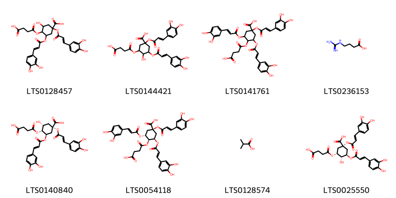{ group="compound" description="Cấu trúc hóa học của các hoạt chất thuộc nhóm *Carboxylic acids and derivatives* là 4-[(3-carboxypropanoyl)oxy]-1,3-bis({[3-(3,4-dihydroxyphenyl)prop-2-enoyl]oxy})-5-hydroxycyclohexane-1-carboxylic acid [(LTS0128457)](https://lotus.naturalproducts.net/compound/lotus_id/LTS0128457), 3-[(3-carboxypropanoyl)oxy]-1,5-bis({[3-(3,4-dihydroxyphenyl)prop-2-enoyl]oxy})-4-hydroxycyclohexane-1-carboxylic acid [(LTS0144421)](https://lotus.naturalproducts.net/compound/lotus_id/LTS0144421), 4-[(3-carboxypropanoyl)oxy]-1,3,5-tris({[3-(3,4-dihydroxyphenyl)prop-2-enoyl]oxy})cyclohexane-1-carboxylic acid [(LTS0141761)](https://lotus.naturalproducts.net/compound/lotus_id/LTS0141761), 4-guanidinobutyric acid [(LTS0236153)](https://lotus.naturalproducts.net/compound/lotus_id/LTS0236153), (1s,3r,4r,5r)-4-[(3-carboxypropanoyl)oxy]-1,3-bis({[(2e)-3-(3,4-dihydroxyphenyl)prop-2-enoyl]oxy})-5-hydroxycyclohexane-1-carboxylic acid [(LTS0140840)](https://lotus.naturalproducts.net/compound/lotus_id/LTS0140840), (1s,3r,4s,5r)-4-[(3-carboxypropanoyl)oxy]-1,3,5-tris({[(2e)-3-(3,4-dihydroxyphenyl)prop-2-enoyl]oxy})cyclohexane-1-carboxylic acid [(LTS0054118)](https://lotus.naturalproducts.net/compound/lotus_id/LTS0054118), isobutyric acid [(LTS0128574)](https://lotus.naturalproducts.net/compound/lotus_id/LTS0128574), (1s,3r,4r,5r)-3-[(3-carboxypropanoyl)oxy]-1,5-bis({[(2e)-3-(3,4-dihydroxyphenyl)prop-2-enoyl]oxy})-4-hydroxycyclohexane-1-carboxylic acid [(LTS0025550)](https://lotus.naturalproducts.net/compound/lotus_id/LTS0025550)." }

                                                              
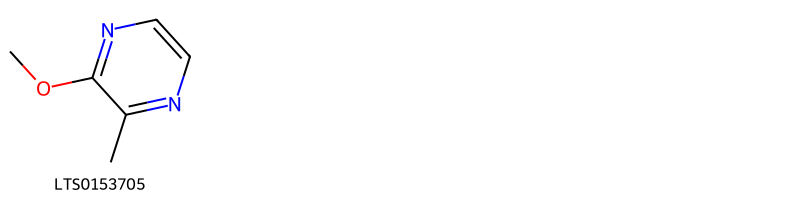{ group="compound" description="Cấu trúc hóa học của các hoạt chất thuộc nhóm *Diazines* là 2-methoxy-3-methylpyrazine [(LTS0153705)](https://lotus.naturalproducts.net/compound/lotus_id/LTS0153705)." }

                                                              
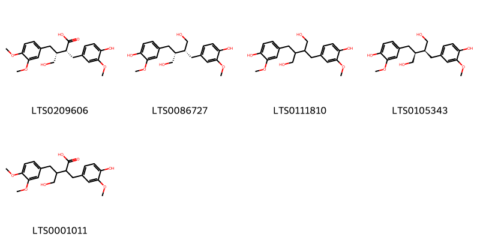{ group="compound" description="Cấu trúc hóa học của các hoạt chất thuộc nhóm *Dibenzylbutane lignans* là (2r,3r)-3-[(3,4-dimethoxyphenyl)methyl]-4-hydroxy-2-[(4-hydroxy-3-methoxyphenyl)methyl]butanoic acid [(LTS0209606)](https://lotus.naturalproducts.net/compound/lotus_id/LTS0209606), secoisolariciresinol [(LTS0086727)](https://lotus.naturalproducts.net/compound/lotus_id/LTS0086727), secoisolariciresinol [(LTS0111810)](https://lotus.naturalproducts.net/compound/lotus_id/LTS0111810), (+)-secoisolariciresinol [(LTS0105343)](https://lotus.naturalproducts.net/compound/lotus_id/LTS0105343), 3-[(3,4-dimethoxyphenyl)methyl]-4-hydroxy-2-[(4-hydroxy-3-methoxyphenyl)methyl]butanoic acid [(LTS0001011)](https://lotus.naturalproducts.net/compound/lotus_id/LTS0001011)." }

                                                              
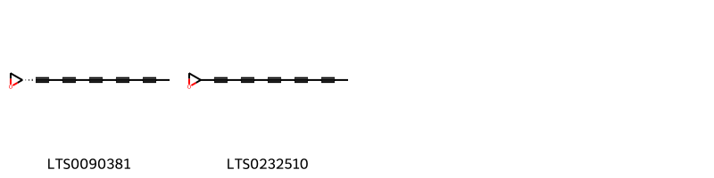{ group="compound" description="Cấu trúc hóa học của các hoạt chất thuộc nhóm *Epoxides* là (2s)-2-(undeca-1,3,5,7,9-pentayn-1-yl)oxirane [(LTS0090381)](https://lotus.naturalproducts.net/compound/lotus_id/LTS0090381), 2-(undeca-1,3,5,7,9-pentayn-1-yl)oxirane [(LTS0232510)](https://lotus.naturalproducts.net/compound/lotus_id/LTS0232510)." }

                                                              
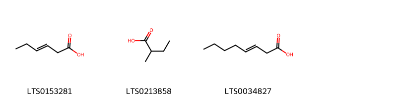{ group="compound" description="Cấu trúc hóa học của các hoạt chất thuộc nhóm *Fatty Acyls* là 3-hexenoic acid [(LTS0153281)](https://lotus.naturalproducts.net/compound/lotus_id/LTS0153281), 2-methylbutanoic acid [(LTS0213858)](https://lotus.naturalproducts.net/compound/lotus_id/LTS0213858), oct-3-enoic acid [(LTS0034827)](https://lotus.naturalproducts.net/compound/lotus_id/LTS0034827)." }

                                                              
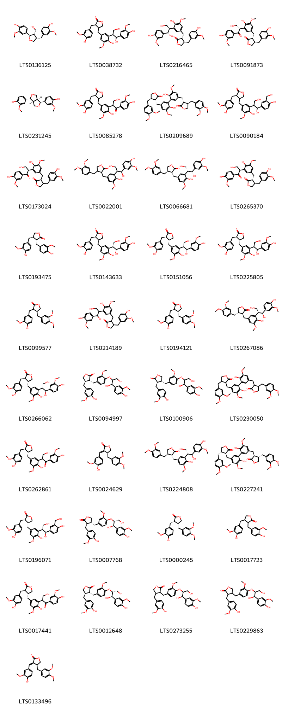{ group="compound" description="Cấu trúc hóa học của các hoạt chất thuộc nhóm *Furanoid lignans* là (-)-lariciresinol [(LTS0136125)](https://lotus.naturalproducts.net/compound/lotus_id/LTS0136125), 4-({3-[1,3-dihydroxy-1-(4-hydroxy-3-methoxyphenyl)propan-2-yl]-4-hydroxy-5-methoxyphenyl}methyl)-3-[(4-hydroxy-3-methoxyphenyl)methyl]oxolan-2-one [(LTS0038732)](https://lotus.naturalproducts.net/compound/lotus_id/LTS0038732), (3r,4r)-3-({3-[(1s,2r)-1,3-dihydroxy-1-(4-hydroxy-3-methoxyphenyl)propan-2-yl]-4-hydroxy-5-methoxyphenyl}methyl)-4-[(4-hydroxy-3-methoxyphenyl)methyl]oxolan-2-one [(LTS0216465)](https://lotus.naturalproducts.net/compound/lotus_id/LTS0216465), (3r,4r)-3-({4-hydroxy-3-[(2s)-3-hydroxy-1-(4-hydroxy-3-methoxyphenyl)-1-oxopropan-2-yl]-5-methoxyphenyl}methyl)-4-[(4-hydroxy-3-methoxyphenyl)methyl]oxolan-2-one [(LTS0091873)](https://lotus.naturalproducts.net/compound/lotus_id/LTS0091873), (-)-pinoresinol [(LTS0231245)](https://lotus.naturalproducts.net/compound/lotus_id/LTS0231245), 4-({4-hydroxy-3-[3-hydroxy-1-(4-hydroxy-3-methoxyphenyl)-1-oxopropan-2-yl]-5-methoxyphenyl}methyl)-3-[(4-hydroxy-3-methoxyphenyl)methyl]oxolan-2-one [(LTS0085278)](https://lotus.naturalproducts.net/compound/lotus_id/LTS0085278), diarctigenin [(LTS0209689)](https://lotus.naturalproducts.net/compound/lotus_id/LTS0209689), 4-[(3-{1,3-dihydroxy-1-[4-hydroxy-3-(hydroxymethyl)phenyl]propan-2-yl}-4-hydroxy-5-methoxyphenyl)methyl]-3-[(4-hydroxy-3-methoxyphenyl)methyl]oxolan-2-one [(LTS0090184)](https://lotus.naturalproducts.net/compound/lotus_id/LTS0090184), 3-({4-hydroxy-3-[3-hydroxy-1-(4-hydroxy-3-methoxyphenyl)-1-oxopropan-2-yl]-5-methoxyphenyl}methyl)-4-[(4-hydroxy-3-methoxyphenyl)methyl]oxolan-2-one [(LTS0173024)](https://lotus.naturalproducts.net/compound/lotus_id/LTS0173024), lappaol d [(LTS0022001)](https://lotus.naturalproducts.net/compound/lotus_id/LTS0022001), (3r,4r)-3-({3-[(1r,2r)-1,3-dihydroxy-1-(4-hydroxy-3-methoxyphenyl)propan-2-yl]-4-hydroxy-5-methoxyphenyl}methyl)-4-[(3,4-dimethoxyphenyl)methyl]oxolan-2-one [(LTS0066681)](https://lotus.naturalproducts.net/compound/lotus_id/LTS0066681), arctignan c [(LTS0265370)](https://lotus.naturalproducts.net/compound/lotus_id/LTS0265370), matairesinol [(LTS0193475)](https://lotus.naturalproducts.net/compound/lotus_id/LTS0193475), (3r,4s)-4-({3-[(1s,2r)-1,3-dihydroxy-1-(4-hydroxy-3-methoxyphenyl)propan-2-yl]-4-hydroxy-5-methoxyphenyl}methyl)-3-[(4-hydroxy-3-methoxyphenyl)methyl]oxolan-2-one [(LTS0143633)](https://lotus.naturalproducts.net/compound/lotus_id/LTS0143633), (3r,4r)-4-({3-[(1r,2r)-1,3-dihydroxy-1-(4-hydroxy-3-methoxyphenyl)propan-2-yl]-4-hydroxy-5-methoxyphenyl}methyl)-3-[(4-hydroxy-3-methoxyphenyl)methyl]oxolan-2-one [(LTS0151056)](https://lotus.naturalproducts.net/compound/lotus_id/LTS0151056), lappaol c [(LTS0225805)](https://lotus.naturalproducts.net/compound/lotus_id/LTS0225805), arctigenin [(LTS0099577)](https://lotus.naturalproducts.net/compound/lotus_id/LTS0099577), 3-({3-[1,3-dihydroxy-1-(4-hydroxy-3-methoxyphenyl)propan-2-yl]-4-hydroxy-5-methoxyphenyl}methyl)-4-[(4-hydroxy-3-methoxyphenyl)methyl]oxolan-2-one [(LTS0214189)](https://lotus.naturalproducts.net/compound/lotus_id/LTS0214189), (-)-arctigenin [(LTS0194121)](https://lotus.naturalproducts.net/compound/lotus_id/LTS0194121), (3s,4s)-3-({3-[(1s,2r)-1,3-dihydroxy-1-(4-hydroxy-3-methoxyphenyl)propan-2-yl]-4-hydroxy-5-methoxyphenyl}methyl)-4-[(3,4-dimethoxyphenyl)methyl]oxolan-2-one [(LTS0267086)](https://lotus.naturalproducts.net/compound/lotus_id/LTS0267086), (3r,4r)-4-({3-[(1s,2r)-1,3-dihydroxy-1-(4-hydroxy-3-methoxyphenyl)propan-2-yl]-4-hydroxy-5-methoxyphenyl}methyl)-3-[(4-hydroxy-3-methoxyphenyl)methyl]oxolan-2-one [(LTS0266062)](https://lotus.naturalproducts.net/compound/lotus_id/LTS0266062), arctignan a [(LTS0094997)](https://lotus.naturalproducts.net/compound/lotus_id/LTS0094997), lappaol e [(LTS0100906)](https://lotus.naturalproducts.net/compound/lotus_id/LTS0100906), 4-[(3,4-dimethoxyphenyl)methyl]-3-{[5'-({4-[(3,4-dimethoxyphenyl)methyl]-2-oxooxolan-3-yl}methyl)-2',6-dihydroxy-3',5-dimethoxy-[1,1'-biphenyl]-3-yl]methyl}oxolan-2-one [(LTS0230050)](https://lotus.naturalproducts.net/compound/lotus_id/LTS0230050), arctignan b [(LTS0262861)](https://lotus.naturalproducts.net/compound/lotus_id/LTS0262861), (3e,4s)-4-[(3,4-dimethoxyphenyl)methyl]-3-[(4-hydroxy-3-methoxyphenyl)methylidene]oxolan-2-one [(LTS0024629)](https://lotus.naturalproducts.net/compound/lotus_id/LTS0024629), (3r,4r)-3-({3-[(1s,2r)-1,3-dihydroxy-1-(4-hydroxy-3-methoxyphenyl)propan-2-yl]-4-hydroxy-5-methoxyphenyl}methyl)-4-[(3,4-dimethoxyphenyl)methyl]oxolan-2-one [(LTS0224808)](https://lotus.naturalproducts.net/compound/lotus_id/LTS0224808), (3s,4s)-4-[(3,4-dimethoxyphenyl)methyl]-3-[(5'-{[(3s,4s)-4-[(3,4-dimethoxyphenyl)methyl]-2-oxooxolan-3-yl]methyl}-2',6-dihydroxy-3',5-dimethoxy-[1,1'-biphenyl]-3-yl)methyl]oxolan-2-one [(LTS0227241)](https://lotus.naturalproducts.net/compound/lotus_id/LTS0227241), (3r,4r)-4-({3-[(1s,2r)-1,3-dihydroxy-1-[4-hydroxy-3-(hydroxymethyl)phenyl]propan-2-yl]-4-hydroxy-5-methoxyphenyl}methyl)-3-[(4-hydroxy-3-methoxyphenyl)methyl]oxolan-2-one [(LTS0196071)](https://lotus.naturalproducts.net/compound/lotus_id/LTS0196071), (3r,4r)-4-[(4-{[(1r,2r)-1,3-dihydroxy-1-(4-hydroxy-3-methoxyphenyl)propan-2-yl]oxy}-3-methoxyphenyl)methyl]-3-[(4-hydroxy-3-methoxyphenyl)methyl]oxolan-2-one [(LTS0007768)](https://lotus.naturalproducts.net/compound/lotus_id/LTS0007768), (3s,4r)-4-[(3,4-dimethoxyphenyl)methyl]-3-[(4-hydroxy-3-methoxyphenyl)methyl]oxolan-2-one [(LTS0000245)](https://lotus.naturalproducts.net/compound/lotus_id/LTS0000245), 3,4-bis[(4-hydroxy-3-methoxyphenyl)methyl]oxolan-2-one [(LTS0017723)](https://lotus.naturalproducts.net/compound/lotus_id/LTS0017723), (3r,4r)-4-({4-hydroxy-3-[(2s)-3-hydroxy-1-(4-hydroxy-3-methoxyphenyl)-1-oxopropan-2-yl]-5-methoxyphenyl}methyl)-3-[(4-hydroxy-3-methoxyphenyl)methyl]oxolan-2-one [(LTS0017441)](https://lotus.naturalproducts.net/compound/lotus_id/LTS0017441), (3r,4r)-3-[(4-{[(1r,2r)-1,3-dihydroxy-1-(4-hydroxy-3-methoxyphenyl)propan-2-yl]oxy}-3-methoxyphenyl)methyl]-4-[(4-hydroxy-3-methoxyphenyl)methyl]oxolan-2-one [(LTS0012648)](https://lotus.naturalproducts.net/compound/lotus_id/LTS0012648), 3-[(4-{[1,3-dihydroxy-1-(4-hydroxy-3-methoxyphenyl)propan-2-yl]oxy}-3-methoxyphenyl)methyl]-4-[(4-hydroxy-3-methoxyphenyl)methyl]oxolan-2-one [(LTS0273255)](https://lotus.naturalproducts.net/compound/lotus_id/LTS0273255), 4-[(4-{[1,3-dihydroxy-1-(4-hydroxy-3-methoxyphenyl)propan-2-yl]oxy}-3-methoxyphenyl)methyl]-3-[(4-hydroxy-3-methoxyphenyl)methyl]oxolan-2-one [(LTS0229863)](https://lotus.naturalproducts.net/compound/lotus_id/LTS0229863), (3e)-4-[(3,4-dimethoxyphenyl)methyl]-3-[(4-hydroxy-3-methoxyphenyl)methylidene]oxolan-2-one [(LTS0133496)](https://lotus.naturalproducts.net/compound/lotus_id/LTS0133496)." }

                                                              
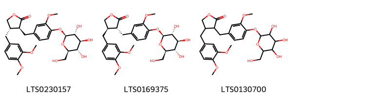{ group="compound" description="Cấu trúc hóa học của các hoạt chất thuộc nhóm *Lignan glycosides* là (3s,4s)-4-[(3,4-dimethoxyphenyl)methyl]-3-[(3-methoxy-4-{[(2s,3r,4s,5s,6r)-3,4,5-trihydroxy-6-(hydroxymethyl)oxan-2-yl]oxy}phenyl)methyl]oxolan-2-one [(LTS0230157)](https://lotus.naturalproducts.net/compound/lotus_id/LTS0230157), arctiin [(LTS0169375)](https://lotus.naturalproducts.net/compound/lotus_id/LTS0169375), 4-[(3,4-dimethoxyphenyl)methyl]-3-[(3-methoxy-4-{[3,4,5-trihydroxy-6-(hydroxymethyl)oxan-2-yl]oxy}phenyl)methyl]oxolan-2-one [(LTS0130700)](https://lotus.naturalproducts.net/compound/lotus_id/LTS0130700)." }

                                                              
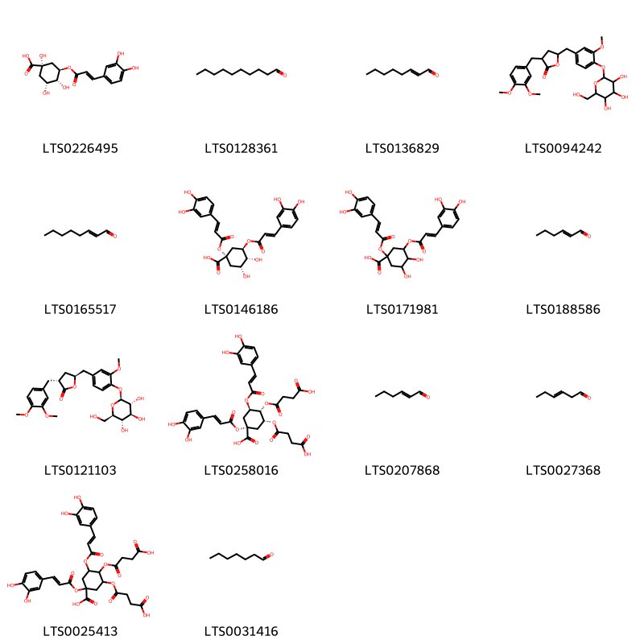{ group="compound" description="Cấu trúc hóa học của các hoạt chất thuộc nhóm *Organooxygen compounds* là chlorogenic acid [(LTS0226495)](https://lotus.naturalproducts.net/compound/lotus_id/LTS0226495), decanal [(LTS0128361)](https://lotus.naturalproducts.net/compound/lotus_id/LTS0128361), (e)-2-octenal [(LTS0136829)](https://lotus.naturalproducts.net/compound/lotus_id/LTS0136829), 3-[(3,4-dimethoxyphenyl)methyl]-5-[(3-methoxy-4-{[3,4,5-trihydroxy-6-(hydroxymethyl)oxan-2-yl]oxy}phenyl)methyl]oxolan-2-one [(LTS0094242)](https://lotus.naturalproducts.net/compound/lotus_id/LTS0094242), 2-octenal [(LTS0165517)](https://lotus.naturalproducts.net/compound/lotus_id/LTS0165517), (1s,3r,4r,5r)-1,3-bis({[(2e)-3-(3,4-dihydroxyphenyl)prop-2-enoyl]oxy})-4,5-dihydroxycyclohexane-1-carboxylic acid [(LTS0146186)](https://lotus.naturalproducts.net/compound/lotus_id/LTS0146186), 1,3-bis({[3-(3,4-dihydroxyphenyl)prop-2-enoyl]oxy})-4,5-dihydroxycyclohexane-1-carboxylic acid [(LTS0171981)](https://lotus.naturalproducts.net/compound/lotus_id/LTS0171981), hexenal [(LTS0188586)](https://lotus.naturalproducts.net/compound/lotus_id/LTS0188586), (3r,5s)-3-[(3,4-dimethoxyphenyl)methyl]-5-[(3-methoxy-4-{[(2s,3r,4s,5s,6r)-3,4,5-trihydroxy-6-(hydroxymethyl)oxan-2-yl]oxy}phenyl)methyl]oxolan-2-one [(LTS0121103)](https://lotus.naturalproducts.net/compound/lotus_id/LTS0121103), (1s,3r,4r,5r)-3,4-bis[(3-carboxypropanoyl)oxy]-1,5-bis({[(2e)-3-(3,4-dihydroxyphenyl)prop-2-enoyl]oxy})cyclohexane-1-carboxylic acid [(LTS0258016)](https://lotus.naturalproducts.net/compound/lotus_id/LTS0258016), (e)-2-hexenal [(LTS0207868)](https://lotus.naturalproducts.net/compound/lotus_id/LTS0207868), 3-hexenal [(LTS0027368)](https://lotus.naturalproducts.net/compound/lotus_id/LTS0027368), 3,4-bis[(3-carboxypropanoyl)oxy]-1,5-bis({[3-(3,4-dihydroxyphenyl)prop-2-enoyl]oxy})cyclohexane-1-carboxylic acid [(LTS0025413)](https://lotus.naturalproducts.net/compound/lotus_id/LTS0025413), heptanal [(LTS0031416)](https://lotus.naturalproducts.net/compound/lotus_id/LTS0031416)." }

                                                              
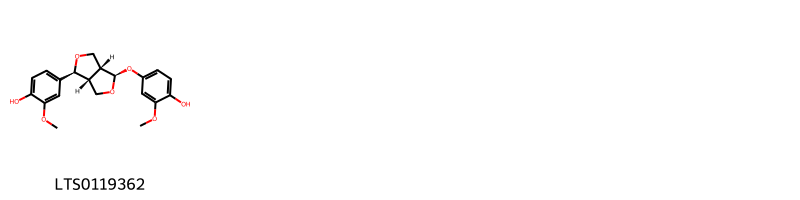{ group="compound" description="Cấu trúc hóa học của các hoạt chất thuộc nhóm *Phenols* là 4-[(1s,3ar,4r,6ar)-4-(4-hydroxy-3-methoxyphenoxy)-hexahydrofuro[3,4-c]furan-1-yl]-2-methoxyphenol [(LTS0119362)](https://lotus.naturalproducts.net/compound/lotus_id/LTS0119362)." }

                                                              
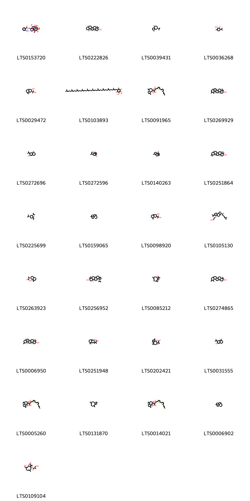{ group="compound" description="Cấu trúc hóa học của các hoạt chất thuộc nhóm *Prenol lipids* là [(1s,4s,5r,6s,8r,9r,13s,16s,18s)-11-ethyl-8,9-dihydroxy-4,6,16,18-tetramethoxy-11-azahexacyclo[7.7.2.1²,⁵.0¹,¹⁰.0³,⁸.0¹³,¹⁷]nonadecan-13-yl]methyl 2-aminobenzoate [(LTS0153720)](https://lotus.naturalproducts.net/compound/lotus_id/LTS0153720), amyrin [(LTS0222826)](https://lotus.naturalproducts.net/compound/lotus_id/LTS0222826), guaiene [(LTS0039431)](https://lotus.naturalproducts.net/compound/lotus_id/LTS0039431), diosphenol [(LTS0036268)](https://lotus.naturalproducts.net/compound/lotus_id/LTS0036268), arctiol [(LTS0029472)](https://lotus.naturalproducts.net/compound/lotus_id/LTS0029472), coenzyme q10 [(LTS0103893)](https://lotus.naturalproducts.net/compound/lotus_id/LTS0103893), 3-hydroxy-6,9-dimethylidene-3-{2-oxo-2-[5'-(prop-1-yn-1-yl)-[2,2'-bithiophen]-5-yl]ethyl}-octahydroazuleno[4,5-b]furan-2-one [(LTS0091965)](https://lotus.naturalproducts.net/compound/lotus_id/LTS0091965), (4ar,6ar,6br,8as,12ar,12br,14ar,14br)-4,4,6a,6b,8a,11,12,14b-octamethyl-2,3,4a,5,6,7,8,9,12,12a,12b,13,14,14a-tetradecahydro-1h-picen-3-ol [(LTS0269929)](https://lotus.naturalproducts.net/compound/lotus_id/LTS0269929), dehydrofukinone [(LTS0272696)](https://lotus.naturalproducts.net/compound/lotus_id/LTS0272696), cyperene [(LTS0272596)](https://lotus.naturalproducts.net/compound/lotus_id/LTS0272596), cyperene [(LTS0140263)](https://lotus.naturalproducts.net/compound/lotus_id/LTS0140263), β-amyrin [(LTS0251864)](https://lotus.naturalproducts.net/compound/lotus_id/LTS0251864), β-elemene [(LTS0225699)](https://lotus.naturalproducts.net/compound/lotus_id/LTS0225699), (1s,5s,8s)-4,4,8-trimethyltricyclo[6.3.1.0¹,⁵]dodec-2-ene [(LTS0159065)](https://lotus.naturalproducts.net/compound/lotus_id/LTS0159065), 3-(2-hydroxypropan-2-yl)-8a-methyl-5-methylidene-octahydronaphthalen-2-ol [(LTS0098920)](https://lotus.naturalproducts.net/compound/lotus_id/LTS0098920), 3-[(3s,3as,5as,6s,9as,9br)-3a,5a,9b-trimethyl-3-[(2s)-6-methylhept-5-en-2-yl]-7-(propan-2-ylidene)-octahydro-1h-cyclopenta[a]naphthalen-6-yl]propan-1-ol [(LTS0105130)](https://lotus.naturalproducts.net/compound/lotus_id/LTS0105130), costic acid [(LTS0263923)](https://lotus.naturalproducts.net/compound/lotus_id/LTS0263923), lupeol [(LTS0256952)](https://lotus.naturalproducts.net/compound/lotus_id/LTS0256952), caryophyllene [(LTS0085212)](https://lotus.naturalproducts.net/compound/lotus_id/LTS0085212), (6ar,6br,8ar,14br)-4,4,6a,6b,8a,12,14b-heptamethyl-11-methylidene-hexadecahydropicen-3-ol [(LTS0274865)](https://lotus.naturalproducts.net/compound/lotus_id/LTS0274865), taraxasterol [(LTS0006950)](https://lotus.naturalproducts.net/compound/lotus_id/LTS0006950), 2-[(8ar)-2,4a-dimethyl-8-methylidene-hexahydro-1h-naphthalen-2-yl]prop-2-enoic acid [(LTS0251948)](https://lotus.naturalproducts.net/compound/lotus_id/LTS0251948), dehydrocostus lactone [(LTS0202421)](https://lotus.naturalproducts.net/compound/lotus_id/LTS0202421), 4a,5-dimethyl-3-(propan-2-ylidene)-5,6,7,8-tetrahydro-4h-naphthalen-2-one [(LTS0031555)](https://lotus.naturalproducts.net/compound/lotus_id/LTS0031555), (3r,3ar,6ar,9ar,9br)-3-hydroxy-6,9-dimethylidene-3-{2-oxo-2-[5'-(prop-1-yn-1-yl)-[2,2'-bithiophen]-5-yl]ethyl}-octahydroazuleno[4,5-b]furan-2-one [(LTS0005260)](https://lotus.naturalproducts.net/compound/lotus_id/LTS0005260), caryophyllene [(LTS0131870)](https://lotus.naturalproducts.net/compound/lotus_id/LTS0131870), (3s,3ar,6as,9ar,9br)-3-hydroxy-6,9-dimethylidene-3-{2-oxo-2-[5'-(prop-1-yn-1-yl)-[2,2'-bithiophen]-5-yl]ethyl}-octahydroazuleno[4,5-b]furan-2-one [(LTS0014021)](https://lotus.naturalproducts.net/compound/lotus_id/LTS0014021), (+)-clovene [(LTS0006902)](https://lotus.naturalproducts.net/compound/lotus_id/LTS0006902), (3ar,4s)-10-(hydroxymethyl)-6-methyl-3-methylidene-2-oxo-3ah,4h,5h,8h,9h,11ah-cyclodeca[b]furan-4-yl 3-hydroxy-2-methylpropanoate [(LTS0109104)](https://lotus.naturalproducts.net/compound/lotus_id/LTS0109104)." }

                                                              
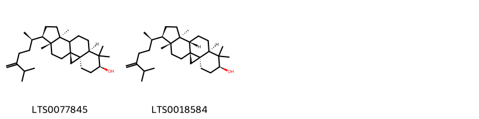{ group="compound" description="Cấu trúc hóa học của các hoạt chất thuộc nhóm *Steroids and steroid derivatives* là 24-methylene-cycloartanol [(LTS0077845)](https://lotus.naturalproducts.net/compound/lotus_id/LTS0077845), 24-methylenecycloartanol [(LTS0018584)](https://lotus.naturalproducts.net/compound/lotus_id/LTS0018584)." }

                                                              
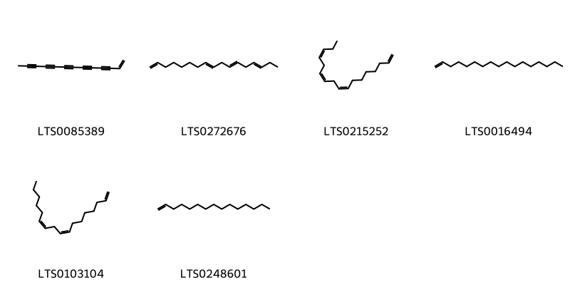{ group="compound" description="Cấu trúc hóa học của các hoạt chất thuộc nhóm *Unsaturated hydrocarbons* là tridec-1-en-3,5,7,9,11-pentayne [(LTS0085389)](https://lotus.naturalproducts.net/compound/lotus_id/LTS0085389), (8e,11e,14e)-heptadeca-1,8,11,14-tetraene [(LTS0272676)](https://lotus.naturalproducts.net/compound/lotus_id/LTS0272676), aplotaxene [(LTS0215252)](https://lotus.naturalproducts.net/compound/lotus_id/LTS0215252), heptadecene [(LTS0016494)](https://lotus.naturalproducts.net/compound/lotus_id/LTS0016494), (8z,11z)-heptadeca-1,8,11-triene [(LTS0103104)](https://lotus.naturalproducts.net/compound/lotus_id/LTS0103104), 1-pentadecene [(LTS0248601)](https://lotus.naturalproducts.net/compound/lotus_id/LTS0248601)." }

:::

---

## IV. Tác dụng dược lý

Theo tài liệu quốc tế: To dispel wind-heat and relieve cough, to promote eruption, to counteract toxicity, and to soothe sore throat.

---

## V. Dược điển Việt Nam V

### Soi bột

Màu nâu hơi xanh lục; tế bào đá của vỏ quả trông hơi dẹt,  hình thoi thon nhỏ dài, hình bầu dục dài hoặc hình trứng  thon dần khi nhìn trên bề mặt. Nhìn từ phía bên, tế bào đá  có hình gần chữ nhật hoặc thon dài, hơi cong, dài 70 µm  đến 224 µm, rộng 13 µm đến 70 µm; thành tế bào dày tới  20 µm, hóa gỗ, có các lỗ trao đổi. Nhìn trên mặt cắt ngang,  tế bào vân lưới của vỏ quả giữa có hình đa giác, thành tế  bào nhiều lớp chong chất uốn lượn có chỗ dày lên. Nhìn  trên mặt cắt dọc, thấy tế bào thon dài, thành tế bào có vân  nhỏ, dày đặc, đan chéo. Tinh thể calci oxalat hình lăng trụ  có đường kính 3 µm đến 9 µm, có nhiều trong tế bào mô  mềm màu vàng của vỏ quả giữa, đường viền của các tế bào  đá nhìn không rõ. Các tế bào lá mầm chứa đầy hạt aleuron,  một số tế bào chứa nhừng cụm tinh thể calci oxalat và  những giọt dầu nhỏ.

::: {#listing-soibot}
:::

### Vi phẫu

nan

::: {#listing-viphau}
:::

### Định tính

A. Quan sát bột dược liệu dưới ánh sáng tử ngoại (366 nm) thấy có huỳnh quang màu lục. B. Phương pháp sắc ký lớp mỏng (Phụ lục 5.4). Bản mỏng: Silica gel G. Dung môi khai triển: Cloroform – methanol– nước (40 : 8 : 1). Dung dịch thử. Lấy 0,5 g bột dược liệu, thêm 20 ml  ethanol  96 % (TT), chíêt siêu âm 30 min, lọc. Bốc hơi dịch lọc tới  cắn, hòa cắn trong 2 ml methanol (TT) được dung dịch thử. Dung dịch đối chiếu: Lấy 0,5 g bột Ngưu bằng (mẫu  chuẩn), chiết như mô tả ở phần Dung dịch thử. Cách tiến hành: Chấm riêng biệt lên bản mỏng 5  µl mỗi  dung dịch trên. Triển khai sắc ký đến khi dung môi đi được  khoảng 12 cm, lấy bản mỏng ra để khô ở nhiệt độ phòng.  Phun dung dịch acid sulfuric 10 % trong ethanol (TT). Sấy  bản mỏng đến khi hiện rõ vết. Quan sát dưới ánh sáng  thường. Trên sắc ký đồ của dung dịch thử phải có các vết  cùng màu sắc và giá trị Rf với các vét trên sắc ký đồ của  dung dịch đối chiếu.

### Định lượng

Chất chiết được trong dược liệu Không ít hơn 14,0 % tính theo dược liệu khô kiệt. Dùng 2,5 g dược liệu. Tiến hành theo phương pháp ngâm  lạnh (Phụ lục 12.10), dùng ethanol 50 % (TT) làm dung môi.

### Thông tin khác 

- **Độ ẩm:** Không quá 12,0 % (Phụ lục 9.6,  1  g,  105 °C, 5 h).
- **Bảo quản:** Để nơi khô, mát.

## VI. Dược điển Hồng kong

::: {#listing-DDHK}
:::

---

## VII. Y dược học cổ truyền

::: {.callout-note title = "nan" }

**Tên vị thuốc:** nan

**Tính:** nan

**Vị:** nan

**Quy kinh:**  nan

**Công năng chủ trị:** Tân, khổ, hàn. Vào các kinh phế, vị.

**Phân loại theo thông tư:** nan

**Tác dụng theo y dược cổ truyền:** nan

**Chú ý:** nan

**Kiêng kỵ:** nan 

:::

::: {#listing-ViThuoc}
:::

