::: {.callout-note title = "Tóm tắt"}

Cây chiêu liêu có tên khoa học là Terminalia chebula Retz. thuộc họ Bàng (Combretaceae). Cây phân bố ở nhiều nước trên thế giới như: Hàn Quốc, Ấn Độ, Thái Lan, Tây Úc và Việt Nam. Tại Việt Nam, cây phân bố chủ yếu ở miền Nam. Trong y học cổ truyền cây thường dùng để chữa đi ỉa lỏng lâu ngày, chữa lỵ kinh niên, còn dùng chữa ho mất tiếng, di tinh, mồ hôi trộm, trĩ, lòi dom, xích bạch. Trong kha tử có tới 20-40% tanin bao gồm axit elagic, axit galic và axit luteolic. Lượng tanin có khi lên đến 51.3% nếu quả thật khô. Ngoài ra còn có axit chebulinic tỉ lệ 3-4%. Nhờ hoạt chất Polysaccharid, quả cây Chiêu liêu có thể điều trị viêm họng, khản tiếng, giảm ho rõ rệt trong 30 phút. Chất Alloyl trong quả có thể kháng virus, ức chế sự phát triển của một số loại virus làm suy giảm hệ thống miễn dịch của con người (theo Viện thống kê Ấn Độ). Là chất kháng sinh tự nhiên, có khả năng diệt khuẩn mạnh mẽ nhờ hàm lượng tanin dồi dào.
Ức chế sự phát triển của trực khuẩn bạch hầu, tụ cầu vàng, trực khuẩn mủ xanh, liên cầu khuẩn tán huyết, Pseudomonas Aeruginosa, Salmonella Typhi. Ức chế và tiêu diệt các loại virus gây viêm họng như virus cúm A, cúm B, Herpes Simplex (HPV), vi khuẩn như tụ cầu, liên cầu

:::

## I. Thông tin về dược liệu 

::: {.panel-tabset}

### Định danh

- Dược liệu tiếng Việt: Kha Tử - Quả
- Dược liệu tiếng Trung: 诃子 (He Zi)
- Dược liệu tiếng Anh: Terminalia Chebula
- Dược liệu latin thông dụng: Fructus Terminaliae Chebulae
- Dược liệu latin kiểu DĐVN: *Radix Codonopsis*
- Dược liệu latin kiểu DĐVN: *Chebulae Fructus*
- Dược liệu latin kiểu thông tư: *Fructus Terminaliae chebulae*
- Bộ phận dùng: Quả (Fructus)

### Mô tả dược liệu 

**Theo dược điển Việt nam V:** Dược liệu hình quả trám hoặc hình trứng thuôn, dài  2 cm đển 4 cm, đường kính 2 cm đến 2,5 cm. Mặt ngoài màu nâu hơi vàng hoặc màu nâu thẫm, hơi sáng bóng; có 5 đến 6 cạnh dọc và vân nhăn không đều; phần đáy có vết sẹo cuống quả, hình tròn, Chất chắc, thịt quả dày 0,2 cm đến 0,4 cm, màu nâu hơi vàng, hoặc vàng nâu thẫm; hạch quả dài 1,5 cm đến 2,5 cm, đường kính 1 cm đến 1,5 cm, màu vàng nhạt, thô và cứng. Hạt hình thoi hẹp, dài khoảng 1 cm, đường kính 0,2 cm đến 0,4 cm, vỏ cứng màu vàng nâu. đôi lá mầm màu trắng, chồng lên nhau và cuộn xoắn lại. Không mùi, vị chua, chát, sau ngọt. 
 
**Mô tả dược liệu theo thông tư chế biến dược liệu theo phương pháp cổ truyền:** nan

### Chế biến 

**Chế biến theo dược điển việt nam V**: Chế biến Thu hái lấy quả chín vào mùa thu, đông, loại bỏ tạp chất, phơi khô. Bào chế Kha tử đã loại bỏ tạp chất, rửa sạch, phơi khô, khi dùng đập nát.  Thịt quả Kha tử: Lấy Kha tử sạch, ngâm qua nước, ủ mềm, bỏ hạch, phơi thịt quả đến khô. 

**Chế biến theo thông tư:** nan

::: 

## II. Thông tin về thực vật

Dược liệu **Kha Tử - Quả** từ bộ phận **Quả** từ loài *Terminalia chebula*.

**Mô tả thực vật:** Chiều liêu là một loại cây to cao chừng 15–20m, có vỏ màu đen nhạt, trên có những vạch nứt dọc. Lá mọc đối cuống rất ngắn, hình trứng, phía cuống tròn hơi thon, đầu nhọn, dài 15-20cm, rộng 7-15cm, dai, hơi có lông mềm trên cả hai mặt, sau thì nhẵn, ở đầu cuống có hai tuyến nhỏ hình mắt cua. Hoa mọc thành bông, nhỏ, màu trắng, lưỡng tính, mùi thơm, mọc ở đầu cành hay ở kẽ lá, cuống ngắn, trên có phủ lông màu vàng nhạt. Quả hình trứng thon, dài 3–4cm, rộng 22–25mm, hai đầu tù, không có dìa, có 5 cạnh dọc, màu nâu vàng nhạt, thịt đen nhạt, khô cứng và chắc. Hạch cứng, hơi hình 5 cạnh, dày chừng 10-15mm, 1 hạt, lá mầm cuốn

*Tài liệu tham khảo:* "Những cây thuốc và vị thuốc Việt Nam" - Đỗ Tất Lợi 
Trong dược điển Việt nam, loài *Terminalia chebula* được sử dụng làm dược liệu.

            
::: {.callout-note title = "Phân loại thực vật của *Terminalia chebula*"}

**Kingdom:** Plantae 

**Phylum:** Tracheophyta 

**Order:** Myrtales 
 
**Family:** Combretaceae 
 
**Genus:** Terminalia 
 
**Species:** *Terminalia chebula* 
 

:::

::: {style="display: grid;grid-template-columns: repeat(auto-fill, minmax(150px, 1fr));grid-gap: 1em;"}
{ group="GIBF" }

{ group="GIBF" }

{ group="GIBF" }

{ group="GIBF" }

{ group="GIBF" }

{ group="GIBF" }

{ group="GIBF" }

{ group="GIBF" }

{ group="GIBF" }

{ group="GIBF" }

{ group="GIBF" }

{ group="GIBF" }

{ group="GIBF" }

{ group="GIBF" }

{ group="GIBF" }

{ group="GIBF" }
:::

**Phân bố trên thế giới:** Thailand, Myanmar, nan, United States of America, Philippines, China, Pakistan, Cambodia, Bangladesh, India, Bhutan, Nepal, Lao People’s Democratic Republic, Belgium

**Phân bố tại Việt nam:** Không có ghi nhận ở Việt Nam

<iframe src="Fructus Terminaliae Chebulae/map_distribution.html" width="100%" height="600" style="border:none;"></iframe>

## III. Thành phần hóa học

Theo tài liệu của GS. Đỗ Tất Lợi:  Trong kha tử có tới 20-40% tanin bao gồm axit elagic, axit galic và axit luteolic. Lượng tanin có khi lên đến 51.3% nếu quả thật khô. Ngoài ra còn có axit chebulinic tỉ lệ 3-4%
    

Theo cơ sở dữ liệu lotus, loài *Terminalia chebula* đã phân lập và xác định được **144** hoạt chất thuộc về các nhóm Cinnamic acids and derivatives, Saccharolipids, Flavonoids, Tannins, Dihydrofurans, Steroids and steroid derivatives, Carboxylic acids and derivatives, Indenes and isoindenes, Organooxygen compounds, Benzene and substituted derivatives, Alkyl halides, Saturated hydrocarbons, Fatty Acyls, Phenols, Prenol lipids, Unsaturated hydrocarbons trong bảng dưới đây.
        
| chemicalTaxonomyClassyfireClass     |   smiles_count |
|:------------------------------------|---------------:|
| Alkyl halides                       |            407 |
| Benzene and substituted derivatives |            170 |
| Carboxylic acids and derivatives    |            289 |
| Cinnamic acids and derivatives      |             19 |
| Dihydrofurans                       |             31 |
| Fatty Acyls                         |            305 |
| Flavonoids                          |            248 |
| Indenes and isoindenes              |             14 |
| Organooxygen compounds              |            142 |
| Phenols                             |              9 |
| Prenol lipids                       |           1939 |
| Saccharolipids                      |            522 |
| Saturated hydrocarbons              |            269 |
| Steroids and steroid derivatives    |            177 |
| Tannins                             |           7749 |
| Unsaturated hydrocarbons            |             88 |

Danh sách chi tiết các hoạt chất như sau: 

::: {style="display: grid;grid-template-columns: repeat(auto-fill, minmax(150px, 1fr));grid-gap: 1em;"}

                                                              
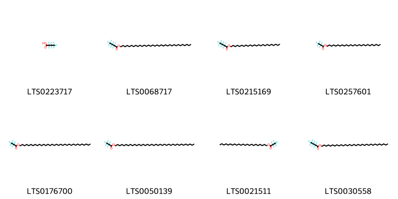{ group="compound" description="Cấu trúc hóa học của các hoạt chất thuộc nhóm *Alkyl halides* là heptafluorobutyric acid [(LTS0223717)](https://lotus.naturalproducts.net/compound/lotus_id/LTS0223717), tetratriacontyl 2,2,3,3,4,4,4-heptafluorobutanoate [(LTS0068717)](https://lotus.naturalproducts.net/compound/lotus_id/LTS0068717), tetracosyl 2,2,3,3,4,4,4-heptafluorobutanoate [(LTS0215169)](https://lotus.naturalproducts.net/compound/lotus_id/LTS0215169), hexacosyl 2,2,3,3,3-pentafluoropropanoate [(LTS0257601)](https://lotus.naturalproducts.net/compound/lotus_id/LTS0257601), tetratriacontyl 2,2,3,3,3-pentafluoropropanoate [(LTS0176700)](https://lotus.naturalproducts.net/compound/lotus_id/LTS0176700), octatriacontyl 2,2,3,3,3-pentafluoropropanoate [(LTS0050139)](https://lotus.naturalproducts.net/compound/lotus_id/LTS0050139), tricosyl 2,2,3,3,3-pentafluoropropanoate [(LTS0021511)](https://lotus.naturalproducts.net/compound/lotus_id/LTS0021511), dotriacontyl 2,2,3,3,4,4,4-heptafluorobutanoate [(LTS0030558)](https://lotus.naturalproducts.net/compound/lotus_id/LTS0030558)." }

                                                              
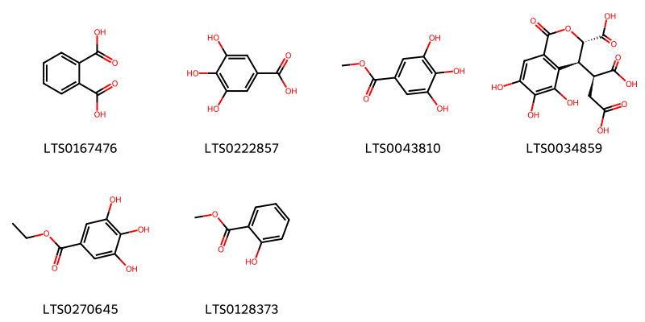{ group="compound" description="Cấu trúc hóa học của các hoạt chất thuộc nhóm *Benzene and substituted derivatives* là phthalic acid [(LTS0167476)](https://lotus.naturalproducts.net/compound/lotus_id/LTS0167476), galop [(LTS0222857)](https://lotus.naturalproducts.net/compound/lotus_id/LTS0222857), methyl gallate [(LTS0043810)](https://lotus.naturalproducts.net/compound/lotus_id/LTS0043810), chebulic acid [(LTS0034859)](https://lotus.naturalproducts.net/compound/lotus_id/LTS0034859), ethyl gallate [(LTS0270645)](https://lotus.naturalproducts.net/compound/lotus_id/LTS0270645), methyl salicylate [(LTS0128373)](https://lotus.naturalproducts.net/compound/lotus_id/LTS0128373)." }

                                                              
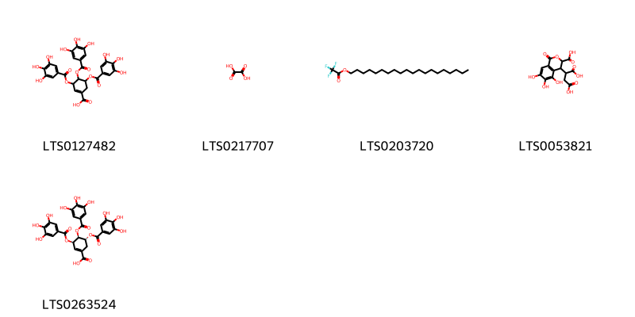{ group="compound" description="Cấu trúc hóa học của các hoạt chất thuộc nhóm *Carboxylic acids and derivatives* là 3,4,5-tris(3,4,5-trihydroxybenzoyloxy)cyclohex-1-ene-1-carboxylic acid [(LTS0127482)](https://lotus.naturalproducts.net/compound/lotus_id/LTS0127482), oxalic acid [(LTS0217707)](https://lotus.naturalproducts.net/compound/lotus_id/LTS0217707), icosyl 2,2,2-trifluoroacetate [(LTS0203720)](https://lotus.naturalproducts.net/compound/lotus_id/LTS0203720), 2-(3-carboxy-5,6,7-trihydroxy-1-oxo-3,4-dihydro-2-benzopyran-4-yl)butanedioic acid [(LTS0053821)](https://lotus.naturalproducts.net/compound/lotus_id/LTS0053821), (3r,4s,5r)-3,4,5-tris(3,4,5-trihydroxybenzoyloxy)cyclohex-1-ene-1-carboxylic acid [(LTS0263524)](https://lotus.naturalproducts.net/compound/lotus_id/LTS0263524)." }

                                                              
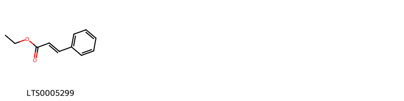{ group="compound" description="Cấu trúc hóa học của các hoạt chất thuộc nhóm *Cinnamic acids and derivatives* là ethyl 3-phenylprop-2-enoate [(LTS0005299)](https://lotus.naturalproducts.net/compound/lotus_id/LTS0005299)." }

                                                              
{ group="compound" description="Cấu trúc hóa học của các hoạt chất thuộc nhóm *Dihydrofurans* là vitamin c [(LTS0022555)](https://lotus.naturalproducts.net/compound/lotus_id/LTS0022555)." }

                                                              
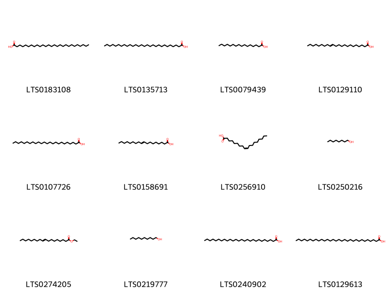{ group="compound" description="Cấu trúc hóa học của các hoạt chất thuộc nhóm *Fatty Acyls* là heptacosanoic acid [(LTS0183108)](https://lotus.naturalproducts.net/compound/lotus_id/LTS0183108), octacosanoic acid [(LTS0135713)](https://lotus.naturalproducts.net/compound/lotus_id/LTS0135713), palmitic acid [(LTS0079439)](https://lotus.naturalproducts.net/compound/lotus_id/LTS0079439), 13-docosenoic acid [(LTS0129110)](https://lotus.naturalproducts.net/compound/lotus_id/LTS0129110), lignoceric acid [(LTS0107726)](https://lotus.naturalproducts.net/compound/lotus_id/LTS0107726), 9 octadecenoic acid [(LTS0158691)](https://lotus.naturalproducts.net/compound/lotus_id/LTS0158691), oleic acid [(LTS0256910)](https://lotus.naturalproducts.net/compound/lotus_id/LTS0256910), octanol [(LTS0250216)](https://lotus.naturalproducts.net/compound/lotus_id/LTS0250216), ethyl octadec-9-enoate [(LTS0274205)](https://lotus.naturalproducts.net/compound/lotus_id/LTS0274205), decanol [(LTS0219777)](https://lotus.naturalproducts.net/compound/lotus_id/LTS0219777), hexacosanoic acid [(LTS0240902)](https://lotus.naturalproducts.net/compound/lotus_id/LTS0240902), triacontanoic acid [(LTS0129613)](https://lotus.naturalproducts.net/compound/lotus_id/LTS0129613)." }

                                                              
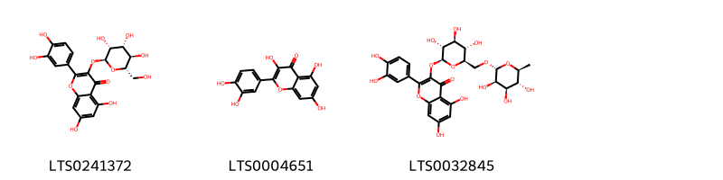{ group="compound" description="Cấu trúc hóa học của các hoạt chất thuộc nhóm *Flavonoids* là 2-(3,4-dihydroxyphenyl)-5,7-dihydroxy-3-{[(2s,3r,4r,5r,6s)-3,4,5-trihydroxy-6-(hydroxymethyl)oxan-2-yl]oxy}chromen-4-one [(LTS0241372)](https://lotus.naturalproducts.net/compound/lotus_id/LTS0241372), quercetin [(LTS0004651)](https://lotus.naturalproducts.net/compound/lotus_id/LTS0004651), 3-rutinosyl quercetin [(LTS0032845)](https://lotus.naturalproducts.net/compound/lotus_id/LTS0032845)." }

                                                              
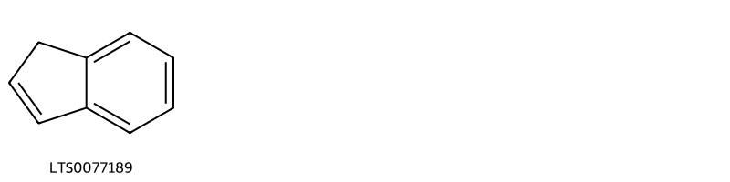{ group="compound" description="Cấu trúc hóa học của các hoạt chất thuộc nhóm *Indenes and isoindenes* là indene [(LTS0077189)](https://lotus.naturalproducts.net/compound/lotus_id/LTS0077189)." }

                                                              
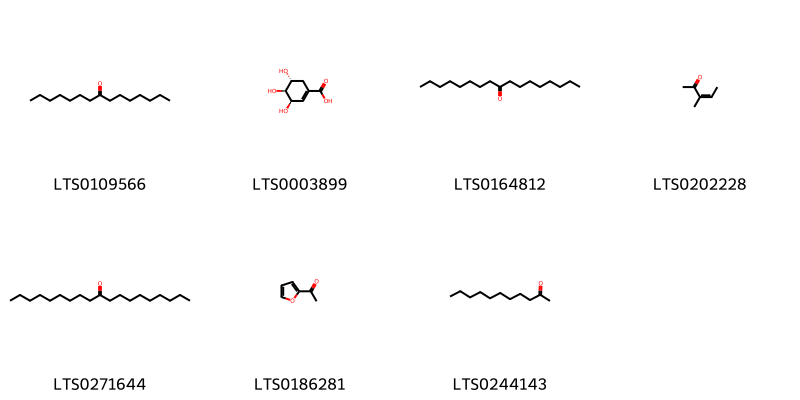{ group="compound" description="Cấu trúc hóa học của các hoạt chất thuộc nhóm *Organooxygen compounds* là 8-pentadecanone [(LTS0109566)](https://lotus.naturalproducts.net/compound/lotus_id/LTS0109566), (-)-shikimate [(LTS0003899)](https://lotus.naturalproducts.net/compound/lotus_id/LTS0003899), 9-heptadecanone [(LTS0164812)](https://lotus.naturalproducts.net/compound/lotus_id/LTS0164812), 3-methyl-3-penten-2-one [(LTS0202228)](https://lotus.naturalproducts.net/compound/lotus_id/LTS0202228), 10-nonadecanone [(LTS0271644)](https://lotus.naturalproducts.net/compound/lotus_id/LTS0271644), acetylfuran [(LTS0186281)](https://lotus.naturalproducts.net/compound/lotus_id/LTS0186281), undecan-2-one [(LTS0244143)](https://lotus.naturalproducts.net/compound/lotus_id/LTS0244143)." }

                                                              
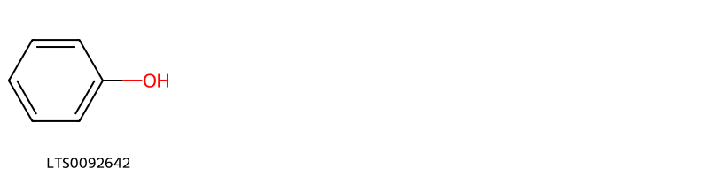{ group="compound" description="Cấu trúc hóa học của các hoạt chất thuộc nhóm *Phenols* là phenol [(LTS0092642)](https://lotus.naturalproducts.net/compound/lotus_id/LTS0092642)." }

                                                              
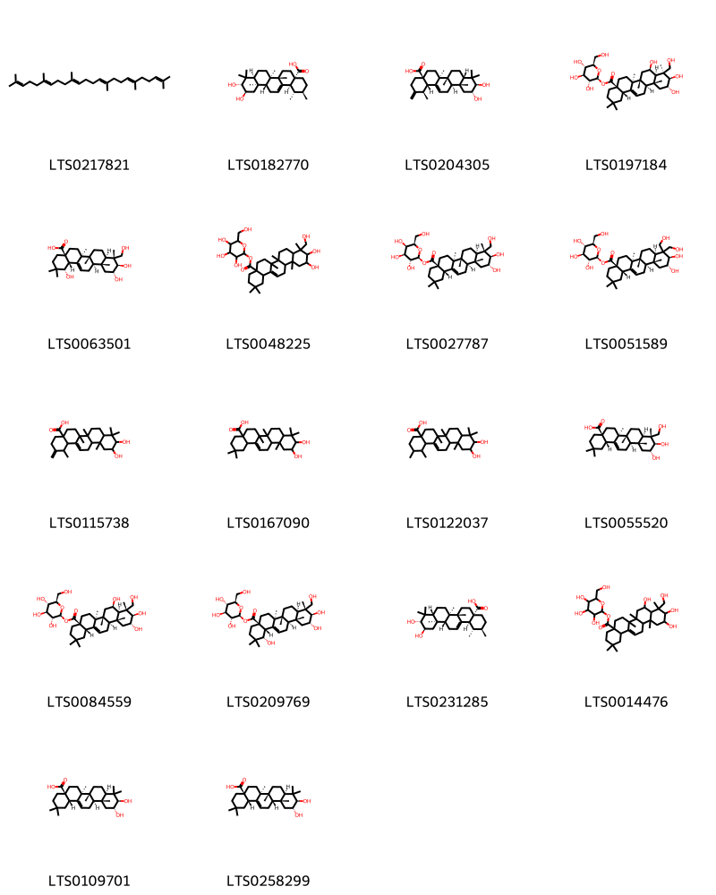{ group="compound" description="Cấu trúc hóa học của các hoạt chất thuộc nhóm *Prenol lipids* là squalene [(LTS0217821)](https://lotus.naturalproducts.net/compound/lotus_id/LTS0217821), (1s,2r,4as,6as,6br,8as,10r,11r,12ar,12br,14bs)-10,11-dihydroxy-1,2,6a,6b,9,9,12a-heptamethyl-2,3,4,5,6,7,8,8a,10,11,12,12b,13,14b-tetradecahydro-1h-picene-4a-carboxylic acid [(LTS0182770)](https://lotus.naturalproducts.net/compound/lotus_id/LTS0182770), (1r,4as,6as,6br,8as,10r,11r,12ar,12br,14bs)-10,11-dihydroxy-1,6a,6b,9,9,12a-hexamethyl-2-methylidene-1,3,4,5,6,7,8,8a,10,11,12,12b,13,14b-tetradecahydropicene-4a-carboxylic acid [(LTS0204305)](https://lotus.naturalproducts.net/compound/lotus_id/LTS0204305), (2s,3r,4s,5s,6r)-3,4,5-trihydroxy-6-(hydroxymethyl)oxan-2-yl (4as,6as,6br,8r,8ar,9s,10r,11r,12ar,12br,14bs)-8,10,11-trihydroxy-9-(hydroxymethyl)-2,2,6a,6b,9,12a-hexamethyl-1,3,4,5,6,7,8,8a,10,11,12,12b,13,14b-tetradecahydropicene-4a-carboxylate [(LTS0197184)](https://lotus.naturalproducts.net/compound/lotus_id/LTS0197184), (1s,4ar,6as,6br,8ar,9r,10r,11r,12ar,12br,14bs)-1,10,11-trihydroxy-9-(hydroxymethyl)-2,2,6a,6b,9,12a-hexamethyl-1,3,4,5,6,7,8,8a,10,11,12,12b,13,14b-tetradecahydropicene-4a-carboxylic acid [(LTS0063501)](https://lotus.naturalproducts.net/compound/lotus_id/LTS0063501), 3,4,5-trihydroxy-6-(hydroxymethyl)oxan-2-yl 10,11-dihydroxy-9-(hydroxymethyl)-2,2,6a,6b,9,12a-hexamethyl-1,3,4,5,6,7,8,8a,10,11,12,12b,13,14b-tetradecahydropicene-4a-carboxylate [(LTS0048225)](https://lotus.naturalproducts.net/compound/lotus_id/LTS0048225), (2s,3r,4s,5r,6r)-3,4,5-trihydroxy-6-(hydroxymethyl)oxan-2-yl (4as,6as,6br,8ar,9r,10r,11r,12ar,12br,14bs)-10,11-dihydroxy-9-(hydroxymethyl)-2,2,6a,6b,9,12a-hexamethyl-1,3,4,5,6,7,8,8a,10,11,12,12b,13,14b-tetradecahydropicene-4a-carboxylate [(LTS0027787)](https://lotus.naturalproducts.net/compound/lotus_id/LTS0027787), (2s,3r,4s,5s,6r)-3,4,5-trihydroxy-6-(hydroxymethyl)oxan-2-yl (4as,6as,6br,8ar,10r,11r,12ar,12br,14bs)-10,11-dihydroxy-9,9-bis(hydroxymethyl)-2,2,6a,6b,12a-pentamethyl-1,3,4,5,6,7,8,8a,10,11,12,12b,13,14b-tetradecahydropicene-4a-carboxylate [(LTS0051589)](https://lotus.naturalproducts.net/compound/lotus_id/LTS0051589), 10,11-dihydroxy-1,6a,6b,9,9,12a-hexamethyl-2-methylidene-1,3,4,5,6,7,8,8a,10,11,12,12b,13,14b-tetradecahydropicene-4a-carboxylic acid [(LTS0115738)](https://lotus.naturalproducts.net/compound/lotus_id/LTS0115738), 10,11-dihydroxy-2,2,6a,6b,9,9,12a-heptamethyl-1,3,4,5,6,7,8,8a,10,11,12,12b,13,14b-tetradecahydropicene-4a-carboxylic acid [(LTS0167090)](https://lotus.naturalproducts.net/compound/lotus_id/LTS0167090), 10,11-dihydroxy-1,2,6a,6b,9,9,12a-heptamethyl-2,3,4,5,6,7,8,8a,10,11,12,12b,13,14b-tetradecahydro-1h-picene-4a-carboxylic acid [(LTS0122037)](https://lotus.naturalproducts.net/compound/lotus_id/LTS0122037), arjunolic acid [(LTS0055520)](https://lotus.naturalproducts.net/compound/lotus_id/LTS0055520), (2s,3r,4s,5s,6r)-3,4,5-trihydroxy-6-(hydroxymethyl)oxan-2-yl (4as,6as,6br,8r,8ar,9r,10r,11r,12ar,12br,14bs)-8,10,11-trihydroxy-9-(hydroxymethyl)-2,2,6a,6b,9,12a-hexamethyl-1,3,4,5,6,7,8,8a,10,11,12,12b,13,14b-tetradecahydropicene-4a-carboxylate [(LTS0084559)](https://lotus.naturalproducts.net/compound/lotus_id/LTS0084559), (2s,3r,4s,5s,6r)-3,4,5-trihydroxy-6-(hydroxymethyl)oxan-2-yl (1s,4ar,6as,6br,8ar,9r,10r,11r,12ar,12br,14bs)-1,10,11-trihydroxy-9-(hydroxymethyl)-2,2,6a,6b,9,12a-hexamethyl-1,3,4,5,6,7,8,8a,10,11,12,12b,13,14b-tetradecahydropicene-4a-carboxylate [(LTS0209769)](https://lotus.naturalproducts.net/compound/lotus_id/LTS0209769), corosolic acid [(LTS0231285)](https://lotus.naturalproducts.net/compound/lotus_id/LTS0231285), 3,4,5-trihydroxy-6-(hydroxymethyl)oxan-2-yl 8,10,11-trihydroxy-9-(hydroxymethyl)-2,2,6a,6b,9,12a-hexamethyl-1,3,4,5,6,7,8,8a,10,11,12,12b,13,14b-tetradecahydropicene-4a-carboxylate [(LTS0014476)](https://lotus.naturalproducts.net/compound/lotus_id/LTS0014476), maslinic acid [(LTS0109701)](https://lotus.naturalproducts.net/compound/lotus_id/LTS0109701), (4as,6as,6br,8ar,10r,11r,12ar,12bs,14bs)-10,11-dihydroxy-2,2,6a,6b,9,9,12a-heptamethyl-1,3,4,5,6,7,8,8a,10,11,12,12b,13,14b-tetradecahydropicene-4a-carboxylic acid [(LTS0258299)](https://lotus.naturalproducts.net/compound/lotus_id/LTS0258299)." }

                                                              
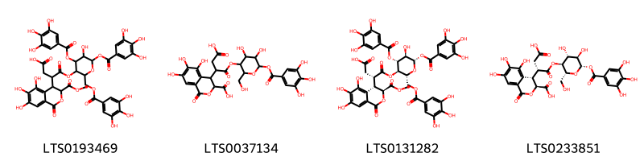{ group="compound" description="Cấu trúc hóa học của các hoạt chất thuộc nhóm *Saccharolipids* là 4-{[5-hydroxy-4,6-bis(3,4,5-trihydroxybenzoyloxy)-2-[(3,4,5-trihydroxybenzoyloxy)methyl]oxan-3-yl]oxy}-4-oxo-3-[5,6,7-trihydroxy-3-(methoxycarbonyl)-1-oxo-3,4-dihydro-2-benzopyran-4-yl]butanoic acid [(LTS0193469)](https://lotus.naturalproducts.net/compound/lotus_id/LTS0193469), 4-(3-carboxy-1-{[4,5-dihydroxy-2-(hydroxymethyl)-6-(3,4,5-trihydroxybenzoyloxy)oxan-3-yl]oxy}-1-oxopropan-2-yl)-5,6,7-trihydroxy-1-oxo-3,4-dihydro-2-benzopyran-3-carboxylic acid [(LTS0037134)](https://lotus.naturalproducts.net/compound/lotus_id/LTS0037134), (3s)-4-{[(2r,3r,4r,5r,6s)-5-hydroxy-4,6-bis(3,4,5-trihydroxybenzoyloxy)-2-[(3,4,5-trihydroxybenzoyloxy)methyl]oxan-3-yl]oxy}-4-oxo-3-[(3s,4s)-5,6,7-trihydroxy-3-(methoxycarbonyl)-1-oxo-3,4-dihydro-2-benzopyran-4-yl]butanoic acid [(LTS0131282)](https://lotus.naturalproducts.net/compound/lotus_id/LTS0131282), (3s,4s)-4-[(2s)-3-carboxy-1-{[(2r,3s,4r,5r,6s)-4,5-dihydroxy-2-(hydroxymethyl)-6-(3,4,5-trihydroxybenzoyloxy)oxan-3-yl]oxy}-1-oxopropan-2-yl]-5,6,7-trihydroxy-1-oxo-3,4-dihydro-2-benzopyran-3-carboxylic acid [(LTS0233851)](https://lotus.naturalproducts.net/compound/lotus_id/LTS0233851)." }

                                                              
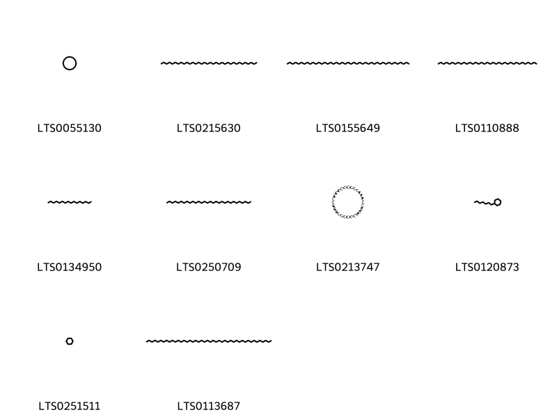{ group="compound" description="Cấu trúc hóa học của các hoạt chất thuộc nhóm *Saturated hydrocarbons* là cyclododecane [(LTS0055130)](https://lotus.naturalproducts.net/compound/lotus_id/LTS0055130), tetratriacontane [(LTS0215630)](https://lotus.naturalproducts.net/compound/lotus_id/LTS0215630), tritetracontane [(LTS0155649)](https://lotus.naturalproducts.net/compound/lotus_id/LTS0155649), pentatriacontane [(LTS0110888)](https://lotus.naturalproducts.net/compound/lotus_id/LTS0110888), cetane [(LTS0134950)](https://lotus.naturalproducts.net/compound/lotus_id/LTS0134950), triacontane [(LTS0250709)](https://lotus.naturalproducts.net/compound/lotus_id/LTS0250709), cyclooctacosane [(LTS0213747)](https://lotus.naturalproducts.net/compound/lotus_id/LTS0213747), heptylcyclohexane [(LTS0120873)](https://lotus.naturalproducts.net/compound/lotus_id/LTS0120873), cyclohexane [(LTS0251511)](https://lotus.naturalproducts.net/compound/lotus_id/LTS0251511), tetratetracontane [(LTS0113687)](https://lotus.naturalproducts.net/compound/lotus_id/LTS0113687)." }

                                                              
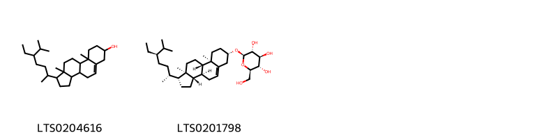{ group="compound" description="Cấu trúc hóa học của các hoạt chất thuộc nhóm *Steroids and steroid derivatives* là stigmast-5-en-3-ol, (3β)- [(LTS0204616)](https://lotus.naturalproducts.net/compound/lotus_id/LTS0204616), sitogluside [(LTS0201798)](https://lotus.naturalproducts.net/compound/lotus_id/LTS0201798)." }

                                                              
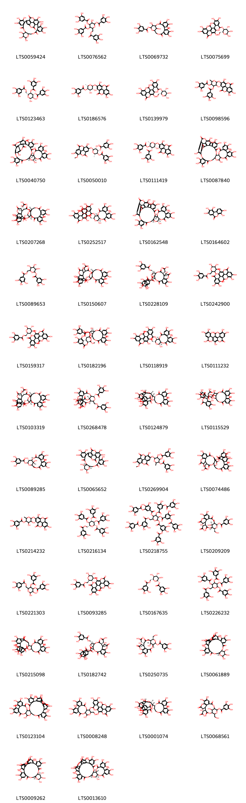{ group="compound" description="Cấu trúc hóa học của các hoạt chất thuộc nhóm *Tannins* là 3,4,5,11,12,13,21,22,23,26,27-undecahydroxy-9,14,17,29,36-pentaoxaoctacyclo[29.8.0.0²,⁷.0¹⁰,¹⁵.0¹⁹,²⁴.0²⁵,³⁴.0²⁸,³³.0³²,³⁷]nonatriaconta-1(39),2(7),3,5,19,21,23,25,27,31,33,37-dodecaene-8,18,30,35-tetrone [(LTS0059424)](https://lotus.naturalproducts.net/compound/lotus_id/LTS0059424), 3-hydroxy-4,5-bis(3,4,5-trihydroxybenzoyloxy)-6-[(3,4,5-trihydroxybenzoyloxy)methyl]oxan-2-yl 3,4,5-trihydroxybenzoate [(LTS0076562)](https://lotus.naturalproducts.net/compound/lotus_id/LTS0076562), 6,7,8,11,12,13,22,23-octahydroxy-3,16-dioxo-2,17,20-trioxatetracyclo[17.3.1.0⁴,⁹.0¹⁰,¹⁵]tricosa-4(9),5,7,10,12,14-hexaen-21-yl 3,4,5-trihydroxybenzoate [(LTS0069732)](https://lotus.naturalproducts.net/compound/lotus_id/LTS0069732), (2r,3s,4r,5r,6s)-4,5,6-trihydroxy-2-(hydroxymethyl)oxan-3-yl 3,4,5-trihydroxy-2-{6,7,13,14-tetrahydroxy-3,10-dioxo-2,9-dioxatetracyclo[6.6.2.0⁴,¹⁶.0¹¹,¹⁵]hexadeca-1(14),4(16),5,7,11(15),12-hexaen-5-yl}benzoate [(LTS0075699)](https://lotus.naturalproducts.net/compound/lotus_id/LTS0075699), (2r,3r,4r,5r,6r)-2,3-dihydroxy-5-(3,4,5-trihydroxybenzoyloxy)-6-[(3,4,5-trihydroxybenzoyloxy)methyl]oxan-4-yl 3,4,5-trihydroxybenzoate [(LTS0123463)](https://lotus.naturalproducts.net/compound/lotus_id/LTS0123463), (2s,3r,4s,5r,6s)-4,5-dihydroxy-2-methyl-6-({7,13,14-trihydroxy-3,10-dioxo-2,9-dioxatetracyclo[6.6.2.0⁴,¹⁶.0¹¹,¹⁵]hexadeca-1(15),4(16),5,7,11,13-hexaen-6-yl}oxy)oxan-3-yl 3,4,5-trihydroxybenzoate [(LTS0186576)](https://lotus.naturalproducts.net/compound/lotus_id/LTS0186576), (2r,3s,4r,5r,6r)-4,5,6-trihydroxy-2-(hydroxymethyl)oxan-3-yl 3,4,5-trihydroxy-2-{6,7,13,14-tetrahydroxy-3,10-dioxo-2,9-dioxatetracyclo[6.6.2.0⁴,¹⁶.0¹¹,¹⁵]hexadeca-1(14),4(16),5,7,11(15),12-hexaen-5-yl}benzoate [(LTS0139979)](https://lotus.naturalproducts.net/compound/lotus_id/LTS0139979), 3-hydroxy-6-methyl-2-({7,13,14-trihydroxy-3,10-dioxo-2,9-dioxatetracyclo[6.6.2.0⁴,¹⁶.0¹¹,¹⁵]hexadeca-1(15),4(16),5,7,11,13-hexaen-6-yl}oxy)-5-(3,4,5-trihydroxybenzoyloxy)oxan-4-yl 3,4,5-trihydroxybenzoate [(LTS0098596)](https://lotus.naturalproducts.net/compound/lotus_id/LTS0098596), (12r,14s,15r,32s,33r)-4,5,6,14,20,21,22,25,26,27,38,39,40,43,44,55-hexadecahydroxy-2,10,13,16,31,34,46,53-octaoxaundecacyclo[46.7.1.0³,⁸.0¹²,³³.0¹⁵,³².0¹⁸,²³.0²⁴,²⁹.0³⁶,⁴¹.0⁴²,⁵¹.0⁴⁵,⁵⁰.0⁴⁹,⁵⁴]hexapentaconta-1(56),3(8),4,6,18,20,22,24(29),25,27,36,38,40,42,44,48,50,54-octadecaene-9,17,30,35,47,52-hexone [(LTS0040750)](https://lotus.naturalproducts.net/compound/lotus_id/LTS0040750), (2s,3s,4s,5r,6s)-6-({7,13-dihydroxy-14-methoxy-3,10-dioxo-2,9-dioxatetracyclo[6.6.2.0⁴,¹⁶.0¹¹,¹⁵]hexadeca-1(15),4,6,8(16),11,13-hexaen-6-yl}oxy)-5-hydroxy-2-methyl-4-(3,4,5-trihydroxybenzoyloxy)oxan-3-yl 3,4,5-trihydroxybenzoate [(LTS0050010)](https://lotus.naturalproducts.net/compound/lotus_id/LTS0050010), (2s,3r,4s,5s,6s)-3-hydroxy-6-methyl-2-({7,13,14-trihydroxy-3,10-dioxo-2,9-dioxatetracyclo[6.6.2.0⁴,¹⁶.0¹¹,¹⁵]hexadeca-1(15),4(16),5,7,11,13-hexaen-6-yl}oxy)-5-(3,4,5-trihydroxybenzoyloxy)oxan-4-yl 3,4,5-trihydroxybenzoate [(LTS0111419)](https://lotus.naturalproducts.net/compound/lotus_id/LTS0111419), 3,4,5,16,17,18,21,22,23,29,37,38,39,43,55,56-hexadecahydroxy-9,12,27,30,33,41,47,52-octaoxaundecacyclo[46.6.2.0²,⁷.0¹⁰,³¹.0¹¹,²⁸.0¹⁴,¹⁹.0²⁰,²⁵.0³⁵,⁴⁰.0⁴²,⁵¹.0⁴⁵,⁵⁰.0⁴⁹,⁵⁴]hexapentaconta-1(55),2,4,6,14(19),15,17,20,22,24,35(40),36,38,42(51),43,45(50),48(56),49(54)-octadecaene-8,13,26,34,46,53-hexone [(LTS0087840)](https://lotus.naturalproducts.net/compound/lotus_id/LTS0087840), [(4r,5s,7r,25s,26r,29s,30s,31r)-13,14,15,18,19,20,31,35,36-nonahydroxy-2,10,23,28,32-pentaoxo-5-(3,4,5-trihydroxybenzoyloxy)-3,6,9,24,27,33-hexaoxaheptacyclo[28.7.1.0⁴,²⁵.0⁷,²⁶.0¹¹,¹⁶.0¹⁷,²².0³⁴,³⁸]octatriaconta-1(37),11(16),12,14,17,19,21,34(38),35-nonaen-29-yl]acetic acid [(LTS0207268)](https://lotus.naturalproducts.net/compound/lotus_id/LTS0207268), (10r,11r,13r,14r,15s)-3,4,5,11,20,21,22-heptahydroxy-8,17-dioxo-13-[(3,4,5-trihydroxybenzoyloxy)methyl]-9,12,16-trioxatetracyclo[16.4.0.0²,⁷.0¹⁰,¹⁵]docosa-1(18),2,4,6,19,21-hexaen-14-yl 3,4,5-trihydroxy-2-{6,7,13,14-tetrahydroxy-3,10-dioxo-2,9-dioxatetracyclo[6.6.2.0⁴,¹⁶.0¹¹,¹⁵]hexadeca-1(14),4(16),5,7,11(15),12-hexaen-5-yl}benzoate [(LTS0252517)](https://lotus.naturalproducts.net/compound/lotus_id/LTS0252517), (10s,11s,28r,29r,31r)-3,4,5,16,17,18,21,22,23,29,37,38,39,43,55,56-hexadecahydroxy-9,12,27,30,33,41,47,52-octaoxaundecacyclo[46.6.2.0²,⁷.0¹⁰,³¹.0¹¹,²⁸.0¹⁴,¹⁹.0²⁰,²⁵.0³⁵,⁴⁰.0⁴²,⁵¹.0⁴⁵,⁵⁰.0⁴⁹,⁵⁴]hexapentaconta-1(55),2,4,6,14(19),15,17,20,22,24,35(40),36,38,42(51),43,45(50),48(56),49(54)-octadecaene-8,13,26,34,46,53-hexone [(LTS0162548)](https://lotus.naturalproducts.net/compound/lotus_id/LTS0162548), 3,4,8,9,10-pentahydroxybenzo[c]chromen-6-one [(LTS0164602)](https://lotus.naturalproducts.net/compound/lotus_id/LTS0164602), 3,4,5-trihydroxy-6-[(3,4,5-trihydroxybenzoyloxy)methyl]oxan-2-yl 3,4,5-trihydroxybenzoate [(LTS0089653)](https://lotus.naturalproducts.net/compound/lotus_id/LTS0089653), [(5r,7r)-13,14,15,18,19,20,31,35,36-nonahydroxy-2,10,23,28,32-pentaoxo-5-(3,4,5-trihydroxybenzoyloxy)-3,6,9,24,27,33-hexaoxaheptacyclo[28.7.1.0⁴,²⁵.0⁷,²⁶.0¹¹,¹⁶.0¹⁷,²².0³⁴,³⁸]octatriaconta-1(37),11(16),12,14,17,19,21,34(38),35-nonaen-29-yl]acetic acid [(LTS0150607)](https://lotus.naturalproducts.net/compound/lotus_id/LTS0150607), [(4r,5s,7r,8r,11s,12s,13r,21s)-13,17,18-trihydroxy-2,10,14-trioxo-5,21-bis(3,4,5-trihydroxybenzoyloxy)-7-[(3,4,5-trihydroxybenzoyloxy)methyl]-3,6,9,15-tetraoxatetracyclo[10.7.1.1⁴,⁸.0¹⁶,²⁰]henicosa-1(19),16(20),17-trien-11-yl]acetic acid [(LTS0228109)](https://lotus.naturalproducts.net/compound/lotus_id/LTS0228109), terflavin b [(LTS0242900)](https://lotus.naturalproducts.net/compound/lotus_id/LTS0242900), terflavin b [(LTS0159317)](https://lotus.naturalproducts.net/compound/lotus_id/LTS0159317), (3s)-4-{[(1r,19r,21s,22r,23r)-6,7,8,11,12,13,22-heptahydroxy-3,16-dioxo-21-(3,4,5-trihydroxybenzoyloxy)-2,17,20-trioxatetracyclo[17.3.1.0⁴,⁹.0¹⁰,¹⁵]tricosa-4(9),5,7,10,12,14-hexaen-23-yl]oxy}-4-oxo-3-[(3s,4s)-5,6,7-trihydroxy-3-(methoxycarbonyl)-1-oxo-3,4-dihydro-2-benzopyran-4-yl]butanoic acid [(LTS0182196)](https://lotus.naturalproducts.net/compound/lotus_id/LTS0182196), (10r,11r,13r,14r,15s)-3,4,5,11,20,21,22-heptahydroxy-13-(hydroxymethyl)-8,17-dioxo-9,12,16-trioxatetracyclo[16.4.0.0²,⁷.0¹⁰,¹⁵]docosa-1(18),2,4,6,19,21-hexaen-14-yl 3,4,5-trihydroxy-2-{6,7,13,14-tetrahydroxy-3,10-dioxo-2,9-dioxatetracyclo[6.6.2.0⁴,¹⁶.0¹¹,¹⁵]hexadeca-1(14),4(16),5,7,11(15),12-hexaen-5-yl}benzoate [(LTS0118919)](https://lotus.naturalproducts.net/compound/lotus_id/LTS0118919), 3,4,5-trihydroxy-2-{6,7,13,14-tetrahydroxy-3,10-dioxo-2,9-dioxatetracyclo[6.6.2.0⁴,¹⁶.0¹¹,¹⁵]hexadeca-1(14),4(16),5,7,11(15),12-hexaen-5-yl}benzoic acid [(LTS0111232)](https://lotus.naturalproducts.net/compound/lotus_id/LTS0111232), [(4r,5s,7r,25s,26r,29s,30s,31s)-13,14,15,18,19,20,31,35,36-nonahydroxy-2,10,23,28,32-pentaoxo-5-(3,4,5-trihydroxybenzoyloxy)-3,6,9,24,27,33-hexaoxaheptacyclo[28.7.1.0⁴,²⁵.0⁷,²⁶.0¹¹,¹⁶.0¹⁷,²².0³⁴,³⁸]octatriaconta-1(37),11(16),12,14,17,19,21,34(38),35-nonaen-29-yl]acetic acid [(LTS0103319)](https://lotus.naturalproducts.net/compound/lotus_id/LTS0103319), [(5s,8r,11s,12s,13r,21r)-13,17,18-trihydroxy-2,10,14-trioxo-5,21-bis(3,4,5-trihydroxybenzoyloxy)-7-[(3,4,5-trihydroxybenzoyloxy)methyl]-3,6,9,15-tetraoxatetracyclo[10.7.1.1⁴,⁸.0¹⁶,²⁰]henicosa-1(19),16(20),17-trien-11-yl]acetic acid [(LTS0268478)](https://lotus.naturalproducts.net/compound/lotus_id/LTS0268478), (11r,12r)-12-[(14r,15s,19s)-2,3,4,7,8,9,19-heptahydroxy-12,17-dioxo-13,16-dioxatetracyclo[13.3.1.0⁵,¹⁸.0⁶,¹¹]nonadeca-1(18),2,4,6,8,10-hexaen-14-yl]-3,4,5,17,18,19-hexahydroxy-8,14-dioxo-9,13-dioxatricyclo[13.4.0.0²,⁷]nonadeca-1(15),2,4,6,16,18-hexaen-11-yl 3,4,5-trihydroxybenzoate [(LTS0124879)](https://lotus.naturalproducts.net/compound/lotus_id/LTS0124879), 4-{[6,7,8,11,12,13,22-heptahydroxy-3,16-dioxo-21-(3,4,5-trihydroxybenzoyloxy)-2,17,20-trioxatetracyclo[17.3.1.0⁴,⁹.0¹⁰,¹⁵]tricosa-4(9),5,7,10,12,14-hexaen-23-yl]oxy}-4-oxo-3-[5,6,7-trihydroxy-3-(methoxycarbonyl)-1-oxo-3,4-dihydro-2-benzopyran-4-yl]butanoic acid [(LTS0115529)](https://lotus.naturalproducts.net/compound/lotus_id/LTS0115529), (1s,19r,21s,22r,23r)-6,7,8,11,12,13,22,23-octahydroxy-3,16-dioxo-2,17,20-trioxatetracyclo[17.3.1.0⁴,⁹.0¹⁰,¹⁵]tricosa-4(9),5,7,10,12,14-hexaen-21-yl 3,4,5-trihydroxybenzoate [(LTS0089285)](https://lotus.naturalproducts.net/compound/lotus_id/LTS0089285), (10s,11r,12r,13r,15r)-3,4,5,11,12,13,21,22,23,26,27-undecahydroxy-9,14,17,29,36-pentaoxaoctacyclo[29.8.0.0²,⁷.0¹⁰,¹⁵.0¹⁹,²⁴.0²⁵,³⁴.0²⁸,³³.0³²,³⁷]nonatriaconta-1(39),2(7),3,5,19,21,23,25,27,31,33,37-dodecaene-8,18,30,35-tetrone [(LTS0065652)](https://lotus.naturalproducts.net/compound/lotus_id/LTS0065652), 6-({7,13-dihydroxy-14-methoxy-3,10-dioxo-2,9-dioxatetracyclo[6.6.2.0⁴,¹⁶.0¹¹,¹⁵]hexadeca-1(15),4,6,8(16),11,13-hexaen-6-yl}oxy)-5-hydroxy-2-methyl-4-(3,4,5-trihydroxybenzoyloxy)oxan-3-yl 3,4,5-trihydroxybenzoate [(LTS0269904)](https://lotus.naturalproducts.net/compound/lotus_id/LTS0269904), [13,14,15,18,19,20,31,35,36-nonahydroxy-2,10,23,28,32-pentaoxo-5-(3,4,5-trihydroxybenzoyloxy)-3,6,9,24,27,33-hexaoxaheptacyclo[28.7.1.0⁴,²⁵.0⁷,²⁶.0¹¹,¹⁶.0¹⁷,²².0³⁴,³⁸]octatriaconta-1(37),11,13,15,17(22),18,20,34(38),35-nonaen-29-yl]acetic acid [(LTS0074486)](https://lotus.naturalproducts.net/compound/lotus_id/LTS0074486), 4,5-dihydroxy-2-methyl-6-({7,13,14-trihydroxy-3,10-dioxo-2,9-dioxatetracyclo[6.6.2.0⁴,¹⁶.0¹¹,¹⁵]hexadeca-1(15),4(16),5,7,11,13-hexaen-6-yl}oxy)oxan-3-yl 3,4,5-trihydroxybenzoate [(LTS0214232)](https://lotus.naturalproducts.net/compound/lotus_id/LTS0214232), (2s,3r,4s,5r,6r)-3,4,5-tris(3,4,5-trihydroxybenzoyloxy)-6-[(3,4,5-trihydroxybenzoyloxy)methyl]oxan-2-yl 3,4,5-trihydroxybenzoate [(LTS0216134)](https://lotus.naturalproducts.net/compound/lotus_id/LTS0216134), 3,4,5-tris[3,4-dihydroxy-5-(3,4,5-trihydroxybenzoyloxy)benzoyloxy]-6-{[3,4-dihydroxy-5-(3,4,5-trihydroxybenzoyloxy)benzoyloxy]methyl}oxan-2-yl 3,4-dihydroxy-5-(3,4,5-trihydroxybenzoyloxy)benzoate [(LTS0218755)](https://lotus.naturalproducts.net/compound/lotus_id/LTS0218755), [(4s,5r,7s,8r,13r,21r)-13,17,18,21-tetrahydroxy-7-(hydroxymethyl)-2,10,14-trioxo-5-(3,4,5-trihydroxybenzoyloxy)-3,6,9,15-tetraoxatetracyclo[10.7.1.1⁴,⁸.0¹⁶,²⁰]henicosa-1(19),16(20),17-trien-11-yl]acetic acid [(LTS0209209)](https://lotus.naturalproducts.net/compound/lotus_id/LTS0209209), 2,3-dihydroxy-5-(3,4,5-trihydroxybenzoyloxy)-6-[(3,4,5-trihydroxybenzoyloxy)methyl]oxan-4-yl 3,4,5-trihydroxybenzoate [(LTS0221303)](https://lotus.naturalproducts.net/compound/lotus_id/LTS0221303), (2r,3s,4r,5r,6r)-4,5,6-trihydroxy-2-[(3,4,5-trihydroxybenzoyloxy)methyl]oxan-3-yl 3,4,5-trihydroxy-2-{6,7,13,14-tetrahydroxy-3,10-dioxo-2,9-dioxatetracyclo[6.6.2.0⁴,¹⁶.0¹¹,¹⁵]hexadeca-1(14),4(16),5,7,11(15),12-hexaen-5-yl}benzoate [(LTS0093285)](https://lotus.naturalproducts.net/compound/lotus_id/LTS0093285), (2s,3r,4s,5s,6r)-3,4,5-trihydroxy-6-[(3,4,5-trihydroxybenzoyloxy)methyl]oxan-2-yl 3,4,5-trihydroxybenzoate [(LTS0167635)](https://lotus.naturalproducts.net/compound/lotus_id/LTS0167635), 3,4,5-tris(3,4,5-trihydroxybenzoyloxy)-6-[(3,4,5-trihydroxybenzoyloxy)methyl]oxan-2-yl 3,4,5-trihydroxybenzoate [(LTS0226232)](https://lotus.naturalproducts.net/compound/lotus_id/LTS0226232), 12-{2,3,4,7,8,9,19-heptahydroxy-12,17-dioxo-13,16-dioxatetracyclo[13.3.1.0⁵,¹⁸.0⁶,¹¹]nonadeca-1(18),2,4,6,8,10-hexaen-14-yl}-3,4,5,17,18,19-hexahydroxy-8,14-dioxo-9,13-dioxatricyclo[13.4.0.0²,⁷]nonadeca-1(15),2,4,6,16,18-hexaen-11-yl 3,4,5-trihydroxybenzoate [(LTS0215098)](https://lotus.naturalproducts.net/compound/lotus_id/LTS0215098), chebulinic acid [(LTS0182742)](https://lotus.naturalproducts.net/compound/lotus_id/LTS0182742), [(4r,5s,7r,8s,11s,12s,13s,21s)-13,17,18,21-tetrahydroxy-7-(hydroxymethyl)-2,10,14-trioxo-5-(3,4,5-trihydroxybenzoyloxy)-3,6,9,15-tetraoxatetracyclo[10.7.1.1⁴,⁸.0¹⁶,²⁰]henicosa-1(19),16(20),17-trien-11-yl]acetic acid [(LTS0250735)](https://lotus.naturalproducts.net/compound/lotus_id/LTS0250735), (15r)-3,4,5,11,12,13,21,22,23,26,27,38,39-tridecahydroxy-9,14,17,29,36-pentaoxaoctacyclo[29.8.0.0²,⁷.0¹⁰,¹⁵.0¹⁹,²⁴.0²⁵,³⁴.0²⁸,³³.0³²,³⁷]nonatriaconta-1(39),2,4,6,19(24),20,22,25,27,31,33,37-dodecaene-8,18,30,35-tetrone [(LTS0061889)](https://lotus.naturalproducts.net/compound/lotus_id/LTS0061889), 6,7,8,11,12,23,24,27,28,29,37,43,44,45,48,49,50-heptadecahydroxy-2,14,21,33,36,39,54-heptaoxaundecacyclo[33.20.0.0⁴,⁹.0¹⁰,¹⁹.0¹³,¹⁸.0¹⁶,²⁵.0¹⁷,²².0²⁶,³¹.0³⁸,⁵⁵.0⁴¹,⁴⁶.0⁴⁷,⁵²]pentapentaconta-4(9),5,7,10,12,16,18,22,24,26,28,30,41(46),42,44,47,49,51-octadecaene-3,15,20,32,40,53-hexone [(LTS0123104)](https://lotus.naturalproducts.net/compound/lotus_id/LTS0123104), 3,4,5,11,20,21,22-heptahydroxy-13-(hydroxymethyl)-8,17-dioxo-9,12,16-trioxatetracyclo[16.4.0.0²,⁷.0¹⁰,¹⁵]docosa-1(22),2(7),3,5,18,20-hexaen-14-yl 3,4,5-trihydroxy-2-{6,7,13,14-tetrahydroxy-3,10-dioxo-2,9-dioxatetracyclo[6.6.2.0⁴,¹⁶.0¹¹,¹⁵]hexadeca-1(14),4(16),5,7,11(15),12-hexaen-5-yl}benzoate [(LTS0008248)](https://lotus.naturalproducts.net/compound/lotus_id/LTS0008248), (11s,12r)-12-[(14r,15r,19r)-2,3,4,7,8,9,19-heptahydroxy-12,17-dioxo-13,16-dioxatetracyclo[13.3.1.0⁵,¹⁸.0⁶,¹¹]nonadeca-1(18),2,4,6,8,10-hexaen-14-yl]-3,4,5,17,18,19-hexahydroxy-8,14-dioxo-9,13-dioxatricyclo[13.4.0.0²,⁷]nonadeca-1(15),2,4,6,16,18-hexaen-11-yl 3,4,5-trihydroxybenzoate [(LTS0001074)](https://lotus.naturalproducts.net/compound/lotus_id/LTS0001074), [13,17,18,21-tetrahydroxy-7-(hydroxymethyl)-2,10,14-trioxo-5-(3,4,5-trihydroxybenzoyloxy)-3,6,9,15-tetraoxatetracyclo[10.7.1.1⁴,⁸.0¹⁶,²⁰]henicosa-1(19),16(20),17-trien-11-yl]acetic acid [(LTS0068561)](https://lotus.naturalproducts.net/compound/lotus_id/LTS0068561), (10s,11r,12r,13r,15r)-3,4,5,11,12,13,21,22,23,26,27,38,39-tridecahydroxy-9,14,17,29,36-pentaoxaoctacyclo[29.8.0.0²,⁷.0¹⁰,¹⁵.0¹⁹,²⁴.0²⁵,³⁴.0²⁸,³³.0³²,³⁷]nonatriaconta-1(39),2,4,6,19(24),20,22,25,27,31,33,37-dodecaene-8,18,30,35-tetrone [(LTS0009262)](https://lotus.naturalproducts.net/compound/lotus_id/LTS0009262), (1r,35r,37r,38r,55s)-6,7,8,11,12,23,24,27,28,29,37,43,44,45,48,49,50-heptadecahydroxy-2,14,21,33,36,39,54-heptaoxaundecacyclo[33.20.0.0⁴,⁹.0¹⁰,¹⁹.0¹³,¹⁸.0¹⁶,²⁵.0¹⁷,²².0²⁶,³¹.0³⁸,⁵⁵.0⁴¹,⁴⁶.0⁴⁷,⁵²]pentapentaconta-4(9),5,7,10,12,16,18,22,24,26,28,30,41,43,45,47(52),48,50-octadecaene-3,15,20,32,40,53-hexone [(LTS0013610)](https://lotus.naturalproducts.net/compound/lotus_id/LTS0013610), 3,4,5,11,20,21,22-heptahydroxy-8,17-dioxo-13-[(3,4,5-trihydroxybenzoyloxy)methyl]-9,12,16-trioxatetracyclo[16.4.0.0²,⁷.0¹⁰,¹⁵]docosa-1(18),2,4,6,19,21-hexaen-14-yl 3,4,5-trihydroxy-2-{6,7,13,14-tetrahydroxy-3,10-dioxo-2,9-dioxatetracyclo[6.6.2.0⁴,¹⁶.0¹¹,¹⁵]hexadeca-1(14),4(16),5,7,11(15),12-hexaen-5-yl}benzoate [(LTS0012931)](https://lotus.naturalproducts.net/compound/lotus_id/LTS0012931), (12r,15r,32s,33r)-4,5,6,14,20,21,22,25,26,27,38,39,40,43,44,55-hexadecahydroxy-2,10,13,16,31,34,46,53-octaoxaundecacyclo[46.7.1.0³,⁸.0¹²,³³.0¹⁵,³².0¹⁸,²³.0²⁴,²⁹.0³⁶,⁴¹.0⁴²,⁵¹.0⁴⁵,⁵⁰.0⁴⁹,⁵⁴]hexapentaconta-1(56),3(8),4,6,18,20,22,24(29),25,27,36,38,40,42,44,48,50,54-octadecaene-9,17,30,35,47,52-hexone [(LTS0004581)](https://lotus.naturalproducts.net/compound/lotus_id/LTS0004581), 3,4,5,11,12,13,21,22,23,26,27,38,39-tridecahydroxy-9,14,17,29,36-pentaoxaoctacyclo[29.8.0.0²,⁷.0¹⁰,¹⁵.0¹⁹,²⁴.0²⁵,³⁴.0²⁸,³³.0³²,³⁷]nonatriaconta-1(39),2,4,6,19(24),20,22,25,27,31,33,37-dodecaene-8,18,30,35-tetrone [(LTS0001619)](https://lotus.naturalproducts.net/compound/lotus_id/LTS0001619), chebulinic acid [(LTS0015844)](https://lotus.naturalproducts.net/compound/lotus_id/LTS0015844), (1r,35r,38r,55s)-6,7,8,11,12,23,24,27,28,29,37,43,44,45,48,49,50-heptadecahydroxy-2,14,21,33,36,39,54-heptaoxaundecacyclo[33.20.0.0⁴,⁹.0¹⁰,¹⁹.0¹³,¹⁸.0¹⁶,²⁵.0¹⁷,²².0²⁶,³¹.0³⁸,⁵⁵.0⁴¹,⁴⁶.0⁴⁷,⁵²]pentapentaconta-4(9),5,7,10,12,16,18,22,24,26,28,30,41,43,45,47(52),48,50-octadecaene-3,15,20,32,40,53-hexone [(LTS0235435)](https://lotus.naturalproducts.net/compound/lotus_id/LTS0235435), (2s,3r,4r,5r,6r)-3-hydroxy-4,5-bis(3,4,5-trihydroxybenzoyloxy)-6-[(3,4,5-trihydroxybenzoyloxy)methyl]oxan-2-yl 3,4,5-trihydroxybenzoate [(LTS0245464)](https://lotus.naturalproducts.net/compound/lotus_id/LTS0245464), ellagic acid [(LTS0037297)](https://lotus.naturalproducts.net/compound/lotus_id/LTS0037297), (11r,12r)-12-[(15s,19s)-2,3,4,7,8,9,19-heptahydroxy-12,17-dioxo-13,16-dioxatetracyclo[13.3.1.0⁵,¹⁸.0⁶,¹¹]nonadeca-1(18),2,4,6,8,10-hexaen-14-yl]-3,4,5,17,18,19-hexahydroxy-8,14-dioxo-9,13-dioxatricyclo[13.4.0.0²,⁷]nonadeca-1(15),2,4,6,16,18-hexaen-11-yl 3,4,5-trihydroxybenzoate [(LTS0107688)](https://lotus.naturalproducts.net/compound/lotus_id/LTS0107688), 4,5,6-trihydroxy-2-(hydroxymethyl)oxan-3-yl 3,4,5-trihydroxy-2-{6,7,13,14-tetrahydroxy-3,10-dioxo-2,9-dioxatetracyclo[6.6.2.0⁴,¹⁶.0¹¹,¹⁵]hexadeca-1(14),4(16),5,7,11(15),12-hexaen-5-yl}benzoate [(LTS0051738)](https://lotus.naturalproducts.net/compound/lotus_id/LTS0051738), 4,5,6,14,20,21,22,25,26,27,38,39,40,43,44,55-hexadecahydroxy-2,10,13,16,31,34,46,53-octaoxaundecacyclo[46.7.1.0³,⁸.0¹²,³³.0¹⁵,³².0¹⁸,²³.0²⁴,²⁹.0³⁶,⁴¹.0⁴²,⁵¹.0⁴⁵,⁵⁰.0⁴⁹,⁵⁴]hexapentaconta-1(56),3(8),4,6,18,20,22,24(29),25,27,36,38,40,42,44,48,50,54-octadecaene-9,17,30,35,47,52-hexone [(LTS0116666)](https://lotus.naturalproducts.net/compound/lotus_id/LTS0116666)." }

                                                              
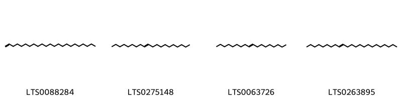{ group="compound" description="Cấu trúc hóa học của các hoạt chất thuộc nhóm *Unsaturated hydrocarbons* là 1-tricosene [(LTS0088284)](https://lotus.naturalproducts.net/compound/lotus_id/LTS0088284), icos-9-ene [(LTS0275148)](https://lotus.naturalproducts.net/compound/lotus_id/LTS0275148), octadec-9-ene [(LTS0063726)](https://lotus.naturalproducts.net/compound/lotus_id/LTS0063726), tricos-9-ene [(LTS0263895)](https://lotus.naturalproducts.net/compound/lotus_id/LTS0263895)." }

:::

---

## IV. Tác dụng dược lý

Theo tài liệu quốc tế: To check diarrhea and chronic cough, and to soothe the sore throat.

---

## V. Dược điển Việt Nam V

### Soi bột

nan

::: {#listing-soibot}
:::

### Vi phẫu

nan

::: {#listing-viphau}
:::

### Định tính

A. Ngâm 3 g bột dược liệu trong 30 ml nước, sau  3 h, lọc, được dung dịch A.  Lẩy 2 ml dung dịch A, thêm 1 giọt dung dịch sắt (III) clorid 5 % (TT), sẽ có tủa màu xanh da trời sẫm.  Lấy 2 ml dung dịch A, thêm 1 giọt thuốc thử gelatin – natri clorid (TT) sẽ có tùa màu trắng. B. Phương pháp sắc ký lớp mỏng (Phụ lục 5.4) Bản mỏng;: Silica gel G. Dung môi khai triển: Cloroform – ethyl acetat – acid formic (6:4:1). Dung dịch thử: 3 g bột dược liệu (loại bỏ hạt) thêm 10 ml ethanol 96 % (TT), siêu âm trong 20 min, sử dụng lớp dịch chiết ở trên làm dung dịch thử. Dung dịch chất đối chiếu: Hòa tan acid galic chuẩn trong  ethanol (TT) để được dung dịch có nồng độ 0,5 mg trong 1 ml. Dung dịch dược liệu đối chiếu: Hoặc nểu không có acid galic thì dùng 3 g bột Kha tử (mẫu chuẩn), tiến hành chiết như mô tả ở phần Dung dịch thử. Cách tiến hành: Chấm riêng biệt lên bản mỏng 3 μl mỗi dung dịch trên. Sau khi triển khai sắc ký, lấy bản mỏng ra, để khô ngoài không khí. Phun dung dịch sắt (III) clorid 2 % trong ethanol (TT). Quan sát dưới ảnh sáng thường. Trên sắc ký đồ của dung dịch thử phải cho các vết có cùng vị trí và màu sẳc với vết cùa acid galic trên sắc ký đồ của dung dịch chất đối chiếu, hoặc có các vết cùng màu sắc và Rf với các vết trên sắc ký đồ của dung dịch dược liệu đối chiếu.

### Định lượng

Chất chiết được trong dược liệu Không dưới 30,0 % tính theo dược liệu khô kiệt. Tiến hành theo phương chiết lạnh (Phụ lục 12.10), dùng nước làm dung môi.

### Thông tin khác 

- **Độ ẩm:** Không quá 13,0 % (Phụ lục 9.6, 1 g, 105 °C, 5 h).
- **Bảo quản:** Trong bao bì kín, để nơi khô.

## VI. Dược điển Hồng kong

::: {#listing-DDHK}
:::

---

## VII. Y dược học cổ truyền

::: {.callout-note title = "nan" }

**Tên vị thuốc:** nan

**Tính:** nan

**Vị:** nan

**Quy kinh:**  nan

**Công năng chủ trị:** Khô, toan, sáp, bình. Vào các kinh phế, đại trường.

**Phân loại theo thông tư:** Chỉ ho bình suyễn, hóa đàm

**Tác dụng theo y dược cổ truyền:** nan

**Chú ý:** nan

**Kiêng kỵ:** nan 

:::

::: {#listing-ViThuoc}
:::

