::: {.callout-note title = "Tóm tắt"}

Cây Diếp Cá có tên khoa học là Houttuynia cordata Thunb. thuộc họ Lá giấp (Saururaceae). Cây có nguồn gốc từ Assam, Bangladesh, Campuchia, Trung Quốc, Đông Himalaya, Hải Nam, Nhật Bản, Hàn Quốc, Việt Nam... Tại Việt Nam cây mọc hoang ở khắp nơi ẩm thấp. Trong y học cổ truyền, dùng để chữa bệnh viêm sưng tai giữa, sưng tắc tia sữa, đau mắt đỏ có tụ máu, trĩ lòi dom, thông tiểu, chữa bệnh mụn nhọt, kinh nguyệt không đều, thanh nhiệt, giải độc. Tác dụng dược lý của cây gồm: Lợi tiểu, thông tiểu; kháng virus, kháng viêm, kháng khuẩn, kích thích da, gây phồng, làm bền mao mạch, giảm đau.  Thành phần hoá học gồm có: Tinh dầu (thành phần chủ yếu là methylnonylceton (có mùi rất khó chịu), laurylaldehyd, caprylaldehyd và decanonyl acetaldehyd), Flavonoid (Quercitrin, isoquercitrin), Alkaloid (Cordalin), hoa và quả chứa chất isoquercitrin và không chứa quercetin. Độ tro trung bình là 11,4%, tro không tan trong HCl là 2,7%.

:::

## I. Thông tin về dược liệu 

::: {.panel-tabset}

### Định danh

- Dược liệu tiếng Việt: Diếp Cá - Phần Trên Mặt Đất
- Dược liệu tiếng Trung: 鱼腥草 (Yu Xing Cao)
- Dược liệu tiếng Anh: Houttuynia Cordata
- Dược liệu latin thông dụng: Herba Houttuyniae Cordatae
- Dược liệu latin kiểu DĐVN: *Pructus Momordicae Charantiae*
- Dược liệu latin kiểu DĐVN: *Houttuyniae Herba*
- Dược liệu latin kiểu thông tư: *nan*
- Bộ phận dùng: Phần Trên Mặt Đất (Herba)

### Mô tả dược liệu 

**Theo dược điển Việt nam V:** Thân hình trụ tròn hay dẹt, cong, dài 20 cm đến 35 cm, đường kính 2 mm đến 3 mm. Mặt ngoài màu vàng nâu nhạt, có vân dọc nhỏ và có mấu rõ. Các mấu ở gốc thân còn vết tích của rễ. Chất giòn, dễ gãy. Lá mọc so le, hình tim, đầu lá nhọn, phiến lá gấp cuộn lại, nhàu nát, cuống đính ở góc lá dài chừng 2 cm đến 3 cm, gốc cuống rộng thành bẹ mỏng. Mặt trên lá màu lục, vàng sẫm đến nâu sẫm. mặt dưới màu lục xám đến nâu xám. Cụm hoa là một bông dài 1 cm đến 3 cm, ờ đầu cành, màu nâu vàng nhạt, cuống dài 3 cm. Mùi tanh cá. Vị hơi chát, se. 
 
**Mô tả dược liệu theo thông tư chế biến dược liệu theo phương pháp cổ truyền:** nan

### Chế biến 

**Chế biến theo dược điển việt nam V**: Có thể thu hái lá quanh năm, nhưng tốt nhất là thu hái lá vào mùa hạ, khi cây xanh tốt có nhiều cụm qua. Lúc trời khô ráo cắt lấy phần trên mặt đất, loại bỏ gốc rễ, phơi hoặc sấy khô nhẹ. Bào chế Diếp cá Loại bỏ tạp chất, rửa sạch, cắt đoạn, phơi khô. 

**Chế biến theo thông tư:** nan

::: 

## II. Thông tin về thực vật

Dược liệu **Diếp Cá - Phần Trên Mặt Đất** từ bộ phận **Phần Trên Mặt Đất** từ loài *Houttuynia cordata*.

**Mô tả thực vật:** Cây diếp cá là một loại cỏ nhỏ, mọc lâu năm, ưa chỗ ẩm ướt có thân rễ mọc ngầm dưới đất. Rễ nhỏ mọc ở các đốt. Thân hình trụ tròn hay dẹt, dài 20 cm đến 35 cm, có lông hoặc ít lông, chất giòn dễ gãy. Lá mọc cách, hình tim, đầu lá hơi nhọn hay nhọn hẳn. Phiến lá gấp cuộn lại, cuống đính ở gốc lá dài 2-3cm. Hoa nhỏ màu vàng nhạt, không có bao hoa, mọc thành bóng, có 4 lá bắc màu trắng; trong toàn bộ bề ngoài của cụm hoa và lá bắc giống như một cây hoa đơn độc, toàn cây và có mùi tanh như cá. Hoa nở về mùa hạ vào các tháng 5-8.

*Tài liệu tham khảo:* Tài liệu khác 
Trong dược điển Việt nam, loài *Houttuynia cordata* được sử dụng làm dược liệu.

            
::: {.callout-note title = "Phân loại thực vật của *Houttuynia cordata*"}

**Kingdom:** Plantae 

**Phylum:** Tracheophyta 

**Order:** Piperales 
 
**Family:** Saururaceae 
 
**Genus:** Houttuynia 
 
**Species:** *Houttuynia cordata* 
 

:::

::: {style="display: grid;grid-template-columns: repeat(auto-fill, minmax(150px, 1fr));grid-gap: 1em;"}
{ group="GIBF" }

{ group="GIBF" }

{ group="GIBF" }

{ group="GIBF" }

{ group="GIBF" }

{ group="GIBF" }

{ group="GIBF" }

{ group="GIBF" }

{ group="GIBF" }

{ group="GIBF" }
:::

**Phân bố trên thế giới:** Germany, United States of America, Chinese Taipei, China, Hong Kong, United Kingdom of Great Britain and Northern Ireland, New Zealand, Brazil, Japan, Nepal, Australia, Netherlands, Macao, India, Costa Rica, Viet Nam, Belgium

**Phân bố tại Việt nam:** Quảng Nam

<iframe src="Herba Houttuyniae Cordatae/map_distribution.html" width="100%" height="600" style="border:none;"></iframe>

## III. Thành phần hóa học

Theo tài liệu của GS. Đỗ Tất Lợi:  (1) Tinh dầu; Flavonoid; Alkaloid
(2) Tinh dầu: Thành phần chủ yếu là methylnonylceton, laurylaldehyd, caprylaldehyd và decanonyl acetaldehyd.
Flavonoid: Quercitrin, isoquercitrin 
Alkaloid: Cordalin
    

Theo cơ sở dữ liệu lotus, loài *Houttuynia cordata* đã phân lập và xác định được **156** hoạt chất thuộc về các nhóm Cinnamic acids and derivatives, Aporphines, Carboxylic acids and derivatives, Epoxides, Aristolactams, Organooxygen compounds, Benzene and substituted derivatives, Indoles and derivatives, Prenol lipids, Furanoid lignans, Tannins, Steroids and steroid derivatives, Quinolines and derivatives, Polycyclic hydrocarbons, Fatty Acyls, Diazanaphthalenes, Flavonoids, Heteroaromatic compounds, Saturated hydrocarbons, Phenols, Amaryllidaceae alkaloids, Unsaturated hydrocarbons trong bảng dưới đây.
        
| chemicalTaxonomyClassyfireClass     |   smiles_count |
|:------------------------------------|---------------:|
| Amaryllidaceae alkaloids            |             33 |
| Aporphines                          |            226 |
| Aristolactams                       |            131 |
| Benzene and substituted derivatives |            187 |
| Carboxylic acids and derivatives    |             32 |
| Cinnamic acids and derivatives      |            127 |
| Diazanaphthalenes                   |            111 |
| Epoxides                            |             68 |
| Fatty Acyls                         |            600 |
| Flavonoids                          |            579 |
| Furanoid lignans                    |            106 |
| Heteroaromatic compounds            |             16 |
| Indoles and derivatives             |             22 |
| Organooxygen compounds              |            395 |
| Phenols                             |             62 |
| Polycyclic hydrocarbons             |             54 |
| Prenol lipids                       |           1217 |
| Quinolines and derivatives          |             15 |
| Saturated hydrocarbons              |             12 |
| Steroids and steroid derivatives    |            854 |
| Tannins                             |            134 |
| Unsaturated hydrocarbons            |             56 |

Danh sách chi tiết các hoạt chất như sau: 

::: {style="display: grid;grid-template-columns: repeat(auto-fill, minmax(150px, 1fr));grid-gap: 1em;"}

                                                              
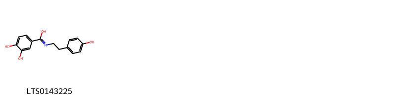{ group="compound" description="Cấu trúc hóa học của các hoạt chất thuộc nhóm *Amaryllidaceae alkaloids* là 3,4-dihydroxy-n-[2-(4-hydroxyphenyl)ethyl]benzenecarboximidic acid [(LTS0143225)](https://lotus.naturalproducts.net/compound/lotus_id/LTS0143225)." }

                                                              
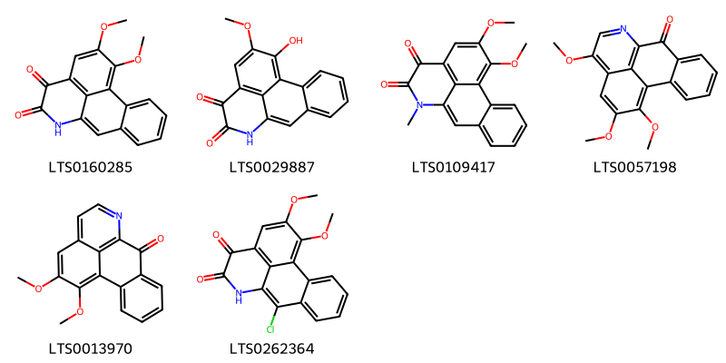{ group="compound" description="Cấu trúc hóa học của các hoạt chất thuộc nhóm *Aporphines* là 15,16-dimethoxy-10-azatetracyclo[7.7.1.0²,⁷.0¹³,¹⁷]heptadeca-1(17),2(7),3,5,8,13,15-heptaene-11,12-dione [(LTS0160285)](https://lotus.naturalproducts.net/compound/lotus_id/LTS0160285), 16-hydroxy-15-methoxy-10-azatetracyclo[7.7.1.0²,⁷.0¹³,¹⁷]heptadeca-1(17),2(7),3,5,8,13,15-heptaene-11,12-dione [(LTS0029887)](https://lotus.naturalproducts.net/compound/lotus_id/LTS0029887), 15,16-dimethoxy-10-methyl-10-azatetracyclo[7.7.1.0²,⁷.0¹³,¹⁷]heptadeca-1(17),2(7),3,5,8,13,15-heptaene-11,12-dione [(LTS0109417)](https://lotus.naturalproducts.net/compound/lotus_id/LTS0109417), 12,15,16-trimethoxy-10-azatetracyclo[7.7.1.0²,⁷.0¹³,¹⁷]heptadeca-1(16),2,4,6,9(17),10,12,14-octaen-8-one [(LTS0057198)](https://lotus.naturalproducts.net/compound/lotus_id/LTS0057198), lysicamine [(LTS0013970)](https://lotus.naturalproducts.net/compound/lotus_id/LTS0013970), 8-chloro-15,16-dimethoxy-10-azatetracyclo[7.7.1.0²,⁷.0¹³,¹⁷]heptadeca-1(17),2(7),3,5,8,13,15-heptaene-11,12-dione [(LTS0262364)](https://lotus.naturalproducts.net/compound/lotus_id/LTS0262364)." }

                                                              
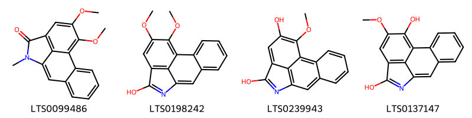{ group="compound" description="Cấu trúc hóa học của các hoạt chất thuộc nhóm *Aristolactams* là 14,15-dimethoxy-10-methyl-10-azatetracyclo[7.6.1.0²,⁷.0¹²,¹⁶]hexadeca-1(16),2(7),3,5,8,12,14-heptaen-11-one [(LTS0099486)](https://lotus.naturalproducts.net/compound/lotus_id/LTS0099486), 14,15-dimethoxy-10-azatetracyclo[7.6.1.0²,⁷.0¹²,¹⁶]hexadeca-1(16),2(7),3,5,8,10,12,14-octaen-11-ol [(LTS0198242)](https://lotus.naturalproducts.net/compound/lotus_id/LTS0198242), 15-methoxy-10-azatetracyclo[7.6.1.0²,⁷.0¹²,¹⁶]hexadeca-1(16),2(7),3,5,8,10,12,14-octaene-11,14-diol [(LTS0239943)](https://lotus.naturalproducts.net/compound/lotus_id/LTS0239943), 14-methoxy-10-azatetracyclo[7.6.1.0²,⁷.0¹²,¹⁶]hexadeca-1(16),2(7),3,5,8,10,12,14-octaene-11,15-diol [(LTS0137147)](https://lotus.naturalproducts.net/compound/lotus_id/LTS0137147)." }

                                                              
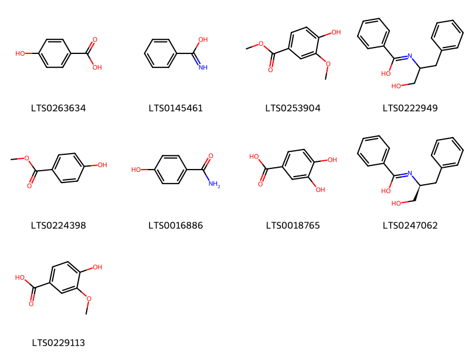{ group="compound" description="Cấu trúc hóa học của các hoạt chất thuộc nhóm *Benzene and substituted derivatives* là p-hydroxybenzoic acid [(LTS0263634)](https://lotus.naturalproducts.net/compound/lotus_id/LTS0263634), α-toluimidic acid [(LTS0145461)](https://lotus.naturalproducts.net/compound/lotus_id/LTS0145461), vanillate [(LTS0253904)](https://lotus.naturalproducts.net/compound/lotus_id/LTS0253904), n-(1-hydroxy-3-phenylpropan-2-yl)benzenecarboximidic acid [(LTS0222949)](https://lotus.naturalproducts.net/compound/lotus_id/LTS0222949), paraben [(LTS0224398)](https://lotus.naturalproducts.net/compound/lotus_id/LTS0224398), 4-hydroxybenzamide [(LTS0016886)](https://lotus.naturalproducts.net/compound/lotus_id/LTS0016886), 3,4-dihydroxybenzoic acid [(LTS0018765)](https://lotus.naturalproducts.net/compound/lotus_id/LTS0018765), n-[(2s)-1-hydroxy-3-phenylpropan-2-yl]benzenecarboximidic acid [(LTS0247062)](https://lotus.naturalproducts.net/compound/lotus_id/LTS0247062), vanillic acid [(LTS0229113)](https://lotus.naturalproducts.net/compound/lotus_id/LTS0229113)." }

                                                              
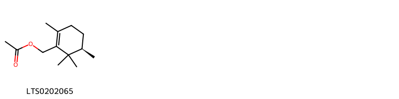{ group="compound" description="Cấu trúc hóa học của các hoạt chất thuộc nhóm *Carboxylic acids and derivatives* là [(5r)-2,5,6,6-tetramethylcyclohex-1-en-1-yl]methyl acetate [(LTS0202065)](https://lotus.naturalproducts.net/compound/lotus_id/LTS0202065)." }

                                                              
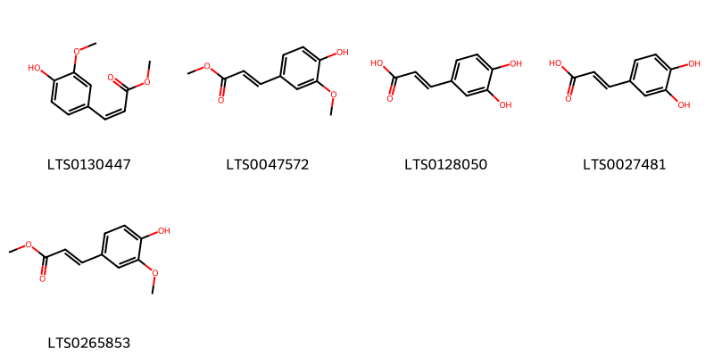{ group="compound" description="Cấu trúc hóa học của các hoạt chất thuộc nhóm *Cinnamic acids and derivatives* là (z)-methyl ferulate [(LTS0130447)](https://lotus.naturalproducts.net/compound/lotus_id/LTS0130447), methyl ferulate [(LTS0047572)](https://lotus.naturalproducts.net/compound/lotus_id/LTS0047572), 3,4-dihydroxycinnamic acid [(LTS0128050)](https://lotus.naturalproducts.net/compound/lotus_id/LTS0128050), caffeic acid [(LTS0027481)](https://lotus.naturalproducts.net/compound/lotus_id/LTS0027481), methyl ferulate [(LTS0265853)](https://lotus.naturalproducts.net/compound/lotus_id/LTS0265853)." }

                                                              
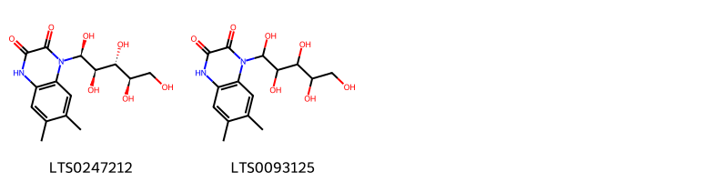{ group="compound" description="Cấu trúc hóa học của các hoạt chất thuộc nhóm *Diazanaphthalenes* là 6,7-dimethyl-1-[(1s,2r,3r,4r)-1,2,3,4,5-pentahydroxypentyl]-4h-quinoxaline-2,3-dione [(LTS0247212)](https://lotus.naturalproducts.net/compound/lotus_id/LTS0247212), 6,7-dimethyl-1-(1,2,3,4,5-pentahydroxypentyl)-4h-quinoxaline-2,3-dione [(LTS0093125)](https://lotus.naturalproducts.net/compound/lotus_id/LTS0093125)." }

                                                              
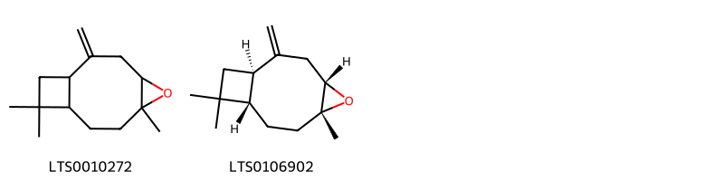{ group="compound" description="Cấu trúc hóa học của các hoạt chất thuộc nhóm *Epoxides* là 6,10,10-trimethyl-2-methylidene-5-oxatricyclo[7.2.0.0⁴,⁶]undecane [(LTS0010272)](https://lotus.naturalproducts.net/compound/lotus_id/LTS0010272), (1r,4s,6r,9s)-6,10,10-trimethyl-2-methylidene-5-oxatricyclo[7.2.0.0⁴,⁶]undecane [(LTS0106902)](https://lotus.naturalproducts.net/compound/lotus_id/LTS0106902)." }

                                                              
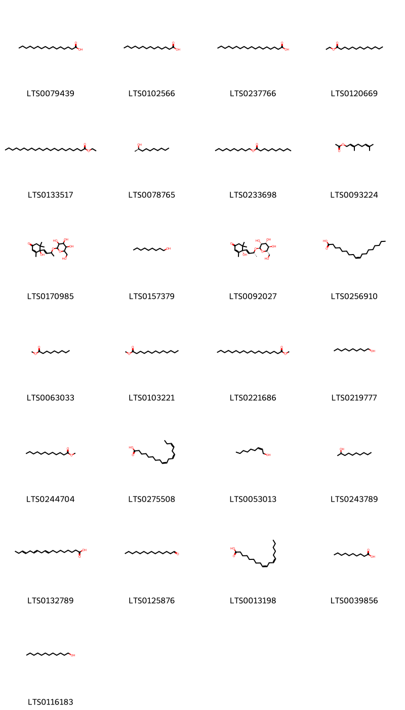{ group="compound" description="Cấu trúc hóa học của các hoạt chất thuộc nhóm *Fatty Acyls* là palmitic acid [(LTS0079439)](https://lotus.naturalproducts.net/compound/lotus_id/LTS0079439), myristic acid [(LTS0102566)](https://lotus.naturalproducts.net/compound/lotus_id/LTS0102566), stearic acid [(LTS0237766)](https://lotus.naturalproducts.net/compound/lotus_id/LTS0237766), ethyl tridecanoate [(LTS0120669)](https://lotus.naturalproducts.net/compound/lotus_id/LTS0120669), ethyl behenate [(LTS0133517)](https://lotus.naturalproducts.net/compound/lotus_id/LTS0133517), (2r)-decan-2-ol [(LTS0078765)](https://lotus.naturalproducts.net/compound/lotus_id/LTS0078765), capryl caprate [(LTS0233698)](https://lotus.naturalproducts.net/compound/lotus_id/LTS0233698), geranyl acetate [(LTS0093224)](https://lotus.naturalproducts.net/compound/lotus_id/LTS0093224), 4-hydroxy-3,5,5-trimethyl-4-(3-{[3,4,5-trihydroxy-6-(hydroxymethyl)oxan-2-yl]oxy}but-1-en-1-yl)cyclohex-2-en-1-one [(LTS0170985)](https://lotus.naturalproducts.net/compound/lotus_id/LTS0170985), nonan-1-ol [(LTS0157379)](https://lotus.naturalproducts.net/compound/lotus_id/LTS0157379), (4s)-4-hydroxy-3,5,5-trimethyl-4-[(1e,3r)-3-{[(2r,3r,4r,5r,6s)-3,4,5-trihydroxy-6-(hydroxymethyl)oxan-2-yl]oxy}but-1-en-1-yl]cyclohex-2-en-1-one [(LTS0092027)](https://lotus.naturalproducts.net/compound/lotus_id/LTS0092027), oleic acid [(LTS0256910)](https://lotus.naturalproducts.net/compound/lotus_id/LTS0256910), methyl nonanoate (ester) [(LTS0063033)](https://lotus.naturalproducts.net/compound/lotus_id/LTS0063033), methyl cocoate [(LTS0103221)](https://lotus.naturalproducts.net/compound/lotus_id/LTS0103221), methyl stearate [(LTS0221686)](https://lotus.naturalproducts.net/compound/lotus_id/LTS0221686), decanol [(LTS0219777)](https://lotus.naturalproducts.net/compound/lotus_id/LTS0219777), methyl laurate [(LTS0244704)](https://lotus.naturalproducts.net/compound/lotus_id/LTS0244704), α-linolenic acid [(LTS0275508)](https://lotus.naturalproducts.net/compound/lotus_id/LTS0275508), (2z)-non-2-en-1-ol [(LTS0053013)](https://lotus.naturalproducts.net/compound/lotus_id/LTS0053013), decan-2-ol [(LTS0243789)](https://lotus.naturalproducts.net/compound/lotus_id/LTS0243789), α linolenic acid [(LTS0132789)](https://lotus.naturalproducts.net/compound/lotus_id/LTS0132789), tetradecanal [(LTS0125876)](https://lotus.naturalproducts.net/compound/lotus_id/LTS0125876), linoleic [(LTS0013198)](https://lotus.naturalproducts.net/compound/lotus_id/LTS0013198), capric acid [(LTS0039856)](https://lotus.naturalproducts.net/compound/lotus_id/LTS0039856), 1-dodecanol [(LTS0116183)](https://lotus.naturalproducts.net/compound/lotus_id/LTS0116183)." }

                                                              
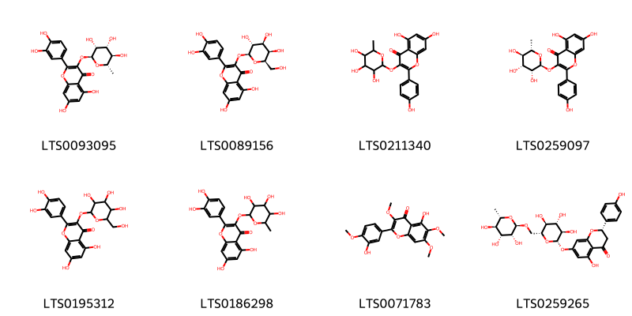{ group="compound" description="Cấu trúc hóa học của các hoạt chất thuộc nhóm *Flavonoids* là quercitrin [(LTS0093095)](https://lotus.naturalproducts.net/compound/lotus_id/LTS0093095), hyperoside [(LTS0089156)](https://lotus.naturalproducts.net/compound/lotus_id/LTS0089156), 5,7-dihydroxy-2-(4-hydroxyphenyl)-3-[(3,4,5-trihydroxy-6-methyloxan-2-yl)oxy]chromen-4-one [(LTS0211340)](https://lotus.naturalproducts.net/compound/lotus_id/LTS0211340), afzelin [(LTS0259097)](https://lotus.naturalproducts.net/compound/lotus_id/LTS0259097), 2-(3,4-dihydroxyphenyl)-5,7-dihydroxy-3-{[3,4,5-trihydroxy-6-(hydroxymethyl)oxan-2-yl]oxy}chromen-4-one [(LTS0195312)](https://lotus.naturalproducts.net/compound/lotus_id/LTS0195312), quercitrin [(LTS0186298)](https://lotus.naturalproducts.net/compound/lotus_id/LTS0186298), casticin [(LTS0071783)](https://lotus.naturalproducts.net/compound/lotus_id/LTS0071783), narirutin [(LTS0259265)](https://lotus.naturalproducts.net/compound/lotus_id/LTS0259265)." }

                                                              
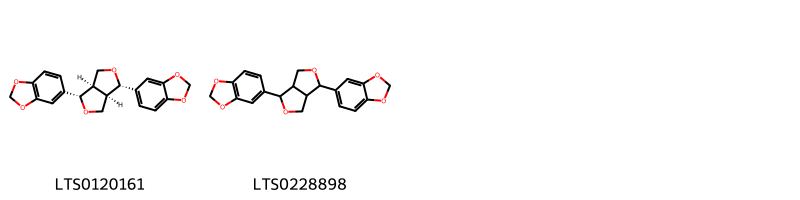{ group="compound" description="Cấu trúc hóa học của các hoạt chất thuộc nhóm *Furanoid lignans* là sesamin [(LTS0120161)](https://lotus.naturalproducts.net/compound/lotus_id/LTS0120161), sesamin [(LTS0228898)](https://lotus.naturalproducts.net/compound/lotus_id/LTS0228898)." }

                                                              
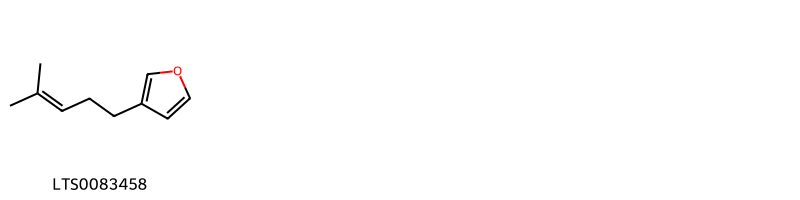{ group="compound" description="Cấu trúc hóa học của các hoạt chất thuộc nhóm *Heteroaromatic compounds* là perillene [(LTS0083458)](https://lotus.naturalproducts.net/compound/lotus_id/LTS0083458)." }

                                                              
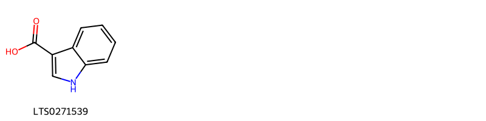{ group="compound" description="Cấu trúc hóa học của các hoạt chất thuộc nhóm *Indoles and derivatives* là indole - 3 carboxylic acid [(LTS0271539)](https://lotus.naturalproducts.net/compound/lotus_id/LTS0271539)." }

                                                              
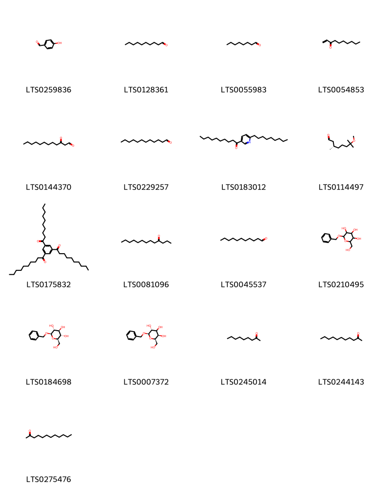{ group="compound" description="Cấu trúc hóa học của các hoạt chất thuộc nhóm *Organooxygen compounds* là p-hydroxybenzaldehyde [(LTS0259836)](https://lotus.naturalproducts.net/compound/lotus_id/LTS0259836), decanal [(LTS0128361)](https://lotus.naturalproducts.net/compound/lotus_id/LTS0128361), octanal [(LTS0055983)](https://lotus.naturalproducts.net/compound/lotus_id/LTS0055983), dec-1-en-3-one [(LTS0054853)](https://lotus.naturalproducts.net/compound/lotus_id/LTS0054853), decanoyl acetaldehyde [(LTS0144370)](https://lotus.naturalproducts.net/compound/lotus_id/LTS0144370), dodecanal [(LTS0229257)](https://lotus.naturalproducts.net/compound/lotus_id/LTS0229257), 1-(6-nonylpyridin-3-yl)decan-1-one [(LTS0183012)](https://lotus.naturalproducts.net/compound/lotus_id/LTS0183012), (3s)-7-methoxy-3,7-dimethyloctanal [(LTS0114497)](https://lotus.naturalproducts.net/compound/lotus_id/LTS0114497), 1-[3,5-bis(decanoyl)phenyl]decan-1-one [(LTS0175832)](https://lotus.naturalproducts.net/compound/lotus_id/LTS0175832), tridecan-4-one [(LTS0081096)](https://lotus.naturalproducts.net/compound/lotus_id/LTS0081096), aldehyde c11 [(LTS0045537)](https://lotus.naturalproducts.net/compound/lotus_id/LTS0045537), benzyl glucopyranoside [(LTS0210495)](https://lotus.naturalproducts.net/compound/lotus_id/LTS0210495), benzyl β-d-glucoside [(LTS0184698)](https://lotus.naturalproducts.net/compound/lotus_id/LTS0184698), (2r,3r,5r,6r)-2-(benzyloxy)-6-(hydroxymethyl)oxane-3,4,5-triol [(LTS0007372)](https://lotus.naturalproducts.net/compound/lotus_id/LTS0007372), 2-nonanone [(LTS0245014)](https://lotus.naturalproducts.net/compound/lotus_id/LTS0245014), undecan-2-one [(LTS0244143)](https://lotus.naturalproducts.net/compound/lotus_id/LTS0244143), lauron [(LTS0275476)](https://lotus.naturalproducts.net/compound/lotus_id/LTS0275476)." }

                                                              
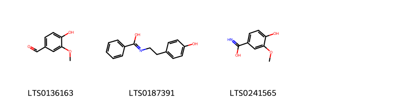{ group="compound" description="Cấu trúc hóa học của các hoạt chất thuộc nhóm *Phenols* là vanillin [(LTS0136163)](https://lotus.naturalproducts.net/compound/lotus_id/LTS0136163), n-[2-(4-hydroxyphenyl)ethyl]benzenecarboximidic acid [(LTS0187391)](https://lotus.naturalproducts.net/compound/lotus_id/LTS0187391), 4-hydroxy-3-methoxybenzenecarboximidic acid [(LTS0241565)](https://lotus.naturalproducts.net/compound/lotus_id/LTS0241565)." }

                                                              
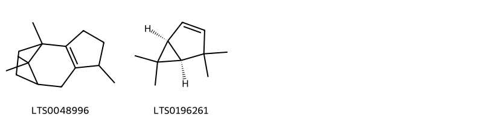{ group="compound" description="Cấu trúc hóa học của các hoạt chất thuộc nhóm *Polycyclic hydrocarbons* là 1,5,11,11-tetramethyltricyclo[6.2.1.0²,⁶]undec-2(6)-ene [(LTS0048996)](https://lotus.naturalproducts.net/compound/lotus_id/LTS0048996), (1s)-4,4,6,6-tetramethylbicyclo[3.1.0]hex-2-ene [(LTS0196261)](https://lotus.naturalproducts.net/compound/lotus_id/LTS0196261)." }

                                                              
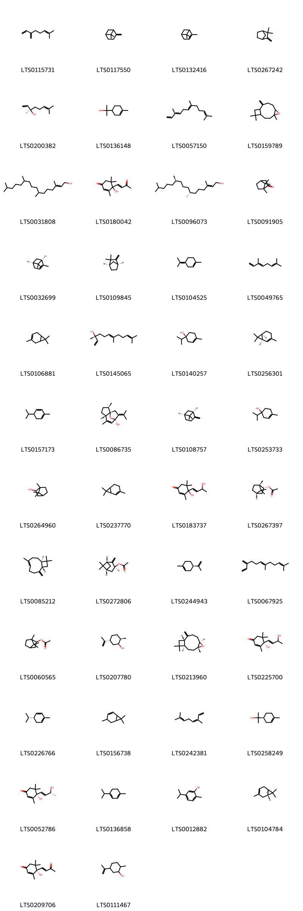{ group="compound" description="Cấu trúc hóa học của các hoạt chất thuộc nhóm *Prenol lipids* là α-myrcene [(LTS0115731)](https://lotus.naturalproducts.net/compound/lotus_id/LTS0115731), β-pinene [(LTS0117550)](https://lotus.naturalproducts.net/compound/lotus_id/LTS0117550), α pinene [(LTS0132416)](https://lotus.naturalproducts.net/compound/lotus_id/LTS0132416), camphene [(LTS0267242)](https://lotus.naturalproducts.net/compound/lotus_id/LTS0267242), (-)-linalool [(LTS0200382)](https://lotus.naturalproducts.net/compound/lotus_id/LTS0200382), terpineol [(LTS0136148)](https://lotus.naturalproducts.net/compound/lotus_id/LTS0136148), farnesene [(LTS0057150)](https://lotus.naturalproducts.net/compound/lotus_id/LTS0057150), caryophyllene oxide [(LTS0159789)](https://lotus.naturalproducts.net/compound/lotus_id/LTS0159789), phytol [(LTS0031808)](https://lotus.naturalproducts.net/compound/lotus_id/LTS0031808), 4-hydroxy-3,5,5-trimethyl-4-(3-oxobut-1-en-1-yl)cyclohex-2-en-1-one [(LTS0180042)](https://lotus.naturalproducts.net/compound/lotus_id/LTS0180042), phytol [(LTS0096073)](https://lotus.naturalproducts.net/compound/lotus_id/LTS0096073), camphor [(LTS0091905)](https://lotus.naturalproducts.net/compound/lotus_id/LTS0091905), (-)-α-pinene [(LTS0032699)](https://lotus.naturalproducts.net/compound/lotus_id/LTS0032699), (+)-camphene [(LTS0109845)](https://lotus.naturalproducts.net/compound/lotus_id/LTS0109845), terpinolene [(LTS0104525)](https://lotus.naturalproducts.net/compound/lotus_id/LTS0104525), trans-β-ocimene [(LTS0049765)](https://lotus.naturalproducts.net/compound/lotus_id/LTS0049765), monoterpenes [(LTS0106881)](https://lotus.naturalproducts.net/compound/lotus_id/LTS0106881), (3r,6e)-nerolidol [(LTS0145065)](https://lotus.naturalproducts.net/compound/lotus_id/LTS0145065), (+)-4-terpineol [(LTS0140257)](https://lotus.naturalproducts.net/compound/lotus_id/LTS0140257), (1r,6s)-3,7,7-trimethylbicyclo[4.1.0]hept-2-ene [(LTS0256301)](https://lotus.naturalproducts.net/compound/lotus_id/LTS0256301), phellandrene [(LTS0157173)](https://lotus.naturalproducts.net/compound/lotus_id/LTS0157173), (1s,2r,5s,8r)-2,6-dimethyl-9-(propan-2-ylidene)-11-oxatricyclo[6.2.1.0¹,⁵]undec-6-en-8-ol [(LTS0086735)](https://lotus.naturalproducts.net/compound/lotus_id/LTS0086735), (-)-β-pinene [(LTS0108757)](https://lotus.naturalproducts.net/compound/lotus_id/LTS0108757), 4-terpineol [(LTS0253733)](https://lotus.naturalproducts.net/compound/lotus_id/LTS0253733), borneol [(LTS0264960)](https://lotus.naturalproducts.net/compound/lotus_id/LTS0264960), 3,7,7-trimethylbicyclo[4.1.0]hept-2-ene [(LTS0237770)](https://lotus.naturalproducts.net/compound/lotus_id/LTS0237770), 4-hydroxy-4-(3-hydroxybut-1-en-1-yl)-3,5,5-trimethylcyclohex-2-en-1-one [(LTS0183737)](https://lotus.naturalproducts.net/compound/lotus_id/LTS0183737), (-)-bornyl acetate [(LTS0267397)](https://lotus.naturalproducts.net/compound/lotus_id/LTS0267397), caryophyllene [(LTS0085212)](https://lotus.naturalproducts.net/compound/lotus_id/LTS0085212), (1r,3s,5r)-6,6-dimethyl-2-methylidenebicyclo[3.1.1]heptan-3-yl acetate [(LTS0272806)](https://lotus.naturalproducts.net/compound/lotus_id/LTS0272806), α-limonene [(LTS0244943)](https://lotus.naturalproducts.net/compound/lotus_id/LTS0244943), β-farnesene [(LTS0067925)](https://lotus.naturalproducts.net/compound/lotus_id/LTS0067925), bornyl acetate [(LTS0060565)](https://lotus.naturalproducts.net/compound/lotus_id/LTS0060565), (+)-neodihydrocarveol [(LTS0207780)](https://lotus.naturalproducts.net/compound/lotus_id/LTS0207780), β-caryophyllene oxide [(LTS0213960)](https://lotus.naturalproducts.net/compound/lotus_id/LTS0213960), (4s)-4-hydroxy-4-(3-hydroxybut-1-en-1-yl)-3,5,5-trimethylcyclohex-2-en-1-one [(LTS0225700)](https://lotus.naturalproducts.net/compound/lotus_id/LTS0225700), (-)-α-phellandrene [(LTS0226766)](https://lotus.naturalproducts.net/compound/lotus_id/LTS0226766), 4,7,7-trimethylbicyclo[4.1.0]hept-2-ene [(LTS0156738)](https://lotus.naturalproducts.net/compound/lotus_id/LTS0156738), β-ocimene [(LTS0242381)](https://lotus.naturalproducts.net/compound/lotus_id/LTS0242381), (+)-α-terpineol [(LTS0258249)](https://lotus.naturalproducts.net/compound/lotus_id/LTS0258249), (6s,9r)-vomifoliol [(LTS0052786)](https://lotus.naturalproducts.net/compound/lotus_id/LTS0052786), terpinene [(LTS0136858)](https://lotus.naturalproducts.net/compound/lotus_id/LTS0136858), carvacrol [(LTS0012882)](https://lotus.naturalproducts.net/compound/lotus_id/LTS0012882), (-)-delta(3)-carene [(LTS0104784)](https://lotus.naturalproducts.net/compound/lotus_id/LTS0104784), dehydrovomifoliol [(LTS0209706)](https://lotus.naturalproducts.net/compound/lotus_id/LTS0209706), dihydrocarveol [(LTS0111467)](https://lotus.naturalproducts.net/compound/lotus_id/LTS0111467)." }

                                                              
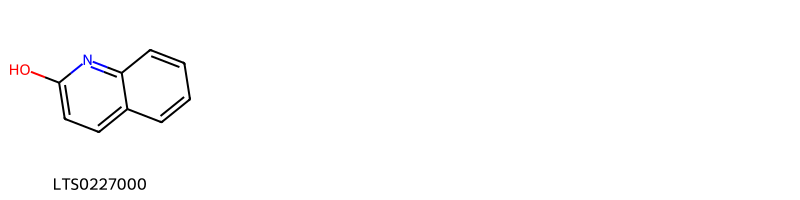{ group="compound" description="Cấu trúc hóa học của các hoạt chất thuộc nhóm *Quinolines and derivatives* là α-hydroxyquinoline [(LTS0227000)](https://lotus.naturalproducts.net/compound/lotus_id/LTS0227000)." }

                                                              
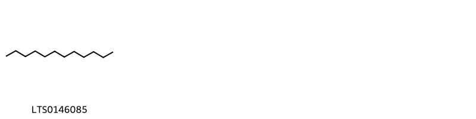{ group="compound" description="Cấu trúc hóa học của các hoạt chất thuộc nhóm *Saturated hydrocarbons* là dodecane [(LTS0146085)](https://lotus.naturalproducts.net/compound/lotus_id/LTS0146085)." }

                                                              
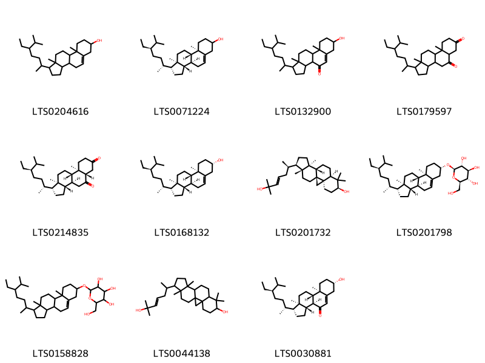{ group="compound" description="Cấu trúc hóa học của các hoạt chất thuộc nhóm *Steroids and steroid derivatives* là stigmast-5-en-3-ol, (3β)- [(LTS0204616)](https://lotus.naturalproducts.net/compound/lotus_id/LTS0204616), stigmast-5-en-3-ol [(LTS0071224)](https://lotus.naturalproducts.net/compound/lotus_id/LTS0071224), 1-(5-ethyl-6-methylheptan-2-yl)-7-hydroxy-9a,11a-dimethyl-1h,2h,3h,3ah,3bh,6h,7h,8h,9h,9bh,10h,11h-cyclopenta[a]phenanthren-4-one [(LTS0132900)](https://lotus.naturalproducts.net/compound/lotus_id/LTS0132900), 1-(5-ethyl-6-methylheptan-2-yl)-9a,11a-dimethyl-dodecahydro-1h-cyclopenta[a]phenanthrene-5,7-dione [(LTS0179597)](https://lotus.naturalproducts.net/compound/lotus_id/LTS0179597), (1r,3as,3bs,5as,9ar,9bs,11ar)-1-[(2r,5r)-5-ethyl-6-methylheptan-2-yl]-9a,11a-dimethyl-dodecahydro-1h-cyclopenta[a]phenanthrene-5,7-dione [(LTS0214835)](https://lotus.naturalproducts.net/compound/lotus_id/LTS0214835), sitosterol [(LTS0168132)](https://lotus.naturalproducts.net/compound/lotus_id/LTS0168132), cycloart-23-ene-3β,25-diol [(LTS0201732)](https://lotus.naturalproducts.net/compound/lotus_id/LTS0201732), sitogluside [(LTS0201798)](https://lotus.naturalproducts.net/compound/lotus_id/LTS0201798), 2-{[1-(5-ethyl-6-methylheptan-2-yl)-9a,11a-dimethyl-1h,2h,3h,3ah,3bh,4h,6h,7h,8h,9h,9bh,10h,11h-cyclopenta[a]phenanthren-7-yl]oxy}-6-(hydroxymethyl)oxane-3,4,5-triol [(LTS0158828)](https://lotus.naturalproducts.net/compound/lotus_id/LTS0158828), 15-(6-hydroxy-6-methylhept-4-en-2-yl)-7,7,12,16-tetramethylpentacyclo[9.7.0.0¹,³.0³,⁸.0¹²,¹⁶]octadecan-6-ol [(LTS0044138)](https://lotus.naturalproducts.net/compound/lotus_id/LTS0044138), (1r,3as,3bs,7s,9ar,9bs,11ar)-1-[(2r,5r)-5-ethyl-6-methylheptan-2-yl]-7-hydroxy-9a,11a-dimethyl-1h,2h,3h,3ah,3bh,6h,7h,8h,9h,9bh,10h,11h-cyclopenta[a]phenanthren-4-one [(LTS0030881)](https://lotus.naturalproducts.net/compound/lotus_id/LTS0030881)." }

                                                              
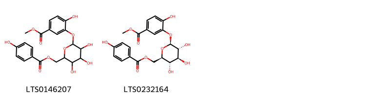{ group="compound" description="Cấu trúc hóa học của các hoạt chất thuộc nhóm *Tannins* là methyl 4-hydroxy-3-({3,4,5-trihydroxy-6-[(4-hydroxybenzoyloxy)methyl]oxan-2-yl}oxy)benzoate [(LTS0146207)](https://lotus.naturalproducts.net/compound/lotus_id/LTS0146207), methyl 4-hydroxy-3-{[(2s,3r,4s,5s,6r)-3,4,5-trihydroxy-6-[(4-hydroxybenzoyloxy)methyl]oxan-2-yl]oxy}benzoate [(LTS0232164)](https://lotus.naturalproducts.net/compound/lotus_id/LTS0232164)." }

                                                              
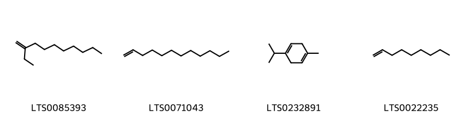{ group="compound" description="Cấu trúc hóa học của các hoạt chất thuộc nhóm *Unsaturated hydrocarbons* là 3-methylideneundecane [(LTS0085393)](https://lotus.naturalproducts.net/compound/lotus_id/LTS0085393), 1-dodecene [(LTS0071043)](https://lotus.naturalproducts.net/compound/lotus_id/LTS0071043), α terpinene [(LTS0232891)](https://lotus.naturalproducts.net/compound/lotus_id/LTS0232891), nonene [(LTS0022235)](https://lotus.naturalproducts.net/compound/lotus_id/LTS0022235)." }

:::

---

## IV. Tác dụng dược lý

Theo tài liệu quốc tế: To remove toxic heat, to promote the drainage of pus, and to relieve dysuria.

---

## V. Dược điển Việt Nam V

### Soi bột

Màu lục vàng, vị hơi mặn, hơi cay, mùi tanh. Mảnh biểu bì trên và biểu bì dưới gồm các tế bào hình nhiều cạnh, thành hơi dày, mang tế bào tiết. Biểu bì dưới có lỗ khí, tế bào tiết tròn, chứa tinh dầu màu vàng nhạt hay vàng nâu, bề mặt có vân, xung quanh có 5 đến 6 tế bào xếp tỏa ra. Lỗ khí có 4 đến 5 tế bào kèm nhỏ hơn. Lông che chở đa bào và tế bào tiết. Hạt tinh bột hình trứng, có khi tròn hay hình chuông dài 40 pm, rộng khoảng 36 pm. Mảnh thân gồm các tế bào hình chữ nhật thành mỏng và tế bào tiết. Mảnh mạch xoắn.

::: {#listing-soibot}
:::

### Vi phẫu

Biểu bì trên và dưới của lá gồm 1 lớp tế bào hình chữ nhật, xếp đều đặn, mang lông tiết đầu đơn bào, chân đa bào và lông che chở đa bào có xen lẫn tế bào tiết màu vàng ở mặt trên gân lá. ở mặt dưới phiến lá có lỗ khí. Hạ bì trên từ phiên lá chạy qua gân giữa gồm một lớp tế bào to, thành mỏng. Hạ bì dưới tế bào bé hơn, bị ngăn cách bởi một số tế bào mô mềm ở giữa gân lá. Mô mềm gồm các tế bào thành mỏng và ít khuyết nhỏ. Bó libe-gỗ ở giữa gân lá gồm có bó gỗ ờ trên, bó libe ờ dưới. Mô mềm phiến lá có những khuyết nhỏ và bó libe-gỗ nhỏ.

::: {#listing-viphau}
:::

### Định tính

A. Quan sát dưới ánh sáng tử ngoại (366 nm), thân và bột lá phát quang màu nâu hung. B. Cho 1 g bột dược liệu vào ống nghiệm, dùng đũa thủy tinh ấn chặt xuống, thêm vài giọt dung dịch fuchsin đã khử màu để làm ướt bột ờ phía trên, để yên một lúc. Nhìn qua ống nghiệm thấy bột ướt có màu hồng hoặc màu tím đỏ. c. Lấy 1 g bột dược liệu, thêm 10 ml ethanol (TT), đun hồi lưu trên cách thủy 10 min, lọc. Lấy 2 ml dịch lọc, thêm ít bột magnesi (TT) và 3 giọt acid hydrocloric (TT), đun nóng trên cách thủy, sẽ xuất hiện màu đỏ.

### Định lượng

Chất chiết được trong dược liệu Không ít hơn 11,0 % tính theo dược liệu khô kiệt. Tiến hành theo phương pháp chiết nóng (Phụ lục 12.10). Dùng ethanol 96 % (TT) làm dung môi.nĐịnh lượng Diếp cá Tiến hành theo phương pháp định lượng tinh dầu trong dược liệu (Phụ lục 12.7). Dược liệu phải chứa ít nhất 0,08 % tinh dầu tính theo dược liệu khô kiệt.

### Thông tin khác 

- **Độ ẩm:** Không quá 13,0 % đối với dược liệu khô (Phụ lục 12.13).
- **Bảo quản:** Nơi khô mát.

## VI. Dược điển Hồng kong

::: {#listing-DDHK}
:::

---

## VII. Y dược học cổ truyền

::: {.callout-note title = "nan" }

**Tên vị thuốc:** nan

**Tính:** nan

**Vị:** nan

**Quy kinh:**  nan

**Công năng chủ trị:** Vị cay, chua, mùi tanh, tính mát. Vào kình phế.

**Phân loại theo thông tư:** nan

**Tác dụng theo y dược cổ truyền:** nan

**Chú ý:** nan

**Kiêng kỵ:** nan 

:::

::: {#listing-ViThuoc}
:::

