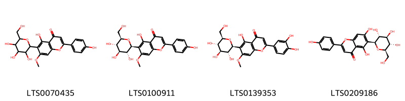

::: {.callout-note title = "Tóm tắt"}

nan

:::

## I. Thông tin về dược liệu 

::: {.panel-tabset}

### Định danh

- Dược liệu tiếng Việt: Đạm Trúc Diệp - Trên Mặt Đất
- Dược liệu tiếng Trung: 淡竹叶 (Dan Zhu Ye)
- Dược liệu tiếng Anh: Lophatherum Gracile
- Dược liệu latin thông dụng: Herba Lophatheri
- Dược liệu latin kiểu DĐVN: *Herba Lophatheri*
- Dược liệu latin kiểu DĐVN: *Lophatheri Herba*
- Dược liệu latin kiểu thông tư: *Herba Lophatheri*
- Bộ phận dùng: Trên Mặt Đất (Herba)

### Mô tả dược liệu 

**Theo dược điển Việt nam V:** Thân dài 25 cm đến 75 cm, hình trụ, có đốt, mặt ngoài màu lục vàng, rỗng ờ giữa. Bẹ lá mở tách ra. Phiến lá nguyên hình mác, dài 5 cm đến 20 cm, rộng 1 cm đến 3,5 cm, đôi khi bị nhàu và cuộn lại, mặt trên của lá màu lục nhạt hoặc màu lục vàng, các gân chính song song, gân nhỏ nằm ngang thành hình mạng lưới, với các mắt lưới hình chữ nhật, mặt dưới rõ hơn. Thể nhẹ, mềm dẻo. Mùi nhẹ, vị nhạt. 
 
**Mô tả dược liệu theo thông tư chế biến dược liệu theo phương pháp cổ truyền:** nan

### Chế biến 

**Chế biến theo dược điển việt nam V**: Thu hoạch vào mùa hè khi cây chưa nở hoa, cắt lấy phần trên mặt đất, rửa sạch. Loại bỏ tạp chất và rễ, cắt khúc, sàng sạch bụi bám, phơi hay sấy khô. nn 

**Chế biến theo thông tư:** nan

::: 

## II. Thông tin về thực vật

Dược liệu **Đạm Trúc Diệp - Trên Mặt Đất** từ bộ phận **Trên Mặt Đất** từ loài *Lophatherum gracile*.

**Mô tả thực vật:** nan

*Tài liệu tham khảo:* nan 
Trong dược điển Việt nam, loài *Lophatherum gracile* được sử dụng làm dược liệu.

            
::: {.callout-note title = "Phân loại thực vật của *Lophatherum gracile*"}

**Kingdom:** Plantae 

**Phylum:** Tracheophyta 

**Order:** Poales 
 
**Family:** Poaceae 
 
**Genus:** Lophatherum 
 
**Species:** *Lophatherum gracile* 
 

:::

::: {style="display: grid;grid-template-columns: repeat(auto-fill, minmax(150px, 1fr));grid-gap: 1em;"}
{ group="GIBF" }

{ group="GIBF" }

{ group="GIBF" }

{ group="GIBF" }

{ group="GIBF" }

{ group="GIBF" }

{ group="GIBF" }

{ group="GIBF" }

{ group="GIBF" }

{ group="GIBF" }

{ group="GIBF" }
:::

**Phân bố trên thế giới:** Japan, China, Chinese Taipei, Korea, Republic of, Hong Kong, Viet Nam, Thailand, Singapore

**Phân bố tại Việt nam:** Không có ghi nhận ở Việt Nam

<iframe src="Herba Lophatheri/map_distribution.html" width="100%" height="600" style="border:none;"></iframe>

## III. Thành phần hóa học

Theo tài liệu của GS. Đỗ Tất Lợi:  nan
    

Theo cơ sở dữ liệu lotus, loài *Lophatherum gracile* đã phân lập và xác định được **4** hoạt chất thuộc về các nhóm Flavonoids trong bảng dưới đây.
        
| chemicalTaxonomyClassyfireClass   |   smiles_count |
|:----------------------------------|---------------:|
| Flavonoids                        |            294 |

Danh sách chi tiết các hoạt chất như sau: 

::: {style="display: grid;grid-template-columns: repeat(auto-fill, minmax(150px, 1fr));grid-gap: 1em;"}

                                                              
{ group="compound" description="Cấu trúc hóa học của các hoạt chất thuộc nhóm *Flavonoids* là 5-hydroxy-2-(4-hydroxyphenyl)-7-methoxy-6-[3,4,5-trihydroxy-6-(hydroxymethyl)oxan-2-yl]chromen-4-one [(LTS0070435)](https://lotus.naturalproducts.net/compound/lotus_id/LTS0070435), 5-hydroxy-2-(4-hydroxyphenyl)-7-methoxy-6-[(2s,3r,4r,5s,6r)-3,4,5-trihydroxy-6-(hydroxymethyl)oxan-2-yl]chromen-4-one [(LTS0100911)](https://lotus.naturalproducts.net/compound/lotus_id/LTS0100911), swertiajaponin [(LTS0139353)](https://lotus.naturalproducts.net/compound/lotus_id/LTS0139353), isovitexin [(LTS0209186)](https://lotus.naturalproducts.net/compound/lotus_id/LTS0209186)." }

:::

---

## IV. Tác dụng dược lý

Theo tài liệu quốc tế: To remove heat, ease the mind and promote diuresis.

---

## V. Dược điển Việt Nam V

### Soi bột

Màu vàng lục. Sợi kính hiển vi thấy: Mảnh biểu bì trên và dưới gồm các tế bào hình chữ nhật hay gần vuông, thành lượn sóng, mang lông che chở và lỗ khí. Biểu bì dưới có tế bào thành lượn sóng nhiều và nhiều lỗ khí hơn biểu bì trên. Lỗ khí hình thoi ngắn, khe lỗ khí hai đầu phình to, giữa thắt lại hình quả tạ. Lông che chở gồm hai loại: lông đơn bào dài, đầu thuôn nhọn, gốc hẹp và nhô lên, ít gặp; lông đơn bào ngắn, đầu thuôn nhỏ, gốc phình to, có nhiều trên các đường gân. Sợi dài, đầu thuôn nhọn, có loại thành hơi dày khoang rộng; có loại thành dày, khoang hẹp. Sợi mô cứng hình thoi, thành dày (ít gặp). Tế bào hình chữ nhật, thành dày. Mảnh mạch mạng, mạch xoắn. nn

::: {#listing-soibot}
:::

### Vi phẫu

Lá: Biểu bì trên và dưới có từng quãng tế bào to chứa nước xen lẫn với từng quãng tế bào biểu bì nhỏ, có lỗ khí và lông che chở đơn bào ngắn, đầu nhọn. Mô mềm gồm những tế bào hình nhiều cạnh có thành mỏng. Nhiều bó libe-gỗ xếp rời nhau theo hình vòng cung gần biểu bì dưới. Mỗi bó libe-gỗ gồm có vòng nội bì bao bọc xung quanh, libe ờ giữa có vòng mô cứng bao bọc, gỗ nằm sát libe có 3 mạch gỗ to xếp thành hình chữ V, đặt trong mô mềm gỗ. Xen kẽ với các bó libe-gỗ này có nhiều bó libe-gỗ nhỏ hơn. Nhiều đám mô cứng rời nhau, nằm sát biểu bì trên và dưới ở phiến và gân lá. Ở biểu bì dưới đám mô cứng ứng với bó libe-gỗ nhỏ. có khi nối liền một số bó libe-gỗ ở giữa với biểu bì dưới.

::: {#listing-viphau}
:::

### Định tính

A. Phương pháp sắc ký lớp mỏng (Phụ lục 5.4). Bản mỏng: Silica gel F254- Dung môi khai triển: Ethyl acetat – acid formic – nước (5 : 0,8 : 0,2). Dung dịch thử: Lấy 2 g bột dược liệu, thêm 30 ml ethanol 70 % (TT), siêu âm 10 min, ly tâm 3000 r/min trong 5 min. Lấy lớp dung dịch ở phía trên, bay hơi trên cách thủy đến cắn. Hòa tan cắn trong 20 ml nước, chuyển dung dịch vào bình gạn, lắc với ethyl acetat (TT) 3 lần, mỗi lần 20 ml. Gộp các dịch chiết ethyl acetat, bay hơi trên cách thủy đến khô. Hòa tan cắn trong 2 ml ethanol 70 % (TT) hoặc pha loãng đến nồng độ thích hợp dùng làm dung dịch thừ. Dung dịch chất đối chiếu: Hòa tan một lượng isoorientin chuẩn trong ethanol 70 % (TT) để thu được dung dịch có nồng độ khoảng 1 mg/ml. Dung dịch dược liệu đối chiếu: Nếu không có isoorientin thì dùng 2 g bột Đạm trúc diệp (mẫu chuẩn) chiết như mô tả ờ phần Dung dịch thừ. Cách tiến hành: Chấm riêng biệt lên bản mỏng 4 pl dung dịch thử và 1,5 pl dung dịch chất đối chiếu hoặc 4 pl dung dịch dược liệu đối chiếu. Sau khi triển khai sắc ký, lấy bản mỏng ra, để khô trong không khí, phun dung dịch nhôm clorid 1 % trong ethanol trong 30 s, sấy bản mỏng ờ 105 °c cho đến khi các vết hiện rõ (khoảng 2 min). Quan sát dưới ánh sáng tử ngoại bước sóng 366 nm. Trên sắc ký đồ của dung dịch thử phải có vết cùng giá trị Rf và màu sẳc với vết thu được trên sắc ký đồ của dung dịch chất đổi chiếu, hoặc trên sắc ký đồ của dung dịch thử phải có các vết cùng màu sắc và giá trị Rf với các vết của dung dịch dược liệu đối chiếu.

### Định lượng

Chất chiết được trong dược liệu (Phụ lục 12.10). Chất chiết được trong ethanol (Phương pháp chiết nóng); Không ít hơn 8,0 % tính theo dược liệu khô kiệt, dùng ethanol 70 % (TT) làm dung môi. Chất chiết được trong nước (Phương pháp chiết lạnh): Không ít hơn 10,0 % tính theo dược liệu khô kiệt, dùng nước làm dung môi.

### Thông tin khác 

- **Độ ẩm:** Không quá 13,0 % (Phụ lục 9.6, 1 g, 105 °c, 5 h).
- **Bảo quản:** Để nơi khô.

## VI. Dược điển Hồng kong

::: {#listing-DDHK}
:::

---

## VII. Y dược học cổ truyền

::: {.callout-note title = "nan" }

**Tên vị thuốc:** nan

**Tính:** Hàn

**Vị:** Cam-Đạm

**Quy kinh:**  Tâm, Vị, Phế

**Công năng chủ trị:** Cam, đạm, hàn. Vào các kinh tâm, phế, tiểu trường.

**Phân loại theo thông tư:** Phát tán phong nhiệt

**Tác dụng theo y dược cổ truyền:** nan

**Chú ý:** nan

**Kiêng kỵ:** Phụ nữ có thai không nên dùng. 

:::

::: {#listing-ViThuoc}
:::

