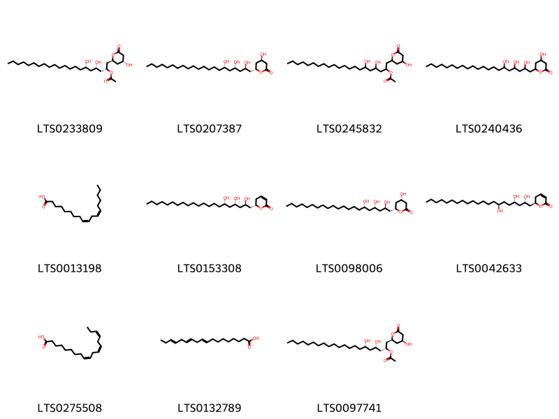
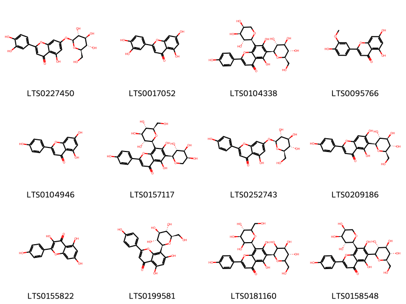
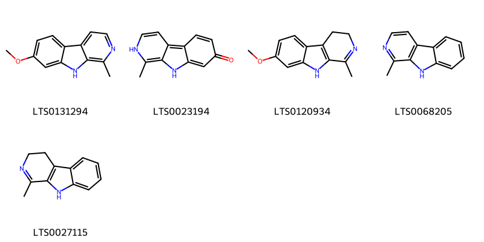
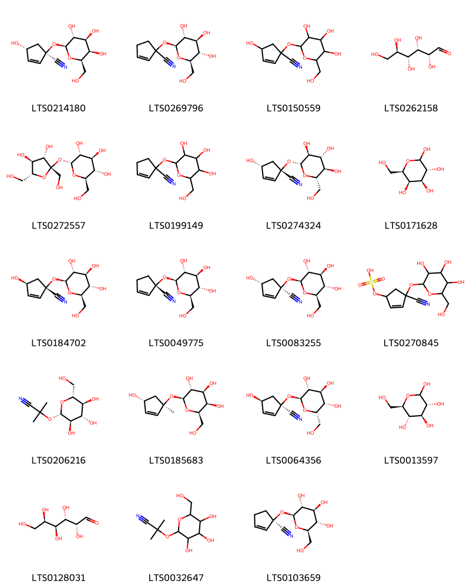

::: {.callout-note title = "Tóm tắt"}

Lạc tiên (Herba Passiflorae foetidae) là phần trên mặt đất đã phơi hoặc sấy khô của cây Lạc tiên (Passiflora foetida L.), họ Lạc tiên (Passifloraceae). Cây mọc hoang ở khắp nơi của nước ta. Theo tài liệu cổ, lạc tiên có tính cam, vi khổ, lương, vào các kinh tâm, can. Dược liệu này được dùng để an thần, giải nhiệt, mát gan. Tác dụng dược lý của cây dùng trị ho, hen suyễn, gây nôn, hỗ trợ giảm các triệu chứng của rối loạn thần kinh (cuồng loạn). Lạc tiên ở nước ta chưa được nghiên cứu thành phân hóa học. Theo Quesland, quả chín lạc tiên chứa acid xyanhydric với lượng nhỏ không đủ gây độc.

:::

## I. Thông tin về dược liệu 

::: {.panel-tabset}

### Định danh

- Dược liệu tiếng Việt: Lạc Tiên - Phần trên mặt đất
- Dược liệu tiếng Trung: ? (?)
- Dược liệu tiếng Anh: ?
- Dược liệu latin thông dụng: Herba Passiflorae Foetidae
- Dược liệu latin kiểu DĐVN: *Herba Passiflorae Foetidae*
- Dược liệu latin kiểu DĐVN: *nan*
- Dược liệu latin kiểu thông tư: *nan*
- Bộ phận dùng: Phần trên mặt đất (Herba)

### Mô tả dược liệu 

**Theo dược điển Việt nam V:** Đoạn thân rỗng, dài khoảng 5 cm, mang tua cuốn và lá, có thể có lẫn hoa và quả. Thân và lá có nhiều lông. Cuống lá dài 3 cm đến 4 cm. Phiến lá mỏng màu lục hay hơi vàng nâu, dài và rộng khoảng 7 cm đến 10 cm, chia thành 3 thùy rộng, đầu nhọn. Mép lá có răng cưa nông, gốc lá hình tim. Lá kèm hình vẩy phát triển thành sợi mang lông tiết đa bào, tua cuốn ở nách lá. 
 
**Mô tả dược liệu theo thông tư chế biến dược liệu theo phương pháp cổ truyền:** nan

### Chế biến 

**Chế biến theo dược điển việt nam V**: Thu hoạch vào mùa xuân, hạ. Cắt lấy dây, lá, hoa Lạc tiên, thái ngắn, phơi hoặc sấy khô. 

**Chế biến theo thông tư:** nan

::: 

## II. Thông tin về thực vật

Dược liệu **Lạc Tiên - Phần trên mặt đất** từ bộ phận **Phần trên mặt đất** từ loài *Passiflora foetida*.

**Mô tả thực vật:** Lạc tiên là một loại dây mọc leo, thân mềm, trên có rất nhiều lông mềm. Lá mềm, mọc so le, hình tim, dài 6-10cm, rộng 5-8cm, mép lượn sóng và xẻ hơi sâu thành 3 thuỳ, đáy lá hình tim, mép lá có lòng mịn, cuống lá dài 7-8cm. Đầu tua cuống thành lò xo. Hoa đơn độc, 5 cánh màu trắng hay hơi tím nhạt, đường kính 5,5cm lá đài màu trắng phía dưới có gan xanh, dưới lá đài có 3 gân chính với những gần phụ trông như lá mà không có phiến chỉ có gần lá không thôi. Một đĩa có 2 tầng tua, mặt tua trên có màu tím trong vàng, trong cùng có lông mịn. Trụ cao có đầu tim đỏ, 5 nhị có bao phấn màu vàng gục xuống dưới. Quả hình trứng dài 2-3cm. Mùa hoa 4. 5, mùa quả 5-7.

*Tài liệu tham khảo:* "Những cây thuốc và vị thuốc Việt Nam" - Đỗ Tất Lợi 
Trong dược điển Việt nam, loài *Passiflora foetida* được sử dụng làm dược liệu.

            
::: {.callout-note title = "Phân loại thực vật của *Passiflora foetida*"}

**Kingdom:** Plantae 

**Phylum:** Tracheophyta 

**Order:** Malpighiales 
 
**Family:** Passifloraceae 
 
**Genus:** Passiflora 
 
**Species:** *Passiflora foetida* 
 

:::

::: {style="display: grid;grid-template-columns: repeat(auto-fill, minmax(150px, 1fr));grid-gap: 1em;"}
{ group="GIBF" }

{ group="GIBF" }

{ group="GIBF" }

{ group="GIBF" }

{ group="GIBF" }

{ group="GIBF" }

{ group="GIBF" }
:::

**Phân bố trên thế giới:** Benin, Curaçao, Jamaica, Sri Lanka, French Guiana, Virgin Islands (British), Mexico, Chinese Taipei, Colombia, Hong Kong, Bonaire, Sint Eustatius and Saba, South Africa, Martinique, Australia, Aruba, Panama, Virgin Islands (U.S.), Honduras, Saint Kitts and Nevis, Guatemala, India, Brazil, Costa Rica, Peru, Argentina, Thailand, United States of America, Bolivia (Plurinational State of), Dominican Republic, Nicaragua, Malaysia, Puerto Rico, Sierra Leone

**Phân bố tại Việt nam:** Không có ghi nhận ở Việt Nam

<iframe src="Herba Passiflorae Foetidae/map_distribution.html" width="100%" height="600" style="border:none;"></iframe>

## III. Thành phần hóa học

Theo tài liệu của GS. Đỗ Tất Lợi:  (1) Vitexin (C21H20O10)
Isovitexin (C21H20O10)
Harmane (C12H10N2)
Harmaline (C13H14N2O)
Α linolenic acid (C18H30O2)
Glucose
Galactose
...
(2) Dược điển Việt Nam: flavonoid
    

Theo cơ sở dữ liệu lotus, loài *Passiflora foetida* đã phân lập và xác định được **47** hoạt chất thuộc về các nhóm Harmala alkaloids, Fatty Acyls, Flavonoids, Organooxygen compounds trong bảng dưới đây.
        
| chemicalTaxonomyClassyfireClass   |   smiles_count |
|:----------------------------------|---------------:|
| Fatty Acyls                       |            589 |
| Flavonoids                        |            907 |
| Harmala alkaloids                 |            136 |
| Organooxygen compounds            |            991 |

Danh sách chi tiết các hoạt chất như sau: 

::: {style="display: grid;grid-template-columns: repeat(auto-fill, minmax(150px, 1fr));grid-gap: 1em;"}

                                                              
{ group="compound" description="Cấu trúc hóa học của các hoạt chất thuộc nhóm *Fatty Acyls* là (2r,4s,6s)-4,6-dihydroxy-1-[(2s,4r)-4-hydroxy-6-oxooxan-2-yl]henicosan-2-yl acetate [(LTS0233809)](https://lotus.naturalproducts.net/compound/lotus_id/LTS0233809), (4r,6r)-4-hydroxy-6-[(2r,4s,6s)-2,4,6-trihydroxyhenicosyl]oxan-2-one [(LTS0207387)](https://lotus.naturalproducts.net/compound/lotus_id/LTS0207387), 4,6-dihydroxy-1-(4-hydroxy-6-oxooxan-2-yl)henicosan-2-yl acetate [(LTS0245832)](https://lotus.naturalproducts.net/compound/lotus_id/LTS0245832), 4-hydroxy-6-(2,4,6-trihydroxyhenicosyl)oxan-2-one [(LTS0240436)](https://lotus.naturalproducts.net/compound/lotus_id/LTS0240436), linoleic [(LTS0013198)](https://lotus.naturalproducts.net/compound/lotus_id/LTS0013198), (6s)-6-[(2r,4s,6s)-2,4,6-trihydroxyhenicosyl]-5,6-dihydropyran-2-one [(LTS0153308)](https://lotus.naturalproducts.net/compound/lotus_id/LTS0153308), (4s,6r)-4-hydroxy-6-[(2r,4s,6s)-2,4,6-trihydroxyhenicosyl]oxan-2-one [(LTS0098006)](https://lotus.naturalproducts.net/compound/lotus_id/LTS0098006), (6r)-6-[(2s,4s,7s)-2,4,7-trihydroxyhenicosyl]-5,6-dihydropyran-2-one [(LTS0042633)](https://lotus.naturalproducts.net/compound/lotus_id/LTS0042633), α-linolenic acid [(LTS0275508)](https://lotus.naturalproducts.net/compound/lotus_id/LTS0275508), α linolenic acid [(LTS0132789)](https://lotus.naturalproducts.net/compound/lotus_id/LTS0132789), (2r,4s,6s)-4,6-dihydroxy-1-[(2s,4s)-4-hydroxy-6-oxooxan-2-yl]henicosan-2-yl acetate [(LTS0097741)](https://lotus.naturalproducts.net/compound/lotus_id/LTS0097741)." }

                                                              
{ group="compound" description="Cấu trúc hóa học của các hoạt chất thuộc nhóm *Flavonoids* là luteolin 7-o-glucoside [(LTS0227450)](https://lotus.naturalproducts.net/compound/lotus_id/LTS0227450), luteolin [(LTS0017052)](https://lotus.naturalproducts.net/compound/lotus_id/LTS0017052), schaftoside [(LTS0104338)](https://lotus.naturalproducts.net/compound/lotus_id/LTS0104338), chrysoeriol [(LTS0095766)](https://lotus.naturalproducts.net/compound/lotus_id/LTS0095766), chamomile [(LTS0104946)](https://lotus.naturalproducts.net/compound/lotus_id/LTS0104946), isoschaftoside [(LTS0157117)](https://lotus.naturalproducts.net/compound/lotus_id/LTS0157117), apigenin 7-o-β-glucoside [(LTS0252743)](https://lotus.naturalproducts.net/compound/lotus_id/LTS0252743), isovitexin [(LTS0209186)](https://lotus.naturalproducts.net/compound/lotus_id/LTS0209186), kaempherol [(LTS0155822)](https://lotus.naturalproducts.net/compound/lotus_id/LTS0155822), vitexin [(LTS0199581)](https://lotus.naturalproducts.net/compound/lotus_id/LTS0199581), vicenin 2 [(LTS0181160)](https://lotus.naturalproducts.net/compound/lotus_id/LTS0181160), 5,7-dihydroxy-2-(4-hydroxyphenyl)-6-[(3r,4r,5s,6r)-3,4,5-trihydroxy-6-(hydroxymethyl)oxan-2-yl]-8-[(2s,3r,4s,5s)-3,4,5-trihydroxyoxan-2-yl]chromen-4-one [(LTS0158548)](https://lotus.naturalproducts.net/compound/lotus_id/LTS0158548)." }

                                                              
{ group="compound" description="Cấu trúc hóa học của các hoạt chất thuộc nhóm *Harmala alkaloids* là harmine [(LTS0131294)](https://lotus.naturalproducts.net/compound/lotus_id/LTS0131294), harmol [(LTS0023194)](https://lotus.naturalproducts.net/compound/lotus_id/LTS0023194), harmaline [(LTS0120934)](https://lotus.naturalproducts.net/compound/lotus_id/LTS0120934), harmane [(LTS0068205)](https://lotus.naturalproducts.net/compound/lotus_id/LTS0068205), 1-methyl-3h,4h,9h-pyrido[3,4-b]indole [(LTS0027115)](https://lotus.naturalproducts.net/compound/lotus_id/LTS0027115)." }

                                                              
{ group="compound" description="Cấu trúc hóa học của các hoạt chất thuộc nhóm *Organooxygen compounds* là (1r,4r)-4-hydroxy-1-{[(2s,3r,4s,5r,6r)-3,4,5-trihydroxy-6-(hydroxymethyl)oxan-2-yl]oxy}cyclopent-2-ene-1-carbonitrile [(LTS0214180)](https://lotus.naturalproducts.net/compound/lotus_id/LTS0214180), 1-{[(2s,3r,4s,5s,6r)-3,4,5-trihydroxy-6-(hydroxymethyl)oxan-2-yl]oxy}cyclopent-2-ene-1-carbonitrile [(LTS0269796)](https://lotus.naturalproducts.net/compound/lotus_id/LTS0269796), 4-hydroxy-1-{[3,4,5-trihydroxy-6-(hydroxymethyl)oxan-2-yl]oxy}cyclopent-2-ene-1-carbonitrile [(LTS0150559)](https://lotus.naturalproducts.net/compound/lotus_id/LTS0150559), (+)-glucose [(LTS0262158)](https://lotus.naturalproducts.net/compound/lotus_id/LTS0262158), sucrose [(LTS0272557)](https://lotus.naturalproducts.net/compound/lotus_id/LTS0272557), 1-{[3,4,5-trihydroxy-6-(hydroxymethyl)oxan-2-yl]oxy}cyclopent-2-ene-1-carbonitrile [(LTS0199149)](https://lotus.naturalproducts.net/compound/lotus_id/LTS0199149), (1s,4r)-4-hydroxy-1-{[(2r,3s,4r,5r,6s)-3,4,5-trihydroxy-6-(hydroxymethyl)oxan-2-yl]oxy}cyclopent-2-ene-1-carbonitrile [(LTS0274324)](https://lotus.naturalproducts.net/compound/lotus_id/LTS0274324), galactose [(LTS0171628)](https://lotus.naturalproducts.net/compound/lotus_id/LTS0171628), (1s,4s)-4-hydroxy-1-{[(2s,3r,4s,5s,6r)-3,4,5-trihydroxy-6-(hydroxymethyl)oxan-2-yl]oxy}cyclopent-2-ene-1-carbonitrile [(LTS0184702)](https://lotus.naturalproducts.net/compound/lotus_id/LTS0184702), deidaclin [(LTS0049775)](https://lotus.naturalproducts.net/compound/lotus_id/LTS0049775), epitetraphyllin b [(LTS0083255)](https://lotus.naturalproducts.net/compound/lotus_id/LTS0083255), (4-cyano-4-{[3,4,5-trihydroxy-6-(hydroxymethyl)oxan-2-yl]oxy}cyclopent-2-en-1-yl)oxidanesulfonic acid [(LTS0270845)](https://lotus.naturalproducts.net/compound/lotus_id/LTS0270845), linamarin [(LTS0206216)](https://lotus.naturalproducts.net/compound/lotus_id/LTS0206216), (2s,3r,4s,5r,6r)-2-{[(1r,4r)-4-hydroxy-1-methylcyclopent-2-en-1-yl]oxy}-6-(hydroxymethyl)oxane-3,4,5-triol [(LTS0185683)](https://lotus.naturalproducts.net/compound/lotus_id/LTS0185683), (1r,4s)-4-hydroxy-1-{[(2s,3r,4s,5s,6s)-3,4,5-trihydroxy-6-(hydroxymethyl)oxan-2-yl]oxy}cyclopent-2-ene-1-carbonitrile [(LTS0064356)](https://lotus.naturalproducts.net/compound/lotus_id/LTS0064356), glucose [(LTS0013597)](https://lotus.naturalproducts.net/compound/lotus_id/LTS0013597), aldehydo-d-galactose [(LTS0128031)](https://lotus.naturalproducts.net/compound/lotus_id/LTS0128031), linamarin [(LTS0032647)](https://lotus.naturalproducts.net/compound/lotus_id/LTS0032647), deidaclin [(LTS0103659)](https://lotus.naturalproducts.net/compound/lotus_id/LTS0103659)." }

:::

---

## IV. Tác dụng dược lý

Theo tài liệu quốc tế: nan

---

## V. Dược điển Việt Nam V

### Soi bột

Có nhiều lông che chở đơn bào, lông tiết đa bào còn nguyên hay bị gãy. Mảnh biểu bì có lỗ khí kiểu hỗn bào. Mảnh mô mềm hay libe có chứa tinh thể calci oxalat hình cầu gai. Mảnh mạch xoắn, mạch vạch.

::: {#listing-soibot}
:::

### Vi phẫu

Lá: Phiến lá gồm biểu bì trên, mô dậu, mô mềm và biểu bì dưới. Biểu bì trên và dưới có lông che chở và lông tiết. Lông che chở đơn bào, nhỏ. Lông tiết có chân đa bào gồm nhiều dãy tế bào xếp thành hàng dọc, thon dần về phía ngọn đầu đơn bào hình trứng, chứa chất tiết màu vàng. Gân chính gồm biểu bì trên và dưới, mô dày dưới biểu bì, mô mềm và ở giữa là bó libe-gỗ. Trong libe và rải rác trong mô mềm có tinh thể calci oxalat hình cầu gai có đường kính 7 µm đến 12 µm.

::: {#listing-viphau}
:::

### Định tính

A. Lấy 2 g bột dược liệu, thêm 10 ml ethanol 90% (TT). Đun sôi trong 5 min, lọc nóng dịch chiết qua 0,1 g than hoạt tính (TT) trên giấy lọc gấp nếp, thu được 5 ml dịch lọc. Lấy 2 ml dịch lọc cho vào ống nghiệm, thêm ít bột magnesi (TT) rồi thêm 0,2 ml acid hydrocloric (TT). Để yên vài phút, dung dịch sẽ có màu đỏ cam. B. Lấy 10 g bột dược liệu cho vào bình nón 250 ml, thấm ẩm bằng dung dịch amoni hydroxyd 10 % (TT) trong 15 min. Thêm 40 ml cloroform (TT), thỉnh thoảng lắc. Sau 30 min, lọc, cô dịch lọc đến còn 10 ml rồi chuyển vào bình gạn. Thêm vào bình gạn 5 ml dung dịch acid sulfuric 1% (TT). Lắc kỹ và gạn lớp acid, chia dịch chiết thu được vào 3 ống nghiệm: Ống nghiệm 1 : Thêm 1 giọt thuốc thử Mayer (TT), xuất hiện tủa trắng đục. Ống nghiệm 2: Thêm 1 giọt thuốc thử Bouchardat (TT), xuất hiện tủa đỏ nâu. Ống nghiệm 3: Thêm 1 giọt thuốc thử Dragendorff (TT), xuất hiện tủa vàng cam. C. Phương pháp sắc ký lớp mỏng (Phụ lục 5.4). Bản mỏng: Silica gel GF254 Dung môi khai triển: Ethyl acetat – acid formic – acid acetic băng – nước (100 : 11 : 11 : 35). Cho hỗn hợp dung môi vào bình gạn rồi lắc đều, thu lấy lớp trên. Dung dịch thử: Lấy 1 g bột dược liệu, thêm 10 ml methanol (TT). Chiết siêu âm trong 10 min, lọc. Bổ sung methanol (TT) hoặc cô đặc để thu được 5 ml dịch lọc. Dung dịch chất đối chiếu: Hòa tan vitexin chuẩn trong methanol (TT) để thu được dung dịch có nồng độ 0,1 mg/ml. Dung dịch dược liệu đối chiếu: Lấy 1 g bột Lạc tiên (mẫu chuẩn), tiến hành chiết như mô tả ở phần Dung dịch thử. Cách tiến hành: Châm riêng biệt lên cùng bản mỏng 6 µl dung dịch thử và 6 µl dung dịch dược liệu đối chiếu (hoặc 4µl dung dịch chất đối chiếu). Chấm dải dài 7 mm. Sau khi triển khai sắc ký, lấy bản mỏng và sấy khô ở 120 °C trong 2-3 min. Phun lên bản mỏng dung dịch 2-aminoethyl diphenyl borat 1 % trong methanol (TT), sau đó phun dung dịch polyethylen glycol 400 5 % trong methanol (TT). Để khô bản mỏng ngoài không khí khoảng 30 min. Quan sát dưới ánh sáng tử ngoại ở bước sóng 366 nm. Trên sắc ký đồ của dung dịch thử phải có các vết cùng màu sắc và giá trị Rf với các vết trên sắc ký đồ của dung dịch dược liệu đối chiếu hoặc có vết cùng màu sắc và giá trị Rf với các vết vitexin trên sắc ký đồ của dung dịch chất đối chiếu.

### Định lượng

Dung dịch thử: Cân chính xác khoảng 0,25 g bột dược liệu (qua rây số 250) cho vào bình nón 250 ml, thêm 40 ml ethanol 60 % (TT) và đun hồi lưu trong cách thủy 30 min. Đê nguội, lọc dịch chiết qua giấy lọc gấp nếp vào bình định mức dung tích 100 ml. Chuyển toàn bộ giấy lọc và bã dược liệu vào bình nón và tiếp tục chiết thêm 2 lần nữa, mỗi lần 30 ml ethanol 60 % (TT). Lọc, gộp các dịch lọc vào bình định mức trên, thêm ethanol 60 % (TT) tới vạch, lắc đều, thu được dung dịch A. Lấy chính xác 5 ml dung dịch A cho vào cốc có mỏ, cô trong cách thủy tới cắn khô. Dùng 10 ml hỗn hợp methanol – acid acetic băng (10:100) để hòa tan và chuyển toàn bộ cắn vào bình định mức 25 ml, thêm 10 ml hỗn hợp chứa acid boric (TT) 2,5 % và acid oxalic (TT) 2 % trong acid formic khan (TT). Bổ sung acid acetic khan (TT) tới vạch, lắc đều. Dung dịch mẫu trắng: Lấy chính xác 5 ml dung dịch A cho vào cốc có mỏ, cô cách thủy tới cắn khô. Dùng 10 ml hỗn hợp methanol – acid acetic băng (10 : 100) để hòa tan và chuyển toàn bộ cắn vào bình định mức 25 ml, thêm 10 ml acid formic khan (TT). Bổ sung acid acetic khan (TT) tới vạch, lắc đều. Sau 30 min, đo độ hấp thụ (Phụ lục 4.1) của các dung dịch trên ở bước sóng 401 nm trong cóng đo 1 cm. Tính hàm lượng phần trăm flavonoid toàn phần (tính theo vitexin) theo A (1 %, 1 cm). Lấy 628 là giá trị của A (1 %, 1 cm) của vitexin ở bước sóng 401 nm. Hàm lượng flavonoid toàn phần trong dược liệu tính theo vitexin (C21H20O10) không được ít hơn 0,6 % tính theo dược liệu khô kiệt.nKhông dưới 18,0 % tính theo dược liệu khô kiệt. Tiến hành theo phương pháp chiết lạnh (Phụ lục 12.10). Dùng nước làm dung môi.

### Thông tin khác 

- **Độ ẩm:** Không quá 13,0 % (Phụ lục 9.6, 1 g. 85 °C, 5 h).
- **Bảo quản:** nan

## VI. Dược điển Hồng kong

::: {#listing-DDHK}
:::

---

## VII. Y dược học cổ truyền

::: {.callout-note title = "nan" }

**Tên vị thuốc:** nan

**Tính:** nan

**Vị:** nan

**Quy kinh:**  nan

**Công năng chủ trị:** Cam, vi khổ, lương. Vào các kinh tâm, can.

**Phân loại theo thông tư:** nan

**Tác dụng theo y dược cổ truyền:** nan

**Chú ý:** nan

**Kiêng kỵ:** nan 

:::

::: {#listing-ViThuoc}
:::

