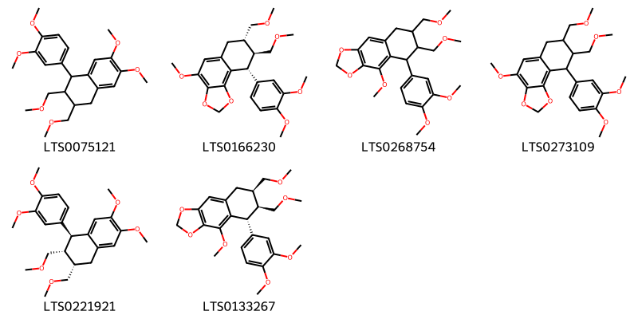
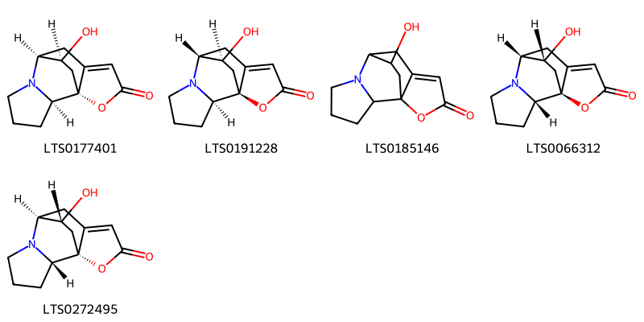
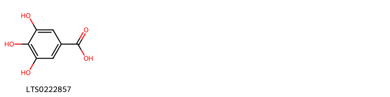
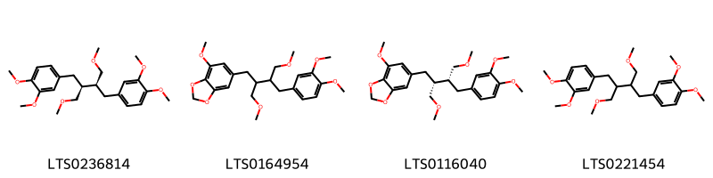
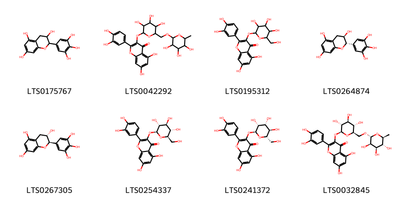
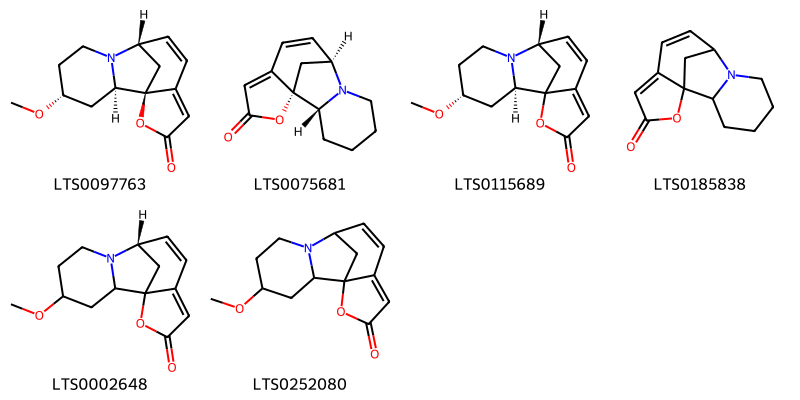
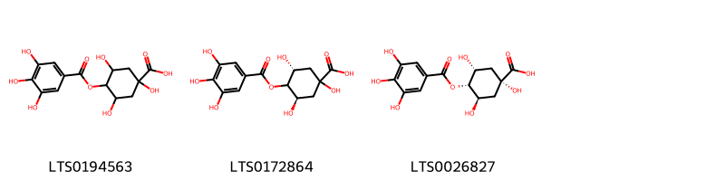
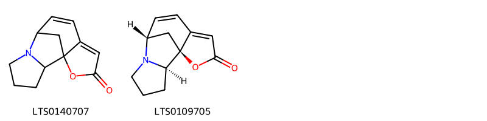
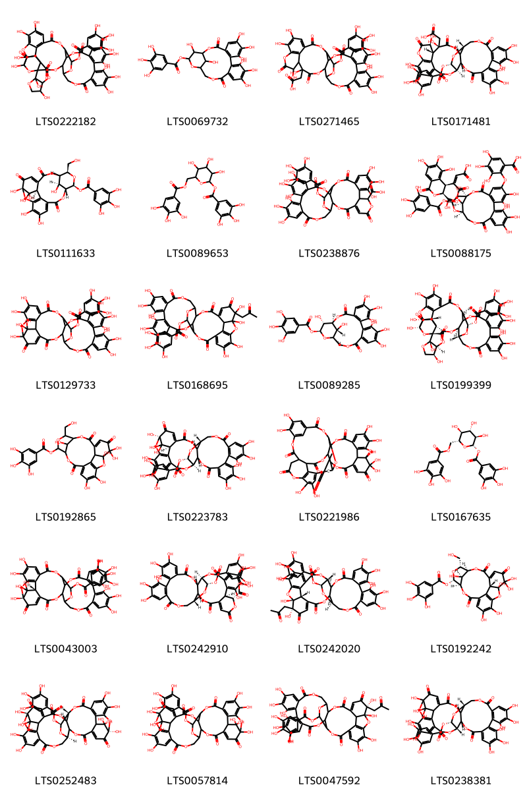

::: {.callout-note title = "Tóm tắt"}

Diệp hạ châu đắng (Phyllanthi amari) là toàn cây hoặc đã phơi khô của cây chó đẻ răng cưa thân xanh, thuộc họ Thầu dầu (Euphorbiaceae), phân bố rộng rãi ở các vùng nhiệt đới. Trong y học cổ truyền, Diệp hạ châu đắng được sử dụng để giải độc, lợi tiểu, trị vàng da, viêm gan. Cây có chứa nhiều hoạt chất quý như phyllanthin, hypophyllanthin,... có tác dụng kháng viêm, chống oxy hóa, bảo vệ gan và hỗ trợ điều trị các bệnh về gan mật. Hiện nay, nhiều nghiên cứu đã chứng minh hiệu quả của Diệp hạ châu đắng trong điều trị các bệnh lý về gan và được ứng dụng rộng rãi trong các chế phẩm dược.

:::

## I. Thông tin về dược liệu 

::: {.panel-tabset}

### Định danh

- Dược liệu tiếng Việt: Diệp Hạ Châu Đắng - Toàn Cây
- Dược liệu tiếng Trung: nan (nan)
- Dược liệu tiếng Anh: nan
- Dược liệu latin thông dụng: Herba Phyllanthi Amari
- Dược liệu latin kiểu DĐVN: *Folium Solani Erianthi*
- Dược liệu latin kiểu DĐVN: *nan*
- Dược liệu latin kiểu thông tư: *nan*
- Bộ phận dùng: Toàn Cây (Herba)

### Mô tả dược liệu 

**Theo dược điển Việt nam V:** nan 
 
**Mô tả dược liệu theo thông tư chế biến dược liệu theo phương pháp cổ truyền:** nan

### Chế biến 

**Chế biến theo dược điển việt nam V**: nan 

**Chế biến theo thông tư:** nan

::: 

## II. Thông tin về thực vật

Dược liệu **Diệp Hạ Châu Đắng - Toàn Cây** từ bộ phận **Toàn Cây** từ loài *Phyllanthus amarus*.

**Mô tả thực vật:** Cây cao 40 cm đến 80 cm, thân tròn, bóng, màu xanh, phân nhánh đều, nhiều. Lá mọc so le xếp thành 2 dãy sít nhau trông như lá kép hình lông chim. Phiến lá hình bầu dục, dài từ 5 mm đến 10 mm, rộng 3 mm đến 6 mm, màu xanh sẫm ờ mặt trên, màu xanh nhạt ờ mặt dưới. Hoa đực và hoa cái mọc thành cụm. Hoa đực có cuống ngắn 1 mm đến 2 mm, đài 5, có tuyến mật, nhị 3, chỉ nhị dính nhau. Hoa cái có cuống dài hơn hoa đực. Quả nang, nhẵn, hình cầu, đường kính 1.8 mm đến 2 mm, có đài tồn tại. Chứa 6 hạt hình tam giác, đường kính 1 mm, hạt có sọc dọc ở lưng.

*Tài liệu tham khảo:* "Những cây thuốc và vị thuốc Việt Nam" - Đỗ Tất Lợi 
Trong dược điển Việt nam, loài *Phyllanthus amarus* được sử dụng làm dược liệu.

            
::: {.callout-note title = "Phân loại thực vật của *Phyllanthus amarus*"}

**Kingdom:** Plantae 

**Phylum:** Tracheophyta 

**Order:** Malpighiales 
 
**Family:** Phyllanthaceae 
 
**Genus:** Phyllanthus 
 
**Species:** *Phyllanthus amarus* 
 

:::

::: {style="display: grid;grid-template-columns: repeat(auto-fill, minmax(150px, 1fr));grid-gap: 1em;"}
{ group="GIBF" }

{ group="GIBF" }

{ group="GIBF" }

{ group="GIBF" }

{ group="GIBF" }

{ group="GIBF" }

{ group="GIBF" }
:::

**Phân bố trên thế giới:** nan, Benin, Cayman Islands, Curaçao, Cuba, Singapore, Sri Lanka, Antigua and Barbuda, Guadeloupe, French Guiana, Mexico, Chinese Taipei, American Samoa, Hong Kong, Barbados, Japan, United Arab Emirates, Australia, Aruba, British Indian Ocean Territory, Indonesia, Madagascar, Virgin Islands (U.S.), Saudi Arabia, Nigeria, Saint Kitts and Nevis, India, Brazil, Viet Nam, Thailand, United States of America, Philippines, Montserrat, China, Dominican Republic, Fiji, Malaysia, Ecuador, Puerto Rico, Anguilla, El Salvador

**Phân bố tại Việt nam:** Hải Phòng, Hồ Chí Minh city

<iframe src="Herba Phyllanthi Amari/map_distribution.html" width="100%" height="600" style="border:none;"></iframe>

## III. Thành phần hóa học

Theo tài liệu của GS. Đỗ Tất Lợi:  (1) Nhóm hóa học: Phyllanthin; Phyllantin; Hypophyllanthin; acid gallic; corilagin; geraniin. 
    

Theo cơ sở dữ liệu lotus, loài *Phyllanthus amarus* đã phân lập và xác định được **60** hoạt chất thuộc về các nhóm Indolizidines, Aryltetralin lignans, Flavonoids, Dibenzylbutane lignans, Tannins, Azaspirodecane derivatives, Organooxygen compounds, Benzene and substituted derivatives, Pyrrolizidines trong bảng dưới đây.
        
| chemicalTaxonomyClassyfireClass     |   smiles_count |
|:------------------------------------|---------------:|
| Aryltetralin lignans                |            327 |
| Azaspirodecane derivatives          |            218 |
| Benzene and substituted derivatives |             23 |
| Dibenzylbutane lignans              |            208 |
| Flavonoids                          |            571 |
| Indolizidines                       |            238 |
| Organooxygen compounds              |            161 |
| Pyrrolizidines                      |             69 |
| Tannins                             |           3342 |

Danh sách chi tiết các hoạt chất như sau: 

::: {style="display: grid;grid-template-columns: repeat(auto-fill, minmax(150px, 1fr));grid-gap: 1em;"}

                                                              
{ group="compound" description="Cấu trúc hóa học của các hoạt chất thuộc nhóm *Aryltetralin lignans* là 1-(3,4-dimethoxyphenyl)-6,7-dimethoxy-2,3-bis(methoxymethyl)-1,2,3,4-tetrahydronaphthalene [(LTS0075121)](https://lotus.naturalproducts.net/compound/lotus_id/LTS0075121), (7s,8s,9r)-9-(3,4-dimethoxyphenyl)-4-methoxy-7,8-bis(methoxymethyl)-2h,6h,7h,8h,9h-naphtho[1,2-d][1,3]dioxole [(LTS0166230)](https://lotus.naturalproducts.net/compound/lotus_id/LTS0166230), 5-(3,4-dimethoxyphenyl)-4-methoxy-6,7-bis(methoxymethyl)-2h,5h,6h,7h,8h-naphtho[2,3-d][1,3]dioxole [(LTS0268754)](https://lotus.naturalproducts.net/compound/lotus_id/LTS0268754), 9-(3,4-dimethoxyphenyl)-4-methoxy-7,8-bis(methoxymethyl)-2h,6h,7h,8h,9h-naphtho[1,2-d][1,3]dioxole [(LTS0273109)](https://lotus.naturalproducts.net/compound/lotus_id/LTS0273109), (1s,2r,3s)-1-(3,4-dimethoxyphenyl)-6,7-dimethoxy-2,3-bis(methoxymethyl)-1,2,3,4-tetrahydronaphthalene [(LTS0221921)](https://lotus.naturalproducts.net/compound/lotus_id/LTS0221921), (5r,6s,7r)-5-(3,4-dimethoxyphenyl)-4-methoxy-6,7-bis(methoxymethyl)-2h,5h,6h,7h,8h-naphtho[2,3-d][1,3]dioxole [(LTS0133267)](https://lotus.naturalproducts.net/compound/lotus_id/LTS0133267)." }

                                                              
{ group="compound" description="Cấu trúc hóa học của các hoạt chất thuộc nhóm *Azaspirodecane derivatives* là (1r,2r,7s,14s)-14-hydroxy-12-oxa-6-azatetracyclo[5.5.2.0¹,⁹.0²,⁶]tetradec-9-en-11-one [(LTS0177401)](https://lotus.naturalproducts.net/compound/lotus_id/LTS0177401), (1s,2r,7r,14s)-14-hydroxy-12-oxa-6-azatetracyclo[5.5.2.0¹,⁹.0²,⁶]tetradec-9-en-11-one [(LTS0191228)](https://lotus.naturalproducts.net/compound/lotus_id/LTS0191228), 14-hydroxy-12-oxa-6-azatetracyclo[5.5.2.0¹,⁹.0²,⁶]tetradec-9-en-11-one [(LTS0185146)](https://lotus.naturalproducts.net/compound/lotus_id/LTS0185146), (1s,2s,7r,14r)-14-hydroxy-12-oxa-6-azatetracyclo[5.5.2.0¹,⁹.0²,⁶]tetradec-9-en-11-one [(LTS0066312)](https://lotus.naturalproducts.net/compound/lotus_id/LTS0066312), (1r,2s,7s,14r)-14-hydroxy-12-oxa-6-azatetracyclo[5.5.2.0¹,⁹.0²,⁶]tetradec-9-en-11-one [(LTS0272495)](https://lotus.naturalproducts.net/compound/lotus_id/LTS0272495)." }

                                                              
{ group="compound" description="Cấu trúc hóa học của các hoạt chất thuộc nhóm *Benzene and substituted derivatives* là galop [(LTS0222857)](https://lotus.naturalproducts.net/compound/lotus_id/LTS0222857)." }

                                                              
{ group="compound" description="Cấu trúc hóa học của các hoạt chất thuộc nhóm *Dibenzylbutane lignans* là phyllanthin [(LTS0236814)](https://lotus.naturalproducts.net/compound/lotus_id/LTS0236814), 6-{3-[(3,4-dimethoxyphenyl)methyl]-4-methoxy-2-(methoxymethyl)butyl}-4-methoxy-2h-1,3-benzodioxole [(LTS0164954)](https://lotus.naturalproducts.net/compound/lotus_id/LTS0164954), 6-[(2r,3r)-3-[(3,4-dimethoxyphenyl)methyl]-4-methoxy-2-(methoxymethyl)butyl]-4-methoxy-2h-1,3-benzodioxole [(LTS0116040)](https://lotus.naturalproducts.net/compound/lotus_id/LTS0116040), 4-{3-[(3,4-dimethoxyphenyl)methyl]-4-methoxy-2-(methoxymethyl)butyl}-1,2-dimethoxybenzene [(LTS0221454)](https://lotus.naturalproducts.net/compound/lotus_id/LTS0221454)." }

                                                              
{ group="compound" description="Cấu trúc hóa học của các hoạt chất thuộc nhóm *Flavonoids* là epigallocatechin [(LTS0175767)](https://lotus.naturalproducts.net/compound/lotus_id/LTS0175767), rutin [(LTS0042292)](https://lotus.naturalproducts.net/compound/lotus_id/LTS0042292), 2-(3,4-dihydroxyphenyl)-5,7-dihydroxy-3-{[3,4,5-trihydroxy-6-(hydroxymethyl)oxan-2-yl]oxy}chromen-4-one [(LTS0195312)](https://lotus.naturalproducts.net/compound/lotus_id/LTS0195312), (-)-gallocatechin [(LTS0264874)](https://lotus.naturalproducts.net/compound/lotus_id/LTS0264874), gallocatechol [(LTS0267305)](https://lotus.naturalproducts.net/compound/lotus_id/LTS0267305), isoquercetin [(LTS0254337)](https://lotus.naturalproducts.net/compound/lotus_id/LTS0254337), 2-(3,4-dihydroxyphenyl)-5,7-dihydroxy-3-{[(2s,3r,4r,5r,6s)-3,4,5-trihydroxy-6-(hydroxymethyl)oxan-2-yl]oxy}chromen-4-one [(LTS0241372)](https://lotus.naturalproducts.net/compound/lotus_id/LTS0241372), 3-rutinosyl quercetin [(LTS0032845)](https://lotus.naturalproducts.net/compound/lotus_id/LTS0032845)." }

                                                              
{ group="compound" description="Cấu trúc hóa học của các hoạt chất thuộc nhóm *Indolizidines* là (1s,2r,4r,8s)-4-methoxy-14-oxa-7-azatetracyclo[6.6.1.0¹,¹¹.0²,⁷]pentadeca-9,11-dien-13-one [(LTS0097763)](https://lotus.naturalproducts.net/compound/lotus_id/LTS0097763), securinine [(LTS0075681)](https://lotus.naturalproducts.net/compound/lotus_id/LTS0075681), (2r,4r,8s)-4-methoxy-14-oxa-7-azatetracyclo[6.6.1.0¹,¹¹.0²,⁷]pentadeca-9,11-dien-13-one [(LTS0115689)](https://lotus.naturalproducts.net/compound/lotus_id/LTS0115689), 14-oxa-7-azatetracyclo[6.6.1.0¹,¹¹.0²,⁷]pentadeca-9,11-dien-13-one [(LTS0185838)](https://lotus.naturalproducts.net/compound/lotus_id/LTS0185838), (8s)-4-methoxy-14-oxa-7-azatetracyclo[6.6.1.0¹,¹¹.0²,⁷]pentadeca-9,11-dien-13-one [(LTS0002648)](https://lotus.naturalproducts.net/compound/lotus_id/LTS0002648), 4-methoxy-14-oxa-7-azatetracyclo[6.6.1.0¹,¹¹.0²,⁷]pentadeca-9,11-dien-13-one [(LTS0252080)](https://lotus.naturalproducts.net/compound/lotus_id/LTS0252080)." }

                                                              
{ group="compound" description="Cấu trúc hóa học của các hoạt chất thuộc nhóm *Organooxygen compounds* là 1,3,5-trihydroxy-4-(3,4,5-trihydroxybenzoyloxy)cyclohexane-1-carboxylic acid [(LTS0194563)](https://lotus.naturalproducts.net/compound/lotus_id/LTS0194563), (3r,5r)-1,3,5-trihydroxy-4-(3,4,5-trihydroxybenzoyloxy)cyclohexane-1-carboxylic acid [(LTS0172864)](https://lotus.naturalproducts.net/compound/lotus_id/LTS0172864), (1s,3r,4s,5r)-1,3,5-trihydroxy-4-(3,4,5-trihydroxybenzoyloxy)cyclohexane-1-carboxylic acid [(LTS0026827)](https://lotus.naturalproducts.net/compound/lotus_id/LTS0026827)." }

                                                              
{ group="compound" description="Cấu trúc hóa học của các hoạt chất thuộc nhóm *Pyrrolizidines* là 2-oxa-9-azatetracyclo[6.5.1.0¹,⁵.0⁹,¹³]tetradeca-4,6-dien-3-one [(LTS0140707)](https://lotus.naturalproducts.net/compound/lotus_id/LTS0140707), (1s,8s,13r)-2-oxa-9-azatetracyclo[6.5.1.0¹,⁵.0⁹,¹³]tetradeca-4,6-dien-3-one [(LTS0109705)](https://lotus.naturalproducts.net/compound/lotus_id/LTS0109705)." }

                                                              
{ group="compound" description="Cấu trúc hóa học của các hoạt chất thuộc nhóm *Tannins* là 3a,6,10',11',12',15',16',17',31',32',36',37'-dodecahydroxy-2,2',7',20',28',41'-hexaoxo-6,6a-dihydro-5h-3',6',21',24',27',38',42'-heptaoxaspiro[furo[3,2-b]furan-3,39'-nonacyclo[35.2.2.1³³,³⁶.0¹,³⁵.0⁴,²³.0⁵,²⁶.0⁸,¹³.0¹⁴,¹⁹.0²⁹,³⁴]dotetracontane]-8'(13'),9',11',14',16',18',29'(34'),30',32'-nonaen-25'-yl 3,4,5-trihydroxybenzoate [(LTS0222182)](https://lotus.naturalproducts.net/compound/lotus_id/LTS0222182), 6,7,8,11,12,13,22,23-octahydroxy-3,16-dioxo-2,17,20-trioxatetracyclo[17.3.1.0⁴,⁹.0¹⁰,¹⁵]tricosa-4(9),5,7,10,12,14-hexaen-21-yl 3,4,5-trihydroxybenzoate [(LTS0069732)](https://lotus.naturalproducts.net/compound/lotus_id/LTS0069732), [13,14,15,18,19,20,29,31,35,36-decahydroxy-2,10,23,28,32-pentaoxo-5-(3,4,5-trihydroxybenzoyloxy)-3,6,9,24,27,33-hexaoxaheptacyclo[28.7.1.0⁴,²⁵.0⁷,²⁶.0¹¹,¹⁶.0¹⁷,²².0³⁴,³⁸]octatriaconta-1(37),11,13,15,17(22),18,20,34(38),35-nonaen-29-yl]acetic acid [(LTS0271465)](https://lotus.naturalproducts.net/compound/lotus_id/LTS0271465), [(4r,5s,7r,25s,26r,29r,30r,31s)-13,14,15,18,19,20,29,31,35,36-decahydroxy-2,10,23,28,32-pentaoxo-5-(3,4,5-trihydroxybenzoyloxy)-3,6,9,24,27,33-hexaoxaheptacyclo[28.7.1.0⁴,²⁵.0⁷,²⁶.0¹¹,¹⁶.0¹⁷,²².0³⁴,³⁸]octatriaconta-1(37),11(16),12,14,17,19,21,34(38),35-nonaen-29-yl]acetic acid [(LTS0171481)](https://lotus.naturalproducts.net/compound/lotus_id/LTS0171481), (1s,7s,9r,18r,19s,21r,22s)-7,8,8,12,13,22-hexahydroxy-21-(hydroxymethyl)-3,6,16-trioxo-2,17,20,23-tetraoxapentacyclo[16.3.1.1⁷,¹¹.0⁴,⁹.0¹⁰,¹⁵]tricosa-4,10,12,14-tetraen-19-yl 3,4,5-trihydroxybenzoate [(LTS0111633)](https://lotus.naturalproducts.net/compound/lotus_id/LTS0111633), 3,4,5-trihydroxy-6-[(3,4,5-trihydroxybenzoyloxy)methyl]oxan-2-yl 3,4,5-trihydroxybenzoate [(LTS0089653)](https://lotus.naturalproducts.net/compound/lotus_id/LTS0089653), 9,10,11,27,28,29,32,33,34-nonahydroxy-6,16,19,24,37-pentaoxo-3-(3,4,5-trihydroxybenzoyloxy)-2,5,15,20,23,38-hexaoxaheptacyclo[19.18.0.0⁴,²².0⁷,¹².0¹³,¹⁸.0²⁵,³⁰.0³¹,³⁶]nonatriaconta-7,9,11,17,25(30),26,28,31,33,35-decaene-14-carboxylic acid [(LTS0238876)](https://lotus.naturalproducts.net/compound/lotus_id/LTS0238876), (3s,4s)-4-[(1z)-1-carboxy-3-{[(1r,19r,21s,22r,23r)-6-(6-carboxy-2,3,4-trihydroxyphenoxy)-7,8,11,12,13,22-hexahydroxy-3,16-dioxo-21-(3,4,5-trihydroxybenzoyloxy)-2,17,20-trioxatetracyclo[17.3.1.0⁴,⁹.0¹⁰,¹⁵]tricosa-4(9),5,7,10,12,14-hexaen-23-yl]oxy}-3-oxoprop-1-en-2-yl]-5,6,7-trihydroxy-1-oxo-3,4-dihydro-2-benzopyran-3-carboxylic acid [(LTS0088175)](https://lotus.naturalproducts.net/compound/lotus_id/LTS0088175), 1,13,14,15,18,19,20,34,35,39,39-undecahydroxy-2,5,10,23,31-pentaoxo-6,9,24,27,30,40-hexaoxaoctacyclo[34.3.1.0⁴,³⁸.0⁷,²⁶.0⁸,²⁹.0¹¹,¹⁶.0¹⁷,²².0³²,³⁷]tetraconta-3,11(16),12,14,17,19,21,32,34,36-decaen-28-yl 3,4,5-trihydroxybenzoate [(LTS0129733)](https://lotus.naturalproducts.net/compound/lotus_id/LTS0129733), 1,2,14,15,16,19,20,21,35,36-decahydroxy-3,6,11,24,32-pentaoxo-2-(2-oxopropyl)-7,10,25,28,31,40-hexaoxaoctacyclo[35.2.1.0⁵,³⁹.0⁸,²⁷.0⁹,³⁰.0¹²,¹⁷.0¹⁸,²³.0³³,³⁸]tetraconta-4,12(17),13,15,18,20,22,33,35,37-decaen-29-yl 3,4,5-trihydroxybenzoate [(LTS0168695)](https://lotus.naturalproducts.net/compound/lotus_id/LTS0168695), (1s,19r,21s,22r,23r)-6,7,8,11,12,13,22,23-octahydroxy-3,16-dioxo-2,17,20-trioxatetracyclo[17.3.1.0⁴,⁹.0¹⁰,¹⁵]tricosa-4(9),5,7,10,12,14-hexaen-21-yl 3,4,5-trihydroxybenzoate [(LTS0089285)](https://lotus.naturalproducts.net/compound/lotus_id/LTS0089285), (1'r,3r,3as,4'r,5's,6s,6as,23'r,25's,26'r,35'r,36's,37'r)-3a,6,10',11',12',15',16',17',31',32',36',37'-dodecahydroxy-2,2',7',20',28',41'-hexaoxo-6,6a-dihydro-5h-3',6',21',24',27',38',42'-heptaoxaspiro[furo[3,2-b]furan-3,39'-nonacyclo[35.2.2.1³³,³⁶.0¹,³⁵.0⁴,²³.0⁵,²⁶.0⁸,¹³.0¹⁴,¹⁹.0²⁹,³⁴]dotetracontane]-8'(13'),9',11',14',16',18',29',31',33'-nonaen-25'-yl 3,4,5-trihydroxybenzoate [(LTS0199399)](https://lotus.naturalproducts.net/compound/lotus_id/LTS0199399), 7,7,8,12,13,22-hexahydroxy-21-(hydroxymethyl)-3,6,16-trioxo-2,17,20,23-tetraoxapentacyclo[16.3.1.1⁸,¹¹.0⁴,⁹.0¹⁰,¹⁵]tricosa-4,10,12,14-tetraen-19-yl 3,4,5-trihydroxybenzoate [(LTS0192865)](https://lotus.naturalproducts.net/compound/lotus_id/LTS0192865), (1r,7r,8s,26r,28s,29r,38r)-1,13,14,15,18,19,20,34,35,39,39-undecahydroxy-2,5,10,23,31-pentaoxo-6,9,24,27,30,40-hexaoxaoctacyclo[34.3.1.0⁴,³⁸.0⁷,²⁶.0⁸,²⁹.0¹¹,¹⁶.0¹⁷,²².0³²,³⁷]tetraconta-3,11,13,15,17(22),18,20,32,34,36-decaen-28-yl 3,4,5-trihydroxybenzoate [(LTS0223783)](https://lotus.naturalproducts.net/compound/lotus_id/LTS0223783), 12,13,17,18,18,32,33,42,43-nonahydroxy-5,8,23,26,28,35,40,46,49-nonaoxadecacyclo[23.19.3.1¹⁴,¹⁷.1³⁰,³⁴.0²,⁴¹.0³,³⁷.0⁶,²⁴.0⁷,²⁷.0¹⁰,¹⁵.0¹⁶,²¹]nonatetraconta-1(44),2(41),10(15),11,13,20,30,32,34(48),42-decaen-4,9,19,22,29,36,39,45-octone [(LTS0221986)](https://lotus.naturalproducts.net/compound/lotus_id/LTS0221986), (2s,3r,4s,5s,6r)-3,4,5-trihydroxy-6-[(3,4,5-trihydroxybenzoyloxy)methyl]oxan-2-yl 3,4,5-trihydroxybenzoate [(LTS0167635)](https://lotus.naturalproducts.net/compound/lotus_id/LTS0167635), (1r,38r)-1,13,14,15,18,19,20,34,35,39,39-undecahydroxy-2,5,10,23,31-pentaoxo-6,9,24,27,30,40-hexaoxaoctacyclo[34.3.1.0⁴,³⁸.0⁷,²⁶.0⁸,²⁹.0¹¹,¹⁶.0¹⁷,²².0³²,³⁷]tetraconta-3,11(16),12,14,17,19,21,32,34,36-decaen-28-yl 3,4,5-trihydroxybenzoate [(LTS0043003)](https://lotus.naturalproducts.net/compound/lotus_id/LTS0043003), (1r,3s,4r,13r,14r,21r,22s)-9,10,11,27,28,29,32,33,34-nonahydroxy-6,16,19,24,37-pentaoxo-3-(3,4,5-trihydroxybenzoyloxy)-2,5,15,20,23,38-hexaoxaheptacyclo[19.18.0.0⁴,²².0⁷,¹².0¹³,¹⁸.0²⁵,³⁰.0³¹,³⁶]nonatriaconta-7,9,11,17,25,27,29,31(36),32,34-decaene-14-carboxylic acid [(LTS0242910)](https://lotus.naturalproducts.net/compound/lotus_id/LTS0242910), (1r,2s,8r,9s,27r,29s,30r,39r)-1,2,14,15,16,19,20,21,35,36-decahydroxy-3,6,11,24,32-pentaoxo-2-(2-oxopropyl)-7,10,25,28,31,40-hexaoxaoctacyclo[35.2.1.0⁵,³⁹.0⁸,²⁷.0⁹,³⁰.0¹²,¹⁷.0¹⁸,²³.0³³,³⁸]tetraconta-4,12,14,16,18(23),19,21,33,35,37-decaen-29-yl 3,4,5-trihydroxybenzoate [(LTS0242020)](https://lotus.naturalproducts.net/compound/lotus_id/LTS0242020), (1s,8r,9r,18r,19s,21r,22s)-7,7,8,12,13,22-hexahydroxy-21-(hydroxymethyl)-3,6,16-trioxo-2,17,20,23-tetraoxapentacyclo[16.3.1.1⁸,¹¹.0⁴,⁹.0¹⁰,¹⁵]tricosa-4,10,12,14-tetraen-19-yl 3,4,5-trihydroxybenzoate [(LTS0192242)](https://lotus.naturalproducts.net/compound/lotus_id/LTS0192242), (1s,7s,14r,25r,26s,28r)-1,14,15,15,19,20,34,35,39,39-decahydroxy-2,5,10,13,23,31-hexaoxo-6,9,24,27,30,40,41-heptaoxanonacyclo[34.3.1.1¹⁴,¹⁸.0⁴,³⁸.0⁷,²⁵.0⁸,²⁸.0¹¹,¹⁶.0¹⁷,²².0³²,³⁷]hentetraconta-3,11,17(22),18,20,32,34,36-octaen-26-yl 3,4,5-trihydroxybenzoate [(LTS0252483)](https://lotus.naturalproducts.net/compound/lotus_id/LTS0252483), 1,14,15,15,19,20,34,35,39,39-decahydroxy-2,5,10,13,23,31-hexaoxo-6,9,24,27,30,40,41-heptaoxanonacyclo[34.3.1.1¹⁴,¹⁸.0⁴,³⁸.0⁷,²⁵.0⁸,²⁸.0¹¹,¹⁶.0¹⁷,²².0³²,³⁷]hentetraconta-3,11,17(22),18,20,32,34,36-octaen-26-yl 3,4,5-trihydroxybenzoate [(LTS0057814)](https://lotus.naturalproducts.net/compound/lotus_id/LTS0057814), (1r,2s)-1,2,14,15,16,19,20,21,35,36-decahydroxy-3,6,11,24,32-pentaoxo-2-(2-oxopropyl)-7,10,25,28,31,40-hexaoxaoctacyclo[35.2.1.0⁵,³⁹.0⁸,²⁷.0⁹,³⁰.0¹²,¹⁷.0¹⁸,²³.0³³,³⁸]tetraconta-4,12(17),13,15,18,20,22,33,35,37-decaen-29-yl 3,4,5-trihydroxybenzoate [(LTS0047592)](https://lotus.naturalproducts.net/compound/lotus_id/LTS0047592), (7r,8s,26r,28s,29s)-1,13,14,15,18,19,20,34,35,39,39-undecahydroxy-2,5,10,23,31-pentaoxo-6,9,24,27,30,40-hexaoxaoctacyclo[34.3.1.0⁴,³⁸.0⁷,²⁶.0⁸,²⁹.0¹¹,¹⁶.0¹⁷,²².0³²,³⁷]tetraconta-3,11,13,15,17(22),18,20,32,34,36-decaen-28-yl 3,4,5-trihydroxybenzoate [(LTS0238381)](https://lotus.naturalproducts.net/compound/lotus_id/LTS0238381)." }

:::

---

## IV. Tác dụng dược lý

Theo tài liệu quốc tế: nan

---

## V. Dược điển Việt Nam V

### Soi bột

nan

::: {#listing-soibot}
:::

### Vi phẫu

nan

::: {#listing-viphau}
:::

### Định tính

nan

### Định lượng

nan

### Thông tin khác 

- **Độ ẩm:** nan
- **Bảo quản:** nan

## VI. Dược điển Hồng kong

::: {#listing-DDHK}
:::

---

## VII. Y dược học cổ truyền

::: {.callout-note title = "nan" }

**Tên vị thuốc:** nan

**Tính:** nan

**Vị:** nan

**Quy kinh:**  nan

**Công năng chủ trị:** nan

**Phân loại theo thông tư:** nan

**Tác dụng theo y dược cổ truyền:** nan

**Chú ý:** nan

**Kiêng kỵ:** nan 

:::

::: {#listing-ViThuoc}
:::

