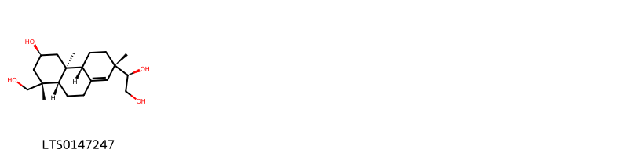

::: {.callout-note title = "Tóm tắt"}

Hy thiêm (Herba Siegesbeckiae) là toàn bộ phận trên mặt đất đã phơi hay sấy khô của cây Hy thiêm (Siegesbeckia orientalis L.), thuộc họ Cúc (Asteraceae). Loài cây này mọc hoang phổ biến ở nhiều tỉnh thành tại Việt Nam và cũng phân bố ở châu Úc, Trung Quốc, Nhật Bản, cùng một số quốc gia Đông Nam Á. Trong y học cổ truyền, Hy thiêm được biết đến với vị khổ, tính hàn, quy vào kinh can và thận, có tác dụng giảm đau, chống viêm, kháng khuẩn, hạ huyết áp, và chống khối u. Thành phần hóa học chính trong Hy thiêm bao gồm darutoside, darutigenol, sesquiterpenoid, diterpenoid, flavonoid, axit hữu cơ, và các hợp chất hỗn hợp.

:::

## I. Thông tin về dược liệu 

::: {.panel-tabset}

### Định danh

- Dược liệu tiếng Việt: Hy Thiêm - Bộ Phận Trên Mặt Đất
- Dược liệu tiếng Trung: ? (?)
- Dược liệu tiếng Anh: ?
- Dược liệu latin thông dụng: Herba Siegesbeckiae
- Dược liệu latin kiểu DĐVN: *Caulis Perillae Frutescensis*
- Dược liệu latin kiểu DĐVN: *Siegesbeckiae Herba*
- Dược liệu latin kiểu thông tư: *nan*
- Bộ phận dùng: Bộ Phận Trên Mặt Đất (Herba)

### Mô tả dược liệu 

**Theo dược điển Việt nam V:** Thân rỗng ở giữa, đường kính 0,2 cm đến 0,5 cm. Mặt ngoài thân màu nâu sẫm đến nâu nhạt, có nhiều rãnh dọc song song và nhiều lông ngắn sít nhau. Lá mọc đối, phiến lá nhăn nheo và thường cuộn lại; lá nguyên có phiến hình mác rộng, mép khía răng cưa tù, có ba gân chính. Mặt trên lá màu lục sẫm, mặt dưới màu lục nhạt, hai mặt đều có lông. Cụm hoa hình đầu nhỏ, gồm hoa màu vàng hình ống ở giữa, 5 hoa hình lưỡi nhỏ ở phía ngoài. Lá bắc có lông dính. Dược liệu sau khi chế biến là những đoạn không đều nhau. Thân gần vuông, rỗng ở giữa, bên ngoài màu nâu sẫm hoặc nâu nhạt, có rãnh dọc song song và nốt sần nhỏ. Mặt cắt có một phần ruột màu trắng. Lá thường vụn nát, màu lục xám, mép khía răng cưa tù, hai mặt phủ lông tơ màu trắng. Đôi khi gặp các đoạn thân mang cụm hoa hình đầu màu vàng. Mùi nhẹ, vị hơi đắng. 
 
**Mô tả dược liệu theo thông tư chế biến dược liệu theo phương pháp cổ truyền:** nan

### Chế biến 

**Chế biến theo dược điển việt nam V**: Khi trời khô ráo, cắt lấy cây có nhiều lá hoặc mới ra hoa, cắt bỏ gốc và rễ, phơi hoặc sấy đến khô ờ 50 °C đến 60 °C. Khi dùng rửa sạch, ủ mềm, cắt đoạn, phơi hoặc sấy khô. 

**Chế biến theo thông tư:** nan

::: 

## II. Thông tin về thực vật

Dược liệu **Hy Thiêm - Bộ Phận Trên Mặt Đất** từ bộ phận **Bộ Phận Trên Mặt Đất** từ loài *Siegesbeckia orientalis*.

**Mô tả thực vật:** Cỏ sống hàng năm, cao chừng 30-40cm, đến 1m, có nhiều cành, có lòng tuyến. Lá mọc đối cuống ngắn, hình 3 cạnh hay thuôn hình quả trám, đầu lá nhọn, phía cuống cũng thót lại, mép có răng cưa, mặt dưới hơi có lồng, dài 4-10cm, rộng 3- 6cm. Cụm hoa hình đầu, màu vàng, cuống có lông tuyến dính. Có 2 loại lá bắc không đều nhau: Lá bắc ngoài hình thìa dài 9-10mm, mọc toả ra thành hình sao, có lông dính, các lá bắc trong dài 5mm, họp thành một tổng bao tất cả đều mang lông tuyến dính. Quả bế đen hình trứng, 4-5 cạnh dài 3mm, rộng 1mm. Mùa hoa: tháng 4-5 đến tháng 8-9, mùa quả các tháng 6-10.

*Tài liệu tham khảo:* "Những cây thuốc và vị thuốc Việt Nam" - Đỗ Tất Lợi 
Trong dược điển Việt nam, loài *Siegesbeckia orientalis* được sử dụng làm dược liệu.

            
::: {.callout-note title = "Phân loại thực vật của *Sigesbeckia orientalis*"}

**Kingdom:** Plantae 

**Phylum:** Tracheophyta 

**Order:** Asterales 
 
**Family:** Asteraceae 
 
**Genus:** Sigesbeckia 
 
**Species:** *Sigesbeckia orientalis* 
 

:::

::: {style="display: grid;grid-template-columns: repeat(auto-fill, minmax(150px, 1fr));grid-gap: 1em;"}
{ group="GIBF" }

{ group="GIBF" }

{ group="GIBF" }

{ group="GIBF" }

{ group="GIBF" }

{ group="GIBF" }

{ group="GIBF" }

{ group="GIBF" }

{ group="GIBF" }

{ group="GIBF" }

{ group="GIBF" }
:::

**Phân bố trên thế giới:** Tanzania, United Republic of, Vanuatu, Bhutan, Korea, Republic of, Nepal, Chinese Taipei, Rwanda, Réunion, Japan, Indonesia, Madagascar, Mauritius, Paraguay, India, Brazil, Costa Rica, Viet Nam, Georgia, Thailand, China, Uganda

**Phân bố tại Việt nam:** Cao Bang, Ha Tinh

<iframe src="Herba Siegesbeckiae/map_distribution.html" width="100%" height="600" style="border:none;"></iframe>

## III. Thành phần hóa học

Theo tài liệu của GS. Đỗ Tất Lợi:  Thành phần hóa học: darutoside, darutigenol, sesquiterpenoid, diterpenoid, flavonoid, axit hữu cơ và các hợp chất hỗn hợp

    

Theo cơ sở dữ liệu lotus, loài *Siegesbeckia orientalis* đã phân lập và xác định được **4** hoạt chất thuộc về các nhóm Prenol lipids trong bảng dưới đây.
        
| chemicalTaxonomyClassyfireClass   |   smiles_count |
|:----------------------------------|---------------:|
| Prenol lipids                     |             72 |

Danh sách chi tiết các hoạt chất như sau: 

::: {style="display: grid;grid-template-columns: repeat(auto-fill, minmax(150px, 1fr));grid-gap: 1em;"}

                                                              
{ group="compound" description="Cấu trúc hóa học của các hoạt chất thuộc nhóm *Prenol lipids* là kirenol [(LTS0147247)](https://lotus.naturalproducts.net/compound/lotus_id/LTS0147247)." }

:::

---

## IV. Tác dụng dược lý

Theo tài liệu quốc tế: nan

---

## V. Dược điển Việt Nam V

### Soi bột

Màu lục xám. Soi kính hiển vi thấy: Lông che chở đa bào, dài, thường có 6 tế bào đến 8 tế bào xếp thành hàng, vách ngăn giữa các tế bào phình to đặc biệt, các tế bào càng gần đầu lông càng dài và nhỏ dần. Hai loại lông tiết: Loại đầu hình cầu đa bào, chân đơn bào và loại đầu hình cầu đơn bào, chân đa bào. Mảnh biểu bì mang lỗ khí. Mảnh mô mềm cấu tạo bởi các tế bào hình tròn, thành mỏng. Sợi đứng riêng lẻ hoặc tập trung thành bó, tế bào sợi ngắn và nhỏ, khoang rộng. Hạt phấn hoa hình cầu gai tương đối to, gai thưa và nhọn, bề mặt có 3 lỗ rãnh, đường kính khoảng 33 μm đến 35 μm, màu vàng nhạt. Mảnh cánh hoa gồm tế bào màu vàng nhạt, thành mỏng. Mảnh mạch vạch, mạch mạng.

::: {#listing-soibot}
:::

### Vi phẫu

Gân lá: Gân phía trên và dưới đều lồi, mặt dưới lồi nhiều hơn. Biểu bì trên và dưới gồm một hàng tế bào hình trứng nhỏ, xếp liên tục đều đặn, mang lông che chở đa bào, dài, thường có 6 đến 8 tế bào xếp thẳng hàng, vách ngăn giữa các tế bào phình to đặc biệt, các tế bào càng gần đầu lông càng dài và nhỏ dần. Dưới biểu bì là mô dày, cấu tạo bởi các tế bào hình tròn nhỏ, có thành dày ở góc, xếp đều đặn thành 2 đến 3 hàng. Mô mềm gồm những tế bào hình tròn, thành mỏng, kích thước không đều nhau. Trong mô mềm rải rác có những ống tiết gồm 4 tế bào đến 5 tế bào nhỏ xếp thành vòng, ở giữa gân lá có một bó libe-gỗ to, hình trứng, có lớp libe hình cung bao phía dưới bó gỗ, bó gỗ cấu tạo bởi các mạch gỗ tương đối nhỏ xếp thành hàng, tập trung thành đám. Trong gân lá có thể thấy 3 đến 5 bó libe-gỗ nhỏ hơn, xếp thành hình cung, có cấu tạo tương tự bó libe-gỗ to. Phiến lá: Biểu bì trên và dưới cấu tạo bởi 1 hàng tế bào hình chữ nhật nhỏ, tế bào biểu bì trên có kích thước lớn hơn, có thể mang lông che chở đa bào cấu tạo tương tự như phần gân lá. Mô dậu là 2 hàng tế bào hình chữ nhật to, xếp sít nhau và thẳng góc với biểu bì trên. Mô khuyết là những tế bào thành mỏng, có kích thước không đều nhau. Giữa phiến lá có một số bó libe-gỗ hình trứng nhỏ của gân phụ. Thân: Biểu bì gồm một hàng tế bào nhỏ, hình trứng, xếp đều đặn liên tục, có thể mang lông che chở đa bào cấu tạo tương tự như ở gân lá. Mô dày gồm 2 đến 3 hàng tế bào, có thành dày phát triển ở góc. Mô mềm vỏ gồm các tế bào hình tròn, thành mỏng kích thước không đều nhau. Trong mô mềm vỏ, sát với bó libe-gỗ hơn có những bó sợi lớn, xếp thành vòng liên tục hoặc gián đoạn, bao lấy bó libe-gỗ. Ứng với mỗi bó sợi là một bó libe-gỗ hình trứng, tương đối to cũng xếp thành vòng liên tục. Trong bó libe-gỗ có libe hình bán nguyệt được bó sợi bao gần hết. Gỗ cấu tạo bởi các mạch gỗ to, xếp thành hàng, tập trung tạo thành bó. Trong cùng là mô mềm ruột gồm các tế bào to, hình tròn, thành mỏng, rải rác thấy một số ống tiết cấu tạo tương tự phần gân lá.

::: {#listing-viphau}
:::

### Định tính

A. Lấy 3 g dược liệu đã tán nhỏ. Thêm 2 ml dung dịch amoniac 10 % (TT), trộn cho thấm đều. Thêm 20 ml cloroform (TT). Lắc, đế yên 4 h. Lọc vào bình gạn. Thêm 10 ml dung dịch acid sulfuric 10 % (TT). Lắc kỹ rồi để yên cho dung dịch tách thành 2 lớp. Gạn lấy lớp dung dịch acid ở phía trên cho vào 3 ống nghiệm để làm các phản ứng sau: Ống nghiệm 1: Thêm 1 giọt thuốc thử Mayer (TT), xuất hiện tủa trắng. Ống nghiệm 2: Thêm 1 giọt thuốc thử Bouchardat (TT), xuất hiện tủa nâu. Ống nghiệm 3: Thêm 1 giọt dung dịch acid picric 1 % (TT), xuất hiện tủa vàng B. Phương pháp sắc ký lớp mỏng (Phụ lục 5.4). Bản mỏng: Silica gel GF254. Dung môi triển khai: Toluen – ethyl acetat – aceton – acid formic (15 : 2 : 2 : 1). Dung dịch thử: Lấy 2 g bột dược liệu, thêm 30 ml ethyl acetat (TT), lắc siêu âm 30 min, lọc. Cô dịch lọc trên cách thủy đến cạn. Hòa cắn trong 1 ml ethanol 96 % (TT) được dung dịch thử. Dung dịch đối chiếu: Lấy 2 g Hy thiêm (mẫu chuẩn) đã nghiền nhỏ, tiến hành chiết như mô tả trong phần Dung dịch thử. Cách tiến hành: Chấm riêng biệt lên bản mỏng 20 μl mỗi dung dịch trên. Triển khai sắc ký cho đến khi dung môi đi được khoảng 12 cm, lấy bản mỏng ra, để khô ở nhiệt độ phòng, phun dung dịch vanilin – acid sulfuric (TT), sấy bản mỏng ở 120 °C đến khi hiện rõ các vết. Quan sát dưới ánh sáng thường. Trên sắc ký đồ của dung dịch thử phải có các vết cùng màu sắc và giá trị Rf với các vết trên sắc ký đồ của dung dịch đối chiếu.

### Định lượng

Chất chiết được trong dược liệu Không ít hơn 10,0 % tính theo dược liệu khô kiệt. Tiến hành theo phương pháp chiết nóng (Phụ lục 12.10). Dùng ethanol 96 % (TT) làm dung môi.

### Thông tin khác 

- **Độ ẩm:** Không quá 15,0 % (Phụ lục 9.6, 2 g, 100 °C, 4 h).
- **Bảo quản:** Để nơi khô, mát.

## VI. Dược điển Hồng kong

::: {#listing-DDHK}
:::

---

## VII. Y dược học cổ truyền

::: {.callout-note title = "Hy thiêm" }

**Tên vị thuốc:** Hy thiêm

**Tính:** Hàn

**Vị:** Khổ

**Quy kinh:**  can, thận

**Công năng chủ trị:** nan

**Phân loại theo thông tư:** nan

**Tác dụng theo y dược cổ truyền:** nan

**Chú ý:** nan

**Kiêng kỵ:** nan 

:::

::: {#listing-ViThuoc}
:::

