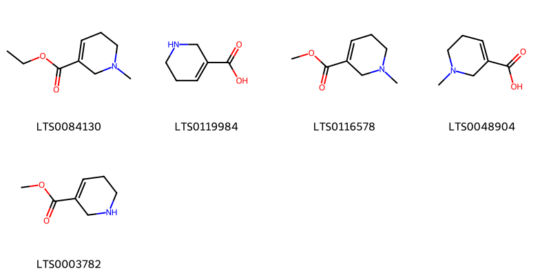
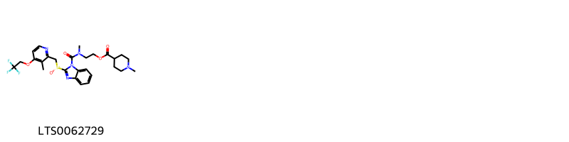
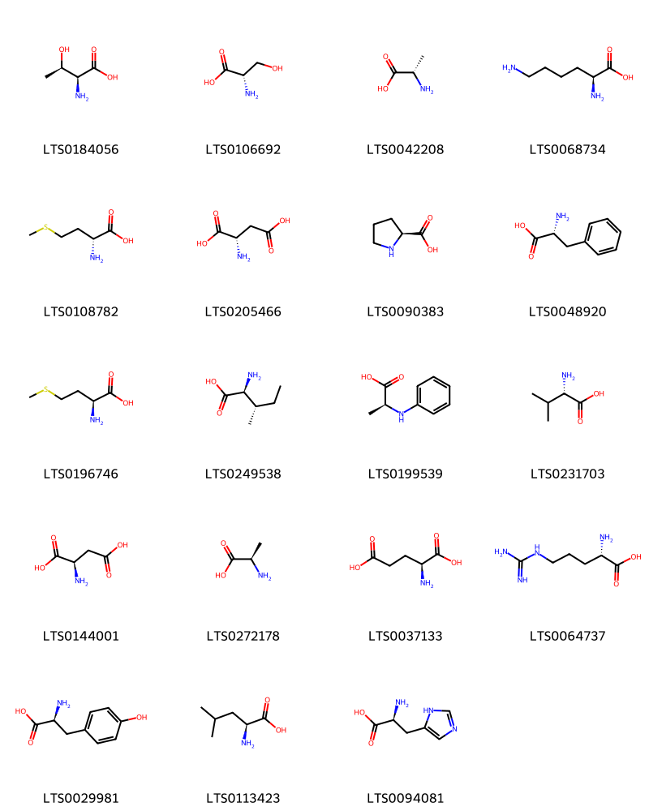
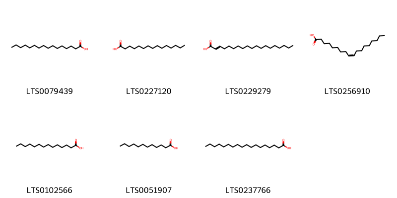
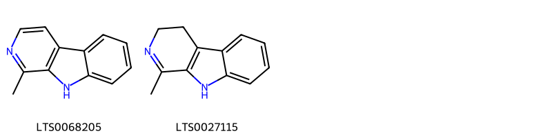
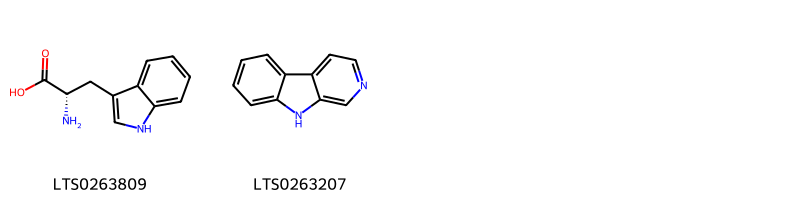
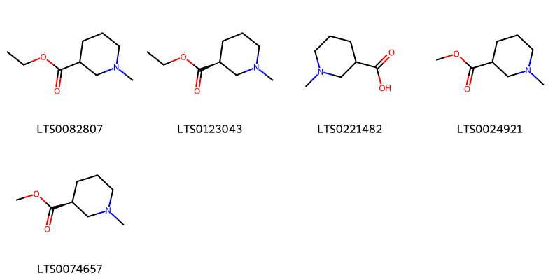

::: {.callout-note title = "Tóm tắt"}

Cau (Pericarpium Arecae catechi) là phần vỏ quả đã bỏ vỏ ngoài (lớp vỏ màu xanh) phơi hay sấy khô của cây Cau (Areca catechu L.), thuộc họ Cau (Arecaceae). Loài này có nguồn gốc từ Philippines và đã được du nhập vào nhiều khu vực, bao gồm châu Á, châu Đại Dương, châu Mỹ và châu Phi. Cây Cau được trồng phổ biến khắp nơi ở nước ta. Trong y học, vỏ cau được sử dụng làm thuốc lợi tiểu với tên vị thuốc là "đại phúc bì" và có tác dụng chữa giun sán. Thành phần hóa học của vỏ cau gồm 15-20% tanin và các ancaloit chính như arecolin, guvacolin, arecaidin, và guvaxin. Arecolin trong vỏ cau gây tiết nước bọt nhiều, tăng bài tiết dịch vị và dịch tràng, làm co nhỏ đồng tử, tim đập chậm (trừ khi có mặt canxi), tăng nhu động ruột.

:::

## I. Thông tin về dược liệu 

::: {.panel-tabset}

### Định danh

- Dược liệu tiếng Việt: Cau - Vỏ
- Dược liệu tiếng Trung: nan (nan)
- Dược liệu tiếng Anh: nan
- Dược liệu latin thông dụng: Pericarpium Arecae Catechi
- Dược liệu latin kiểu DĐVN: *Herba Abutili Indici*
- Dược liệu latin kiểu DĐVN: *nan*
- Dược liệu latin kiểu thông tư: *nan*
- Bộ phận dùng: Vỏ (Pericarpium)

### Mô tả dược liệu 

**Theo dược điển Việt nam V:** nan 
 
**Mô tả dược liệu theo thông tư chế biến dược liệu theo phương pháp cổ truyền:** nan

### Chế biến 

**Chế biến theo dược điển việt nam V**: nan 

**Chế biến theo thông tư:** nan

::: 

## II. Thông tin về thực vật

Dược liệu **Cau - Vỏ** từ bộ phận **Vỏ** từ loài *Areca catechu*.

**Mô tả thực vật:** Cây cau là một cây có thân mọc thẳng cao chừng 15-20m, đường kính 10-15cm. Toàn thân không có lá mà có nhiều vết lá cũ mọc, chỉ ở ngọn có một chùm lá to rộng xẻ lông chim. Lá có bẹ to. Mo ở bông mo sớm rụng. Trong cụm hoa hoa đực ở trên, hoa cái ở dưới. Hoa đực nhỏ màu trắng, thơm gồm 3 lá đài màu lục, 3 cánh hoa trắng, 6 nhị. Hoa cái to, bao hoa không phân hóa. Noãn sào thượng 3 ô. Quả hạch hình trứng to bằng quả trứng gà. Quả bì có sợi, hạt có nội nhũ xếp cuốn. Hạt hơi hình nón cụt, đầu tròn giữa dáy hơi lõm, màu nâu nhạt, vị chát.

*Tài liệu tham khảo:* "Những cây thuốc và vị thuốc Việt Nam" - Đỗ Tất Lợi 
Trong dược điển Việt nam, loài *Areca catechu* được sử dụng làm dược liệu.

            
::: {.callout-note title = "Phân loại thực vật của *Areca catechu*"}

**Kingdom:** Plantae 

**Phylum:** Tracheophyta 

**Order:** Arecales 
 
**Family:** Arecaceae 
 
**Genus:** Areca 
 
**Species:** *Areca catechu* 
 

:::

::: {style="display: grid;grid-template-columns: repeat(auto-fill, minmax(150px, 1fr));grid-gap: 1em;"}
{ group="GIBF" }

{ group="GIBF" }

{ group="GIBF" }

{ group="GIBF" }

{ group="GIBF" }
:::

**Phân bố trên thế giới:** nan, Micronesia (Federated States of), Bhutan, Solomon Islands, Mayotte, Singapore, Sri Lanka, French Polynesia, Seychelles, Chinese Taipei, Colombia, Papua New Guinea, Timor-Leste, Cambodia, Bangladesh, South Africa, Indonesia, Grenada, Madagascar, Myanmar, Trinidad and Tobago, India, Palau, Costa Rica, Viet Nam, Guam, Thailand, United States of America, Philippines, China, Comoros, Dominican Republic, Fiji, Malaysia, Maldives, Puerto Rico

**Phân bố tại Việt nam:** Gia Lai, Hà Nội, Ninh Bình

<iframe src="Pericarpium Arecae Catechi/map_distribution.html" width="100%" height="600" style="border:none;"></iframe>

## III. Thành phần hóa học

Theo tài liệu của GS. Đỗ Tất Lợi:  (1) Tỷ lệ tanin trong vỏ cau khoảng 15-20%.
Hoạt chất chính là 4 ancaloit: Arecolin C3H13NO2, guvacolin C7H11NO2, arecaidin C7H11NO2, guvaxin C6H9NO2.
(2) Trong dược điển Hồng Kông, hoạt chất chính của vỏ cau là Arecolin
    

Theo cơ sở dữ liệu lotus, loài *Areca catechu* đã phân lập và xác định được **65** hoạt chất thuộc về các nhóm Pyridines and derivatives, Benzimidazoles, Harmala alkaloids, Flavonoids, Piperidines, Carboxylic acids and derivatives, Indoles and derivatives, Fatty Acyls trong bảng dưới đây.
        
| chemicalTaxonomyClassyfireClass   |   smiles_count |
|:----------------------------------|---------------:|
|                                   |             88 |
| Benzimidazoles                    |             75 |
| Carboxylic acids and derivatives  |            398 |
| Fatty Acyls                       |            151 |
| Flavonoids                        |           2177 |
| Harmala alkaloids                 |             47 |
| Indoles and derivatives           |             56 |
| Piperidines                       |             99 |
| Pyridines and derivatives         |             81 |

Danh sách chi tiết các hoạt chất như sau: 

::: {style="display: grid;grid-template-columns: repeat(auto-fill, minmax(150px, 1fr));grid-gap: 1em;"}

                                                              
{ group="compound" description="Cấu trúc hóa học của các hoạt chất thuộc nhóm ** là ethyl 1-methyl-5,6-dihydro-2h-pyridine-3-carboxylate [(LTS0084130)](https://lotus.naturalproducts.net/compound/lotus_id/LTS0084130), guvacine [(LTS0119984)](https://lotus.naturalproducts.net/compound/lotus_id/LTS0119984), arecoline [(LTS0116578)](https://lotus.naturalproducts.net/compound/lotus_id/LTS0116578), arecaidine [(LTS0048904)](https://lotus.naturalproducts.net/compound/lotus_id/LTS0048904), guvacoline [(LTS0003782)](https://lotus.naturalproducts.net/compound/lotus_id/LTS0003782)." }

                                                              
{ group="compound" description="Cấu trúc hóa học của các hoạt chất thuộc nhóm *Benzimidazoles* là 2-[methyl(2-[(r)-[3-methyl-4-(2,2,2-trifluoroethoxy)pyridin-2-yl]methanesulfinyl]-1,3-benzodiazole-1-carbonyl)amino]ethyl 1-methylpiperidine-4-carboxylate [(LTS0062729)](https://lotus.naturalproducts.net/compound/lotus_id/LTS0062729)." }

                                                              
{ group="compound" description="Cấu trúc hóa học của các hoạt chất thuộc nhóm *Carboxylic acids and derivatives* là l-threonine [(LTS0184056)](https://lotus.naturalproducts.net/compound/lotus_id/LTS0184056), l-serine [(LTS0106692)](https://lotus.naturalproducts.net/compound/lotus_id/LTS0106692), l-alanine [(LTS0042208)](https://lotus.naturalproducts.net/compound/lotus_id/LTS0042208), l-lysine [(LTS0068734)](https://lotus.naturalproducts.net/compound/lotus_id/LTS0068734), d-methionine [(LTS0108782)](https://lotus.naturalproducts.net/compound/lotus_id/LTS0108782), l-aspartic acid [(LTS0205466)](https://lotus.naturalproducts.net/compound/lotus_id/LTS0205466), l-proline [(LTS0090383)](https://lotus.naturalproducts.net/compound/lotus_id/LTS0090383), d-phenylalanine [(LTS0048920)](https://lotus.naturalproducts.net/compound/lotus_id/LTS0048920), l-methionine [(LTS0196746)](https://lotus.naturalproducts.net/compound/lotus_id/LTS0196746), l-isoleucine [(LTS0249538)](https://lotus.naturalproducts.net/compound/lotus_id/LTS0249538), (2s)-2-(phenylamino)propanoic acid [(LTS0199539)](https://lotus.naturalproducts.net/compound/lotus_id/LTS0199539), l-valine [(LTS0231703)](https://lotus.naturalproducts.net/compound/lotus_id/LTS0231703), d-aspartic acid [(LTS0144001)](https://lotus.naturalproducts.net/compound/lotus_id/LTS0144001), d-alanine [(LTS0272178)](https://lotus.naturalproducts.net/compound/lotus_id/LTS0272178), l-glutamic acid [(LTS0037133)](https://lotus.naturalproducts.net/compound/lotus_id/LTS0037133), l-arginine [(LTS0064737)](https://lotus.naturalproducts.net/compound/lotus_id/LTS0064737), l-tyrosine [(LTS0029981)](https://lotus.naturalproducts.net/compound/lotus_id/LTS0029981), l-leucine [(LTS0113423)](https://lotus.naturalproducts.net/compound/lotus_id/LTS0113423), l-histidine [(LTS0094081)](https://lotus.naturalproducts.net/compound/lotus_id/LTS0094081)." }

                                                              
{ group="compound" description="Cấu trúc hóa học của các hoạt chất thuộc nhóm *Fatty Acyls* là palmitic acid [(LTS0079439)](https://lotus.naturalproducts.net/compound/lotus_id/LTS0079439), pentadecanoic acid [(LTS0227120)](https://lotus.naturalproducts.net/compound/lotus_id/LTS0227120), nonadec-2-enoic acid [(LTS0229279)](https://lotus.naturalproducts.net/compound/lotus_id/LTS0229279), oleic acid [(LTS0256910)](https://lotus.naturalproducts.net/compound/lotus_id/LTS0256910), myristic acid [(LTS0102566)](https://lotus.naturalproducts.net/compound/lotus_id/LTS0102566), lauric acid [(LTS0051907)](https://lotus.naturalproducts.net/compound/lotus_id/LTS0051907), stearic acid [(LTS0237766)](https://lotus.naturalproducts.net/compound/lotus_id/LTS0237766)." }

                                                              
{ group="compound" description="Cấu trúc hóa học của các hoạt chất thuộc nhóm *Flavonoids* là (+)-catechol [(LTS0117079)](https://lotus.naturalproducts.net/compound/lotus_id/LTS0117079), 2-(3,4-dihydroxyphenyl)-8-[2-(3,4-dihydroxyphenyl)-3,5,7-trihydroxy-3,4-dihydro-2h-1-benzopyran-4-yl]-4-[2-(3,4-dihydroxyphenyl)-4-[2-(3,4-dihydroxyphenyl)-3,5,7-trihydroxy-3,4-dihydro-2h-1-benzopyran-8-yl]-3,5,7-trihydroxy-3,4-dihydro-2h-1-benzopyran-8-yl]-3,4-dihydro-2h-1-benzopyran-3,5,7-triol [(LTS0039604)](https://lotus.naturalproducts.net/compound/lotus_id/LTS0039604), arecatannin b1 [(LTS0091361)](https://lotus.naturalproducts.net/compound/lotus_id/LTS0091361), 2-(3,4-dihydroxyphenyl)-4-[2-(3,4-dihydroxyphenyl)-3,5,7-trihydroxy-3,4-dihydro-2h-1-benzopyran-6-yl]-3,4-dihydro-2h-1-benzopyran-3,5,7-triol [(LTS0072400)](https://lotus.naturalproducts.net/compound/lotus_id/LTS0072400), (2r,3r,4s)-2-(3,4-dihydroxyphenyl)-4-[(2r,3s)-2-(3,4-dihydroxyphenyl)-3,5,7-trihydroxy-3,4-dihydro-2h-1-benzopyran-6-yl]-3,4-dihydro-2h-1-benzopyran-3,5,7-triol [(LTS0105674)](https://lotus.naturalproducts.net/compound/lotus_id/LTS0105674), (2r,3r,4r)-2-(3,4-dihydroxyphenyl)-8-[(2r,3r,4r)-2-(3,4-dihydroxyphenyl)-3,5,7-trihydroxy-3,4-dihydro-2h-1-benzopyran-4-yl]-4-[(2r,3r,4s)-2-(3,4-dihydroxyphenyl)-4-[(2r,3s)-2-(3,4-dihydroxyphenyl)-3,5,7-trihydroxy-3,4-dihydro-2h-1-benzopyran-6-yl]-3,5,7-trihydroxy-3,4-dihydro-2h-1-benzopyran-8-yl]-3,4-dihydro-2h-1-benzopyran-3,5,7-triol [(LTS0037836)](https://lotus.naturalproducts.net/compound/lotus_id/LTS0037836), (2r,3s,4s)-2-(3,4-dihydroxyphenyl)-4-[(2r,3r)-2-(3,4-dihydroxyphenyl)-3,5,7-trihydroxy-3,4-dihydro-2h-1-benzopyran-8-yl]-3,4-dihydro-2h-1-benzopyran-3,5,7-triol [(LTS0116257)](https://lotus.naturalproducts.net/compound/lotus_id/LTS0116257), 2-(3,4-dihydroxyphenyl)-8-[2-(3,4-dihydroxyphenyl)-3,5,7-trihydroxy-3,4-dihydro-2h-1-benzopyran-4-yl]-4-[2-(3,4-dihydroxyphenyl)-4-[2-(3,4-dihydroxyphenyl)-3,5,7-trihydroxy-3,4-dihydro-2h-1-benzopyran-6-yl]-3,5,7-trihydroxy-3,4-dihydro-2h-1-benzopyran-8-yl]-3,4-dihydro-2h-1-benzopyran-3,5,7-triol [(LTS0039478)](https://lotus.naturalproducts.net/compound/lotus_id/LTS0039478), (2r,3r,4r)-2-(3,4-dihydroxyphenyl)-8-[(2r,3r,4r)-2-(3,4-dihydroxyphenyl)-3,5,7-trihydroxy-3,4-dihydro-2h-1-benzopyran-4-yl]-4-[(2r,3r,4s)-2-(3,4-dihydroxyphenyl)-4-[(2r,3s)-2-(3,4-dihydroxyphenyl)-3,5,7-trihydroxy-3,4-dihydro-2h-1-benzopyran-8-yl]-3,5,7-trihydroxy-3,4-dihydro-2h-1-benzopyran-8-yl]-3,4-dihydro-2h-1-benzopyran-3,5,7-triol [(LTS0111899)](https://lotus.naturalproducts.net/compound/lotus_id/LTS0111899), (2r,3r,4r)-2-(3,4-dihydroxyphenyl)-4-[(2r,3r)-2-(3,4-dihydroxyphenyl)-3,5,7-trihydroxy-3,4-dihydro-2h-1-benzopyran-8-yl]-3,4-dihydro-2h-1-benzopyran-3,5,7-triol [(LTS0135510)](https://lotus.naturalproducts.net/compound/lotus_id/LTS0135510), arecatannin b1 [(LTS0143493)](https://lotus.naturalproducts.net/compound/lotus_id/LTS0143493), (2r,3r)-2-(3,4-dihydroxyphenyl)-4-[(2r,3r)-2-(3,4-dihydroxyphenyl)-3,5,7-trihydroxy-3,4-dihydro-2h-1-benzopyran-8-yl]-3,4-dihydro-2h-1-benzopyran-3,5,7-triol [(LTS0097406)](https://lotus.naturalproducts.net/compound/lotus_id/LTS0097406), procyanidin c2 [(LTS0226053)](https://lotus.naturalproducts.net/compound/lotus_id/LTS0226053), procyanidin c1 [(LTS0260445)](https://lotus.naturalproducts.net/compound/lotus_id/LTS0260445), 2-(3,4-dihydroxyphenyl)-4-[2-(3,4-dihydroxyphenyl)-3,5,7-trihydroxy-3,4-dihydro-2h-1-benzopyran-8-yl]-3,4-dihydro-2h-1-benzopyran-3,5,7-triol [(LTS0040252)](https://lotus.naturalproducts.net/compound/lotus_id/LTS0040252), (2r,3r,4r)-2-(3,4-dihydroxyphenyl)-4-[(2r,3s)-2-(3,4-dihydroxyphenyl)-3,5,7-trihydroxy-3,4-dihydro-2h-1-benzopyran-8-yl]-3,4-dihydro-2h-1-benzopyran-3,5,7-triol [(LTS0066122)](https://lotus.naturalproducts.net/compound/lotus_id/LTS0066122), (2r,3r,4s)-2-(3,4-dihydroxyphenyl)-8-[(2r,3r,4r)-2-(3,4-dihydroxyphenyl)-3,5,7-trihydroxy-3,4-dihydro-2h-1-benzopyran-4-yl]-4-[(2r,3s)-2-(3,4-dihydroxyphenyl)-3,5,7-trihydroxy-3,4-dihydro-2h-1-benzopyran-8-yl]-3,4-dihydro-2h-1-benzopyran-3,5,7-triol [(LTS0027230)](https://lotus.naturalproducts.net/compound/lotus_id/LTS0027230), catechol [(LTS0090912)](https://lotus.naturalproducts.net/compound/lotus_id/LTS0090912), ent-epicatechin [(LTS0265245)](https://lotus.naturalproducts.net/compound/lotus_id/LTS0265245)." }

                                                              
{ group="compound" description="Cấu trúc hóa học của các hoạt chất thuộc nhóm *Harmala alkaloids* là harmane [(LTS0068205)](https://lotus.naturalproducts.net/compound/lotus_id/LTS0068205), 1-methyl-3h,4h,9h-pyrido[3,4-b]indole [(LTS0027115)](https://lotus.naturalproducts.net/compound/lotus_id/LTS0027115)." }

                                                              
{ group="compound" description="Cấu trúc hóa học của các hoạt chất thuộc nhóm *Indoles and derivatives* là l-tryptophan [(LTS0263809)](https://lotus.naturalproducts.net/compound/lotus_id/LTS0263809), β-carboline [(LTS0263207)](https://lotus.naturalproducts.net/compound/lotus_id/LTS0263207)." }

                                                              
{ group="compound" description="Cấu trúc hóa học của các hoạt chất thuộc nhóm *Piperidines* là ethyl 1-methylpiperidine-3-carboxylate [(LTS0082807)](https://lotus.naturalproducts.net/compound/lotus_id/LTS0082807), ethyl (3s)-1-methylpiperidine-3-carboxylate [(LTS0123043)](https://lotus.naturalproducts.net/compound/lotus_id/LTS0123043), 1-methylpiperidine-3-carboxylic acid [(LTS0221482)](https://lotus.naturalproducts.net/compound/lotus_id/LTS0221482), methyl n-methylnipecotate [(LTS0024921)](https://lotus.naturalproducts.net/compound/lotus_id/LTS0024921), methyl (3s)-1-methylpiperidine-3-carboxylate [(LTS0074657)](https://lotus.naturalproducts.net/compound/lotus_id/LTS0074657)." }

                                                              
{ group="compound" description="Cấu trúc hóa học của các hoạt chất thuộc nhóm *Pyridines and derivatives* là ethyl nicotinate [(LTS0116042)](https://lotus.naturalproducts.net/compound/lotus_id/LTS0116042), (-)-nicotine [(LTS0184620)](https://lotus.naturalproducts.net/compound/lotus_id/LTS0184620), nicotine [(LTS0177379)](https://lotus.naturalproducts.net/compound/lotus_id/LTS0177379), heat spray [(LTS0061317)](https://lotus.naturalproducts.net/compound/lotus_id/LTS0061317), niacin [(LTS0216673)](https://lotus.naturalproducts.net/compound/lotus_id/LTS0216673)." }

:::

---

## IV. Tác dụng dược lý

Theo tài liệu quốc tế: nan

---

## V. Dược điển Việt Nam V

### Soi bột

nan

::: {#listing-soibot}
:::

### Vi phẫu

nan

::: {#listing-viphau}
:::

### Định tính

nan

### Định lượng

nan

### Thông tin khác 

- **Độ ẩm:** nan
- **Bảo quản:** nan

## VI. Dược điển Hồng kong

::: {#listing-DDHK}
:::

---

## VII. Y dược học cổ truyền

::: {.callout-note title = "nan" }

**Tên vị thuốc:** nan

**Tính:** nan

**Vị:** nan

**Quy kinh:**  nan

**Công năng chủ trị:** nan

**Phân loại theo thông tư:** nan

**Tác dụng theo y dược cổ truyền:** nan

**Chú ý:** nan

**Kiêng kỵ:** nan 

:::

::: {#listing-ViThuoc}
:::

