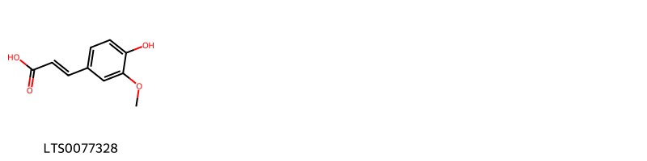
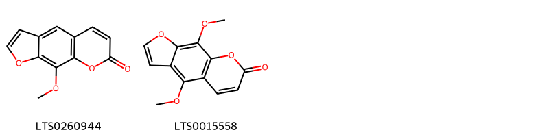
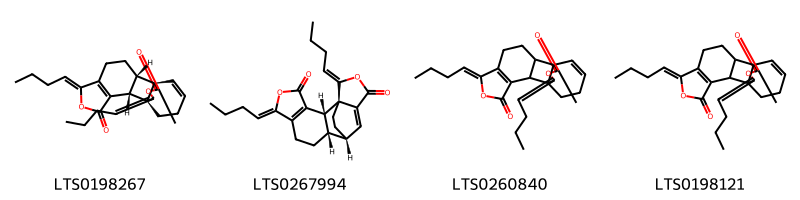
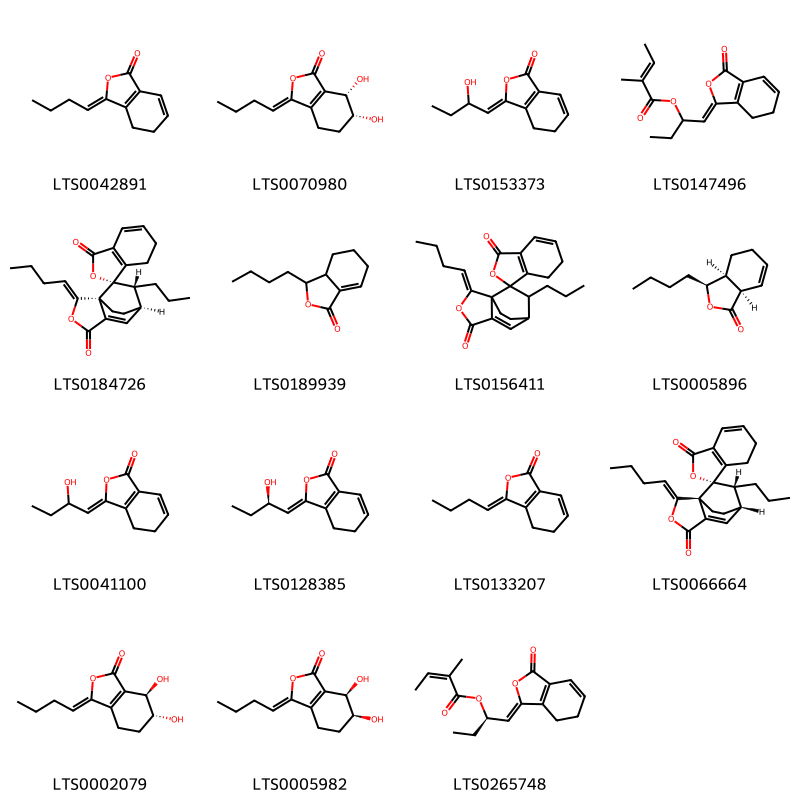
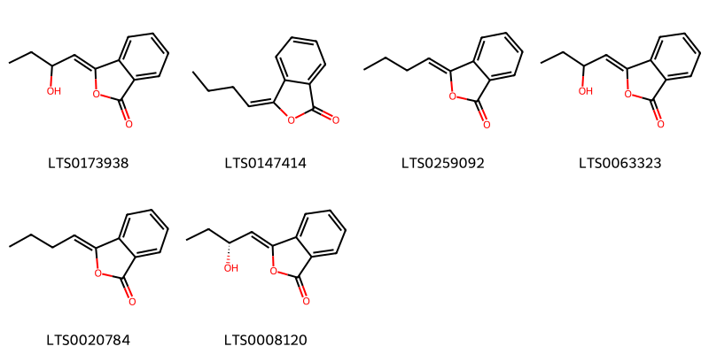
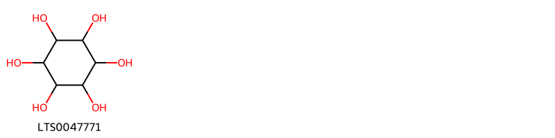

::: {.callout-note title = "Tóm tắt"}

nan

:::

## I. Thông tin về dược liệu 

::: {.panel-tabset}

### Định danh

- Dược liệu tiếng Việt: Đương Quy Di Thực - Rễ
- Dược liệu tiếng Trung: ? (?)
- Dược liệu tiếng Anh: ?
- Dược liệu latin thông dụng: Radix Angelicae Acutilobae
- Dược liệu latin kiểu DĐVN: *Radix Angelicae Acutilobae*
- Dược liệu latin kiểu DĐVN: *Radix Angelicae acutilobae*
- Dược liệu latin kiểu thông tư: *nan*
- Bộ phận dùng: Rễ (Radix)

### Mô tả dược liệu 

**Theo dược điển Việt nam V:** Rễ chính ngắn và mập, dài 10 cm đến 20 cm, đường kính 2 cm trở lên, có nhiều rễ nhánh dài 15 cm đến 20 cm, đường kính 0,2 cm trở lên. Mặt ngoài màu nâu tối, có nhiều nếp nhăn dọc, nhiều sẹo lồi nam ngang là vết tích của rễ con. Mặt cắt ngang màu trắng ngà có vân tròn và nhiều điểm tinh dầu. Mùi thơm hơi hắc, vị ngọt nhẹ, sau hơi cay nóng. 
 
**Mô tả dược liệu theo thông tư chế biến dược liệu theo phương pháp cổ truyền:** nan

### Chế biến 

**Chế biến theo dược điển việt nam V**: Đào lấy rễ củ ở cây trồng được 10-12 tháng, rửa sạch, phơi hay sấy ờ 50 °c đến 60 °c đến khô. 

**Chế biến theo thông tư:** nan

::: 

## II. Thông tin về thực vật

Dược liệu **Đương Quy Di Thực - Rễ** từ bộ phận **Rễ** từ loài *Angelica acutiloba*.

**Mô tả thực vật:** nan

*Tài liệu tham khảo:* nan 
Trong dược điển Việt nam, loài *Angelica acutiloba* được sử dụng làm dược liệu.

            
::: {.callout-note title = "Phân loại thực vật của *Angelica acutiloba*"}

**Kingdom:** Plantae 

**Phylum:** Tracheophyta 

**Order:** Apiales 
 
**Family:** Apiaceae 
 
**Genus:** Angelica 
 
**Species:** *Angelica acutiloba* 
 

:::

::: {style="display: grid;grid-template-columns: repeat(auto-fill, minmax(150px, 1fr));grid-gap: 1em;"}
{ group="GIBF" }

{ group="GIBF" }

{ group="GIBF" }

{ group="GIBF" }

{ group="GIBF" }

{ group="GIBF" }

{ group="GIBF" }

{ group="GIBF" }

{ group="GIBF" }

{ group="GIBF" }

{ group="GIBF" }
:::

**Phân bố trên thế giới:** nan, United States of America, Chinese Taipei, China, Norway, Japan, Korea, Republic of

**Phân bố tại Việt nam:** Không có ghi nhận ở Việt Nam

<iframe src="Radix Angelicae Acutilobae/map_distribution.html" width="100%" height="600" style="border:none;"></iframe>

## III. Thành phần hóa học

Theo tài liệu của GS. Đỗ Tất Lợi:  nan
    

Theo cơ sở dữ liệu lotus, loài *Angelica acutiloba* đã phân lập và xác định được **33** hoạt chất thuộc về các nhóm Pyridines and derivatives, Cinnamic acids and derivatives, Benzofurans, Dihydrofurans, Purine nucleosides, Organonitrogen compounds, Isobenzofurans, Organooxygen compounds, Isocoumarans, Coumarins and derivatives trong bảng dưới đây.
        
| chemicalTaxonomyClassyfireClass   |   smiles_count |
|:----------------------------------|---------------:|
| Benzofurans                       |             21 |
| Cinnamic acids and derivatives    |             24 |
| Coumarins and derivatives         |             54 |
| Dihydrofurans                     |            240 |
| Isobenzofurans                    |            582 |
| Isocoumarans                      |            154 |
| Organonitrogen compounds          |             14 |
| Organooxygen compounds            |             22 |
| Purine nucleosides                |             47 |
| Pyridines and derivatives         |             14 |

Danh sách chi tiết các hoạt chất như sau: 

::: {style="display: grid;grid-template-columns: repeat(auto-fill, minmax(150px, 1fr));grid-gap: 1em;"}

                                                              
{ group="compound" description="Cấu trúc hóa học của các hoạt chất thuộc nhóm *Benzofurans* là butylphthalide [(LTS0150205)](https://lotus.naturalproducts.net/compound/lotus_id/LTS0150205)." }

                                                              
{ group="compound" description="Cấu trúc hóa học của các hoạt chất thuộc nhóm *Cinnamic acids and derivatives* là ferulic acid [(LTS0077328)](https://lotus.naturalproducts.net/compound/lotus_id/LTS0077328)." }

                                                              
{ group="compound" description="Cấu trúc hóa học của các hoạt chất thuộc nhóm *Coumarins and derivatives* là methoxsalen [(LTS0260944)](https://lotus.naturalproducts.net/compound/lotus_id/LTS0260944), isopimpinellin [(LTS0015558)](https://lotus.naturalproducts.net/compound/lotus_id/LTS0015558)." }

                                                              
{ group="compound" description="Cấu trúc hóa học của các hoạt chất thuộc nhóm *Dihydrofurans* là (1r,2r,6z,10s,11s,16z)-6,16-dibutylidene-5,17-dioxapentacyclo[9.4.3.0¹,¹¹.0²,¹⁰.0³,⁷]octadeca-3(7),12-diene-4,18-dione [(LTS0198267)](https://lotus.naturalproducts.net/compound/lotus_id/LTS0198267), levistolide a [(LTS0267994)](https://lotus.naturalproducts.net/compound/lotus_id/LTS0267994), 6,16-dibutylidene-5,17-dioxapentacyclo[9.4.3.0¹,¹¹.0²,¹⁰.0³,⁷]octadeca-3(7),12-diene-4,18-dione [(LTS0260840)](https://lotus.naturalproducts.net/compound/lotus_id/LTS0260840), (6z,16e)-6,16-dibutylidene-5,17-dioxapentacyclo[9.4.3.0¹,¹¹.0²,¹⁰.0³,⁷]octadeca-3(7),12-diene-4,18-dione [(LTS0198121)](https://lotus.naturalproducts.net/compound/lotus_id/LTS0198121)." }

                                                              
{ group="compound" description="Cấu trúc hóa học của các hoạt chất thuộc nhóm *Isobenzofurans* là (z)-ligustilide [(LTS0042891)](https://lotus.naturalproducts.net/compound/lotus_id/LTS0042891), (6r,7s)-3-butylidene-6,7-dihydroxy-4,5,6,7-tetrahydro-2-benzofuran-1-one [(LTS0070980)](https://lotus.naturalproducts.net/compound/lotus_id/LTS0070980), (3z)-3-(2-hydroxybutylidene)-4,5-dihydro-2-benzofuran-1-one [(LTS0153373)](https://lotus.naturalproducts.net/compound/lotus_id/LTS0153373), 1-(3-oxo-6,7-dihydro-2-benzofuran-1-ylidene)butan-2-yl 2-methylbut-2-enoate [(LTS0147496)](https://lotus.naturalproducts.net/compound/lotus_id/LTS0147496), (1s,1's,2'z,7'r,8'r)-2'-butylidene-8'-propyl-6,7-dihydro-3'-oxaspiro[2-benzofuran-1,9'-tricyclo[5.2.2.0¹,⁵]undecan]-5'-ene-3,4'-dione [(LTS0184726)](https://lotus.naturalproducts.net/compound/lotus_id/LTS0184726), sedanolide [(LTS0189939)](https://lotus.naturalproducts.net/compound/lotus_id/LTS0189939), 2'-butylidene-8'-propyl-6,7-dihydro-3'-oxaspiro[2-benzofuran-1,9'-tricyclo[5.2.2.0¹,⁵]undecan]-5'-ene-3,4'-dione [(LTS0156411)](https://lotus.naturalproducts.net/compound/lotus_id/LTS0156411), cnidilide [(LTS0005896)](https://lotus.naturalproducts.net/compound/lotus_id/LTS0005896), 3-(2-hydroxybutylidene)-4,5-dihydro-2-benzofuran-1-one [(LTS0041100)](https://lotus.naturalproducts.net/compound/lotus_id/LTS0041100), (3z)-3-[(2r)-2-hydroxybutylidene]-4,5-dihydro-2-benzofuran-1-one [(LTS0128385)](https://lotus.naturalproducts.net/compound/lotus_id/LTS0128385), 3-butylidene-4,5-dihydro-2-benzofuran-1-one [(LTS0133207)](https://lotus.naturalproducts.net/compound/lotus_id/LTS0133207), (1s,1'r,2'z,7's,8'r)-2'-butylidene-8'-propyl-6,7-dihydro-3'-oxaspiro[2-benzofuran-1,9'-tricyclo[5.2.2.0¹,⁵]undecan]-5'-ene-3,4'-dione [(LTS0066664)](https://lotus.naturalproducts.net/compound/lotus_id/LTS0066664), (6r,7r)-3-butylidene-6,7-dihydroxy-4,5,6,7-tetrahydro-2-benzofuran-1-one [(LTS0002079)](https://lotus.naturalproducts.net/compound/lotus_id/LTS0002079), (3z,6s,7r)-3-butylidene-6,7-dihydroxy-4,5,6,7-tetrahydro-2-benzofuran-1-one [(LTS0005982)](https://lotus.naturalproducts.net/compound/lotus_id/LTS0005982), (2r)-1-[(1z)-3-oxo-6,7-dihydro-2-benzofuran-1-ylidene]butan-2-yl (2z)-2-methylbut-2-enoate [(LTS0265748)](https://lotus.naturalproducts.net/compound/lotus_id/LTS0265748)." }

                                                              
{ group="compound" description="Cấu trúc hóa học của các hoạt chất thuộc nhóm *Isocoumarans* là (3z)-3-(2-hydroxybutylidene)-2-benzofuran-1-one [(LTS0173938)](https://lotus.naturalproducts.net/compound/lotus_id/LTS0173938), butylidenephthalide [(LTS0147414)](https://lotus.naturalproducts.net/compound/lotus_id/LTS0147414), butylidenephthalide [(LTS0259092)](https://lotus.naturalproducts.net/compound/lotus_id/LTS0259092), 3-(2-hydroxybutylidene)-2-benzofuran-1-one [(LTS0063323)](https://lotus.naturalproducts.net/compound/lotus_id/LTS0063323), z-butylidenephthalide [(LTS0020784)](https://lotus.naturalproducts.net/compound/lotus_id/LTS0020784), (3z)-3-[(2r)-2-hydroxybutylidene]-2-benzofuran-1-one [(LTS0008120)](https://lotus.naturalproducts.net/compound/lotus_id/LTS0008120)." }

                                                              
{ group="compound" description="Cấu trúc hóa học của các hoạt chất thuộc nhóm *Organonitrogen compounds* là choline [(LTS0170307)](https://lotus.naturalproducts.net/compound/lotus_id/LTS0170307)." }

                                                              
{ group="compound" description="Cấu trúc hóa học của các hoạt chất thuộc nhóm *Organooxygen compounds* là (-)-inositol [(LTS0047771)](https://lotus.naturalproducts.net/compound/lotus_id/LTS0047771)." }

                                                              
{ group="compound" description="Cấu trúc hóa học của các hoạt chất thuộc nhóm *Purine nucleosides* là adenosine [(LTS0014061)](https://lotus.naturalproducts.net/compound/lotus_id/LTS0014061)." }

                                                              
{ group="compound" description="Cấu trúc hóa học của các hoạt chất thuộc nhóm *Pyridines and derivatives* là niacin [(LTS0216673)](https://lotus.naturalproducts.net/compound/lotus_id/LTS0216673)." }

:::

---

## IV. Tác dụng dược lý

Theo tài liệu quốc tế: nan

---

## V. Dược điển Việt Nam V

### Soi bột

Bột có màu vàng nâu, mùi thơm, vị cay. Soi dưới kính hiển vi thấy: Có nhiều hạt tinh bột hình tròn hay hình trứng nhỏ đứng riêng lẻ hay từng đám, đường kính từ 5 pm đến 20 pm. Mảnh mạch mạng, mạch xoắn, mạch điểm. Mảnh mô mềm có nhiều hạt tinh bột, rải rác có các giọt dầu màu vàng nhạt.

::: {#listing-soibot}
:::

### Vi phẫu

Mặt cắt ngang hình tròn, từ ngoài vào trong có: Lớp bần gồm nhiều hàng tế bào hình chữ nhật thành dày xếp thành vòng đồng tâm và dãy xuyên tâm. Mô mềm vỏ gồm những tế bào thành mỏng, lớp phía ngoài thường bị ép bẹp, méo mó, rải rác có các khuyết tế bào hình dạng khác nhau. Thỉnh thoảng có các ống tiết tinh dầu nằm rải rác trong mô mềm vỏ và libe. Libe-gỗ bị phân cách bởi các tia ruột tạo thành các bó dài riêng biệt. Tầng sinh libe-gỗ tạo thành vòng liên tục. Tia ruột gồm 2 đến 3 hàng tế bao xếp theo hướng xuyên tâm.

::: {#listing-viphau}
:::

### Định tính

Bột dược liệu phát quang dưới ánh sáng tử ngoại ở bước sóng 366 nm. Phương pháp sắc ký lớp mỏng (Phụ lục 5.4). Bản mỏng: Silicagel 60F254. Dung môi khai triển: Cyclohexan – ethyl acetat – aceton (7:2: 1). Dung dịch thử: Lấy 2 g bột dươc liệu thêm 20 ml aceton (77), lắc thật kỹ (lắc trên máy lắc) trong 1 h. Lọc. Bốc hơi dịch lọc đến khô. Hòa tan cắn trong 1 ml cloroform (77). Dung dịch đối chiếu: Lấy 2 g Đương qui di thực (mẫu chuẩn), tiến hành chiết như mô tả ở phần Dung dịch thử. Cách tiến hành: Chấm riêng biệt lên bản mỏng 10 pl mỗi dung dịch trên. Sau khi triển khai sắc ký, lấy bản mỏng ra, để khô ở nhiệt độ phòng. Quan sát dưới ánh sáng tử ngoại ở bước sóng 366 nm, trên sắc ký đồ của dung dịch thử phải cho các vết phát quang xanh lơ sáng có cùng màu sắc và giá trị Rf với các vết trên sắc ký đồ của dung dịch đối chiếu. Sau đó phun dung dịch kali hydroxyd 1 M trong ethanol (TT), các vết này phát quang mạnh hơn.

### Định lượng

Chất chiết được trong dược liệu Không ít hơn 35,0 % tính theo dược liệu khô kiệt. Tiến hành theo phương pháp chiết nóng (Phụ lục 12.10). dùng ethanol 50 % (TT) làm dung môi. Định lượng Tiến hành theo phương pháp định lượng tinh dầu trong dược liệu (Phụ lục 12.7). Dùng 50 g bột dược liệu (qua rây số 355), thêm 250 ml nước, một ít đá bọt và 75 ml glycerin (TT), cất trong 4 h (khi cất phải tăng nhiệt độ dần dần để tránh bị trào do tạo bọt), Hàm lượng tinh dầu trong dược liệu không được ít hơn 0,1 % tính theo dược liệu khô kiệt

### Thông tin khác 

- **Độ ẩm:** Không quá 15,0 % (Phụ lục 12.13).
- **Bảo quản:** Để nơi khô mát, tránh ẩm, mốc mọt.

## VI. Dược điển Hồng kong

::: {#listing-DDHK}
:::

---

## VII. Y dược học cổ truyền

::: {.callout-note title = "nan" }

**Tên vị thuốc:** nan

**Tính:** nan

**Vị:** nan

**Quy kinh:**  nan

**Công năng chủ trị:** Cam, tân, ôn. Vào các kinh can, tâm, ty.

**Phân loại theo thông tư:** nan

**Tác dụng theo y dược cổ truyền:** nan

**Chú ý:** nan

**Kiêng kỵ:** nan 

:::

::: {#listing-ViThuoc}
:::

