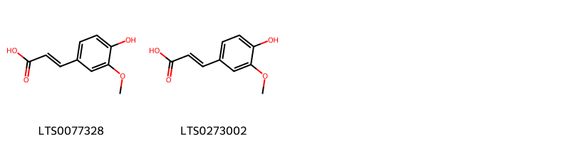
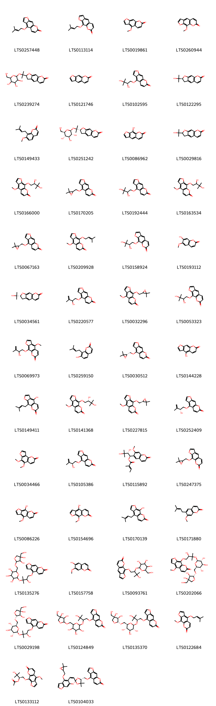
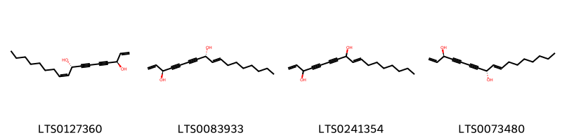
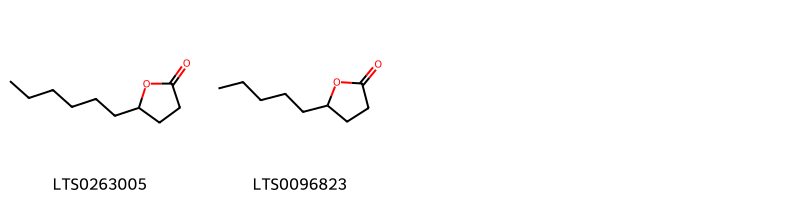
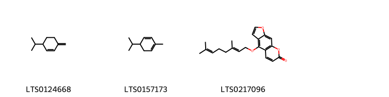
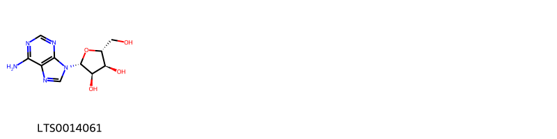
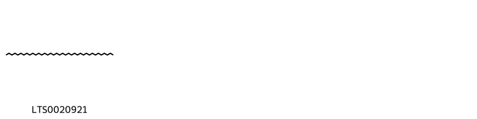
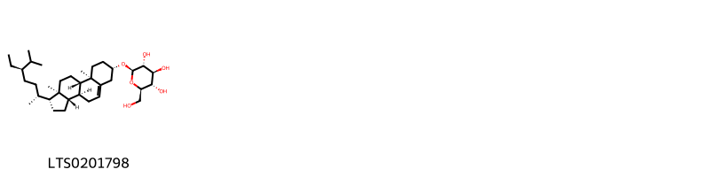

::: {.callout-note title = "Tóm tắt"}

nan

:::

## I. Thông tin về dược liệu 

::: {.panel-tabset}

### Định danh

- Dược liệu tiếng Việt: Bạch Chỉ - Rễ
- Dược liệu tiếng Trung: 白芷 (Bai Zhi)
- Dược liệu tiếng Anh: Angelica Dahurica [Syn. Angelica Porphyrocaulis]
- Dược liệu latin thông dụng: Radix Angelicae Dahuricae
- Dược liệu latin kiểu DĐVN: *Folium Clerodendri Chinense*
- Dược liệu latin kiểu DĐVN: *nan*
- Dược liệu latin kiểu thông tư: *Radix Angelicae dahuricae*
- Bộ phận dùng: Rễ (Radix)

### Mô tả dược liệu 

**Theo dược điển Việt nam V:** Rễ hình chùy, thẳng hay cong, dài 10 cm đến 20 cm, đường kính phần to có thể đến 3 cm, phần cuối thon nhỏ dần. Mặt ngoài củ có màu vàng nâu nhạt, còn dấu vết của rễ con đã cắt bỏ có nhiều vết nhăn dọc và nhiều lỗ vỏ lồi lên thành những vết sần ngang. Mặt cắt ngang có màu trắng hay trắng ngà, tầng sinh libe-gỗ rõ rệt. Thể chất cứng, vết bẻ lởm  chởm, nhiều bột. Mùi thơm hắc, vị cay hơi đắng. Dược liệu sau khi đã chế biến là những phiến dày gân tròn. Mặt ngoài màu nâu xám hoặc nâu vàng. Mặt bẻ gẫy màu trắng hoặc trắng xám, có tinh bột, có vòng màu nâu gân tròn hoặc thuôn (của tầng phát sinh libe-gỗ), rải rác có các chấm (nốt) chứa tinh dầu. Mùi thơm, vị cay hơi đắng. 
 
**Mô tả dược liệu theo thông tư chế biến dược liệu theo phương pháp cổ truyền:** nan

### Chế biến 

**Chế biến theo dược điển việt nam V**: Thu hoạch vào mùa hạ, thu. Khi trời khô ráo, đào lấy rễ cù (tránh làm sây sát và gãy, không lấy củ ờ cây ra hoa kết quả). Rửa nhanh, cất bò rễ con, phân riêng các rễ củ có kích thước như nhau. Phơi nắng hay sấy ờ 40 ºC đến 50 ºC cho đến khô. Bào chế bạch chỉ Loại bỏ tạp chất, phân loại to nhỏ, ngâm qua, ủ mềm, thái lát dày, phơi khô trong râm hay sấy nhẹ đến khô. Khi dùng, thái phiến dài 3 cm đến 5 cm, dày 1 mm đến 3 mm. Vi sao. 

**Chế biến theo thông tư:** nan

::: 

## II. Thông tin về thực vật

Dược liệu **Bạch Chỉ - Rễ** từ bộ phận **Rễ** từ loài *Angelica dahurica*.

**Mô tả thực vật:** nan

*Tài liệu tham khảo:* nan 
Trong dược điển Việt nam, loài *Angelica dahurica* được sử dụng làm dược liệu.

            
::: {.callout-note title = "Phân loại thực vật của *Angelica dahurica*"}

**Kingdom:** Plantae 

**Phylum:** Tracheophyta 

**Order:** Apiales 
 
**Family:** Apiaceae 
 
**Genus:** Angelica 
 
**Species:** *Angelica dahurica* 
 

:::

::: {style="display: grid;grid-template-columns: repeat(auto-fill, minmax(150px, 1fr));grid-gap: 1em;"}
{ group="GIBF" }

{ group="GIBF" }

{ group="GIBF" }

{ group="GIBF" }

{ group="GIBF" }

{ group="GIBF" }

{ group="GIBF" }

{ group="GIBF" }
:::

**Phân bố trên thế giới:** nan, United States of America, Russian Federation, China, Chinese Taipei, Japan, Korea, Republic of, Mongolia

**Phân bố tại Việt nam:** Không có ghi nhận ở Việt Nam

<iframe src="Radix Angelicae Dahuricae/map_distribution.html" width="100%" height="600" style="border:none;"></iframe>

## III. Thành phần hóa học

Theo tài liệu của GS. Đỗ Tất Lợi:  nan
    

Theo cơ sở dữ liệu lotus, loài *Angelica dahurica* đã phân lập và xác định được **82** hoạt chất thuộc về các nhóm Cinnamic acids and derivatives, Purine nucleosides, Steroids and steroid derivatives, Saturated hydrocarbons, Fatty Acyls, Lactones, Prenol lipids, Coumarins and derivatives trong bảng dưới đây.
        
| chemicalTaxonomyClassyfireClass   |   smiles_count |
|:----------------------------------|---------------:|
| Cinnamic acids and derivatives    |             46 |
| Coumarins and derivatives         |           3311 |
| Fatty Acyls                       |            140 |
| Lactones                          |             33 |
| Prenol lipids                     |             78 |
| Purine nucleosides                |             47 |
| Saturated hydrocarbons            |             37 |
| Steroids and steroid derivatives  |            128 |

Danh sách chi tiết các hoạt chất như sau: 

::: {style="display: grid;grid-template-columns: repeat(auto-fill, minmax(150px, 1fr));grid-gap: 1em;"}

                                                              
{ group="compound" description="Cấu trúc hóa học của các hoạt chất thuộc nhóm *Cinnamic acids and derivatives* là ferulic acid [(LTS0077328)](https://lotus.naturalproducts.net/compound/lotus_id/LTS0077328), ferulic acid [(LTS0273002)](https://lotus.naturalproducts.net/compound/lotus_id/LTS0273002)." }

                                                              
{ group="compound" description="Cấu trúc hóa học của các hoạt chất thuộc nhóm *Coumarins and derivatives* là isoimperatorin [(LTS0257448)](https://lotus.naturalproducts.net/compound/lotus_id/LTS0257448), imperatorin [(LTS0113114)](https://lotus.naturalproducts.net/compound/lotus_id/LTS0113114), bergapten [(LTS0019861)](https://lotus.naturalproducts.net/compound/lotus_id/LTS0019861), methoxsalen [(LTS0260944)](https://lotus.naturalproducts.net/compound/lotus_id/LTS0260944), 2-(2-{[3,4,5-trihydroxy-6-(hydroxymethyl)oxan-2-yl]oxy}propan-2-yl)-2h,3h-furo[3,2-g]chromen-7-one [(LTS0239274)](https://lotus.naturalproducts.net/compound/lotus_id/LTS0239274), psoralen [(LTS0121746)](https://lotus.naturalproducts.net/compound/lotus_id/LTS0121746), (r)-oxypeucedanin hydrate [(LTS0102595)](https://lotus.naturalproducts.net/compound/lotus_id/LTS0102595), marmesin [(LTS0122295)](https://lotus.naturalproducts.net/compound/lotus_id/LTS0122295), osthole [(LTS0149433)](https://lotus.naturalproducts.net/compound/lotus_id/LTS0149433), nodakenin [(LTS0251242)](https://lotus.naturalproducts.net/compound/lotus_id/LTS0251242), xanthotoxol [(LTS0086962)](https://lotus.naturalproducts.net/compound/lotus_id/LTS0086962), marmesin [(LTS0029816)](https://lotus.naturalproducts.net/compound/lotus_id/LTS0029816), byakangelicin [(LTS0166000)](https://lotus.naturalproducts.net/compound/lotus_id/LTS0166000), 4-[(3,3-dimethyloxiran-2-yl)methoxy]furo[3,2-g]chromen-7-one [(LTS0170205)](https://lotus.naturalproducts.net/compound/lotus_id/LTS0170205), 4-(2,3-dihydroxy-3-methylbutoxy)furo[3,2-g]chromen-7-one [(LTS0192444)](https://lotus.naturalproducts.net/compound/lotus_id/LTS0192444), 9-(2,3-dihydroxy-3-methylbutoxy)-4-methoxyfuro[3,2-g]chromen-7-one [(LTS0163534)](https://lotus.naturalproducts.net/compound/lotus_id/LTS0163534), (+)-oxypeucedanin [(LTS0067163)](https://lotus.naturalproducts.net/compound/lotus_id/LTS0067163), phellopterin [(LTS0209928)](https://lotus.naturalproducts.net/compound/lotus_id/LTS0209928), heraclenol [(LTS0158924)](https://lotus.naturalproducts.net/compound/lotus_id/LTS0158924), scopoletin [(LTS0193112)](https://lotus.naturalproducts.net/compound/lotus_id/LTS0193112), (-)-marmesin [(LTS0034561)](https://lotus.naturalproducts.net/compound/lotus_id/LTS0034561), 4-[(2-hydroxy-3-methylbut-3-en-1-yl)oxy]furo[3,2-g]chromen-7-one [(LTS0220577)](https://lotus.naturalproducts.net/compound/lotus_id/LTS0220577), 9-[(3,3-dimethyloxiran-2-yl)methoxy]-4-methoxyfuro[3,2-g]chromen-7-one [(LTS0032296)](https://lotus.naturalproducts.net/compound/lotus_id/LTS0032296), 9-(2,3-dihydroxy-3-methylbutoxy)furo[3,2-g]chromen-7-one [(LTS0053323)](https://lotus.naturalproducts.net/compound/lotus_id/LTS0053323), neobyakangelicol [(LTS0069973)](https://lotus.naturalproducts.net/compound/lotus_id/LTS0069973), osthenol [(LTS0259150)](https://lotus.naturalproducts.net/compound/lotus_id/LTS0259150), oxypeucedanin [(LTS0030512)](https://lotus.naturalproducts.net/compound/lotus_id/LTS0030512), bergaptol [(LTS0144228)](https://lotus.naturalproducts.net/compound/lotus_id/LTS0144228), 4-hydroxy-9-(3-methylbut-2-en-1-yl)furo[3,2-g]chromen-7-one [(LTS0149411)](https://lotus.naturalproducts.net/compound/lotus_id/LTS0149411), 9-[(2s)-2,3-dihydroxy-3-methylbutoxy]-4-methoxyfuro[3,2-g]chromen-7-one [(LTS0141368)](https://lotus.naturalproducts.net/compound/lotus_id/LTS0141368), byakangelicol [(LTS0227815)](https://lotus.naturalproducts.net/compound/lotus_id/LTS0227815), 4-{[(2r)-2-hydroxy-3-methylbut-3-en-1-yl]oxy}furo[3,2-g]chromen-7-one [(LTS0252409)](https://lotus.naturalproducts.net/compound/lotus_id/LTS0252409), pimpinellin [(LTS0034466)](https://lotus.naturalproducts.net/compound/lotus_id/LTS0034466), pabulenol [(LTS0105386)](https://lotus.naturalproducts.net/compound/lotus_id/LTS0105386), (1r,2r)-2,3-dihydroxy-1-(7-methoxy-2-oxochromen-6-yl)-3-methylbutyl (2e)-2-methylbut-2-enoate [(LTS0115892)](https://lotus.naturalproducts.net/compound/lotus_id/LTS0115892), prangenin [(LTS0247375)](https://lotus.naturalproducts.net/compound/lotus_id/LTS0247375), 9-hydroxy-4-methoxyfuro[3,2-g]chromen-7-one [(LTS0086226)](https://lotus.naturalproducts.net/compound/lotus_id/LTS0086226), 5-hydroxyxanthotoxin [(LTS0154696)](https://lotus.naturalproducts.net/compound/lotus_id/LTS0154696), alloimperatorin [(LTS0170139)](https://lotus.naturalproducts.net/compound/lotus_id/LTS0170139), suberosin [(LTS0171880)](https://lotus.naturalproducts.net/compound/lotus_id/LTS0171880), 4-(3-{[6-({[3,4-dihydroxy-4-(hydroxymethyl)oxolan-2-yl]oxy}methyl)-3,4,5-trihydroxyoxan-2-yl]oxy}-2-hydroxy-3-methylbutoxy)furo[3,2-g]chromen-7-one [(LTS0135276)](https://lotus.naturalproducts.net/compound/lotus_id/LTS0135276), isoscopoletin [(LTS0157758)](https://lotus.naturalproducts.net/compound/lotus_id/LTS0157758), 9-(3-hydroxy-3-methyl-2-{[3,4,5-trihydroxy-6-(hydroxymethyl)oxan-2-yl]oxy}butoxy)furo[3,2-g]chromen-7-one [(LTS0093761)](https://lotus.naturalproducts.net/compound/lotus_id/LTS0093761), 9-[(2r)-3-{[(2s,3r,4s,5s,6r)-6-({[(2r,3r,4r)-3,4-dihydroxy-4-(hydroxymethyl)oxolan-2-yl]oxy}methyl)-3,4,5-trihydroxyoxan-2-yl]oxy}-2-hydroxy-3-methylbutoxy]-4-methoxyfuro[3,2-g]chromen-7-one [(LTS0202066)](https://lotus.naturalproducts.net/compound/lotus_id/LTS0202066), 4-[(2r)-3-{[(2s,3r,4s,5s,6r)-6-({[(2r,3r,4r)-3,4-dihydroxy-4-(hydroxymethyl)oxolan-2-yl]oxy}methyl)-3,4,5-trihydroxyoxan-2-yl]oxy}-2-hydroxy-3-methylbutoxy]furo[3,2-g]chromen-7-one [(LTS0029198)](https://lotus.naturalproducts.net/compound/lotus_id/LTS0029198), 4-(2-{[6-({[3,4-dihydroxy-4-(hydroxymethyl)oxolan-2-yl]oxy}methyl)-3,4,5-trihydroxyoxan-2-yl]oxy}-3-hydroxy-3-methylbutoxy)furo[3,2-g]chromen-7-one [(LTS0124849)](https://lotus.naturalproducts.net/compound/lotus_id/LTS0124849), 4-[(2r)-2-{[(2s,3r,4s,5s,6r)-6-({[(2r,3r,4r)-3,4-dihydroxy-4-(hydroxymethyl)oxolan-2-yl]oxy}methyl)-3,4,5-trihydroxyoxan-2-yl]oxy}-3-hydroxy-3-methylbutoxy]furo[3,2-g]chromen-7-one [(LTS0135370)](https://lotus.naturalproducts.net/compound/lotus_id/LTS0135370), cnidilin [(LTS0122684)](https://lotus.naturalproducts.net/compound/lotus_id/LTS0122684), (2r)-3-hydroxy-1-({4-methoxy-7-oxofuro[3,2-g]chromen-9-yl}oxy)-3-methylbutan-2-yl acetate [(LTS0133112)](https://lotus.naturalproducts.net/compound/lotus_id/LTS0133112), 4-[(2s,5r)-4'-[(3,3-dimethyloxiran-2-yl)methoxy]-4,4-dimethylspiro[1,3-dioxolane-2,7'-furo[3,2-g]chromen]-5-ylmethoxy]furo[3,2-g]chromen-7-one [(LTS0104033)](https://lotus.naturalproducts.net/compound/lotus_id/LTS0104033), 9-[(2r)-2,3-dihydroxy-3-methylbutoxy]-4-[(2s)-2,3-dihydroxy-3-methylbutoxy]furo[3,2-g]chromen-7-one [(LTS0134730)](https://lotus.naturalproducts.net/compound/lotus_id/LTS0134730), 9-(3-{[6-({[3,4-dihydroxy-4-(hydroxymethyl)oxolan-2-yl]oxy}methyl)-3,4,5-trihydroxyoxan-2-yl]oxy}-2-hydroxy-3-methylbutoxy)-4-methoxyfuro[3,2-g]chromen-7-one [(LTS0231712)](https://lotus.naturalproducts.net/compound/lotus_id/LTS0231712), 4,9-bis(2,3-dihydroxy-3-methylbutoxy)furo[3,2-g]chromen-7-one [(LTS0143425)](https://lotus.naturalproducts.net/compound/lotus_id/LTS0143425), 9-(3-hydroxy-2-{[3-hydroxy-4-({4-methoxy-7-oxofuro[3,2-g]chromen-9-yl}oxy)-2-methylbutan-2-yl]oxy}-3-methylbutoxy)-4-methoxyfuro[3,2-g]chromen-7-one [(LTS0099223)](https://lotus.naturalproducts.net/compound/lotus_id/LTS0099223), 4-[(2s,5r)-9'-[(3,3-dimethyloxiran-2-yl)methoxy]-4'-methoxy-4,4-dimethylspiro[1,3-dioxolane-2,7'-furo[3,2-g]chromen]-5-ylmethoxy]furo[3,2-g]chromen-7-one [(LTS0247916)](https://lotus.naturalproducts.net/compound/lotus_id/LTS0247916), scopolin [(LTS0061811)](https://lotus.naturalproducts.net/compound/lotus_id/LTS0061811), skimmin [(LTS0102064)](https://lotus.naturalproducts.net/compound/lotus_id/LTS0102064), 9-[(2-{[3-hydroxy-4-({4-methoxy-7-oxofuro[3,2-g]chromen-9-yl}oxy)-2-methylbutan-2-yl]oxy}-3-methylbut-3-en-1-yl)oxy]-4-methoxyfuro[3,2-g]chromen-7-one [(LTS0231422)](https://lotus.naturalproducts.net/compound/lotus_id/LTS0231422), 9-[(2s,5r)-4,4-dimethyl-9'-[(3-methylbut-2-en-1-yl)oxy]spiro[1,3-dioxolane-2,7'-furo[3,2-g]chromen]-5-ylmethoxy]-4-methoxyfuro[3,2-g]chromen-7-one [(LTS0061888)](https://lotus.naturalproducts.net/compound/lotus_id/LTS0061888), 4-[(2s,5r)-4'-[(2r)-2,3-dihydroxy-3-methylbutoxy]-4,4-dimethylspiro[1,3-dioxolane-2,7'-furo[3,2-g]chromen]-5-ylmethoxy]furo[3,2-g]chromen-7-one [(LTS0228299)](https://lotus.naturalproducts.net/compound/lotus_id/LTS0228299), skimmin [(LTS0063676)](https://lotus.naturalproducts.net/compound/lotus_id/LTS0063676), 9-[(2s,5r)-9'-[(2r)-2,3-dihydroxy-3-methylbutoxy]-4'-methoxy-4,4-dimethylspiro[1,3-dioxolane-2,7'-furo[3,2-g]chromen]-5-ylmethoxy]-4-methoxyfuro[3,2-g]chromen-7-one [(LTS0270497)](https://lotus.naturalproducts.net/compound/lotus_id/LTS0270497), 9-[(2r)-3-hydroxy-3-methyl-2-{[(2s,3r,4s,5s,6r)-3,4,5-trihydroxy-6-(hydroxymethyl)oxan-2-yl]oxy}butoxy]furo[3,2-g]chromen-7-one [(LTS0028714)](https://lotus.naturalproducts.net/compound/lotus_id/LTS0028714), 6-(2-{[6-({[3,4-dihydroxy-4-(hydroxymethyl)oxolan-2-yl]oxy}methyl)-3,4,5-trihydroxyoxan-2-yl]oxy}-3-hydroxy-3-methylbutyl)-7-hydroxychromen-2-one [(LTS0224717)](https://lotus.naturalproducts.net/compound/lotus_id/LTS0224717), 6-[(2r)-2-{[(2s,3r,4s,5s,6r)-6-({[(2r,3r,4r)-3,4-dihydroxy-4-(hydroxymethyl)oxolan-2-yl]oxy}methyl)-3,4,5-trihydroxyoxan-2-yl]oxy}-3-hydroxy-3-methylbutyl]-7-hydroxychromen-2-one [(LTS0119499)](https://lotus.naturalproducts.net/compound/lotus_id/LTS0119499), 4-{[(2s)-2,4-dihydroxy-4-methylpentyl]oxy}furo[3,2-g]chromen-7-one [(LTS0258119)](https://lotus.naturalproducts.net/compound/lotus_id/LTS0258119)." }

                                                              
{ group="compound" description="Cấu trúc hóa học của các hoạt chất thuộc nhóm *Fatty Acyls* là falcarindiol [(LTS0127360)](https://lotus.naturalproducts.net/compound/lotus_id/LTS0127360), (3s,8r)-heptadeca-1,9-dien-4,6-diyne-3,8-diol [(LTS0083933)](https://lotus.naturalproducts.net/compound/lotus_id/LTS0083933), heptadeca-1,9-dien-4,6-diyne-3,8-diol [(LTS0241354)](https://lotus.naturalproducts.net/compound/lotus_id/LTS0241354), falcalindiol [(LTS0073480)](https://lotus.naturalproducts.net/compound/lotus_id/LTS0073480)." }

                                                              
{ group="compound" description="Cấu trúc hóa học của các hoạt chất thuộc nhóm *Lactones* là γ-decalactone [(LTS0263005)](https://lotus.naturalproducts.net/compound/lotus_id/LTS0263005), gamma-nonalactone [(LTS0096823)](https://lotus.naturalproducts.net/compound/lotus_id/LTS0096823)." }

                                                              
{ group="compound" description="Cấu trúc hóa học của các hoạt chất thuộc nhóm *Prenol lipids* là β phellandrene [(LTS0124668)](https://lotus.naturalproducts.net/compound/lotus_id/LTS0124668), phellandrene [(LTS0157173)](https://lotus.naturalproducts.net/compound/lotus_id/LTS0157173), bergamottin [(LTS0217096)](https://lotus.naturalproducts.net/compound/lotus_id/LTS0217096)." }

                                                              
{ group="compound" description="Cấu trúc hóa học của các hoạt chất thuộc nhóm *Purine nucleosides* là adenosine [(LTS0014061)](https://lotus.naturalproducts.net/compound/lotus_id/LTS0014061)." }

                                                              
{ group="compound" description="Cấu trúc hóa học của các hoạt chất thuộc nhóm *Saturated hydrocarbons* là heptatriacontane [(LTS0020921)](https://lotus.naturalproducts.net/compound/lotus_id/LTS0020921)." }

                                                              
{ group="compound" description="Cấu trúc hóa học của các hoạt chất thuộc nhóm *Steroids and steroid derivatives* là sitogluside [(LTS0201798)](https://lotus.naturalproducts.net/compound/lotus_id/LTS0201798)." }

:::

---

## IV. Tác dụng dược lý

Theo tài liệu quốc tế: To dispel wind, to remove damp, to clear a stuffed nose, to relieve pain, and to promote the subsidence of swelling and drainage of pus.

---

## V. Dược điển Việt Nam V

### Soi bột

Bột có màu trắng mịn hay trắng ngà, mùi thơm hắc, vị đắng. Soi kính hiển vi thấy: Mảnh bần màu vàng nâu, vách dày. Mảnh mô mềm chứa nhiều hạt tinh bột, hạt tinh bột có hình trứng hay hình nhiều cạnh đứng riêng rẽ hay dính vào nhau. Mảnh mạch mạng, mạch vạch, mạch điểm. Khối màu vàng, vàng sậm.

::: {#listing-soibot}
:::

### Vi phẫu

Lớp bần gồm nhiều hàng tế bào hình chữ nhật có vách dày. Mô mềm vỏ gồm những tế bào thành mỏng, hình nhiều cạnh, có những khuyết to, nhiều ống tiết to nằm rải rác trong mô mềm và cả trong vùng libe. Libe-gỗ cấp 2 bị tia ruột chia cắt thành từng mảng hình quạt. Tầng sinh libe-gỗ không liên tục. Mô mềm gỗ hóa gỗ rất ít.

::: {#listing-viphau}
:::

### Định tính

A. Lấy 5 g bột dược liệu, thêm 50 mi ethanol (TT), lắc đều, đun trên cách thủy 5 min, lọc. Cô dịch lọc trên cách thủy còn khoảng 10 ml (dung dịch A). Lấy 1 ml dung dịch A cho vào một ống nghiệm, thêm 1 ml dung dịch natri carbonat 10 % (TT) hay dung dịch natri hydroxyd 1O % (TT) và 3 ml nước cất, đun trong cách thuỷ 3 min, để thật nguội, cho từ từ từng giọt thuốc thử Diazo (Tỉ) sẽ xuất hiện màu đỏ cam. B. Lấy 0,5 g bột dược liệu, thêm 3 ml nước, lắc đều trong 3 min, lọc. Nhỏ 2 giọt dịch lọc vào 1 tờ giấy lọc, để khô, quan sát dưới ánh sáng từ ngoại ờ bước sóng 366 nm thấy có huỳnh quang màu xanh da trời. C- Cho 0,5 g dược liệu vào ống nghiệm, thêm 3 ml ether (TT), lắc 5 min, để yên 20 min. Lấy 1 ml dịch chiết ether, thêm 2 giọt đến 3 giọt dung dịch hydroxyỉamỉn hydroclorid 7 % trong methanol (TT) và thêm 3 giọt dung dịch kali hỵdroxyd 20% trong methanol (TT). Lắc kỹ, đun nhẹ trên cách thủy, để nguội, điều chỉnh pH tới 3 đến 4 bằng dung dịch acid hydrocloric loãng (TT), sau đó thêm 1 giọt đến 2 giọt dung dịch sắt (III) clorid 1% trong ethanol (TT), xuất hiện màu đỏ tím. D. Phương pháp sắc ký lớp mỏng (Phụ lục 5.4). Bản mỏng: Silica gel G. Dung môi khai triển: Cyclohexan – ethyl acetat (8 : 2). Dung dịch thử: Lấy 4 ml dung dịch A, cô trên cách thủy còn khoảng 2 ml. Dung dịch đối chiếu: Lấy 5 g bột Bạch chỉ (mẫu chuẩn), tiến hành chiết như mô tả ở phần Dung dịch thử. Cách tiến hành: Chấm riêng biệt lên bản mỏng 4 pl mỗi dung dịch trên. Sau khi triển khai, lấy bản mỏng ra để khô ở nhiệt độ phòng. Quan sát dưới ánh sáng tử ngoại ờ bước sóng 366 mn, trên sắc ký đồ của dung dịch thử phải có vết phát huỳnh quang màu xanh da trời và cùng giá trị Rf với vết trên sắc ký đồ của dung dịch đối chiếu.

### Định lượng

Không được ít hơn 15,0 % tính theo dược liệu khô kiệt. Tiến hành theo phương pháp chiết nóng (Phụ lục 12.10). Dùng ethanol 50 % (77) làm dung môi.Định lượng bạch chỉ Phương pháp sắc ký lỏng (Phụ lục 5.3). Pha động: Methanoỉ – nước (55 : 45). Dung dịch chuẩn: Cân chính xác một lượng imperatorin chuẩn và hòa tan trong methanol (TT) để được dung dịch chuẩn có nồng độ 10 pg/ml. Dung dịch thử: Cân chính xác khoảng 0,4 g bột dược liệu (qua rây số 355) vào bình định mức 50 ml, thêm 45 ml methanol (TT), siêu âm 1 h, để nguội, thêm methanol (TT) vừa đủ đến vạch, trộn đều, lọc qua màng lọc 0,45 µm được dung dịch thử. Điều kiện sắc ký: Cột kích thước (25 cm X 4,6 mm), được nhồi pha tĩnh C (5 µm). Detector quang phổ tử ngoại đặt ờ bước sóng 300 nm. Tốc độ dòng: 1 ml/min đển 2 ml/min. Thể tích tiêm: 20 pl. Cách tiến hành: Tiêm dung dịch chuẩn. Tính số đĩa lý thuyết, số đĩa lý thuyết không được dưới 3000 tính theo pic của imperatorin. Tiêm riêng biệt dung dịch thử và dung dịch chuẩn. Căn cứ vào diện tích pic thu được từ dung dịch thử, dung dịch chuẩn và hàm lượng C16H14O4 trong imperatorin chuẩn, tính hàm lượng imperatorin trong dược liệu. Hàm lượng imperatorin (C16H14O4) trong dược liệu không được dưới 0,08 % tính theo dược liệu khô kiệt.

### Thông tin khác 

- **Độ ẩm:** nan
- **Bảo quản:** Để nơi khô mát, tránh mốc, mọt.

## VI. Dược điển Hồng kong

::: {#listing-DDHK}
:::

---

## VII. Y dược học cổ truyền

::: {.callout-note title = "Bạch chỉ" }

**Tên vị thuốc:** Bạch chỉ

**Tính:** Ôn

**Vị:** Tân

**Quy kinh:**  Vị, Đại Trường, Phế

**Công năng chủ trị:** Giải biểu, khu phong, thắng thấp, hoạt huyết tống mủ ra, sinh cơ chi đau.Chủ trị: Cảm mạo phong hàn, nhức đầu vùng trán, đau xương lông mày, ngạt mũi, chảy nước mũi do viêm xoang, đau răng; mụn nhọt sưng tấy, vết thương có mủ, ngứa ớ các bộ phận trong người.

**Phân loại theo thông tư:** Phát tán phong hàn

**Tác dụng theo y dược cổ truyền:** nan

**Chú ý:** nan

**Kiêng kỵ:** Âm hư hòa vượng, nhiệt thịnh không nên dùng. 

:::

::: {#listing-ViThuoc}
:::

