::: {.callout-note title = "Tóm tắt"}

Đương quy có tên khoa học là Angelica sinensis (Oliv.) Diels. Thuộc họ Hoa tán (Apiaceae).  Trên thế giới, cây được phân bố ở Trung Quốc, nội Mông Cổ. Tại Việt Nam, cây được trồng ở Sapa và các vùng đồng bằng ven Hà Nội.  Trong đông y, người ta sử dụng đương quy để chữa thiếu máu, cơ thể suy nhược, kinh nguyệt không đều, đau ở rốn, đẻ xong máu chảy mãi không ngừng. Đương quy được chứng minh có tác dụng dược lý trên tử cung và các cơ trơn; trên hiện tượng thiếu vitamin E; trên huyết áp và hô hấp; trên cơ tim và có tác dụng kháng sinh. Một số thành phần hóa học đã được phát hiện và xác định cấu trúc như: Các hợp chất thuộc nhóm Coumarins; các dẫn chất Phthalide ((z)-ligustilide; các hợp chất Phenolic (Ferulic acid); một số acid amin; một số vitamin (vitamin A, E),…

:::

## I. Thông tin về dược liệu 

::: {.panel-tabset}

### Định danh

- Dược liệu tiếng Việt: Đương Quy - Rễ
- Dược liệu tiếng Trung: nan (nan)
- Dược liệu tiếng Anh: nan
- Dược liệu latin thông dụng: Radix Angelicae Sinensis
- Dược liệu latin kiểu DĐVN: *nan*
- Dược liệu latin kiểu DĐVN: *nan*
- Dược liệu latin kiểu thông tư: *nan*
- Bộ phận dùng: Rễ (Radix)

### Mô tả dược liệu 

**Theo dược điển Việt nam V:** nan 
 
**Mô tả dược liệu theo thông tư chế biến dược liệu theo phương pháp cổ truyền:** nan

### Chế biến 

**Chế biến theo dược điển việt nam V**: nan 

**Chế biến theo thông tư:** nan

::: 

## II. Thông tin về thực vật

Dược liệu **Đương Quy - Rễ** từ bộ phận **Rễ** từ loài *Angelica sinensis*.

**Mô tả thực vật:** Đương quy là một loại cây nhỏ, sống lâu năm, cao chừng 40-80cm, thân màu tím có rãnh dọc. 
Lá mọc so le, 2-3 lần xẻ lông chim, cuống dài 3-12cm, 3 đôi lá chét; đôi lá chét phía dưới có cuống dài, đôi lá chét phía trên đỉnh không có cuống; lá chét lại xẻ 1-2 lần nữa, mép có răng cưa, phía dưới cuống phát triển dài gần 1/2 cuống, ôm lấy thân. 
Hoa rất nhỏ màu xanh trắng họp thành cụm hoa hình tán kép gồm 12-40 hoa. 
Quả bế có rìa màu tím nhạt. Ra hoa vào tháng 7-8 

*Tài liệu tham khảo:* "Những cây thuốc và vị thuốc Việt Nam" - Đỗ Tất Lợi 
Trong dược điển Việt nam, loài *Angelica sinensis* được sử dụng làm dược liệu.

            
::: {.callout-note title = "Phân loại thực vật của *Angelica sinensis*"}

**Kingdom:** Plantae 

**Phylum:** Tracheophyta 

**Order:** Apiales 
 
**Family:** Apiaceae 
 
**Genus:** Angelica 
 
**Species:** *Angelica sinensis* 
 

:::

::: {style="display: grid;grid-template-columns: repeat(auto-fill, minmax(150px, 1fr));grid-gap: 1em;"}
{ group="GIBF" }

{ group="GIBF" }

{ group="GIBF" }

{ group="GIBF" }

{ group="GIBF" }

{ group="GIBF" }
:::

**Phân bố trên thế giới:** United States of America, China, Norway, Japan, Viet Nam

**Phân bố tại Việt nam:** Không có ghi nhận ở Việt Nam

<iframe src="Radix Angelicae Sinensis/map_distribution.html" width="100%" height="600" style="border:none;"></iframe>

## III. Thành phần hóa học

Theo tài liệu của GS. Đỗ Tất Lợi:  (1)
Coumarins: Imperatorin; Glaucalactone
Steroids: Stigmast-5-en-3-ol; Phytosterol; Poriferasterol
Các hợp chất phenolic: Ferulic acid; Vanillin; Carvacrol
Các dẫn chất phtalid: (z)-ligustilide; Butylidenephthalide; Butylphthalide; Senkyunolide; Phthalic acid; Sedanolide; Levistolide a; Riligustilide; 
Acid hữu cơ khác: Palmitic acid; Chlorogenic acid; Angelic acid; malic acid; Succinic acid; Myristic acid; Vanillic acid
Polyacetylen: Falcarindiol
Carbohydrates: Sucrose; Granulated sugar
Alkaloids: N-[2-(5-methoxy-1h-indol-3-yl)ethyl]ethanimidic acid; 
N-butyl-benzenesulfonamide; Leucon; 
Các vitamin: Vitamin A, E
Các hợp chất khác: Brefeldin a; Myristyl alcohol;….

(2)
Dược điển Việt Nam: acid ferulic
Dược điển Hongkong: Z-ligustilide; ferulic acid

    

Theo cơ sở dữ liệu lotus, loài *Angelica sinensis* đã phân lập và xác định được **110** hoạt chất thuộc về các nhóm Tetrapyrroles and derivatives, Cinnamic acids and derivatives, Carboxylic acids and derivatives, Diazines, Isocoumarans, Pyrenes, Dihydrofurans, Isobenzofurans, Organooxygen compounds, Benzene and substituted derivatives, Imidazopyrimidines, Indoles and derivatives, Macrolides and analogues, Coumarins and derivatives, Prenol lipids, Steroids and steroid derivatives, Fatty Acyls, Benzodioxoles, Hydroxy acids and derivatives, Pyridines and derivatives, Benzofurans, Phenols trong bảng dưới đây.
        
| chemicalTaxonomyClassyfireClass     |   smiles_count |
|:------------------------------------|---------------:|
| Benzene and substituted derivatives |             83 |
| Benzodioxoles                       |             40 |
| Benzofurans                         |            503 |
| Carboxylic acids and derivatives    |             78 |
| Cinnamic acids and derivatives      |            404 |
| Coumarins and derivatives           |            118 |
| Diazines                            |             12 |
| Dihydrofurans                       |             73 |
| Fatty Acyls                         |            779 |
| Hydroxy acids and derivatives       |             21 |
| Imidazopyrimidines                  |             18 |
| Indoles and derivatives             |             29 |
| Isobenzofurans                      |            774 |
| Isocoumarans                        |            176 |
| Macrolides and analogues            |            100 |
| Organooxygen compounds              |            205 |
| Phenols                             |             16 |
| Prenol lipids                       |            346 |
| Pyrenes                             |             32 |
| Pyridines and derivatives           |             14 |
| Steroids and steroid derivatives    |            362 |
| Tetrapyrroles and derivatives       |            258 |

Danh sách chi tiết các hoạt chất như sau: 

::: {style="display: grid;grid-template-columns: repeat(auto-fill, minmax(150px, 1fr));grid-gap: 1em;"}

                                                              
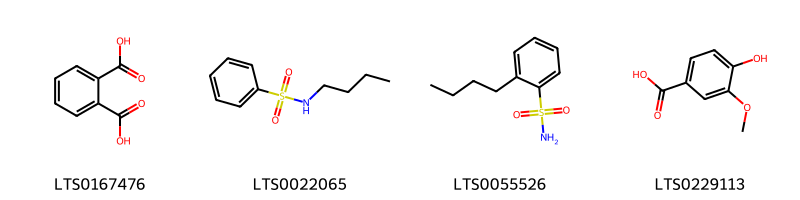{ group="compound" description="Cấu trúc hóa học của các hoạt chất thuộc nhóm *Benzene and substituted derivatives* là phthalic acid [(LTS0167476)](https://lotus.naturalproducts.net/compound/lotus_id/LTS0167476), n-butyl-benzenesulfonamide [(LTS0022065)](https://lotus.naturalproducts.net/compound/lotus_id/LTS0022065), 2-butylbenzenesulfonamide [(LTS0055526)](https://lotus.naturalproducts.net/compound/lotus_id/LTS0055526), vanillic acid [(LTS0229113)](https://lotus.naturalproducts.net/compound/lotus_id/LTS0229113)." }

                                                              
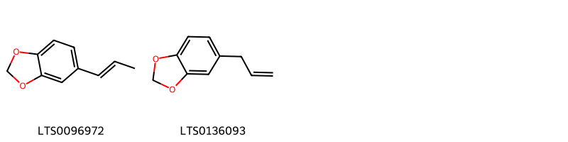{ group="compound" description="Cấu trúc hóa học của các hoạt chất thuộc nhóm *Benzodioxoles* là isosafrole [(LTS0096972)](https://lotus.naturalproducts.net/compound/lotus_id/LTS0096972), sassafras [(LTS0136093)](https://lotus.naturalproducts.net/compound/lotus_id/LTS0136093)." }

                                                              
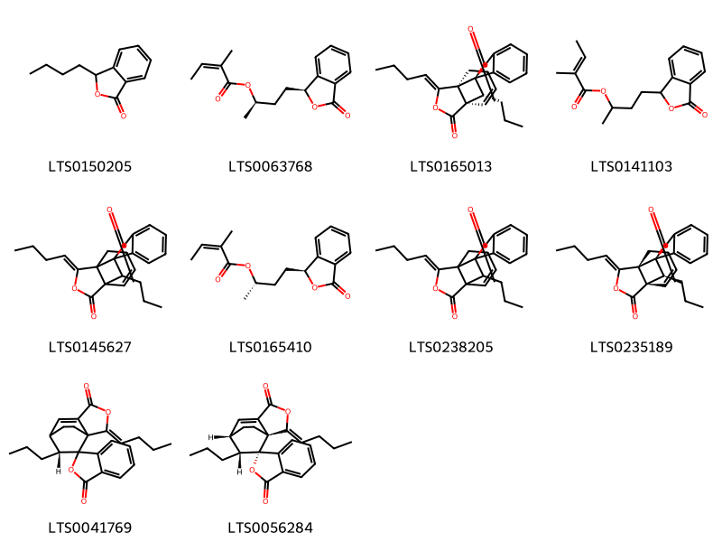{ group="compound" description="Cấu trúc hóa học của các hoạt chất thuộc nhóm *Benzofurans* là butylphthalide [(LTS0150205)](https://lotus.naturalproducts.net/compound/lotus_id/LTS0150205), (2r)-4-[(1s)-3-oxo-1h-2-benzofuran-1-yl]butan-2-yl (2z)-2-methylbut-2-enoate [(LTS0063768)](https://lotus.naturalproducts.net/compound/lotus_id/LTS0063768), (1r,1's,6'r,9'z,11'r)-9'-butylidene-11'-propyl-8'-oxaspiro[2-benzofuran-1,10'-tricyclo[4.3.2.0¹,⁶]undecan]-4'-ene-3,7'-dione [(LTS0165013)](https://lotus.naturalproducts.net/compound/lotus_id/LTS0165013), 4-(3-oxo-1h-2-benzofuran-1-yl)butan-2-yl 2-methylbut-2-enoate [(LTS0141103)](https://lotus.naturalproducts.net/compound/lotus_id/LTS0141103), (9'z)-9'-butylidene-11'-propyl-8'-oxaspiro[2-benzofuran-1,10'-tricyclo[4.3.2.0¹,⁶]undecan]-4'-ene-3,7'-dione [(LTS0145627)](https://lotus.naturalproducts.net/compound/lotus_id/LTS0145627), (2s)-4-[(1s)-3-oxo-1h-2-benzofuran-1-yl]butan-2-yl (2z)-2-methylbut-2-enoate [(LTS0165410)](https://lotus.naturalproducts.net/compound/lotus_id/LTS0165410), 9'-butylidene-11'-propyl-8'-oxaspiro[2-benzofuran-1,10'-tricyclo[4.3.2.0¹,⁶]undecan]-4'-ene-3,7'-dione [(LTS0238205)](https://lotus.naturalproducts.net/compound/lotus_id/LTS0238205), (1r,1'r,6's,9'z,11's)-9'-butylidene-11'-propyl-8'-oxaspiro[2-benzofuran-1,10'-tricyclo[4.3.2.0¹,⁶]undecan]-4'-ene-3,7'-dione [(LTS0235189)](https://lotus.naturalproducts.net/compound/lotus_id/LTS0235189), (2'z,8'r)-2'-butylidene-8'-propyl-3'-oxaspiro[2-benzofuran-1,9'-tricyclo[5.2.2.0¹,⁵]undecan]-5'-ene-3,4'-dione [(LTS0041769)](https://lotus.naturalproducts.net/compound/lotus_id/LTS0041769), (1s,1'r,2'z,7's,8'r)-2'-butylidene-8'-propyl-3'-oxaspiro[2-benzofuran-1,9'-tricyclo[5.2.2.0¹,⁵]undecan]-5'-ene-3,4'-dione [(LTS0056284)](https://lotus.naturalproducts.net/compound/lotus_id/LTS0056284)." }

                                                              
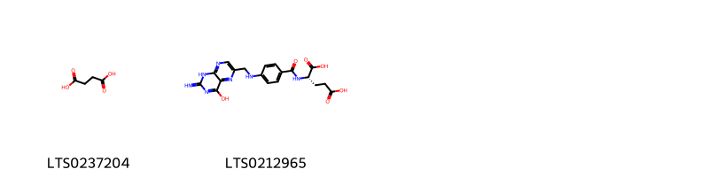{ group="compound" description="Cấu trúc hóa học của các hoạt chất thuộc nhóm *Carboxylic acids and derivatives* là succinic acid [(LTS0237204)](https://lotus.naturalproducts.net/compound/lotus_id/LTS0237204), acid, folic [(LTS0212965)](https://lotus.naturalproducts.net/compound/lotus_id/LTS0212965)." }

                                                              
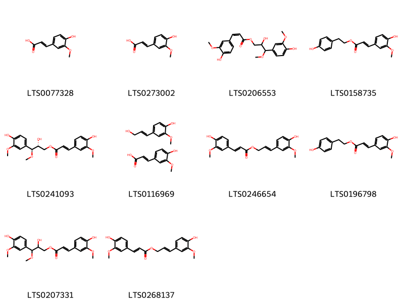{ group="compound" description="Cấu trúc hóa học của các hoạt chất thuộc nhóm *Cinnamic acids and derivatives* là ferulic acid [(LTS0077328)](https://lotus.naturalproducts.net/compound/lotus_id/LTS0077328), ferulic acid [(LTS0273002)](https://lotus.naturalproducts.net/compound/lotus_id/LTS0273002), 2-hydroxy-3-(4-hydroxy-3-methoxyphenyl)-3-methoxypropyl (2z)-3-(4-hydroxy-3-methoxyphenyl)prop-2-enoate [(LTS0206553)](https://lotus.naturalproducts.net/compound/lotus_id/LTS0206553), 2-(4-hydroxyphenyl)ethyl (2e)-3-(4-hydroxy-3-methoxyphenyl)prop-2-enoate [(LTS0158735)](https://lotus.naturalproducts.net/compound/lotus_id/LTS0158735), (2r,3s)-2-hydroxy-3-(4-hydroxy-3-methoxyphenyl)-3-methoxypropyl (2e)-3-(4-hydroxy-3-methoxyphenyl)prop-2-enoate [(LTS0241093)](https://lotus.naturalproducts.net/compound/lotus_id/LTS0241093), coniferyl alcohol; ferulic acid [(LTS0116969)](https://lotus.naturalproducts.net/compound/lotus_id/LTS0116969), 3-(4-hydroxy-3-methoxyphenyl)prop-2-en-1-yl 3-(4-hydroxy-3-methoxyphenyl)prop-2-enoate [(LTS0246654)](https://lotus.naturalproducts.net/compound/lotus_id/LTS0246654), 2-(4-hydroxyphenyl)ethyl 3-(4-hydroxy-3-methoxyphenyl)prop-2-enoate [(LTS0196798)](https://lotus.naturalproducts.net/compound/lotus_id/LTS0196798), 2-hydroxy-3-(4-hydroxy-3-methoxyphenyl)-3-methoxypropyl 3-(4-hydroxy-3-methoxyphenyl)prop-2-enoate [(LTS0207331)](https://lotus.naturalproducts.net/compound/lotus_id/LTS0207331), coniferyl ferulate [(LTS0268137)](https://lotus.naturalproducts.net/compound/lotus_id/LTS0268137)." }

                                                              
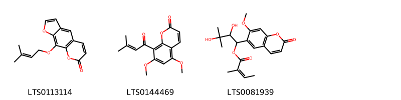{ group="compound" description="Cấu trúc hóa học của các hoạt chất thuộc nhóm *Coumarins and derivatives* là imperatorin [(LTS0113114)](https://lotus.naturalproducts.net/compound/lotus_id/LTS0113114), glaucalactone [(LTS0144469)](https://lotus.naturalproducts.net/compound/lotus_id/LTS0144469), 2,3-dihydroxy-1-(7-methoxy-2-oxochromen-6-yl)-3-methylbutyl (2z)-2-methylbut-2-enoate [(LTS0081939)](https://lotus.naturalproducts.net/compound/lotus_id/LTS0081939)." }

                                                              
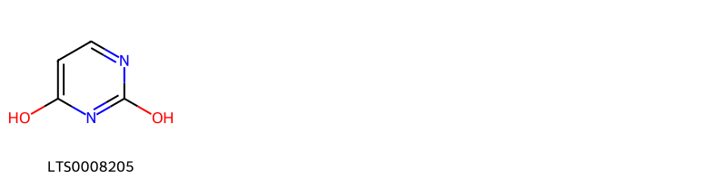{ group="compound" description="Cấu trúc hóa học của các hoạt chất thuộc nhóm *Diazines* là pirod [(LTS0008205)](https://lotus.naturalproducts.net/compound/lotus_id/LTS0008205)." }

                                                              
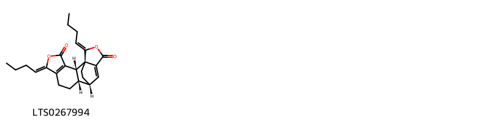{ group="compound" description="Cấu trúc hóa học của các hoạt chất thuộc nhóm *Dihydrofurans* là levistolide a [(LTS0267994)](https://lotus.naturalproducts.net/compound/lotus_id/LTS0267994)." }

                                                              
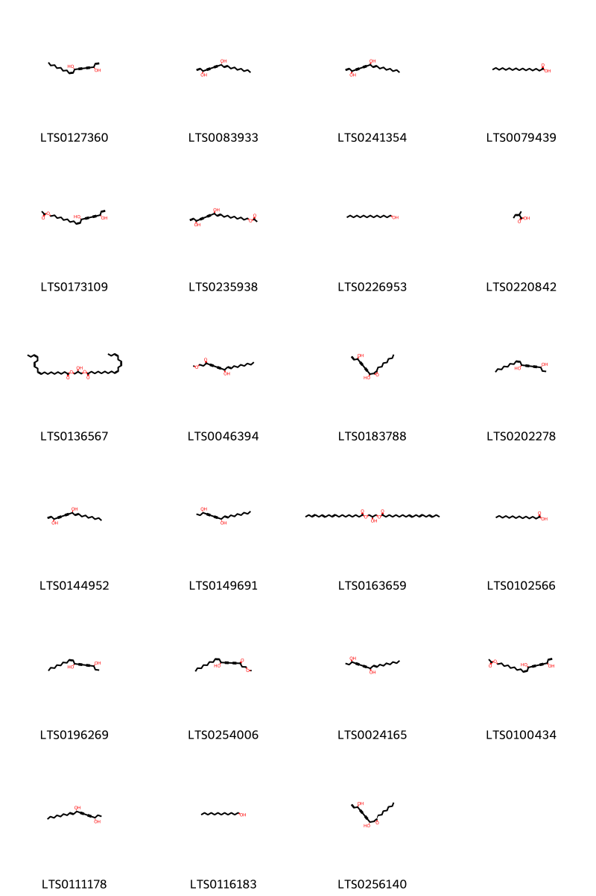{ group="compound" description="Cấu trúc hóa học của các hoạt chất thuộc nhóm *Fatty Acyls* là falcarindiol [(LTS0127360)](https://lotus.naturalproducts.net/compound/lotus_id/LTS0127360), (3s,8r)-heptadeca-1,9-dien-4,6-diyne-3,8-diol [(LTS0083933)](https://lotus.naturalproducts.net/compound/lotus_id/LTS0083933), heptadeca-1,9-dien-4,6-diyne-3,8-diol [(LTS0241354)](https://lotus.naturalproducts.net/compound/lotus_id/LTS0241354), palmitic acid [(LTS0079439)](https://lotus.naturalproducts.net/compound/lotus_id/LTS0079439), (9z,11s,16r)-11,16-dihydroxyoctadeca-9,17-dien-12,14-diyn-1-yl acetate [(LTS0173109)](https://lotus.naturalproducts.net/compound/lotus_id/LTS0173109), 11,16-dihydroxyoctadeca-9,17-dien-12,14-diyn-1-yl acetate [(LTS0235938)](https://lotus.naturalproducts.net/compound/lotus_id/LTS0235938), myristyl alcohol [(LTS0226953)](https://lotus.naturalproducts.net/compound/lotus_id/LTS0226953), angelic acid [(LTS0220842)](https://lotus.naturalproducts.net/compound/lotus_id/LTS0220842), 1,3-dilinolenoylglycerol [(LTS0136567)](https://lotus.naturalproducts.net/compound/lotus_id/LTS0136567), 8-hydroxy-1-methoxyheptadec-9-en-4,6-diyn-3-one [(LTS0046394)](https://lotus.naturalproducts.net/compound/lotus_id/LTS0046394), 1-(3-heptyloxiran-2-yl)oct-7-en-2,4-diyne-1,6-diol [(LTS0183788)](https://lotus.naturalproducts.net/compound/lotus_id/LTS0183788), (3r,8s,9z)-heptadec-9-en-4,6-diyne-3,8-diol [(LTS0202278)](https://lotus.naturalproducts.net/compound/lotus_id/LTS0202278), (3s,8s)-heptadeca-1,9-dien-4,6-diyne-3,8-diol [(LTS0144952)](https://lotus.naturalproducts.net/compound/lotus_id/LTS0144952), (3s,8s)-heptadec-9-en-4,6-diyne-3,8-diol [(LTS0149691)](https://lotus.naturalproducts.net/compound/lotus_id/LTS0149691), 2-hydroxy-3-(octadeca-9,12,15-trienoyloxy)propyl octadeca-9,12,15-trienoate [(LTS0163659)](https://lotus.naturalproducts.net/compound/lotus_id/LTS0163659), myristic acid [(LTS0102566)](https://lotus.naturalproducts.net/compound/lotus_id/LTS0102566), oplopandiol [(LTS0196269)](https://lotus.naturalproducts.net/compound/lotus_id/LTS0196269), (8s,9z)-8-hydroxy-1-methoxyheptadec-9-en-4,6-diyn-3-one [(LTS0254006)](https://lotus.naturalproducts.net/compound/lotus_id/LTS0254006), heptadec-9-en-4,6-diyne-3,8-diol [(LTS0024165)](https://lotus.naturalproducts.net/compound/lotus_id/LTS0024165), (9z)-11,16-dihydroxyoctadeca-9,17-dien-12,14-diyn-1-yl acetate [(LTS0100434)](https://lotus.naturalproducts.net/compound/lotus_id/LTS0100434), (3s,8s,9e)-heptadec-9-en-4,6-diyne-3,8-diol [(LTS0111178)](https://lotus.naturalproducts.net/compound/lotus_id/LTS0111178), 1-dodecanol [(LTS0116183)](https://lotus.naturalproducts.net/compound/lotus_id/LTS0116183), (1r,6r)-1-[(2r,3r)-3-heptyloxiran-2-yl]oct-7-en-2,4-diyne-1,6-diol [(LTS0256140)](https://lotus.naturalproducts.net/compound/lotus_id/LTS0256140)." }

                                                              
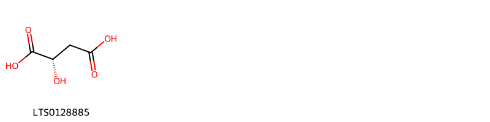{ group="compound" description="Cấu trúc hóa học của các hoạt chất thuộc nhóm *Hydroxy acids and derivatives* là (-)-malic acid [(LTS0128885)](https://lotus.naturalproducts.net/compound/lotus_id/LTS0128885)." }

                                                              
{ group="compound" description="Cấu trúc hóa học của các hoạt chất thuộc nhóm *Imidazopyrimidines* là leucon [(LTS0114351)](https://lotus.naturalproducts.net/compound/lotus_id/LTS0114351)." }

                                                              
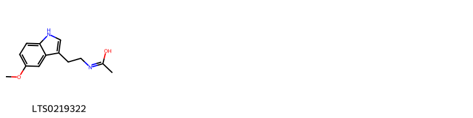{ group="compound" description="Cấu trúc hóa học của các hoạt chất thuộc nhóm *Indoles and derivatives* là n-[2-(5-methoxy-1h-indol-3-yl)ethyl]ethanimidic acid [(LTS0219322)](https://lotus.naturalproducts.net/compound/lotus_id/LTS0219322)." }

                                                              
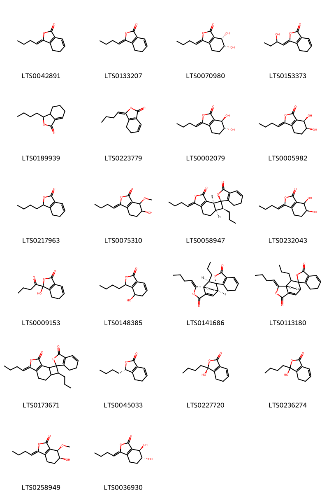{ group="compound" description="Cấu trúc hóa học của các hoạt chất thuộc nhóm *Isobenzofurans* là (z)-ligustilide [(LTS0042891)](https://lotus.naturalproducts.net/compound/lotus_id/LTS0042891), 3-butylidene-4,5-dihydro-2-benzofuran-1-one [(LTS0133207)](https://lotus.naturalproducts.net/compound/lotus_id/LTS0133207), (6r,7s)-3-butylidene-6,7-dihydroxy-4,5,6,7-tetrahydro-2-benzofuran-1-one [(LTS0070980)](https://lotus.naturalproducts.net/compound/lotus_id/LTS0070980), (3z)-3-(2-hydroxybutylidene)-4,5-dihydro-2-benzofuran-1-one [(LTS0153373)](https://lotus.naturalproducts.net/compound/lotus_id/LTS0153373), sedanolide [(LTS0189939)](https://lotus.naturalproducts.net/compound/lotus_id/LTS0189939), z-ligustilide [(LTS0223779)](https://lotus.naturalproducts.net/compound/lotus_id/LTS0223779), (6r,7r)-3-butylidene-6,7-dihydroxy-4,5,6,7-tetrahydro-2-benzofuran-1-one [(LTS0002079)](https://lotus.naturalproducts.net/compound/lotus_id/LTS0002079), (3z,6s,7r)-3-butylidene-6,7-dihydroxy-4,5,6,7-tetrahydro-2-benzofuran-1-one [(LTS0005982)](https://lotus.naturalproducts.net/compound/lotus_id/LTS0005982), 3-butyl-4,5-dihydro-3h-2-benzofuran-1-one [(LTS0217963)](https://lotus.naturalproducts.net/compound/lotus_id/LTS0217963), 3-butylidene-6-hydroxy-7-methoxy-4,5,6,7-tetrahydro-2-benzofuran-1-one [(LTS0075310)](https://lotus.naturalproducts.net/compound/lotus_id/LTS0075310), riligustilide [(LTS0058947)](https://lotus.naturalproducts.net/compound/lotus_id/LTS0058947), 3-butylidene-6,7-dihydroxy-4,5,6,7-tetrahydro-2-benzofuran-1-one [(LTS0232043)](https://lotus.naturalproducts.net/compound/lotus_id/LTS0232043), 3-butanoyl-3-hydroxy-4,5-dihydro-2-benzofuran-1-one [(LTS0009153)](https://lotus.naturalproducts.net/compound/lotus_id/LTS0009153), 3-butyl-4-hydroxy-4,5-dihydro-3h-2-benzofuran-1-one [(LTS0148385)](https://lotus.naturalproducts.net/compound/lotus_id/LTS0148385), (1r,1's,2'z,7'r,9'r)-2'-butylidene-9'-propyl-6,7-dihydro-3'-oxaspiro[2-benzofuran-1,8'-tricyclo[5.2.2.0¹,⁵]undecan]-5'-ene-3,4'-dione [(LTS0141686)](https://lotus.naturalproducts.net/compound/lotus_id/LTS0141686), 2'-butylidene-9'-propyl-6,7-dihydro-3'-oxaspiro[2-benzofuran-1,8'-tricyclo[5.2.2.0¹,⁵]undecan]-5'-ene-3,4'-dione [(LTS0113180)](https://lotus.naturalproducts.net/compound/lotus_id/LTS0113180), (9'z)-9'-butylidene-4'-propyl-6,7-dihydro-10'-oxaspiro[2-benzofuran-1,3'-tricyclo[6.3.0.0²,⁵]undecan]-1'(8')-ene-3,11'-dione [(LTS0173671)](https://lotus.naturalproducts.net/compound/lotus_id/LTS0173671), senkyunolide a [(LTS0045033)](https://lotus.naturalproducts.net/compound/lotus_id/LTS0045033), (3s)-3-butyl-3-hydroxy-4,5-dihydro-2-benzofuran-1-one [(LTS0227720)](https://lotus.naturalproducts.net/compound/lotus_id/LTS0227720), 3-butyl-3-hydroxy-4,5-dihydro-2-benzofuran-1-one [(LTS0236274)](https://lotus.naturalproducts.net/compound/lotus_id/LTS0236274), (3z,6s,7r)-3-butylidene-6-hydroxy-7-methoxy-4,5,6,7-tetrahydro-2-benzofuran-1-one [(LTS0258949)](https://lotus.naturalproducts.net/compound/lotus_id/LTS0258949), (3z,6r,7r)-3-butylidene-6,7-dihydroxy-4,5,6,7-tetrahydro-2-benzofuran-1-one [(LTS0036930)](https://lotus.naturalproducts.net/compound/lotus_id/LTS0036930)." }

                                                              
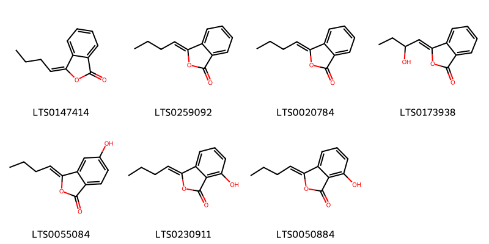{ group="compound" description="Cấu trúc hóa học của các hoạt chất thuộc nhóm *Isocoumarans* là butylidenephthalide [(LTS0147414)](https://lotus.naturalproducts.net/compound/lotus_id/LTS0147414), butylidenephthalide [(LTS0259092)](https://lotus.naturalproducts.net/compound/lotus_id/LTS0259092), z-butylidenephthalide [(LTS0020784)](https://lotus.naturalproducts.net/compound/lotus_id/LTS0020784), (3z)-3-(2-hydroxybutylidene)-2-benzofuran-1-one [(LTS0173938)](https://lotus.naturalproducts.net/compound/lotus_id/LTS0173938), (3z)-3-butylidene-5-hydroxy-2-benzofuran-1-one [(LTS0055084)](https://lotus.naturalproducts.net/compound/lotus_id/LTS0055084), senkyunolide b [(LTS0230911)](https://lotus.naturalproducts.net/compound/lotus_id/LTS0230911), 3-butylidene-7-hydroxy-2-benzofuran-1-one [(LTS0050884)](https://lotus.naturalproducts.net/compound/lotus_id/LTS0050884)." }

                                                              
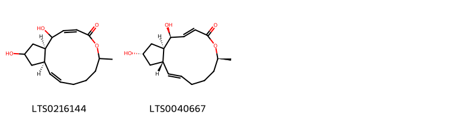{ group="compound" description="Cấu trúc hóa học của các hoạt chất thuộc nhóm *Macrolides and analogues* là (11ar,14ar)-1,13-dihydroxy-6-methyl-1h,6h,7h,8h,9h,11ah,12h,13h,14h,14ah-cyclopenta[f]oxacyclotridecan-4-one [(LTS0216144)](https://lotus.naturalproducts.net/compound/lotus_id/LTS0216144), brefeldin a [(LTS0040667)](https://lotus.naturalproducts.net/compound/lotus_id/LTS0040667)." }

                                                              
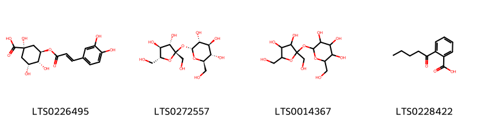{ group="compound" description="Cấu trúc hóa học của các hoạt chất thuộc nhóm *Organooxygen compounds* là chlorogenic acid [(LTS0226495)](https://lotus.naturalproducts.net/compound/lotus_id/LTS0226495), sucrose [(LTS0272557)](https://lotus.naturalproducts.net/compound/lotus_id/LTS0272557), granulated sugar [(LTS0014367)](https://lotus.naturalproducts.net/compound/lotus_id/LTS0014367), 2-pentanoylbenzoic acid [(LTS0228422)](https://lotus.naturalproducts.net/compound/lotus_id/LTS0228422)." }

                                                              
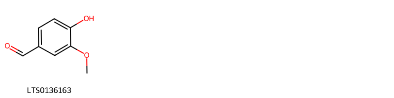{ group="compound" description="Cấu trúc hóa học của các hoạt chất thuộc nhóm *Phenols* là vanillin [(LTS0136163)](https://lotus.naturalproducts.net/compound/lotus_id/LTS0136163)." }

                                                              
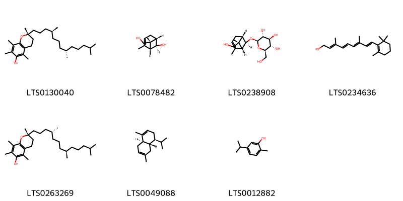{ group="compound" description="Cấu trúc hóa học của các hoạt chất thuộc nhóm *Prenol lipids* là (2r)-2,5,7,8-tetramethyl-2-[(4s,8s)-4,8,12-trimethyltridecyl]-3,4-dihydro-1-benzopyran-6-ol [(LTS0130040)](https://lotus.naturalproducts.net/compound/lotus_id/LTS0130040), (1r,5s,6r,7r)-7-(hydroxymethyl)-2,7-dimethylbicyclo[3.1.1]hept-2-en-6-ol [(LTS0078482)](https://lotus.naturalproducts.net/compound/lotus_id/LTS0078482), (2r,3s,4s,5r,6r)-2-(hydroxymethyl)-6-{[(1r,5s,6r,7r)-7-(hydroxymethyl)-2,7-dimethylbicyclo[3.1.1]hept-2-en-6-yl]oxy}oxane-3,4,5-triol [(LTS0238908)](https://lotus.naturalproducts.net/compound/lotus_id/LTS0238908), vitamin a [(LTS0234636)](https://lotus.naturalproducts.net/compound/lotus_id/LTS0234636), vitamin e [(LTS0263269)](https://lotus.naturalproducts.net/compound/lotus_id/LTS0263269), β-cadinene [(LTS0049088)](https://lotus.naturalproducts.net/compound/lotus_id/LTS0049088), carvacrol [(LTS0012882)](https://lotus.naturalproducts.net/compound/lotus_id/LTS0012882)." }

                                                              
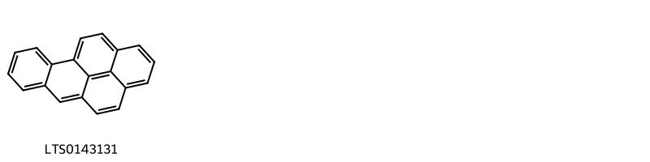{ group="compound" description="Cấu trúc hóa học của các hoạt chất thuộc nhóm *Pyrenes* là benzopyrene [(LTS0143131)](https://lotus.naturalproducts.net/compound/lotus_id/LTS0143131)." }

                                                              
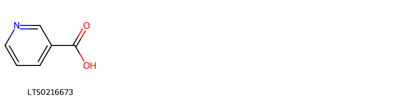{ group="compound" description="Cấu trúc hóa học của các hoạt chất thuộc nhóm *Pyridines and derivatives* là niacin [(LTS0216673)](https://lotus.naturalproducts.net/compound/lotus_id/LTS0216673)." }

                                                              
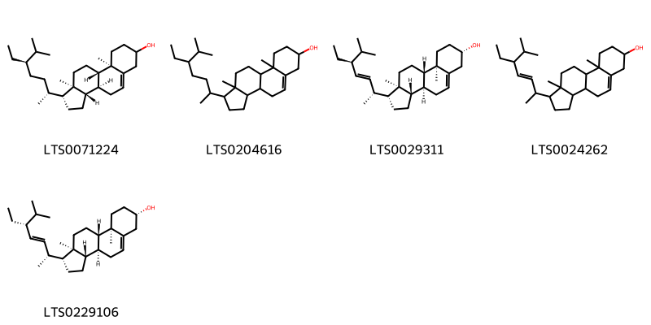{ group="compound" description="Cấu trúc hóa học của các hoạt chất thuộc nhóm *Steroids and steroid derivatives* là stigmast-5-en-3-ol [(LTS0071224)](https://lotus.naturalproducts.net/compound/lotus_id/LTS0071224), stigmast-5-en-3-ol, (3β)- [(LTS0204616)](https://lotus.naturalproducts.net/compound/lotus_id/LTS0204616), phytosterol [(LTS0029311)](https://lotus.naturalproducts.net/compound/lotus_id/LTS0029311), stigmasterol [(LTS0024262)](https://lotus.naturalproducts.net/compound/lotus_id/LTS0024262), poriferasterol [(LTS0229106)](https://lotus.naturalproducts.net/compound/lotus_id/LTS0229106)." }

                                                              
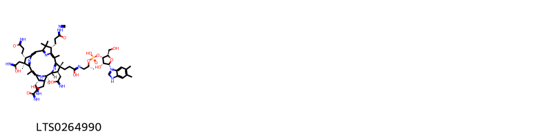{ group="compound" description="Cấu trúc hóa học của các hoạt chất thuộc nhóm *Tetrapyrroles and derivatives* là 1-[(2s,3r,4s,5r)-3-hydroxy-4-{[hydroxy([(2r)-1-({1-hydroxy-3-[(1r,2r,3r,4r,8s,13s,14s,18s,19s)-8,13,18-tris(2-carboximidatoethyl)-3,14,19-tris(c-hydroxycarbonimidoylmethyl)-1,4,6,9,9,14,16,19-octamethyl-20,21,22,23-tetraazapentacyclo[15.2.1.1²,⁵.1⁷,¹⁰.1¹²,¹⁵]tricosa-5(23),6,10(22),11,15(21),16-hexaen-4-yl]propylidene}amino)propan-2-yl]oxy)phosphoryl]oxy}-5-(hydroxymethyl)oxolan-2-yl]-5,6-dimethyl-3h-1λ⁵,3-benzodiazol-1-ylium; cyano radical [(LTS0264990)](https://lotus.naturalproducts.net/compound/lotus_id/LTS0264990)." }

:::

---

## IV. Tác dụng dược lý

Theo tài liệu quốc tế: nan

---

## V. Dược điển Việt Nam V

### Soi bột

nan

::: {#listing-soibot}
:::

### Vi phẫu

nan

::: {#listing-viphau}
:::

### Định tính

nan

### Định lượng

nan

### Thông tin khác 

- **Độ ẩm:** nan
- **Bảo quản:** nan

## VI. Dược điển Hồng kong

::: {#listing-DDHK}
:::

---

## VII. Y dược học cổ truyền

::: {.callout-note title = "nan" }

**Tên vị thuốc:** nan

**Tính:** nan

**Vị:** nan

**Quy kinh:**  nan

**Công năng chủ trị:** nan

**Phân loại theo thông tư:** nan

**Tác dụng theo y dược cổ truyền:** nan

**Chú ý:** nan

**Kiêng kỵ:** nan 

:::

::: {#listing-ViThuoc}
:::

