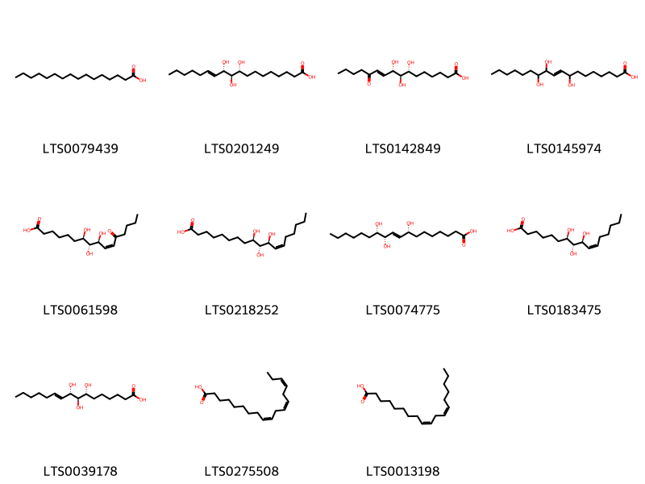

::: {.callout-note title = "Tóm tắt"}

Dược liệu Gai (Rễ) – Radix Boehmeriae niveae lấy từ Cây Gai - Boehmeria nivea (L.) Gaudich, thuộc họ Gai (Urticaceae). Cây phân bố rộng rãi tại Đông Nam Á, Đông Á và di thực đến nhiều nơi như Mỹ, Nam Mỹ, châu Phi; tại Việt Nam phân bố khắp nơi. Trong y học cổ truyền, dược liệu được dùng để an thai, chữa sa dạ con, lợi tiểu, thanh nhiệt giải độc, chỉ huyết và điều trị các bệnh như động thai ra máu, huyết lâm, thổ huyết, mụn nhọt. Cây có tác dụng kháng khuẩn, chống viêm, diệt nấm và kích thích tiết mật. Dược liệu có vị ngọt, tính hàn, quy kinh can và tâm, chứa các hoạt chất chính như flavonoid, saponin, polysaccharid và hợp chất phenolic như acid chlorogenic. 

:::

## I. Thông tin về dược liệu 

::: {.panel-tabset}

### Định danh

- Dược liệu tiếng Việt: Gai - Rễ
- Dược liệu tiếng Trung: nan (nan)
- Dược liệu tiếng Anh: nan
- Dược liệu latin thông dụng: Radix Boehmeriae Niveae
- Dược liệu latin kiểu DĐVN: *Radix Aconiti Lateralis*
- Dược liệu latin kiểu DĐVN: *nan*
- Dược liệu latin kiểu thông tư: *nan*
- Bộ phận dùng: Rễ (Radix)

### Mô tả dược liệu 

**Theo dược điển Việt nam V:** nan 
 
**Mô tả dược liệu theo thông tư chế biến dược liệu theo phương pháp cổ truyền:** nan

### Chế biến 

**Chế biến theo dược điển việt nam V**: nan 

**Chế biến theo thông tư:** nan

::: 

## II. Thông tin về thực vật

Dược liệu **Gai - Rễ** từ bộ phận **Rễ** từ loài *Boehmeria nivea*.

**Mô tả thực vật:** Cây gai nói đây là cây mà lá ta vẫn dùng làm bánh gai ăn và sợi để dệt làm lưới đánh cá. 
Cây sống lâu năm, có thể cao tới 1,5 - 2m. Lá lớn, mọc so le, hình tim, dài 7-15cm, rộng 4-8cm mép có răng cưa, đáy lá hình tim hay hơi tròn, mặt dưới trắng vì có nhiều lòng trắng, mặt trên có màu lục sẫm, đáp, có 3 gân từ cuống phát ra. Hoa đơn tính cùng gốc. Hoa đực có 4 lá đài và 4 nhị. Hoa cái có đài hợp chia làm 3 răng. Quả bế mang đài tồn tại. 
Rễ hái vào bất cứ mùa nào, nhưng tốt nhất vào thu đông. Hái về rửa sạch đất phơi hay sấy khô. 

*Tài liệu tham khảo:* "Những cây thuốc và vị thuốc Việt Nam" - Đỗ Tất Lợi 
Trong dược điển Việt nam, loài *Boehmeria nivea* được sử dụng làm dược liệu.

            
::: {.callout-note title = "Phân loại thực vật của *Boehmeria nivea*"}

**Kingdom:** Plantae 

**Phylum:** Tracheophyta 

**Order:** Rosales 
 
**Family:** Urticaceae 
 
**Genus:** Boehmeria 
 
**Species:** *Boehmeria nivea* 
 

:::

::: {style="display: grid;grid-template-columns: repeat(auto-fill, minmax(150px, 1fr));grid-gap: 1em;"}
{ group="GIBF" }

{ group="GIBF" }

{ group="GIBF" }

{ group="GIBF" }

{ group="GIBF" }

{ group="GIBF" }

{ group="GIBF" }

{ group="GIBF" }

{ group="GIBF" }
:::

**Phân bố trên thế giới:** Chinese Taipei, China, Hong Kong, New Zealand, Japan, Macao, Singapore

**Phân bố tại Việt nam:** Không có ghi nhận ở Việt Nam

<iframe src="Radix Boehmeriae Niveae/map_distribution.html" width="100%" height="600" style="border:none;"></iframe>

## III. Thành phần hóa học

Theo tài liệu của GS. Đỗ Tất Lợi:  (1) Nhóm hóa học: Flavonoid, Saponin, Polysaccharid, Hợp chất phenolic (Acid chlorogenic)
    

Theo cơ sở dữ liệu lotus, loài *Boehmeria nivea* đã phân lập và xác định được **11** hoạt chất thuộc về các nhóm Fatty Acyls trong bảng dưới đây.
        
| chemicalTaxonomyClassyfireClass   |   smiles_count |
|:----------------------------------|---------------:|
| Fatty Acyls                       |            439 |

Danh sách chi tiết các hoạt chất như sau: 

::: {style="display: grid;grid-template-columns: repeat(auto-fill, minmax(150px, 1fr));grid-gap: 1em;"}

                                                              
{ group="compound" description="Cấu trúc hóa học của các hoạt chất thuộc nhóm *Fatty Acyls* là palmitic acid [(LTS0079439)](https://lotus.naturalproducts.net/compound/lotus_id/LTS0079439), (9r,10r,11s)-9,10,11-trihydroxyoctadec-12-enoic acid [(LTS0201249)](https://lotus.naturalproducts.net/compound/lotus_id/LTS0201249), (7r,8r,9s)-7,8,9-trihydroxy-12-oxohexadec-10-enoic acid [(LTS0142849)](https://lotus.naturalproducts.net/compound/lotus_id/LTS0142849), 8,11,12-trihydroxyoctadec-9-enoic acid [(LTS0145974)](https://lotus.naturalproducts.net/compound/lotus_id/LTS0145974), (7r,8r,9s,10z)-7,8,9-trihydroxy-12-oxohexadec-10-enoic acid [(LTS0061598)](https://lotus.naturalproducts.net/compound/lotus_id/LTS0061598), (9r,10r,11s,12z)-9,10,11-trihydroxyoctadec-12-enoic acid [(LTS0218252)](https://lotus.naturalproducts.net/compound/lotus_id/LTS0218252), (8r,9e,11s,12s)-8,11,12-trihydroxyoctadec-9-enoic acid [(LTS0074775)](https://lotus.naturalproducts.net/compound/lotus_id/LTS0074775), (7r,8r,9s,10z)-7,8,9-trihydroxyhexadec-10-enoic acid [(LTS0183475)](https://lotus.naturalproducts.net/compound/lotus_id/LTS0183475), (7r,8r,9s)-7,8,9-trihydroxyhexadec-10-enoic acid [(LTS0039178)](https://lotus.naturalproducts.net/compound/lotus_id/LTS0039178), α-linolenic acid [(LTS0275508)](https://lotus.naturalproducts.net/compound/lotus_id/LTS0275508), linoleic [(LTS0013198)](https://lotus.naturalproducts.net/compound/lotus_id/LTS0013198)." }

:::

---

## IV. Tác dụng dược lý

Theo tài liệu quốc tế: nan

---

## V. Dược điển Việt Nam V

### Soi bột

nan

::: {#listing-soibot}
:::

### Vi phẫu

nan

::: {#listing-viphau}
:::

### Định tính

nan

### Định lượng

nan

### Thông tin khác 

- **Độ ẩm:** nan
- **Bảo quản:** nan

## VI. Dược điển Hồng kong

::: {#listing-DDHK}
:::

---

## VII. Y dược học cổ truyền

::: {.callout-note title = "nan" }

**Tên vị thuốc:** nan

**Tính:** nan

**Vị:** nan

**Quy kinh:**  nan

**Công năng chủ trị:** nan

**Phân loại theo thông tư:** nan

**Tác dụng theo y dược cổ truyền:** nan

**Chú ý:** nan

**Kiêng kỵ:** nan 

:::

::: {#listing-ViThuoc}
:::

