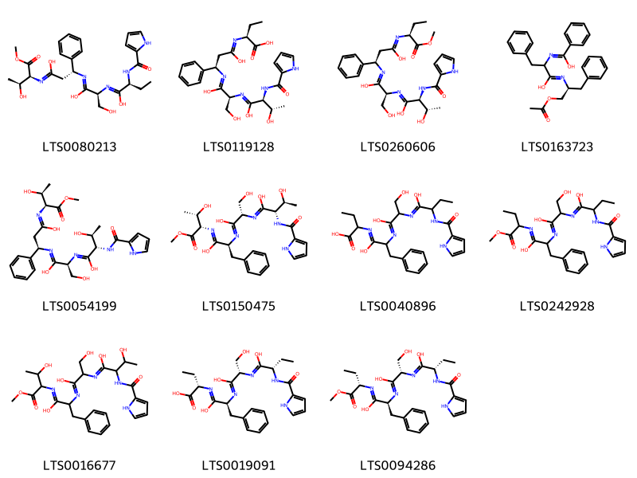
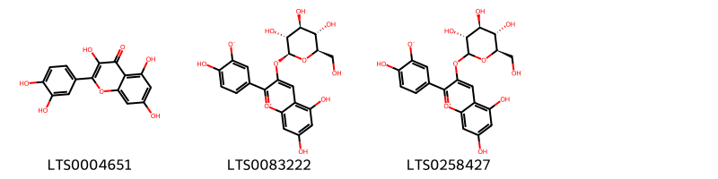
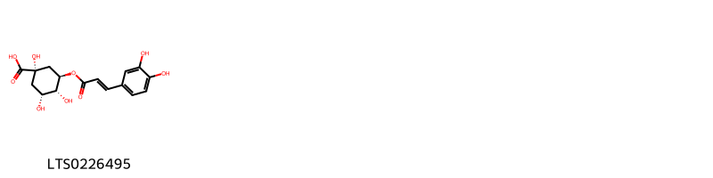
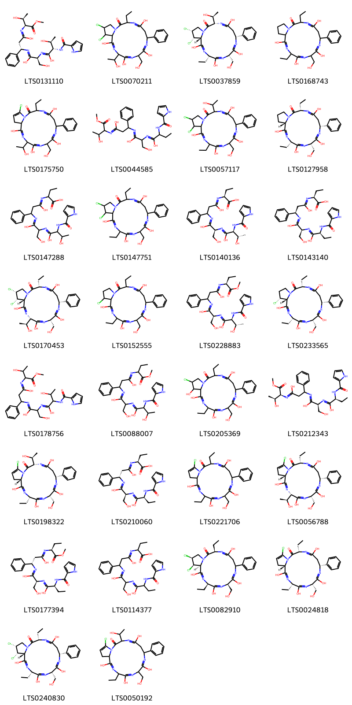
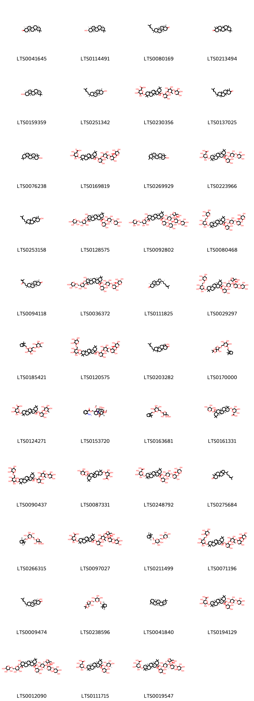
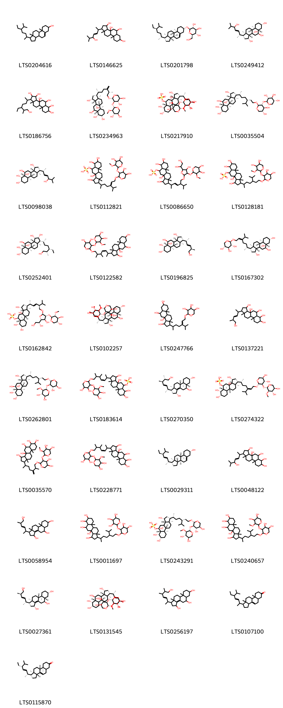

::: {.callout-note title = "Tóm tắt"}

nan

:::

## I. Thông tin về dược liệu 

::: {.panel-tabset}

### Định danh

- Dược liệu tiếng Việt: Tử Uyển - Thân Rễ
- Dược liệu tiếng Trung: 炙紫菀 (Zhi Zi Wan)
- Dược liệu tiếng Anh: Prepared Root of Tatarian Aster
- Dược liệu latin thông dụng: Radix Et Rhizoma Asteris Tatarici
- Dược liệu latin kiểu DĐVN: *Radix Et Rhizoma Asteris Tatarici*
- Dược liệu latin kiểu DĐVN: *nan*
- Dược liệu latin kiểu thông tư: *nan*
- Bộ phận dùng: Thân Rễ (Radix)

### Mô tả dược liệu 

**Theo dược điển Việt nam V:** Dược liệu là thân rễ và rễ. Thân rễ là những khối lớn, nhỏ không đều, đỉnh có vết tích của thân và lá. Chất hơi cứng. Các thân rễ mang nhiều rễ nhỏ, dài 3 cm đến 15 cm, đường kính 0,1 cm đến 0,3 cm, thường tết lại thành bím. Mặt ngoài màu đỏ hơi tía hoặc màu đỏ hơi xám, có vân nhăn dọc. Chất rễ tương đổi dai, mềm. Mùi thơm nhẹ, vị ngọt, hơi đắng. 
 
**Mô tả dược liệu theo thông tư chế biến dược liệu theo phương pháp cổ truyền:** nan

### Chế biến 

**Chế biến theo dược điển việt nam V**: Thu hoạch vào mùa xuân và mùa thu, đào lấy rễ và thân rễ, loại thân rễ có màu và đất cát, tết bó lại, phơi nắng đến khô.<i>Tử uyển song</i>: Loại bo tạp chất, rửa sạch, ủ mềm nhanh, thái phiến và phơi khô. <i>Mật</i> <i>tử</i> <i>uyển (chế</i> <i>mật)</i>: Mật ong hòa loãng bằng nước sôi trộn đều Mật ong với Tử uyển phiến, ủ đến khi mật ong thâm đều, cho vào chảo, sao nhỏ lửa đến khi không dính tay, lấy ra và để nguội. Dùng 2,5 kg mật ong cho 10 kg Từ uyển. 

**Chế biến theo thông tư:** nan

::: 

## II. Thông tin về thực vật

Dược liệu **Tử Uyển - Thân Rễ** từ bộ phận **Thân Rễ** từ loài *Aster tataricus*.

**Mô tả thực vật:** nan

*Tài liệu tham khảo:* nan 
Trong dược điển Việt nam, loài *Aster tataricus* được sử dụng làm dược liệu.

            
::: {.callout-note title = "Phân loại thực vật của *Aster tataricus*"}

**Kingdom:** Plantae 

**Phylum:** Tracheophyta 

**Order:** Asterales 
 
**Family:** Asteraceae 
 
**Genus:** Aster 
 
**Species:** *Aster tataricus* 
 

:::

::: {style="display: grid;grid-template-columns: repeat(auto-fill, minmax(150px, 1fr));grid-gap: 1em;"}
{ group="GIBF" }

{ group="GIBF" }

{ group="GIBF" }

{ group="GIBF" }

{ group="GIBF" }

{ group="GIBF" }

{ group="GIBF" }

{ group="GIBF" }
:::

**Phân bố trên thế giới:** United States of America, Russian Federation, China, Japan, Korea, Republic of, Mongolia

**Phân bố tại Việt nam:** Không có ghi nhận ở Việt Nam

<iframe src="Radix Et Rhizoma Asteris Tatarici/map_distribution.html" width="100%" height="600" style="border:none;"></iframe>

## III. Thành phần hóa học

Theo tài liệu của GS. Đỗ Tất Lợi:  nan
    

Theo cơ sở dữ liệu lotus, loài *Aster tataricus* đã phân lập và xác định được **126** hoạt chất thuộc về các nhóm Flavonoids, Steroids and steroid derivatives, Carboxylic acids and derivatives, Organooxygen compounds, Peptidomimetics, Prenol lipids trong bảng dưới đây.
        
| chemicalTaxonomyClassyfireClass   |   smiles_count |
|:----------------------------------|---------------:|
| Carboxylic acids and derivatives  |            910 |
| Flavonoids                        |            199 |
| Organooxygen compounds            |             65 |
| Peptidomimetics                   |           2438 |
| Prenol lipids                     |           6477 |
| Steroids and steroid derivatives  |           4200 |

Danh sách chi tiết các hoạt chất như sau: 

::: {style="display: grid;grid-template-columns: repeat(auto-fill, minmax(150px, 1fr));grid-gap: 1em;"}

                                                              
{ group="compound" description="Cấu trúc hóa học của các hoạt chất thuộc nhóm *Carboxylic acids and derivatives* là (2s)-n-[(1s)-2-hydroxy-1-{[(1r)-2-{[(2s,3s)-3-hydroxy-1-methoxy-1-oxobutan-2-yl]-c-hydroxycarbonimidoyl}-1-phenylethyl]-c-hydroxycarbonimidoyl}ethyl]-2-(1h-pyrrol-2-ylformamido)butanimidic acid [(LTS0080213)](https://lotus.naturalproducts.net/compound/lotus_id/LTS0080213), (2s)-2-{[(3r)-3-{[(2s)-2-{[(2s,3s)-1,3-dihydroxy-2-(1h-pyrrol-2-ylformamido)butylidene]amino}-1,3-dihydroxypropylidene]amino}-1-hydroxy-3-phenylpropylidene]amino}butanoic acid [(LTS0119128)](https://lotus.naturalproducts.net/compound/lotus_id/LTS0119128), (2s,3s)-3-hydroxy-n-[(1s)-2-hydroxy-1-{[(1r)-2-{[(2s)-1-methoxy-1-oxobutan-2-yl]-c-hydroxycarbonimidoyl}-1-phenylethyl]-c-hydroxycarbonimidoyl}ethyl]-2-(1h-pyrrol-2-ylformamido)butanimidic acid [(LTS0260606)](https://lotus.naturalproducts.net/compound/lotus_id/LTS0260606), n-[(2s)-1-(acetyloxy)-3-phenylpropan-2-yl]-2-{[hydroxy(phenyl)methylidene]amino}-3-phenylpropanimidic acid [(LTS0163723)](https://lotus.naturalproducts.net/compound/lotus_id/LTS0163723), (2s,3s)-3-hydroxy-n-[(1s)-2-hydroxy-1-{[(1r)-2-{[(2s,3s)-3-hydroxy-1-methoxy-1-oxobutan-2-yl]-c-hydroxycarbonimidoyl}-1-phenylethyl]-c-hydroxycarbonimidoyl}ethyl]-2-(1h-pyrrol-2-ylformamido)butanimidic acid [(LTS0054199)](https://lotus.naturalproducts.net/compound/lotus_id/LTS0054199), (2s,3s)-3-hydroxy-n-[(1s)-2-hydroxy-1-{[(1s)-1-{[(2s,3s)-3-hydroxy-1-methoxy-1-oxobutan-2-yl]-c-hydroxycarbonimidoyl}-2-phenylethyl]-c-hydroxycarbonimidoyl}ethyl]-2-(1h-pyrrol-2-ylformamido)butanimidic acid [(LTS0150475)](https://lotus.naturalproducts.net/compound/lotus_id/LTS0150475), 2-({2-[(1,3-dihydroxy-2-{[1-hydroxy-2-(1h-pyrrol-2-ylformamido)butylidene]amino}propylidene)amino]-1-hydroxy-3-phenylpropylidene}amino)butanoic acid [(LTS0040896)](https://lotus.naturalproducts.net/compound/lotus_id/LTS0040896), n-[2-hydroxy-1-({1-[(1-methoxy-1-oxobutan-2-yl)-c-hydroxycarbonimidoyl]-2-phenylethyl}-c-hydroxycarbonimidoyl)ethyl]-2-(1h-pyrrol-2-ylformamido)butanimidic acid [(LTS0242928)](https://lotus.naturalproducts.net/compound/lotus_id/LTS0242928), 3-hydroxy-n-[2-hydroxy-1-({1-[(3-hydroxy-1-methoxy-1-oxobutan-2-yl)-c-hydroxycarbonimidoyl]-2-phenylethyl}-c-hydroxycarbonimidoyl)ethyl]-2-(1h-pyrrol-2-ylformamido)butanimidic acid [(LTS0016677)](https://lotus.naturalproducts.net/compound/lotus_id/LTS0016677), (2s)-2-{[(2s)-2-{[(2s)-1,3-dihydroxy-2-{[(2s)-1-hydroxy-2-(1h-pyrrol-2-ylformamido)butylidene]amino}propylidene]amino}-1-hydroxy-3-phenylpropylidene]amino}butanoic acid [(LTS0019091)](https://lotus.naturalproducts.net/compound/lotus_id/LTS0019091), (2s)-n-[(1s)-2-hydroxy-1-{[(1s)-1-{[(2s)-1-methoxy-1-oxobutan-2-yl]-c-hydroxycarbonimidoyl}-2-phenylethyl]-c-hydroxycarbonimidoyl}ethyl]-2-(1h-pyrrol-2-ylformamido)butanimidic acid [(LTS0094286)](https://lotus.naturalproducts.net/compound/lotus_id/LTS0094286)." }

                                                              
{ group="compound" description="Cấu trúc hóa học của các hoạt chất thuộc nhóm *Flavonoids* là quercetin [(LTS0004651)](https://lotus.naturalproducts.net/compound/lotus_id/LTS0004651), 5,7-dihydroxy-2-(4-hydroxy-3-oxidophenyl)-3-{[(2s,3r,4s,5s,6r)-3,4,5-trihydroxy-6-(hydroxymethyl)oxan-2-yl]oxy}-1λ⁴-chromen-1-ylium [(LTS0083222)](https://lotus.naturalproducts.net/compound/lotus_id/LTS0083222), 5,7-dihydroxy-2-(4-hydroxy-3-oxidophenyl)-3-{[(3r,4s,5s,6r)-3,4,5-trihydroxy-6-(hydroxymethyl)oxan-2-yl]oxy}-1λ⁴-chromen-1-ylium [(LTS0258427)](https://lotus.naturalproducts.net/compound/lotus_id/LTS0258427)." }

                                                              
{ group="compound" description="Cấu trúc hóa học của các hoạt chất thuộc nhóm *Organooxygen compounds* là chlorogenic acid [(LTS0226495)](https://lotus.naturalproducts.net/compound/lotus_id/LTS0226495)." }

                                                              
{ group="compound" description="Cấu trúc hóa học của các hoạt chất thuộc nhóm *Peptidomimetics* là (2s,3s)-3-hydroxy-n-[(1s)-2-hydroxy-1-{[(1s)-2-{[(2s,3s)-3-hydroxy-1-methoxy-1-oxobutan-2-yl]-c-hydroxycarbonimidoyl}-1-phenylethyl]-c-hydroxycarbonimidoyl}ethyl]-2-(1h-pyrrol-2-ylformamido)butanimidic acid [(LTS0131110)](https://lotus.naturalproducts.net/compound/lotus_id/LTS0131110), 17,18-dichloro-13-ethyl-1,4,7,11-tetrahydroxy-3-(1-hydroxyethyl)-6-(hydroxymethyl)-9-phenyl-3h,6h,9h,10h,13h,16h,17h,18h,18ah-pyrrolo[1,2-d]1,4,7,10,13-pentaazacyclohexadecan-14-one [(LTS0070211)](https://lotus.naturalproducts.net/compound/lotus_id/LTS0070211), (3s,6s,9r,13s,17r,18s,18ar)-17,18-dichloro-3-ethyl-1,4,7,11-tetrahydroxy-13-[(1s)-1-hydroxyethyl]-6-(hydroxymethyl)-9-phenyl-3h,6h,9h,10h,13h,16h,17h,18h,18ah-pyrrolo[1,2-d]1,4,7,10,13-pentaazacyclohexadecan-14-one [(LTS0037859)](https://lotus.naturalproducts.net/compound/lotus_id/LTS0037859), 3,13-diethyl-1,4,7,11-tetrahydroxy-6-(hydroxymethyl)-9-phenyl-3h,6h,9h,10h,13h,16h,17h,18h,18ah-pyrrolo[1,2-d]1,4,7,10,13-pentaazacyclohexadecan-14-one [(LTS0168743)](https://lotus.naturalproducts.net/compound/lotus_id/LTS0168743), 16-chloro-13-ethyl-1,4,7,11-tetrahydroxy-3-(1-hydroxyethyl)-6-(hydroxymethyl)-9-phenyl-3h,6h,9h,10h,13h,18h,18ah-pyrrolo[1,2-d]1,4,7,10,13-pentaazacyclohexadecan-14-one [(LTS0175750)](https://lotus.naturalproducts.net/compound/lotus_id/LTS0175750), n-[2-hydroxy-1-({2-[(3-hydroxy-1-methoxy-1-oxobutan-2-yl)-c-hydroxycarbonimidoyl]-1-phenylethyl}-c-hydroxycarbonimidoyl)ethyl]-2-(1h-pyrrol-2-ylformamido)butanimidic acid [(LTS0044585)](https://lotus.naturalproducts.net/compound/lotus_id/LTS0044585), 17,18-dichloro-3-ethyl-1,4,7,11-tetrahydroxy-13-(1-hydroxyethyl)-6-(hydroxymethyl)-9-phenyl-3h,6h,9h,10h,13h,16h,17h,18h,18ah-pyrrolo[1,2-d]1,4,7,10,13-pentaazacyclohexadecan-14-one [(LTS0057117)](https://lotus.naturalproducts.net/compound/lotus_id/LTS0057117), (3s,6s,9r,13s,18as)-3,13-diethyl-1,4,7,11-tetrahydroxy-6-(hydroxymethyl)-9-phenyl-3h,6h,9h,10h,13h,16h,17h,18h,18ah-pyrrolo[1,2-d]1,4,7,10,13-pentaazacyclohexadecan-14-one [(LTS0127958)](https://lotus.naturalproducts.net/compound/lotus_id/LTS0127958), 2-({3-[(2-{[1,3-dihydroxy-2-(1h-pyrrol-2-ylformamido)butylidene]amino}-1,3-dihydroxypropylidene)amino]-1-hydroxy-3-phenylpropylidene}amino)butanoic acid [(LTS0147288)](https://lotus.naturalproducts.net/compound/lotus_id/LTS0147288), 17,18-dichloro-3,13-diethyl-1,4,7,11-tetrahydroxy-6-(hydroxymethyl)-9-phenyl-3h,6h,9h,10h,13h,16h,17h,18h,18ah-pyrrolo[1,2-d]1,4,7,10,13-pentaazacyclohexadecan-14-one [(LTS0147751)](https://lotus.naturalproducts.net/compound/lotus_id/LTS0147751), (2s)-2-[(3-{[(2s)-2-{[(2s,3s)-1,3-dihydroxy-2-(1h-pyrrol-2-ylformamido)butylidene]amino}-1,3-dihydroxypropylidene]amino}-1-hydroxy-3-phenylpropylidene)amino]butanoic acid [(LTS0140136)](https://lotus.naturalproducts.net/compound/lotus_id/LTS0140136), (2s)-2-{[(3r)-3-{[(2s)-1,3-dihydroxy-2-{[(2s)-1-hydroxy-2-(1h-pyrrol-2-ylformamido)butylidene]amino}propylidene]amino}-1-hydroxy-3-phenylpropylidene]amino}butanoic acid [(LTS0143140)](https://lotus.naturalproducts.net/compound/lotus_id/LTS0143140), (3s,6s,9r,13s,17r,18s,18ar)-17,18-dichloro-13-ethyl-1,4,7,11-tetrahydroxy-3-[(1s)-1-hydroxyethyl]-6-(hydroxymethyl)-9-phenyl-3h,6h,9h,10h,13h,16h,17h,18h,18ah-pyrrolo[1,2-d]1,4,7,10,13-pentaazacyclohexadecan-14-one [(LTS0170453)](https://lotus.naturalproducts.net/compound/lotus_id/LTS0170453), 18-chloro-3,13-diethyl-1,4,7,11-tetrahydroxy-6-(hydroxymethyl)-9-phenyl-3h,6h,9h,10h,13h,16h,17h,18h,18ah-pyrrolo[1,2-d]1,4,7,10,13-pentaazacyclohexadecan-14-one [(LTS0152555)](https://lotus.naturalproducts.net/compound/lotus_id/LTS0152555), (2s,3s)-3-hydroxy-n-[(1s)-2-hydroxy-1-[(2-{[(2s)-1-methoxy-1-oxobutan-2-yl]-c-hydroxycarbonimidoyl}-1-phenylethyl)-c-hydroxycarbonimidoyl]ethyl]-2-(1h-pyrrol-2-ylformamido)butanimidic acid [(LTS0228883)](https://lotus.naturalproducts.net/compound/lotus_id/LTS0228883), (3s,6s,9r,13s,18r,18ar)-18-chloro-3,13-diethyl-1,4,7,11-tetrahydroxy-6-(hydroxymethyl)-9-phenyl-3h,6h,9h,10h,13h,16h,17h,18h,18ah-pyrrolo[1,2-d]1,4,7,10,13-pentaazacyclohexadecan-14-one [(LTS0233565)](https://lotus.naturalproducts.net/compound/lotus_id/LTS0233565), 3-hydroxy-n-[2-hydroxy-1-({2-[(3-hydroxy-1-methoxy-1-oxobutan-2-yl)-c-hydroxycarbonimidoyl]-1-phenylethyl}-c-hydroxycarbonimidoyl)ethyl]-2-(1h-pyrrol-2-ylformamido)butanimidic acid [(LTS0178756)](https://lotus.naturalproducts.net/compound/lotus_id/LTS0178756), 3-hydroxy-n-[2-hydroxy-1-({2-[(1-methoxy-1-oxobutan-2-yl)-c-hydroxycarbonimidoyl]-1-phenylethyl}-c-hydroxycarbonimidoyl)ethyl]-2-(1h-pyrrol-2-ylformamido)butanimidic acid [(LTS0088007)](https://lotus.naturalproducts.net/compound/lotus_id/LTS0088007), 17-chloro-3,13-diethyl-1,4,7,11,18-pentahydroxy-6-(hydroxymethyl)-9-phenyl-3h,6h,9h,10h,13h,16h,17h,18h,18ah-pyrrolo[1,2-d]1,4,7,10,13-pentaazacyclohexadecan-14-one [(LTS0205369)](https://lotus.naturalproducts.net/compound/lotus_id/LTS0205369), (2s)-n-[(1s)-2-hydroxy-1-[(2-{[(2s,3s)-3-hydroxy-1-methoxy-1-oxobutan-2-yl]-c-hydroxycarbonimidoyl}-1-phenylethyl)-c-hydroxycarbonimidoyl]ethyl]-2-(1h-pyrrol-2-ylformamido)butanimidic acid [(LTS0212343)](https://lotus.naturalproducts.net/compound/lotus_id/LTS0212343), (3s,6s,9r,13s,18as)-16-chloro-3-ethyl-1,4,7,11-tetrahydroxy-13-[(1s)-1-hydroxyethyl]-6-(hydroxymethyl)-9-phenyl-3h,6h,9h,10h,13h,18h,18ah-pyrrolo[1,2-d]1,4,7,10,13-pentaazacyclohexadecan-14-one [(LTS0198322)](https://lotus.naturalproducts.net/compound/lotus_id/LTS0198322), (2s)-2-{[(3s)-3-{[(2s)-1,3-dihydroxy-2-{[(2s)-1-hydroxy-2-(1h-pyrrol-2-ylformamido)butylidene]amino}propylidene]amino}-1-hydroxy-3-phenylpropylidene]amino}butanoic acid [(LTS0210060)](https://lotus.naturalproducts.net/compound/lotus_id/LTS0210060), 16-chloro-3,13-diethyl-1,4,7,11-tetrahydroxy-6-(hydroxymethyl)-9-phenyl-3h,6h,9h,10h,13h,18h,18ah-pyrrolo[1,2-d]1,4,7,10,13-pentaazacyclohexadecan-14-one [(LTS0221706)](https://lotus.naturalproducts.net/compound/lotus_id/LTS0221706), (3s,6s,9r,13s,18as)-16-chloro-13-ethyl-1,4,7,11-tetrahydroxy-3-[(1s)-1-hydroxyethyl]-6-(hydroxymethyl)-9-phenyl-3h,6h,9h,10h,13h,18h,18ah-pyrrolo[1,2-d]1,4,7,10,13-pentaazacyclohexadecan-14-one [(LTS0056788)](https://lotus.naturalproducts.net/compound/lotus_id/LTS0056788), (2s)-n-[(1s)-2-hydroxy-1-{[(1s)-2-{[(2s)-1-methoxy-1-oxobutan-2-yl]-c-hydroxycarbonimidoyl}-1-phenylethyl]-c-hydroxycarbonimidoyl}ethyl]-2-(1h-pyrrol-2-ylformamido)butanimidic acid [(LTS0177394)](https://lotus.naturalproducts.net/compound/lotus_id/LTS0177394), 2-({3-[(1,3-dihydroxy-2-{[1-hydroxy-2-(1h-pyrrol-2-ylformamido)butylidene]amino}propylidene)amino]-1-hydroxy-3-phenylpropylidene}amino)butanoic acid [(LTS0114377)](https://lotus.naturalproducts.net/compound/lotus_id/LTS0114377), (3r,6r,13r,17s,18r,18as)-17,18-dichloro-3,13-diethyl-1,4,7,11-tetrahydroxy-6-(hydroxymethyl)-9-phenyl-3h,6h,9h,10h,13h,16h,17h,18h,18ah-pyrrolo[1,2-d]1,4,7,10,13-pentaazacyclohexadecan-14-one [(LTS0082910)](https://lotus.naturalproducts.net/compound/lotus_id/LTS0082910), (3s,6s,9r,13s,18as)-16-chloro-3,13-diethyl-1,4,7,11-tetrahydroxy-6-(hydroxymethyl)-9-phenyl-3h,6h,9h,10h,13h,18h,18ah-pyrrolo[1,2-d]1,4,7,10,13-pentaazacyclohexadecan-14-one [(LTS0024818)](https://lotus.naturalproducts.net/compound/lotus_id/LTS0024818), (3s,6s,9r,13s,17r,18s,18ar)-17,18-dichloro-3,13-diethyl-1,4,7,11-tetrahydroxy-6-(hydroxymethyl)-9-phenyl-3h,6h,9h,10h,13h,16h,17h,18h,18ah-pyrrolo[1,2-d]1,4,7,10,13-pentaazacyclohexadecan-14-one [(LTS0240830)](https://lotus.naturalproducts.net/compound/lotus_id/LTS0240830), 16-chloro-3-ethyl-1,4,7,11-tetrahydroxy-13-(1-hydroxyethyl)-6-(hydroxymethyl)-9-phenyl-3h,6h,9h,10h,13h,18h,18ah-pyrrolo[1,2-d]1,4,7,10,13-pentaazacyclohexadecan-14-one [(LTS0050192)](https://lotus.naturalproducts.net/compound/lotus_id/LTS0050192)." }

                                                              
{ group="compound" description="Cấu trúc hóa học của các hoạt chất thuộc nhóm *Prenol lipids* là (-)-friedelin [(LTS0041645)](https://lotus.naturalproducts.net/compound/lotus_id/LTS0041645), epi-friedelanol [(LTS0114491)](https://lotus.naturalproducts.net/compound/lotus_id/LTS0114491), shionone [(LTS0080169)](https://lotus.naturalproducts.net/compound/lotus_id/LTS0080169), friedelin [(LTS0213494)](https://lotus.naturalproducts.net/compound/lotus_id/LTS0213494), (3r,4r,4as,6as,6br,8ar,12ar,12bs,14as,14bs)-4,4a,6b,8a,11,11,12b,14a-octamethyl-hexadecahydropicen-3-ol [(LTS0159359)](https://lotus.naturalproducts.net/compound/lotus_id/LTS0159359), (1r,2s,4as,4bs,6as,8r,10ar,10bs,12as)-1,4b,6a,8,10a,12a-hexamethyl-8-(4-methylpent-3-en-1-yl)-dodecahydro-1h-chrysen-2-ol [(LTS0251342)](https://lotus.naturalproducts.net/compound/lotus_id/LTS0251342), 6-{[8a-({[3-({3,4-dihydroxy-6-methyl-5-[(3,4,5-trihydroxyoxan-2-yl)oxy]oxan-2-yl}oxy)-4,5-dihydroxyoxan-2-yl]oxy}carbonyl)-8-hydroxy-4,4,6a,6b,11,11,14b-heptamethyl-1,2,3,4a,5,6,7,8,9,10,12,12a,14,14a-tetradecahydropicen-3-yl]oxy}-3,4,5-trihydroxyoxane-2-carboxylic acid [(LTS0230356)](https://lotus.naturalproducts.net/compound/lotus_id/LTS0230356), 1,4b,6a,8,10a,12a-hexamethyl-8-(4-methylpent-3-en-1-yl)-dodecahydrochrysen-2-one [(LTS0137025)](https://lotus.naturalproducts.net/compound/lotus_id/LTS0137025), alnulin [(LTS0076238)](https://lotus.naturalproducts.net/compound/lotus_id/LTS0076238), 6-[(8a-{[(3-{[5-({3,5-dihydroxy-4-[(3,4,5-trihydroxyoxan-2-yl)oxy]oxan-2-yl}oxy)-3,4-dihydroxy-6-methyloxan-2-yl]oxy}-4,5-dihydroxyoxan-2-yl)oxy]carbonyl}-8-hydroxy-4,4,6a,6b,11,11,14b-heptamethyl-1,2,3,4a,5,6,7,8,9,10,12,12a,14,14a-tetradecahydropicen-3-yl)oxy]-3,4,5-trihydroxyoxane-2-carboxylic acid [(LTS0169819)](https://lotus.naturalproducts.net/compound/lotus_id/LTS0169819), (4ar,6ar,6br,8as,12ar,12br,14ar,14br)-4,4,6a,6b,8a,11,12,14b-octamethyl-2,3,4a,5,6,7,8,9,12,12a,12b,13,14,14a-tetradecahydro-1h-picen-3-ol [(LTS0269929)](https://lotus.naturalproducts.net/compound/lotus_id/LTS0269929), (2s,3s,4s,5r,6r)-6-{[(3s,4ar,6ar,6bs,8r,8ar,12as,14ar,14br)-8a-({[(2s,3r,4s,5s)-3-{[(2s,3r,4s,5r,6s)-3,4-dihydroxy-6-methyl-5-{[(2s,3r,4s,5r)-3,4,5-trihydroxyoxan-2-yl]oxy}oxan-2-yl]oxy}-4,5-dihydroxyoxan-2-yl]oxy}carbonyl)-8-hydroxy-4,4,6a,6b,11,11,14b-heptamethyl-1,2,3,4a,5,6,7,8,9,10,12,12a,14,14a-tetradecahydropicen-3-yl]oxy}-3,4,5-trihydroxyoxane-2-carboxylic acid [(LTS0223966)](https://lotus.naturalproducts.net/compound/lotus_id/LTS0223966), 1,4b,6a,8,10a,12a-hexamethyl-8-(4-methylpent-3-en-1-yl)-dodecahydro-1h-chrysen-2-ol [(LTS0253158)](https://lotus.naturalproducts.net/compound/lotus_id/LTS0253158), (2s,3r,4s,5r)-3-{[(2s,3r,4s,5r,6s)-3,4-dihydroxy-6-methyl-5-{[(2s,3r,4s,5r)-3,4,5-trihydroxyoxan-2-yl]oxy}oxan-2-yl]oxy}-4,5-dihydroxyoxan-2-yl (4ar,5r,6as,6br,8ar,10r,11s,12ar,12br,14bs)-5,11-dihydroxy-2,2,6a,6b,9,9,12a-heptamethyl-10-{[(2r,3r,4s,5s,6r)-3,4,5-trihydroxy-6-({[(2s,3r,4s,5s)-3,4,5-trihydroxyoxan-2-yl]oxy}methyl)oxan-2-yl]oxy}-1,3,4,5,6,7,8,8a,10,11,12,12b,13,14b-tetradecahydropicene-4a-carboxylate [(LTS0128575)](https://lotus.naturalproducts.net/compound/lotus_id/LTS0128575), (2s,3r,4s,5r)-3-{[(2s,3r,4s,5s,6s)-4-{[(2s,3r,4r)-3,4-dihydroxy-4-(hydroxymethyl)oxolan-2-yl]oxy}-5-{[(2s,3r,4s,5s)-3,5-dihydroxy-4-{[(2s,3r,4s,5r)-3,4,5-trihydroxyoxan-2-yl]oxy}oxan-2-yl]oxy}-3-hydroxy-6-methyloxan-2-yl]oxy}-5-hydroxy-4-{[(2s,3r,4r,5r,6s)-3,4,5-trihydroxy-6-methyloxan-2-yl]oxy}oxan-2-yl (4ar,5r,6as,6br,10r,11s,12ar,14bs)-5,11-dihydroxy-2,2,6a,6b,9,9,12a-heptamethyl-10-{[(2r,3r,4s,5s,6r)-3,4,5-trihydroxy-6-({[(2s,3r,4s,5s)-3,4,5-trihydroxyoxan-2-yl]oxy}methyl)oxan-2-yl]oxy}-1,3,4,5,6,7,8,8a,10,11,12,12b,13,14b-tetradecahydropicene-4a-carboxylate [(LTS0092802)](https://lotus.naturalproducts.net/compound/lotus_id/LTS0092802), (2s,3r,4s,5r)-3-{[(2s,3r,4s,5r,6s)-5-{[(2s,3r,4s,5s)-3,5-dihydroxy-4-{[(2s,3r,4s,5r)-3,4,5-trihydroxyoxan-2-yl]oxy}oxan-2-yl]oxy}-3,4-dihydroxy-6-methyloxan-2-yl]oxy}-4,5-dihydroxyoxan-2-yl (4ar,5r,6as,6br,8ar,10s,12ar,12br,14bs)-5-hydroxy-2,2,6a,6b,9,9,12a-heptamethyl-10-{[(2r,3r,4s,5s,6r)-3,4,5-trihydroxy-6-({[(2s,3r,4s,5s)-3,4,5-trihydroxyoxan-2-yl]oxy}methyl)oxan-2-yl]oxy}-1,3,4,5,6,7,8,8a,10,11,12,12b,13,14b-tetradecahydropicene-4a-carboxylate [(LTS0080468)](https://lotus.naturalproducts.net/compound/lotus_id/LTS0080468), (1r,4as,4bs,6as,8s,10ar,10bs,12as)-1,4b,6a,8,10a,12a-hexamethyl-8-(4-methyl-3-oxopent-4-en-1-yl)-dodecahydrochrysen-2-one [(LTS0094118)](https://lotus.naturalproducts.net/compound/lotus_id/LTS0094118), (2s,3r,4s,5r)-3-{[(2s,3r,4s,5r,6s)-5-{[(2s,3r,4s,5s)-3,5-dihydroxy-4-{[(2s,3r,4s,5r)-3,4,5-trihydroxyoxan-2-yl]oxy}oxan-2-yl]oxy}-3,4-dihydroxy-6-methyloxan-2-yl]oxy}-4,5-dihydroxyoxan-2-yl (4ar,5r,6as,6br,8ar,10r,11s,12ar,12br,14bs)-5,11-dihydroxy-2,2,6a,6b,9,9,12a-heptamethyl-10-{[(2r,3r,4s,5s,6r)-3,4,5-trihydroxy-6-({[(2s,3r,4s,5s)-3,4,5-trihydroxyoxan-2-yl]oxy}methyl)oxan-2-yl]oxy}-1,3,4,5,6,7,8,8a,10,11,12,12b,13,14b-tetradecahydropicene-4a-carboxylate [(LTS0036372)](https://lotus.naturalproducts.net/compound/lotus_id/LTS0036372), (1s,3ar,3bs,5as,6r,9as,9bs,11as)-3a,5a,6,9b,11a-pentamethyl-1-[(2r)-6-methylhept-5-en-2-yl]-dodecahydrocyclopenta[a]phenanthren-7-one [(LTS0111825)](https://lotus.naturalproducts.net/compound/lotus_id/LTS0111825), (2s,3r,4s,5r)-3-{[(2s,3r,4s,5s,6s)-4-{[(2s,3r,4r)-3,4-dihydroxy-4-(hydroxymethyl)oxolan-2-yl]oxy}-5-{[(2s,3r,4s,5s)-3,5-dihydroxy-4-{[(2s,3r,4s,5r)-3,4,5-trihydroxyoxan-2-yl]oxy}oxan-2-yl]oxy}-3-hydroxy-6-methyloxan-2-yl]oxy}-4,5-dihydroxyoxan-2-yl (4ar,5r,6as,6br,10s,12ar,14bs)-5-hydroxy-2,2,6a,6b,9,9,12a-heptamethyl-10-{[(2r,3r,4s,5s,6r)-3,4,5-trihydroxy-6-({[(2s,3r,4s,5s)-3,4,5-trihydroxyoxan-2-yl]oxy}methyl)oxan-2-yl]oxy}-1,3,4,5,6,7,8,8a,10,11,12,12b,13,14b-tetradecahydropicene-4a-carboxylate [(LTS0029297)](https://lotus.naturalproducts.net/compound/lotus_id/LTS0029297), 2-{[6-({3,3-dimethylbicyclo[2.2.1]heptan-2-yl}methoxy)-3,4,5-trihydroxyoxan-2-yl]methoxy}-6-methyloxane-3,4,5-triol [(LTS0185421)](https://lotus.naturalproducts.net/compound/lotus_id/LTS0185421), 3-{[5-({3,5-dihydroxy-4-[(3,4,5-trihydroxyoxan-2-yl)oxy]oxan-2-yl}oxy)-3,4-dihydroxy-6-methyloxan-2-yl]oxy}-4,5-dihydroxyoxan-2-yl 5,11-dihydroxy-2,2,6a,6b,9,9,12a-heptamethyl-10-[(3,4,5-trihydroxy-6-{[(3,4,5-trihydroxyoxan-2-yl)oxy]methyl}oxan-2-yl)oxy]-1,3,4,5,6,7,8,8a,10,11,12,12b,13,14b-tetradecahydropicene-4a-carboxylate [(LTS0120575)](https://lotus.naturalproducts.net/compound/lotus_id/LTS0120575), 1-hydroxy-1,4b,6a,8,10a,12a-hexamethyl-8-(4-methylpent-3-en-1-yl)-decahydro-3h-chrysen-2-one [(LTS0203282)](https://lotus.naturalproducts.net/compound/lotus_id/LTS0203282), 2-({3,3-dimethylbicyclo[2.2.1]heptan-2-yl}methoxy)-6-[({9-hydroxy-2,2-dimethyl-1,3,7-trioxaspiro[4.4]nonan-8-yl}oxy)methyl]oxane-3,4,5-triol [(LTS0170000)](https://lotus.naturalproducts.net/compound/lotus_id/LTS0170000), 6-({8a-[({4,5-dihydroxy-3-[(3,4,5-trihydroxy-6-methyloxan-2-yl)oxy]oxan-2-yl}oxy)carbonyl]-8-hydroxy-4,4,6a,6b,11,11,14b-heptamethyl-1,2,3,4a,5,6,7,8,9,10,12,12a,14,14a-tetradecahydropicen-3-yl}oxy)-3,4,5-trihydroxyoxane-2-carboxylic acid [(LTS0124271)](https://lotus.naturalproducts.net/compound/lotus_id/LTS0124271), [(1s,4s,5r,6s,8r,9r,13s,16s,18s)-11-ethyl-8,9-dihydroxy-4,6,16,18-tetramethoxy-11-azahexacyclo[7.7.2.1²,⁵.0¹,¹⁰.0³,⁸.0¹³,¹⁷]nonadecan-13-yl]methyl 2-aminobenzoate [(LTS0153720)](https://lotus.naturalproducts.net/compound/lotus_id/LTS0153720), 2-({[3,4-dihydroxy-4-(hydroxymethyl)oxolan-2-yl]oxy}methyl)-6-({3,3-dimethylbicyclo[2.2.1]heptan-2-yl}methoxy)oxane-3,4,5-triol [(LTS0163681)](https://lotus.naturalproducts.net/compound/lotus_id/LTS0163681), (2s,3s,4s,5r,6r)-6-{[(3s,4ar,6ar,6br,8s,8ar,12ar,14ar,14br)-8-hydroxy-4,4,6a,6b,11,11,14b-heptamethyl-8a-({[(2s,3r,4s,5s)-3,4,5-trihydroxyoxan-2-yl]oxy}carbonyl)-1,2,3,4a,5,6,7,8,9,10,12,12a,14,14a-tetradecahydropicen-3-yl]oxy}-3,4,5-trihydroxyoxane-2-carboxylic acid [(LTS0161331)](https://lotus.naturalproducts.net/compound/lotus_id/LTS0161331), 3-({3,4-dihydroxy-6-methyl-5-[(3,4,5-trihydroxyoxan-2-yl)oxy]oxan-2-yl}oxy)-4,5-dihydroxyoxan-2-yl 5,11-dihydroxy-2,2,6a,6b,9,9,12a-heptamethyl-10-[(3,4,5-trihydroxy-6-{[(3,4,5-trihydroxyoxan-2-yl)oxy]methyl}oxan-2-yl)oxy]-1,3,4,5,6,7,8,8a,10,11,12,12b,13,14b-tetradecahydropicene-4a-carboxylate [(LTS0090437)](https://lotus.naturalproducts.net/compound/lotus_id/LTS0090437), 3,4,5-trihydroxy-6-[(8-hydroxy-4,4,6a,6b,11,11,14b-heptamethyl-8a-{[(3,4,5-trihydroxyoxan-2-yl)oxy]carbonyl}-1,2,3,4a,5,6,7,8,9,10,12,12a,14,14a-tetradecahydropicen-3-yl)oxy]oxane-2-carboxylic acid [(LTS0087331)](https://lotus.naturalproducts.net/compound/lotus_id/LTS0087331), (2s,3s,4s,5r,6r)-6-{[(3s,4as,6ar,6br,8s,8ar,12as,14as,14br)-8a-({[(2s,3r,4s,5s)-3-{[(2s,3r,4s,5r,6s)-5-{[(2s,3r,4s,5r)-3,5-dihydroxy-4-{[(2s,3r,4s,5r)-3,4,5-trihydroxyoxan-2-yl]oxy}oxan-2-yl]oxy}-3,4-dihydroxy-6-methyloxan-2-yl]oxy}-4,5-dihydroxyoxan-2-yl]oxy}carbonyl)-8-hydroxy-4,4,6a,6b,11,11,14b-heptamethyl-1,2,3,4a,5,6,7,8,9,10,12,12a,14,14a-tetradecahydropicen-3-yl]oxy}-3,4,5-trihydroxyoxane-2-carboxylic acid [(LTS0248792)](https://lotus.naturalproducts.net/compound/lotus_id/LTS0248792), 3a,5a,6,9b,11a-pentamethyl-1-(6-methylhept-5-en-2-yl)-dodecahydrocyclopenta[a]phenanthren-7-one [(LTS0275684)](https://lotus.naturalproducts.net/compound/lotus_id/LTS0275684), (2r,3s,4s,5r,6r)-2-({[(2r,3r,4r)-3,4-dihydroxy-4-(hydroxymethyl)oxolan-2-yl]oxy}methyl)-6-{[(1r,2r,4s)-3,3-dimethylbicyclo[2.2.1]heptan-2-yl]methoxy}oxane-3,4,5-triol [(LTS0266315)](https://lotus.naturalproducts.net/compound/lotus_id/LTS0266315), 6-({8a-[({3-[(4-{[3,4-dihydroxy-4-(hydroxymethyl)oxolan-2-yl]oxy}-5-({3,5-dihydroxy-4-[(3,4,5-trihydroxyoxan-2-yl)oxy]oxan-2-yl}oxy)-3-hydroxy-6-methyloxan-2-yl)oxy]-4,5-dihydroxyoxan-2-yl}oxy)carbonyl]-8-hydroxy-4,4,6a,6b,11,11,14b-heptamethyl-1,2,3,4a,5,6,7,8,9,10,12,12a,14,14a-tetradecahydropicen-3-yl}oxy)-3,4,5-trihydroxyoxane-2-carboxylic acid [(LTS0097027)](https://lotus.naturalproducts.net/compound/lotus_id/LTS0097027), (2r,3r,4r,5r,6s)-2-{[(2r,3s,4s,5r,6r)-6-{[(1r,2r,4s)-3,3-dimethylbicyclo[2.2.1]heptan-2-yl]methoxy}-3,4,5-trihydroxyoxan-2-yl]methoxy}-6-methyloxane-3,4,5-triol [(LTS0211499)](https://lotus.naturalproducts.net/compound/lotus_id/LTS0211499), 3-{[5-({3,5-dihydroxy-4-[(3,4,5-trihydroxyoxan-2-yl)oxy]oxan-2-yl}oxy)-3,4-dihydroxy-6-methyloxan-2-yl]oxy}-4,5-dihydroxyoxan-2-yl 5-hydroxy-2,2,6a,6b,9,9,12a-heptamethyl-10-[(3,4,5-trihydroxy-6-{[(3,4,5-trihydroxyoxan-2-yl)oxy]methyl}oxan-2-yl)oxy]-1,3,4,5,6,7,8,8a,10,11,12,12b,13,14b-tetradecahydropicene-4a-carboxylate [(LTS0071196)](https://lotus.naturalproducts.net/compound/lotus_id/LTS0071196), (1r,4as,4br,6as,8r,10ar,10bs,12as)-1-hydroxy-1,4b,6a,8,10a,12a-hexamethyl-8-(4-methylpent-3-en-1-yl)-decahydro-3h-chrysen-2-one [(LTS0009474)](https://lotus.naturalproducts.net/compound/lotus_id/LTS0009474), (2r,3r,4s,5s,6r)-2-{[(1r,2r,4s)-3,3-dimethylbicyclo[2.2.1]heptan-2-yl]methoxy}-6-({[(5s,8r,9r)-9-hydroxy-2,2-dimethyl-1,3,7-trioxaspiro[4.4]nonan-8-yl]oxy}methyl)oxane-3,4,5-triol [(LTS0238596)](https://lotus.naturalproducts.net/compound/lotus_id/LTS0238596), (4ar,6ar,6bs,8as,12as,12bs,14as,14br)-2,2,4a,6a,8a,9,12b,14a-octamethyl-1,3,4,5,6,6b,7,8,11,12,12a,13,14,14b-tetradecahydropicene [(LTS0041840)](https://lotus.naturalproducts.net/compound/lotus_id/LTS0041840), (2s,3s,4s,5r,6r)-6-{[(3s,4as,6ar,6br,8s,8ar,12as,14as,14br)-8a-({[(2s,3r,4s,5s)-3-{[(2s,3r,4s,5r,6s)-3,4-dihydroxy-6-methyl-5-{[(2s,3r,4s,5r)-3,4,5-trihydroxyoxan-2-yl]oxy}oxan-2-yl]oxy}-4,5-dihydroxyoxan-2-yl]oxy}carbonyl)-8-hydroxy-4,4,6a,6b,11,11,14b-heptamethyl-1,2,3,4a,5,6,7,8,9,10,12,12a,14,14a-tetradecahydropicen-3-yl]oxy}-3,4,5-trihydroxyoxane-2-carboxylic acid [(LTS0194129)](https://lotus.naturalproducts.net/compound/lotus_id/LTS0194129), (2s,3r,4s,5r)-3-{[(2s,3r,4s,5s,6s)-4-{[(2s,3r,4r)-3,4-dihydroxy-4-(hydroxymethyl)oxolan-2-yl]oxy}-5-{[(2s,3r,4s,5s)-3,5-dihydroxy-4-{[(2s,3r,4s,5r)-3,4,5-trihydroxyoxan-2-yl]oxy}oxan-2-yl]oxy}-3-hydroxy-6-methyloxan-2-yl]oxy}-4,5-dihydroxyoxan-2-yl (4ar,5r,6as,6br,10r,11s,12ar,14bs)-5,11-dihydroxy-2,2,6a,6b,9,9,12a-heptamethyl-10-{[(2r,3r,4s,5s,6r)-3,4,5-trihydroxy-6-({[(2s,3r,4s,5s)-3,4,5-trihydroxyoxan-2-yl]oxy}methyl)oxan-2-yl]oxy}-1,3,4,5,6,7,8,8a,10,11,12,12b,13,14b-tetradecahydropicene-4a-carboxylate [(LTS0012090)](https://lotus.naturalproducts.net/compound/lotus_id/LTS0012090), (2s,3s,4s,5r,6r)-6-{[(3s,4ar,6ar,6br,8s,8ar,12as,14ar,14br)-8a-({[(2s,3r,4s,5s)-4,5-dihydroxy-3-{[(2s,3r,4r,5r,6s)-3,4,5-trihydroxy-6-methyloxan-2-yl]oxy}oxan-2-yl]oxy}carbonyl)-8-hydroxy-4,4,6a,6b,11,11,14b-heptamethyl-1,2,3,4a,5,6,7,8,9,10,12,12a,14,14a-tetradecahydropicen-3-yl]oxy}-3,4,5-trihydroxyoxane-2-carboxylic acid [(LTS0111715)](https://lotus.naturalproducts.net/compound/lotus_id/LTS0111715), (2s,3s,4s,5r,6r)-6-{[(3s,4as,6ar,6br,8s,8ar,12as,14as,14br)-8a-({[(2s,3r,4s,5s)-3-{[(2s,3r,4s,5s,6s)-4-{[(2s,3r,4r)-3,4-dihydroxy-4-(hydroxymethyl)oxolan-2-yl]oxy}-5-{[(2s,3r,4s,5r)-3,5-dihydroxy-4-{[(2s,3r,4s,5r)-3,4,5-trihydroxyoxan-2-yl]oxy}oxan-2-yl]oxy}-3-hydroxy-6-methyloxan-2-yl]oxy}-4,5-dihydroxyoxan-2-yl]oxy}carbonyl)-8-hydroxy-4,4,6a,6b,11,11,14b-heptamethyl-1,2,3,4a,5,6,7,8,9,10,12,12a,14,14a-tetradecahydropicen-3-yl]oxy}-3,4,5-trihydroxyoxane-2-carboxylic acid [(LTS0019547)](https://lotus.naturalproducts.net/compound/lotus_id/LTS0019547)." }

                                                              
{ group="compound" description="Cấu trúc hóa học của các hoạt chất thuộc nhóm *Steroids and steroid derivatives* là stigmast-5-en-3-ol, (3β)- [(LTS0204616)](https://lotus.naturalproducts.net/compound/lotus_id/LTS0204616), 1-(5-hydroxy-6-methylhept-3-en-2-yl)-9a,11a-dimethyl-tetradecahydrocyclopenta[a]phenanthrene-3,3b,5,7-tetrol [(LTS0146625)](https://lotus.naturalproducts.net/compound/lotus_id/LTS0146625), sitogluside [(LTS0201798)](https://lotus.naturalproducts.net/compound/lotus_id/LTS0201798), (1r,3r,3as,3bs,5s,5as,7s,9as,9br,11ar)-1-[(2r,3e,5r)-5-hydroxy-6-methylhept-3-en-2-yl]-9a,11a-dimethyl-tetradecahydrocyclopenta[a]phenanthrene-3,3b,5,7-tetrol [(LTS0249412)](https://lotus.naturalproducts.net/compound/lotus_id/LTS0249412), 1-(5-ethyl-7-hydroxy-6-methylheptan-2-yl)-9a,11a-dimethyl-tetradecahydrocyclopenta[a]phenanthrene-2,3,3b,5,6,7-hexol [(LTS0186756)](https://lotus.naturalproducts.net/compound/lotus_id/LTS0186756), (1r,3r,3as,3bs,5s,5as,6r,7s,9as,9br,11ar)-1-[(2r,6s)-7-{[(2r,3r,4s,5r)-3-{[(2s,3r,4s,5r)-4,5-dihydroxy-3-methoxyoxan-2-yl]oxy}-4,5-dihydroxyoxan-2-yl]oxy}-6-methyl-5-methylideneheptan-2-yl]-9a,11a-dimethyl-tetradecahydrocyclopenta[a]phenanthrene-3,3b,5,6,7-pentol [(LTS0234963)](https://lotus.naturalproducts.net/compound/lotus_id/LTS0234963), [(1r,3r,3as,3bs,5s,5ar,6r,7s,9as,9br,11ar)-1-[(2r,3e,5r,6s)-7-{[(2r,3r,4s,5r)-3-{[(2s,3r,4s,5r)-4,5-dihydroxy-3-methoxyoxan-2-yl]oxy}-4,5-dihydroxyoxan-2-yl]oxy}-5,6-dimethylhept-3-en-2-yl]-3,3b,6,7-tetrahydroxy-9a,11a-dimethyl-tetradecahydrocyclopenta[a]phenanthren-5-yl]oxidanesulfonic acid [(LTS0217910)](https://lotus.naturalproducts.net/compound/lotus_id/LTS0217910), (1r,3r,3as,3bs,5s,5as,6r,7s,9as,9br,11ar)-1-[(2r,5r)-5-(2-{[(2r,3r,4s,5r)-4,5-dihydroxy-3-{[(2s,3r,4s,5r)-3,4,5-trihydroxyoxan-2-yl]oxy}oxan-2-yl]oxy}ethyl)-6-methylheptan-2-yl]-9a,11a-dimethyl-tetradecahydrocyclopenta[a]phenanthrene-3,3b,5,6,7-pentol [(LTS0035504)](https://lotus.naturalproducts.net/compound/lotus_id/LTS0035504), (1r,3r,3as,3bs,5s,5as,6r,7s,9as,9br,11ar)-1-[(2r,3e,5r)-5-hydroxy-6-methylhept-3-en-2-yl]-9a,11a-dimethyl-tetradecahydrocyclopenta[a]phenanthrene-3,3b,5,6,7-pentol [(LTS0098038)](https://lotus.naturalproducts.net/compound/lotus_id/LTS0098038), {1-[7-({3-[(4,5-dihydroxy-3-methoxyoxan-2-yl)oxy]-4,5-dihydroxyoxan-2-yl}oxy)-5-isopropylhept-5-en-2-yl]-3,3b,6,7-tetrahydroxy-9a,11a-dimethyl-tetradecahydrocyclopenta[a]phenanthren-5-yl}oxidanesulfonic acid [(LTS0112821)](https://lotus.naturalproducts.net/compound/lotus_id/LTS0112821), (1-{5-[({3-[(4,5-dihydroxy-3-methoxyoxan-2-yl)oxy]-5-(1,2-dihydroxyethyl)-4-hydroxyoxolan-2-yl}oxy)methyl]-6-methylhept-3-en-2-yl}-3,3b,6,7-tetrahydroxy-9a,11a-dimethyl-tetradecahydrocyclopenta[a]phenanthren-5-yl)oxidanesulfonic acid [(LTS0086650)](https://lotus.naturalproducts.net/compound/lotus_id/LTS0086650), (1-{5-[2-({3-[(4,5-dihydroxy-3-methoxyoxan-2-yl)oxy]-4,5-dihydroxyoxan-2-yl}oxy)ethyl]-6-methylheptan-2-yl}-3,3b,6,7-tetrahydroxy-9a,11a-dimethyl-tetradecahydrocyclopenta[a]phenanthren-5-yl)oxidanesulfonic acid [(LTS0128181)](https://lotus.naturalproducts.net/compound/lotus_id/LTS0128181), (1r,2r,3s,3as,3bs,5s,5as,6r,7s,9as,9br,11ar)-1-[(2r,5s,6s)-5-ethyl-7-hydroxy-6-methylheptan-2-yl]-9a,11a-dimethyl-tetradecahydrocyclopenta[a]phenanthrene-2,3,3b,5,6,7-hexol [(LTS0252401)](https://lotus.naturalproducts.net/compound/lotus_id/LTS0252401), 1-[7-({3-[(4,5-dihydroxy-3-methoxyoxan-2-yl)oxy]-4,5-dihydroxyoxan-2-yl}oxy)-5,6-dimethylhept-3-en-2-yl]-9a,11a-dimethyl-tetradecahydrocyclopenta[a]phenanthrene-3,3b,5,7-tetrol [(LTS0122582)](https://lotus.naturalproducts.net/compound/lotus_id/LTS0122582), (1r,3r,3as,3bs,5s,5as,6r,7s,9as,9br,11ar)-1-[(2r,3e,5r)-6-hydroxy-5-methylhex-3-en-2-yl]-9a,11a-dimethyl-tetradecahydrocyclopenta[a]phenanthrene-3,3b,5,6,7-pentol [(LTS0196825)](https://lotus.naturalproducts.net/compound/lotus_id/LTS0196825), (1r,3r,3as,3bs,5s,5as,7s,9as,9br,11ar)-1-[(2r,5e)-5-isopropyl-7-{[(2r,3r,4s,5r)-3,4,5-trihydroxyoxan-2-yl]oxy}hept-5-en-2-yl]-9a,11a-dimethyl-tetradecahydrocyclopenta[a]phenanthrene-3,3b,5,7-tetrol [(LTS0167302)](https://lotus.naturalproducts.net/compound/lotus_id/LTS0167302), [(1r,3r,3as,3bs,5s,5ar,6r,7s,9as,9br,11ar)-1-[(2r,3e,5r)-5-({[(2r,3r,4s,5s)-3-{[(2s,3r,4s,5r)-4,5-dihydroxy-3-methoxyoxan-2-yl]oxy}-5-[(1r)-1,2-dihydroxyethyl]-4-hydroxyoxolan-2-yl]oxy}methyl)-6-methylhept-3-en-2-yl]-3,3b,6,7-tetrahydroxy-9a,11a-dimethyl-tetradecahydrocyclopenta[a]phenanthren-5-yl]oxidanesulfonic acid [(LTS0162842)](https://lotus.naturalproducts.net/compound/lotus_id/LTS0162842), (1r,3r,3as,3bs,5s,5as,7s,9as,9br,11ar)-1-[(2r,3e,5r,6s)-7-{[(2r,3r,4s,5r)-3-{[(2s,3r,4s,5r)-4,5-dihydroxy-3-methoxyoxan-2-yl]oxy}-4,5-dihydroxyoxan-2-yl]oxy}-5,6-dimethylhept-3-en-2-yl]-9a,11a-dimethyl-tetradecahydrocyclopenta[a]phenanthrene-3,3b,5,7-tetrol [(LTS0102257)](https://lotus.naturalproducts.net/compound/lotus_id/LTS0102257), 1-{5-isopropyl-7-[(3,4,5-trihydroxyoxan-2-yl)oxy]hept-5-en-2-yl}-9a,11a-dimethyl-tetradecahydrocyclopenta[a]phenanthrene-3,3b,5,7-tetrol [(LTS0247766)](https://lotus.naturalproducts.net/compound/lotus_id/LTS0247766), 1-(6-hydroxy-5-methylhex-3-en-2-yl)-9a,11a-dimethyl-tetradecahydrocyclopenta[a]phenanthrene-3,3b,5,6,7-pentol [(LTS0137221)](https://lotus.naturalproducts.net/compound/lotus_id/LTS0137221), (1r,3r,3as,3bs,5s,5as,6r,7s,9as,9br,11ar)-1-[(2r,5r)-5-(2-{[(2r,3r,4s,5r)-3-{[(2s,3r,4s,5r)-4,5-dihydroxy-3-methoxyoxan-2-yl]oxy}-4,5-dihydroxyoxan-2-yl]oxy}ethyl)-6-methylheptan-2-yl]-9a,11a-dimethyl-tetradecahydrocyclopenta[a]phenanthrene-3,3b,5,6,7-pentol [(LTS0262801)](https://lotus.naturalproducts.net/compound/lotus_id/LTS0262801), {1-[7-({3-[(4,5-dihydroxy-3-methoxyoxan-2-yl)oxy]-4,5-dihydroxyoxan-2-yl}oxy)-5,6-dimethylhept-3-en-2-yl]-3,3b,6,7-tetrahydroxy-9a,11a-dimethyl-tetradecahydrocyclopenta[a]phenanthren-5-yl}oxidanesulfonic acid [(LTS0183614)](https://lotus.naturalproducts.net/compound/lotus_id/LTS0183614), (1r,3r,5s,5as,7s,9ar,9br,11ar)-1-[(2r,3e,5r,6s)-7-hydroxy-5,6-dimethylhept-3-en-2-yl]-9a,11a-dimethyl-1h,2h,3h,4h,5h,5ah,6h,7h,8h,9h,9bh,10h,11h-cyclopenta[a]phenanthrene-3,5,7-triol [(LTS0270350)](https://lotus.naturalproducts.net/compound/lotus_id/LTS0270350), [(1r,3r,3as,3bs,5s,5ar,6r,7s,9as,9br,11ar)-1-[(2r,5e)-7-{[(2r,3r,4s,5r)-3-{[(2s,3r,4s,5r)-4,5-dihydroxy-3-methoxyoxan-2-yl]oxy}-4,5-dihydroxyoxan-2-yl]oxy}-5-isopropylhept-5-en-2-yl]-3,3b,6,7-tetrahydroxy-9a,11a-dimethyl-tetradecahydrocyclopenta[a]phenanthren-5-yl]oxidanesulfonic acid [(LTS0274322)](https://lotus.naturalproducts.net/compound/lotus_id/LTS0274322), 1-[7-({3-[(4,5-dihydroxy-3-methoxyoxan-2-yl)oxy]-4,5-dihydroxyoxan-2-yl}oxy)-6-methyl-5-methylideneheptan-2-yl]-9a,11a-dimethyl-tetradecahydrocyclopenta[a]phenanthrene-3,3b,5,6,7-pentol [(LTS0035570)](https://lotus.naturalproducts.net/compound/lotus_id/LTS0035570), 1-[7-({3-[(4,5-dihydroxy-3-methoxyoxan-2-yl)oxy]-4,5-dihydroxyoxan-2-yl}oxy)-5,6-dimethylhept-3-en-2-yl]-9a,11a-dimethyl-tetradecahydrocyclopenta[a]phenanthrene-3,3b,5,6,7-pentol [(LTS0228771)](https://lotus.naturalproducts.net/compound/lotus_id/LTS0228771), phytosterol [(LTS0029311)](https://lotus.naturalproducts.net/compound/lotus_id/LTS0029311), 1-(5-hydroxy-6-methylhept-3-en-2-yl)-9a,11a-dimethyl-tetradecahydrocyclopenta[a]phenanthrene-3,3b,5,6,7-pentol [(LTS0048122)](https://lotus.naturalproducts.net/compound/lotus_id/LTS0048122), 1-(6-hydroxy-5-methylhex-3-en-2-yl)-9a,11a-dimethyl-1h,2h,3h,4h,5h,5ah,6h,7h,8h,9h,9bh,10h,11h-cyclopenta[a]phenanthrene-3,5,7-triol [(LTS0058954)](https://lotus.naturalproducts.net/compound/lotus_id/LTS0058954), 1-{5-[2-({4,5-dihydroxy-3-[(3,4,5-trihydroxyoxan-2-yl)oxy]oxan-2-yl}oxy)ethyl]-6-methylheptan-2-yl}-9a,11a-dimethyl-tetradecahydrocyclopenta[a]phenanthrene-3,3b,5,6,7-pentol [(LTS0011697)](https://lotus.naturalproducts.net/compound/lotus_id/LTS0011697), [(1r,3r,3as,3bs,5s,5ar,6r,7s,9as,9br,11ar)-1-[(2r,5r)-5-(2-{[(2r,3r,4s,5r)-3-{[(2s,3r,4s,5r)-4,5-dihydroxy-3-methoxyoxan-2-yl]oxy}-4,5-dihydroxyoxan-2-yl]oxy}ethyl)-6-methylheptan-2-yl]-3,3b,6,7-tetrahydroxy-9a,11a-dimethyl-tetradecahydrocyclopenta[a]phenanthren-5-yl]oxidanesulfonic acid [(LTS0243291)](https://lotus.naturalproducts.net/compound/lotus_id/LTS0243291), 1-{5-[2-({3-[(4,5-dihydroxy-3-methoxyoxan-2-yl)oxy]-4,5-dihydroxyoxan-2-yl}oxy)ethyl]-6-methylheptan-2-yl}-9a,11a-dimethyl-tetradecahydrocyclopenta[a]phenanthrene-3,3b,5,6,7-pentol [(LTS0240657)](https://lotus.naturalproducts.net/compound/lotus_id/LTS0240657), (1r,3r,5s,5as,7s,9ar,9br,11ar)-1-[(2r,3e,5r)-6-hydroxy-5-methylhex-3-en-2-yl]-9a,11a-dimethyl-1h,2h,3h,4h,5h,5ah,6h,7h,8h,9h,9bh,10h,11h-cyclopenta[a]phenanthrene-3,5,7-triol [(LTS0027361)](https://lotus.naturalproducts.net/compound/lotus_id/LTS0027361), (1r,3r,3as,3bs,5s,5as,6r,7s,9as,9br,11ar)-1-[(2r,3e,5r,6s)-7-{[(2r,3r,4s,5r)-3-{[(2s,3r,4s,5r)-4,5-dihydroxy-3-methoxyoxan-2-yl]oxy}-4,5-dihydroxyoxan-2-yl]oxy}-5,6-dimethylhept-3-en-2-yl]-9a,11a-dimethyl-tetradecahydrocyclopenta[a]phenanthrene-3,3b,5,6,7-pentol [(LTS0131545)](https://lotus.naturalproducts.net/compound/lotus_id/LTS0131545), 1-(7-hydroxy-5,6-dimethylhept-3-en-2-yl)-9a,11a-dimethyl-1h,2h,3h,4h,5h,5ah,6h,7h,8h,9h,9bh,10h,11h-cyclopenta[a]phenanthrene-3,5,7-triol [(LTS0256197)](https://lotus.naturalproducts.net/compound/lotus_id/LTS0256197), 1-[(3e)-5-ethyl-6-methylhept-3-en-2-yl]-9a,11a-dimethyl-1h,2h,3h,3ah,5h,5ah,6h,8h,9h,9bh,10h,11h-cyclopenta[a]phenanthren-7-one [(LTS0107100)](https://lotus.naturalproducts.net/compound/lotus_id/LTS0107100), (1r,3ar,9as,9br,11ar)-1-[(2r,3e,5r)-5-ethyl-6-methylhept-3-en-2-yl]-9a,11a-dimethyl-1h,2h,3h,3ah,5h,5ah,6h,8h,9h,9bh,10h,11h-cyclopenta[a]phenanthren-7-one [(LTS0115870)](https://lotus.naturalproducts.net/compound/lotus_id/LTS0115870)." }

:::

---

## IV. Tác dụng dược lý

Theo tài liệu quốc tế: To eliminate phlegm and relieve cough.

---

## V. Dược điển Việt Nam V

### Soi bột

nan

::: {#listing-soibot}
:::

### Vi phẫu

<i>Mặt cắt ngang</i> <i>của rễ</i>: Tế bào ngoại bi thường bị khô và đôi khi tróc ra, có chứa sắc to đỏ hơi tía. Tế bào hạ bì xếp thành một hàng, kéo dài theo hướng tiếp tuyến, một số có chứa sắc tố đỏ hơi tía, thành tế bào bên và bên trong hơi dày lên. Vỏ rộng, có những khoảng gian bào; trong vỏ có 4 đến 6 ống tiết. Nội bì thấy rõ. Trung trụ nhỏ, gỗ hình đa giác, xếp xen kẽ các bó libe, ở trung tâm thường là ruột. <i>Thân rễ</i>: Biểu bì mang lông tiết, rải rác trong vỏ có tế bào đá và tế bào mô cứng. Các tế bào mô mềm của rễ và thân rễ có chứa inulin, đôi khi có chứa cụm calci oxalat.

::: {#listing-viphau}
:::

### Định tính

A.Lấy 2 g bột dược liệu, thêm 20 ml nước, đun trong cách thủy ở 60 °C trong 10 min, lọc nóng, để nguội. Lấy 2 ml dịch lọc vào ống nghiệm có nút mài, lắc mạnh trong 1 min, sẽ xuất hiện bọt bền trong 10 min. B. Phương pháp sắc ký lớp mỏng (Phụ lục 5.4). <i>Bản mỏng: Silica gel G60F254</i> <i>Dung môi khai triển: n-Hexan – ethyl acetat (9 : 1).</i> <i>Dung dịch thử</i>: Lấy khoảng 2 g bột dược liệu, thêm 20 ml ether dầu hỏa (60 °C đến 90 °C) (TT), đun hồi lưu trên cách thủy trong 30 min, lọc, để bay hơi dịch lọc còn khoảng 2 ml làm dung dịch thử. <i>Dung dịch đối chiếu</i>: Lấy khoảng 2 g bột Tử uyển (mẫu chuẩn), chiết như dung dịch thử <i>Cách tiến hành</i>: Chấm riêng biệt lên bản mỏng 10 µl mỗi dung dịch trên. Sau khi triển khai sắc ký, lấy bản mỏng ra, để khô ở nhiệt độ phòng. Phun <i>dung dịch vanilin – acid suifuric (TT)</i>. Quan sát dưới ánh sáng thường. Sắc ký đồ của dung dịch thử phải cho các vết có cùng màu sắc và giá trị Rf với các vết trên sắc ký đồ của dung dịch đối chiếu.

### Định lượng

nan

### Thông tin khác 

- **Độ ẩm:** Không quá 12,0 % (Phụ lục 9.6, 1 g, 85 °C, 5 h).
- **Bảo quản:** Nơi khô, mát, tránh nấm mốc.

## VI. Dược điển Hồng kong

::: {#listing-DDHK}
:::

---

## VII. Y dược học cổ truyền

::: {.callout-note title = "Tử uyển" }

**Tên vị thuốc:** Tử uyển

**Tính:** ôn

**Vị:** Cam, khổ

**Quy kinh:**  phế

**Công năng chủ trị:** Tuyên phế, hóa đàm, chi khái. Chủ trị: Ho và suyễn mới hoặc lâu ngày kèm nhiều đàm, hư hao.

**Phân loại theo thông tư:** nan

**Tác dụng theo y dược cổ truyền:** nan

**Chú ý:** Chú ý: Không nên dùng nhiều và độc vị, thường phối hợp với Khoản đông hoa, Bách bộ.

**Kiêng kỵ:** nan 

:::

::: {#listing-ViThuoc}
:::

