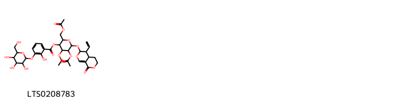
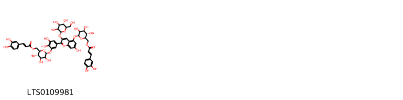
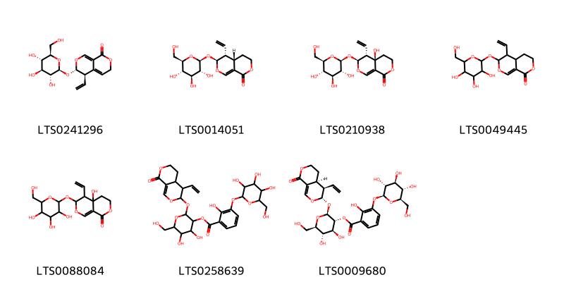
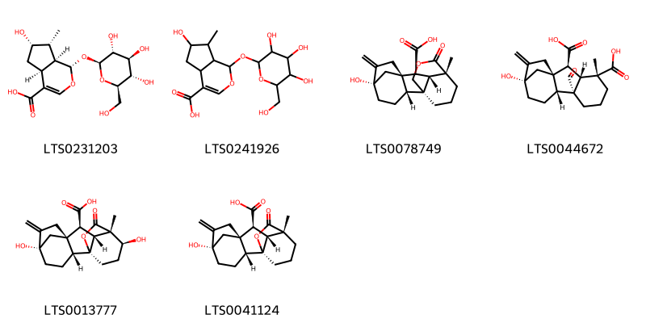

::: {.callout-note title = "Tóm tắt"}

 Long Đởm (Radix et Rhizoma Gentianae) là rễ và thân rễ đã phơi hay sấy khô của cây Long đởm (Gentiana scabra Bunge), cây Điều diệp long đởm (Gentiana manshurica Kitag.), cây Tam hoa long đởm (Gentiana triflora Pall.) hoặc cây Kiên long đởm (Gentiana rigescens Franch.), họ Long đởm (Gentianaceae). Loài cây này thường mọc ở các khu vực nhiệt đới và cận nhiệt đới, phân bố tại Trung Quốc, Việt Nam, Thái Lan, và một số nước Đông Nam Á. Theo y học cổ truyền, long đởm được sử dụng để chữa ho, long đờm, hen suyễn, và một số bệnh liên quan đến đường hô hấp. Ngoài ra, dược liệu này còn có tác dụng trị giun sán và giảm đau. Các nghiên cứu dược lý hiện đại đã chứng minh long đởm có những tác dụng như kháng khuẩn, chống viêm, giảm ho, giãn phế quản, và có hiệu quả an thần nhẹ. Thành phần hóa học chính của long đởm bao gồm các alkaloid như stemonine, tuberostemonine, isostemonine, cùng với các hợp chất phenolic.

:::

## I. Thông tin về dược liệu 

::: {.panel-tabset}

### Định danh

- Dược liệu tiếng Việt: Long Đởm - Rễ Và Thân Rễ
- Dược liệu tiếng Trung: nan (nan)
- Dược liệu tiếng Anh: nan
- Dược liệu latin thông dụng: Radix Et Rhizoma Gentianae
- Dược liệu latin kiểu DĐVN: *nan*
- Dược liệu latin kiểu DĐVN: *nan*
- Dược liệu latin kiểu thông tư: *nan*
- Bộ phận dùng: Rễ Và Thân Rễ (Radix)

### Mô tả dược liệu 

**Theo dược điển Việt nam V:** nan 
 
**Mô tả dược liệu theo thông tư chế biến dược liệu theo phương pháp cổ truyền:** nan

### Chế biến 

**Chế biến theo dược điển việt nam V**: nan 

**Chế biến theo thông tư:** nan

::: 

## II. Thông tin về thực vật

Dược liệu **Long Đởm - Rễ Và Thân Rễ** từ bộ phận **Rễ Và Thân Rễ** từ loài *Gentiana scabra*.

**Mô tả thực vật:** Cây long đờm là một loại cỏ sống lâu năm, cao 35-60cm. Thân rễ ngắn, rễ nhiều, đường kính 2-3mm, vỏ ngoài màu vàng nhạt. Thân mọcđứng, đơn độc hay 2-3 cành, đốt thường ngắn so với chiều dài của lá. Lá mọc đối, không cuống, lá phía dưới thân nhỏ, phía trên to rộng hơn, dài từ 3-8cm, rộng từ 0,4-3cm. Hoa hình chuông màu lam nhạt hay sẫm, mọc thành chùm không cuống ở đầu cành hoặc ở kẽ những lá phía trên.

*Tài liệu tham khảo:* "Những cây thuốc và vị thuốc Việt Nam" - Đỗ Tất Lợi 
Trong dược điển Việt nam, một số loài có thể dùng thay thế cho nhau làm dược liệu bao gồm *Gentiana scabra, Gentiana mans, Gentiana triflora*

            
::: {.callout-note title = "Phân loại thực vật của *Gentiana scabra*"}

**Kingdom:** Plantae 

**Phylum:** Tracheophyta 

**Order:** Gentianales 
 
**Family:** Gentianaceae 
 
**Genus:** Gentiana 
 
**Species:** *Gentiana scabra* 
 

:::

::: {style="display: grid;grid-template-columns: repeat(auto-fill, minmax(150px, 1fr));grid-gap: 1em;"}
{ group="GIBF" }

{ group="GIBF" }

{ group="GIBF" }

{ group="GIBF" }

{ group="GIBF" }

{ group="GIBF" }

{ group="GIBF" }

{ group="GIBF" }

{ group="GIBF" }

{ group="GIBF" }

{ group="GIBF" }

{ group="GIBF" }
:::

**Phân bố trên thế giới:** China, Korea, Republic of, Japan, Russian Federation

**Phân bố tại Việt nam:** Không có ghi nhận ở Việt Nam

<iframe src="Radix Et Rhizoma Gentianae/map_distribution.html" width="100%" height="600" style="border:none;"></iframe>

 
Chưa có thông tin về loài này trên gibf

            
::: {.callout-note title = "Phân loại thực vật của *Gentiana triflora*"}

**Kingdom:** Plantae 

**Phylum:** Tracheophyta 

**Order:** Gentianales 
 
**Family:** Gentianaceae 
 
**Genus:** Gentiana 
 
**Species:** *Gentiana triflora* 
 

:::

::: {style="display: grid;grid-template-columns: repeat(auto-fill, minmax(150px, 1fr));grid-gap: 1em;"}
{ group="GIBF" }

{ group="GIBF" }

{ group="GIBF" }

{ group="GIBF" }

{ group="GIBF" }

{ group="GIBF" }

{ group="GIBF" }

{ group="GIBF" }

{ group="GIBF" }

{ group="GIBF" }

{ group="GIBF" }

{ group="GIBF" }

{ group="GIBF" }

{ group="GIBF" }

{ group="GIBF" }

{ group="GIBF" }
:::

**Phân bố trên thế giới:** nan, Russian Federation, China, Japan, Korea, Republic of

**Phân bố tại Việt nam:** Không có ghi nhận ở Việt Nam

<iframe src="Radix Et Rhizoma Gentianae/map_distribution.html" width="100%" height="600" style="border:none;"></iframe>

## III. Thành phần hóa học

Theo tài liệu của GS. Đỗ Tất Lợi:  Trong long đờm có một glucozit đắng chừng 2% gọi là gentiopicrin C, H₂O, và một chất 20 đường gọi là gentianoza CH₁₂O16 chừng 4%.
Thủy phân gentiopicrin ta sẽ được gentiogenin CHO, và glucoza.
Gentianoza gồm hai phân tử glucoza và một phân tử fructoza.​12:25/-strong/-heart:>:o:-((:-hĐã gửi Xem trước khi gửiThả Files vào đây để xem lại trước khi gửi
    

Theo cơ sở dữ liệu lotus, loài *Gentiana triflora* đã phân lập và xác định được **15** hoạt chất thuộc về các nhóm Prenol lipids, Carboxylic acids and derivatives, Flavonoids, Organooxygen compounds trong bảng dưới đây.
        
| chemicalTaxonomyClassyfireClass   |   smiles_count |
|:----------------------------------|---------------:|
| Carboxylic acids and derivatives  |             98 |
| Flavonoids                        |            180 |
| Organooxygen compounds            |            535 |
| Prenol lipids                     |            452 |

Danh sách chi tiết các hoạt chất như sau: 

::: {style="display: grid;grid-template-columns: repeat(auto-fill, minmax(150px, 1fr));grid-gap: 1em;"}

                                                              
{ group="compound" description="Cấu trúc hóa học của các hoạt chất thuộc nhóm *Carboxylic acids and derivatives* là 4,5-bis(acetyloxy)-2-[(acetyloxy)methyl]-6-({4-ethenyl-8-oxo-3h,4h,4ah,5h,6h-pyrano[3,4-c]pyran-3-yl}oxy)oxan-3-yl 2-hydroxy-3-{[3,4,5-trihydroxy-6-(hydroxymethyl)oxan-2-yl]oxy}benzoate [(LTS0208783)](https://lotus.naturalproducts.net/compound/lotus_id/LTS0208783)." }

                                                              
{ group="compound" description="Cấu trúc hóa học của các hoạt chất thuộc nhóm *Flavonoids* là 5-{[(2s,4s,5s)-6-({[3-(3,4-dihydroxyphenyl)prop-2-enoyl]oxy}methyl)-3,4,5-trihydroxyoxan-2-yl]oxy}-2-(3-{[(2s,4s,5s)-6-({[3-(3,4-dihydroxyphenyl)prop-2-enoyl]oxy}methyl)-3,4,5-trihydroxyoxan-2-yl]oxy}-4,5-dihydroxyphenyl)-7-hydroxy-3-{[(2s,5s)-3,4,5-trihydroxy-6-(hydroxymethyl)oxan-2-yl]oxy}-1λ⁴-chromen-1-ylium [(LTS0109981)](https://lotus.naturalproducts.net/compound/lotus_id/LTS0109981)." }

                                                              
{ group="compound" description="Cấu trúc hóa học của các hoạt chất thuộc nhóm *Organooxygen compounds* là gentiopicroside [(LTS0241296)](https://lotus.naturalproducts.net/compound/lotus_id/LTS0241296), sweroside [(LTS0014051)](https://lotus.naturalproducts.net/compound/lotus_id/LTS0014051), swertiamarin [(LTS0210938)](https://lotus.naturalproducts.net/compound/lotus_id/LTS0210938), 5-ethenyl-6-{[3,4,5-trihydroxy-6-(hydroxymethyl)oxan-2-yl]oxy}-3h,4h,4ah,5h,6h-pyrano[3,4-c]pyran-1-one [(LTS0049445)](https://lotus.naturalproducts.net/compound/lotus_id/LTS0049445), 5-ethenyl-4a-hydroxy-6-{[3,4,5-trihydroxy-6-(hydroxymethyl)oxan-2-yl]oxy}-3h,4h,5h,6h-pyrano[3,4-c]pyran-1-one [(LTS0088084)](https://lotus.naturalproducts.net/compound/lotus_id/LTS0088084), 2-({4-ethenyl-8-oxo-3h,4h,4ah,5h,6h-pyrano[3,4-c]pyran-3-yl}oxy)-4,5-dihydroxy-6-(hydroxymethyl)oxan-3-yl 2-hydroxy-3-{[3,4,5-trihydroxy-6-(hydroxymethyl)oxan-2-yl]oxy}benzoate [(LTS0258639)](https://lotus.naturalproducts.net/compound/lotus_id/LTS0258639), (2s,3r,4s,5s,6r)-2-{[(3s,4r,4as)-4-ethenyl-8-oxo-3h,4h,4ah,5h,6h-pyrano[3,4-c]pyran-3-yl]oxy}-4,5-dihydroxy-6-(hydroxymethyl)oxan-3-yl 2-hydroxy-3-{[(2s,3r,4s,5s,6r)-3,4,5-trihydroxy-6-(hydroxymethyl)oxan-2-yl]oxy}benzoate [(LTS0009680)](https://lotus.naturalproducts.net/compound/lotus_id/LTS0009680)." }

                                                              
{ group="compound" description="Cấu trúc hóa học của các hoạt chất thuộc nhóm *Prenol lipids* là loganic acid [(LTS0231203)](https://lotus.naturalproducts.net/compound/lotus_id/LTS0231203), 6-hydroxy-7-methyl-1-{[3,4,5-trihydroxy-6-(hydroxymethyl)oxan-2-yl]oxy}-1h,4ah,5h,6h,7h,7ah-cyclopenta[c]pyran-4-carboxylic acid [(LTS0241926)](https://lotus.naturalproducts.net/compound/lotus_id/LTS0241926), gibberellin a44 [(LTS0078749)](https://lotus.naturalproducts.net/compound/lotus_id/LTS0078749), gibberellin a19 [(LTS0044672)](https://lotus.naturalproducts.net/compound/lotus_id/LTS0044672), gibberellin a1 [(LTS0013777)](https://lotus.naturalproducts.net/compound/lotus_id/LTS0013777), gibberellin a20 [(LTS0041124)](https://lotus.naturalproducts.net/compound/lotus_id/LTS0041124)." }

:::

---

## IV. Tác dụng dược lý

Theo tài liệu quốc tế: nan

---

## V. Dược điển Việt Nam V

### Soi bột

nan

::: {#listing-soibot}
:::

### Vi phẫu

nan

::: {#listing-viphau}
:::

### Định tính

nan

### Định lượng

nan

### Thông tin khác 

- **Độ ẩm:** nan
- **Bảo quản:** nan

## VI. Dược điển Hồng kong

::: {#listing-DDHK}
:::

---

## VII. Y dược học cổ truyền

::: {.callout-note title = "nan" }

**Tên vị thuốc:** nan

**Tính:** nan

**Vị:** nan

**Quy kinh:**  nan

**Công năng chủ trị:** nan

**Phân loại theo thông tư:** nan

**Tác dụng theo y dược cổ truyền:** nan

**Chú ý:** nan

**Kiêng kỵ:** nan 

:::

::: {#listing-ViThuoc}
:::

