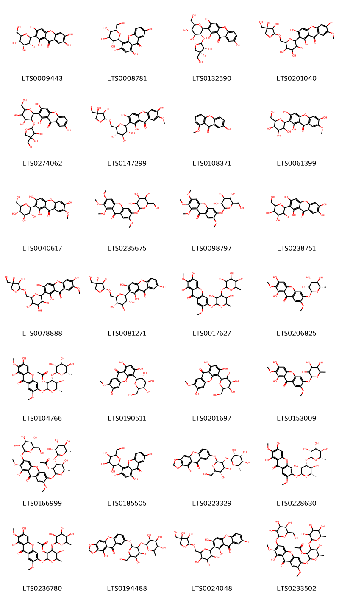
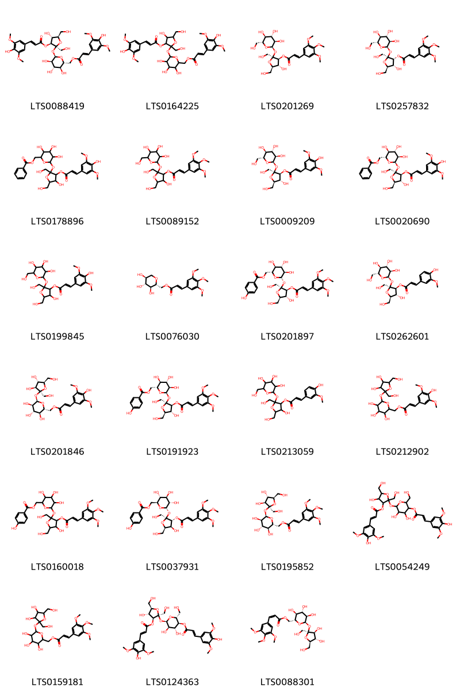
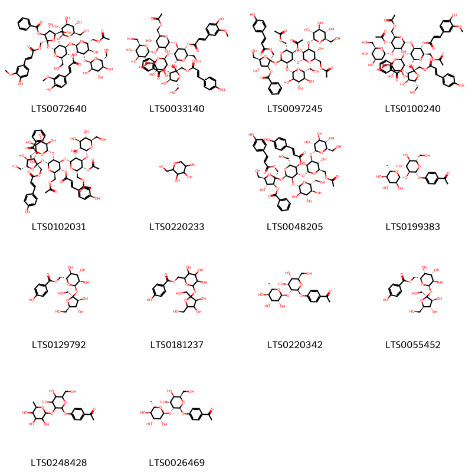
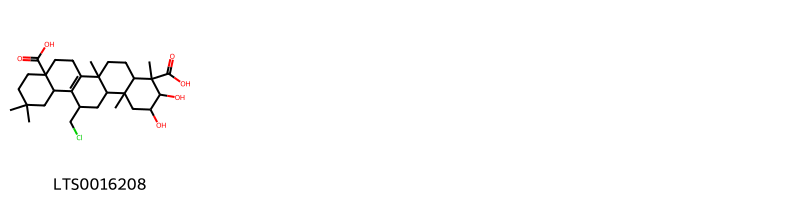

::: {.callout-note title = "Tóm tắt"}

Rễ viễn chí(Radix Polygalae) là rễ khô của cây viễn chí lá nhỏ (Polygala tenuifolia Wild.) hoặc viễn chí Xiberi (Polygala sibirica L.), thuộc họ Viễn chí (Polygalaceace). Viễn chí phân bố chủ yếu ở khu vực Á Âu. Ở Việt Nam, viễn chí vẫn chưa được khai thác nhiều, mới ghi nhận loài Polygala siribica L. có công dụng làm thuốc. Theo tài liệu cổ, viễn chí đắng, tính ôn, vào 2 kinh tâm và thận, dùng tối đa 6g/ngày. Rễ viễn chí dùng trừ đờm, điều trị suy nhược thần kinh, hay quên, sợ hãi, ung thư sưng thũng. Rễ viễn chí chứa nhiều thành phần hoá học như saponin, terpen, oligosaccharides, xanthon với chất tiềm năng là tenuifolin.

:::

## I. Thông tin về dược liệu 

::: {.panel-tabset}

### Định danh

- Dược liệu tiếng Việt: Viễn Chí - Rễ
- Dược liệu tiếng Trung: nan (nan)
- Dược liệu tiếng Anh: nan
- Dược liệu latin thông dụng: Radix Polygalae
- Dược liệu latin kiểu DĐVN: *nan*
- Dược liệu latin kiểu DĐVN: *nan*
- Dược liệu latin kiểu thông tư: *nan*
- Bộ phận dùng: Rễ (Radix)

### Mô tả dược liệu 

**Theo dược điển Việt nam V:** nan 
 
**Mô tả dược liệu theo thông tư chế biến dược liệu theo phương pháp cổ truyền:** nan

### Chế biến 

**Chế biến theo dược điển việt nam V**: nan 

**Chế biến theo thông tư:** nan

::: 

## II. Thông tin về thực vật

Dược liệu **Viễn Chí - Rễ** từ bộ phận **Rễ** từ loài *Polygala tenuifolia*.

**Mô tả thực vật:** Ở Việt Nam mới có P.sibirica L được ghi nhận có công dụng làm thuốc. Polygala sibirica L. là loại cỏ lâu năm, cao 10-20cm, đường kính của thân cây 1-6mm. Lá mọc so le. Lá phía dưới nhỏ hơn, hình mác dài 0,6-3cm, rộng 3-6mm, ở cả 2 mặt lá đều có lông nhỏ mịn. Hoa mọc thành chùm dài 3-7cm cánh hoa màu lam tím. Quả nang hình trứng dài độ 4-5mm.

*Tài liệu tham khảo:* "Những cây thuốc và vị thuốc Việt Nam" - Đỗ Tất Lợi 
Trong dược điển Việt nam, một số loài có thể dùng thay thế cho nhau làm dược liệu bao gồm *Polygala tenuifolia, Polygala sibirica*

            
::: {.callout-note title = "Phân loại thực vật của *Polygala tenuifolia*"}

**Kingdom:** Plantae 

**Phylum:** Tracheophyta 

**Order:** Fabales 
 
**Family:** Polygalaceae 
 
**Genus:** Polygala 
 
**Species:** *Polygala tenuifolia* 
 

:::

::: {style="display: grid;grid-template-columns: repeat(auto-fill, minmax(150px, 1fr));grid-gap: 1em;"}
{ group="GIBF" }

{ group="GIBF" }

{ group="GIBF" }

{ group="GIBF" }

{ group="GIBF" }

{ group="GIBF" }

{ group="GIBF" }

{ group="GIBF" }
:::

**Phân bố trên thế giới:** nan, Russian Federation, China, Korea, Republic of, Brazil, Mongolia

**Phân bố tại Việt nam:** Không có ghi nhận ở Việt Nam

<iframe src="Radix Polygalae/map_distribution.html" width="100%" height="600" style="border:none;"></iframe>

            
::: {.callout-note title = "Phân loại thực vật của *Polygala sibirica*"}

**Kingdom:** Plantae 

**Phylum:** Tracheophyta 

**Order:** Fabales 
 
**Family:** Polygalaceae 
 
**Genus:** Polygala 
 
**Species:** *Polygala sibirica* 
 

:::

::: {style="display: grid;grid-template-columns: repeat(auto-fill, minmax(150px, 1fr));grid-gap: 1em;"}
{ group="GIBF" }

{ group="GIBF" }

{ group="GIBF" }

{ group="GIBF" }

{ group="GIBF" }

{ group="GIBF" }

{ group="GIBF" }

{ group="GIBF" }

{ group="GIBF" }

{ group="GIBF" }

{ group="GIBF" }

{ group="GIBF" }
:::

**Phân bố trên thế giới:** China, Mongolia, Ukraine, Russian Federation

**Phân bố tại Việt nam:** Không có ghi nhận ở Việt Nam

<iframe src="Radix Polygalae/map_distribution.html" width="100%" height="600" style="border:none;"></iframe>

## III. Thành phần hóa học

Theo tài liệu của GS. Đỗ Tất Lợi:  (1) saponin, xanthon, oligosaccharides, terpen
(2) Tenuifolin 
    

Theo cơ sở dữ liệu lotus, loài *Polygala sibirica* đã phân lập và xác định được **66** hoạt chất thuộc về các nhóm Cinnamic acids and derivatives, Organooxygen compounds, Steroids and steroid derivatives, Benzopyrans trong bảng dưới đây.
        
| chemicalTaxonomyClassyfireClass   |   smiles_count |
|:----------------------------------|---------------:|
| Benzopyrans                       |           2246 |
| Cinnamic acids and derivatives    |           2207 |
| Organooxygen compounds            |           2199 |
| Steroids and steroid derivatives  |             73 |

Danh sách chi tiết các hoạt chất như sau: 

::: {style="display: grid;grid-template-columns: repeat(auto-fill, minmax(150px, 1fr));grid-gap: 1em;"}

                                                              
{ group="compound" description="Cấu trúc hóa học của các hoạt chất thuộc nhóm *Benzopyrans* là mangiferin [(LTS0009443)](https://lotus.naturalproducts.net/compound/lotus_id/LTS0009443), lancerin [(LTS0008781)](https://lotus.naturalproducts.net/compound/lotus_id/LTS0008781), 2-[(2s,3r,4s,5s,6r)-3-{[(2s,3r,4r)-3,4-dihydroxy-4-(hydroxymethyl)oxolan-2-yl]oxy}-4,5-dihydroxy-6-(hydroxymethyl)oxan-2-yl]-1,3,7-trihydroxyxanthen-9-one [(LTS0132590)](https://lotus.naturalproducts.net/compound/lotus_id/LTS0132590), 2-[6-({[(4r)-3,4-dihydroxy-4-(hydroxymethyl)oxolan-2-yl]oxy}methyl)-3,4,5-trihydroxyoxan-2-yl]-1,3,6-trihydroxy-7-methoxyxanthen-9-one [(LTS0201040)](https://lotus.naturalproducts.net/compound/lotus_id/LTS0201040), 2-(3-{[3,4-dihydroxy-4-(hydroxymethyl)oxolan-2-yl]oxy}-4,5-dihydroxy-6-(hydroxymethyl)oxan-2-yl)-1,3,7-trihydroxyxanthen-9-one [(LTS0274062)](https://lotus.naturalproducts.net/compound/lotus_id/LTS0274062), 2-[(2s,3r,4r,5s,6r)-6-({[(2r,3r,4r)-3,4-dihydroxy-4-(hydroxymethyl)oxolan-2-yl]oxy}methyl)-3,4,5-trihydroxyoxan-2-yl]-1,3,6-trihydroxy-7-methoxyxanthen-9-one [(LTS0147299)](https://lotus.naturalproducts.net/compound/lotus_id/LTS0147299), 7-hydroxy-1-methoxyxanthen-9-one [(LTS0108371)](https://lotus.naturalproducts.net/compound/lotus_id/LTS0108371), 1,3,6-trihydroxy-7-methoxy-2-[3,4,5-trihydroxy-6-(hydroxymethyl)oxan-2-yl]xanthen-9-one [(LTS0061399)](https://lotus.naturalproducts.net/compound/lotus_id/LTS0061399), 1,3,6-trihydroxy-7-methoxy-2-[(2s,3r,4r,5s,6r)-3,4,5-trihydroxy-6-(hydroxymethyl)oxan-2-yl]xanthen-9-one [(LTS0040617)](https://lotus.naturalproducts.net/compound/lotus_id/LTS0040617), 1,2,3,7-tetramethoxy-6-{[3,4,5-trihydroxy-6-(hydroxymethyl)oxan-2-yl]oxy}xanthen-9-one [(LTS0235675)](https://lotus.naturalproducts.net/compound/lotus_id/LTS0235675), 1,2,3,7-tetramethoxy-6-{[(2s,3r,4s,5s,6r)-3,4,5-trihydroxy-6-(hydroxymethyl)oxan-2-yl]oxy}xanthen-9-one [(LTS0098797)](https://lotus.naturalproducts.net/compound/lotus_id/LTS0098797), mangiferin [(LTS0238751)](https://lotus.naturalproducts.net/compound/lotus_id/LTS0238751), 2-[6-({[3,4-dihydroxy-4-(hydroxymethyl)oxolan-2-yl]oxy}methyl)-3,4,5-trihydroxyoxan-2-yl]-1,3,6-trihydroxy-7-methoxyxanthen-9-one [(LTS0078888)](https://lotus.naturalproducts.net/compound/lotus_id/LTS0078888), 2-[(2s,3r,4r,5s,6r)-6-({[(2r,3r,4r)-3,4-dihydroxy-4-(hydroxymethyl)oxolan-2-yl]oxy}methyl)-3,4,5-trihydroxyoxan-2-yl]-1,3,7-trihydroxyxanthen-9-one [(LTS0081271)](https://lotus.naturalproducts.net/compound/lotus_id/LTS0081271), 6-({3,5-dihydroxy-6-methyl-4-[(3,4,5-trihydroxy-6-methyloxan-2-yl)oxy]oxan-2-yl}oxy)-1,3-dihydroxy-2,7-dimethoxyxanthen-9-one [(LTS0017627)](https://lotus.naturalproducts.net/compound/lotus_id/LTS0017627), 1,3-dihydroxy-2,7-dimethoxy-6-{[(2s,3r,4r,5r,6s)-3,4,5-trihydroxy-6-methyloxan-2-yl]oxy}xanthen-9-one [(LTS0206825)](https://lotus.naturalproducts.net/compound/lotus_id/LTS0206825), (2s,3r,4r,5s,6s)-2-[(6,8-dihydroxy-2,7-dimethoxy-9-oxoxanthen-3-yl)oxy]-5-hydroxy-6-methyl-4-{[(2s,3r,4r,5r,6s)-3,4,5-trihydroxy-6-methyloxan-2-yl]oxy}oxan-3-yl acetate [(LTS0104766)](https://lotus.naturalproducts.net/compound/lotus_id/LTS0104766), 1,3,6-trihydroxy-7-methoxy-4-[(2s,3r,4r,5s,6r)-3,4,5-trihydroxy-6-(hydroxymethyl)oxan-2-yl]xanthen-9-one [(LTS0190511)](https://lotus.naturalproducts.net/compound/lotus_id/LTS0190511), 1,3,6-trihydroxy-7-methoxy-4-[3,4,5-trihydroxy-6-(hydroxymethyl)oxan-2-yl]xanthen-9-one [(LTS0201697)](https://lotus.naturalproducts.net/compound/lotus_id/LTS0201697), 1,3-dihydroxy-2,7-dimethoxy-6-[(3,4,5-trihydroxy-6-methyloxan-2-yl)oxy]xanthen-9-one [(LTS0153009)](https://lotus.naturalproducts.net/compound/lotus_id/LTS0153009), (2s,3r,4r,5s,6s)-5-hydroxy-2-[(8-hydroxy-2,7-dimethoxy-9-oxo-6-{[(2s,3r,4s,5s,6r)-3,4,5-trihydroxy-6-(hydroxymethyl)oxan-2-yl]oxy}xanthen-3-yl)oxy]-6-methyl-4-{[(2s,3r,4r,5r,6s)-3,4,5-trihydroxy-6-methyloxan-2-yl]oxy}oxan-3-yl acetate [(LTS0166999)](https://lotus.naturalproducts.net/compound/lotus_id/LTS0166999), 1,3,7-trihydroxy-4-[3,4,5-trihydroxy-6-(hydroxymethyl)oxan-2-yl]xanthen-9-one [(LTS0185505)](https://lotus.naturalproducts.net/compound/lotus_id/LTS0185505), 8-{[(2s,3r,4s,5s,6r)-4,5-dihydroxy-6-(hydroxymethyl)-3-{[(2s,3r,4r,5r,6s)-3,4,5-trihydroxy-6-methyloxan-2-yl]oxy}oxan-2-yl]oxy}-11-hydroxy-2h-[1,3]dioxolo[4,5-b]xanthen-10-one [(LTS0223329)](https://lotus.naturalproducts.net/compound/lotus_id/LTS0223329), 6-{[(2s,3r,4r,5s,6s)-3,5-dihydroxy-6-methyl-4-{[(2s,3r,4r,5r,6s)-3,4,5-trihydroxy-6-methyloxan-2-yl]oxy}oxan-2-yl]oxy}-1,3-dihydroxy-2,7-dimethoxyxanthen-9-one [(LTS0228630)](https://lotus.naturalproducts.net/compound/lotus_id/LTS0228630), 2-[(6,8-dihydroxy-2,7-dimethoxy-9-oxoxanthen-3-yl)oxy]-5-hydroxy-6-methyl-4-[(3,4,5-trihydroxy-6-methyloxan-2-yl)oxy]oxan-3-yl acetate [(LTS0236780)](https://lotus.naturalproducts.net/compound/lotus_id/LTS0236780), 8-{[4,5-dihydroxy-6-(hydroxymethyl)-3-[(3,4,5-trihydroxy-6-methyloxan-2-yl)oxy]oxan-2-yl]oxy}-11-hydroxy-2h-[1,3]dioxolo[4,5-b]xanthen-10-one [(LTS0194488)](https://lotus.naturalproducts.net/compound/lotus_id/LTS0194488), 2-[6-({[3,4-dihydroxy-4-(hydroxymethyl)oxolan-2-yl]oxy}methyl)-3,4,5-trihydroxyoxan-2-yl]-1,3,7-trihydroxyxanthen-9-one [(LTS0024048)](https://lotus.naturalproducts.net/compound/lotus_id/LTS0024048), 5-hydroxy-2-[(8-hydroxy-2,7-dimethoxy-9-oxo-6-{[3,4,5-trihydroxy-6-(hydroxymethyl)oxan-2-yl]oxy}xanthen-3-yl)oxy]-6-methyl-4-[(3,4,5-trihydroxy-6-methyloxan-2-yl)oxy]oxan-3-yl acetate [(LTS0233502)](https://lotus.naturalproducts.net/compound/lotus_id/LTS0233502)." }

                                                              
{ group="compound" description="Cấu trúc hóa học của các hoạt chất thuộc nhóm *Cinnamic acids and derivatives* là [(2r,3s,4s,5r,6r)-3,4,5-trihydroxy-6-{[(2s,3s,4r,5r)-4-hydroxy-3-{[(2e)-3-(4-hydroxy-3,5-dimethoxyphenyl)prop-2-enoyl]oxy}-2,5-bis(hydroxymethyl)oxolan-2-yl]oxy}oxan-2-yl]methyl (2e)-3-(4-hydroxy-3,5-dimethoxyphenyl)prop-2-enoate [(LTS0088419)](https://lotus.naturalproducts.net/compound/lotus_id/LTS0088419), {3,4,5-trihydroxy-6-[(4-hydroxy-3-{[3-(4-hydroxy-3,5-dimethoxyphenyl)prop-2-enoyl]oxy}-2,5-bis(hydroxymethyl)oxolan-2-yl)oxy]oxan-2-yl}methyl 3-(4-hydroxy-3,5-dimethoxyphenyl)prop-2-enoate [(LTS0164225)](https://lotus.naturalproducts.net/compound/lotus_id/LTS0164225), (2s,3s,4r,5r)-4-hydroxy-2,5-bis(hydroxymethyl)-2-{[(2r,3r,4s,5s,6r)-3,4,5-trihydroxy-6-(hydroxymethyl)oxan-2-yl]oxy}oxolan-3-yl (2e)-3-(3,4,5-trimethoxyphenyl)prop-2-enoate [(LTS0201269)](https://lotus.naturalproducts.net/compound/lotus_id/LTS0201269), (2s,3r,4r,5r)-4-hydroxy-2,5-bis(hydroxymethyl)-2-{[(2r,3r,4s,5s,6r)-3,4,5-trihydroxy-6-(hydroxymethyl)oxan-2-yl]oxy}oxolan-3-yl (2e)-3-(3,4,5-trimethoxyphenyl)prop-2-enoate [(LTS0257832)](https://lotus.naturalproducts.net/compound/lotus_id/LTS0257832), {3,4,5-trihydroxy-6-[(4-hydroxy-3-{[3-(4-hydroxy-3,5-dimethoxyphenyl)prop-2-enoyl]oxy}-2,5-bis(hydroxymethyl)oxolan-2-yl)oxy]oxan-2-yl}methyl benzoate [(LTS0178896)](https://lotus.naturalproducts.net/compound/lotus_id/LTS0178896), 4-hydroxy-2,5-bis(hydroxymethyl)-2-{[3,4,5-trihydroxy-6-(hydroxymethyl)oxan-2-yl]oxy}oxolan-3-yl 3-(3,4,5-trimethoxyphenyl)prop-2-enoate [(LTS0089152)](https://lotus.naturalproducts.net/compound/lotus_id/LTS0089152), (2s,3s,4r,5r)-4-hydroxy-2,5-bis(hydroxymethyl)-2-{[(2r,3r,4s,5s,6r)-3,4,5-trihydroxy-6-(hydroxymethyl)oxan-2-yl]oxy}oxolan-3-yl (2e)-3-(4-hydroxy-3,5-dimethoxyphenyl)prop-2-enoate [(LTS0009209)](https://lotus.naturalproducts.net/compound/lotus_id/LTS0009209), [(2r,3s,4s,5r,6r)-3,4,5-trihydroxy-6-{[(2s,3s,4r,5r)-4-hydroxy-3-{[(2e)-3-(4-hydroxy-3,5-dimethoxyphenyl)prop-2-enoyl]oxy}-2,5-bis(hydroxymethyl)oxolan-2-yl]oxy}oxan-2-yl]methyl benzoate [(LTS0020690)](https://lotus.naturalproducts.net/compound/lotus_id/LTS0020690), 4-hydroxy-2,5-bis(hydroxymethyl)-2-{[3,4,5-trihydroxy-6-(hydroxymethyl)oxan-2-yl]oxy}oxolan-3-yl 3-(4-hydroxy-3,5-dimethoxyphenyl)prop-2-enoate [(LTS0199845)](https://lotus.naturalproducts.net/compound/lotus_id/LTS0199845), tenuifoliside d [(LTS0076030)](https://lotus.naturalproducts.net/compound/lotus_id/LTS0076030), [(2r,3s,4s,5r,6s)-3,4,5-trihydroxy-6-{[(2s,3s,4r,5r)-4-hydroxy-2,5-bis(hydroxymethyl)-3-{[(2e)-3-(3,4,5-trimethoxyphenyl)prop-2-enoyl]oxy}oxolan-2-yl]oxy}oxan-2-yl]methyl 4-hydroxybenzoate [(LTS0201897)](https://lotus.naturalproducts.net/compound/lotus_id/LTS0201897), (2s,3s,4r,5r)-4-hydroxy-2,5-bis(hydroxymethyl)-2-{[(2r,3r,4s,5s,6r)-3,4,5-trihydroxy-6-(hydroxymethyl)oxan-2-yl]oxy}oxolan-3-yl (2e)-3-(4-hydroxy-3-methoxyphenyl)prop-2-enoate [(LTS0262601)](https://lotus.naturalproducts.net/compound/lotus_id/LTS0262601), [(2r,3s,4s,5r,6r)-6-{[(2s,3s,4s,5r)-3,4-dihydroxy-2,5-bis(hydroxymethyl)oxolan-2-yl]oxy}-3,4,5-trihydroxyoxan-2-yl]methyl (2e)-3-(4-hydroxy-3,5-dimethoxyphenyl)prop-2-enoate [(LTS0201846)](https://lotus.naturalproducts.net/compound/lotus_id/LTS0201846), tenuifoliside a [(LTS0191923)](https://lotus.naturalproducts.net/compound/lotus_id/LTS0191923), 4-hydroxy-2,5-bis(hydroxymethyl)-2-{[3,4,5-trihydroxy-6-(hydroxymethyl)oxan-2-yl]oxy}oxolan-3-yl 3-(4-hydroxy-3-methoxyphenyl)prop-2-enoate [(LTS0213059)](https://lotus.naturalproducts.net/compound/lotus_id/LTS0213059), (6-{[3,4-dihydroxy-2,5-bis(hydroxymethyl)oxolan-2-yl]oxy}-3,4,5-trihydroxyoxan-2-yl)methyl 3-(4-hydroxy-3,5-dimethoxyphenyl)prop-2-enoate [(LTS0212902)](https://lotus.naturalproducts.net/compound/lotus_id/LTS0212902), (3,4,5-trihydroxy-6-{[4-hydroxy-2,5-bis(hydroxymethyl)-3-{[3-(3,4,5-trimethoxyphenyl)prop-2-enoyl]oxy}oxolan-2-yl]oxy}oxan-2-yl)methyl 4-hydroxybenzoate [(LTS0160018)](https://lotus.naturalproducts.net/compound/lotus_id/LTS0160018), [(2s,3r,4r,5s,6s)-3,4,5-trihydroxy-6-{[(2s,3r,4s,5r)-4-hydroxy-2,5-bis(hydroxymethyl)-3-{[(2e)-3-(3,4,5-trimethoxyphenyl)prop-2-enoyl]oxy}oxolan-2-yl]oxy}oxan-2-yl]methyl 4-hydroxybenzoate [(LTS0037931)](https://lotus.naturalproducts.net/compound/lotus_id/LTS0037931), [(2r,3s,4s,5r,6r)-6-{[(2s,3s,4s,5r)-3,4-dihydroxy-2,5-bis(hydroxymethyl)oxolan-2-yl]oxy}-3,4,5-trihydroxyoxan-2-yl]methyl (2e)-3-(3,4,5-trimethoxyphenyl)prop-2-enoate [(LTS0195852)](https://lotus.naturalproducts.net/compound/lotus_id/LTS0195852), 4,5-dihydroxy-6-[(4-hydroxy-3-{[3-(4-hydroxy-3,5-dimethoxyphenyl)prop-2-enoyl]oxy}-2,5-bis(hydroxymethyl)oxolan-2-yl)oxy]-2-(hydroxymethyl)oxan-3-yl 3-(4-hydroxy-3,5-dimethoxyphenyl)prop-2-enoate [(LTS0054249)](https://lotus.naturalproducts.net/compound/lotus_id/LTS0054249), (6-{[3,4-dihydroxy-2,5-bis(hydroxymethyl)oxolan-2-yl]oxy}-3,4,5-trihydroxyoxan-2-yl)methyl 3-(3,4,5-trimethoxyphenyl)prop-2-enoate [(LTS0159181)](https://lotus.naturalproducts.net/compound/lotus_id/LTS0159181), (2r,3s,4r,5r,6r)-4,5-dihydroxy-6-{[(2s,3s,4r,5r)-4-hydroxy-3-{[(2e)-3-(4-hydroxy-3,5-dimethoxyphenyl)prop-2-enoyl]oxy}-2,5-bis(hydroxymethyl)oxolan-2-yl]oxy}-2-(hydroxymethyl)oxan-3-yl (2e)-3-(4-hydroxy-3,5-dimethoxyphenyl)prop-2-enoate [(LTS0124363)](https://lotus.naturalproducts.net/compound/lotus_id/LTS0124363), [(2r,3s,4s,5r,6r)-6-{[(2s,3s,4s,5r)-3,4-dihydroxy-2,5-bis(hydroxymethyl)oxolan-2-yl]oxy}-3,4,5-trihydroxyoxan-2-yl]methyl (2z)-3-(3,4,5-trimethoxyphenyl)prop-2-enoate [(LTS0088301)](https://lotus.naturalproducts.net/compound/lotus_id/LTS0088301)." }

                                                              
{ group="compound" description="Cấu trúc hóa học của các hoạt chất thuộc nhóm *Organooxygen compounds* là (2s,3s,4r,5r)-2-{[(2r,3r,4s,5r,6r)-4-{[(2r,3r,4s,5r,6r)-6-[(acetyloxy)methyl]-3,5-dihydroxy-4-{[(2r,3r,4s,5s,6r)-3,4,5-trihydroxy-6-(hydroxymethyl)oxan-2-yl]oxy}oxan-2-yl]oxy}-5-{[(2e)-3-(4-hydroxy-3-methoxyphenyl)prop-2-enoyl]oxy}-6-(hydroxymethyl)-3-{[(2s,3r,4s,5s,6r)-3,4,5-trihydroxy-6-(hydroxymethyl)oxan-2-yl]oxy}oxan-2-yl]oxy}-4-hydroxy-2-({[(2e)-3-(4-hydroxy-3-methoxyphenyl)prop-2-enoyl]oxy}methyl)-5-(hydroxymethyl)oxolan-3-yl benzoate [(LTS0072640)](https://lotus.naturalproducts.net/compound/lotus_id/LTS0072640), (2s,3s,4r,5r)-2-{[(2r,3r,4s,5r,6r)-4-{[(2r,3r,4s,5r,6r)-6-[(acetyloxy)methyl]-3,5-dihydroxy-4-{[(2r,3r,4s,5s,6r)-3,4,5-trihydroxy-6-(hydroxymethyl)oxan-2-yl]oxy}oxan-2-yl]oxy}-5-{[(2e)-3-(4-hydroxy-3-methoxyphenyl)prop-2-enoyl]oxy}-6-(hydroxymethyl)-3-{[(2s,3r,4s,5s,6r)-3,4,5-trihydroxy-6-(hydroxymethyl)oxan-2-yl]oxy}oxan-2-yl]oxy}-4-hydroxy-5-(hydroxymethyl)-2-({[(2e)-3-(4-hydroxyphenyl)prop-2-enoyl]oxy}methyl)oxolan-3-yl benzoate [(LTS0033140)](https://lotus.naturalproducts.net/compound/lotus_id/LTS0033140), (2s,3s,4r,5r)-2-{[(2r,3r,4s,5r,6r)-5-(acetyloxy)-6-[(acetyloxy)methyl]-4-{[(2r,3r,4s,5r,6r)-6-[(acetyloxy)methyl]-3,5-dihydroxy-4-{[(2r,3r,4s,5s,6r)-3,4,5-trihydroxy-6-(hydroxymethyl)oxan-2-yl]oxy}oxan-2-yl]oxy}-3-{[(2s,3r,4s,5s,6r)-3,4,5-trihydroxy-6-(hydroxymethyl)oxan-2-yl]oxy}oxan-2-yl]oxy}-4-hydroxy-5-(hydroxymethyl)-2-({[(2e)-3-(4-hydroxyphenyl)prop-2-enoyl]oxy}methyl)oxolan-3-yl benzoate [(LTS0097245)](https://lotus.naturalproducts.net/compound/lotus_id/LTS0097245), (2s,3s,4r,5r)-2-{[(2r,3r,4s,5r,6r)-4-{[(2r,3r,4r,5r,6r)-5-(acetyloxy)-6-[(acetyloxy)methyl]-3-hydroxy-4-{[(2r,3r,4s,5s,6r)-3,4,5-trihydroxy-6-(hydroxymethyl)oxan-2-yl]oxy}oxan-2-yl]oxy}-6-[(acetyloxy)methyl]-5-{[(2e)-3-(4-hydroxy-3-methoxyphenyl)prop-2-enoyl]oxy}-3-{[(2s,3r,4s,5s,6r)-3,4,5-trihydroxy-6-(hydroxymethyl)oxan-2-yl]oxy}oxan-2-yl]oxy}-4-hydroxy-5-(hydroxymethyl)-2-({[(2e)-3-(4-hydroxyphenyl)prop-2-enoyl]oxy}methyl)oxolan-3-yl benzoate [(LTS0100240)](https://lotus.naturalproducts.net/compound/lotus_id/LTS0100240), (2s,3s,4r,5r)-2-{[(2r,3r,4s,5r,6r)-4-{[(2r,3r,4r,5r,6r)-5-(acetyloxy)-6-[(acetyloxy)methyl]-3-hydroxy-4-{[(2r,3r,4s,5s,6r)-3,4,5-trihydroxy-6-(hydroxymethyl)oxan-2-yl]oxy}oxan-2-yl]oxy}-6-[(acetyloxy)methyl]-5-{[(2e)-3-(4-hydroxyphenyl)prop-2-enoyl]oxy}-3-{[(2s,3r,4s,5s,6r)-3,4,5-trihydroxy-6-(hydroxymethyl)oxan-2-yl]oxy}oxan-2-yl]oxy}-4-hydroxy-5-(hydroxymethyl)-2-({[(2e)-3-(4-hydroxyphenyl)prop-2-enoyl]oxy}methyl)oxolan-3-yl benzoate [(LTS0102031)](https://lotus.naturalproducts.net/compound/lotus_id/LTS0102031), 2-(hydroxymethyl)oxane-3,4,5-triol [(LTS0220233)](https://lotus.naturalproducts.net/compound/lotus_id/LTS0220233), (2s,3s,4r,5r)-2-{[(2r,3r,4s,5r,6r)-4-{[(2r,3r,4s,5r,6r)-6-[(acetyloxy)methyl]-3,5-dihydroxy-4-{[(2r,3r,4s,5s,6r)-3,4,5-trihydroxy-6-(hydroxymethyl)oxan-2-yl]oxy}oxan-2-yl]oxy}-6-(hydroxymethyl)-5-{[(2e)-3-(4-hydroxyphenyl)prop-2-enoyl]oxy}-3-{[(2s,3r,4s,5s,6r)-3,4,5-trihydroxy-6-(hydroxymethyl)oxan-2-yl]oxy}oxan-2-yl]oxy}-4-hydroxy-5-(hydroxymethyl)-2-({[(2e)-3-(4-hydroxyphenyl)prop-2-enoyl]oxy}methyl)oxolan-3-yl benzoate [(LTS0048205)](https://lotus.naturalproducts.net/compound/lotus_id/LTS0048205), 1-(4-{[(2r,3s,4r,5r,6s)-4,5-dihydroxy-6-(hydroxymethyl)-3-{[(2r,3s,4r,5r,6s)-3,4,5-trihydroxy-6-methyloxan-2-yl]oxy}oxan-2-yl]oxy}phenyl)ethanone [(LTS0199383)](https://lotus.naturalproducts.net/compound/lotus_id/LTS0199383), [(2r,3s,4s,5r,6r)-6-{[(2s,3s,4s,5r)-3,4-dihydroxy-2,5-bis(hydroxymethyl)oxolan-2-yl]oxy}-3,4,5-trihydroxyoxan-2-yl]methyl 4-hydroxybenzoate [(LTS0129792)](https://lotus.naturalproducts.net/compound/lotus_id/LTS0129792), (6-{[3,4-dihydroxy-2,5-bis(hydroxymethyl)oxolan-2-yl]oxy}-3,4,5-trihydroxyoxan-2-yl)methyl 4-hydroxybenzoate [(LTS0181237)](https://lotus.naturalproducts.net/compound/lotus_id/LTS0181237), 1-(4-{[(2s,3r,4s,5s,6r)-4,5-dihydroxy-6-(hydroxymethyl)-3-{[(2s,3r,4r,5r,6s)-3,4,5-trihydroxy-6-methyloxan-2-yl]oxy}oxan-2-yl]oxy}phenyl)ethanone [(LTS0220342)](https://lotus.naturalproducts.net/compound/lotus_id/LTS0220342), [(2r,3r,4s,5r,6r)-6-{[(2s,3s,4s,5r)-3,4-dihydroxy-2,5-bis(hydroxymethyl)oxolan-2-yl]oxy}-3,4,5-trihydroxyoxan-2-yl]methyl 4-hydroxybenzoate [(LTS0055452)](https://lotus.naturalproducts.net/compound/lotus_id/LTS0055452), 1-(4-{[4,5-dihydroxy-6-(hydroxymethyl)-3-[(3,4,5-trihydroxy-6-methyloxan-2-yl)oxy]oxan-2-yl]oxy}phenyl)ethanone [(LTS0248428)](https://lotus.naturalproducts.net/compound/lotus_id/LTS0248428), 1-(4-{[(2s,3r,4s,5r,6r)-4,5-dihydroxy-6-(hydroxymethyl)-3-{[(2s,3r,4r,5r,6s)-3,4,5-trihydroxy-6-methyloxan-2-yl]oxy}oxan-2-yl]oxy}phenyl)ethanone [(LTS0026469)](https://lotus.naturalproducts.net/compound/lotus_id/LTS0026469)." }

                                                              
{ group="compound" description="Cấu trúc hóa học của các hoạt chất thuộc nhóm *Steroids and steroid derivatives* là 13-(chloromethyl)-2,3-dihydroxy-4,6a,11,11,14b-pentamethyl-2,3,4a,5,6,7,8,9,10,12,12a,13,14,14a-tetradecahydro-1h-picene-4,8a-dicarboxylic acid [(LTS0016208)](https://lotus.naturalproducts.net/compound/lotus_id/LTS0016208)." }

:::

---

## IV. Tác dụng dược lý

Theo tài liệu quốc tế: nan

---

## V. Dược điển Việt Nam V

### Soi bột

nan

::: {#listing-soibot}
:::

### Vi phẫu

nan

::: {#listing-viphau}
:::

### Định tính

nan

### Định lượng

nan

### Thông tin khác 

- **Độ ẩm:** nan
- **Bảo quản:** nan

## VI. Dược điển Hồng kong

::: {#listing-DDHK}
:::

---

## VII. Y dược học cổ truyền

::: {.callout-note title = "nan" }

**Tên vị thuốc:** nan

**Tính:** nan

**Vị:** nan

**Quy kinh:**  nan

**Công năng chủ trị:** nan

**Phân loại theo thông tư:** nan

**Tác dụng theo y dược cổ truyền:** nan

**Chú ý:** nan

**Kiêng kỵ:** nan 

:::

::: {#listing-ViThuoc}
:::

