::: {.callout-note title = "Tóm tắt"}

nan

:::

## I. Thông tin về dược liệu 

::: {.panel-tabset}

### Định danh

- Dược liệu tiếng Việt: Thục Địa - Rễ Củ Đã Chế Biến
- Dược liệu tiếng Trung: ? (?)
- Dược liệu tiếng Anh: ?
- Dược liệu latin thông dụng: Radix Rehmanniae Glutinosae Praeparata
- Dược liệu latin kiểu DĐVN: *Radix Rehmanniae Glutinosae Praeparata*
- Dược liệu latin kiểu DĐVN: *nan*
- Dược liệu latin kiểu thông tư: *nan*
- Bộ phận dùng: Rễ Củ Đã Chế Biến (Radix praeparata)

### Mô tả dược liệu 

**Theo dược điển Việt nam V:** Phiến dày hoặc khối không đều. Mặt ngoài bóng. Chất mềm, dai, khó bẻ gãy. Mặt cắt ngang đến nhánh, mịn bỏng. Không mùi, vị ngọt. 
 
**Mô tả dược liệu theo thông tư chế biến dược liệu theo phương pháp cổ truyền:** nan

### Chế biến 

**Chế biến theo dược điển việt nam V**: <i>Cách</i> <i>1</i>: Lấy Sinh địa đã rửa sạch, cho vào thùng, xếp củ to ở dưới, cù nhỏ ở trên. Cứ 90 kg Sinh địa thêm 10 L rượu. đun đến sôi, tiếp tục đun nhỏ lửa từ 6 h đến 8 h cho đến cạn. Trong khi đun, cứ khoảng 1 h lại lấy nước ở đáy nồi tưới lên các củ cho thâm đều. Sau lấy ra phơi 3 ngày, rồi lại đem nấu lần thứ 2 với nước gừng. Dùng 2 kg Gừng tươi giã nhỏ cho vào nước, khuấy đều, lọc lấy nước, nấu với Sinh địa. Sau đó lại vớt Sinh địa ra phơi, rồi lại nấu. Làm như vậy 5 lần đến 7 lần, đến khi dược liệu có màu đến nhánh. <i>Cách 2:</i> Công thức: Sinh địa                                                           100 kg Sa nhân                                                           1,5 kg Gừng tươi                                                        10,0 kg Rượu (hàm lượng ethanol 22 % đến 25 %)    45,0 L Lấy sinh địa, loại bỏ đất cắt, rửa sạch, để ráo nước. Lấy gừng tươi, rửa sạch, thái nhỏ hoặc xay ướt. Lấy sa nhân, loại bỏ tạp chất, rửa sạch, đập, giã hoặc xay nhỏ. Cho gừng tươi và sa nhân vào nồi nấu hai vỏ. Thêm nước, đun sôi, điều chỉnh nhiệt độ để sôi âm ỉ trong 1 h, rút dịch chiết sa nhân – gừng để được khoảng 50 L. Cho sinh địa đã ráo nước vào nồi nấu hai vỏ. Tẩm sinh địa với 1.2 lượng rượu theo công thức (22,5 L) cùng với dịch chiết sa nhân – gừng, ngâm ủ trong 2 h. Nếu lượng dịch sa nhân – gừng, rượu chưa đủ ngập sinh địa thì bổ sung thêm nước sạch (yêu cầu cao hơn mặt sinh địa 2 cm đến 3 em). Tiến hành nấu trong 3 ngày, mỗi ngày đun âm ỉ trong 6 h. Đêm ngừng nấu. Sau mỗi ngày bổ sung thêm nước sôi cho đủ ngập. Đến ngày thứ 4 thì rút dịch nấu, gộp cùng 1/2 lượng rượu còn lại. Sinh địa trong nồi được đảo trộn dưới cho đều. Đổ lượng dịch nấu gộp với rượu ở trên vào nồi và ngâm ủ trong 2 h. Bổ sung nước cho ngập rôi đun âm ỉ tiếp trong 6 h. Đêm ngừng nấu. Ngày thứ 5 tiếp tục nấu và điều chỉnh lượng nước sao cho lượng dịch nấu rút ra ngày hôm sau chi còn khoảng 9 L đến 10 L. Sinh địa được nấu trở nên đen nhánh, có mùi thơm, vị ngọt. Để nguyên hoặc thái lát dày 3 mm đến 4 mm. sấy. Tẩm với dịch còn lại trong quá trình sấy. Quá trinh tẩm – sấy (hoặc phơi nắng) được làm liên tục cho tới khi hết dịch và thục địa thu được trở nên đến, láng bóng, khô, dẻo, thớ dai chắc, sờ không dính tay là được. 

**Chế biến theo thông tư:** nan

::: 

## II. Thông tin về thực vật

Dược liệu **Thục Địa - Rễ Củ Đã Chế Biến** từ bộ phận **Rễ Củ Đã Chế Biến** từ loài *Rehmannia glutinosa*.

**Mô tả thực vật:** nan

*Tài liệu tham khảo:* nan 
Trong dược điển Việt nam, loài *Rehmannia glutinosa* được sử dụng làm dược liệu.

            
::: {.callout-note title = "Phân loại thực vật của *Rehmannia glutinosa*"}

**Kingdom:** Plantae 

**Phylum:** Tracheophyta 

**Order:** Lamiales 
 
**Family:** Rehmanniaceae 
 
**Genus:** Rehmannia 
 
**Species:** *Rehmannia glutinosa* 
 

:::

::: {style="display: grid;grid-template-columns: repeat(auto-fill, minmax(150px, 1fr));grid-gap: 1em;"}
{ group="GIBF" }

{ group="GIBF" }

{ group="GIBF" }

{ group="GIBF" }

{ group="GIBF" }

{ group="GIBF" }
:::

**Phân bố trên thế giới:** nan, United States of America, China, Sweden, New Zealand, Brazil, Korea, Republic of

**Phân bố tại Việt nam:** Không có ghi nhận ở Việt Nam

<iframe src="Radix Rehmanniae Glutinosae Praeparata/map_distribution.html" width="100%" height="600" style="border:none;"></iframe>

## III. Thành phần hóa học

Theo tài liệu của GS. Đỗ Tất Lợi:  nan
    

Theo cơ sở dữ liệu lotus, loài *Rehmannia glutinosa* đã phân lập và xác định được **228** hoạt chất thuộc về các nhóm Cinnamic acids and derivatives, Naphthopyrans, Pyrans, Carboxylic acids and derivatives, Diazines, Epoxides, Dihydrofurans, Pyrimidine nucleosides, Organooxygen compounds, Indoles and derivatives, Lactones, Prenol lipids, Tannins, Oxanes, Steroids and steroid derivatives, Fatty Acyls, Hydroxy acids and derivatives, Furans, Sphingolipids, Organonitrogen compounds, Heteroaromatic compounds, Oxepanes trong bảng dưới đây.
        
| chemicalTaxonomyClassyfireClass   |   smiles_count |
|:----------------------------------|---------------:|
| Carboxylic acids and derivatives  |            679 |
| Cinnamic acids and derivatives    |           2744 |
| Diazines                          |             12 |
| Dihydrofurans                     |             18 |
| Epoxides                          |             21 |
| Fatty Acyls                       |            516 |
| Furans                            |             34 |
| Heteroaromatic compounds          |             52 |
| Hydroxy acids and derivatives     |             21 |
| Indoles and derivatives           |             29 |
| Lactones                          |            103 |
| Naphthopyrans                     |             77 |
| Organonitrogen compounds          |             38 |
| Organooxygen compounds            |           5692 |
| Oxanes                            |             98 |
| Oxepanes                          |             25 |
| Prenol lipids                     |           7722 |
| Pyrans                            |             44 |
| Pyrimidine nucleosides            |             46 |
| Sphingolipids                     |            104 |
| Steroids and steroid derivatives  |             83 |
| Tannins                           |            618 |

Danh sách chi tiết các hoạt chất như sau: 

::: {style="display: grid;grid-template-columns: repeat(auto-fill, minmax(150px, 1fr));grid-gap: 1em;"}

                                                              
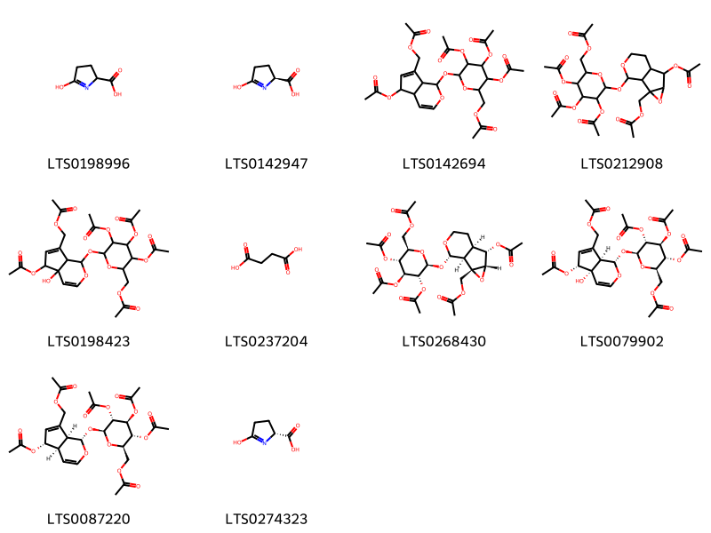{ group="compound" description="Cấu trúc hóa học của các hoạt chất thuộc nhóm *Carboxylic acids and derivatives* là pyroglutamic acid [(LTS0198996)](https://lotus.naturalproducts.net/compound/lotus_id/LTS0198996), pyroglutamic acid [(LTS0142947)](https://lotus.naturalproducts.net/compound/lotus_id/LTS0142947), [5-(acetyloxy)-1-{[3,4,5-tris(acetyloxy)-6-[(acetyloxy)methyl]oxan-2-yl]oxy}-1h,4ah,5h,7ah-cyclopenta[c]pyran-7-yl]methyl acetate [(LTS0142694)](https://lotus.naturalproducts.net/compound/lotus_id/LTS0142694), [5-(acetyloxy)-10-{[3,4,5-tris(acetyloxy)-6-[(acetyloxy)methyl]oxan-2-yl]oxy}-3,9-dioxatricyclo[4.4.0.0²,⁴]decan-2-yl]methyl acetate [(LTS0212908)](https://lotus.naturalproducts.net/compound/lotus_id/LTS0212908), [5-(acetyloxy)-4a-hydroxy-1-{[3,4,5-tris(acetyloxy)-6-[(acetyloxy)methyl]oxan-2-yl]oxy}-1h,5h,7ah-cyclopenta[c]pyran-7-yl]methyl acetate [(LTS0198423)](https://lotus.naturalproducts.net/compound/lotus_id/LTS0198423), succinic acid [(LTS0237204)](https://lotus.naturalproducts.net/compound/lotus_id/LTS0237204), [(1s,2s,4s,5s,6r,10s)-5-(acetyloxy)-10-{[(2s,3r,4s,5r,6r)-3,4,5-tris(acetyloxy)-6-[(acetyloxy)methyl]oxan-2-yl]oxy}-3,9-dioxatricyclo[4.4.0.0²,⁴]decan-2-yl]methyl acetate [(LTS0268430)](https://lotus.naturalproducts.net/compound/lotus_id/LTS0268430), [(1s,4as,5r,7ar)-5-(acetyloxy)-4a-hydroxy-1-{[(2s,3r,4s,5r,6r)-3,4,5-tris(acetyloxy)-6-[(acetyloxy)methyl]oxan-2-yl]oxy}-1h,5h,7ah-cyclopenta[c]pyran-7-yl]methyl acetate [(LTS0079902)](https://lotus.naturalproducts.net/compound/lotus_id/LTS0079902), [(1s,4ar,5s,7as)-5-(acetyloxy)-1-{[(2s,3r,4s,5r,6r)-3,4,5-tris(acetyloxy)-6-[(acetyloxy)methyl]oxan-2-yl]oxy}-1h,4ah,5h,7ah-cyclopenta[c]pyran-7-yl]methyl acetate [(LTS0087220)](https://lotus.naturalproducts.net/compound/lotus_id/LTS0087220), (2r)-5-hydroxy-3,4-dihydro-2h-pyrrole-2-carboxylic acid [(LTS0274323)](https://lotus.naturalproducts.net/compound/lotus_id/LTS0274323)." }

                                                              
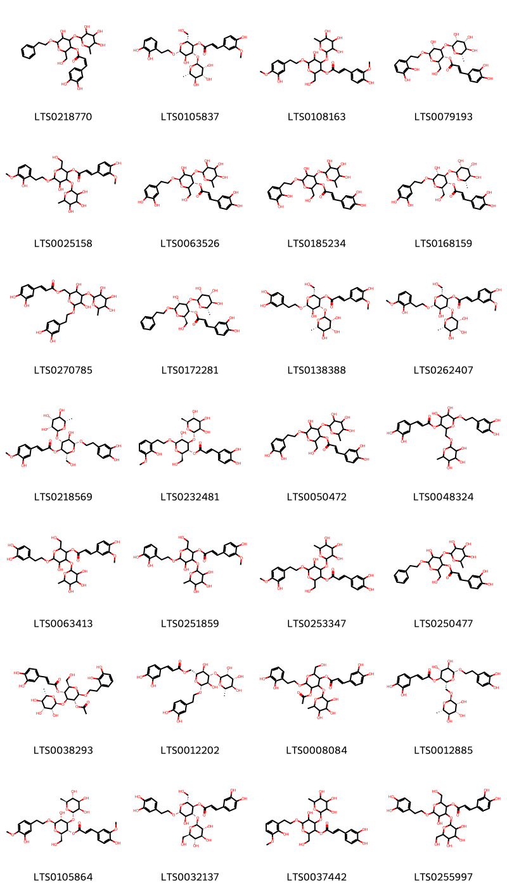{ group="compound" description="Cấu trúc hóa học của các hoạt chất thuộc nhóm *Cinnamic acids and derivatives* là 5-hydroxy-2-(hydroxymethyl)-6-(2-phenylethoxy)-4-[(3,4,5-trihydroxy-6-methyloxan-2-yl)oxy]oxan-3-yl (2z)-3-(3,4-dihydroxyphenyl)prop-2-enoate [(LTS0218770)](https://lotus.naturalproducts.net/compound/lotus_id/LTS0218770), (2r,3r,4r,5r,6r)-6-[2-(2,3-dihydroxyphenyl)ethoxy]-5-hydroxy-2-(hydroxymethyl)-4-{[(2s,3r,4r,5r,6s)-3,4,5-trihydroxy-6-methyloxan-2-yl]oxy}oxan-3-yl (2e)-3-(4-hydroxy-3-methoxyphenyl)prop-2-enoate [(LTS0105837)](https://lotus.naturalproducts.net/compound/lotus_id/LTS0105837), 5-hydroxy-6-[2-(3-hydroxy-4-methoxyphenyl)ethoxy]-2-(hydroxymethyl)-4-[(3,4,5-trihydroxy-6-methyloxan-2-yl)oxy]oxan-3-yl 3-(4-hydroxy-3-methoxyphenyl)prop-2-enoate [(LTS0108163)](https://lotus.naturalproducts.net/compound/lotus_id/LTS0108163), (2r,3r,4r,5r,6r)-6-[2-(2,3-dihydroxyphenyl)ethoxy]-5-hydroxy-2-(hydroxymethyl)-4-{[(2s,3r,4r,5r,6s)-3,4,5-trihydroxy-6-methyloxan-2-yl]oxy}oxan-3-yl (2e)-3-(3,4-dihydroxyphenyl)prop-2-enoate [(LTS0079193)](https://lotus.naturalproducts.net/compound/lotus_id/LTS0079193), 5-hydroxy-6-[2-(2-hydroxy-3-methoxyphenyl)ethoxy]-2-(hydroxymethyl)-4-[(3,4,5-trihydroxy-6-methyloxan-2-yl)oxy]oxan-3-yl 3-(4-hydroxy-3-methoxyphenyl)prop-2-enoate [(LTS0025158)](https://lotus.naturalproducts.net/compound/lotus_id/LTS0025158), (3r,4r,6r)-6-[2-(3,4-dihydroxyphenyl)ethoxy]-5-hydroxy-2-(hydroxymethyl)-4-{[(2s,3s,5r)-3,4,5-trihydroxy-6-methyloxan-2-yl]oxy}oxan-3-yl (2e)-3-(3,4-dihydroxyphenyl)prop-2-enoate [(LTS0063526)](https://lotus.naturalproducts.net/compound/lotus_id/LTS0063526), 6-[2-(2,3-dihydroxyphenyl)ethoxy]-5-hydroxy-2-(hydroxymethyl)-4-[(3,4,5-trihydroxy-6-methyloxan-2-yl)oxy]oxan-3-yl 3-(3,4-dihydroxyphenyl)prop-2-enoate [(LTS0185234)](https://lotus.naturalproducts.net/compound/lotus_id/LTS0185234), verbascoside [(LTS0168159)](https://lotus.naturalproducts.net/compound/lotus_id/LTS0168159), {6-[2-(3,4-dihydroxyphenyl)ethoxy]-3,5-dihydroxy-4-[(3,4,5-trihydroxy-6-methyloxan-2-yl)oxy]oxan-2-yl}methyl 3-(3,4-dihydroxyphenyl)prop-2-enoate [(LTS0270785)](https://lotus.naturalproducts.net/compound/lotus_id/LTS0270785), (2r,3r,4r,5r,6r)-5-hydroxy-2-(hydroxymethyl)-6-(2-phenylethoxy)-4-{[(2s,3r,4r,5r,6s)-3,4,5-trihydroxy-6-methyloxan-2-yl]oxy}oxan-3-yl (2e)-3-(3,4-dihydroxyphenyl)prop-2-enoate [(LTS0172281)](https://lotus.naturalproducts.net/compound/lotus_id/LTS0172281), (2r,3r,4r,5r,6r)-6-[2-(3,4-dihydroxyphenyl)ethoxy]-5-hydroxy-2-(hydroxymethyl)-4-{[(2s,3r,4r,5r,6s)-3,4,5-trihydroxy-6-methyloxan-2-yl]oxy}oxan-3-yl (2e)-3-(4-hydroxy-3-methoxyphenyl)prop-2-enoate [(LTS0138388)](https://lotus.naturalproducts.net/compound/lotus_id/LTS0138388), (2r,3r,4r,5r,6r)-5-hydroxy-6-[2-(2-hydroxy-3-methoxyphenyl)ethoxy]-2-(hydroxymethyl)-4-{[(2s,3r,4r,5r,6s)-3,4,5-trihydroxy-6-methyloxan-2-yl]oxy}oxan-3-yl (2e)-3-(4-hydroxy-3-methoxyphenyl)prop-2-enoate [(LTS0262407)](https://lotus.naturalproducts.net/compound/lotus_id/LTS0262407), (2r,3r,4r,5r,6r)-6-[2-(3,4-dihydroxyphenyl)ethoxy]-5-hydroxy-2-(hydroxymethyl)-4-{[(2s,3r,4r,5r,6s)-3,4,5-trihydroxy-6-methyloxan-2-yl]oxy}oxan-3-yl (2e)-3-(3-hydroxy-4-methoxyphenyl)prop-2-enoate [(LTS0218569)](https://lotus.naturalproducts.net/compound/lotus_id/LTS0218569), (2r,3r,4r,5r,6r)-5-hydroxy-6-[2-(2-hydroxy-3-methoxyphenyl)ethoxy]-2-(hydroxymethyl)-4-{[(2s,3r,4r,5r,6s)-3,4,5-trihydroxy-6-methyloxan-2-yl]oxy}oxan-3-yl (2e)-3-(3,4-dihydroxyphenyl)prop-2-enoate [(LTS0232481)](https://lotus.naturalproducts.net/compound/lotus_id/LTS0232481), 6-[2-(3,4-dihydroxyphenyl)ethoxy]-5-hydroxy-2-(hydroxymethyl)-4-[(3,4,5-trihydroxy-6-methyloxan-2-yl)oxy]oxan-3-yl 3-(3,4-dihydroxyphenyl)prop-2-enoate [(LTS0050472)](https://lotus.naturalproducts.net/compound/lotus_id/LTS0050472), 6-[2-(3,4-dihydroxyphenyl)ethoxy]-4,5-dihydroxy-2-{[(3,4,5-trihydroxy-6-methyloxan-2-yl)oxy]methyl}oxan-3-yl 3-(3,4-dihydroxyphenyl)prop-2-enoate [(LTS0048324)](https://lotus.naturalproducts.net/compound/lotus_id/LTS0048324), 6-[2-(3,4-dihydroxyphenyl)ethoxy]-5-hydroxy-2-(hydroxymethyl)-4-[(3,4,5-trihydroxy-6-methyloxan-2-yl)oxy]oxan-3-yl 3-(4-hydroxy-3-methoxyphenyl)prop-2-enoate [(LTS0063413)](https://lotus.naturalproducts.net/compound/lotus_id/LTS0063413), 6-[2-(2,3-dihydroxyphenyl)ethoxy]-5-hydroxy-2-(hydroxymethyl)-4-[(3,4,5-trihydroxy-6-methyloxan-2-yl)oxy]oxan-3-yl 3-(4-hydroxy-3-methoxyphenyl)prop-2-enoate [(LTS0251859)](https://lotus.naturalproducts.net/compound/lotus_id/LTS0251859), 5-hydroxy-6-[2-(3-hydroxy-4-methoxyphenyl)ethoxy]-2-(hydroxymethyl)-4-[(3,4,5-trihydroxy-6-methyloxan-2-yl)oxy]oxan-3-yl 3-(3,4-dihydroxyphenyl)prop-2-enoate [(LTS0253347)](https://lotus.naturalproducts.net/compound/lotus_id/LTS0253347), 5-hydroxy-2-(hydroxymethyl)-6-(2-phenylethoxy)-4-[(3,4,5-trihydroxy-6-methyloxan-2-yl)oxy]oxan-3-yl 3-(3,4-dihydroxyphenyl)prop-2-enoate [(LTS0250477)](https://lotus.naturalproducts.net/compound/lotus_id/LTS0250477), (2r,3r,4s,5r,6r)-5-(acetyloxy)-6-[2-(2,3-dihydroxyphenyl)ethoxy]-2-(hydroxymethyl)-4-{[(2s,3r,4r,5r,6s)-3,4,5-trihydroxy-6-methyloxan-2-yl]oxy}oxan-3-yl (2e)-3-(3,4-dihydroxyphenyl)prop-2-enoate [(LTS0038293)](https://lotus.naturalproducts.net/compound/lotus_id/LTS0038293), isoacteoside [(LTS0012202)](https://lotus.naturalproducts.net/compound/lotus_id/LTS0012202), 5-(acetyloxy)-6-[2-(2,3-dihydroxyphenyl)ethoxy]-2-(hydroxymethyl)-4-[(3,4,5-trihydroxy-6-methyloxan-2-yl)oxy]oxan-3-yl 3-(3,4-dihydroxyphenyl)prop-2-enoate [(LTS0008084)](https://lotus.naturalproducts.net/compound/lotus_id/LTS0008084), forsythiaside [(LTS0012885)](https://lotus.naturalproducts.net/compound/lotus_id/LTS0012885), (2r,3r,4r,5r,6r)-5-hydroxy-6-[2-(3-hydroxy-4-methoxyphenyl)ethoxy]-2-(hydroxymethyl)-4-{[(2s,3r,4r,5r,6s)-3,4,5-trihydroxy-6-methyloxan-2-yl]oxy}oxan-3-yl (2e)-3-(4-hydroxy-3-methoxyphenyl)prop-2-enoate [(LTS0105864)](https://lotus.naturalproducts.net/compound/lotus_id/LTS0105864), plantamajoside [(LTS0032137)](https://lotus.naturalproducts.net/compound/lotus_id/LTS0032137), 5-hydroxy-6-[2-(2-hydroxy-3-methoxyphenyl)ethoxy]-2-(hydroxymethyl)-4-[(3,4,5-trihydroxy-6-methyloxan-2-yl)oxy]oxan-3-yl 3-(3,4-dihydroxyphenyl)prop-2-enoate [(LTS0037442)](https://lotus.naturalproducts.net/compound/lotus_id/LTS0037442), 6-[2-(3,4-dihydroxyphenyl)ethoxy]-5-hydroxy-2-(hydroxymethyl)-4-{[3,4,5-trihydroxy-6-(hydroxymethyl)oxan-2-yl]oxy}oxan-3-yl 3-(3,4-dihydroxyphenyl)prop-2-enoate [(LTS0255997)](https://lotus.naturalproducts.net/compound/lotus_id/LTS0255997)." }

                                                              
{ group="compound" description="Cấu trúc hóa học của các hoạt chất thuộc nhóm *Diazines* là pirod [(LTS0008205)](https://lotus.naturalproducts.net/compound/lotus_id/LTS0008205)." }

                                                              
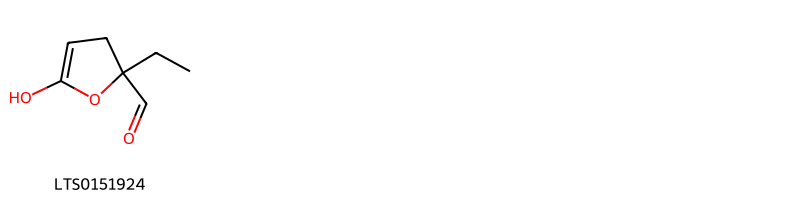{ group="compound" description="Cấu trúc hóa học của các hoạt chất thuộc nhóm *Dihydrofurans* là 2-ethyl-5-hydroxy-3h-furan-2-carbaldehyde [(LTS0151924)](https://lotus.naturalproducts.net/compound/lotus_id/LTS0151924)." }

                                                              
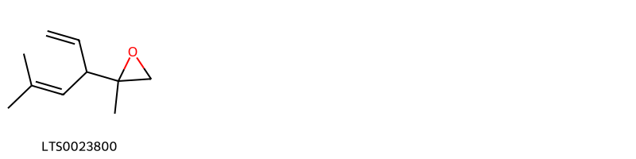{ group="compound" description="Cấu trúc hóa học của các hoạt chất thuộc nhóm *Epoxides* là 2-methyl-2-(5-methylhexa-1,4-dien-3-yl)oxirane [(LTS0023800)](https://lotus.naturalproducts.net/compound/lotus_id/LTS0023800)." }

                                                              
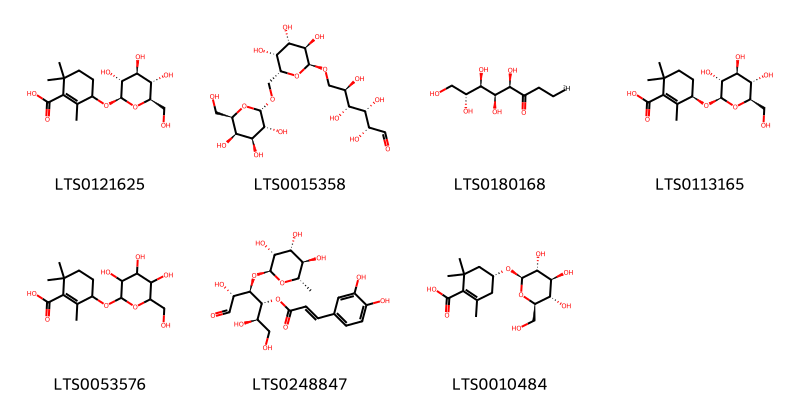{ group="compound" description="Cấu trúc hóa học của các hoạt chất thuộc nhóm *Fatty Acyls* là 2,6,6-trimethyl-3-{[(2r,3r,4s,5s,6r)-3,4,5-trihydroxy-6-(hydroxymethyl)oxan-2-yl]oxy}cyclohex-1-ene-1-carboxylic acid [(LTS0121625)](https://lotus.naturalproducts.net/compound/lotus_id/LTS0121625), manninotriose [(LTS0015358)](https://lotus.naturalproducts.net/compound/lotus_id/LTS0015358), (4r,5s,6r,7r)-4,5,6,7,8-pentahydroxy(1-²h₁)octan-3-one [(LTS0180168)](https://lotus.naturalproducts.net/compound/lotus_id/LTS0180168), (3r)-2,6,6-trimethyl-3-{[(2r,3r,4s,5s,6r)-3,4,5-trihydroxy-6-(hydroxymethyl)oxan-2-yl]oxy}cyclohex-1-ene-1-carboxylic acid [(LTS0113165)](https://lotus.naturalproducts.net/compound/lotus_id/LTS0113165), 2,6,6-trimethyl-3-{[3,4,5-trihydroxy-6-(hydroxymethyl)oxan-2-yl]oxy}cyclohex-1-ene-1-carboxylic acid [(LTS0053576)](https://lotus.naturalproducts.net/compound/lotus_id/LTS0053576), (2r,3r,4r,5r)-1,2,5-trihydroxy-6-oxo-4-{[(2s,3r,4r,5r,6s)-3,4,5-trihydroxy-6-methyloxan-2-yl]oxy}hexan-3-yl (2e)-3-(3,4-dihydroxyphenyl)prop-2-enoate [(LTS0248847)](https://lotus.naturalproducts.net/compound/lotus_id/LTS0248847), (4r)-2,6,6-trimethyl-4-{[(2r,3r,4s,5s,6r)-3,4,5-trihydroxy-6-(hydroxymethyl)oxan-2-yl]oxy}cyclohex-1-ene-1-carboxylic acid [(LTS0010484)](https://lotus.naturalproducts.net/compound/lotus_id/LTS0010484)." }

                                                              
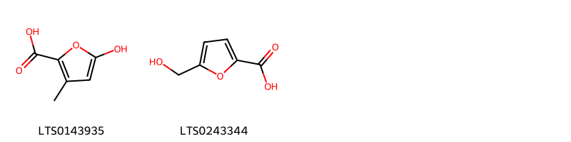{ group="compound" description="Cấu trúc hóa học của các hoạt chất thuộc nhóm *Furans* là 5-hydroxy-3-methylfuran-2-carboxylic acid [(LTS0143935)](https://lotus.naturalproducts.net/compound/lotus_id/LTS0143935), 5-hydroxymethyl-2-furoic acid [(LTS0243344)](https://lotus.naturalproducts.net/compound/lotus_id/LTS0243344)." }

                                                              
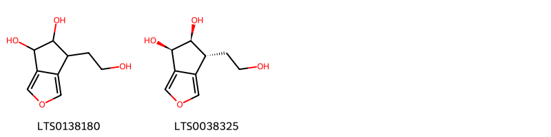{ group="compound" description="Cấu trúc hóa học của các hoạt chất thuộc nhóm *Heteroaromatic compounds* là 6-(2-hydroxyethyl)-4h,5h,6h-cyclopenta[c]furan-4,5-diol [(LTS0138180)](https://lotus.naturalproducts.net/compound/lotus_id/LTS0138180), (4r,5s,6r)-6-(2-hydroxyethyl)-4h,5h,6h-cyclopenta[c]furan-4,5-diol [(LTS0038325)](https://lotus.naturalproducts.net/compound/lotus_id/LTS0038325)." }

                                                              
{ group="compound" description="Cấu trúc hóa học của các hoạt chất thuộc nhóm *Hydroxy acids and derivatives* là (-)-malic acid [(LTS0128885)](https://lotus.naturalproducts.net/compound/lotus_id/LTS0128885)." }

                                                              
{ group="compound" description="Cấu trúc hóa học của các hoạt chất thuộc nhóm *Indoles and derivatives* là n-[2-(5-methoxy-1h-indol-3-yl)ethyl]ethanimidic acid [(LTS0219322)](https://lotus.naturalproducts.net/compound/lotus_id/LTS0219322)." }

                                                              
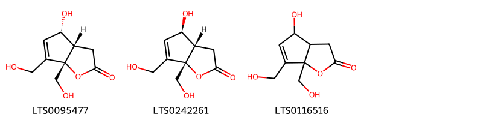{ group="compound" description="Cấu trúc hóa học của các hoạt chất thuộc nhóm *Lactones* là (3as,4s,6as)-4-hydroxy-6,6a-bis(hydroxymethyl)-3h,3ah,4h-cyclopenta[b]furan-2-one [(LTS0095477)](https://lotus.naturalproducts.net/compound/lotus_id/LTS0095477), (3as,4r,6as)-4-hydroxy-6,6a-bis(hydroxymethyl)-3h,3ah,4h-cyclopenta[b]furan-2-one [(LTS0242261)](https://lotus.naturalproducts.net/compound/lotus_id/LTS0242261), 4-hydroxy-6,6a-bis(hydroxymethyl)-3h,3ah,4h-cyclopenta[b]furan-2-one [(LTS0116516)](https://lotus.naturalproducts.net/compound/lotus_id/LTS0116516)." }

                                                              
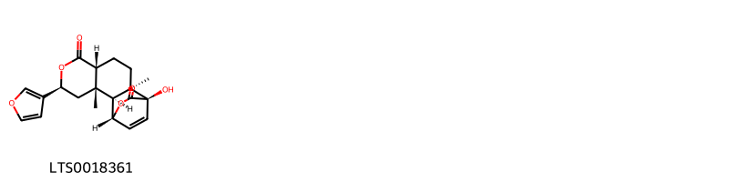{ group="compound" description="Cấu trúc hóa học của các hoạt chất thuộc nhóm *Naphthopyrans* là columbin [(LTS0018361)](https://lotus.naturalproducts.net/compound/lotus_id/LTS0018361)." }

                                                              
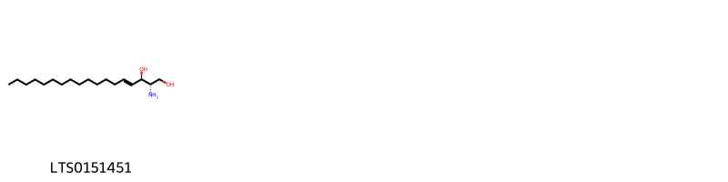{ group="compound" description="Cấu trúc hóa học của các hoạt chất thuộc nhóm *Organonitrogen compounds* là sphingosine [(LTS0151451)](https://lotus.naturalproducts.net/compound/lotus_id/LTS0151451)." }

                                                              
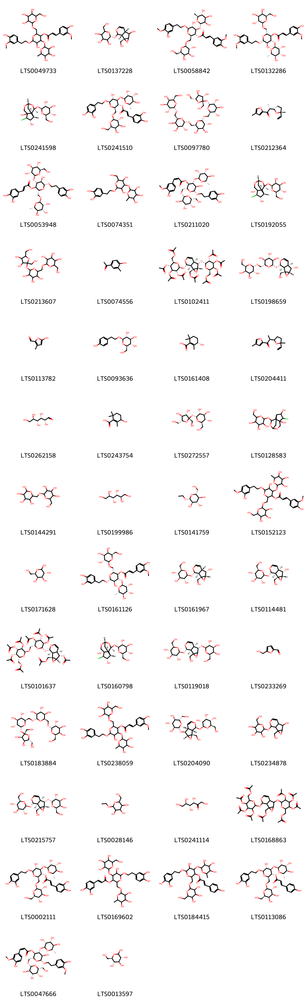{ group="compound" description="Cấu trúc hóa học của các hoạt chất thuộc nhóm *Organooxygen compounds* là 5-hydroxy-6-[2-(4-hydroxy-3-methoxyphenyl)ethoxy]-2-({[3,4,5-trihydroxy-6-(hydroxymethyl)oxan-2-yl]oxy}methyl)-4-[(3,4,5-trihydroxy-6-methyloxan-2-yl)oxy]oxan-3-yl 3-(4-hydroxy-3-methoxyphenyl)prop-2-enoate [(LTS0049733)](https://lotus.naturalproducts.net/compound/lotus_id/LTS0049733), (2r)-2-{[(1r,2s,6s)-5-hydroxy-2-(hydroxymethyl)-3,9-dioxatricyclo[4.4.0.0²,⁴]dec-7-en-10-yl]oxy}-6-(hydroxymethyl)oxane-3,4,5-triol [(LTS0137228)](https://lotus.naturalproducts.net/compound/lotus_id/LTS0137228), jionoside b1 [(LTS0058842)](https://lotus.naturalproducts.net/compound/lotus_id/LTS0058842), (2r,3r,4r,5r,6r)-5-hydroxy-6-[2-(4-hydroxy-3-methoxyphenyl)ethoxy]-2-({[(2r,3r,4s,5r,6r)-3,4,5-trihydroxy-6-(hydroxymethyl)oxan-2-yl]oxy}methyl)-4-{[(2s,3r,4r,5r,6s)-3,4,5-trihydroxy-6-methyloxan-2-yl]oxy}oxan-3-yl (2e)-3-(4-hydroxy-3-methoxyphenyl)prop-2-enoate [(LTS0132286)](https://lotus.naturalproducts.net/compound/lotus_id/LTS0132286), (2s,3r,4s,5s,6r)-2-{[(1r,5r,6s,7r,8s,9s)-5-chloro-4,6-dihydroxy-2,10-dioxatricyclo[5.3.1.0⁴,⁸]undecan-9-yl]oxy}-6-(hydroxymethyl)oxane-3,4,5-triol [(LTS0241598)](https://lotus.naturalproducts.net/compound/lotus_id/LTS0241598), purpureaside c [(LTS0241510)](https://lotus.naturalproducts.net/compound/lotus_id/LTS0241510), verbascose [(LTS0097780)](https://lotus.naturalproducts.net/compound/lotus_id/LTS0097780), (2r)-2-[(2s,5r)-5-ethenyl-5-methyloxolan-2-yl]-1-(4-methylfuran-2-yl)propan-1-one [(LTS0212364)](https://lotus.naturalproducts.net/compound/lotus_id/LTS0212364), (2r,3r,4r,5r,6r)-6-[2-(3,4-dihydroxyphenyl)ethoxy]-5-hydroxy-4-{[(2s,3r,4s,5s,6r)-3,4,5-trihydroxy-6-(hydroxymethyl)oxan-2-yl]oxy}-2-({[(2r,3r,4r,5r,6s)-3,4,5-trihydroxy-6-methyloxan-2-yl]oxy}methyl)oxan-3-yl (2e)-3-(3,4-dihydroxyphenyl)prop-2-enoate [(LTS0053948)](https://lotus.naturalproducts.net/compound/lotus_id/LTS0053948), 2-({2-[2-(3,4-dihydroxyphenyl)ethoxy]-3,5-dihydroxy-6-(hydroxymethyl)oxan-4-yl}oxy)-6-methyloxane-3,4,5-triol [(LTS0074351)](https://lotus.naturalproducts.net/compound/lotus_id/LTS0074351), (2r,3r,4r,5r,6r)-6-[2-(3,4-dihydroxyphenyl)ethoxy]-5-hydroxy-2-({[(2r,3r,4s,5r,6r)-3,4,5-trihydroxy-6-(hydroxymethyl)oxan-2-yl]oxy}methyl)-4-{[(2s,3r,4r,5r,6s)-3,4,5-trihydroxy-6-methyloxan-2-yl]oxy}oxan-3-yl (2z)-3-(4-hydroxy-3-methoxyphenyl)prop-2-enoate [(LTS0211020)](https://lotus.naturalproducts.net/compound/lotus_id/LTS0211020), (2s,3s,4s,5s,6r)-2-{[(1r,4s,5r,6s,7r,8s,9s)-5-chloro-4,6-dihydroxy-2,10-dioxatricyclo[5.3.1.0⁴,⁸]undecan-9-yl]oxy}-6-(hydroxymethyl)oxane-3,4,5-triol [(LTS0192055)](https://lotus.naturalproducts.net/compound/lotus_id/LTS0192055), 2-[(6-{[3,4-dihydroxy-2,5-bis(hydroxymethyl)oxolan-2-yl]oxy}-3,4,5-trihydroxyoxan-2-yl)methoxy]-6-(hydroxymethyl)oxane-3,4,5-triol [(LTS0213607)](https://lotus.naturalproducts.net/compound/lotus_id/LTS0213607), 1-(4-hydroxy-3-methylphenyl)ethanone [(LTS0074556)](https://lotus.naturalproducts.net/compound/lotus_id/LTS0074556), [(1s,2s,4s,5s,6r,10s)-10-{[(2s,3r,4s,5r,6r)-3,4,5-tris(acetyloxy)-6-[(acetyloxy)methyl]oxan-2-yl]oxy}-5-{[(2s,3r,4s,5s,6r)-3,4,5-tris(acetyloxy)-6-[(acetyloxy)methyl]oxan-2-yl]oxy}-3,9-dioxatricyclo[4.4.0.0²,⁴]dec-7-en-2-yl]methyl acetate [(LTS0102411)](https://lotus.naturalproducts.net/compound/lotus_id/LTS0102411), (2r,3r,4s,5r,6s)-2-(hydroxymethyl)-6-{[(2r,3s,4s,5r,6s)-3,4,5-trihydroxy-6-{[(1s,2s,4s,5s,6r,10s)-5-hydroxy-2-(hydroxymethyl)-3,9-dioxatricyclo[4.4.0.0²,⁴]dec-7-en-10-yl]oxy}oxan-2-yl]methoxy}oxane-3,4,5-triol [(LTS0198659)](https://lotus.naturalproducts.net/compound/lotus_id/LTS0198659), 5-hydroxy-3-methylfuran-2-carbaldehyde [(LTS0113782)](https://lotus.naturalproducts.net/compound/lotus_id/LTS0113782), salidroside [(LTS0093636)](https://lotus.naturalproducts.net/compound/lotus_id/LTS0093636), (3s)-3-hydroxy-2,6,6-trimethylcyclohex-1-ene-1-carboxylic acid [(LTS0161408)](https://lotus.naturalproducts.net/compound/lotus_id/LTS0161408), 2-(5-ethenyl-5-methyloxolan-2-yl)-1-(4-methylfuran-2-yl)propan-1-one [(LTS0204411)](https://lotus.naturalproducts.net/compound/lotus_id/LTS0204411), (+)-glucose [(LTS0262158)](https://lotus.naturalproducts.net/compound/lotus_id/LTS0262158), 3-hydroxy-2,6,6-trimethylcyclohex-1-ene-1-carboxylic acid [(LTS0243754)](https://lotus.naturalproducts.net/compound/lotus_id/LTS0243754), sucrose [(LTS0272557)](https://lotus.naturalproducts.net/compound/lotus_id/LTS0272557), 2-({5-chloro-4,6-dihydroxy-2,10-dioxatricyclo[5.3.1.0⁴,⁸]undecan-9-yl}oxy)-6-(hydroxymethyl)oxane-3,4,5-triol [(LTS0128583)](https://lotus.naturalproducts.net/compound/lotus_id/LTS0128583), polydextrose [(LTS0144291)](https://lotus.naturalproducts.net/compound/lotus_id/LTS0144291), mannitol [(LTS0199986)](https://lotus.naturalproducts.net/compound/lotus_id/LTS0199986), ethyl glucoside [(LTS0141759)](https://lotus.naturalproducts.net/compound/lotus_id/LTS0141759), 5-hydroxy-6-[2-(3-hydroxy-4-methoxyphenyl)ethoxy]-2-({[3,4,5-trihydroxy-6-(hydroxymethyl)oxan-2-yl]oxy}methyl)-4-[(3,4,5-trihydroxy-6-methyloxan-2-yl)oxy]oxan-3-yl 3-(4-hydroxy-3-methoxyphenyl)prop-2-enoate [(LTS0152123)](https://lotus.naturalproducts.net/compound/lotus_id/LTS0152123), galactose [(LTS0171628)](https://lotus.naturalproducts.net/compound/lotus_id/LTS0171628), (2r,3r,4r,5r,6r)-6-[2-(3,4-dihydroxyphenyl)ethoxy]-5-hydroxy-2-({[(2r,3r,4s,5r,6r)-3,4,5-trihydroxy-6-(hydroxymethyl)oxan-2-yl]oxy}methyl)-4-{[(2s,3r,4r,5r,6s)-3,4,5-trihydroxy-6-methyloxan-2-yl]oxy}oxan-3-yl (2e)-3-(4-hydroxy-3-methoxyphenyl)prop-2-enoate [(LTS0161126)](https://lotus.naturalproducts.net/compound/lotus_id/LTS0161126), (2s,3r,4s,5s,6r)-2-{[(1s,2s,4s,5s,6s,10s)-5-hydroxy-2-(hydroxymethyl)-3,9-dioxatricyclo[4.4.0.0²,⁴]dec-7-en-10-yl]oxy}-6-(hydroxymethyl)oxane-3,4,5-triol [(LTS0161967)](https://lotus.naturalproducts.net/compound/lotus_id/LTS0161967), catalpol [(LTS0114481)](https://lotus.naturalproducts.net/compound/lotus_id/LTS0114481), [(1s,2s,4s,5s,6r,10s)-5-(acetyloxy)-10-{[(2s,3r,4s,5r,6r)-3,4,5-tris(acetyloxy)-6-({[(2s,3r,4s,5s,6r)-3,4,5-tris(acetyloxy)-6-[(acetyloxy)methyl]oxan-2-yl]oxy}methyl)oxan-2-yl]oxy}-3,9-dioxatricyclo[4.4.0.0²,⁴]dec-7-en-2-yl]methyl acetate [(LTS0101637)](https://lotus.naturalproducts.net/compound/lotus_id/LTS0101637), (2s,3r,4s,5s,6r)-2-{[(1r,4s,5r,6s,7r,8s,9s)-5-chloro-4,6-dihydroxy-2,10-dioxatricyclo[5.3.1.0⁴,⁸]undecan-9-yl]oxy}-6-(hydroxymethyl)oxane-3,4,5-triol [(LTS0160798)](https://lotus.naturalproducts.net/compound/lotus_id/LTS0160798), (2r,3s,4s,5r,6s)-2-(hydroxymethyl)-6-{[(1s,5s,6r,10s)-2-(hydroxymethyl)-5-{[(2r,3r,4s,5r,6r)-3,4,5-trihydroxy-6-(hydroxymethyl)oxan-2-yl]oxy}-3,9-dioxatricyclo[4.4.0.0²,⁴]dec-7-en-10-yl]oxy}oxane-3,4,5-triol [(LTS0119018)](https://lotus.naturalproducts.net/compound/lotus_id/LTS0119018), hydroxymethylfurfural [(LTS0233269)](https://lotus.naturalproducts.net/compound/lotus_id/LTS0233269), (2r,3r,4s,5s,6r)-2-{[(2s,3r,4s,5r)-3,4-dihydroxy-2,5-bis(hydroxymethyl)oxolan-2-yl]oxy}-6-({[(2s,3s,4r,5r,6r)-3,4,5-trihydroxy-6-({[(2s,3r,4s,5r,6r)-3,4,5-trihydroxy-6-(hydroxymethyl)oxan-2-yl]oxy}methyl)oxan-2-yl]oxy}methyl)oxane-3,4,5-triol [(LTS0183884)](https://lotus.naturalproducts.net/compound/lotus_id/LTS0183884), 6-[2-(3,4-dihydroxyphenyl)ethoxy]-5-hydroxy-2-({[3,4,5-trihydroxy-6-(hydroxymethyl)oxan-2-yl]oxy}methyl)-4-[(3,4,5-trihydroxy-6-methyloxan-2-yl)oxy]oxan-3-yl 3-(4-hydroxy-3-methoxyphenyl)prop-2-enoate [(LTS0238059)](https://lotus.naturalproducts.net/compound/lotus_id/LTS0238059), (2s,3r,4r,5s,6s)-2-(hydroxymethyl)-6-{[(1s,2r,4r,5s,6r,10s)-2-(hydroxymethyl)-10-{[(2s,3r,4r,5s,6r)-3,4,5-trihydroxy-6-(hydroxymethyl)oxan-2-yl]oxy}-3,9-dioxatricyclo[4.4.0.0²,⁴]dec-7-en-5-yl]oxy}oxane-3,4,5-triol [(LTS0204090)](https://lotus.naturalproducts.net/compound/lotus_id/LTS0204090), catalpol [(LTS0234878)](https://lotus.naturalproducts.net/compound/lotus_id/LTS0234878), (2r,3s,4s,5r,6s)-2-(hydroxymethyl)-6-{[(1s,2s,4s,5s,6r,10s)-2-(hydroxymethyl)-5-{[(2s,3r,4s,5r,6r)-3,4,5-trihydroxy-6-(hydroxymethyl)oxan-2-yl]oxy}-3,9-dioxatricyclo[4.4.0.0²,⁴]dec-7-en-10-yl]oxy}oxane-3,4,5-triol [(LTS0215757)](https://lotus.naturalproducts.net/compound/lotus_id/LTS0215757), �-d-galactopyranoside, ethyl [(LTS0028146)](https://lotus.naturalproducts.net/compound/lotus_id/LTS0028146), keto-d-fructose [(LTS0241114)](https://lotus.naturalproducts.net/compound/lotus_id/LTS0241114), [5,10-bis({[3,4,5-tris(acetyloxy)-6-[(acetyloxy)methyl]oxan-2-yl]oxy})-3,9-dioxatricyclo[4.4.0.0²,⁴]dec-7-en-2-yl]methyl acetate [(LTS0168863)](https://lotus.naturalproducts.net/compound/lotus_id/LTS0168863), echinacoside [(LTS0002111)](https://lotus.naturalproducts.net/compound/lotus_id/LTS0002111), 6-[2-(3,4-dihydroxyphenyl)ethoxy]-5-hydroxy-4-{[3,4,5-trihydroxy-6-(hydroxymethyl)oxan-2-yl]oxy}-2-{[(3,4,5-trihydroxy-6-methyloxan-2-yl)oxy]methyl}oxan-3-yl 3-(3,4-dihydroxyphenyl)prop-2-enoate [(LTS0169602)](https://lotus.naturalproducts.net/compound/lotus_id/LTS0169602), 6-[2-(3,4-dihydroxyphenyl)ethoxy]-5-hydroxy-2-({[3,4,5-trihydroxy-6-(hydroxymethyl)oxan-2-yl]oxy}methyl)-4-[(3,4,5-trihydroxy-6-methyloxan-2-yl)oxy]oxan-3-yl 3-(4-hydroxyphenyl)prop-2-enoate [(LTS0184415)](https://lotus.naturalproducts.net/compound/lotus_id/LTS0184415), (2r,3r,4r,5r,6r)-6-[2-(3,4-dihydroxyphenyl)ethoxy]-5-hydroxy-2-({[(2r,3r,4s,5r,6r)-3,4,5-trihydroxy-6-(hydroxymethyl)oxan-2-yl]oxy}methyl)-4-{[(2s,3r,4r,5r,6s)-3,4,5-trihydroxy-6-methyloxan-2-yl]oxy}oxan-3-yl (2e)-3-(4-hydroxyphenyl)prop-2-enoate [(LTS0113086)](https://lotus.naturalproducts.net/compound/lotus_id/LTS0113086), (2r,3r,4r,5r,6r)-5-hydroxy-6-[2-(4-hydroxy-3-methoxyphenyl)ethoxy]-2-({[(2r,3r,4s,5r,6r)-3,4,5-trihydroxy-6-(hydroxymethyl)oxan-2-yl]oxy}methyl)-4-{[(2s,3r,4r,5r,6s)-3,4,5-trihydroxy-6-methyloxan-2-yl]oxy}oxan-3-yl (2z)-3-(4-hydroxy-3-methoxyphenyl)prop-2-enoate [(LTS0047666)](https://lotus.naturalproducts.net/compound/lotus_id/LTS0047666), glucose [(LTS0013597)](https://lotus.naturalproducts.net/compound/lotus_id/LTS0013597), aldehydo-d-galactose [(LTS0128031)](https://lotus.naturalproducts.net/compound/lotus_id/LTS0128031), (2r,3r,4s,5s)-6-({[(2s,3r,4s,5r,6r)-3,4,5-trihydroxy-6-(hydroxymethyl)oxan-2-yl]oxy}methyl)oxane-2,3,4,5-tetrol [(LTS0135576)](https://lotus.naturalproducts.net/compound/lotus_id/LTS0135576), (2s,3r,4s,5s,6r)-2-{[(1s,2s,4s,5s,6r,10s)-5-hydroxy-2-(hydroxymethyl)-3,9-dioxatricyclo[4.4.0.0²,⁴]decan-10-yl]oxy}-6-(hydroxymethyl)oxane-3,4,5-triol [(LTS0001855)](https://lotus.naturalproducts.net/compound/lotus_id/LTS0001855), stachyose [(LTS0062089)](https://lotus.naturalproducts.net/compound/lotus_id/LTS0062089), [5-(acetyloxy)-10-{[3,4,5-tris(acetyloxy)-6-({[3,4,5-tris(acetyloxy)-6-[(acetyloxy)methyl]oxan-2-yl]oxy}methyl)oxan-2-yl]oxy}-3,9-dioxatricyclo[4.4.0.0²,⁴]dec-7-en-2-yl]methyl acetate [(LTS0029604)](https://lotus.naturalproducts.net/compound/lotus_id/LTS0029604), methyl (4ar,7as)-7-methylidene-1-[(3,4,5-trihydroxy-6-{[(3,4,5-trihydroxy-6-methyloxan-2-yl)oxy]methyl}oxan-2-yl)oxy]-1h,4ah,5h,6h,7ah-cyclopenta[c]pyran-4-carboxylate [(LTS0032959)](https://lotus.naturalproducts.net/compound/lotus_id/LTS0032959), (2r,3r,4s,5r,6r)-2-(hydroxymethyl)-6-{[(2r,3s,4s,5r,6s)-3,4,5-trihydroxy-6-{[(1s,2s,4s,5s,6r,10s)-5-hydroxy-2-(hydroxymethyl)-3,9-dioxatricyclo[4.4.0.0²,⁴]dec-7-en-10-yl]oxy}oxan-2-yl]methoxy}oxane-3,4,5-triol [(LTS0078329)](https://lotus.naturalproducts.net/compound/lotus_id/LTS0078329), (2s,3r,4r,5r,6s)-2-{[(1s,5s,6r,10s)-5-hydroxy-2-(hydroxymethyl)-3,9-dioxatricyclo[4.4.0.0²,⁴]dec-7-en-10-yl]oxy}-6-methyloxane-3,4,5-triol [(LTS0030670)](https://lotus.naturalproducts.net/compound/lotus_id/LTS0030670), raffinose [(LTS0113066)](https://lotus.naturalproducts.net/compound/lotus_id/LTS0113066), 6-[2-(3,4-dihydroxyphenyl)ethoxy]-5-hydroxy-2-({[3,4,5-trihydroxy-6-(hydroxymethyl)oxan-2-yl]oxy}methyl)-4-[(3,4,5-trihydroxy-6-methyloxan-2-yl)oxy]oxan-3-yl 3-(3,4-dihydroxyphenyl)prop-2-enoate [(LTS0250978)](https://lotus.naturalproducts.net/compound/lotus_id/LTS0250978), d-fructopyranose [(LTS0259277)](https://lotus.naturalproducts.net/compound/lotus_id/LTS0259277)." }

                                                              
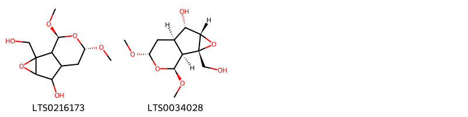{ group="compound" description="Cấu trúc hóa học của các hoạt chất thuộc nhóm *Oxanes* là (8s,10s)-2-(hydroxymethyl)-8,10-dimethoxy-3,9-dioxatricyclo[4.4.0.0²,⁴]decan-5-ol [(LTS0216173)](https://lotus.naturalproducts.net/compound/lotus_id/LTS0216173), (1s,2s,4s,5s,6r,8s,10s)-2-(hydroxymethyl)-8,10-dimethoxy-3,9-dioxatricyclo[4.4.0.0²,⁴]decan-5-ol [(LTS0034028)](https://lotus.naturalproducts.net/compound/lotus_id/LTS0034028)." }

                                                              
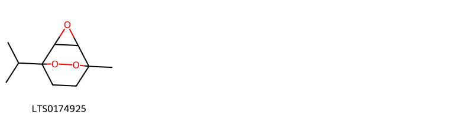{ group="compound" description="Cấu trúc hóa học của các hoạt chất thuộc nhóm *Oxepanes* là 1-isopropyl-5-methyl-3,6,7-trioxatricyclo[3.2.2.0²,⁴]nonane [(LTS0174925)](https://lotus.naturalproducts.net/compound/lotus_id/LTS0174925)." }

                                                              
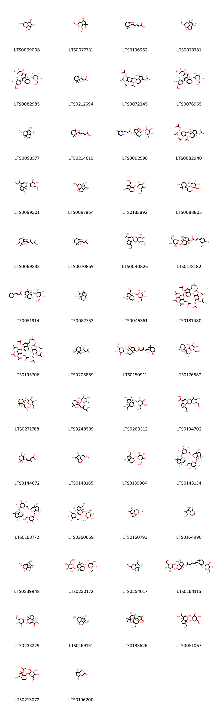{ group="compound" description="Cấu trúc hóa học của các hoạt chất thuộc nhóm *Prenol lipids* là 5-chloro-2,10-dioxatricyclo[5.3.1.0⁴,¹¹]undecane-4,6,9-triol [(LTS0069008)](https://lotus.naturalproducts.net/compound/lotus_id/LTS0069008), (1s,3r,7s)-1,3-dimethoxy-7-methyl-hexahydro-1h-cyclopenta[c]pyran-5,7-diol [(LTS0077731)](https://lotus.naturalproducts.net/compound/lotus_id/LTS0077731), (2e,4e)-5-[(1r,2r)-1,2-dihydroxy-2,6,6-trimethylcyclohexyl]-3-methylpenta-2,4-dienoic acid [(LTS0106962)](https://lotus.naturalproducts.net/compound/lotus_id/LTS0106962), (1s,4s,5r,6s,7r,9s,11s)-9-methoxy-2,10-dioxatricyclo[5.3.1.0⁴,¹¹]undecane-4,5,6-triol [(LTS0073781)](https://lotus.naturalproducts.net/compound/lotus_id/LTS0073781), (2s,3r,4s,5r,6r)-2-{[(2s,3r,4r,5r,6r)-2-{[(1s,4as,5r,7as)-5-hydroxy-7-(hydroxymethyl)-1-{[(2r,3r,4r,5s,6r)-3,4,5-trihydroxy-6-(hydroxymethyl)oxan-2-yl]oxy}-1h,5h,7ah-cyclopenta[c]pyran-4a-yl]oxy}-4,5-dihydroxy-6-(hydroxymethyl)oxan-3-yl]oxy}-6-(hydroxymethyl)oxane-3,4,5-triol [(LTS0082985)](https://lotus.naturalproducts.net/compound/lotus_id/LTS0082985), 4-(1,2-dihydroxy-2,6,6-trimethylcyclohexyl)but-3-en-2-one [(LTS0212694)](https://lotus.naturalproducts.net/compound/lotus_id/LTS0212694), [3,4,5-tris(acetyloxy)-6-{[5-(acetyloxy)-7-hydroxy-7-methyl-1h,4ah,5h,6h,7ah-cyclopenta[c]pyran-1-yl]oxy}oxan-2-yl]methyl acetate [(LTS0072245)](https://lotus.naturalproducts.net/compound/lotus_id/LTS0072245), (2s,3r,4s,5s,6r)-2-{[(2r,3r,4s,5s,6r)-2-{[(1s,4as,5r,7ar)-5-hydroxy-7-(hydroxymethyl)-1-{[(2s,3r,4s,5s,6r)-3,4,5-trihydroxy-6-(hydroxymethyl)oxan-2-yl]oxy}-1h,5h,7ah-cyclopenta[c]pyran-4a-yl]oxy}-4,5-dihydroxy-6-(hydroxymethyl)oxan-3-yl]oxy}-6-(hydroxymethyl)oxane-3,4,5-triol [(LTS0076965)](https://lotus.naturalproducts.net/compound/lotus_id/LTS0076965), (1s,4s,5r,6s,7r,9s,11s)-5-chloro-9-methoxy-2,10-dioxatricyclo[5.3.1.0⁴,¹¹]undecane-4,6-diol [(LTS0093577)](https://lotus.naturalproducts.net/compound/lotus_id/LTS0093577), (2e,4e)-5-(1,2-dihydroxy-2,6,6-trimethylcyclohexyl)-3-methylpenta-2,4-dienoic acid [(LTS0214610)](https://lotus.naturalproducts.net/compound/lotus_id/LTS0214610), (1s,4ar,5r,7s,7as)-7-hydroxy-7-methyl-1-{[(2s,3r,4s,5s,6r)-3,4,5-trihydroxy-6-(hydroxymethyl)oxan-2-yl]oxy}-1h,4ah,5h,6h,7ah-cyclopenta[c]pyran-5-yl 3-(4-oxo-1h-pyridin-2-yl)propanoate [(LTS0092598)](https://lotus.naturalproducts.net/compound/lotus_id/LTS0092598), [(2r,3r,4s,5r,6s)-6-{[(1s,4ar,5s,7s,7as)-5-(acetyloxy)-7-hydroxy-7-methyl-1h,4ah,5h,6h,7ah-cyclopenta[c]pyran-1-yl]oxy}-3,4,5-tris(acetyloxy)oxan-2-yl]methyl acetate [(LTS0082940)](https://lotus.naturalproducts.net/compound/lotus_id/LTS0082940), geniposide [(LTS0099201)](https://lotus.naturalproducts.net/compound/lotus_id/LTS0099201), (1s,4s,5r,6s,7r,11s)-5-chloro-2,10-dioxatricyclo[5.3.1.0⁴,¹¹]undecane-4,6,9-triol [(LTS0097864)](https://lotus.naturalproducts.net/compound/lotus_id/LTS0097864), aucubin [(LTS0183892)](https://lotus.naturalproducts.net/compound/lotus_id/LTS0183892), (3e)-4-[(1r,3r,6r)-1,3-dihydroxy-2,2,6-trimethyl-6-{[(2s,3r,4s,5s,6r)-3,4,5-trihydroxy-6-(hydroxymethyl)oxan-2-yl]oxy}cyclohexyl]but-3-en-2-one [(LTS0088805)](https://lotus.naturalproducts.net/compound/lotus_id/LTS0088805), (2e,4e)-3-methyl-5-[(1r,3s,6r)-1,3,6-trihydroxy-2,2,6-trimethylcyclohexyl]penta-2,4-dienoic acid [(LTS0069383)](https://lotus.naturalproducts.net/compound/lotus_id/LTS0069383), (3e)-4-[(1r,2r)-1,2-dihydroxy-2,6,6-trimethylcyclohexyl]but-3-en-2-one [(LTS0070859)](https://lotus.naturalproducts.net/compound/lotus_id/LTS0070859), 7-(hydroxymethyl)-1-{[3,4,5-trihydroxy-6-(hydroxymethyl)oxan-2-yl]oxy}-1h,4ah,5h,7ah-cyclopenta[c]pyran-4-carboxylic acid [(LTS0040826)](https://lotus.naturalproducts.net/compound/lotus_id/LTS0040826), (1s,4as,5r,7s,7as)-7-hydroxy-7-methyl-1-{[(2s,3r,4s,5s,6r)-3,4,5-trihydroxy-6-(hydroxymethyl)oxan-2-yl]oxy}-1h,4ah,5h,6h,7ah-cyclopenta[c]pyran-5-yl (2e)-3-(4-hydroxy-3-methoxyphenyl)prop-2-enoate [(LTS0178182)](https://lotus.naturalproducts.net/compound/lotus_id/LTS0178182), (1s,4ar,5r,7s,7as)-7-hydroxy-7-methyl-1-{[(2s,3r,4s,5s,6r)-3,4,5-trihydroxy-6-(hydroxymethyl)oxan-2-yl]oxy}-1h,4ah,5h,6h,7ah-cyclopenta[c]pyran-5-yl (2e)-3-phenylprop-2-enoate [(LTS0051914)](https://lotus.naturalproducts.net/compound/lotus_id/LTS0051914), (1r,4s,5r,6s,7r,11s)-5-chloro-2,10-dioxatricyclo[5.3.1.0⁴,¹¹]undecane-4,6-diol [(LTS0087753)](https://lotus.naturalproducts.net/compound/lotus_id/LTS0087753), (2s,3r,4s,5s,6r)-2-{[(1s,4as,5r,7ar)-4a,5-dihydroxy-7-(hydroxymethyl)-1h,5h,7ah-cyclopenta[c]pyran-1-yl]oxy}-6-(hydroxymethyl)oxane-3,4,5-triol [(LTS0045361)](https://lotus.naturalproducts.net/compound/lotus_id/LTS0045361), [5-(acetyloxy)-1,4a-bis({[3,4,5-tris(acetyloxy)-6-[(acetyloxy)methyl]oxan-2-yl]oxy})-1h,5h,7ah-cyclopenta[c]pyran-7-yl]methyl acetate [(LTS0181480)](https://lotus.naturalproducts.net/compound/lotus_id/LTS0181480), [(1s,4as,5r,7ar)-5-(acetyloxy)-1,4a-bis({[(2s,3r,4s,5r,6r)-3,4,5-tris(acetyloxy)-6-[(acetyloxy)methyl]oxan-2-yl]oxy})-1h,5h,7ah-cyclopenta[c]pyran-7-yl]methyl acetate [(LTS0195706)](https://lotus.naturalproducts.net/compound/lotus_id/LTS0195706), (3e)-4-[(1r,3s,6r)-1,3,6-trihydroxy-2,2,6-trimethylcyclohexyl]but-3-en-2-one [(LTS0205859)](https://lotus.naturalproducts.net/compound/lotus_id/LTS0205859), (1s,4ar,5r,7s,7as)-7-hydroxy-7-methyl-1-{[(2s,3r,4s,5s,6r)-3,4,5-trihydroxy-6-(hydroxymethyl)oxan-2-yl]oxy}-1h,4ah,5h,6h,7ah-cyclopenta[c]pyran-5-yl (2e,4e)-5-[(1r,2r)-1,2-dihydroxy-2,6,6-trimethylcyclohexyl]-3-methylpenta-2,4-dienoate [(LTS0150911)](https://lotus.naturalproducts.net/compound/lotus_id/LTS0150911), rehmaionoside b [(LTS0176882)](https://lotus.naturalproducts.net/compound/lotus_id/LTS0176882), 2-{[2-hydroxy-2-(3-hydroxybut-1-en-1-yl)-1,3,3-trimethylcyclohexyl]oxy}-6-(hydroxymethyl)oxane-3,4,5-triol [(LTS0271768)](https://lotus.naturalproducts.net/compound/lotus_id/LTS0271768), 5-[(1r,6r)-1-hydroxy-2,2,6-trimethyl-6-{[(2s,3r,4s,5s,6r)-3,4,5-trihydroxy-6-methyloxan-2-yl]oxy}cyclohexyl]-3-methylpenta-2,4-dienoic acid [(LTS0248539)](https://lotus.naturalproducts.net/compound/lotus_id/LTS0248539), (1s,4as,6s,7s,7as)-6-hydroxy-7-methyl-1-{[(2s,3r,4s,5s,6r)-3,4,5-trihydroxy-6-(hydroxymethyl)oxan-2-yl]oxy}-1h,4ah,5h,6h,7h,7ah-cyclopenta[c]pyran-4-carboxylic acid [(LTS0260312)](https://lotus.naturalproducts.net/compound/lotus_id/LTS0260312), methyl 7-(hydroxymethyl)-1-{[3,4,5-trihydroxy-6-(hydroxymethyl)oxan-2-yl]oxy}-1h,4ah,5h,7ah-cyclopenta[c]pyran-4-carboxylate [(LTS0134702)](https://lotus.naturalproducts.net/compound/lotus_id/LTS0134702), 3-methyl-5-(1,3,6-trihydroxy-2,2,6-trimethylcyclohexyl)penta-2,4-dienoic acid [(LTS0144072)](https://lotus.naturalproducts.net/compound/lotus_id/LTS0144072), (4s,6s,9s)-9-methoxy-2,10-dioxatricyclo[5.3.1.0⁴,¹¹]undecane-4,5,6-triol [(LTS0148165)](https://lotus.naturalproducts.net/compound/lotus_id/LTS0148165), (2r,3s,4r,5r,6s)-2-{[(1s,4as,5r,7ar)-5-hydroxy-7-(hydroxymethyl)-1h,4ah,5h,7ah-cyclopenta[c]pyran-1-yl]oxy}-6-(hydroxymethyl)oxane-3,4,5-triol [(LTS0139904)](https://lotus.naturalproducts.net/compound/lotus_id/LTS0139904), (2s,3r,4s,5s,6r)-2-{[(1s,4ar,5r,7s,7as)-5,7-dihydroxy-7-methyl-1h,4ah,5h,6h,7ah-cyclopenta[c]pyran-1-yl]oxy}-6-({[(1r,3r,4as,5s,7r,7ar)-5,7-dihydroxy-7-methyl-1-{[(2s,3r,4s,5s,6r)-3,4,5-trihydroxy-6-(hydroxymethyl)oxan-2-yl]oxy}-hexahydro-1h-cyclopenta[c]pyran-3-yl]oxy}methyl)oxane-3,4,5-triol [(LTS0143134)](https://lotus.naturalproducts.net/compound/lotus_id/LTS0143134), (2s,3r,4s,5s,6r)-2-{[(1s,4ar,5r,7s,7as)-5,7-dihydroxy-7-methyl-1h,4ah,5h,6h,7ah-cyclopenta[c]pyran-1-yl]oxy}-6-({[(1r,3s,4as,5s,7r,7ar)-5,7-dihydroxy-7-methyl-1-{[(2s,3r,4s,5s,6r)-3,4,5-trihydroxy-6-(hydroxymethyl)oxan-2-yl]oxy}-hexahydro-1h-cyclopenta[c]pyran-3-yl]oxy}methyl)oxane-3,4,5-triol [(LTS0163772)](https://lotus.naturalproducts.net/compound/lotus_id/LTS0163772), (2s,3r,4s,5s,6r)-2-{[(1s,4as,5r,7ar)-5-hydroxy-7-(hydroxymethyl)-1-{[(2s,3r,4s,5s,6r)-3,4,5-trihydroxy-6-(hydroxymethyl)oxan-2-yl]oxy}-1h,5h,7ah-cyclopenta[c]pyran-4a-yl]oxy}-6-(hydroxymethyl)oxane-3,4,5-triol [(LTS0260659)](https://lotus.naturalproducts.net/compound/lotus_id/LTS0260659), (4s,6s,9r)-5-chloro-9-methoxy-2,10-dioxatricyclo[5.3.1.0⁴,¹¹]undecane-4,6-diol [(LTS0160793)](https://lotus.naturalproducts.net/compound/lotus_id/LTS0160793), 5-chloro-2,10-dioxatricyclo[5.3.1.0⁴,¹¹]undecane-4,6-diol [(LTS0164990)](https://lotus.naturalproducts.net/compound/lotus_id/LTS0164990), (1s,4s,5r,6s,7r,9r,11s)-5-chloro-9-methoxy-2,10-dioxatricyclo[5.3.1.0⁴,¹¹]undecane-4,6-diol [(LTS0239948)](https://lotus.naturalproducts.net/compound/lotus_id/LTS0239948), (2r,3r,4s,5r,6r)-2-{[(1s,4ar,5r,7as)-7-hydroxy-7-methyl-1-{[(2s,3r,4s,5s,6r)-3,4,5-trihydroxy-6-(hydroxymethyl)oxan-2-yl]oxy}-1h,4ah,5h,6h,7ah-cyclopenta[c]pyran-5-yl]oxy}-6-(hydroxymethyl)oxane-3,4,5-triol [(LTS0230172)](https://lotus.naturalproducts.net/compound/lotus_id/LTS0230172), 5-chloro-9-methoxy-2,10-dioxatricyclo[5.3.1.0⁴,¹¹]undecane-4,6-diol [(LTS0254017)](https://lotus.naturalproducts.net/compound/lotus_id/LTS0254017), (1s,4ar,5r,7s,7as)-7-hydroxy-7-methyl-1-{[(2s,3r,4s,5s,6r)-3,4,5-trihydroxy-6-(hydroxymethyl)oxan-2-yl]oxy}-1h,4ah,5h,6h,7ah-cyclopenta[c]pyran-5-yl (2e,4e)-5-[(1r,6r)-1-hydroxy-2,2,6-trimethyl-6-{[(2s,3r,4s,5s,6r)-3,4,5-trihydroxy-6-(hydroxymethyl)oxan-2-yl]oxy}cyclohexyl]-3-methylpenta-2,4-dienoate [(LTS0164115)](https://lotus.naturalproducts.net/compound/lotus_id/LTS0164115), methyl (1s,4as,5r,7s,7ar)-5-hydroxy-7-methyl-1-{[(2s,3r,4s,5s,6r)-3,4,5-trihydroxy-6-(hydroxymethyl)oxan-2-yl]oxy}-1h,4ah,5h,6h,7h,7ah-cyclopenta[c]pyran-4-carboxylate [(LTS0233229)](https://lotus.naturalproducts.net/compound/lotus_id/LTS0233229), (1s,4s,5r,6s,7r,9s,11s)-5-chloro-2,10-dioxatricyclo[5.3.1.0⁴,¹¹]undecane-4,6,9-triol [(LTS0169131)](https://lotus.naturalproducts.net/compound/lotus_id/LTS0169131), phorbol [(LTS0183626)](https://lotus.naturalproducts.net/compound/lotus_id/LTS0183626), geniposidic acid [(LTS0051067)](https://lotus.naturalproducts.net/compound/lotus_id/LTS0051067), 5-hydroxy-7-methyl-1-{[3,4,5-trihydroxy-6-(hydroxymethyl)oxan-2-yl]oxy}-1h,4ah,5h,6h,7ah-cyclopenta[c]pyran-7-yl acetate [(LTS0213072)](https://lotus.naturalproducts.net/compound/lotus_id/LTS0213072), 5,7-dihydroxy-7-methyl-hexahydrocyclopenta[c]pyran-3-one [(LTS0196200)](https://lotus.naturalproducts.net/compound/lotus_id/LTS0196200), (4ar,5r,7s,7ar)-5,7-dihydroxy-7-methyl-hexahydrocyclopenta[c]pyran-3-one [(LTS0034887)](https://lotus.naturalproducts.net/compound/lotus_id/LTS0034887), 2,10-dioxatricyclo[5.3.1.0⁴,¹¹]undecane-4,5,6-triol [(LTS0203602)](https://lotus.naturalproducts.net/compound/lotus_id/LTS0203602), 2-({5,7-dihydroxy-7-methyl-1h,4ah,5h,6h,7ah-cyclopenta[c]pyran-1-yl}oxy)-6-(hydroxymethyl)oxane-3,4,5-triol [(LTS0221528)](https://lotus.naturalproducts.net/compound/lotus_id/LTS0221528), (2s,3r,4s,5s,6r)-2-{[(2s,3r,4s,5s,6r)-2-{[(1s,4as,5r,7ar)-5-hydroxy-7-(hydroxymethyl)-1-{[(2s,3r,4s,5s,6r)-3,4,5-trihydroxy-6-(hydroxymethyl)oxan-2-yl]oxy}-1h,5h,7ah-cyclopenta[c]pyran-4a-yl]oxy}-4,5-dihydroxy-6-(hydroxymethyl)oxan-3-yl]oxy}-6-(hydroxymethyl)oxane-3,4,5-triol [(LTS0052321)](https://lotus.naturalproducts.net/compound/lotus_id/LTS0052321), (1r,4s,5r,6s,7r,11s)-2,10-dioxatricyclo[5.3.1.0⁴,¹¹]undecane-4,5,6-triol [(LTS0217778)](https://lotus.naturalproducts.net/compound/lotus_id/LTS0217778), (1s,4s,5s,6s,7r,9s,11s)-5-chloro-9-methoxy-2,10-dioxatricyclo[5.3.1.0⁴,¹¹]undecane-4,6-diol [(LTS0215574)](https://lotus.naturalproducts.net/compound/lotus_id/LTS0215574), rehmaionoside c [(LTS0238931)](https://lotus.naturalproducts.net/compound/lotus_id/LTS0238931), methyl (4ar,7as)-7-(hydroxymethyl)-1-{[3,4,5-trihydroxy-6-(hydroxymethyl)oxan-2-yl]oxy}-1h,4ah,5h,7ah-cyclopenta[c]pyran-4-carboxylate [(LTS0021217)](https://lotus.naturalproducts.net/compound/lotus_id/LTS0021217), (2s,3r,4s,5s,6r)-2-{[(1r,2r,4r)-2,4-dihydroxy-2-[(1e,3s)-3-hydroxybut-1-en-1-yl]-1,3,3-trimethylcyclohexyl]oxy}-6-(hydroxymethyl)oxane-3,4,5-triol [(LTS0178257)](https://lotus.naturalproducts.net/compound/lotus_id/LTS0178257), 4-(1-hydroxy-2,2,6-trimethyl-6-{[3,4,5-trihydroxy-6-(hydroxymethyl)oxan-2-yl]oxy}cyclohexyl)but-3-en-2-one [(LTS0204057)](https://lotus.naturalproducts.net/compound/lotus_id/LTS0204057), (4s,6s,9s)-5-chloro-9-methoxy-2,10-dioxatricyclo[5.3.1.0⁴,¹¹]undecane-4,6-diol [(LTS0161573)](https://lotus.naturalproducts.net/compound/lotus_id/LTS0161573), (2s,3r,4s,5s,6r)-2-{[(1s,4ar,5r,7s,7as)-5,7-dihydroxy-7-methyl-1h,4ah,5h,6h,7ah-cyclopenta[c]pyran-1-yl]oxy}-6-(hydroxymethyl)oxane-3,4,5-triol [(LTS0242528)](https://lotus.naturalproducts.net/compound/lotus_id/LTS0242528), leonuridine [(LTS0243898)](https://lotus.naturalproducts.net/compound/lotus_id/LTS0243898), rehmaionoside a [(LTS0045245)](https://lotus.naturalproducts.net/compound/lotus_id/LTS0045245), 2-[(4,5-dihydroxy-2-{[5-hydroxy-7-(hydroxymethyl)-1-{[3,4,5-trihydroxy-6-(hydroxymethyl)oxan-2-yl]oxy}-1h,5h,7ah-cyclopenta[c]pyran-4a-yl]oxy}-6-(hydroxymethyl)oxan-3-yl)oxy]-6-(hydroxymethyl)oxane-3,4,5-triol [(LTS0007542)](https://lotus.naturalproducts.net/compound/lotus_id/LTS0007542), (2s,3r,4s,5s,6r)-2-{[(1r,2r,4r)-2,4-dihydroxy-2-[(3s)-3-hydroxybut-1-en-1-yl]-1,3,3-trimethylcyclohexyl]oxy}-6-(hydroxymethyl)oxane-3,4,5-triol [(LTS0044100)](https://lotus.naturalproducts.net/compound/lotus_id/LTS0044100), (1s,3r,4ar,5r,7s,7as)-1,3-dimethoxy-7-methyl-hexahydro-1h-cyclopenta[c]pyran-5,7-diol [(LTS0043610)](https://lotus.naturalproducts.net/compound/lotus_id/LTS0043610), (2r,3r,4s,5r,6r)-2-{[(1s,4ar,5r,7s,7as)-5-hydroxy-7-methyl-1-{[(2s,3r,4s,5s,6r)-3,4,5-trihydroxy-6-(hydroxymethyl)oxan-2-yl]oxy}-1h,4ah,5h,6h,7ah-cyclopenta[c]pyran-7-yl]oxy}-6-(hydroxymethyl)oxane-3,4,5-triol [(LTS0003754)](https://lotus.naturalproducts.net/compound/lotus_id/LTS0003754), [(2r,3s,4s,5r,6r)-6-{[(1s,4ar,5s,7s,7as)-5-(acetyloxy)-7-methyl-1-{[(2s,3r,4s,5r,6r)-3,4,5-tris(acetyloxy)-6-[(acetyloxy)methyl]oxan-2-yl]oxy}-1h,4ah,5h,6h,7ah-cyclopenta[c]pyran-7-yl]oxy}-3,4,5-tris(acetyloxy)oxan-2-yl]methyl acetate [(LTS0058016)](https://lotus.naturalproducts.net/compound/lotus_id/LTS0058016), (1s,4ar,5r,7s,7as)-5-hydroxy-7-methyl-1-{[(2s,3r,4s,5s,6r)-3,4,5-trihydroxy-6-(hydroxymethyl)oxan-2-yl]oxy}-1h,4ah,5h,6h,7ah-cyclopenta[c]pyran-7-yl acetate [(LTS0129480)](https://lotus.naturalproducts.net/compound/lotus_id/LTS0129480), (1s,4ar,5r,7s,7as)-7-hydroxy-7-methyl-1-{[(2s,3r,4s,5s,6r)-3,4,5-trihydroxy-6-(hydroxymethyl)oxan-2-yl]oxy}-1h,4ah,5h,6h,7ah-cyclopenta[c]pyran-5-yl (2e)-3-(4-hydroxy-3-methoxyphenyl)prop-2-enoate [(LTS0003164)](https://lotus.naturalproducts.net/compound/lotus_id/LTS0003164), 7-hydroxy-7-methyl-1-{[3,4,5-trihydroxy-6-(hydroxymethyl)oxan-2-yl]oxy}-1h,4ah,5h,6h,7ah-cyclopenta[c]pyran-5-yl 3-methyl-5-(1,3,6-trihydroxy-2,2,6-trimethylcyclohexyl)penta-2,4-dienoate [(LTS0271916)](https://lotus.naturalproducts.net/compound/lotus_id/LTS0271916), (1s,4ar,5r,7s,7as)-7-hydroxy-7-methyl-1-{[(2s,3r,4s,5s,6r)-3,4,5-trihydroxy-6-(hydroxymethyl)oxan-2-yl]oxy}-1h,4ah,5h,6h,7ah-cyclopenta[c]pyran-5-yl (2e)-3-[(2r,3s)-7-hydroxy-2-(4-hydroxy-3-methoxyphenyl)-3-(hydroxymethyl)-2,3-dihydro-1-benzofuran-5-yl]prop-2-enoate [(LTS0063518)](https://lotus.naturalproducts.net/compound/lotus_id/LTS0063518), (2s,3r,4s,5s,6r)-2-{[(1s,4ar,7s,7as)-5,7-dihydroxy-7-methyl-1h,4ah,5h,6h,7ah-cyclopenta[c]pyran-1-yl]oxy}-6-(hydroxymethyl)oxane-3,4,5-triol [(LTS0007100)](https://lotus.naturalproducts.net/compound/lotus_id/LTS0007100), (2e,4e)-5-[(1r,6r)-1-hydroxy-2,2,6-trimethyl-6-{[(2s,3r,4s,5s,6r)-3,4,5-trihydroxy-6-methyloxan-2-yl]oxy}cyclohexyl]-3-methylpenta-2,4-dienoic acid [(LTS0273609)](https://lotus.naturalproducts.net/compound/lotus_id/LTS0273609), (1s,4ar,5r,7s,7as)-7-hydroxy-7-methyl-1-{[(2s,3r,4s,5s,6r)-3,4,5-trihydroxy-6-(hydroxymethyl)oxan-2-yl]oxy}-1h,4ah,5h,6h,7ah-cyclopenta[c]pyran-5-yl (2e,4e)-3-methyl-5-[(1r,3s,6r)-1,3,6-trihydroxy-2,2,6-trimethylcyclohexyl]penta-2,4-dienoate [(LTS0022341)](https://lotus.naturalproducts.net/compound/lotus_id/LTS0022341), (1s,4ar,5r,7s,7as)-7-hydroxy-7-methyl-1-{[(2s,3r,4s,5s,6r)-3,4,5-trihydroxy-6-(hydroxymethyl)oxan-2-yl]oxy}-1h,4ah,5h,6h,7ah-cyclopenta[c]pyran-5-yl (2e,4e)-3-methyl-5-[(1r,2r,4s)-1,2,4-trihydroxy-2,6,6-trimethylcyclohexyl]penta-2,4-dienoate [(LTS0000218)](https://lotus.naturalproducts.net/compound/lotus_id/LTS0000218), [3,4,5-tris(acetyloxy)-6-{[5-(acetyloxy)-7-methyl-7-{[3,4,5-tris(acetyloxy)-6-[(acetyloxy)methyl]oxan-2-yl]oxy}-1h,4ah,5h,6h,7ah-cyclopenta[c]pyran-1-yl]oxy}oxan-2-yl]methyl acetate [(LTS0017059)](https://lotus.naturalproducts.net/compound/lotus_id/LTS0017059), (2s,3r,4s,5s,6r)-2-{[(1r,2r,4s)-2,4-dihydroxy-2-(5-hydroxy-3-methylpenta-1,3-dien-1-yl)-1,3,3-trimethylcyclohexyl]oxy}-6-(hydroxymethyl)oxane-3,4,5-triol [(LTS0013012)](https://lotus.naturalproducts.net/compound/lotus_id/LTS0013012), (2r)-2-{[(2r)-2-{[(4as,7as)-5-hydroxy-7-(hydroxymethyl)-1-{[(2r)-3,4,5-trihydroxy-6-(hydroxymethyl)oxan-2-yl]oxy}-1h,5h,7ah-cyclopenta[c]pyran-4a-yl]oxy}-4,5-dihydroxy-6-(hydroxymethyl)oxan-3-yl]oxy}-6-(hydroxymethyl)oxane-3,4,5-triol [(LTS0011573)](https://lotus.naturalproducts.net/compound/lotus_id/LTS0011573), 2-{[5-hydroxy-7-(hydroxymethyl)-1-{[3,4,5-trihydroxy-6-(hydroxymethyl)oxan-2-yl]oxy}-1h,5h,7ah-cyclopenta[c]pyran-4a-yl]oxy}-6-(hydroxymethyl)oxane-3,4,5-triol [(LTS0005469)](https://lotus.naturalproducts.net/compound/lotus_id/LTS0005469), 4-(1,3,6-trihydroxy-2,2,6-trimethylcyclohexyl)but-3-en-2-one [(LTS0000166)](https://lotus.naturalproducts.net/compound/lotus_id/LTS0000166), aucubin [(LTS0010822)](https://lotus.naturalproducts.net/compound/lotus_id/LTS0010822), 5-(1,2-dihydroxy-2,6,6-trimethylcyclohexyl)-3-methylpenta-2,4-dienoic acid [(LTS0236538)](https://lotus.naturalproducts.net/compound/lotus_id/LTS0236538), (2s,3s,4s,5s,6s)-2-{[(2s,3s,4s,5s,6r)-2-{[(1s,4ar,5r,7ar)-5-hydroxy-7-(hydroxymethyl)-1-{[(2r,3s,4s,5s,6r)-3,4,5-trihydroxy-6-(hydroxymethyl)oxan-2-yl]oxy}-1h,5h,7ah-cyclopenta[c]pyran-4a-yl]oxy}-4,5-dihydroxy-6-(hydroxymethyl)oxan-3-yl]oxy}-6-(hydroxymethyl)oxane-3,4,5-triol [(LTS0232202)](https://lotus.naturalproducts.net/compound/lotus_id/LTS0232202), 9-methoxy-2,10-dioxatricyclo[5.3.1.0⁴,¹¹]undecane-4,5,6-triol [(LTS0003536)](https://lotus.naturalproducts.net/compound/lotus_id/LTS0003536), 7-hydroxy-7-methyl-1-{[3,4,5-trihydroxy-6-(hydroxymethyl)oxan-2-yl]oxy}-1h,4ah,5h,6h,7ah-cyclopenta[c]pyran-5-yl 3-(4-hydroxy-3-methoxyphenyl)prop-2-enoate [(LTS0000398)](https://lotus.naturalproducts.net/compound/lotus_id/LTS0000398), (2s,3r,4s,5s,6r)-2-{[(1r,2r)-2-hydroxy-2-[(1e)-3-hydroxybut-1-en-1-yl]-1,3,3-trimethylcyclohexyl]oxy}-6-(hydroxymethyl)oxane-3,4,5-triol [(LTS0115958)](https://lotus.naturalproducts.net/compound/lotus_id/LTS0115958), (2r,3s,4r,5r,6s)-2-{[(1s,4as,5r,7ar)-5-hydroxy-7-(hydroxymethyl)-1-{[(2s,3r,4s,5s,6r)-3,4,5-trihydroxy-6-(hydroxymethyl)oxan-2-yl]oxy}-1h,5h,7ah-cyclopenta[c]pyran-4a-yl]oxy}-6-(hydroxymethyl)oxane-3,4,5-triol [(LTS0257102)](https://lotus.naturalproducts.net/compound/lotus_id/LTS0257102), (1s,4ar,5r,7s,7as)-7-hydroxy-7-methyl-1-{[(2s,3r,4s,5s,6r)-3,4,5-trihydroxy-6-(hydroxymethyl)oxan-2-yl]oxy}-1h,4ah,5h,6h,7ah-cyclopenta[c]pyran-5-yl (2e,4e)-3-methyl-5-[(1r,2r,3r)-1,2,3-trihydroxy-2,6,6-trimethylcyclohexyl]penta-2,4-dienoate [(LTS0118863)](https://lotus.naturalproducts.net/compound/lotus_id/LTS0118863), (1s,4ar,7s,7as)-5-hydroxy-7-methyl-1-{[(2s,3r,4s,5s,6r)-3,4,5-trihydroxy-6-(hydroxymethyl)oxan-2-yl]oxy}-1h,4ah,5h,6h,7ah-cyclopenta[c]pyran-7-yl acetate [(LTS0037296)](https://lotus.naturalproducts.net/compound/lotus_id/LTS0037296), (2s,3r,4s,5s,6r)-2-{[(1r,2r,4s)-2,4-dihydroxy-2-[(1e,3e)-5-hydroxy-3-methylpenta-1,3-dien-1-yl]-1,3,3-trimethylcyclohexyl]oxy}-6-(hydroxymethyl)oxane-3,4,5-triol [(LTS0249083)](https://lotus.naturalproducts.net/compound/lotus_id/LTS0249083)." }

                                                              
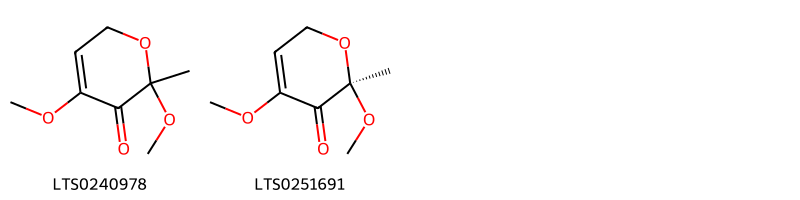{ group="compound" description="Cấu trúc hóa học của các hoạt chất thuộc nhóm *Pyrans* là 2,4-dimethoxy-2-methyl-6h-pyran-3-one [(LTS0240978)](https://lotus.naturalproducts.net/compound/lotus_id/LTS0240978), (2r)-2,4-dimethoxy-2-methyl-6h-pyran-3-one [(LTS0251691)](https://lotus.naturalproducts.net/compound/lotus_id/LTS0251691)." }

                                                              
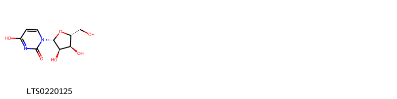{ group="compound" description="Cấu trúc hóa học của các hoạt chất thuộc nhóm *Pyrimidine nucleosides* là uridine [(LTS0220125)](https://lotus.naturalproducts.net/compound/lotus_id/LTS0220125)." }

                                                              
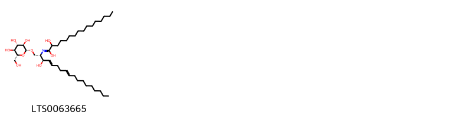{ group="compound" description="Cấu trúc hóa học của các hoạt chất thuộc nhóm *Sphingolipids* là 2-hydroxy-n-[(2s,3r,4e,8e)-3-hydroxy-1-{[(2r,3r,4s,5s,6r)-3,4,5-trihydroxy-6-(hydroxymethyl)oxan-2-yl]oxy}octadeca-4,8-dien-2-yl]hexadecanimidic acid [(LTS0063665)](https://lotus.naturalproducts.net/compound/lotus_id/LTS0063665)." }

                                                              
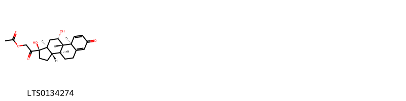{ group="compound" description="Cấu trúc hóa học của các hoạt chất thuộc nhóm *Steroids and steroid derivatives* là prednisolone acetate [(LTS0134274)](https://lotus.naturalproducts.net/compound/lotus_id/LTS0134274)." }

                                                              
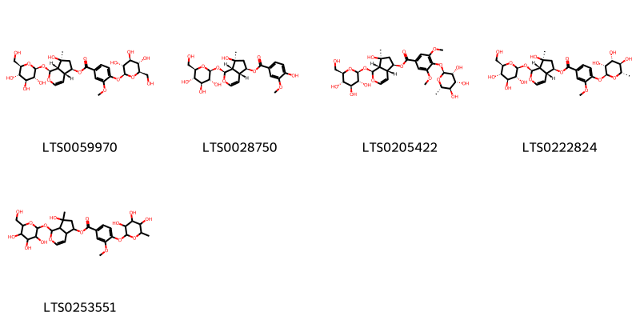{ group="compound" description="Cấu trúc hóa học của các hoạt chất thuộc nhóm *Tannins* là (1s,4ar,5r,7s,7as)-7-hydroxy-7-methyl-1-{[(2s,3r,4s,5s,6r)-3,4,5-trihydroxy-6-(hydroxymethyl)oxan-2-yl]oxy}-1h,4ah,5h,6h,7ah-cyclopenta[c]pyran-5-yl 3-methoxy-4-{[(2s,3r,4s,5s,6r)-3,4,5-trihydroxy-6-(hydroxymethyl)oxan-2-yl]oxy}benzoate [(LTS0059970)](https://lotus.naturalproducts.net/compound/lotus_id/LTS0059970), (1s,4ar,5r,7s,7as)-7-hydroxy-7-methyl-1-{[(2s,3r,4s,5s,6r)-3,4,5-trihydroxy-6-(hydroxymethyl)oxan-2-yl]oxy}-1h,4ah,5h,6h,7ah-cyclopenta[c]pyran-5-yl 4-hydroxy-3-methoxybenzoate [(LTS0028750)](https://lotus.naturalproducts.net/compound/lotus_id/LTS0028750), (1s,4ar,5r,7s,7as)-7-hydroxy-7-methyl-1-{[(2s,3r,4s,5s,6r)-3,4,5-trihydroxy-6-(hydroxymethyl)oxan-2-yl]oxy}-1h,4ah,5h,6h,7ah-cyclopenta[c]pyran-5-yl 3,5-dimethoxy-4-{[(2s,3r,4r,5r,6s)-3,4,5-trihydroxy-6-methyloxan-2-yl]oxy}benzoate [(LTS0205422)](https://lotus.naturalproducts.net/compound/lotus_id/LTS0205422), (1s,4ar,5r,7s,7as)-7-hydroxy-7-methyl-1-{[(2s,3r,4s,5s,6r)-3,4,5-trihydroxy-6-(hydroxymethyl)oxan-2-yl]oxy}-1h,4ah,5h,6h,7ah-cyclopenta[c]pyran-5-yl 3-methoxy-4-{[(2s,3r,4r,5r,6s)-3,4,5-trihydroxy-6-methyloxan-2-yl]oxy}benzoate [(LTS0222824)](https://lotus.naturalproducts.net/compound/lotus_id/LTS0222824), 7-hydroxy-7-methyl-1-{[3,4,5-trihydroxy-6-(hydroxymethyl)oxan-2-yl]oxy}-1h,4ah,5h,6h,7ah-cyclopenta[c]pyran-5-yl 3-methoxy-4-[(3,4,5-trihydroxy-6-methyloxan-2-yl)oxy]benzoate [(LTS0253551)](https://lotus.naturalproducts.net/compound/lotus_id/LTS0253551)." }

:::

---

## IV. Tác dụng dược lý

Theo tài liệu quốc tế: nan

---

## V. Dược điển Việt Nam V

### Soi bột

nan

::: {#listing-soibot}
:::

### Vi phẫu

nan

::: {#listing-viphau}
:::

### Định tính

Phương pháp sắc ký lớp mỏng (Phụ lục 5.4). <i>Bản</i> <i>mỏng: Silica gel GF254.</i> <i>Dung môi khai triển: Ethylacetat – methanol – acid formic (16:0,5:2).</i> <i>Dung dịch thử:</i> Lấy 1 g dược liệu đã cắt nhỏ, thêm <i>50 ml methanol (TT)</i> 80 %, lắc siêu âm 30 min, lọc. có dịch lọc trên cách thủy đến cạn, hòa cắn trong 5 ml nước. Lăc với n-butanol đã bão hòa <i>nước (TT</i>) 4 lần. mỗi lần 10 ml. Gộp dịch chiết n-butanol, cô đến cạn. Hòa cắn trong <i>2 ml methanol (TT)</i> làm dung dịch chấm sắc ký. <i>Dung dịch đối chiếu</i>: Hòa tan verbascosid chuẩn trong methanol (TT) để được dung dịch có nồng độ khoảng 1 mg/ml. <i>Cách tiến hành</i>: Chấm riêng biệt lên bản mỏng 5 µl mỗi dung dịch trên. Sau khi triển khai, để khô bản mỏng ở nhiệt độ phòng, phun dung dịch 2 -aminoethyl diphenylorinat 1 % trong methanol (TT), sấy bản mỏng ở 105 °C trong 5 min. Quan sát bản mỏng dưới ánh sáng tử ngoại tại bước sóng 366 tim, Trên sắc ký đồ của dung dịch thử phải có vết cùng màu và cùng giá trị Rf với vết chính trên sắc ký đồ của dung dịch đối chiếu.

### Định lượng

Phương pháp sắc ký lỏng (Phụ lục 5.3). <i>Pha</i> <i>động: Acetonitril</i> <i>– dung dịch acid acetic 0,1</i> <i>% (16:84)</i> <i>Dung dịch thử:</i> cắt một lượng dược liệu thành những mảnh nhỏ (kích thước khoảng 5 mm X 5 mm), sấy ở 80 °C, dưới áp suất giảm trong 24 h rồi nghiền thành bột thô. Cân chính xác khoảng 2 g bột dược liệu vào một bình nón nút mài, thêm chính xác <i>100 ml methenol</i> <i>(TT</i>), đậy nút, cân. Đun sôi hồi lưu 30 min, để nguội và cân lại. Bổ sung khối lượng mất đi bằng <i>methanol</i> <i>(TT</i>), lắc đều, lọc. Lấy chính xác 50 ml dịch lọc, cất thu hồi dung môi trong chân không đến gần khô. Dùng pha động để hòa tan và chuyển toàn bộ cắn vào bình định mức 10 ml, thêm pha động vừa đủ đến vạch, lắc đều, lọc qua màng lọc 0,45 µm. <i>Dung dịch chuẩn</i>: Hòa tan verbascosid chuẩn trong pha động để được dung dịch có nồng độ chính xác khoảng 10 mg/ml. <i>Điều kiện sắc ký</i>: Cột kích thước (25 cm X 4,6 mm), được nhồi pha tính C (5 µm). Derector quang phổ từ ngoại đặt ở bước sóng 334 nm. <i>Tốc độ dòng</i>: 0,8 ml/min. <i>Thể tích tiêm</i>: 20µl. <i>Cách tiến hành</i>: Tiến hành sắc ký với dung dịch chuẩn. Tính số đĩa lý thuyết của cột. Số đĩa lý thuyết của cột tính trên pic verbascosid phải không dưới 5000. Tiến hành sắc ký với dung dịch chuẩn và dung dịch thử. Tính hàm lượng verbascosid trong được liệu dựa vào diện tích pic thu được trên sắc ký đồ của dung dịch thử, dung dịch chuẩn, hàm lượng C29H36O15 trong verbaseosid chuẩn. Dược liệu phải chứa không dưới 0,02 % verbascosíd (C79H36O15) tính theo dược liệu khô kiệt.

### Thông tin khác 

- **Độ ẩm:** nan
- **Bảo quản:** nan

## VI. Dược điển Hồng kong

::: {#listing-DDHK}
:::

---

## VII. Y dược học cổ truyền

::: {.callout-note title = "Thục địa" }

**Tên vị thuốc:** Thục địa

**Tính:** Cam

**Vị:** Ôn

**Quy kinh:**  Can, Thận, Tâm

**Công năng chủ trị:** Tư âm, bổ huyết, ích tinh, tủy. Chủ trị: Can, thận âm hư, thắt lưng đầu gối mỏi yếu, cốt chưng, triêu nhiệt, mồ hôi trộm, di tinh, âm hư ho suyễn, háo khát, Huyết hư, đánh trống ngực hồi hộp, kinh nguyệt không đều, rong huyết, chóng mặt ù tai, mắt mờ, táo bón.

**Phân loại theo thông tư:** nan

**Tác dụng theo y dược cổ truyền:** nan

**Chú ý:** nan

**Kiêng kỵ:** Kỵ sắt. Tỳ vị hư hàn không dùng 

:::

::: {#listing-ViThuoc}
:::

