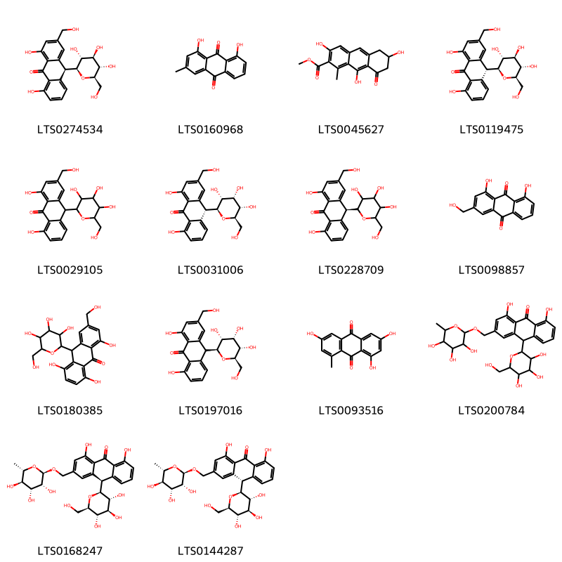
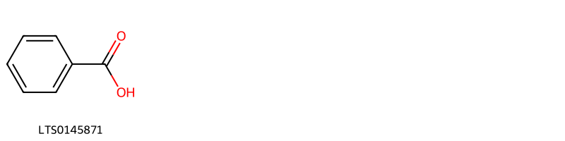
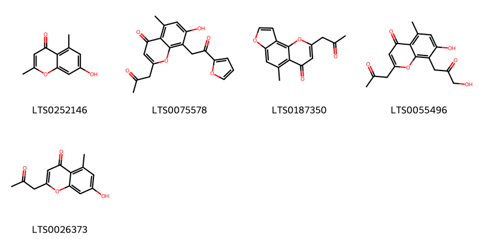
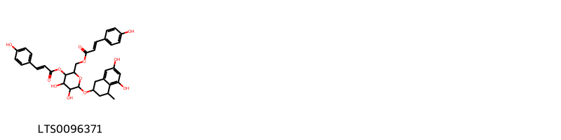
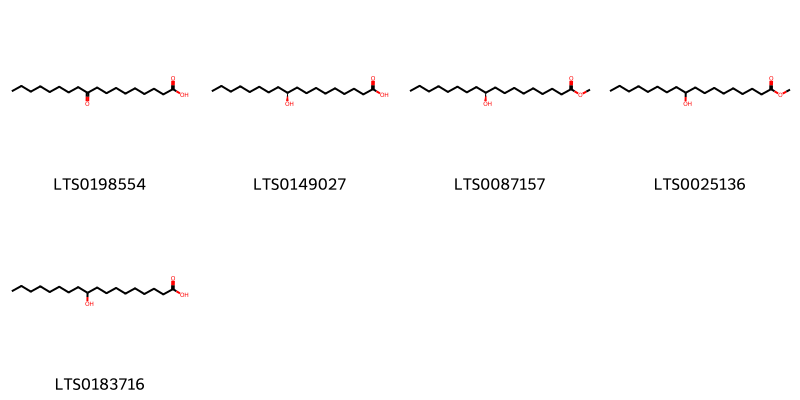
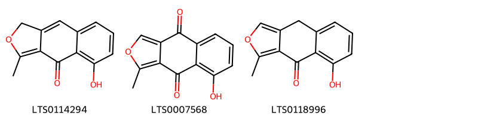
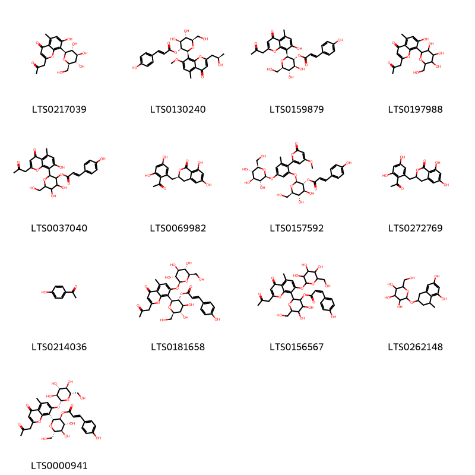
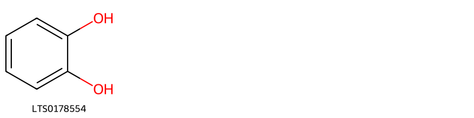
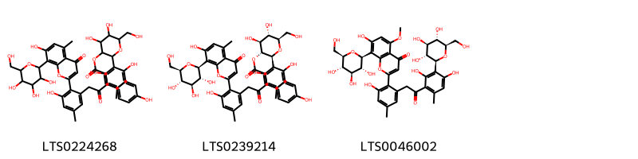
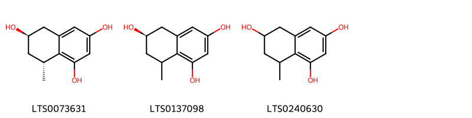

::: {.callout-note title = "Tóm tắt"}

Lô hội là cây có thân hóa, ngắn, to thô. Tên khoa học là Aloe sp., thuộc họ Hành Tỏi Liliaceae. Phân bố chủ yếu ở đông châu Phi, Ấn Độ, Châu Mỹ. Tại Việt Nam, lô hội mọc hoang ở bờ biển những tỉnh Ninh Thuận (Phan Rang, Phan Ri) và Bình Thuận. Ở miền Bắc được trồng làm cảnh nhưng ít hơn. Theo tài liệu cổ lô hội vị đắng tính hàn, vào 4 kinh can, tỳ, vị và đại tràng. Có tác dụng sát trùng, thông tiện, thanh nhiệt, lương can. Một số thành phần hóa học đã được phát hiện và xác định cấu trúc của nhóm Aloin.

:::

## I. Thông tin về dược liệu 

::: {.panel-tabset}

### Định danh

- Dược liệu tiếng Việt: Lô Hội - Nhựa
- Dược liệu tiếng Trung: nan (nan)
- Dược liệu tiếng Anh: nan
- Dược liệu latin thông dụng: Resina Aloe
- Dược liệu latin kiểu DĐVN: *nan*
- Dược liệu latin kiểu DĐVN: *nan*
- Dược liệu latin kiểu thông tư: *nan*
- Bộ phận dùng: Nhựa (Resina)

### Mô tả dược liệu 

**Theo dược điển Việt nam V:** nan 
 
**Mô tả dược liệu theo thông tư chế biến dược liệu theo phương pháp cổ truyền:** nan

### Chế biến 

**Chế biến theo dược điển việt nam V**: nan 

**Chế biến theo thông tư:** nan

::: 

## II. Thông tin về thực vật

Dược liệu **Lô Hội - Nhựa** từ bộ phận **Nhựa** từ loài *Aloe vera*.

**Mô tả thực vật:** - Lô hội có nhiều loài khác nhau. ở đây chúng tôi chỉ giới thiệu một loài có ở nước ta và một số loài thông dụng. Lô hội Aloe vera Livar. sinensis Berger [Aloe perfoliata Lour. (non L.). Alde barbadensis Mill.var.sinensis Haw.] là một cây có thân hoá gỗ, ngắn, to thô. Lá không cuống, mọc thành vành rất sít nhau, dày mẫm, hình 3 cạnh, mép dây, mép có răng cưa thô cứng và thưa dài 30-50cm, rộng 5- 10cm, dày 1-2cm, ở phía cuống. Cụm hoa dài chừng 1m, mọc thành chùm dài mang hoa màu vàng xanh lục nhạt lúc đầu mọc đứng, sau rū xuống, dài 3-4cm. Quả nang, hình trứng thuôn, lúc đầu xanh sau nâu và dai.
- Tại miền Bắc có trồng một loài lô hội trước đây được xác định là Aloe perfoliata L. chủ yếu để làm cảnh, có lá ngắn hơn chỉ đo được chừng 15- 20cm, chưa thấy ra hoa kết quả.
- Tại các nước khúc người ta dùng nhựa nhiều cây lô hội khác như Aloe vulgaris Lamk., Aloe ferox L., Aloe perryi Bak. v.v... cho nhiều thứ lô hội chất lượng khác nhau.

*Tài liệu tham khảo:* "Những cây thuốc và vị thuốc Việt Nam" - Đỗ Tất Lợi 
Trong dược điển Việt nam, một số loài có thể dùng thay thế cho nhau làm dược liệu bao gồm *Aloe vera, Aloe ferox*

            
::: {.callout-note title = "Phân loại thực vật của *Aloe vera*"}

**Kingdom:** Plantae 

**Phylum:** Tracheophyta 

**Order:** Asparagales 
 
**Family:** Asphodelaceae 
 
**Genus:** Aloe 
 
**Species:** *Aloe vera* 
 

:::

::: {style="display: grid;grid-template-columns: repeat(auto-fill, minmax(150px, 1fr));grid-gap: 1em;"}
{ group="GIBF" }

{ group="GIBF" }

{ group="GIBF" }

{ group="GIBF" }

{ group="GIBF" }

{ group="GIBF" }

{ group="GIBF" }

{ group="GIBF" }

{ group="GIBF" }

{ group="GIBF" }
:::

**Phân bố trên thế giới:** France, Benin, Chad, Saint Vincent and the Grenadines, Haiti, Curaçao, Gibraltar, Bahamas, Jamaica, Sri Lanka, Antigua and Barbuda, Oman, Cabo Verde, Spain, French Guiana, Mexico, Chinese Taipei, Colombia, Réunion, Bonaire, Sint Eustatius and Saba, Barbados, United Arab Emirates, Australia, Aruba, Virgin Islands (U.S.), Sint Maarten (Dutch part), Jordan, Portugal, India, Brazil, Peru, United States of America, Philippines, Malta, Dominican Republic, Malaysia, Greece, Ecuador, Puerto Rico, Anguilla, Austria, Cyprus

**Phân bố tại Việt nam:** Không có ghi nhận ở Việt Nam

<iframe src="Resina Aloe/map_distribution.html" width="100%" height="600" style="border:none;"></iframe>

            
::: {.callout-note title = "Phân loại thực vật của *Aloe ferox*"}

**Kingdom:** Plantae 

**Phylum:** Tracheophyta 

**Order:** Asparagales 
 
**Family:** Asphodelaceae 
 
**Genus:** Aloe 
 
**Species:** *Aloe ferox* 
 

:::

::: {style="display: grid;grid-template-columns: repeat(auto-fill, minmax(150px, 1fr));grid-gap: 1em;"}
{ group="GIBF" }

{ group="GIBF" }

{ group="GIBF" }

{ group="GIBF" }

{ group="GIBF" }

{ group="GIBF" }

{ group="GIBF" }

{ group="GIBF" }

{ group="GIBF" }

{ group="GIBF" }

{ group="GIBF" }

{ group="GIBF" }

{ group="GIBF" }

{ group="GIBF" }

{ group="GIBF" }
:::

**Phân bố trên thế giới:** France, South Africa

**Phân bố tại Việt nam:** Không có ghi nhận ở Việt Nam

<iframe src="Resina Aloe/map_distribution.html" width="100%" height="600" style="border:none;"></iframe>

## III. Thành phần hóa học

Theo tài liệu của GS. Đỗ Tất Lợi:  Nhóm hóa học: Aloin, Barbaloin, Aloesin
Tên hoạt chất: Barbaloin
    

Theo cơ sở dữ liệu lotus, loài *Aloe ferox* đã phân lập và xác định được **49** hoạt chất thuộc về các nhóm Stilbenes, Cinnamic acids and derivatives, Tetralins, Organooxygen compounds, Benzene and substituted derivatives, Fatty Acyls, Naphthofurans, Phenols, Anthracenes, Benzopyrans trong bảng dưới đây.
        
| chemicalTaxonomyClassyfireClass     |   smiles_count |
|:------------------------------------|---------------:|
| Anthracenes                         |            942 |
| Benzene and substituted derivatives |             14 |
| Benzopyrans                         |            176 |
| Cinnamic acids and derivatives      |             85 |
| Fatty Acyls                         |            141 |
| Naphthofurans                       |             85 |
| Organooxygen compounds              |           1044 |
| Phenols                             |             10 |
| Stilbenes                           |            439 |
| Tetralins                           |             87 |

Danh sách chi tiết các hoạt chất như sau: 

::: {style="display: grid;grid-template-columns: repeat(auto-fill, minmax(150px, 1fr));grid-gap: 1em;"}

                                                              
{ group="compound" description="Cấu trúc hóa học của các hoạt chất thuộc nhóm *Anthracenes* là aloin [(LTS0274534)](https://lotus.naturalproducts.net/compound/lotus_id/LTS0274534), turkey rhubarb [(LTS0160968)](https://lotus.naturalproducts.net/compound/lotus_id/LTS0160968), methyl 3,6,9-trihydroxy-1-methyl-8-oxo-6,7-dihydro-5h-anthracene-2-carboxylate [(LTS0045627)](https://lotus.naturalproducts.net/compound/lotus_id/LTS0045627), barbaloin [(LTS0119475)](https://lotus.naturalproducts.net/compound/lotus_id/LTS0119475), aloin [(LTS0029105)](https://lotus.naturalproducts.net/compound/lotus_id/LTS0029105), (10r)-1,8-dihydroxy-3-(hydroxymethyl)-10-[(2s,3r,4s,5s,6r)-3,4,5-trihydroxy-6-(hydroxymethyl)oxan-2-yl]-10h-anthracen-9-one [(LTS0031006)](https://lotus.naturalproducts.net/compound/lotus_id/LTS0031006), (10s)-1,8-dihydroxy-3-(hydroxymethyl)-10-[3,4,5-trihydroxy-6-(hydroxymethyl)oxan-2-yl]-10h-anthracen-9-one [(LTS0228709)](https://lotus.naturalproducts.net/compound/lotus_id/LTS0228709), aloe emodin [(LTS0098857)](https://lotus.naturalproducts.net/compound/lotus_id/LTS0098857), 1,5,8-trihydroxy-3-(hydroxymethyl)-10-[3,4,5-trihydroxy-6-(hydroxymethyl)oxan-2-yl]-10h-anthracen-9-one [(LTS0180385)](https://lotus.naturalproducts.net/compound/lotus_id/LTS0180385), 1,8-dihydroxy-3-(hydroxymethyl)-10-[(2s,3r,4s,5s,6r)-3,4,5-trihydroxy-6-(hydroxymethyl)oxan-2-yl]-10h-anthracen-9-one [(LTS0197016)](https://lotus.naturalproducts.net/compound/lotus_id/LTS0197016), 1,3,6-trihydroxy-8-methylanthracene-9,10-dione [(LTS0093516)](https://lotus.naturalproducts.net/compound/lotus_id/LTS0093516), 1,8-dihydroxy-10-[3,4,5-trihydroxy-6-(hydroxymethyl)oxan-2-yl]-3-{[(3,4,5-trihydroxy-6-methyloxan-2-yl)oxy]methyl}-10h-anthracen-9-one [(LTS0200784)](https://lotus.naturalproducts.net/compound/lotus_id/LTS0200784), aloinoside b [(LTS0168247)](https://lotus.naturalproducts.net/compound/lotus_id/LTS0168247), aloinoside a [(LTS0144287)](https://lotus.naturalproducts.net/compound/lotus_id/LTS0144287)." }

                                                              
{ group="compound" description="Cấu trúc hóa học của các hoạt chất thuộc nhóm *Benzene and substituted derivatives* là benzoic acid [(LTS0145871)](https://lotus.naturalproducts.net/compound/lotus_id/LTS0145871)." }

                                                              
{ group="compound" description="Cấu trúc hóa học của các hoạt chất thuộc nhóm *Benzopyrans* là altechromone a [(LTS0252146)](https://lotus.naturalproducts.net/compound/lotus_id/LTS0252146), 8-[2-(furan-2-yl)-2-oxoethyl]-7-hydroxy-5-methyl-2-(2-oxopropyl)chromen-4-one [(LTS0075578)](https://lotus.naturalproducts.net/compound/lotus_id/LTS0075578), 5-methyl-2-(2-oxopropyl)furo[2,3-h]chromen-4-one [(LTS0187350)](https://lotus.naturalproducts.net/compound/lotus_id/LTS0187350), 7-hydroxy-8-(3-hydroxy-2-oxopropyl)-5-methyl-2-(2-oxopropyl)chromen-4-one [(LTS0055496)](https://lotus.naturalproducts.net/compound/lotus_id/LTS0055496), aloesone [(LTS0026373)](https://lotus.naturalproducts.net/compound/lotus_id/LTS0026373)." }

                                                              
{ group="compound" description="Cấu trúc hóa học của các hoạt chất thuộc nhóm *Cinnamic acids and derivatives* là {6-[(5,7-dihydroxy-4-methyl-1,2,3,4-tetrahydronaphthalen-2-yl)oxy]-4,5-dihydroxy-3-{[(2e)-3-(4-hydroxyphenyl)prop-2-enoyl]oxy}oxan-2-yl}methyl (2e)-3-(4-hydroxyphenyl)prop-2-enoate [(LTS0096371)](https://lotus.naturalproducts.net/compound/lotus_id/LTS0096371)." }

                                                              
{ group="compound" description="Cấu trúc hóa học của các hoạt chất thuộc nhóm *Fatty Acyls* là 10-keto stearic acid [(LTS0198554)](https://lotus.naturalproducts.net/compound/lotus_id/LTS0198554), (10s)-10-hydroxystearic acid [(LTS0149027)](https://lotus.naturalproducts.net/compound/lotus_id/LTS0149027), methyl (10s)-10-hydroxyoctadecanoate [(LTS0087157)](https://lotus.naturalproducts.net/compound/lotus_id/LTS0087157), methyl 10-hydroxyoctadecanoate [(LTS0025136)](https://lotus.naturalproducts.net/compound/lotus_id/LTS0025136), 10-hydroxystearic acid [(LTS0183716)](https://lotus.naturalproducts.net/compound/lotus_id/LTS0183716)." }

                                                              
{ group="compound" description="Cấu trúc hóa học của các hoạt chất thuộc nhóm *Naphthofurans* là 5-hydroxy-3-methyl-1h-naphtho[2,3-c]furan-4-one [(LTS0114294)](https://lotus.naturalproducts.net/compound/lotus_id/LTS0114294), 8-hydroxy-1-methylnaphtho[2,3-c]furan-4,9-dione [(LTS0007568)](https://lotus.naturalproducts.net/compound/lotus_id/LTS0007568), 5-hydroxy-3-methyl-9h-naphtho[2,3-c]furan-4-one [(LTS0118996)](https://lotus.naturalproducts.net/compound/lotus_id/LTS0118996)." }

                                                              
{ group="compound" description="Cấu trúc hóa học của các hoạt chất thuộc nhóm *Organooxygen compounds* là aloesin [(LTS0217039)](https://lotus.naturalproducts.net/compound/lotus_id/LTS0217039), (2s,3r,4s,5s,6r)-4,5-dihydroxy-6-(hydroxymethyl)-2-{2-[(2r)-2-hydroxypropyl]-7-methoxy-5-methyl-4-oxochromen-8-yl}oxan-3-yl (2e)-3-(4-hydroxyphenyl)prop-2-enoate [(LTS0130240)](https://lotus.naturalproducts.net/compound/lotus_id/LTS0130240), aloeresin a [(LTS0159879)](https://lotus.naturalproducts.net/compound/lotus_id/LTS0159879), 7-hydroxy-5-methyl-2-(2-oxopropyl)-8-[3,4,5-trihydroxy-6-(hydroxymethyl)oxan-2-yl]chromen-4-one [(LTS0197988)](https://lotus.naturalproducts.net/compound/lotus_id/LTS0197988), 4,5-dihydroxy-2-[7-hydroxy-5-methyl-4-oxo-2-(2-oxopropyl)chromen-8-yl]-6-(hydroxymethyl)oxan-3-yl 3-(4-hydroxyphenyl)prop-2-enoate [(LTS0037040)](https://lotus.naturalproducts.net/compound/lotus_id/LTS0037040), (3r)-3-[(2-acetyl-3,5-dihydroxyphenyl)methyl]-6,8-dihydroxy-3,4-dihydro-2-benzopyran-1-one [(LTS0069982)](https://lotus.naturalproducts.net/compound/lotus_id/LTS0069982), (2s,3r,4s,5s,6r)-4,5-dihydroxy-6-(hydroxymethyl)-2-[2-(4-methoxy-6-oxopyran-2-yl)-3-methyl-5-{[(2s,3r,4s,5s,6r)-3,4,5-trihydroxy-6-(hydroxymethyl)oxan-2-yl]oxy}phenoxy]oxan-3-yl (2e)-3-(4-hydroxyphenyl)prop-2-enoate [(LTS0157592)](https://lotus.naturalproducts.net/compound/lotus_id/LTS0157592), 3-[(2-acetyl-3,5-dihydroxyphenyl)methyl]-6,8-dihydroxy-3,4-dihydro-2-benzopyran-1-one [(LTS0272769)](https://lotus.naturalproducts.net/compound/lotus_id/LTS0272769), hydroxyacetophenone [(LTS0214036)](https://lotus.naturalproducts.net/compound/lotus_id/LTS0214036), (2s,3r,4s,5s,6r)-4,5-dihydroxy-6-(hydroxymethyl)-2-[5-methyl-4-oxo-2-(2-oxopropyl)-7-{[(2s,3r,4s,5s,6r)-3,4,5-trihydroxy-6-(hydroxymethyl)oxan-2-yl]oxy}chromen-8-yl]oxan-3-yl (2e)-3-(4-hydroxyphenyl)prop-2-enoate [(LTS0181658)](https://lotus.naturalproducts.net/compound/lotus_id/LTS0181658), 4,5-dihydroxy-6-(hydroxymethyl)-2-[5-methyl-4-oxo-2-(2-oxopropyl)-7-{[3,4,5-trihydroxy-6-(hydroxymethyl)oxan-2-yl]oxy}chromen-8-yl]oxan-3-yl 3-(4-hydroxyphenyl)prop-2-enoate [(LTS0156567)](https://lotus.naturalproducts.net/compound/lotus_id/LTS0156567), 2-[(5,7-dihydroxy-4-methyl-1,2,3,4-tetrahydronaphthalen-2-yl)oxy]-6-(hydroxymethyl)oxane-3,4,5-triol [(LTS0262148)](https://lotus.naturalproducts.net/compound/lotus_id/LTS0262148), (2r,3s,4r,5r,6s)-4,5-dihydroxy-6-(hydroxymethyl)-2-[5-methyl-4-oxo-2-(2-oxopropyl)-7-{[(2r,3s,4r,5r,6s)-3,4,5-trihydroxy-6-(hydroxymethyl)oxan-2-yl]oxy}chromen-8-yl]oxan-3-yl (2e)-3-(4-hydroxyphenyl)prop-2-enoate [(LTS0000941)](https://lotus.naturalproducts.net/compound/lotus_id/LTS0000941)." }

                                                              
{ group="compound" description="Cấu trúc hóa học của các hoạt chất thuộc nhóm *Phenols* là catechol [(LTS0178554)](https://lotus.naturalproducts.net/compound/lotus_id/LTS0178554)." }

                                                              
{ group="compound" description="Cấu trúc hóa học của các hoạt chất thuộc nhóm *Stilbenes* là 2-{2,6-dihydroxy-3-[2-(3-hydroxy-2-{7-hydroxy-5-methyl-4-oxo-8-[3,4,5-trihydroxy-6-(hydroxymethyl)oxan-2-yl]chromen-2-yl}-5-methylphenyl)acetyl]-4-methylphenyl}-4,5-dihydroxy-6-(hydroxymethyl)oxan-3-yl 3-(4-hydroxyphenyl)prop-2-enoate [(LTS0224268)](https://lotus.naturalproducts.net/compound/lotus_id/LTS0224268), (2s,3r,4s,5s,6r)-2-{2,6-dihydroxy-3-[2-(3-hydroxy-2-{7-hydroxy-5-methyl-4-oxo-8-[(2s,3r,4r,5s,6r)-3,4,5-trihydroxy-6-(hydroxymethyl)oxan-2-yl]chromen-2-yl}-5-methylphenyl)acetyl]-4-methylphenyl}-4,5-dihydroxy-6-(hydroxymethyl)oxan-3-yl (2e)-3-(4-hydroxyphenyl)prop-2-enoate [(LTS0239214)](https://lotus.naturalproducts.net/compound/lotus_id/LTS0239214), 2-[2-(2-{2,4-dihydroxy-6-methyl-3-[(2s,3r,4r,5s,6r)-3,4,5-trihydroxy-6-(hydroxymethyl)oxan-2-yl]phenyl}-2-oxoethyl)-6-hydroxy-4-methylphenyl]-7-hydroxy-5-methoxy-8-[(2s,3r,4r,5s,6r)-3,4,5-trihydroxy-6-(hydroxymethyl)oxan-2-yl]chromen-4-one [(LTS0046002)](https://lotus.naturalproducts.net/compound/lotus_id/LTS0046002)." }

                                                              
{ group="compound" description="Cấu trúc hóa học của các hoạt chất thuộc nhóm *Tetralins* là (6r,8r)-8-methyl-5,6,7,8-tetrahydronaphthalene-1,3,6-triol [(LTS0073631)](https://lotus.naturalproducts.net/compound/lotus_id/LTS0073631), (6r)-8-methyl-5,6,7,8-tetrahydronaphthalene-1,3,6-triol [(LTS0137098)](https://lotus.naturalproducts.net/compound/lotus_id/LTS0137098), 8-methyl-5,6,7,8-tetrahydronaphthalene-1,3,6-triol [(LTS0240630)](https://lotus.naturalproducts.net/compound/lotus_id/LTS0240630)." }

:::

---

## IV. Tác dụng dược lý

Theo tài liệu quốc tế: nan

---

## V. Dược điển Việt Nam V

### Soi bột

nan

::: {#listing-soibot}
:::

### Vi phẫu

nan

::: {#listing-viphau}
:::

### Định tính

nan

### Định lượng

nan

### Thông tin khác 

- **Độ ẩm:** nan
- **Bảo quản:** nan

## VI. Dược điển Hồng kong

::: {#listing-DDHK}
:::

---

## VII. Y dược học cổ truyền

::: {.callout-note title = "nan" }

**Tên vị thuốc:** nan

**Tính:** nan

**Vị:** nan

**Quy kinh:**  nan

**Công năng chủ trị:** nan

**Phân loại theo thông tư:** nan

**Tác dụng theo y dược cổ truyền:** nan

**Chú ý:** nan

**Kiêng kỵ:** nan 

:::

::: {#listing-ViThuoc}
:::

