::: {.callout-note title = "Tóm tắt"}

Xương bồ (Rhizoma Acori) là thân rễ đã phơi khô, hoặc sấy khô của cây Thạch xương bồ lá to (Acorus gramineus Soland. var. macrospadiceus Yamamoto Contr) và cây Thủy Xương bồ (Acorus calamus L. var. angustatus Bess.), họ Ráy (Araceae). Loài cây này mọc hoang tại các vùng núi miền Bắc và Trung Việt Nam, thường tìm thấy ở những nơi khe đá, khe suối, và chỗ mát. Theo tài liệu cổ, xương bồ có tính tân, ôn, vào các kinh tâm, can, tỳ. Dược liệu dùng trị bệnh phong điên gian, đờm vít tắc, hôn mê, hay quên, mộng nhiều, viêm phế quản, tai điếc, đi lỵ đau bụng, dùng ngoài, trị mụn nhọt, ghé lở chảy nước. Thành phần hóa học của xương bồ chủ yếu bao gồm tinh dầu với các hợp chất như asaron, acorenon, và iso-acorenon.

:::

## I. Thông tin về dược liệu 

::: {.panel-tabset}

### Định danh

- Dược liệu tiếng Việt: Xương Bồ - Thân rễ
- Dược liệu tiếng Trung: nan (nan)
- Dược liệu tiếng Anh: nan
- Dược liệu latin thông dụng: Rhizoma Acori
- Dược liệu latin kiểu DĐVN: *nan*
- Dược liệu latin kiểu DĐVN: *nan*
- Dược liệu latin kiểu thông tư: *nan*
- Bộ phận dùng: Thân rễ (Rhizoma)

### Mô tả dược liệu 

**Theo dược điển Việt nam V:** nan 
 
**Mô tả dược liệu theo thông tư chế biến dược liệu theo phương pháp cổ truyền:** nan

### Chế biến 

**Chế biến theo dược điển việt nam V**: nan 

**Chế biến theo thông tư:** nan

::: 

## II. Thông tin về thực vật

Dược liệu **Xương Bồ - Thân rễ** từ bộ phận **Thân rễ** từ loài *Acorus gramineus*.

**Mô tả thực vật:** "Thạch Xương Bồ
Thạch xương bồ là một loại cỏ sống lâu năm với các đặc điểm sau:

Thân rễ: Mọc ngang, đường kính tương đương ngón tay, có nhiều đốt với các sẹo lá. Khi khô, thân rễ có màu nâu sắt và mùi thơm đặc trưng. Thân rễ dài khoảng 20 cm đến 5 cm, đường kính từ 5 mm đến 7 mm.

Lá: Mọc đứng, hình dải, dài từ 30-50 cm, rộng 2-6 mm, chỉ có gân giữa.

Hoa: Hoa mọc thành bông mo ở đầu một cán dẹt dài 10-30 cm, được phủ bởi một lá bắc dài 7-20 cm, rộng 2-4 mm, vượt cao hơn cụm hoa. Cụm hoa dài từ 5-12 cm, đường kính 2-4 mm.

Quả: Quả mọng màu đỏ nhạt, một ngăn, có thành gần như khô, quanh hạt có một chất nhầy.

Thủy Xương Bồ (Acorus calamus)
Thủy xương bồ cũng có các đặc điểm tương tự như thạch xương bồ nhưng lớn và cao hơn:

Thân rễ: Hình trụ dẹt, dài trung bình từ 50 cm đến 60 cm, có khi tới 1 m, dày 0,5 cm đến 1 cm, đốt dài khoảng 1 cm. Mặt vỏ có màu nâu sắt với nhiều chấm đen. Thân rễ có mùi thơm đặc trưng, thể chất dai và xốp.

Lá: Dài từ 50-150 cm, rộng 6-30 mm. Lá bắc của cán hoa cũng dài hơn, thường tới 45 cm.

Hoa: Cụm hoa mọc thành bóng mẫm, so với cụm hoa của thạch xương bồ thì to và ngắn hơn, dài từ 4-8 cm, đường kính 6-12 mm. Mùa hoa vào tháng 5-7, mùa quả từ tháng 6-8."

*Tài liệu tham khảo:* "Những cây thuốc và vị thuốc Việt Nam" - Đỗ Tất Lợi 
Trong dược điển Việt nam, một số loài có thể dùng thay thế cho nhau làm dược liệu bao gồm *Acorus gramineus, Acorus calamus*

            
::: {.callout-note title = "Phân loại thực vật của *Acorus gramineus*"}

**Kingdom:** Plantae 

**Phylum:** Tracheophyta 

**Order:** Acorales 
 
**Family:** Acoraceae 
 
**Genus:** Acorus 
 
**Species:** *Acorus gramineus* 
 

:::

::: {style="display: grid;grid-template-columns: repeat(auto-fill, minmax(150px, 1fr));grid-gap: 1em;"}
{ group="GIBF" }

{ group="GIBF" }

{ group="GIBF" }

{ group="GIBF" }

{ group="GIBF" }

{ group="GIBF" }

{ group="GIBF" }

{ group="GIBF" }

{ group="GIBF" }

{ group="GIBF" }

{ group="GIBF" }

{ group="GIBF" }
:::

**Phân bố trên thế giới:** Germany, nan, United States of America, Philippines, Chinese Taipei, China, Hong Kong, United Kingdom of Great Britain and Northern Ireland, Japan, Korea, Republic of, Macao, Viet Nam, Belgium

**Phân bố tại Việt nam:** Không có ghi nhận ở Việt Nam

<iframe src="Rhizoma Acori/map_distribution.html" width="100%" height="600" style="border:none;"></iframe>

            
::: {.callout-note title = "Phân loại thực vật của *Acorus calamus*"}

**Kingdom:** Plantae 

**Phylum:** Tracheophyta 

**Order:** Acorales 
 
**Family:** Acoraceae 
 
**Genus:** Acorus 
 
**Species:** *Acorus calamus* 
 

:::

::: {style="display: grid;grid-template-columns: repeat(auto-fill, minmax(150px, 1fr));grid-gap: 1em;"}
{ group="GIBF" }

{ group="GIBF" }

{ group="GIBF" }

{ group="GIBF" }

{ group="GIBF" }

{ group="GIBF" }

{ group="GIBF" }

{ group="GIBF" }
:::

**Phân bố trên thế giới:** Germany, Switzerland, Czechia, Netherlands, Finland, Poland, Sweden, Japan, Belarus, Russian Federation, United Kingdom of Great Britain and Northern Ireland, Ukraine, United States of America, China, Lithuania, Italy, Norway, Canada, Denmark, Austria, Belgium

**Phân bố tại Việt nam:** Không có ghi nhận ở Việt Nam

<iframe src="Rhizoma Acori/map_distribution.html" width="100%" height="600" style="border:none;"></iframe>

## III. Thành phần hóa học

Theo tài liệu của GS. Đỗ Tất Lợi:  (1) Nhóm hóa học: Tinh dầu: Chứa các hợp chất như Asaron, acorenon, iso-acorenon.

(2) Tên hoạt chất là biomarker: Asaron
    

Theo cơ sở dữ liệu lotus, loài *Acorus calamus* đã phân lập và xác định được **283** hoạt chất thuộc về các nhóm Cinnamic acids and derivatives, Lignan lactones, Dioxolanes, Carboxylic acids and derivatives, Tropones, Organooxygen compounds, Benzene and substituted derivatives, Glycerolipids, Prenol lipids, Cinnamaldehydes, Furanoid lignans, Indanes, Steroids and steroid derivatives, Alkyl halides, Fatty Acyls, Hydroxy acids and derivatives, Cyclobutane lignans, Benzofurans, Flavonoids, Phenol ethers, Organonitrogen compounds, Phenols, Unsaturated hydrocarbons trong bảng dưới đây.
        
| chemicalTaxonomyClassyfireClass     |   smiles_count |
|:------------------------------------|---------------:|
|                                     |             57 |
| Alkyl halides                       |             64 |
| Benzene and substituted derivatives |            255 |
| Benzofurans                         |             57 |
| Carboxylic acids and derivatives    |             45 |
| Cinnamaldehydes                     |             76 |
| Cinnamic acids and derivatives      |             31 |
| Cyclobutane lignans                 |             48 |
| Dioxolanes                          |             89 |
| Fatty Acyls                         |            293 |
| Flavonoids                          |            155 |
| Furanoid lignans                    |            577 |
| Glycerolipids                       |             61 |
| Hydroxy acids and derivatives       |             38 |
| Indanes                             |            110 |
| Lignan lactones                     |             79 |
| Organonitrogen compounds            |             14 |
| Organooxygen compounds              |           1142 |
| Phenol ethers                       |            116 |
| Phenols                             |             87 |
| Prenol lipids                       |           4200 |
| Steroids and steroid derivatives    |           2221 |
| Tropones                            |             44 |
| Unsaturated hydrocarbons            |            131 |

Danh sách chi tiết các hoạt chất như sau: 

::: {style="display: grid;grid-template-columns: repeat(auto-fill, minmax(150px, 1fr));grid-gap: 1em;"}

                                                              
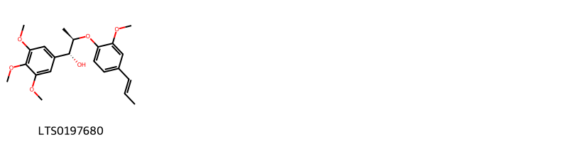{ group="compound" description="Cấu trúc hóa học của các hoạt chất thuộc nhóm ** là surinamensin [(LTS0197680)](https://lotus.naturalproducts.net/compound/lotus_id/LTS0197680)." }

                                                              
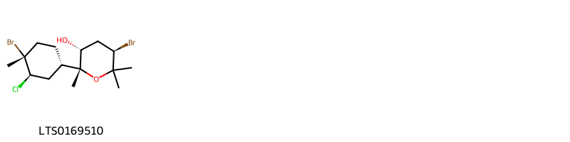{ group="compound" description="Cấu trúc hóa học của các hoạt chất thuộc nhóm *Alkyl halides* là isocaespitol [(LTS0169510)](https://lotus.naturalproducts.net/compound/lotus_id/LTS0169510)." }

                                                              
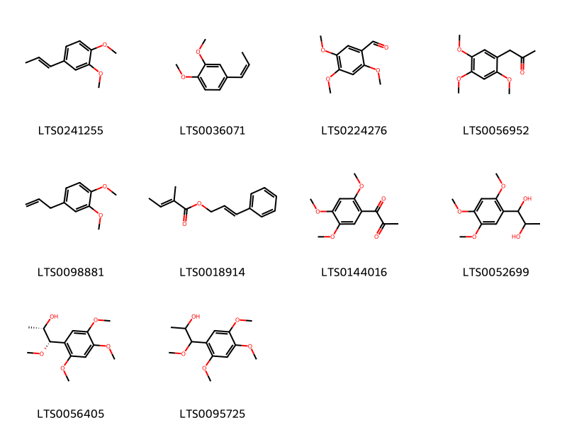{ group="compound" description="Cấu trúc hóa học của các hoạt chất thuộc nhóm *Benzene and substituted derivatives* là isoeugenyl methyl ether [(LTS0241255)](https://lotus.naturalproducts.net/compound/lotus_id/LTS0241255), (z)-methyl isoeugenol [(LTS0036071)](https://lotus.naturalproducts.net/compound/lotus_id/LTS0036071), 2,4,5-trimethoxybenzaldehyde [(LTS0224276)](https://lotus.naturalproducts.net/compound/lotus_id/LTS0224276), 1-(2,4,5-trimethoxyphenyl)propan-2-one [(LTS0056952)](https://lotus.naturalproducts.net/compound/lotus_id/LTS0056952), methyl eugenol [(LTS0098881)](https://lotus.naturalproducts.net/compound/lotus_id/LTS0098881), 3-phenylprop-2-en-1-yl (2e)-2-methylbut-2-enoate [(LTS0018914)](https://lotus.naturalproducts.net/compound/lotus_id/LTS0018914), 1-(2,4,5-trimethoxyphenyl)propane-1,2-dione [(LTS0144016)](https://lotus.naturalproducts.net/compound/lotus_id/LTS0144016), 1-(2,4,5-trimethoxyphenyl)propane-1,2-diol [(LTS0052699)](https://lotus.naturalproducts.net/compound/lotus_id/LTS0052699), (1s,2s)-1-methoxy-1-(2,4,5-trimethoxyphenyl)propan-2-ol [(LTS0056405)](https://lotus.naturalproducts.net/compound/lotus_id/LTS0056405), 1-methoxy-1-(2,4,5-trimethoxyphenyl)propan-2-ol [(LTS0095725)](https://lotus.naturalproducts.net/compound/lotus_id/LTS0095725)." }

                                                              
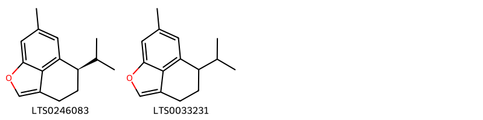{ group="compound" description="Cấu trúc hóa học của các hoạt chất thuộc nhóm *Benzofurans* là (7r)-7-isopropyl-10-methyl-2-oxatricyclo[6.3.1.0⁴,¹²]dodeca-1(11),3,8(12),9-tetraene [(LTS0246083)](https://lotus.naturalproducts.net/compound/lotus_id/LTS0246083), 7-isopropyl-10-methyl-2-oxatricyclo[6.3.1.0⁴,¹²]dodeca-1(11),3,8(12),9-tetraene [(LTS0033231)](https://lotus.naturalproducts.net/compound/lotus_id/LTS0033231)." }

                                                              
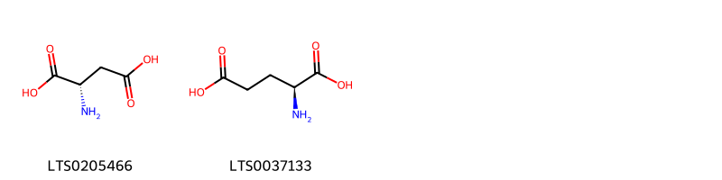{ group="compound" description="Cấu trúc hóa học của các hoạt chất thuộc nhóm *Carboxylic acids and derivatives* là l-aspartic acid [(LTS0205466)](https://lotus.naturalproducts.net/compound/lotus_id/LTS0205466), l-glutamic acid [(LTS0037133)](https://lotus.naturalproducts.net/compound/lotus_id/LTS0037133)." }

                                                              
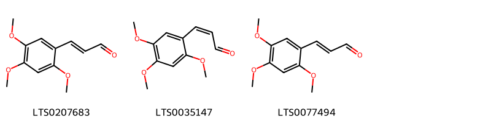{ group="compound" description="Cấu trúc hóa học của các hoạt chất thuộc nhóm *Cinnamaldehydes* là 3-(2,4,5-trimethoxyphenyl)prop-2-enal [(LTS0207683)](https://lotus.naturalproducts.net/compound/lotus_id/LTS0207683), (2z)-3-(2,4,5-trimethoxyphenyl)prop-2-enal [(LTS0035147)](https://lotus.naturalproducts.net/compound/lotus_id/LTS0035147), (2e)-3-(2,4,5-trimethoxyphenyl)prop-2-enal [(LTS0077494)](https://lotus.naturalproducts.net/compound/lotus_id/LTS0077494)." }

                                                              
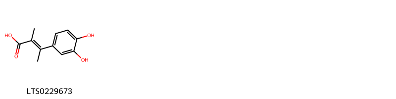{ group="compound" description="Cấu trúc hóa học của các hoạt chất thuộc nhóm *Cinnamic acids and derivatives* là (2e)-3-(3,4-dihydroxyphenyl)-2-methylbut-2-enoic acid [(LTS0229673)](https://lotus.naturalproducts.net/compound/lotus_id/LTS0229673)." }

                                                              
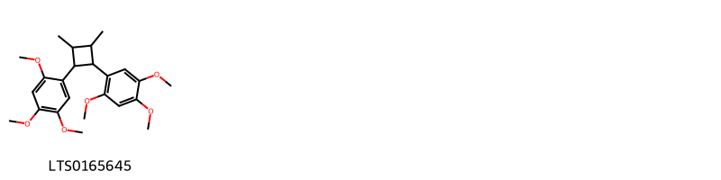{ group="compound" description="Cấu trúc hóa học của các hoạt chất thuộc nhóm *Cyclobutane lignans* là 1-[2,3-dimethyl-4-(2,4,5-trimethoxyphenyl)cyclobutyl]-2,4,5-trimethoxybenzene [(LTS0165645)](https://lotus.naturalproducts.net/compound/lotus_id/LTS0165645)." }

                                                              
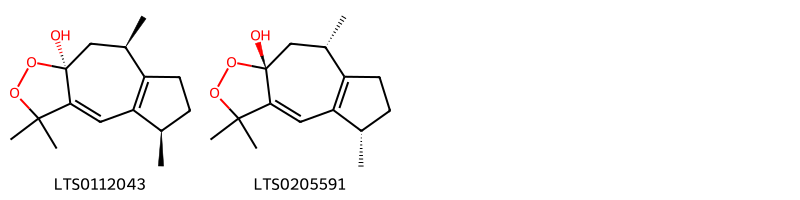{ group="compound" description="Cấu trúc hóa học của các hoạt chất thuộc nhóm *Dioxolanes* là (+)-dioxosarcoguaiacol, (rel)- [(LTS0112043)](https://lotus.naturalproducts.net/compound/lotus_id/LTS0112043), (5s,8s,9ar)-3,3,5,8-tetramethyl-5h,6h,7h,8h,9h-azuleno[6,5-c][1,2]dioxol-9a-ol [(LTS0205591)](https://lotus.naturalproducts.net/compound/lotus_id/LTS0205591)." }

                                                              
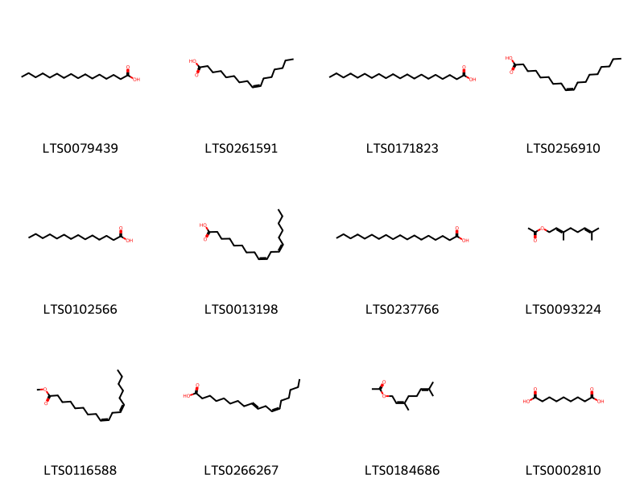{ group="compound" description="Cấu trúc hóa học của các hoạt chất thuộc nhóm *Fatty Acyls* là palmitic acid [(LTS0079439)](https://lotus.naturalproducts.net/compound/lotus_id/LTS0079439), palmitoleic acid [(LTS0261591)](https://lotus.naturalproducts.net/compound/lotus_id/LTS0261591), arachidic acid [(LTS0171823)](https://lotus.naturalproducts.net/compound/lotus_id/LTS0171823), oleic acid [(LTS0256910)](https://lotus.naturalproducts.net/compound/lotus_id/LTS0256910), myristic acid [(LTS0102566)](https://lotus.naturalproducts.net/compound/lotus_id/LTS0102566), linoleic [(LTS0013198)](https://lotus.naturalproducts.net/compound/lotus_id/LTS0013198), stearic acid [(LTS0237766)](https://lotus.naturalproducts.net/compound/lotus_id/LTS0237766), geranyl acetate [(LTS0093224)](https://lotus.naturalproducts.net/compound/lotus_id/LTS0093224), methyl linoleate [(LTS0116588)](https://lotus.naturalproducts.net/compound/lotus_id/LTS0116588), 10-trans,12-cis-linoleic acid [(LTS0266267)](https://lotus.naturalproducts.net/compound/lotus_id/LTS0266267), 3,7-dimethylocta-2,6-dien-1-yl acetate [(LTS0184686)](https://lotus.naturalproducts.net/compound/lotus_id/LTS0184686), azelaic acid [(LTS0002810)](https://lotus.naturalproducts.net/compound/lotus_id/LTS0002810)." }

                                                              
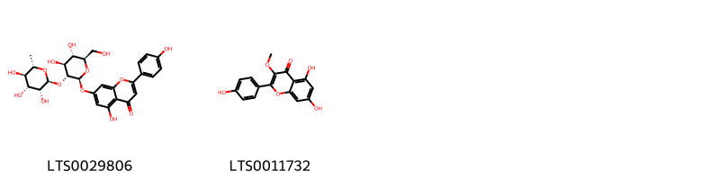{ group="compound" description="Cấu trúc hóa học của các hoạt chất thuộc nhóm *Flavonoids* là rhoifolin [(LTS0029806)](https://lotus.naturalproducts.net/compound/lotus_id/LTS0029806), isokaempferide [(LTS0011732)](https://lotus.naturalproducts.net/compound/lotus_id/LTS0011732)." }

                                                              
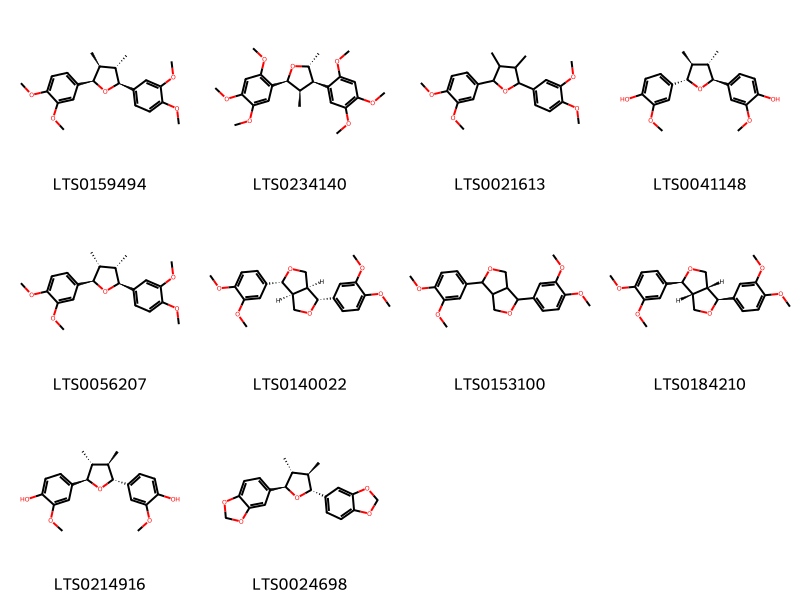{ group="compound" description="Cấu trúc hóa học của các hoạt chất thuộc nhóm *Furanoid lignans* là (+)-veraguensin [(LTS0159494)](https://lotus.naturalproducts.net/compound/lotus_id/LTS0159494), (2r,3r,4r,5s)-2,4-dimethyl-3,5-bis(2,4,5-trimethoxyphenyl)oxolane [(LTS0234140)](https://lotus.naturalproducts.net/compound/lotus_id/LTS0234140), 2,5-bis(3,4-dimethoxyphenyl)-3,4-dimethyloxolane [(LTS0021613)](https://lotus.naturalproducts.net/compound/lotus_id/LTS0021613), 4-[(2s,3s,4s,5s)-5-(4-hydroxy-3-methoxyphenyl)-3,4-dimethyloxolan-2-yl]-2-methoxyphenol [(LTS0041148)](https://lotus.naturalproducts.net/compound/lotus_id/LTS0041148), (2r,3r,4s,5s)-2,5-bis(3,4-dimethoxyphenyl)-3,4-dimethyloxolane [(LTS0056207)](https://lotus.naturalproducts.net/compound/lotus_id/LTS0056207), (1r,3as,4r,6as)-1,4-bis(3,4-dimethoxyphenyl)-hexahydrofuro[3,4-c]furan [(LTS0140022)](https://lotus.naturalproducts.net/compound/lotus_id/LTS0140022), 1,4-bis(3,4-dimethoxyphenyl)-hexahydrofuro[3,4-c]furan [(LTS0153100)](https://lotus.naturalproducts.net/compound/lotus_id/LTS0153100), eudesmin [(LTS0184210)](https://lotus.naturalproducts.net/compound/lotus_id/LTS0184210), 4-[(2r,3r,4r,5r)-5-(4-hydroxy-3-methoxyphenyl)-3,4-dimethyloxolan-2-yl]-2-methoxyphenol [(LTS0214916)](https://lotus.naturalproducts.net/compound/lotus_id/LTS0214916), (+)-galbacin [(LTS0024698)](https://lotus.naturalproducts.net/compound/lotus_id/LTS0024698)." }

                                                              
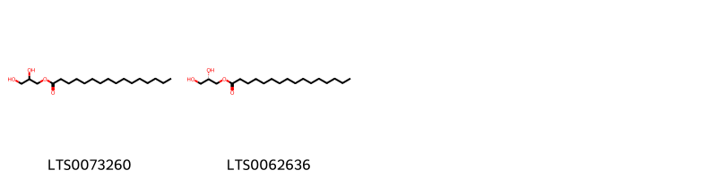{ group="compound" description="Cấu trúc hóa học của các hoạt chất thuộc nhóm *Glycerolipids* là glyceryl palmitate [(LTS0073260)](https://lotus.naturalproducts.net/compound/lotus_id/LTS0073260), 1-hexadecanoyl-sn-glycerol [(LTS0062636)](https://lotus.naturalproducts.net/compound/lotus_id/LTS0062636)." }

                                                              
{ group="compound" description="Cấu trúc hóa học của các hoạt chất thuộc nhóm *Hydroxy acids and derivatives* là (-)-malic acid [(LTS0128885)](https://lotus.naturalproducts.net/compound/lotus_id/LTS0128885), malic acid [(LTS0216520)](https://lotus.naturalproducts.net/compound/lotus_id/LTS0216520)." }

                                                              
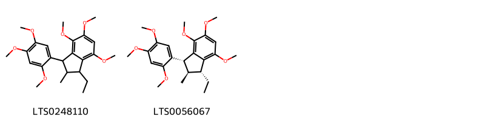{ group="compound" description="Cấu trúc hóa học của các hoạt chất thuộc nhóm *Indanes* là 1-ethyl-4,5,7-trimethoxy-2-methyl-3-(2,4,5-trimethoxyphenyl)-2,3-dihydro-1h-indene [(LTS0248110)](https://lotus.naturalproducts.net/compound/lotus_id/LTS0248110), (1r,2r,3r)-1-ethyl-4,5,7-trimethoxy-2-methyl-3-(2,4,5-trimethoxyphenyl)-2,3-dihydro-1h-indene [(LTS0056067)](https://lotus.naturalproducts.net/compound/lotus_id/LTS0056067)." }

                                                              
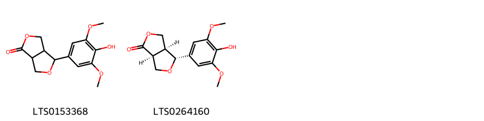{ group="compound" description="Cấu trúc hóa học của các hoạt chất thuộc nhóm *Lignan lactones* là 4-(4-hydroxy-3,5-dimethoxyphenyl)-tetrahydro-3h-furo[3,4-c]furan-1-one [(LTS0153368)](https://lotus.naturalproducts.net/compound/lotus_id/LTS0153368), (3as,4r,6as)-4-(4-hydroxy-3,5-dimethoxyphenyl)-tetrahydro-3h-furo[3,4-c]furan-1-one [(LTS0264160)](https://lotus.naturalproducts.net/compound/lotus_id/LTS0264160)." }

                                                              
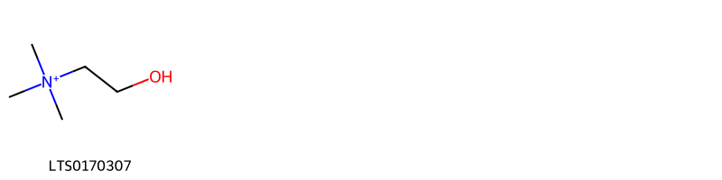{ group="compound" description="Cấu trúc hóa học của các hoạt chất thuộc nhóm *Organonitrogen compounds* là choline [(LTS0170307)](https://lotus.naturalproducts.net/compound/lotus_id/LTS0170307)." }

                                                              
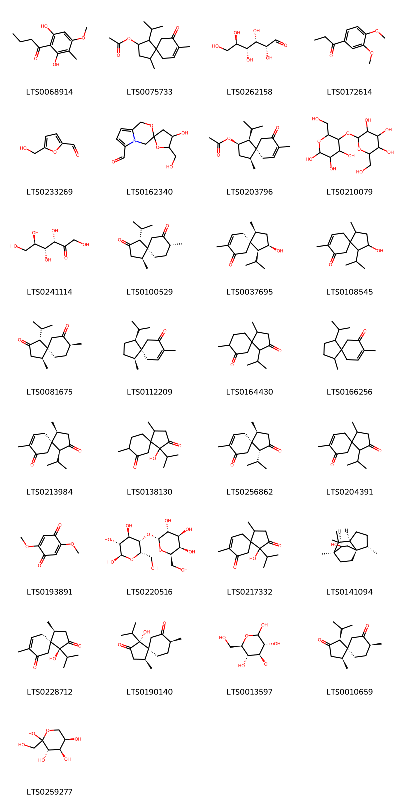{ group="compound" description="Cấu trúc hóa học của các hoạt chất thuộc nhóm *Organooxygen compounds* là aspidinol [(LTS0068914)](https://lotus.naturalproducts.net/compound/lotus_id/LTS0068914), 1-isopropyl-4,8-dimethyl-9-oxospiro[4.5]dec-7-en-2-yl acetate [(LTS0075733)](https://lotus.naturalproducts.net/compound/lotus_id/LTS0075733), (+)-glucose [(LTS0262158)](https://lotus.naturalproducts.net/compound/lotus_id/LTS0262158), 1-(3,4-dimethoxyphenyl)propan-1-one [(LTS0172614)](https://lotus.naturalproducts.net/compound/lotus_id/LTS0172614), hydroxymethylfurfural [(LTS0233269)](https://lotus.naturalproducts.net/compound/lotus_id/LTS0233269), 4-hydroxy-5-(hydroxymethyl)-1',4'-dihydrospiro[oxolane-2,3'-pyrrolo[2,1-c][1,4]oxazine]-6'-carbaldehyde [(LTS0162340)](https://lotus.naturalproducts.net/compound/lotus_id/LTS0162340), (1s,2r,4s,5s)-1-isopropyl-4,8-dimethyl-9-oxospiro[4.5]dec-7-en-2-yl acetate [(LTS0203796)](https://lotus.naturalproducts.net/compound/lotus_id/LTS0203796), starch [(LTS0210079)](https://lotus.naturalproducts.net/compound/lotus_id/LTS0210079), keto-d-fructose [(LTS0241114)](https://lotus.naturalproducts.net/compound/lotus_id/LTS0241114), (1r,4s,5s,8r)-1-isopropyl-4,8-dimethylspiro[4.5]decane-2,7-dione [(LTS0100529)](https://lotus.naturalproducts.net/compound/lotus_id/LTS0100529), (1s,2r,4s,5s)-2-hydroxy-1-isopropyl-4,8-dimethylspiro[4.5]dec-8-en-7-one [(LTS0037695)](https://lotus.naturalproducts.net/compound/lotus_id/LTS0037695), 2-hydroxy-1-isopropyl-4,8-dimethylspiro[4.5]dec-8-en-7-one [(LTS0108545)](https://lotus.naturalproducts.net/compound/lotus_id/LTS0108545), (1r,4s,5s,8s)-1-isopropyl-4,8-dimethylspiro[4.5]decane-2,7-dione [(LTS0081675)](https://lotus.naturalproducts.net/compound/lotus_id/LTS0081675), (-)-acorenone [(LTS0112209)](https://lotus.naturalproducts.net/compound/lotus_id/LTS0112209), 1-isopropyl-4,8-dimethylspiro[4.5]decane-2,7-dione [(LTS0164430)](https://lotus.naturalproducts.net/compound/lotus_id/LTS0164430), 1-isopropyl-4,8-dimethylspiro[4.5]dec-8-en-7-one [(LTS0166256)](https://lotus.naturalproducts.net/compound/lotus_id/LTS0166256), (1s,4s,5s)-1-isopropyl-4,8-dimethylspiro[4.5]dec-8-ene-2,7-dione [(LTS0213984)](https://lotus.naturalproducts.net/compound/lotus_id/LTS0213984), 1-hydroxy-1-isopropyl-4,8-dimethylspiro[4.5]decane-2,7-dione [(LTS0138130)](https://lotus.naturalproducts.net/compound/lotus_id/LTS0138130), (1r,4s,5s)-1-isopropyl-4,8-dimethylspiro[4.5]dec-8-ene-2,7-dione [(LTS0256862)](https://lotus.naturalproducts.net/compound/lotus_id/LTS0256862), 1-isopropyl-4,8-dimethylspiro[4.5]dec-8-ene-2,7-dione [(LTS0204391)](https://lotus.naturalproducts.net/compound/lotus_id/LTS0204391), 2,5-dimethoxy-4-benzoquinone [(LTS0193891)](https://lotus.naturalproducts.net/compound/lotus_id/LTS0193891), (2r,3r,4r,5s,6s)-6-(hydroxymethyl)-5-{[(2r,3r,4s,5r,6r)-3,4,5-trihydroxy-6-(hydroxymethyl)oxan-2-yl]oxy}oxane-2,3,4-triol [(LTS0220516)](https://lotus.naturalproducts.net/compound/lotus_id/LTS0220516), 1-hydroxy-1-isopropyl-4,8-dimethylspiro[4.5]dec-8-ene-2,7-dione [(LTS0217332)](https://lotus.naturalproducts.net/compound/lotus_id/LTS0217332), (1s,2s,5s,7s,8s)-2,6,6,7-tetramethyltricyclo[5.2.2.0¹,⁵]undecan-8-ol [(LTS0141094)](https://lotus.naturalproducts.net/compound/lotus_id/LTS0141094), (1s,4s,5s)-1-hydroxy-1-isopropyl-4,8-dimethylspiro[4.5]dec-8-ene-2,7-dione [(LTS0228712)](https://lotus.naturalproducts.net/compound/lotus_id/LTS0228712), (1r,4s,5s,8s)-1-hydroxy-1-isopropyl-4,8-dimethylspiro[4.5]decane-2,7-dione [(LTS0190140)](https://lotus.naturalproducts.net/compound/lotus_id/LTS0190140), glucose [(LTS0013597)](https://lotus.naturalproducts.net/compound/lotus_id/LTS0013597), (1s,4s,5s,8s)-1-isopropyl-4,8-dimethylspiro[4.5]decane-2,7-dione [(LTS0010659)](https://lotus.naturalproducts.net/compound/lotus_id/LTS0010659), d-fructopyranose [(LTS0259277)](https://lotus.naturalproducts.net/compound/lotus_id/LTS0259277)." }

                                                              
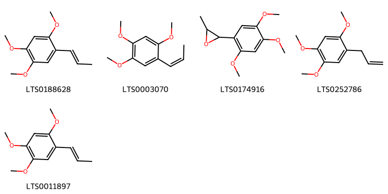{ group="compound" description="Cấu trúc hóa học của các hoạt chất thuộc nhóm *Phenol ethers* là cis-asarone [(LTS0188628)](https://lotus.naturalproducts.net/compound/lotus_id/LTS0188628), β-asarone [(LTS0003070)](https://lotus.naturalproducts.net/compound/lotus_id/LTS0003070), 2-methyl-3-(2,4,5-trimethoxyphenyl)oxirane [(LTS0174916)](https://lotus.naturalproducts.net/compound/lotus_id/LTS0174916), 1,2,4-trimethoxy-5-(prop-2-en-1-yl)benzene [(LTS0252786)](https://lotus.naturalproducts.net/compound/lotus_id/LTS0252786), 1,2,4-trimethoxy-5-(prop-1-en-1-yl)benzene [(LTS0011897)](https://lotus.naturalproducts.net/compound/lotus_id/LTS0011897)." }

                                                              
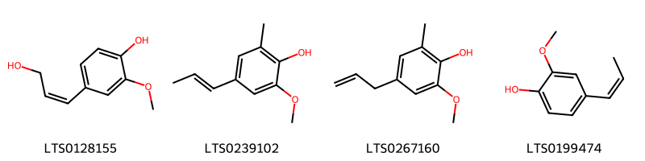{ group="compound" description="Cấu trúc hóa học của các hoạt chất thuộc nhóm *Phenols* là 4-[(1z)-3-hydroxyprop-1-en-1-yl]-2-methoxyphenol [(LTS0128155)](https://lotus.naturalproducts.net/compound/lotus_id/LTS0128155), 6-methylisoeugenol [(LTS0239102)](https://lotus.naturalproducts.net/compound/lotus_id/LTS0239102), 6-methyleugenol [(LTS0267160)](https://lotus.naturalproducts.net/compound/lotus_id/LTS0267160), cis-isoeugenol [(LTS0199474)](https://lotus.naturalproducts.net/compound/lotus_id/LTS0199474)." }

                                                              
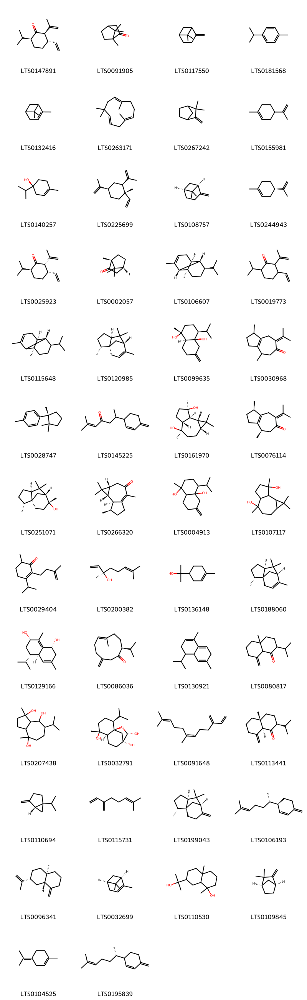{ group="compound" description="Cấu trúc hóa học của các hoạt chất thuộc nhóm *Prenol lipids* là (2r,3s,6s)-3-ethenyl-6-isopropyl-2-(prop-1-en-2-yl)cyclohexan-1-one [(LTS0147891)](https://lotus.naturalproducts.net/compound/lotus_id/LTS0147891), camphor [(LTS0091905)](https://lotus.naturalproducts.net/compound/lotus_id/LTS0091905), β-pinene [(LTS0117550)](https://lotus.naturalproducts.net/compound/lotus_id/LTS0117550), cymene [(LTS0181568)](https://lotus.naturalproducts.net/compound/lotus_id/LTS0181568), α pinene [(LTS0132416)](https://lotus.naturalproducts.net/compound/lotus_id/LTS0132416), humulene [(LTS0263171)](https://lotus.naturalproducts.net/compound/lotus_id/LTS0263171), camphene [(LTS0267242)](https://lotus.naturalproducts.net/compound/lotus_id/LTS0267242), limonene,  [(LTS0155981)](https://lotus.naturalproducts.net/compound/lotus_id/LTS0155981), (+)-4-terpineol [(LTS0140257)](https://lotus.naturalproducts.net/compound/lotus_id/LTS0140257), β-elemene [(LTS0225699)](https://lotus.naturalproducts.net/compound/lotus_id/LTS0225699), (-)-β-pinene [(LTS0108757)](https://lotus.naturalproducts.net/compound/lotus_id/LTS0108757), α-limonene [(LTS0244943)](https://lotus.naturalproducts.net/compound/lotus_id/LTS0244943), (2s,3s,6s)-3-ethenyl-6-isopropyl-2-(prop-1-en-2-yl)cyclohexan-1-one [(LTS0025923)](https://lotus.naturalproducts.net/compound/lotus_id/LTS0025923), d-camphor [(LTS0002057)](https://lotus.naturalproducts.net/compound/lotus_id/LTS0002057), (1r,2s,6s,7s,8r)-8-isopropyl-1,3-dimethyltricyclo[4.4.0.0²,⁷]dec-3-ene [(LTS0106607)](https://lotus.naturalproducts.net/compound/lotus_id/LTS0106607), 3-ethenyl-6-isopropyl-2-(prop-1-en-2-yl)cyclohexan-1-one [(LTS0019773)](https://lotus.naturalproducts.net/compound/lotus_id/LTS0019773), (1r,6s,7s)-8-isopropyl-1,3-dimethyltricyclo[4.4.0.0²,⁷]dec-3-ene [(LTS0115648)](https://lotus.naturalproducts.net/compound/lotus_id/LTS0115648), cedrene [(LTS0120985)](https://lotus.naturalproducts.net/compound/lotus_id/LTS0120985), (1r,4s,4ar,8as)-4-isopropyl-1-methyl-6-methylidene-hexahydro-2h-naphthalene-1,4a-diol [(LTS0099635)](https://lotus.naturalproducts.net/compound/lotus_id/LTS0099635), 1,4-dimethyl-7-(propan-2-ylidene)-1,2,3,4,5,8-hexahydroazulen-6-one [(LTS0030968)](https://lotus.naturalproducts.net/compound/lotus_id/LTS0030968), cuparene [(LTS0028747)](https://lotus.naturalproducts.net/compound/lotus_id/LTS0028747), 2-methyl-6-(4-methylidenecyclohex-2-en-1-yl)hept-2-en-4-one [(LTS0145225)](https://lotus.naturalproducts.net/compound/lotus_id/LTS0145225), (1ar,4r,4ar,7r,7as,7br)-1,1,4,7-tetramethyl-octahydrocyclopropa[e]azulene-4,7-diol [(LTS0161970)](https://lotus.naturalproducts.net/compound/lotus_id/LTS0161970), (1r,4r)-1,4-dimethyl-7-(propan-2-ylidene)-1,2,3,4,5,8-hexahydroazulen-6-one [(LTS0076114)](https://lotus.naturalproducts.net/compound/lotus_id/LTS0076114), cedrol [(LTS0251071)](https://lotus.naturalproducts.net/compound/lotus_id/LTS0251071), (1ar,7r,7as,7br)-1,1,4,7-tetramethyl-1ah,2h,5h,6h,7h,7ah,7bh-cyclopropa[e]azulen-3-one [(LTS0266320)](https://lotus.naturalproducts.net/compound/lotus_id/LTS0266320), 4-isopropyl-1-methyl-6-methylidene-hexahydro-2h-naphthalene-1,4a-diol [(LTS0004913)](https://lotus.naturalproducts.net/compound/lotus_id/LTS0004913), 1,1,4,7-tetramethyl-octahydrocyclopropa[e]azulene-4,7-diol [(LTS0107117)](https://lotus.naturalproducts.net/compound/lotus_id/LTS0107117), 3-isopropyl-6-methyl-2-(3-methylbut-3-en-1-yl)cyclohex-2-en-1-one [(LTS0029404)](https://lotus.naturalproducts.net/compound/lotus_id/LTS0029404), (-)-linalool [(LTS0200382)](https://lotus.naturalproducts.net/compound/lotus_id/LTS0200382), terpineol [(LTS0136148)](https://lotus.naturalproducts.net/compound/lotus_id/LTS0136148), (1r,2r,5s,7r)-2,6,6,8-tetramethyltricyclo[5.3.1.0¹,⁵]undec-8-ene [(LTS0188060)](https://lotus.naturalproducts.net/compound/lotus_id/LTS0188060), (1r,4ar,5s,7s)-5-isopropyl-3,8-dimethyl-1,2,4a,5,6,7-hexahydronaphthalene-1,7-diol [(LTS0129166)](https://lotus.naturalproducts.net/compound/lotus_id/LTS0129166), (+)-preisocalamenediol [(LTS0086036)](https://lotus.naturalproducts.net/compound/lotus_id/LTS0086036), 4-isopropyl-1,6-dimethyl-3,4,4a,7-tetrahydronaphthalene [(LTS0130921)](https://lotus.naturalproducts.net/compound/lotus_id/LTS0130921), 2-isopropyl-4a-methyl-8-methylidene-hexahydro-2h-naphthalen-1-one [(LTS0080817)](https://lotus.naturalproducts.net/compound/lotus_id/LTS0080817), 7-isopropyl-1,4-dimethyl-octahydroazulene-1,4,8-triol [(LTS0207438)](https://lotus.naturalproducts.net/compound/lotus_id/LTS0207438), (1r,2s,5r,6s,9r,10s)-2-isopropyl-5-methyl-11-oxatricyclo[7.2.1.0¹,⁶]dodecane-5,9,10-triol [(LTS0032791)](https://lotus.naturalproducts.net/compound/lotus_id/LTS0032791), β-farnesene [(LTS0091648)](https://lotus.naturalproducts.net/compound/lotus_id/LTS0091648), acolamone [(LTS0113441)](https://lotus.naturalproducts.net/compound/lotus_id/LTS0113441), (+)-sabinene [(LTS0110694)](https://lotus.naturalproducts.net/compound/lotus_id/LTS0110694), α-myrcene [(LTS0115731)](https://lotus.naturalproducts.net/compound/lotus_id/LTS0115731), (1r,2r,5s,7r)-2,6,6-trimethyl-8-methylidenetricyclo[5.3.1.0¹,⁵]undecane [(LTS0199043)](https://lotus.naturalproducts.net/compound/lotus_id/LTS0199043), β-sesquiphellandrene [(LTS0106193)](https://lotus.naturalproducts.net/compound/lotus_id/LTS0106193), β-selinene [(LTS0096341)](https://lotus.naturalproducts.net/compound/lotus_id/LTS0096341), (-)-α-pinene [(LTS0032699)](https://lotus.naturalproducts.net/compound/lotus_id/LTS0032699), 7-(2-hydroxypropan-2-yl)-1,4a-dimethyl-octahydronaphthalen-1-ol [(LTS0110530)](https://lotus.naturalproducts.net/compound/lotus_id/LTS0110530), (+)-camphene [(LTS0109845)](https://lotus.naturalproducts.net/compound/lotus_id/LTS0109845), terpinolene [(LTS0104525)](https://lotus.naturalproducts.net/compound/lotus_id/LTS0104525), 3-[(2s)-6-methylhept-5-en-2-yl]-6-methylidenecyclohex-1-ene [(LTS0195839)](https://lotus.naturalproducts.net/compound/lotus_id/LTS0195839), (2r,4ar,8as)-2-isopropyl-4a-methyl-8-methylidene-hexahydro-2h-naphthalen-1-one [(LTS0143966)](https://lotus.naturalproducts.net/compound/lotus_id/LTS0143966), (1as,4ar,7s,7ar,7bs)-1,1,4,7-tetramethyl-1ah,2h,4ah,5h,6h,7h,7ah,7bh-cyclopropa[e]azulene [(LTS0192172)](https://lotus.naturalproducts.net/compound/lotus_id/LTS0192172), (2r,4ar,8ar)-2-isopropyl-4a,8-dimethyl-2,3,4,5,6,8a-hexahydronaphthalen-1-one [(LTS0139814)](https://lotus.naturalproducts.net/compound/lotus_id/LTS0139814), proximadiol [(LTS0133156)](https://lotus.naturalproducts.net/compound/lotus_id/LTS0133156), 4-isopropyl-1,6-dimethyl-2,3,4,4a,7,8-hexahydronaphthalene [(LTS0270743)](https://lotus.naturalproducts.net/compound/lotus_id/LTS0270743), (3r,6e)-nerolidol [(LTS0145065)](https://lotus.naturalproducts.net/compound/lotus_id/LTS0145065), (1s,4s,4as,6r,8ar)-4-isopropyl-1,6-dimethyl-octahydronaphthalene-1,6-diol [(LTS0146428)](https://lotus.naturalproducts.net/compound/lotus_id/LTS0146428), 4-isopropyl-1,6-dimethyl-3,4,4a,7,8,8a-hexahydronaphthalene [(LTS0154650)](https://lotus.naturalproducts.net/compound/lotus_id/LTS0154650), 3-ethenyl-6-isopropyl-3-methyl-2-(prop-1-en-2-yl)cyclohexan-1-one [(LTS0138920)](https://lotus.naturalproducts.net/compound/lotus_id/LTS0138920), 5-hydroxy-2-isopropyl-4a,8-dimethyl-2,3,4,5,6,7-hexahydronaphthalen-1-one [(LTS0153030)](https://lotus.naturalproducts.net/compound/lotus_id/LTS0153030), (1s,3ar,4r,7s,8r,8ar)-4-ethoxy-7-isopropyl-1,4-dimethyl-octahydroazulene-1,8-diol [(LTS0083570)](https://lotus.naturalproducts.net/compound/lotus_id/LTS0083570), 1-(4-hydroxy-7-isopropyl-4-methyl-octahydroinden-1-yl)ethanone [(LTS0119894)](https://lotus.naturalproducts.net/compound/lotus_id/LTS0119894), (4s,4as)-4-isopropyl-1,6-dimethyl-3,4,4a,7-tetrahydronaphthalene [(LTS0098195)](https://lotus.naturalproducts.net/compound/lotus_id/LTS0098195), (1r,4s,4as,6r,8ar)-4-isopropyl-1,6-dimethyl-hexahydro-2h-naphthalene-1,4a,6-triol [(LTS0104888)](https://lotus.naturalproducts.net/compound/lotus_id/LTS0104888), (2r,4ar,5r,8as)-4a-hydroxy-2,5-dimethyl-8-(propan-2-ylidene)-hexahydronaphthalene-1,7-dione [(LTS0234455)](https://lotus.naturalproducts.net/compound/lotus_id/LTS0234455), (+)-gamma-cadinene [(LTS0103949)](https://lotus.naturalproducts.net/compound/lotus_id/LTS0103949), (1r,2r,5r)-2-methyl-5-(prop-1-en-2-yl)cyclohexyl acetate [(LTS0174962)](https://lotus.naturalproducts.net/compound/lotus_id/LTS0174962), (1r,4r,4as,6r,8as)-4-isopropyl-1,6-dimethyl-hexahydro-2h-naphthalene-1,6,8a-triol [(LTS0117149)](https://lotus.naturalproducts.net/compound/lotus_id/LTS0117149), (-)-α-curcumene [(LTS0216936)](https://lotus.naturalproducts.net/compound/lotus_id/LTS0216936), (-)-isoshyobunone [(LTS0268112)](https://lotus.naturalproducts.net/compound/lotus_id/LTS0268112), 10-isopropyl-3,7-dimethylcyclodeca-2,6-dien-1-one [(LTS0196979)](https://lotus.naturalproducts.net/compound/lotus_id/LTS0196979), (1s,3ar,7s,8r,8ar)-7-isopropyl-1-methyl-4-methylidene-octahydroazulene-1,8-diol [(LTS0194689)](https://lotus.naturalproducts.net/compound/lotus_id/LTS0194689), β-farnesene [(LTS0067925)](https://lotus.naturalproducts.net/compound/lotus_id/LTS0067925), (1s,4s,4as,8ar)-4-isopropyl-1,6-dimethyl-3,4,4a,7,8,8a-hexahydro-2h-naphthalen-1-ol [(LTS0234538)](https://lotus.naturalproducts.net/compound/lotus_id/LTS0234538), (1s,3ar,7s,8r,8ar)-7-isopropyl-1,4-dimethyl-3,3a,6,7,8,8a-hexahydro-2h-azulene-1,8-diol [(LTS0260746)](https://lotus.naturalproducts.net/compound/lotus_id/LTS0260746), β-caryophyllene oxide [(LTS0213960)](https://lotus.naturalproducts.net/compound/lotus_id/LTS0213960), 1,4-dimethyl-7-(propan-2-ylidene)-2,3,3a,4,5,8-hexahydroazulen-6-one [(LTS0226581)](https://lotus.naturalproducts.net/compound/lotus_id/LTS0226581), (1s,3ar,4r,7s,8r,8ar)-7-isopropyl-1,4-dimethyl-octahydroazulene-1,4,8-triol [(LTS0207765)](https://lotus.naturalproducts.net/compound/lotus_id/LTS0207765), (1ar,7r,7ar,7bs)-1,1,7,7a-tetramethyl-1ah,2h,3h,5h,6h,7h,7bh-cyclopropa[a]naphthalene [(LTS0234436)](https://lotus.naturalproducts.net/compound/lotus_id/LTS0234436), 7-isopropyl-1-methyl-4-methylidene-octahydroazulene-1,8-diol [(LTS0046165)](https://lotus.naturalproducts.net/compound/lotus_id/LTS0046165), α-thujene [(LTS0185078)](https://lotus.naturalproducts.net/compound/lotus_id/LTS0185078), (1s,4s,4ar,8as)-4-isopropyl-1-methyl-6-methylidene-hexahydro-2h-naphthalene-1,4a-diol [(LTS0038890)](https://lotus.naturalproducts.net/compound/lotus_id/LTS0038890), (1r,4s,4ar)-4-isopropyl-1-methyl-6-methylidene-hexahydro-2h-naphthalene-1,4a-diol [(LTS0037664)](https://lotus.naturalproducts.net/compound/lotus_id/LTS0037664), (2e,6e,10r)-10-isopropyl-3,7-dimethylcyclodeca-2,6-dien-1-one [(LTS0236380)](https://lotus.naturalproducts.net/compound/lotus_id/LTS0236380), (4z)-5,9-dimethyl-2-(prop-1-en-2-yl)deca-4,8-dien-1-ol [(LTS0063111)](https://lotus.naturalproducts.net/compound/lotus_id/LTS0063111), (-)-germacrene a [(LTS0022487)](https://lotus.naturalproducts.net/compound/lotus_id/LTS0022487), 2-isopropyl-4a,8-dimethyl-2,3,4,5,6,8a-hexahydronaphthalen-1-one [(LTS0173913)](https://lotus.naturalproducts.net/compound/lotus_id/LTS0173913), β-ocimene [(LTS0242381)](https://lotus.naturalproducts.net/compound/lotus_id/LTS0242381), (2r,3s,6s)-3-ethenyl-6-isopropyl-3-methyl-2-(prop-1-en-2-yl)cyclohexan-1-one [(LTS0156272)](https://lotus.naturalproducts.net/compound/lotus_id/LTS0156272), 7-isopropyl-1,4-dimethyl-3,3a,6,7,8,8a-hexahydro-2h-azulene-1,8-diol [(LTS0254923)](https://lotus.naturalproducts.net/compound/lotus_id/LTS0254923), (1ar,4s,4ar,7r,7ar,7bs)-1,1,4,7-tetramethyl-decahydrocyclopropa[e]azulene [(LTS0244850)](https://lotus.naturalproducts.net/compound/lotus_id/LTS0244850), 3-ethenyl-6-isopropyl-3-methyl-2-(propan-2-ylidene)cyclohexan-1-one [(LTS0251606)](https://lotus.naturalproducts.net/compound/lotus_id/LTS0251606), (+)-α-terpineol [(LTS0258249)](https://lotus.naturalproducts.net/compound/lotus_id/LTS0258249), 5,7-dihydroxy-2-isopropyl-4a,8-dimethyl-2,3,4,5,6,7-hexahydronaphthalen-1-one [(LTS0007192)](https://lotus.naturalproducts.net/compound/lotus_id/LTS0007192), (+)-β-cedrene [(LTS0009064)](https://lotus.naturalproducts.net/compound/lotus_id/LTS0009064), (1s,1as,1bs,5r,5ar,6ar)-1-isopropyl-5a-methyl-2-methylidene-octahydrocyclopropa[a]inden-5-ol [(LTS0013574)](https://lotus.naturalproducts.net/compound/lotus_id/LTS0013574), 2-isopropyl-5-methyl-11-oxatricyclo[7.2.1.0¹,⁶]dodecane-5,9,10-triol [(LTS0134442)](https://lotus.naturalproducts.net/compound/lotus_id/LTS0134442), (4s,4as,8as)-4-isopropyl-1,6-dimethyl-3,4,4a,7,8,8a-hexahydronaphthalene [(LTS0014980)](https://lotus.naturalproducts.net/compound/lotus_id/LTS0014980), (3ar,4s)-1,4-dimethyl-7-(propan-2-ylidene)-2,3,3a,4,5,8-hexahydroazulen-6-one [(LTS0052280)](https://lotus.naturalproducts.net/compound/lotus_id/LTS0052280), dihydrocarvyl acetate [(LTS0126582)](https://lotus.naturalproducts.net/compound/lotus_id/LTS0126582), (1ar,7r,7ar,7bs)-1,1,7,7a-tetramethyl-1ah,2h,4h,5h,6h,7h,7bh-cyclopropa[a]naphthalene [(LTS0261904)](https://lotus.naturalproducts.net/compound/lotus_id/LTS0261904), cedrene [(LTS0023956)](https://lotus.naturalproducts.net/compound/lotus_id/LTS0023956), bicyclogermacrene [(LTS0099340)](https://lotus.naturalproducts.net/compound/lotus_id/LTS0099340), (2s,4ar,5r)-5-hydroxy-2-isopropyl-4a,8-dimethyl-2,3,4,5,6,7-hexahydronaphthalen-1-one [(LTS0025879)](https://lotus.naturalproducts.net/compound/lotus_id/LTS0025879), delta-cadinene [(LTS0019321)](https://lotus.naturalproducts.net/compound/lotus_id/LTS0019321), (1r,4s,4as,8ar)-4-isopropyl-1,6-dimethyl-3,4,4a,7,8,8a-hexahydro-2h-naphthalen-1-ol [(LTS0087313)](https://lotus.naturalproducts.net/compound/lotus_id/LTS0087313), α-selinene [(LTS0024564)](https://lotus.naturalproducts.net/compound/lotus_id/LTS0024564), (2r,3r,6s)-3-ethenyl-6-isopropyl-3-methyl-2-(prop-1-en-2-yl)cyclohexan-1-one [(LTS0231932)](https://lotus.naturalproducts.net/compound/lotus_id/LTS0231932), (+)-shyobunone [(LTS0097992)](https://lotus.naturalproducts.net/compound/lotus_id/LTS0097992), (-)-β-curcumene [(LTS0027873)](https://lotus.naturalproducts.net/compound/lotus_id/LTS0027873), (2s,4ar,5r,7r)-5,7-dihydroxy-2-isopropyl-4a,8-dimethyl-2,3,4,5,6,7-hexahydronaphthalen-1-one [(LTS0028210)](https://lotus.naturalproducts.net/compound/lotus_id/LTS0028210), (1s,1as,1bs,5r,5ar)-1-isopropyl-5a-methyl-2-methylidene-octahydrocyclopropa[a]inden-5-ol [(LTS0091451)](https://lotus.naturalproducts.net/compound/lotus_id/LTS0091451), (z)-β-farnesene [(LTS0254048)](https://lotus.naturalproducts.net/compound/lotus_id/LTS0254048), (+)-α-thujene [(LTS0272912)](https://lotus.naturalproducts.net/compound/lotus_id/LTS0272912), (4s,4ar)-4-isopropyl-1,6-dimethyl-3,4,4a,7-tetrahydronaphthalene [(LTS0116393)](https://lotus.naturalproducts.net/compound/lotus_id/LTS0116393), 2-isopropyl-5-methyl-9-methylidenecyclodec-5-en-1-one [(LTS0257046)](https://lotus.naturalproducts.net/compound/lotus_id/LTS0257046)." }

                                                              
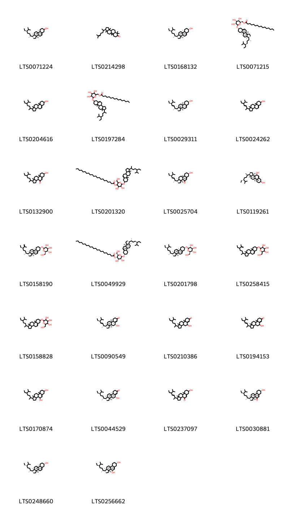{ group="compound" description="Cấu trúc hóa học của các hoạt chất thuộc nhóm *Steroids and steroid derivatives* là stigmast-5-en-3-ol [(LTS0071224)](https://lotus.naturalproducts.net/compound/lotus_id/LTS0071224), 7,7,12,16-tetramethyl-15-(6-methylhept-5-en-2-yl)pentacyclo[9.7.0.0¹,³.0³,⁸.0¹²,¹⁶]octadecan-6-one [(LTS0214298)](https://lotus.naturalproducts.net/compound/lotus_id/LTS0214298), sitosterol [(LTS0168132)](https://lotus.naturalproducts.net/compound/lotus_id/LTS0168132), sitoindoside i [(LTS0071215)](https://lotus.naturalproducts.net/compound/lotus_id/LTS0071215), stigmast-5-en-3-ol, (3β)- [(LTS0204616)](https://lotus.naturalproducts.net/compound/lotus_id/LTS0204616), (6-{[1-(5-ethyl-6-methylheptan-2-yl)-9a,11a-dimethyl-1h,2h,3h,3ah,3bh,4h,6h,7h,8h,9h,9bh,10h,11h-cyclopenta[a]phenanthren-7-yl]oxy}-3,4,5-trihydroxyoxan-2-yl)methyl hexadecanoate [(LTS0197284)](https://lotus.naturalproducts.net/compound/lotus_id/LTS0197284), phytosterol [(LTS0029311)](https://lotus.naturalproducts.net/compound/lotus_id/LTS0029311), stigmasterol [(LTS0024262)](https://lotus.naturalproducts.net/compound/lotus_id/LTS0024262), 1-(5-ethyl-6-methylheptan-2-yl)-7-hydroxy-9a,11a-dimethyl-1h,2h,3h,3ah,3bh,6h,7h,8h,9h,9bh,10h,11h-cyclopenta[a]phenanthren-4-one [(LTS0132900)](https://lotus.naturalproducts.net/compound/lotus_id/LTS0132900), 6-{[1-(5-ethyl-6-methylheptan-2-yl)-9a,11a-dimethyl-1h,2h,3h,3ah,3bh,4h,6h,7h,8h,9h,9bh,10h,11h-cyclopenta[a]phenanthren-7-yl]oxy}-4,5-dihydroxy-2-(hydroxymethyl)oxan-3-yl docosanoate [(LTS0201320)](https://lotus.naturalproducts.net/compound/lotus_id/LTS0201320), (1r,3as,3bs,7s,9ar,9bs,11ar)-1-[(2r,3e,5s)-5-ethyl-6-methylhept-3-en-2-yl]-7-hydroxy-9a,11a-dimethyl-1h,2h,3h,3ah,3bh,6h,7h,8h,9h,9bh,10h,11h-cyclopenta[a]phenanthren-4-one [(LTS0025704)](https://lotus.naturalproducts.net/compound/lotus_id/LTS0025704), 7β-hydroxysitosterol [(LTS0119261)](https://lotus.naturalproducts.net/compound/lotus_id/LTS0119261), (2r,3r,4s,5s,6r)-2-{[(1r,3as,3bs,7s,9ar,9bs,11ar)-1-[(2r,5r)-5-ethyl-6-methylhept-6-en-2-yl]-9a,11a-dimethyl-1h,2h,3h,3ah,3bh,4h,6h,7h,8h,9h,9bh,10h,11h-cyclopenta[a]phenanthren-7-yl]oxy}-6-(hydroxymethyl)oxane-3,4,5-triol [(LTS0158190)](https://lotus.naturalproducts.net/compound/lotus_id/LTS0158190), (2r,3s,4r,5r,6r)-6-{[(1r,3as,3bs,7s,9ar,9bs,11ar)-1-[(2r,5r)-5-ethyl-6-methylheptan-2-yl]-9a,11a-dimethyl-1h,2h,3h,3ah,3bh,4h,6h,7h,8h,9h,9bh,10h,11h-cyclopenta[a]phenanthren-7-yl]oxy}-4,5-dihydroxy-2-(hydroxymethyl)oxan-3-yl docosanoate [(LTS0049929)](https://lotus.naturalproducts.net/compound/lotus_id/LTS0049929), sitogluside [(LTS0201798)](https://lotus.naturalproducts.net/compound/lotus_id/LTS0201798), 2-{[1-(5-ethyl-6-methylhept-6-en-2-yl)-9a,11a-dimethyl-1h,2h,3h,3ah,3bh,4h,6h,7h,8h,9h,9bh,10h,11h-cyclopenta[a]phenanthren-7-yl]oxy}-6-(hydroxymethyl)oxane-3,4,5-triol [(LTS0258415)](https://lotus.naturalproducts.net/compound/lotus_id/LTS0258415), 2-{[1-(5-ethyl-6-methylheptan-2-yl)-9a,11a-dimethyl-1h,2h,3h,3ah,3bh,4h,6h,7h,8h,9h,9bh,10h,11h-cyclopenta[a]phenanthren-7-yl]oxy}-6-(hydroxymethyl)oxane-3,4,5-triol [(LTS0158828)](https://lotus.naturalproducts.net/compound/lotus_id/LTS0158828), (1r,3as,3bs,5r,9ar,9bs,11ar)-1-[(2r,3e,5s)-5-ethyl-6-methylhept-3-en-2-yl]-5-hydroxy-9a,11a-dimethyl-1h,2h,3h,3ah,3bh,4h,5h,8h,9h,9bh,10h,11h-cyclopenta[a]phenanthren-7-one [(LTS0090549)](https://lotus.naturalproducts.net/compound/lotus_id/LTS0090549), 1-(5-ethyl-6-methylheptan-2-yl)-5-hydroxy-9a,11a-dimethyl-1h,2h,3h,3ah,3bh,4h,5h,8h,9h,9bh,10h,11h-cyclopenta[a]phenanthren-7-one [(LTS0210386)](https://lotus.naturalproducts.net/compound/lotus_id/LTS0210386), 1-(5-ethyl-6-methylhept-3-en-2-yl)-5-hydroxy-9a,11a-dimethyl-1h,2h,3h,3ah,3bh,4h,5h,8h,9h,9bh,10h,11h-cyclopenta[a]phenanthren-7-one [(LTS0194153)](https://lotus.naturalproducts.net/compound/lotus_id/LTS0194153), 1-(5-ethyl-6-methylheptan-2-yl)-9a,11a-dimethyl-1h,2h,3h,3ah,3bh,4h,6h,7h,8h,9h,9bh,10h,11h-cyclopenta[a]phenanthrene-4,7-diol [(LTS0170874)](https://lotus.naturalproducts.net/compound/lotus_id/LTS0170874), (1r,3as,3bs,5r,9ar,9bs,11ar)-1-[(2r,5r)-5-ethyl-6-methylheptan-2-yl]-5-hydroxy-9a,11a-dimethyl-1h,2h,3h,3ah,3bh,4h,5h,8h,9h,9bh,10h,11h-cyclopenta[a]phenanthren-7-one [(LTS0044529)](https://lotus.naturalproducts.net/compound/lotus_id/LTS0044529), 1-(5-ethyl-6-methylhept-3-en-2-yl)-7-hydroxy-9a,11a-dimethyl-1h,2h,3h,3ah,3bh,6h,7h,8h,9h,9bh,10h,11h-cyclopenta[a]phenanthren-4-one [(LTS0237097)](https://lotus.naturalproducts.net/compound/lotus_id/LTS0237097), (1r,3as,3bs,7s,9ar,9bs,11ar)-1-[(2r,5r)-5-ethyl-6-methylheptan-2-yl]-7-hydroxy-9a,11a-dimethyl-1h,2h,3h,3ah,3bh,6h,7h,8h,9h,9bh,10h,11h-cyclopenta[a]phenanthren-4-one [(LTS0030881)](https://lotus.naturalproducts.net/compound/lotus_id/LTS0030881), clionasterol [(LTS0248660)](https://lotus.naturalproducts.net/compound/lotus_id/LTS0248660), (1r,3as,3bs,4s,7s,9ar,9bs,11ar)-1-[(2r,5r)-5-ethyl-6-methylheptan-2-yl]-9a,11a-dimethyl-1h,2h,3h,3ah,3bh,4h,6h,7h,8h,9h,9bh,10h,11h-cyclopenta[a]phenanthrene-4,7-diol [(LTS0256662)](https://lotus.naturalproducts.net/compound/lotus_id/LTS0256662)." }

                                                              
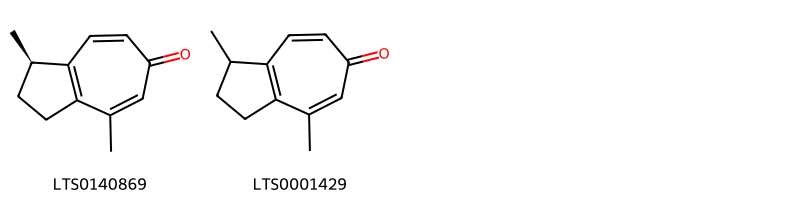{ group="compound" description="Cấu trúc hóa học của các hoạt chất thuộc nhóm *Tropones* là (1r)-1,4-dimethyl-2,3-dihydro-1h-azulen-6-one [(LTS0140869)](https://lotus.naturalproducts.net/compound/lotus_id/LTS0140869), 1,4-dimethyl-2,3-dihydro-1h-azulen-6-one [(LTS0001429)](https://lotus.naturalproducts.net/compound/lotus_id/LTS0001429)." }

                                                              
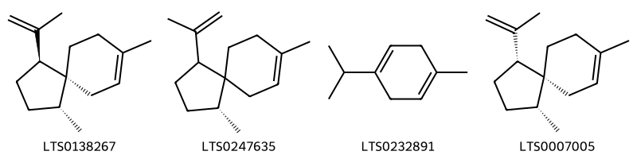{ group="compound" description="Cấu trúc hóa học của các hoạt chất thuộc nhóm *Unsaturated hydrocarbons* là (1r,4s,5r)-1,8-dimethyl-4-(prop-1-en-2-yl)spiro[4.5]dec-7-ene [(LTS0138267)](https://lotus.naturalproducts.net/compound/lotus_id/LTS0138267), (1r)-1,8-dimethyl-4-(prop-1-en-2-yl)spiro[4.5]dec-7-ene [(LTS0247635)](https://lotus.naturalproducts.net/compound/lotus_id/LTS0247635), α terpinene [(LTS0232891)](https://lotus.naturalproducts.net/compound/lotus_id/LTS0232891), (1r,4r,5r)-1,8-dimethyl-4-(prop-1-en-2-yl)spiro[4.5]dec-7-ene [(LTS0007005)](https://lotus.naturalproducts.net/compound/lotus_id/LTS0007005)." }

:::

---

## IV. Tác dụng dược lý

Theo tài liệu quốc tế: nan

---

## V. Dược điển Việt Nam V

### Soi bột

nan

::: {#listing-soibot}
:::

### Vi phẫu

nan

::: {#listing-viphau}
:::

### Định tính

nan

### Định lượng

nan

### Thông tin khác 

- **Độ ẩm:** nan
- **Bảo quản:** nan

## VI. Dược điển Hồng kong

::: {#listing-DDHK}
:::

---

## VII. Y dược học cổ truyền

::: {.callout-note title = "nan" }

**Tên vị thuốc:** nan

**Tính:** nan

**Vị:** nan

**Quy kinh:**  nan

**Công năng chủ trị:** nan

**Phân loại theo thông tư:** nan

**Tác dụng theo y dược cổ truyền:** nan

**Chú ý:** nan

**Kiêng kỵ:** nan 

:::

::: {#listing-ViThuoc}
:::

