::: {.callout-note title = "Tóm tắt"}

nan

:::

## I. Thông tin về dược liệu 

::: {.panel-tabset}

### Định danh

- Dược liệu tiếng Việt: Bạch Truật - Thân Rễ
- Dược liệu tiếng Trung: nan (nan)
- Dược liệu tiếng Anh: nan
- Dược liệu latin thông dụng: Rhizoma Atractylodis  Macrocephalae
- Dược liệu latin kiểu DĐVN: *Radix Et Rhizoma Glycyrrhizae*
- Dược liệu latin kiểu DĐVN: *Rhizoma Atractylodis Macrocephalae*
- Dược liệu latin kiểu thông tư: *Rhizoma Alractylodis macrocephalae*
- Bộ phận dùng: Thân Rễ (Rhizoma)

### Mô tả dược liệu 

**Theo dược điển Việt nam V:** Thân rễ to (quen gọi là củ) có hình dạng thay đổi, hình chùy có nhiều mấu phình ra, phía trên thót nhỏ lại, hoặc từng khúc mập, nạc, dài 5 cm đến 10 cm, đường kính 2 cm đến 5 cm. Mặt ngoài màu nâu nhạt hoặc xám, có nhiều mấu, có vân hình hoa cúc, có nhiều nếp nhăn dọc. Chất cứng khó bẻ gãy, mặt cắt không phẳng, có màu vàng đến nâu nhạt, rải rác có khoang chứa tinh dầu màu nâu vàng, mùi đặc trưng. 
 
**Mô tả dược liệu theo thông tư chế biến dược liệu theo phương pháp cổ truyền:** nan

### Chế biến 

**Chế biến theo dược điển việt nam V**: Thu hoạch thân rễ ở cây đã trồng 2 năm đến 3 năm, khi lá ờ gốc cây đã khô vàng, đào lấy thân rễ, rửa sạch đất, bỏ rễ con, phơi hay sấy nhẹ cho khô.nBạch truật đã loại bỏ tạp chất, rửa sạch, ù mềm, thái lát dày, làm khô. Thổ Bạch truật: Lấy Bạch truật phiến, dùng bột mịn phục long can (đất lòng bếp) sao đến khi mặt ngoài có màu đất, rây bỏ đất, cứ 100 kg Bạch truật phiến dùng 20 kg bột mịn phục long can. Bạch truật sao: Lấy cám mật chích, cho vào trong nồi nóng, khi khói bốc lên thì cho Bạch truật phiến vào sao cho đến khi có màu vàng sém, có mùi thơm cháy, lấy ra rây bỏ cám mật chích, cứ 100 kg Bạch truật phiến dùng 40 kg cám mật chích. Có thể chỉ sao Bạch truật với cám gạo, cách làm như trên. 

**Chế biến theo thông tư:** nan

::: 

## II. Thông tin về thực vật

Dược liệu **Bạch Truật - Thân Rễ** từ bộ phận **Thân Rễ** từ loài *Atractylodes macrocephala*.

**Mô tả thực vật:** nan

*Tài liệu tham khảo:* nan 
Trong dược điển Việt nam, loài *Atractylodes macrocephala* được sử dụng làm dược liệu.

            
::: {.callout-note title = "Phân loại thực vật của *Atractylodes macrocephala*"}

**Kingdom:** Plantae 

**Phylum:** Tracheophyta 

**Order:** Asterales 
 
**Family:** Asteraceae 
 
**Genus:** Atractylodes 
 
**Species:** *Atractylodes macrocephala* 
 

:::

::: {style="display: grid;grid-template-columns: repeat(auto-fill, minmax(150px, 1fr));grid-gap: 1em;"}
{ group="GIBF" }

{ group="GIBF" }

{ group="GIBF" }

{ group="GIBF" }

{ group="GIBF" }

{ group="GIBF" }
:::

**Phân bố trên thế giới:** nan, United States of America, China, Pakistan, Algeria

**Phân bố tại Việt nam:** Không có ghi nhận ở Việt Nam

<iframe src="Rhizoma Atractylodis  Macrocephalae/map_distribution.html" width="100%" height="600" style="border:none;"></iframe>

## III. Thành phần hóa học

Theo tài liệu của GS. Đỗ Tất Lợi:  nan
    

Theo cơ sở dữ liệu lotus, loài *Atractylodes macrocephala* đã phân lập và xác định được **55** hoạt chất thuộc về các nhóm Cinnamic acids and derivatives, Flavonoids, Steroids and steroid derivatives, Heteroaromatic compounds, Organooxygen compounds, Organic oxides, Saturated hydrocarbons, Indoles and derivatives, Fatty Acyls, Naphthofurans, Prenol lipids, Coumarins and derivatives trong bảng dưới đây.
        
| chemicalTaxonomyClassyfireClass   |   smiles_count |
|:----------------------------------|---------------:|
| Cinnamic acids and derivatives    |             74 |
| Coumarins and derivatives         |             40 |
| Fatty Acyls                       |             37 |
| Flavonoids                        |            117 |
| Heteroaromatic compounds          |             24 |
| Indoles and derivatives           |             41 |
| Naphthofurans                     |             41 |
| Organic oxides                    |             42 |
| Organooxygen compounds            |             91 |
| Prenol lipids                     |           1588 |
| Saturated hydrocarbons            |             17 |
| Steroids and steroid derivatives  |            404 |

Danh sách chi tiết các hoạt chất như sau: 

::: {style="display: grid;grid-template-columns: repeat(auto-fill, minmax(150px, 1fr));grid-gap: 1em;"}

                                                              
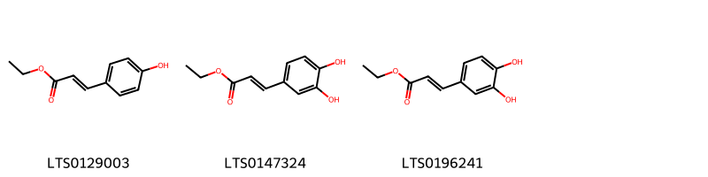{ group="compound" description="Cấu trúc hóa học của các hoạt chất thuộc nhóm *Cinnamic acids and derivatives* là ethyl 3-(4-hydroxyphenyl)prop-2-enoate [(LTS0129003)](https://lotus.naturalproducts.net/compound/lotus_id/LTS0129003), ethyl caffeate [(LTS0147324)](https://lotus.naturalproducts.net/compound/lotus_id/LTS0147324), ethyl 3-(3,4-dihydroxyphenyl)prop-2-enoate [(LTS0196241)](https://lotus.naturalproducts.net/compound/lotus_id/LTS0196241)." }

                                                              
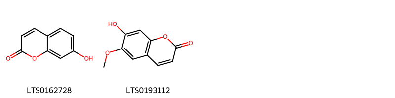{ group="compound" description="Cấu trúc hóa học của các hoạt chất thuộc nhóm *Coumarins and derivatives* là umbelliferone [(LTS0162728)](https://lotus.naturalproducts.net/compound/lotus_id/LTS0162728), scopoletin [(LTS0193112)](https://lotus.naturalproducts.net/compound/lotus_id/LTS0193112)." }

                                                              
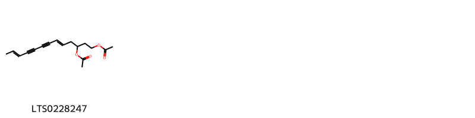{ group="compound" description="Cấu trúc hóa học của các hoạt chất thuộc nhóm *Fatty Acyls* là (5e,11e)-1-(acetyloxy)trideca-5,11-dien-7,9-diyn-3-yl acetate [(LTS0228247)](https://lotus.naturalproducts.net/compound/lotus_id/LTS0228247)." }

                                                              
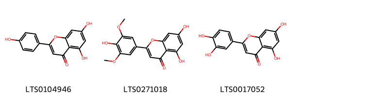{ group="compound" description="Cấu trúc hóa học của các hoạt chất thuộc nhóm *Flavonoids* là chamomile [(LTS0104946)](https://lotus.naturalproducts.net/compound/lotus_id/LTS0104946), tricin [(LTS0271018)](https://lotus.naturalproducts.net/compound/lotus_id/LTS0271018), luteolin [(LTS0017052)](https://lotus.naturalproducts.net/compound/lotus_id/LTS0017052)." }

                                                              
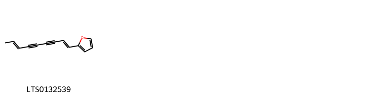{ group="compound" description="Cấu trúc hóa học của các hoạt chất thuộc nhóm *Heteroaromatic compounds* là atractylodin [(LTS0132539)](https://lotus.naturalproducts.net/compound/lotus_id/LTS0132539)." }

                                                              
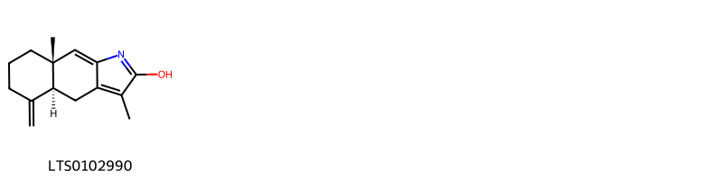{ group="compound" description="Cấu trúc hóa học của các hoạt chất thuộc nhóm *Indoles and derivatives* là (4as,8as)-3,8a-dimethyl-5-methylidene-4h,4ah,6h,7h,8h-cyclohexa[f]indol-2-ol [(LTS0102990)](https://lotus.naturalproducts.net/compound/lotus_id/LTS0102990)." }

                                                              
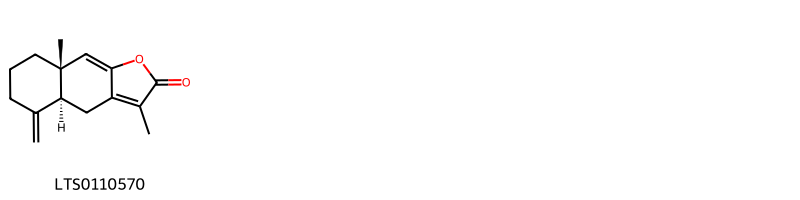{ group="compound" description="Cấu trúc hóa học của các hoạt chất thuộc nhóm *Naphthofurans* là (4as,8as)-3,8a-dimethyl-5-methylidene-4h,4ah,6h,7h,8h-naphtho[2,3-b]furan-2-one [(LTS0110570)](https://lotus.naturalproducts.net/compound/lotus_id/LTS0110570)." }

                                                              
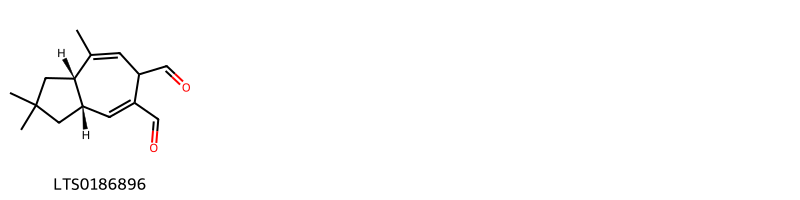{ group="compound" description="Cấu trúc hóa học của các hoạt chất thuộc nhóm *Organic oxides* là (3as,8as)-2,2,8-trimethyl-3,3a,6,8a-tetrahydro-1h-azulene-5,6-dicarbaldehyde [(LTS0186896)](https://lotus.naturalproducts.net/compound/lotus_id/LTS0186896)." }

                                                              
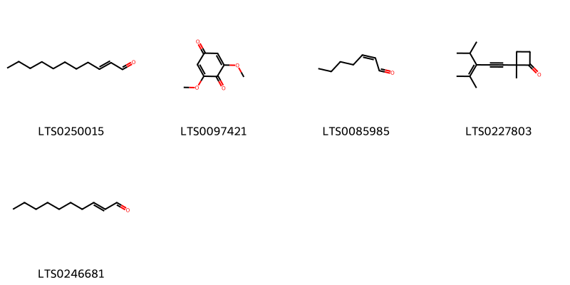{ group="compound" description="Cấu trúc hóa học của các hoạt chất thuộc nhóm *Organooxygen compounds* là undecenal [(LTS0250015)](https://lotus.naturalproducts.net/compound/lotus_id/LTS0250015), 2,6-dimethoxy-1,4-benzoquinone [(LTS0097421)](https://lotus.naturalproducts.net/compound/lotus_id/LTS0097421), (2z)-hept-2-enal [(LTS0085985)](https://lotus.naturalproducts.net/compound/lotus_id/LTS0085985), 2-(3-isopropyl-4-methylpent-3-en-1-yn-1-yl)-2-methylcyclobutan-1-one [(LTS0227803)](https://lotus.naturalproducts.net/compound/lotus_id/LTS0227803), (2e)-2-decenal [(LTS0246681)](https://lotus.naturalproducts.net/compound/lotus_id/LTS0246681)." }

                                                              
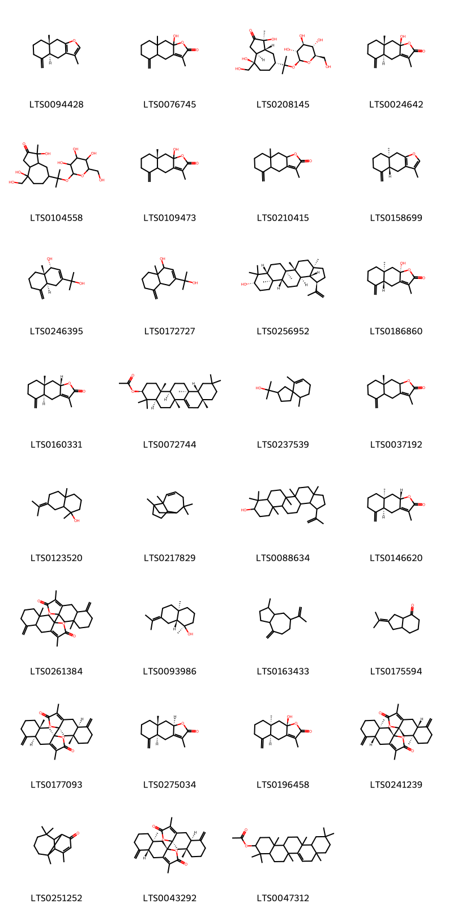{ group="compound" description="Cấu trúc hóa học của các hoạt chất thuộc nhóm *Prenol lipids* là atractylone [(LTS0094428)](https://lotus.naturalproducts.net/compound/lotus_id/LTS0094428), 9a-hydroxy-3,8a-dimethyl-5-methylidene-4h,4ah,6h,7h,8h,9h-naphtho[2,3-b]furan-2-one [(LTS0076745)](https://lotus.naturalproducts.net/compound/lotus_id/LTS0076745), (1s,3as,4r,7r,8ar)-1,4-dihydroxy-4-(hydroxymethyl)-1-methyl-7-(2-{[(2s,3r,4s,5s,6r)-3,4,5-trihydroxy-6-(hydroxymethyl)oxan-2-yl]oxy}propan-2-yl)-hexahydro-3h-azulen-2-one [(LTS0208145)](https://lotus.naturalproducts.net/compound/lotus_id/LTS0208145), atractylenolide iii [(LTS0024642)](https://lotus.naturalproducts.net/compound/lotus_id/LTS0024642), 1,4-dihydroxy-4-(hydroxymethyl)-1-methyl-7-(2-{[3,4,5-trihydroxy-6-(hydroxymethyl)oxan-2-yl]oxy}propan-2-yl)-hexahydro-3h-azulen-2-one [(LTS0104558)](https://lotus.naturalproducts.net/compound/lotus_id/LTS0104558), (8ar)-9a-hydroxy-3,8a-dimethyl-5-methylidene-4h,4ah,6h,7h,8h,9h-naphtho[2,3-b]furan-2-one [(LTS0109473)](https://lotus.naturalproducts.net/compound/lotus_id/LTS0109473), 3,8a-dimethyl-5-methylidene-4h,4ah,6h,7h,8h,9h,9ah-naphtho[2,3-b]furan-2-one [(LTS0210415)](https://lotus.naturalproducts.net/compound/lotus_id/LTS0210415), (4ar,8as)-3,8a-dimethyl-5-methylidene-4h,4ah,6h,7h,8h,9h-naphtho[2,3-b]furan [(LTS0158699)](https://lotus.naturalproducts.net/compound/lotus_id/LTS0158699), (1r,4as,8as)-3-(2-hydroxypropan-2-yl)-8a-methyl-5-methylidene-1,4,4a,6,7,8-hexahydronaphthalen-1-ol [(LTS0246395)](https://lotus.naturalproducts.net/compound/lotus_id/LTS0246395), 3-(2-hydroxypropan-2-yl)-8a-methyl-5-methylidene-1,4,4a,6,7,8-hexahydronaphthalen-1-ol [(LTS0172727)](https://lotus.naturalproducts.net/compound/lotus_id/LTS0172727), lupeol [(LTS0256952)](https://lotus.naturalproducts.net/compound/lotus_id/LTS0256952), (4ar,8as,9ar)-9a-hydroxy-3,8a-dimethyl-5-methylidene-4h,4ah,6h,7h,8h,9h-naphtho[2,3-b]furan-2-one [(LTS0186860)](https://lotus.naturalproducts.net/compound/lotus_id/LTS0186860), (4as,8ar,9as)-3,8a-dimethyl-5-methylidene-4h,4ah,6h,7h,8h,9h,9ah-naphtho[2,3-b]furan-2-one [(LTS0160331)](https://lotus.naturalproducts.net/compound/lotus_id/LTS0160331), (3s,4ar,6ar,8ar,12ar,12bs,14ar,14br)-4,4,6a,8a,11,11,12b,14b-octamethyl-1,2,3,4a,5,6,8,9,10,12,12a,13,14,14a-tetradecahydropicen-3-yl acetate [(LTS0072744)](https://lotus.naturalproducts.net/compound/lotus_id/LTS0072744), 2-{6,10-dimethylspiro[4.5]dec-6-en-2-yl}propan-2-ol [(LTS0237539)](https://lotus.naturalproducts.net/compound/lotus_id/LTS0237539), (8ar)-3,8a-dimethyl-5-methylidene-4h,4ah,6h,7h,8h,9h,9ah-naphtho[2,3-b]furan-2-one [(LTS0037192)](https://lotus.naturalproducts.net/compound/lotus_id/LTS0037192), 1,4a-dimethyl-7-(propan-2-ylidene)-hexahydro-2h-naphthalen-1-ol [(LTS0123520)](https://lotus.naturalproducts.net/compound/lotus_id/LTS0123520), 2,6,6,9-tetramethyltricyclo[5.4.0.0²,⁹]undec-3-ene [(LTS0217829)](https://lotus.naturalproducts.net/compound/lotus_id/LTS0217829), lupeol [(LTS0088634)](https://lotus.naturalproducts.net/compound/lotus_id/LTS0088634), (4as,8as,9as)-3,8a-dimethyl-5-methylidene-4h,4ah,6h,7h,8h,9h,9ah-naphtho[2,3-b]furan-2-one [(LTS0146620)](https://lotus.naturalproducts.net/compound/lotus_id/LTS0146620), 9a-{3,8a-dimethyl-5-methylidene-2-oxo-4h,4ah,6h,7h,8h,9h-naphtho[2,3-b]furan-9a-yl}-3,8a-dimethyl-5-methylidene-4h,4ah,6h,7h,8h,9h-naphtho[2,3-b]furan-2-one [(LTS0261384)](https://lotus.naturalproducts.net/compound/lotus_id/LTS0261384), (1r,4ar,8ar)-1,4a-dimethyl-7-(propan-2-ylidene)-hexahydro-2h-naphthalen-1-ol [(LTS0093986)](https://lotus.naturalproducts.net/compound/lotus_id/LTS0093986), 1-methyl-4-methylidene-7-(prop-1-en-2-yl)-octahydro-1h-azulene [(LTS0163433)](https://lotus.naturalproducts.net/compound/lotus_id/LTS0163433), 2-(propan-2-ylidene)-hexahydro-1h-inden-4-one [(LTS0175594)](https://lotus.naturalproducts.net/compound/lotus_id/LTS0175594), (4as,8ar,9as)-9a-[(4as,8ar,9as)-3,8a-dimethyl-5-methylidene-2-oxo-4h,4ah,6h,7h,8h,9h-naphtho[2,3-b]furan-9a-yl]-3,8a-dimethyl-5-methylidene-4h,4ah,6h,7h,8h,9h-naphtho[2,3-b]furan-2-one [(LTS0177093)](https://lotus.naturalproducts.net/compound/lotus_id/LTS0177093), (4as,8ar,9ar)-3,8a-dimethyl-5-methylidene-4h,4ah,6h,7h,8h,9h,9ah-naphtho[2,3-b]furan-2-one [(LTS0275034)](https://lotus.naturalproducts.net/compound/lotus_id/LTS0275034), (4as,8as,9as)-9a-hydroxy-3,8a-dimethyl-5-methylidene-4h,4ah,6h,7h,8h,9h-naphtho[2,3-b]furan-2-one [(LTS0196458)](https://lotus.naturalproducts.net/compound/lotus_id/LTS0196458), (4ar,8as,9ar)-9a-[(4ar,8as,9ar)-3,8a-dimethyl-5-methylidene-2-oxo-4h,4ah,6h,7h,8h,9h-naphtho[2,3-b]furan-9a-yl]-3,8a-dimethyl-5-methylidene-4h,4ah,6h,7h,8h,9h-naphtho[2,3-b]furan-2-one [(LTS0241239)](https://lotus.naturalproducts.net/compound/lotus_id/LTS0241239), 2,6,6,11-tetramethyltricyclo[5.4.0.0²,⁸]undec-10-en-9-one [(LTS0251252)](https://lotus.naturalproducts.net/compound/lotus_id/LTS0251252), (4ar,8as,9ar)-9a-[(4as,8ar,9as)-3,8a-dimethyl-5-methylidene-2-oxo-4h,4ah,6h,7h,8h,9h-naphtho[2,3-b]furan-9a-yl]-3,8a-dimethyl-5-methylidene-4h,4ah,6h,7h,8h,9h-naphtho[2,3-b]furan-2-one [(LTS0043292)](https://lotus.naturalproducts.net/compound/lotus_id/LTS0043292), 4,4,6a,8a,11,11,12b,14b-octamethyl-1,2,3,4a,5,6,8,9,10,12,12a,13,14,14a-tetradecahydropicen-3-yl acetate [(LTS0047312)](https://lotus.naturalproducts.net/compound/lotus_id/LTS0047312)." }

                                                              
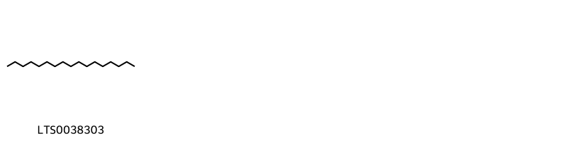{ group="compound" description="Cấu trúc hóa học của các hoạt chất thuộc nhóm *Saturated hydrocarbons* là heptadecane [(LTS0038303)](https://lotus.naturalproducts.net/compound/lotus_id/LTS0038303)." }

                                                              
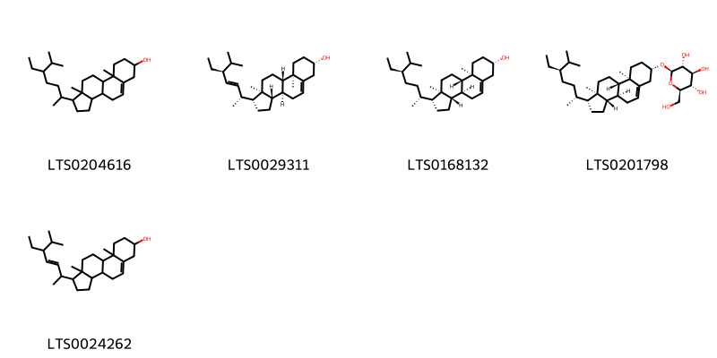{ group="compound" description="Cấu trúc hóa học của các hoạt chất thuộc nhóm *Steroids and steroid derivatives* là stigmast-5-en-3-ol, (3β)- [(LTS0204616)](https://lotus.naturalproducts.net/compound/lotus_id/LTS0204616), phytosterol [(LTS0029311)](https://lotus.naturalproducts.net/compound/lotus_id/LTS0029311), sitosterol [(LTS0168132)](https://lotus.naturalproducts.net/compound/lotus_id/LTS0168132), sitogluside [(LTS0201798)](https://lotus.naturalproducts.net/compound/lotus_id/LTS0201798), stigmasterol [(LTS0024262)](https://lotus.naturalproducts.net/compound/lotus_id/LTS0024262)." }

:::

---

## IV. Tác dụng dược lý

Theo tài liệu quốc tế: To invigorate the function of the spleen and replenish qi, to eliminate damp by causing diuresis, to arrest excesssive perspiration, and to prevent miscarriage.

---

## V. Dược điển Việt Nam V

### Soi bột

Bột có màu vàng nâu, mùi thơm đặc trưng, vị đắng. Soi kính hiển vi thấy: Mảnh bần gồm những tế bào hình nhiều cạnh, thành dày. Tế bào mô cứng hình nhiều cạnh, thành dày, có lỗ trao đổi. Mảnh mô mềm chứa tinh thể calci oxalat hình cầu gai và có các khoang chứa tinh dầu có màu nâu đến nâu vàng. Tinh thể calci oxalat hình kim có đầu nhọn nằm riêng rẽ hay thành đám, Mảnh mạch vạch, mạch mạng. Khối nhựa màu vàng, nâu, đỏ.

::: {#listing-soibot}
:::

### Vi phẫu

Lớp bần gồm nhiều hàng tế bào xếp khá đều đặn. Lớp mô mềm gồm những tế bào hình nhiều cạnh, có thành mỏng, có khoang chứa tinh dầu và rải rác có các tinh thê calci oxalat hình kim. Phía trên libe có những đám tế bào mô cứng đa số hóa sợi. Tầng phát sinh libe-gỗ thành vòng rõ rệt. Libe-gỗ xếp thành tia tỏa tròn. Tia một hẹp. nn

::: {#listing-viphau}
:::

### Định tính

A, Lắc 2 g bột dược liệu với 20 ml ether (TT) trong 10 min và lọc. Bốc hơi 10 ml dịch lọc tới khô, thêm vài giọt dung dịch vanilin- acid sulfuric (TT), đun nóng trên cách thủy 3 min đến 5 min, xuất hiện màu hồng tím. B, Phương pháp sắc ký lớp mỏng (Phụ lục 5.4). Bản mỏng: Silica gel G. Dung môi khai triển: Ether dầu hỏa (30 °c đến 60 °C) – ethyl acetat(50 : 1). Dung dịch thử: Lấy 0,5 g bột dược liệu, thêm 5 ml n-hexan (TT) cho vào bình nút kín, lắc khoảng 30 min, lọc lấy dịch lọc để làm dung dịch thử. Dung dịch đối chiếu: Lấy 0,5 g bột Bạch truật (mẫu chuẩn), tiến hành chiết như mô tả ở phần Dung dịch thử. Cách tiến hành: Chấm riêng biệt lên bản mỏng 10 µl mỗi dung dịch trên. Sau khi triển khai sắc ký, lấy bản mỏng ra sấy nhẹ hoặc để khô ngoài không khí, rồi phun dung dịch vanilin 1 % trong dung dịch acid sulfuric 5 %, sấy bản mỏng ờ 60 °c trong khoảng 15 min đến khi các vết xuất hiện rõ, trên sắc ký đồ của dung dịch thử phải có các vết cùng giá trị Rf và cùng màu sắc với các vết trên sắc ký đồ của dung dịch đối chiếu, vết chính ờ trên cùng có màu đỏ.

### Định lượng

Không ít hơn 3,0 % tính theo dược liệu khô kiệt. Tiến hành theo phương pháp chiết nóng (Phụ lục 12.10), dùng ethanol 96 % (TT) làm dung môi.

### Thông tin khác 

- **Độ ẩm:** Không quá 14,0 % (Phụ lục 9.6, 1 g, 105 °c, 4 h).
- **Bảo quản:** nan

## VI. Dược điển Hồng kong

::: {#listing-DDHK}
:::

---

## VII. Y dược học cổ truyền

::: {.callout-note title = "nan" }

**Tên vị thuốc:** nan

**Tính:** Ôn

**Vị:** Khổ-Cam

**Quy kinh:**  Tỳ, vị

**Công năng chủ trị:** Khổ, cam, ôn. Vào các kinh tỳ, vị.

**Phân loại theo thông tư:** Bổ dương, bổ khí

**Tác dụng theo y dược cổ truyền:** nan

**Chú ý:** nan

**Kiêng kỵ:** Âm hư nội nhiệt, tân dịch hư hao gây đại tiện táo, không dùngnn 

:::

::: {#listing-ViThuoc}
:::

