::: {.callout-note title = "Tóm tắt"}

nan

:::

## I. Thông tin về dược liệu 

::: {.panel-tabset}

### Định danh

- Dược liệu tiếng Việt: Bạch Cập - Thân Rễ
- Dược liệu tiếng Trung: nan (nan)
- Dược liệu tiếng Anh: nan
- Dược liệu latin thông dụng: Rhizoma Bletillae striatae
- Dược liệu latin kiểu DĐVN: *Bulbus Pritillariae*
- Dược liệu latin kiểu DĐVN: *Bletillae Rhizoma*
- Dược liệu latin kiểu thông tư: *Rhizoma Bletillae striatae*
- Bộ phận dùng: Thân Rễ (Rhizoma)

### Mô tả dược liệu 

**Theo dược điển Việt nam V:** Thân rễ hình cầu dẹt, không đều, có 2 đến 3 ngạnh dạng móng, dài 1,5 cm đến 5 cm, dày 0,5 cm đến 1,5 cm. Mặt ngoài trắng ngà hoặc trắng xám, có các vòng đồng tâm và có các nốt màu nâu là sẹo của rễ con, các sẹo của thân nhỏ cao lên ở phần trên, phần dưới có vết nổi của củ khác. Chất cứng chắc và khó bẻ gãy, mặt cắt ngang màu hơi trắng, trong như sừng. Không mùi. Vị đắng, nhai dính, dẻo. 
 
**Mô tả dược liệu theo thông tư chế biến dược liệu theo phương pháp cổ truyền:** nan

### Chế biến 

**Chế biến theo dược điển việt nam V**: Thu hoạch vào mùa hạ và mùa thu, lấy thân rễ, rửa sạch đất cát, bỏ rễ con, luộc hoặc đồ lên đến khi mặt cắt ngang thân rề không còn lõi trắng, phơi đến khô se, bỏ vỏ ngoài rồi phơi tiếp đến khô. Bào chế bạch cập Lấy Bạch cập sạch, hấp cho mềm đều, thái phiến phơi khô. nn 

**Chế biến theo thông tư:** nan

::: 

## II. Thông tin về thực vật

Dược liệu **Bạch Cập - Thân Rễ** từ bộ phận **Thân Rễ** từ loài *Bletilla striata*.

**Mô tả thực vật:** nan

*Tài liệu tham khảo:* nan 
Trong dược điển Việt nam, loài *Bletilla striata* được sử dụng làm dược liệu.

            
::: {.callout-note title = "Phân loại thực vật của *Bletilla striata*"}

**Kingdom:** Plantae 

**Phylum:** Tracheophyta 

**Order:** Asparagales 
 
**Family:** Orchidaceae 
 
**Genus:** Bletilla 
 
**Species:** *Bletilla striata* 
 

:::

::: {style="display: grid;grid-template-columns: repeat(auto-fill, minmax(150px, 1fr));grid-gap: 1em;"}
{ group="GIBF" }

{ group="GIBF" }

{ group="GIBF" }

{ group="GIBF" }

{ group="GIBF" }

{ group="GIBF" }
:::

**Phân bố trên thế giới:** nan, France, United States of America, China, Chinese Taipei, New Zealand, Japan, Korea, Republic of, Netherlands, Austria, Belgium

**Phân bố tại Việt nam:** Không có ghi nhận ở Việt Nam

<iframe src="Rhizoma Bletillae striatae/map_distribution.html" width="100%" height="600" style="border:none;"></iframe>

## III. Thành phần hóa học

Theo tài liệu của GS. Đỗ Tất Lợi:  nan
    

Theo cơ sở dữ liệu lotus, loài *Bletilla striata* đã phân lập và xác định được **98** hoạt chất thuộc về các nhóm Stilbenes, Cinnamic acids and derivatives, Isoflavonoids, Flavonoids, Tannins, Diarylheptanoids, Carboxylic acids and derivatives, Organooxygen compounds, Benzene and substituted derivatives, Phenanthrenes and derivatives, Anthracenes trong bảng dưới đây.
        
| chemicalTaxonomyClassyfireClass     |   smiles_count |
|:------------------------------------|---------------:|
| Anthracenes                         |             59 |
| Benzene and substituted derivatives |             50 |
| Carboxylic acids and derivatives    |             26 |
| Cinnamic acids and derivatives      |             36 |
| Diarylheptanoids                    |            588 |
| Flavonoids                          |            666 |
| Isoflavonoids                       |            568 |
| Organooxygen compounds              |           1656 |
| Phenanthrenes and derivatives       |           1911 |
| Stilbenes                           |            288 |
| Tannins                             |             54 |

Danh sách chi tiết các hoạt chất như sau: 

::: {style="display: grid;grid-template-columns: repeat(auto-fill, minmax(150px, 1fr));grid-gap: 1em;"}

                                                              
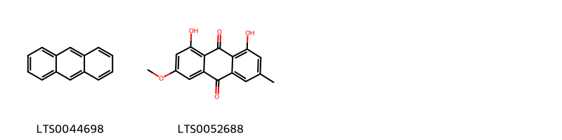{ group="compound" description="Cấu trúc hóa học của các hoạt chất thuộc nhóm *Anthracenes* là anthracene [(LTS0044698)](https://lotus.naturalproducts.net/compound/lotus_id/LTS0044698), physcion [(LTS0052688)](https://lotus.naturalproducts.net/compound/lotus_id/LTS0052688)." }

                                                              
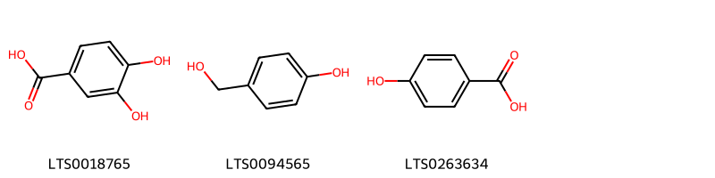{ group="compound" description="Cấu trúc hóa học của các hoạt chất thuộc nhóm *Benzene and substituted derivatives* là 3,4-dihydroxybenzoic acid [(LTS0018765)](https://lotus.naturalproducts.net/compound/lotus_id/LTS0018765), gastrodigenin [(LTS0094565)](https://lotus.naturalproducts.net/compound/lotus_id/LTS0094565), p-hydroxybenzoic acid [(LTS0263634)](https://lotus.naturalproducts.net/compound/lotus_id/LTS0263634)." }

                                                              
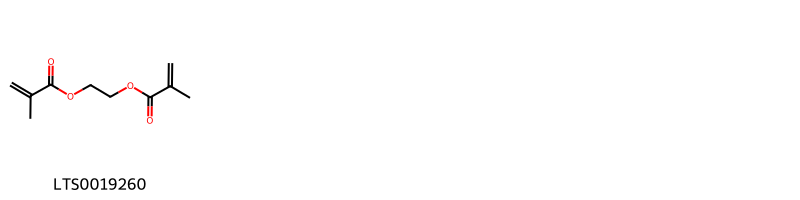{ group="compound" description="Cấu trúc hóa học của các hoạt chất thuộc nhóm *Carboxylic acids and derivatives* là glycol dimethacrylate [(LTS0019260)](https://lotus.naturalproducts.net/compound/lotus_id/LTS0019260)." }

                                                              
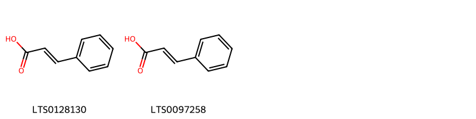{ group="compound" description="Cấu trúc hóa học của các hoạt chất thuộc nhóm *Cinnamic acids and derivatives* là cinnamic acid [(LTS0128130)](https://lotus.naturalproducts.net/compound/lotus_id/LTS0128130), phenylacrylic acid [(LTS0097258)](https://lotus.naturalproducts.net/compound/lotus_id/LTS0097258)." }

                                                              
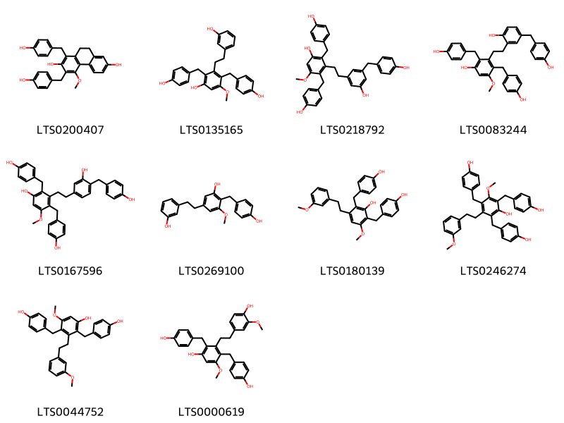{ group="compound" description="Cấu trúc hóa học của các hoạt chất thuộc nhóm *Diarylheptanoids* là 1,3-bis[(4-hydroxyphenyl)methyl]-4-methoxy-9,10-dihydrophenanthrene-2,7-diol [(LTS0200407)](https://lotus.naturalproducts.net/compound/lotus_id/LTS0200407), 3-[2-(3-hydroxyphenyl)ethyl]-2,4-bis[(4-hydroxyphenyl)methyl]-5-methoxyphenol [(LTS0135165)](https://lotus.naturalproducts.net/compound/lotus_id/LTS0135165), 3-(2-{3-hydroxy-5-[(4-hydroxyphenyl)methyl]phenyl}ethyl)-2,4-bis[(4-hydroxyphenyl)methyl]-5-methoxyphenol [(LTS0218792)](https://lotus.naturalproducts.net/compound/lotus_id/LTS0218792), 3-(2-{2-hydroxy-5-[(4-hydroxyphenyl)methyl]phenyl}ethyl)-2,4-bis[(4-hydroxyphenyl)methyl]-5-methoxyphenol [(LTS0083244)](https://lotus.naturalproducts.net/compound/lotus_id/LTS0083244), 3-(2-{3-hydroxy-4-[(4-hydroxyphenyl)methyl]phenyl}ethyl)-2,4-bis[(4-hydroxyphenyl)methyl]-5-methoxyphenol [(LTS0167596)](https://lotus.naturalproducts.net/compound/lotus_id/LTS0167596), 5-[2-(3-hydroxyphenyl)ethyl]-2-[(4-hydroxyphenyl)methyl]-3-methoxyphenol [(LTS0269100)](https://lotus.naturalproducts.net/compound/lotus_id/LTS0269100), 2,6-bis[(4-hydroxyphenyl)methyl]-3-methoxy-5-[2-(3-methoxyphenyl)ethyl]phenol [(LTS0180139)](https://lotus.naturalproducts.net/compound/lotus_id/LTS0180139), 2,4,6-tris[(4-hydroxyphenyl)methyl]-3-methoxy-5-[2-(3-methoxyphenyl)ethyl]phenol [(LTS0246274)](https://lotus.naturalproducts.net/compound/lotus_id/LTS0246274), 2,4-bis[(4-hydroxyphenyl)methyl]-5-methoxy-3-[2-(3-methoxyphenyl)ethyl]phenol [(LTS0044752)](https://lotus.naturalproducts.net/compound/lotus_id/LTS0044752), 3-[2-(4-hydroxy-3-methoxyphenyl)ethyl]-2,4-bis[(4-hydroxyphenyl)methyl]-5-methoxyphenol [(LTS0000619)](https://lotus.naturalproducts.net/compound/lotus_id/LTS0000619)." }

                                                              
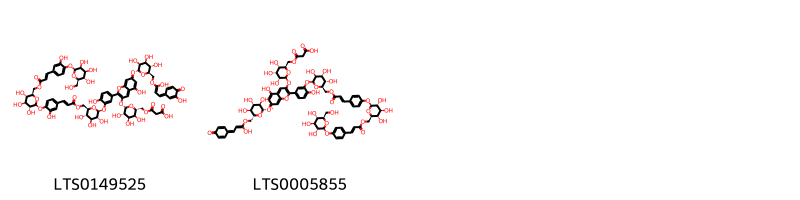{ group="compound" description="Cấu trúc hóa học của các hoạt chất thuộc nhóm *Flavonoids* là (3-{[(2s,3s,4r,5s,6r)-6-{[(2-carboxyacetyl)oxy]methyl}-3,4,5-trihydroxyoxan-2-yl]oxy}-5-hydroxy-2-(4-hydroxy-3-{[(2s,3r,4s,5s,6r)-3,4,5-trihydroxy-6-({[(2e)-3-(3-hydroxy-4-{[(2s,3r,4s,5s,6r)-3,4,5-trihydroxy-6-({[(2e)-3-(3-hydroxy-4-{[(2s,3s,4s,5s,6r)-3,4,5-trihydroxy-6-(hydroxymethyl)oxan-2-yl]oxy}phenyl)prop-2-enoyl]oxy}methyl)oxan-2-yl]oxy}phenyl)prop-2-enoyl]oxy}methyl)oxan-2-yl]oxy}phenyl)chromen-7-ylidene)[(2s,3s,4s,5s,6r)-3,4,5-trihydroxy-6-({[1-hydroxy-3-(3-hydroxy-4-oxocyclohexa-2,5-dien-1-ylidene)prop-1-en-1-yl]oxy}methyl)oxan-2-yl]oxidanium [(LTS0149525)](https://lotus.naturalproducts.net/compound/lotus_id/LTS0149525), (3-{[(2s,3r,4r,5s,6r)-6-{[(2-carboxyacetyl)oxy]methyl}-3,4,5-trihydroxyoxan-2-yl]oxy}-5-hydroxy-2-(4-hydroxy-3-{[(2s,3s,4r,5s,6r)-3,4,5-trihydroxy-6-({[(2e)-3-(4-{[(2s,3r,4s,5s,6r)-3,4,5-trihydroxy-6-({[(2e)-3-(4-{[(2s,3r,4s,5s,6r)-3,4,5-trihydroxy-6-(hydroxymethyl)oxan-2-yl]oxy}phenyl)prop-2-enoyl]oxy}methyl)oxan-2-yl]oxy}phenyl)prop-2-enoyl]oxy}methyl)oxan-2-yl]oxy}phenyl)chromen-7-ylidene)[(2s,3r,4s,5s,6r)-3,4,5-trihydroxy-6-({[1-hydroxy-3-(4-oxocyclohexa-2,5-dien-1-ylidene)prop-1-en-1-yl]oxy}methyl)oxan-2-yl]oxidanium [(LTS0005855)](https://lotus.naturalproducts.net/compound/lotus_id/LTS0005855)." }

                                                              
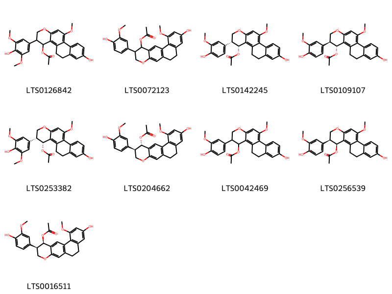{ group="compound" description="Cấu trúc hóa học của các hoạt chất thuộc nhóm *Isoflavonoids* là 8-hydroxy-3-(4-hydroxy-3,5-dimethoxyphenyl)-11-methoxy-2h,3h,4h,5h,6h-phenanthro[2,1-b]pyran-4-yl acetate [(LTS0126842)](https://lotus.naturalproducts.net/compound/lotus_id/LTS0126842), 8-hydroxy-3-(4-hydroxy-3-methoxyphenyl)-6-methoxy-3,4,10,11-tetrahydro-2h-1-oxatetraphen-4-yl acetate [(LTS0072123)](https://lotus.naturalproducts.net/compound/lotus_id/LTS0072123), (3r,4r)-8-hydroxy-3-(4-hydroxy-3-methoxyphenyl)-11-methoxy-2h,3h,4h,5h,6h-phenanthro[2,1-b]pyran-4-yl acetate [(LTS0142245)](https://lotus.naturalproducts.net/compound/lotus_id/LTS0142245), (3s,4r)-8-hydroxy-3-(4-hydroxy-3-methoxyphenyl)-11-methoxy-2h,3h,4h,5h,6h-phenanthro[2,1-b]pyran-4-yl acetate [(LTS0109107)](https://lotus.naturalproducts.net/compound/lotus_id/LTS0109107), (3r,4r)-8-hydroxy-3-(4-hydroxy-3,5-dimethoxyphenyl)-11-methoxy-2h,3h,4h,5h,6h-phenanthro[2,1-b]pyran-4-yl acetate [(LTS0253382)](https://lotus.naturalproducts.net/compound/lotus_id/LTS0253382), (3r,4s)-8-hydroxy-3-(4-hydroxy-3-methoxyphenyl)-6-methoxy-3,4,10,11-tetrahydro-2h-1-oxatetraphen-4-yl acetate [(LTS0204662)](https://lotus.naturalproducts.net/compound/lotus_id/LTS0204662), 8-hydroxy-3-(4-hydroxy-3-methoxyphenyl)-11-methoxy-2h,3h,4h,5h,6h-phenanthro[2,1-b]pyran-4-yl acetate [(LTS0042469)](https://lotus.naturalproducts.net/compound/lotus_id/LTS0042469), (3s,4s)-8-hydroxy-3-(4-hydroxy-3-methoxyphenyl)-11-methoxy-2h,3h,4h,5h,6h-phenanthro[2,1-b]pyran-4-yl acetate [(LTS0256539)](https://lotus.naturalproducts.net/compound/lotus_id/LTS0256539), (3r,4r)-8-hydroxy-3-(4-hydroxy-3-methoxyphenyl)-6-methoxy-3,4,10,11-tetrahydro-2h-1-oxatetraphen-4-yl acetate [(LTS0016511)](https://lotus.naturalproducts.net/compound/lotus_id/LTS0016511)." }

                                                              
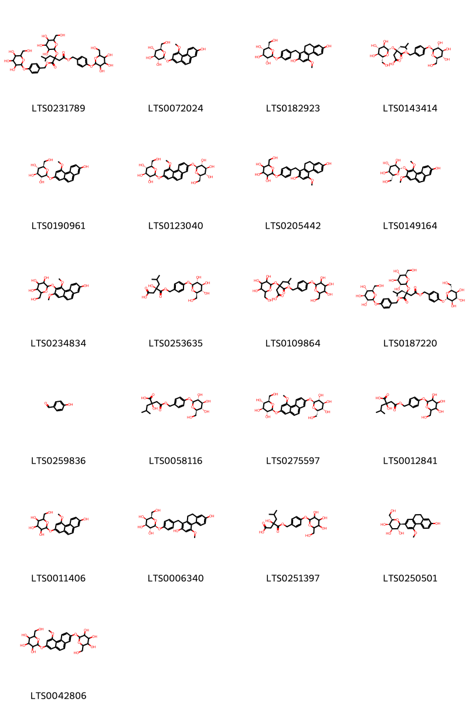{ group="compound" description="Cấu trúc hóa học của các hoạt chất thuộc nhóm *Organooxygen compounds* là 1,4-bis[(4-{[3,4,5-trihydroxy-6-(hydroxymethyl)oxan-2-yl]oxy}phenyl)methyl] 2-(2-methylpropyl)-2-{[3,4,5-trihydroxy-6-(hydroxymethyl)oxan-2-yl]oxy}butanedioate [(LTS0231789)](https://lotus.naturalproducts.net/compound/lotus_id/LTS0231789), (2r,3r,4s,5s,6r)-2-[(7-hydroxy-4-methoxyphenanthren-2-yl)oxy]-6-(hydroxymethyl)oxane-3,4,5-triol [(LTS0072024)](https://lotus.naturalproducts.net/compound/lotus_id/LTS0072024), (2s,3r,4s,5s,6r)-2-{4-[(2,7-dihydroxy-4-methoxy-9,10-dihydrophenanthren-1-yl)methyl]phenoxy}-6-(hydroxymethyl)oxane-3,4,5-triol [(LTS0182923)](https://lotus.naturalproducts.net/compound/lotus_id/LTS0182923), (3r)-5-methyl-3-{[(2s,3r,4s,5s,6r)-3,4,5-trihydroxy-6-(hydroxymethyl)oxan-2-yl]oxy}-3-{[(4-{[(2s,3r,4s,5s,6r)-3,4,5-trihydroxy-6-(hydroxymethyl)oxan-2-yl]oxy}phenyl)methoxy]carbonyl}hexanoic acid [(LTS0143414)](https://lotus.naturalproducts.net/compound/lotus_id/LTS0143414), (2s,3r,4s,5s,6r)-2-[(7-hydroxy-4-methoxyphenanthren-2-yl)oxy]-6-(hydroxymethyl)oxane-3,4,5-triol [(LTS0190961)](https://lotus.naturalproducts.net/compound/lotus_id/LTS0190961), (2r,3s,4s,5r,6s)-2-(hydroxymethyl)-6-[(4-methoxy-7-{[(2s,3r,4s,5s,6r)-3,4,5-trihydroxy-6-(hydroxymethyl)oxan-2-yl]oxy}phenanthren-2-yl)oxy]oxane-3,4,5-triol [(LTS0123040)](https://lotus.naturalproducts.net/compound/lotus_id/LTS0123040), 2-{4-[(2,7-dihydroxy-4-methoxy-9,10-dihydrophenanthren-1-yl)methyl]phenoxy}-6-(hydroxymethyl)oxane-3,4,5-triol [(LTS0205442)](https://lotus.naturalproducts.net/compound/lotus_id/LTS0205442), (2s,3r,4s,5s,6r)-2-[(7-hydroxy-2,4-dimethoxyphenanthren-3-yl)oxy]-6-(hydroxymethyl)oxane-3,4,5-triol [(LTS0149164)](https://lotus.naturalproducts.net/compound/lotus_id/LTS0149164), 2-[(7-hydroxy-2,4-dimethoxyphenanthren-3-yl)oxy]-6-(hydroxymethyl)oxane-3,4,5-triol [(LTS0234834)](https://lotus.naturalproducts.net/compound/lotus_id/LTS0234834), (3r)-3-hydroxy-5-methyl-3-{[(4-{[(2s,3r,4s,5s,6r)-3,4,5-trihydroxy-6-(hydroxymethyl)oxan-2-yl]oxy}phenyl)methoxy]carbonyl}hexanoic acid [(LTS0253635)](https://lotus.naturalproducts.net/compound/lotus_id/LTS0253635), 5-methyl-3-{[3,4,5-trihydroxy-6-(hydroxymethyl)oxan-2-yl]oxy}-3-{[(4-{[3,4,5-trihydroxy-6-(hydroxymethyl)oxan-2-yl]oxy}phenyl)methoxy]carbonyl}hexanoic acid [(LTS0109864)](https://lotus.naturalproducts.net/compound/lotus_id/LTS0109864), 1,4-bis[(4-{[(2s,3r,4s,5s,6r)-3,4,5-trihydroxy-6-(hydroxymethyl)oxan-2-yl]oxy}phenyl)methyl] (2r)-2-(2-methylpropyl)-2-{[(2s,3r,4s,5s,6r)-3,4,5-trihydroxy-6-(hydroxymethyl)oxan-2-yl]oxy}butanedioate [(LTS0187220)](https://lotus.naturalproducts.net/compound/lotus_id/LTS0187220), p-hydroxybenzaldehyde [(LTS0259836)](https://lotus.naturalproducts.net/compound/lotus_id/LTS0259836), (2r)-2-hydroxy-4-methyl-2-{2-oxo-2-[(4-{[(2s,3r,4s,5s,6r)-3,4,5-trihydroxy-6-(hydroxymethyl)oxan-2-yl]oxy}phenyl)methoxy]ethyl}pentanoic acid [(LTS0058116)](https://lotus.naturalproducts.net/compound/lotus_id/LTS0058116), (2r,3s,4s,5r,6s)-2-(hydroxymethyl)-6-[(4-methoxy-7-{[(2s,3r,4s,5s,6s)-3,4,5-trihydroxy-6-(hydroxymethyl)oxan-2-yl]oxy}phenanthren-2-yl)oxy]oxane-3,4,5-triol [(LTS0275597)](https://lotus.naturalproducts.net/compound/lotus_id/LTS0275597), 2-hydroxy-4-methyl-2-{2-oxo-2-[(4-{[3,4,5-trihydroxy-6-(hydroxymethyl)oxan-2-yl]oxy}phenyl)methoxy]ethyl}pentanoic acid [(LTS0012841)](https://lotus.naturalproducts.net/compound/lotus_id/LTS0012841), 2-[(7-hydroxy-4-methoxyphenanthren-2-yl)oxy]-6-(hydroxymethyl)oxane-3,4,5-triol [(LTS0011406)](https://lotus.naturalproducts.net/compound/lotus_id/LTS0011406), (2s,3r,4s,5r,6r)-2-{4-[(2,7-dihydroxy-4-methoxy-9,10-dihydrophenanthren-1-yl)methyl]phenoxy}-6-(hydroxymethyl)oxane-3,4,5-triol [(LTS0006340)](https://lotus.naturalproducts.net/compound/lotus_id/LTS0006340), 3-hydroxy-5-methyl-3-{[(4-{[3,4,5-trihydroxy-6-(hydroxymethyl)oxan-2-yl]oxy}phenyl)methoxy]carbonyl}hexanoic acid [(LTS0251397)](https://lotus.naturalproducts.net/compound/lotus_id/LTS0251397), (2s,3r,4r,5r,6r)-2-(7-hydroxy-4-methoxy-9,10-dihydrophenanthren-2-yl)-6-(hydroxymethyl)oxane-3,4,5-triol [(LTS0250501)](https://lotus.naturalproducts.net/compound/lotus_id/LTS0250501), 2-(hydroxymethyl)-6-[(4-methoxy-7-{[3,4,5-trihydroxy-6-(hydroxymethyl)oxan-2-yl]oxy}phenanthren-2-yl)oxy]oxane-3,4,5-triol [(LTS0042806)](https://lotus.naturalproducts.net/compound/lotus_id/LTS0042806)." }

                                                              
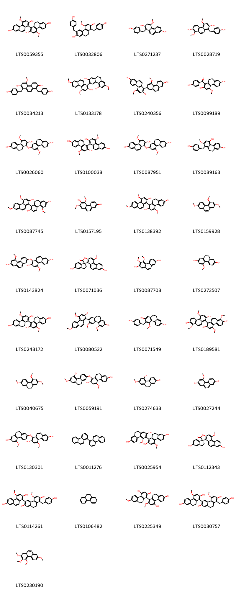{ group="compound" description="Cấu trúc hóa học của các hoạt chất thuộc nhóm *Phenanthrenes and derivatives* là blestriarene b [(LTS0059355)](https://lotus.naturalproducts.net/compound/lotus_id/LTS0059355), 1,6-bis[(4-hydroxyphenyl)methyl]-4-methoxy-9,10-dihydrophenanthrene-2,7-diol [(LTS0032806)](https://lotus.naturalproducts.net/compound/lotus_id/LTS0032806), 1-[(4-hydroxyphenyl)methyl]-4-methoxyphenanthrene-2,7-diol [(LTS0271237)](https://lotus.naturalproducts.net/compound/lotus_id/LTS0271237), 1-[(4-hydroxyphenyl)methyl]-4,8-dimethoxyphenanthrene-2,7-diol [(LTS0028719)](https://lotus.naturalproducts.net/compound/lotus_id/LTS0028719), 1,8-bis[(4-hydroxyphenyl)methyl]-4-methoxyphenanthrene-2,7-diol [(LTS0034213)](https://lotus.naturalproducts.net/compound/lotus_id/LTS0034213), 4,7,7'-trimethoxy-9',10'-dihydro-[1,3'-biphenanthrene]-2,2',5'-triol [(LTS0133178)](https://lotus.naturalproducts.net/compound/lotus_id/LTS0133178), 4,4'-dimethoxy-[1,2'-biphenanthrene]-2,7,7'-triol [(LTS0240356)](https://lotus.naturalproducts.net/compound/lotus_id/LTS0240356), 1-(4-hydroxybenzoyl)-4-methoxy-9,10-dihydrophenanthrene-2,7-diol [(LTS0099189)](https://lotus.naturalproducts.net/compound/lotus_id/LTS0099189), 1-[(7-hydroxy-4-methoxy-9,10-dihydrophenanthren-2-yl)oxy]-4-methoxy-9,10-dihydrophenanthrene-2,7-diol [(LTS0026060)](https://lotus.naturalproducts.net/compound/lotus_id/LTS0026060), 4,4'-dimethoxy-[1,1'-biphenanthrene]-2,2',7,7'-tetrol [(LTS0100038)](https://lotus.naturalproducts.net/compound/lotus_id/LTS0100038), 1-[(7-hydroxy-4-methoxy-9,10-dihydrophenanthren-2-yl)oxy]-4-methoxyphenanthrene-2,7-diol [(LTS0087951)](https://lotus.naturalproducts.net/compound/lotus_id/LTS0087951), 8-[(4-hydroxyphenyl)methyl]-7-methoxy-9,10-dihydrophenanthrene-2,5-diol [(LTS0089163)](https://lotus.naturalproducts.net/compound/lotus_id/LTS0089163), 4',5,7'-trimethoxy-9,10-dihydro-[1,1'-biphenanthrene]-2,2',7-triol [(LTS0087745)](https://lotus.naturalproducts.net/compound/lotus_id/LTS0087745), 5,7-dimethoxyphenanthrene-2,6-diol [(LTS0157195)](https://lotus.naturalproducts.net/compound/lotus_id/LTS0157195), 4,4',7'-trimethoxy-9,10-dihydro-[1,1'-biphenanthrene]-2,2',7-triol [(LTS0138392)](https://lotus.naturalproducts.net/compound/lotus_id/LTS0138392), 2,4,7-trimethoxyphenanthrene [(LTS0159928)](https://lotus.naturalproducts.net/compound/lotus_id/LTS0159928), 1-[(7-hydroxy-5-methoxyphenanthren-2-yl)oxy]-4-methoxyphenanthrene-2,7-diol [(LTS0143824)](https://lotus.naturalproducts.net/compound/lotus_id/LTS0143824), 5,7'-dihydroxy-10'-methoxy-2,3-dihydrospiro[indene-1,3'-phenanthro[2,1-b]furan]-2'-one [(LTS0071036)](https://lotus.naturalproducts.net/compound/lotus_id/LTS0071036), nudol [(LTS0087708)](https://lotus.naturalproducts.net/compound/lotus_id/LTS0087708), 4-methoxy-9,10-dihydrophenanthrene-2,7-diol [(LTS0272507)](https://lotus.naturalproducts.net/compound/lotus_id/LTS0272507), 4,4'-dimethoxy-9h,9'h,10h,10'h-[1,1'-biphenanthrene]-2,2',7,7'-tetrol [(LTS0248172)](https://lotus.naturalproducts.net/compound/lotus_id/LTS0248172), 3',4,5',7-tetramethoxy-9',10'-dihydro-[1,2'-biphenanthrene]-2,7'-diol [(LTS0080522)](https://lotus.naturalproducts.net/compound/lotus_id/LTS0080522), 3-[(4-hydroxyphenyl)methyl]-4-methoxy-9,10-dihydrophenanthrene-2,7-diol [(LTS0071549)](https://lotus.naturalproducts.net/compound/lotus_id/LTS0071549), 4,4',8,8'-tetramethoxy-[1,1'-biphenanthrene]-2,2',7,7'-tetrol [(LTS0189581)](https://lotus.naturalproducts.net/compound/lotus_id/LTS0189581), 2,4,7-trimethoxy-9,10-dihydrophenanthrene [(LTS0040675)](https://lotus.naturalproducts.net/compound/lotus_id/LTS0040675), 1-[(5-hydroxy-7-methoxy-9,10-dihydrophenanthren-2-yl)oxy]-4-methoxy-9,10-dihydrophenanthrene-2,7-diol [(LTS0059191)](https://lotus.naturalproducts.net/compound/lotus_id/LTS0059191), 7-methoxy-9,10-dihydrophenanthrene-2,5-diol [(LTS0274638)](https://lotus.naturalproducts.net/compound/lotus_id/LTS0274638), 4-methoxyphenanthrene-2,7-diol [(LTS0027244)](https://lotus.naturalproducts.net/compound/lotus_id/LTS0027244), 1-[(7-hydroxy-5-methoxy-9,10-dihydrophenanthren-2-yl)oxy]-4-methoxyphenanthrene-2,7-diol [(LTS0130301)](https://lotus.naturalproducts.net/compound/lotus_id/LTS0130301), 1,1'-biphenanthrene [(LTS0011276)](https://lotus.naturalproducts.net/compound/lotus_id/LTS0011276), 4,4'-dimethoxy-9h,9'h,10h,10'h-[1,3'-biphenanthrene]-2,2',7,7'-tetrol [(LTS0025954)](https://lotus.naturalproducts.net/compound/lotus_id/LTS0025954), (1r)-5,7'-dihydroxy-10'-methoxy-2,3-dihydrospiro[indene-1,3'-phenanthro[2,1-b]furan]-2'-one [(LTS0112343)](https://lotus.naturalproducts.net/compound/lotus_id/LTS0112343), 8'-[(4-hydroxyphenyl)methyl]-4,5'-dimethoxy-9',10'-dihydro-[1,3'-biphenanthrene]-2,2',7,7'-tetrol [(LTS0114261)](https://lotus.naturalproducts.net/compound/lotus_id/LTS0114261), 1,2-dihydrophenanthrene [(LTS0106482)](https://lotus.naturalproducts.net/compound/lotus_id/LTS0106482), 2',7-dimethoxy-9h,9'h,10h,10'h-[1,1'-biphenanthrene]-2,4,4',7'-tetrol [(LTS0225349)](https://lotus.naturalproducts.net/compound/lotus_id/LTS0225349), 8'-[(4-hydroxyphenyl)methyl]-4,5'-dimethoxy-9h,9'h,10h,10'h-[1,3'-biphenanthrene]-2,2',7,7'-tetrol [(LTS0030757)](https://lotus.naturalproducts.net/compound/lotus_id/LTS0030757), 2,3,4,7-tetramethoxyphenanthrene [(LTS0230190)](https://lotus.naturalproducts.net/compound/lotus_id/LTS0230190)." }

                                                              
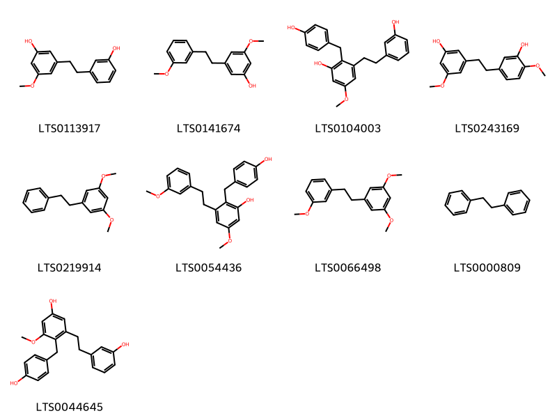{ group="compound" description="Cấu trúc hóa học của các hoạt chất thuộc nhóm *Stilbenes* là 3-[2-(3-hydroxyphenyl)ethyl]-5-methoxyphenol [(LTS0113917)](https://lotus.naturalproducts.net/compound/lotus_id/LTS0113917), 3'-o-methylbatatasin iii [(LTS0141674)](https://lotus.naturalproducts.net/compound/lotus_id/LTS0141674), 3-[2-(3-hydroxyphenyl)ethyl]-2-[(4-hydroxyphenyl)methyl]-5-methoxyphenol [(LTS0104003)](https://lotus.naturalproducts.net/compound/lotus_id/LTS0104003), 3-[2-(3-hydroxy-4-methoxyphenyl)ethyl]-5-methoxyphenol [(LTS0243169)](https://lotus.naturalproducts.net/compound/lotus_id/LTS0243169), 1,3-dimethoxy-5-(2-phenylethyl)benzene [(LTS0219914)](https://lotus.naturalproducts.net/compound/lotus_id/LTS0219914), 2-[(4-hydroxyphenyl)methyl]-5-methoxy-3-[2-(3-methoxyphenyl)ethyl]phenol [(LTS0054436)](https://lotus.naturalproducts.net/compound/lotus_id/LTS0054436), 1,3-dimethoxy-5-[2-(3-methoxyphenyl)ethyl]benzene [(LTS0066498)](https://lotus.naturalproducts.net/compound/lotus_id/LTS0066498), dibenzyl [(LTS0000809)](https://lotus.naturalproducts.net/compound/lotus_id/LTS0000809), 3-[2-(3-hydroxyphenyl)ethyl]-4-[(4-hydroxyphenyl)methyl]-5-methoxyphenol [(LTS0044645)](https://lotus.naturalproducts.net/compound/lotus_id/LTS0044645)." }

                                                              
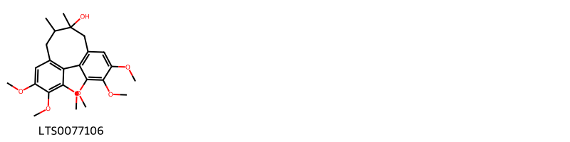{ group="compound" description="Cấu trúc hóa học của các hoạt chất thuộc nhóm *Tannins* là 3,4,5,14,15,16-hexamethoxy-9,10-dimethyltricyclo[10.4.0.0²,⁷]hexadeca-1(12),2(7),3,5,13,15-hexaen-9-ol [(LTS0077106)](https://lotus.naturalproducts.net/compound/lotus_id/LTS0077106)." }

:::

---

## IV. Tác dụng dược lý

Theo tài liệu quốc tế: 1. To stop bleeding; 2. To reduce swelling and promote healing

---

## V. Dược điển Việt Nam V

### Soi bột

Màu trắng ngà hay vàng nhạt, hơi ánh nâu. Soi kính hiển vi thấy: Các mành tế bào biểu bì thành dày, hóa gỗ, không phẳng, có những ống lỗ rõ rệt. Tinh thể calci oxalat hình kim dài 18 µm đến 88 µm có trong các tế bào lớn, hình gần tròn, chứa chất nhày hoặc nằm rải rác bên ngoài. Bó sợi đường kính 11 µm đến 30 µm, thành tế bào hóa gỗ có lỗ hình bầu dục hay hình chữ V. Các mạch thang, mạch vạch, mạch xoắn đường kính 10 µm đến 32 µm. Khối hạt tinh bột hồ hóa không màu.

::: {#listing-soibot}
:::

### Vi phẫu

nan

::: {#listing-viphau}
:::

### Định tính

Phương pháp sắc ký lớp mỏng (Phụ lục 5.4). Bản mỏng: Silica gel G. Dung môi khai triển: Cyclohexan – ethyl acetat – methanol (6: 2,5:1). Dung dịch thử: Lấy 2g bột dược liệu vào bình nón, thêm 20 ml methanol 70 % (TT), lắc siêu âm 30 min, lọc. Bốc hơi dịch lọc đến khô, hòa tan cắn trong 20 ml nước. Tiến hành chiết 2 lần, mỗi lần với 20 ml ether (TT), gộp các dịch chiết ether, bốc hơi tới còn 1 ml. Dung dịch đối chiếu: Lấy 1 g bột Bạch cập (mẫu chuẩn), tiến hành chiết như mô tả ở phần Dung dịch thử. Cách tiến hành: Chấm riêng biệt lên bản mỏng 5 pl dung dịch thử và 10 pl dung dịch đổi chiếu. Sau khi triển khai sắc ký, lấy bản mỏng ra, để khô trong không khí. Phun dung dịch acid sulfuric 10% trong ethanol (TT), sấy ở 105 ºC trong vài phút, để yên 30 min đến 60 min. Quan sát dưới ánh sáng thường. Trên sắc ký đồ của dung dịch thử phải có các vết cùng màu sắc và giá trị Rf với các vết trên sắc ký đồ của dung dịch đối chiếu. Quan sát dưới ánh sáng từ ngoại ở bước sóng 366 nm. Trên sắc ký đồ của dung dịch thử phải có các vết phát quang cùng giá trị Rf và màu sắc với các vết trên sắc ký đồ của dung dịch đối chiếu.

### Định lượng

nan

### Thông tin khác 

- **Độ ẩm:** Không quá 15,0 % (Phụ lục 9.6, 1 g, 105 °C, 5 h).
- **Bảo quản:** Để nơi khô, thoáng.

## VI. Dược điển Hồng kong

::: {#listing-DDHK}
:::

---

## VII. Y dược học cổ truyền

::: {.callout-note title = "nan" }

**Tên vị thuốc:** nan

**Tính:** Bình

**Vị:** Khổ

**Quy kinh:**  Phế

**Công năng chủ trị:** Khổ, cam, sáp, vi hàn. Vào kinh phế, vị.

**Phân loại theo thông tư:** Chỉ huyết

**Tác dụng theo y dược cổ truyền:** nan

**Chú ý:** nan

**Kiêng kỵ:** Không kết hợp với các loại thuốc Ô đầu (Ô đầu, Phụ tử, Thiên hùng). 

:::

::: {#listing-ViThuoc}
:::

