::: {.callout-note title = "Tóm tắt"}

Thiên ma có tên khoa học Gastrodia elata BI, họ Lan (Orchidaceae). Có nguồn gốc từ Assam, Trung Quốc, Đông Himalaya, Nội Mông, Nhật Bản,... Tại Việt Nam, loại thảo dược này chủ yếu phân bố ở các tỉnh vùng núi (Lạng Sơn, Hòa Bình…). Dân gian sử dụng trị đau đầu hoa mắt chóng mặt bằng bài thuốc: thiên ma 15g, xuyên khung 5g, chế thành hoàn, mỗi lần uống 3 – 6g, ngày 3 lần; trị đau khớp, chân tay tê dại bằng bài thuốc: ngưu tất 10g, thiên ma 10g, toàn yết 3g, nhũ hương 5g, tán bột mịn hồ làm hoàn hoặc sắc uống. Thiên ma có tác dụng an thần chống co giật, làm giảm đau, kháng viêm, tăng cường lưu lượng máu ở tim và não, làm giảm lực cản của mạch máu, làm giãn mạch ngoại vi, có tác dụng hạ áp, làm chậm nhịp tim, nâng cao sức chịu đựng thiếu oxy của động vật thí nghiệm, ngoài ra polysaccharide của thiên ma có hoạt tính miễn dịch. Thành phần hóa học chứa thành phần chủ yếu là gastrodin với hàm lượng 0,16-1,18% , gastrdiosid, benzyl citrat, acid succinic, acid citric cùng với monomethyl ester, acid palmitic, sucrose, 𝛃-sitosterol và các Polysaccharide, Vanillyl alcohol.

:::

## I. Thông tin về dược liệu 

::: {.panel-tabset}

### Định danh

- Dược liệu tiếng Việt: Thiên Ma - Thân Rễ
- Dược liệu tiếng Trung: 天麻 (Tian Ma)
- Dược liệu tiếng Anh: Gastrodia Elata
- Dược liệu latin thông dụng: Rhizoma Gastrodiae Elatae
- Dược liệu latin kiểu DĐVN: *Rhizoma Gastrodiae Elatae*
- Dược liệu latin kiểu DĐVN: *Rhizoma Gastrodiae*
- Dược liệu latin kiểu thông tư: *nan*
- Bộ phận dùng: Thân Rễ (Rhizoma)

### Mô tả dược liệu 

**Theo dược điển Việt nam V:** Thân rễ hình bàu dục hoặc hình trụ dẹt hơi cong, dài 3 cm đến 15 cm, rộng 1,5 cm đến 6 cm, dày 0,5 cm đến 2 cm. Mặt ngoài màu trắng hơi vàng đến vàng nâu, có vân nhăn dọc và nhiều vân vòng tròn ngang của những chồi búp tiềm tàng, đôi khi thấy những dải nhỏ màu nâu. Phía đỉnh (đầu) dược liệu có những chồi hình mỏ vẹt, màu nâu đỏ đến nâu sẫm hoặc có vết thân; phía đuôi có một vết sẹo tròn. Chất cứng rắn như sừng, khó bẻ gãy, mặt bè tương đối phẳng, màu trắng hơi vàng đến màu nâu. Mùi nhẹ, vị hơi ngọt. 
 
**Mô tả dược liệu theo thông tư chế biến dược liệu theo phương pháp cổ truyền:** nan

### Chế biến 

**Chế biến theo dược điển việt nam V**: Thu hoạch từ mùa đông năm trước đến mùa xuân năm sau, rửa sạch ngay, đo kỹ, trái mỏng, sảy khô ở nhiệt độ thấp. Bào chế Rửa sạch, u mềm hay đồ đến mềm, thái lát mỏng, phơi hoặc sấy khô. 

**Chế biến theo thông tư:** nan

::: 

## II. Thông tin về thực vật

Dược liệu **Thiên Ma - Thân Rễ** từ bộ phận **Thân Rễ** từ loài *Gastrodia elata*.

**Mô tả thực vật:** Thân rễ hình bầu dục hoặc dạng thanh mỏng, quăn lại và hơi cong queo, dài 3 – 15cm, rộng 1,5 – 6cm, dày 0,5 – 2cm.
Mặt ngoài màu trắng đến hơi vàng, hoặc nâu hơi vàng, có vân nhăn dọc và nhiều vân vòng tròn ngang của những chồi búp tiềm tàng, đôi khi là những cuống noãn màu nâu hiện ra rõ rệt.
Đỉnh dược liệu có những chồi hình mỏ vẹt, màu nâu đỏ đến nâu sẫm hoặc có những vết của thân;
Phía dưới có một vết sẹo tròn. Chất cứng rắn như sừng, khó bẻ gãy, mặt bẻ tương đối phẳng, màu trắng hơi vàng đến màu nâu.
Mùi nhẹ, vị hơi ngọt.

*Tài liệu tham khảo:* "Những cây thuốc và vị thuốc Việt Nam" - Đỗ Tất Lợi 
Trong dược điển Việt nam, loài *Gastrodia elata* được sử dụng làm dược liệu.

            
::: {.callout-note title = "Phân loại thực vật của *Gastrodia elata*"}

**Kingdom:** Plantae 

**Phylum:** Tracheophyta 

**Order:** Asparagales 
 
**Family:** Orchidaceae 
 
**Genus:** Gastrodia 
 
**Species:** *Gastrodia elata* 
 

:::

::: {style="display: grid;grid-template-columns: repeat(auto-fill, minmax(150px, 1fr));grid-gap: 1em;"}
{ group="GIBF" }

{ group="GIBF" }

{ group="GIBF" }

{ group="GIBF" }

{ group="GIBF" }

{ group="GIBF" }

{ group="GIBF" }

{ group="GIBF" }
:::

**Phân bố trên thế giới:** nan, Russian Federation, China, Chinese Taipei, Japan, Bhutan, Korea, Republic of

**Phân bố tại Việt nam:** Không có ghi nhận ở Việt Nam

<iframe src="Rhizoma Gastrodiae Elatae/map_distribution.html" width="100%" height="600" style="border:none;"></iframe>

## III. Thành phần hóa học

Theo tài liệu của GS. Đỗ Tất Lợi:  chứa thành phần chủ yếu là
gastrodin với hàm lượng 0,16-1,18% , gastrdiosid, benzyl citrat, acid succinic, acid citric cùng với monomethyl ester, acid palmitic, sucrose, 𝛃-sitosterol và các Polysaccharide,  Vanillyl alcohol.
    

Theo cơ sở dữ liệu lotus, loài *Gastrodia elata* đã phân lập và xác định được **82** hoạt chất thuộc về các nhóm Stilbenes, Purine nucleosides, Phenol ethers, Diarylheptanoids, Steroids and steroid derivatives, Depsides and depsidones, Pyrimidine nucleosides, Organooxygen compounds, Benzene and substituted derivatives, Diazines, Imidazopyrimidines, Carboxylic acids and derivatives, Fatty Acyls, Phenols, Prenol lipids trong bảng dưới đây.
        
| chemicalTaxonomyClassyfireClass     |   smiles_count |
|:------------------------------------|---------------:|
| Benzene and substituted derivatives |            313 |
| Carboxylic acids and derivatives    |            135 |
| Depsides and depsidones             |             91 |
| Diarylheptanoids                    |             37 |
| Diazines                            |             41 |
| Fatty Acyls                         |            138 |
| Imidazopyrimidines                  |             18 |
| Organooxygen compounds              |           1681 |
| Phenol ethers                       |            110 |
| Phenols                             |             95 |
| Prenol lipids                       |            127 |
| Purine nucleosides                  |            411 |
| Pyrimidine nucleosides              |            121 |
| Steroids and steroid derivatives    |            414 |
| Stilbenes                           |             24 |

Danh sách chi tiết các hoạt chất như sau: 

::: {style="display: grid;grid-template-columns: repeat(auto-fill, minmax(150px, 1fr));grid-gap: 1em;"}

                                                              
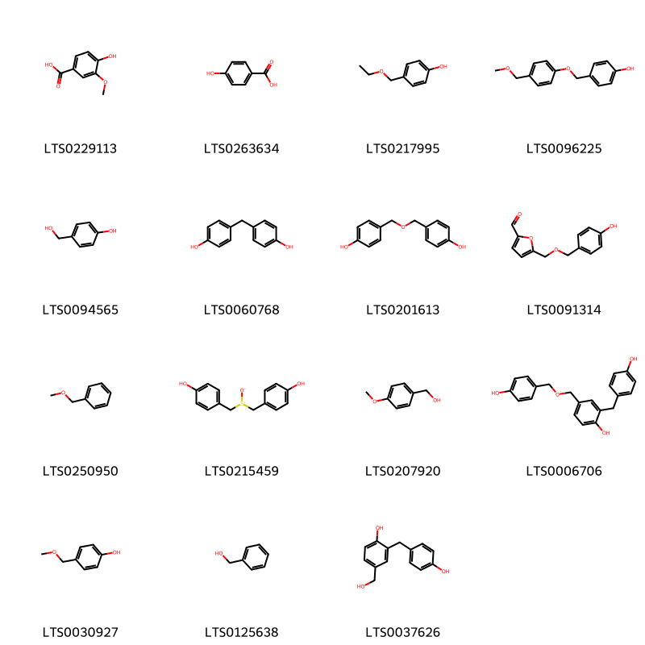{ group="compound" description="Cấu trúc hóa học của các hoạt chất thuộc nhóm *Benzene and substituted derivatives* là vanillic acid [(LTS0229113)](https://lotus.naturalproducts.net/compound/lotus_id/LTS0229113), p-hydroxybenzoic acid [(LTS0263634)](https://lotus.naturalproducts.net/compound/lotus_id/LTS0263634), 4-(ethoxymethyl)phenol [(LTS0217995)](https://lotus.naturalproducts.net/compound/lotus_id/LTS0217995), 4-[4-(methoxymethyl)phenoxymethyl]phenol [(LTS0096225)](https://lotus.naturalproducts.net/compound/lotus_id/LTS0096225), gastrodigenin [(LTS0094565)](https://lotus.naturalproducts.net/compound/lotus_id/LTS0094565), bisphenol f [(LTS0060768)](https://lotus.naturalproducts.net/compound/lotus_id/LTS0060768), bis-(4-hydroxybenzyl)ether [(LTS0201613)](https://lotus.naturalproducts.net/compound/lotus_id/LTS0201613), 5-{[(4-hydroxyphenyl)methoxy]methyl}furan-2-carbaldehyde [(LTS0091314)](https://lotus.naturalproducts.net/compound/lotus_id/LTS0091314), benzyl methyl ether [(LTS0250950)](https://lotus.naturalproducts.net/compound/lotus_id/LTS0250950), 4-[(4-hydroxyphenyl)methanesulfinylmethyl]phenol [(LTS0215459)](https://lotus.naturalproducts.net/compound/lotus_id/LTS0215459), anise alcohol [(LTS0207920)](https://lotus.naturalproducts.net/compound/lotus_id/LTS0207920), gastrol [(LTS0006706)](https://lotus.naturalproducts.net/compound/lotus_id/LTS0006706), p-(methoxymethyl)phenol [(LTS0030927)](https://lotus.naturalproducts.net/compound/lotus_id/LTS0030927), benzyl alcohol [(LTS0125638)](https://lotus.naturalproducts.net/compound/lotus_id/LTS0125638), 4-(hydroxymethyl)-2-[(4-hydroxyphenyl)methyl]phenol [(LTS0037626)](https://lotus.naturalproducts.net/compound/lotus_id/LTS0037626)." }

                                                              
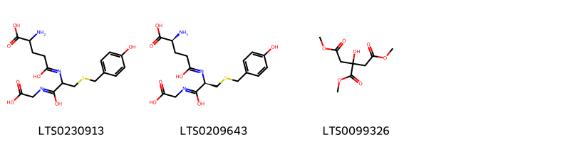{ group="compound" description="Cấu trúc hóa học của các hoạt chất thuộc nhóm *Carboxylic acids and derivatives* là 2-amino-4-{[1-(carboxymethyl-c-hydroxycarbonimidoyl)-2-{[(4-hydroxyphenyl)methyl]sulfanyl}ethyl]-c-hydroxycarbonimidoyl}butanoic acid [(LTS0230913)](https://lotus.naturalproducts.net/compound/lotus_id/LTS0230913), (2s)-2-amino-4-{[(1r)-1-(carboxymethyl-c-hydroxycarbonimidoyl)-2-{[(4-hydroxyphenyl)methyl]sulfanyl}ethyl]-c-hydroxycarbonimidoyl}butanoic acid [(LTS0209643)](https://lotus.naturalproducts.net/compound/lotus_id/LTS0209643), trimethyl citrate [(LTS0099326)](https://lotus.naturalproducts.net/compound/lotus_id/LTS0099326)." }

                                                              
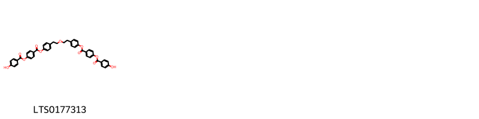{ group="compound" description="Cấu trúc hóa học của các hoạt chất thuộc nhóm *Depsides and depsidones* là 4-[2-(2-{4-[4-(4-hydroxybenzoyloxy)benzoyloxy]phenyl}ethoxy)ethyl]phenyl 4-(4-hydroxybenzoyloxy)benzoate [(LTS0177313)](https://lotus.naturalproducts.net/compound/lotus_id/LTS0177313)." }

                                                              
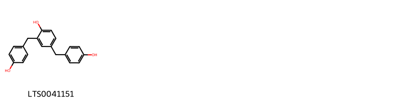{ group="compound" description="Cấu trúc hóa học của các hoạt chất thuộc nhóm *Diarylheptanoids* là 2,4-bis(4-hydroxybenzyl)phenol [(LTS0041151)](https://lotus.naturalproducts.net/compound/lotus_id/LTS0041151)." }

                                                              
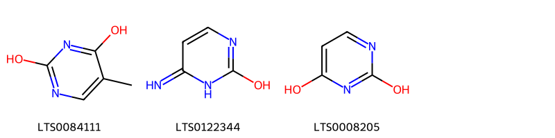{ group="compound" description="Cấu trúc hóa học của các hoạt chất thuộc nhóm *Diazines* là 5-methylpyrimidine-2,4-dione [(LTS0084111)](https://lotus.naturalproducts.net/compound/lotus_id/LTS0084111), 4-aminouracil [(LTS0122344)](https://lotus.naturalproducts.net/compound/lotus_id/LTS0122344), pirod [(LTS0008205)](https://lotus.naturalproducts.net/compound/lotus_id/LTS0008205)." }

                                                              
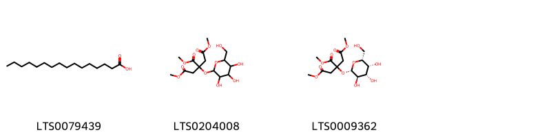{ group="compound" description="Cấu trúc hóa học của các hoạt chất thuộc nhóm *Fatty Acyls* là palmitic acid [(LTS0079439)](https://lotus.naturalproducts.net/compound/lotus_id/LTS0079439), 1,2,3-trimethyl 2-{[3,4,5-trihydroxy-6-(hydroxymethyl)oxan-2-yl]oxy}propane-1,2,3-tricarboxylate [(LTS0204008)](https://lotus.naturalproducts.net/compound/lotus_id/LTS0204008), 1,2,3-trimethyl 2-{[(2s,3r,4s,5r,6r)-3,4,5-trihydroxy-6-(hydroxymethyl)oxan-2-yl]oxy}propane-1,2,3-tricarboxylate [(LTS0009362)](https://lotus.naturalproducts.net/compound/lotus_id/LTS0009362)." }

                                                              
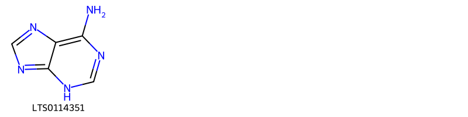{ group="compound" description="Cấu trúc hóa học của các hoạt chất thuộc nhóm *Imidazopyrimidines* là leucon [(LTS0114351)](https://lotus.naturalproducts.net/compound/lotus_id/LTS0114351)." }

                                                              
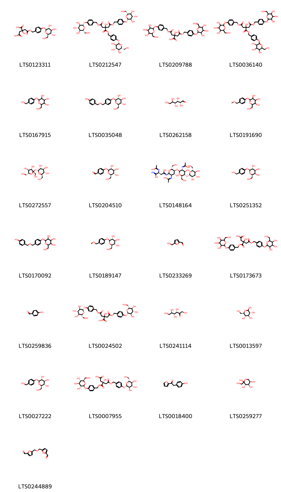{ group="compound" description="Cấu trúc hóa học của các hoạt chất thuộc nhóm *Organooxygen compounds* là 2-hydroxy-2-{2-oxo-2-[(4-{[(2s,3r,4s,5s,6r)-3,4,5-trihydroxy-6-(hydroxymethyl)oxan-2-yl]oxy}phenyl)methoxy]ethyl}butanedioic acid [(LTS0123311)](https://lotus.naturalproducts.net/compound/lotus_id/LTS0123311), 1,2,3-tris[(4-{[(2s,3r,4s,5s,6r)-3,4,5-trihydroxy-6-(hydroxymethyl)oxan-2-yl]oxy}phenyl)methyl] 2-hydroxypropane-1,2,3-tricarboxylate [(LTS0212547)](https://lotus.naturalproducts.net/compound/lotus_id/LTS0212547), 2-hydroxy-4-oxo-2-{2-oxo-2-[(4-{[3,4,5-trihydroxy-6-(hydroxymethyl)oxan-2-yl]oxy}phenyl)methoxy]ethyl}-4-[(4-{[3,4,5-trihydroxy-6-(hydroxymethyl)oxan-2-yl]oxy}phenyl)methoxy]butanoic acid [(LTS0209788)](https://lotus.naturalproducts.net/compound/lotus_id/LTS0209788), 1,2,3-tris[(4-{[3,4,5-trihydroxy-6-(hydroxymethyl)oxan-2-yl]oxy}phenyl)methyl] 2-hydroxypropane-1,2,3-tricarboxylate [(LTS0036140)](https://lotus.naturalproducts.net/compound/lotus_id/LTS0036140), 2-(hydroxymethyl)-6-[4-(hydroxymethyl)phenoxy]oxane-3,4,5-triol [(LTS0167915)](https://lotus.naturalproducts.net/compound/lotus_id/LTS0167915), (2r,3s,4s,5r,6s)-2-(hydroxymethyl)-6-(4-{[(4-hydroxyphenyl)methoxy]methyl}phenoxy)oxane-3,4,5-triol [(LTS0035048)](https://lotus.naturalproducts.net/compound/lotus_id/LTS0035048), (+)-glucose [(LTS0262158)](https://lotus.naturalproducts.net/compound/lotus_id/LTS0262158), 2-(hydroxymethyl)-6-[4-(methoxymethyl)phenoxy]oxane-3,4,5-triol [(LTS0191690)](https://lotus.naturalproducts.net/compound/lotus_id/LTS0191690), sucrose [(LTS0272557)](https://lotus.naturalproducts.net/compound/lotus_id/LTS0272557), 4-{[(2s,3r,4s,5s,6r)-3,4,5-trihydroxy-6-(hydroxymethyl)oxan-2-yl]oxy}benzaldehyde [(LTS0204510)](https://lotus.naturalproducts.net/compound/lotus_id/LTS0204510), (2s)-n'-[(3r,4r,5s,6r)-4-hydroxy-5-{[(2s,3r,4r,5s,6r)-4-hydroxy-3-[(1-hydroxyethylidene)amino]-6-(hydroxymethyl)-5-{[(2s,3s,4s,5s,6r)-3,4,5-trihydroxy-6-(hydroxymethyl)oxan-2-yl]oxy}oxan-2-yl]oxy}-3-[(1-hydroxyethylidene)amino]-6-(hydroxymethyl)oxan-2-yl]-2-[(1-hydroxyethylidene)amino]butanediimidic acid [(LTS0148164)](https://lotus.naturalproducts.net/compound/lotus_id/LTS0148164), (2r,3r,4s,5r,6s)-2-(hydroxymethyl)-6-[4-(hydroxymethyl)phenoxy]oxane-3,4,5-triol [(LTS0251352)](https://lotus.naturalproducts.net/compound/lotus_id/LTS0251352), 2-(hydroxymethyl)-6-(4-{[(4-hydroxyphenyl)methoxy]methyl}phenoxy)oxane-3,4,5-triol [(LTS0170092)](https://lotus.naturalproducts.net/compound/lotus_id/LTS0170092), (2r,3s,4s,5r,6s)-2-(hydroxymethyl)-6-[4-(methoxymethyl)phenoxy]oxane-3,4,5-triol [(LTS0189147)](https://lotus.naturalproducts.net/compound/lotus_id/LTS0189147), hydroxymethylfurfural [(LTS0233269)](https://lotus.naturalproducts.net/compound/lotus_id/LTS0233269), 3-hydroxy-5-oxo-5-[(4-{[3,4,5-trihydroxy-6-(hydroxymethyl)oxan-2-yl]oxy}phenyl)methoxy]-3-{[(4-{[3,4,5-trihydroxy-6-(hydroxymethyl)oxan-2-yl]oxy}phenyl)methoxy]carbonyl}pentanoic acid [(LTS0173673)](https://lotus.naturalproducts.net/compound/lotus_id/LTS0173673), p-hydroxybenzaldehyde [(LTS0259836)](https://lotus.naturalproducts.net/compound/lotus_id/LTS0259836), 2-hydroxy-4-oxo-2-{2-oxo-2-[(4-{[(2s,3r,4s,5s,6r)-3,4,5-trihydroxy-6-(hydroxymethyl)oxan-2-yl]oxy}phenyl)methoxy]ethyl}-4-[(4-{[(2s,3r,4s,5s,6r)-3,4,5-trihydroxy-6-(hydroxymethyl)oxan-2-yl]oxy}phenyl)methoxy]butanoic acid [(LTS0024502)](https://lotus.naturalproducts.net/compound/lotus_id/LTS0024502), keto-d-fructose [(LTS0241114)](https://lotus.naturalproducts.net/compound/lotus_id/LTS0241114), glucose [(LTS0013597)](https://lotus.naturalproducts.net/compound/lotus_id/LTS0013597), gastrodin [(LTS0027222)](https://lotus.naturalproducts.net/compound/lotus_id/LTS0027222), (3r)-3-hydroxy-5-oxo-5-[(4-{[(2s,3r,4s,5s,6r)-3,4,5-trihydroxy-6-(hydroxymethyl)oxan-2-yl]oxy}phenyl)methoxy]-3-{[(4-{[(2s,3r,4s,5s,6r)-3,4,5-trihydroxy-6-(hydroxymethyl)oxan-2-yl]oxy}phenyl)methoxy]carbonyl}pentanoic acid [(LTS0007955)](https://lotus.naturalproducts.net/compound/lotus_id/LTS0007955), 1-(furan-2-yl)-2-(4-hydroxyphenyl)ethanone [(LTS0018400)](https://lotus.naturalproducts.net/compound/lotus_id/LTS0018400), d-fructopyranose [(LTS0259277)](https://lotus.naturalproducts.net/compound/lotus_id/LTS0259277), 5-{[(5-formylfuran-2-yl)methoxy]methyl}furan-2-carbaldehyde [(LTS0244889)](https://lotus.naturalproducts.net/compound/lotus_id/LTS0244889)." }

                                                              
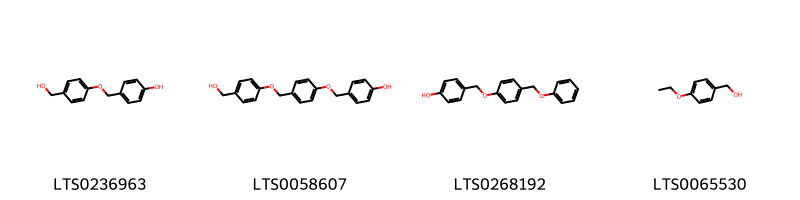{ group="compound" description="Cấu trúc hóa học của các hoạt chất thuộc nhóm *Phenol ethers* là 4-[4-(hydroxymethyl)phenoxymethyl]phenol [(LTS0236963)](https://lotus.naturalproducts.net/compound/lotus_id/LTS0236963), 4-{4-[4-(hydroxymethyl)phenoxymethyl]phenoxymethyl}phenol [(LTS0058607)](https://lotus.naturalproducts.net/compound/lotus_id/LTS0058607), 4-[4-(phenoxymethyl)phenoxymethyl]phenol [(LTS0268192)](https://lotus.naturalproducts.net/compound/lotus_id/LTS0268192), (4-ethoxyphenyl)methanol [(LTS0065530)](https://lotus.naturalproducts.net/compound/lotus_id/LTS0065530)." }

                                                              
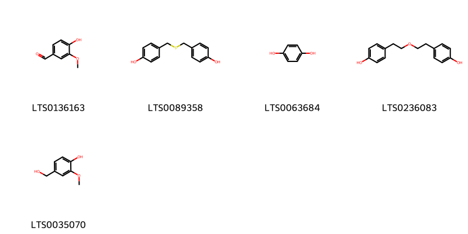{ group="compound" description="Cấu trúc hóa học của các hoạt chất thuộc nhóm *Phenols* là vanillin [(LTS0136163)](https://lotus.naturalproducts.net/compound/lotus_id/LTS0136163), bis-(4-hydroxybenzyl)sulfide [(LTS0089358)](https://lotus.naturalproducts.net/compound/lotus_id/LTS0089358), α-hydroquinone [(LTS0063684)](https://lotus.naturalproducts.net/compound/lotus_id/LTS0063684), 4-{2-[2-(4-hydroxyphenyl)ethoxy]ethyl}phenol [(LTS0236083)](https://lotus.naturalproducts.net/compound/lotus_id/LTS0236083), vanillyl alcohol [(LTS0035070)](https://lotus.naturalproducts.net/compound/lotus_id/LTS0035070)." }

                                                              
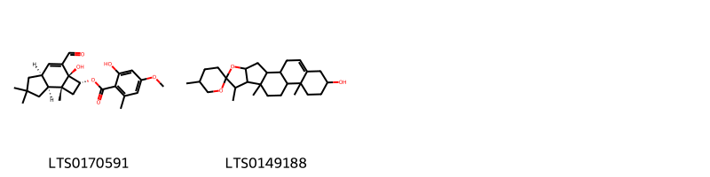{ group="compound" description="Cấu trúc hóa học của các hoạt chất thuộc nhóm *Prenol lipids* là (2r,2as,4as,7as,7br)-3-formyl-2a-hydroxy-6,6,7b-trimethyl-1h,2h,4ah,5h,7h,7ah-cyclobuta[e]inden-2-yl 2-hydroxy-4-methoxy-6-methylbenzoate [(LTS0170591)](https://lotus.naturalproducts.net/compound/lotus_id/LTS0170591), diosgenin [(LTS0149188)](https://lotus.naturalproducts.net/compound/lotus_id/LTS0149188)." }

                                                              
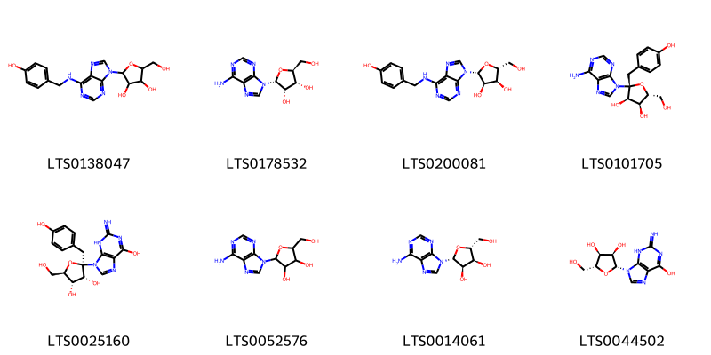{ group="compound" description="Cấu trúc hóa học của các hoạt chất thuộc nhóm *Purine nucleosides* là 2-(hydroxymethyl)-5-(6-{[(4-hydroxyphenyl)methyl]amino}purin-9-yl)oxolane-3,4-diol [(LTS0138047)](https://lotus.naturalproducts.net/compound/lotus_id/LTS0138047), (2r,3s,4r,5s)-2-(6-aminopurin-9-yl)-5-(hydroxymethyl)oxolane-3,4-diol [(LTS0178532)](https://lotus.naturalproducts.net/compound/lotus_id/LTS0178532), (2r,3s,4r,5r)-2-(hydroxymethyl)-5-(6-{[(4-hydroxyphenyl)methyl]amino}purin-9-yl)oxolane-3,4-diol [(LTS0200081)](https://lotus.naturalproducts.net/compound/lotus_id/LTS0200081), (2r,3r,4s,5r)-2-(6-aminopurin-9-yl)-5-(hydroxymethyl)-2-[(4-hydroxyphenyl)methyl]oxolane-3,4-diol [(LTS0101705)](https://lotus.naturalproducts.net/compound/lotus_id/LTS0101705), (2r,3r,4s,5r)-2-(6-hydroxy-2-imino-3h-purin-9-yl)-5-(hydroxymethyl)-2-[(4-hydroxyphenyl)methyl]oxolane-3,4-diol [(LTS0025160)](https://lotus.naturalproducts.net/compound/lotus_id/LTS0025160), adenosine [(LTS0052576)](https://lotus.naturalproducts.net/compound/lotus_id/LTS0052576), adenosine [(LTS0014061)](https://lotus.naturalproducts.net/compound/lotus_id/LTS0014061), ribonucleoside [(LTS0044502)](https://lotus.naturalproducts.net/compound/lotus_id/LTS0044502)." }

                                                              
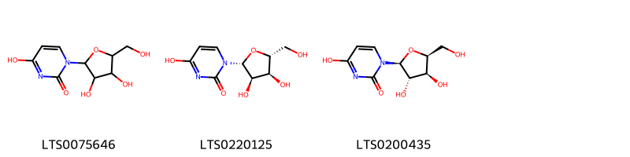{ group="compound" description="Cấu trúc hóa học của các hoạt chất thuộc nhóm *Pyrimidine nucleosides* là 1-[3,4-dihydroxy-5-(hydroxymethyl)oxolan-2-yl]-4-hydroxypyrimidin-2-one [(LTS0075646)](https://lotus.naturalproducts.net/compound/lotus_id/LTS0075646), uridine [(LTS0220125)](https://lotus.naturalproducts.net/compound/lotus_id/LTS0220125), 1-[(2s,3s,4s,5s)-3,4-dihydroxy-5-(hydroxymethyl)oxolan-2-yl]-4-hydroxypyrimidin-2-one [(LTS0200435)](https://lotus.naturalproducts.net/compound/lotus_id/LTS0200435)." }

                                                              
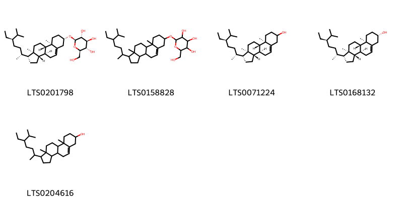{ group="compound" description="Cấu trúc hóa học của các hoạt chất thuộc nhóm *Steroids and steroid derivatives* là sitogluside [(LTS0201798)](https://lotus.naturalproducts.net/compound/lotus_id/LTS0201798), 2-{[1-(5-ethyl-6-methylheptan-2-yl)-9a,11a-dimethyl-1h,2h,3h,3ah,3bh,4h,6h,7h,8h,9h,9bh,10h,11h-cyclopenta[a]phenanthren-7-yl]oxy}-6-(hydroxymethyl)oxane-3,4,5-triol [(LTS0158828)](https://lotus.naturalproducts.net/compound/lotus_id/LTS0158828), stigmast-5-en-3-ol [(LTS0071224)](https://lotus.naturalproducts.net/compound/lotus_id/LTS0071224), sitosterol [(LTS0168132)](https://lotus.naturalproducts.net/compound/lotus_id/LTS0168132), stigmast-5-en-3-ol, (3β)- [(LTS0204616)](https://lotus.naturalproducts.net/compound/lotus_id/LTS0204616)." }

                                                              
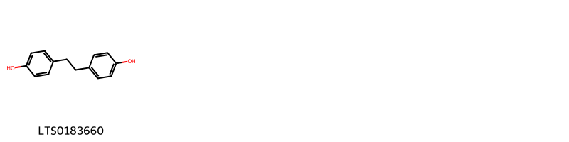{ group="compound" description="Cấu trúc hóa học của các hoạt chất thuộc nhóm *Stilbenes* là 4,4'-dihydroxybibenzyl [(LTS0183660)](https://lotus.naturalproducts.net/compound/lotus_id/LTS0183660)." }

:::

---

## IV. Tác dụng dược lý

Theo tài liệu quốc tế: To subdue the liver-wind and arrest convulsions.

---

## V. Dược điển Việt Nam V

### Soi bột

Bột màu trắng hơi vàng đến màu vàng nâu. Soi dưới kính hiên vi thấy: Tế bào mô mềm hình bầu dục hoặc đa số có hình nhiều cạnh, đường kính 70 µm đến 180 µm; thành dày 3 µm đến 8 µm, hóa gỗ, có lỗ rõ rệt. Tinh thể calci oxalat hình kim xếp thành bó hay rải rác, dài 25 µm đến 75 µm (có thể tới 93 µm). Khi ngâm trong thuốc thử glycerin – acid acetic (TT), thấy các tế bào mô mềm chứa polysaccharid đã bị hồ hóa không màu, một số tế bào chứa hạt tinh bột nhỏ hình trứng dài, bầu dục dài hoặc hình gần tròn, cho màu nâu hoặc tía hơi nâu với dung dịch iod-iodid (TT). Mảnh mạch xoắn, mạch mạng, đường kính 8 µm đến 30 µm.

::: {#listing-soibot}
:::

### Vi phẫu

nan

::: {#listing-viphau}
:::

### Định tính

A.Lấy 1 g bột dược liệu, thêm 10 ml nước, ngâm trong 4 h, thỉnh thoảng lắc đều, lọc. Thêm vào dịch lọc 2 giọt đến 4 giọt dung dịch iod-iodid (TT), sẽ hiện màu đỏ tím hay màu rượu vang đỏ. B. Phương pháp sắc ký lớp mỏng (Phụ lục 5.4). Bản mỏng: Silica gel G. Dung môi khai trien: Ethyl acetal – methanol – nước ( 9 :1 : 0,2). Dung dịch thử: Lấy khoảng 0,5 g bột dược liệu, thêm 5 ml methanol 70 % (TT), siêu âm trong 30 min, lọc. Dung dịch dược liệu đối chiếu: Lấy khoảng 0,5 g bột Thiên ma (mẫu chuẩn), chiết như mô tả ở phần Dung dịch thử. Dung dịch chất đối chiếu: Hòa tan gastrodin chuẩn trong methanol để được dung dịch có nông độ 1 mg/ml. Cách tiến hành: Chấm riêng biệt lên bản mỏng 10 µl moi dung dịch thử, dung dịch dược liệu đối chiếu và 5 µl dung dịch chất đối chiếu. Sau khi triển khai sắc ký, lấy bản mỏng ra để khô ở nhiệt độ phòng. Phun dung dịch acid phosphomolyhdic 10 % trong ethanol (TT). sấy bản mỏng ở 105 °C cho đến khi xuất hiện vết. Quan sát dưới ánh sáng thường. Trên sắc ký đồ của dung dịch thử phải cho các vết có cùng màu sắc và giá trị Rf với các vết trên sắc ký đồ của dung dịch dược liệu đối chiếu và có một vết cùng màu và giá trị Rf với vết của gastrodin trên sắc ký đồ của dung dịch chất đối chiếu.

### Định lượng

Chất chiết được trong dược liệu Không được ít hơn 10,0 % tính theo dược liệu khô kiệt. Tiến hành theo phương pháp chiết nóng (Phụ lục 12.10), dùng ethanol 96% (TT) làm dung môi.nĐịnh lượng Phương pháp sắc ký lỏng (Phụ lục 5.3). Pha động: Acetonitril – dung dịch acidphosphoric 0,05 % (3 : 97). Dung dịch thử: Cân chính xác khoảng 2 g bột dược liệu (qua rây sổ 355) vào bình nón có nút mài, thêm chính xác 50 ml ethanol 50% (TT), đậy nút, cân, sau đó đun hồi lưu trên cách thủy 3 h, để nguội, cân lại và bổ sung ethanol 50 % (TT) để được khối lượng ban đầu. Trộn đều và lọc. Bay hơi 10 ml dịch lọc đến gần khô. Hòa tan cắn trong hỗn hợp dung môi gồm acetonitril – nước (3 : 97), chuyển toàn bộ dung dịch thu được vào bình định mức 25 ml, pha loãng với cùng dung môi đến vạch. Trộn đều, lọc qua màng lọc 0,45 pin. Dung dịch chuẩn: Hòa tan gastrodin chuẩn trong pha động đổ được dung dịch có nồng độ chính xác khoảng 50 µg/ml. Điều kiện sắc ký: Cột kích thước (25 cm X 4 mm) nhồi pha tĩnh C (5 µm). Derector quang phổ tử ngoại đặt tại bước sóng 220 nm. Thể tích tiêm: 10 µl. Tốc độ dòng: 1,0 ml/min. Cách tiến hành: Kiểm tra tính phù hợp của hệ thống: Tiến hành sắc ký với dung dịch chuẩn, tính số đĩa lý thuyết của cột. số đĩa lý thuyêt của cột không được nhỏ hơn 5000 tính theo pic của gastrodin. Độ lệch chuẩn tương đối của diện tích pic gastrodin trong 6 lần tiêm lặp lại không được lớn hơn 2,0 %. Tiến hành sắc ký với dung dịch chuẩn, dung dịch thử. Tính hàm lượng eastrodin trong dược liệu dựa vào diện tích pic gastrodin trên sắc ký đồ của dung dịch chuẩn, dung dịch thử và hàm lượng C13H18O7 trong gastrodin chuẩn. Dược liệu phải chứa không ít hơn 0,20 % gastrodin (C13H18O7), tính theo dược liệu khô kiệt.

### Thông tin khác 

- **Độ ẩm:** Không quá 15,0 % (Phụ lục 9.6, 1 g, 85 °C, 5 h).
- **Bảo quản:** Nơi thoáng mát, tránh mốc, mọt.

## VI. Dược điển Hồng kong

::: {#listing-DDHK}
:::

---

## VII. Y dược học cổ truyền

::: {.callout-note title = "nan" }

**Tên vị thuốc:** nan

**Tính:** nan

**Vị:** nan

**Quy kinh:**  nan

**Công năng chủ trị:** Tân, ôn. Vào kinh can.

**Phân loại theo thông tư:** nan

**Tác dụng theo y dược cổ truyền:** nan

**Chú ý:** nan

**Kiêng kỵ:** Không dùng cho người âm hư. 

:::

::: {#listing-ViThuoc}
:::

