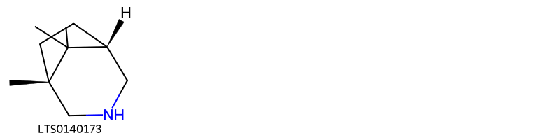
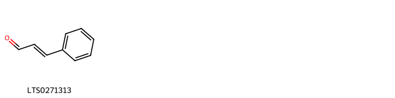
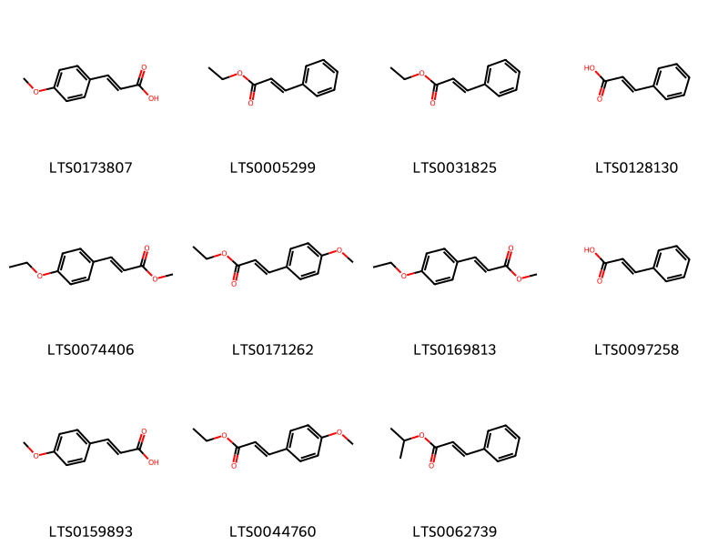
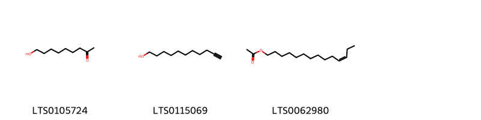
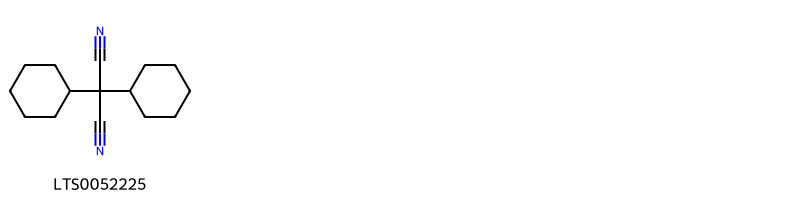
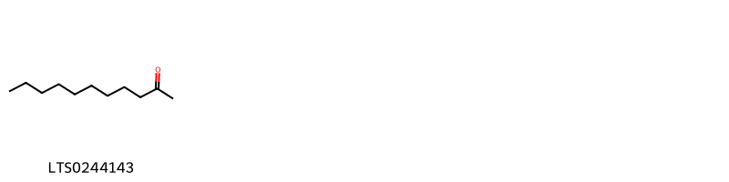
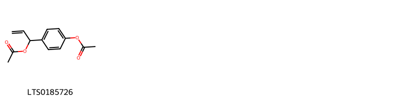
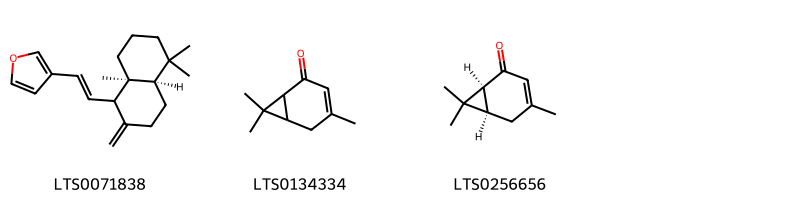
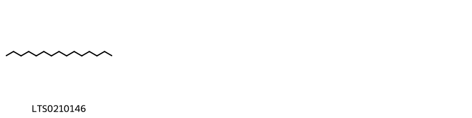

::: {.callout-note title = "Tóm tắt"}

nan

:::

## I. Thông tin về dược liệu 

::: {.panel-tabset}

### Định danh

- Dược liệu tiếng Việt: Địa Liền - Thân Rễ
- Dược liệu tiếng Trung: nan (nan)
- Dược liệu tiếng Anh: nan
- Dược liệu latin thông dụng: Rhizoma Kaempferia Galanga
- Dược liệu latin kiểu DĐVN: *Rhizoma Kaempferia Galanga*
- Dược liệu latin kiểu DĐVN: *nan*
- Dược liệu latin kiểu thông tư: *nan*
- Bộ phận dùng: Thân Rễ (Rhizoma)

### Mô tả dược liệu 

**Theo dược điển Việt nam V:** Phiến dày khoảng 2 mm đèn 5 mm, đường kính 0.6 cm trở lên, hơi cong lên. Mặt cắt màu trắng ngà có khi hơi ngà vàng. Xung quanh là vỏ ngoài màu vàng nâu hoặc màu tro nhạt, nhăn nheo, có khi còn sót lại rễ con hoặc vết tích rễ con. Thể chất giòn dễ bẻ, có bột. Mùi thơm đặc trưng, vị cay. 
 
**Mô tả dược liệu theo thông tư chế biến dược liệu theo phương pháp cổ truyền:** nan

### Chế biến 

**Chế biến theo dược điển việt nam V**: Đào lấy thân rễ, rửa sạch, thái phiến mỏng, phơi khô. Khi dùng vi sao. 

**Chế biến theo thông tư:** nan

::: 

## II. Thông tin về thực vật

Dược liệu **Địa Liền - Thân Rễ** từ bộ phận **Thân Rễ** từ loài *Kaempferia galanga*.

**Mô tả thực vật:** nan

*Tài liệu tham khảo:* nan 
Trong dược điển Việt nam, loài *Kaempferia galanga* được sử dụng làm dược liệu.

            
::: {.callout-note title = "Phân loại thực vật của *Kaempferia galanga*"}

**Kingdom:** Plantae 

**Phylum:** Tracheophyta 

**Order:** Zingiberales 
 
**Family:** Zingiberaceae 
 
**Genus:** Kaempferia 
 
**Species:** *Kaempferia galanga* 
 

:::

::: {style="display: grid;grid-template-columns: repeat(auto-fill, minmax(150px, 1fr));grid-gap: 1em;"}
{ group="GIBF" }

{ group="GIBF" }

{ group="GIBF" }

{ group="GIBF" }

{ group="GIBF" }

{ group="GIBF" }

{ group="GIBF" }

{ group="GIBF" }
:::

**Phân bố trên thế giới:** nan, France, Suriname, Solomon Islands, Netherlands, Sri Lanka, Sierra Leone, Mexico, Hong Kong, unknown or invalid, Cambodia, Bangladesh, Panama, Indonesia, Myanmar, India, Brazil, Peru, Viet Nam, Thailand, United States of America, Philippines, China, Malaysia, Norway, Lao People’s Democratic Republic

**Phân bố tại Việt nam:** Dak Nong, Tay Ninh, Kiên Giang, Bà Rịa - Vũng Tàu, Tây Ninh

<iframe src="Rhizoma Kaempferia Galanga/map_distribution.html" width="100%" height="600" style="border:none;"></iframe>

## III. Thành phần hóa học

Theo tài liệu của GS. Đỗ Tất Lợi:  nan
    

Theo cơ sở dữ liệu lotus, loài *Kaempferia galanga* đã phân lập và xác định được **24** hoạt chất thuộc về các nhóm Azepanes, Cinnamic acids and derivatives, Organonitrogen compounds, Organooxygen compounds, Saturated hydrocarbons, Fatty Acyls, Prenol lipids, Cinnamaldehydes, Phenol esters trong bảng dưới đây.
        
| chemicalTaxonomyClassyfireClass   |   smiles_count |
|:----------------------------------|---------------:|
| Azepanes                          |             28 |
| Cinnamaldehydes                   |             16 |
| Cinnamic acids and derivatives    |            238 |
| Fatty Acyls                       |             51 |
| Organonitrogen compounds          |             27 |
| Organooxygen compounds            |             15 |
| Phenol esters                     |             30 |
| Prenol lipids                     |             98 |
| Saturated hydrocarbons            |             15 |

Danh sách chi tiết các hoạt chất như sau: 

::: {style="display: grid;grid-template-columns: repeat(auto-fill, minmax(150px, 1fr));grid-gap: 1em;"}

                                                              
{ group="compound" description="Cấu trúc hóa học của các hoạt chất thuộc nhóm *Azepanes* là (1r,5s)-1,8,8-trimethyl-3-azabicyclo[3.2.1]octane [(LTS0140173)](https://lotus.naturalproducts.net/compound/lotus_id/LTS0140173)." }

                                                              
{ group="compound" description="Cấu trúc hóa học của các hoạt chất thuộc nhóm *Cinnamaldehydes* là cinnamal [(LTS0271313)](https://lotus.naturalproducts.net/compound/lotus_id/LTS0271313)." }

                                                              
{ group="compound" description="Cấu trúc hóa học của các hoạt chất thuộc nhóm *Cinnamic acids and derivatives* là 4-methoxycinnamic acid [(LTS0173807)](https://lotus.naturalproducts.net/compound/lotus_id/LTS0173807), ethyl 3-phenylprop-2-enoate [(LTS0005299)](https://lotus.naturalproducts.net/compound/lotus_id/LTS0005299), ethyl cinnamate [(LTS0031825)](https://lotus.naturalproducts.net/compound/lotus_id/LTS0031825), cinnamic acid [(LTS0128130)](https://lotus.naturalproducts.net/compound/lotus_id/LTS0128130), methyl 3-(4-ethoxyphenyl)prop-2-enoate [(LTS0074406)](https://lotus.naturalproducts.net/compound/lotus_id/LTS0074406), ethyl p-methoxycinnamate [(LTS0171262)](https://lotus.naturalproducts.net/compound/lotus_id/LTS0171262), methyl (2e)-3-(4-ethoxyphenyl)prop-2-enoate [(LTS0169813)](https://lotus.naturalproducts.net/compound/lotus_id/LTS0169813), phenylacrylic acid [(LTS0097258)](https://lotus.naturalproducts.net/compound/lotus_id/LTS0097258), p-methoxy-cinnamic acid [(LTS0159893)](https://lotus.naturalproducts.net/compound/lotus_id/LTS0159893), ethyl 3-(4-methoxyphenyl)prop-2-enoate [(LTS0044760)](https://lotus.naturalproducts.net/compound/lotus_id/LTS0044760), isopropyl 3-phenylprop-2-enoate [(LTS0062739)](https://lotus.naturalproducts.net/compound/lotus_id/LTS0062739)." }

                                                              
{ group="compound" description="Cấu trúc hóa học của các hoạt chất thuộc nhóm *Fatty Acyls* là 9-hydroxynonan-2-one [(LTS0105724)](https://lotus.naturalproducts.net/compound/lotus_id/LTS0105724), undec-10-yn-1-ol [(LTS0115069)](https://lotus.naturalproducts.net/compound/lotus_id/LTS0115069), (11z)-11-tetradecenyl acetate [(LTS0062980)](https://lotus.naturalproducts.net/compound/lotus_id/LTS0062980)." }

                                                              
{ group="compound" description="Cấu trúc hóa học của các hoạt chất thuộc nhóm *Organonitrogen compounds* là dicyclohexylpropanedinitrile [(LTS0052225)](https://lotus.naturalproducts.net/compound/lotus_id/LTS0052225)." }

                                                              
{ group="compound" description="Cấu trúc hóa học của các hoạt chất thuộc nhóm *Organooxygen compounds* là undecan-2-one [(LTS0244143)](https://lotus.naturalproducts.net/compound/lotus_id/LTS0244143)." }

                                                              
{ group="compound" description="Cấu trúc hóa học của các hoạt chất thuộc nhóm *Phenol esters* là 1-[4-(acetyloxy)phenyl]prop-2-en-1-yl acetate [(LTS0185726)](https://lotus.naturalproducts.net/compound/lotus_id/LTS0185726)." }

                                                              
{ group="compound" description="Cấu trúc hóa học của các hoạt chất thuộc nhóm *Prenol lipids* là 3-{2-[(4ar,8as)-5,5,8a-trimethyl-2-methylidene-hexahydro-1h-naphthalen-1-yl]ethenyl}furan [(LTS0071838)](https://lotus.naturalproducts.net/compound/lotus_id/LTS0071838), 4,7,7-trimethylbicyclo[4.1.0]hept-3-en-2-one [(LTS0134334)](https://lotus.naturalproducts.net/compound/lotus_id/LTS0134334), (1s,6r)-4,7,7-trimethylbicyclo[4.1.0]hept-3-en-2-one [(LTS0256656)](https://lotus.naturalproducts.net/compound/lotus_id/LTS0256656)." }

                                                              
{ group="compound" description="Cấu trúc hóa học của các hoạt chất thuộc nhóm *Saturated hydrocarbons* là pentadecane [(LTS0210146)](https://lotus.naturalproducts.net/compound/lotus_id/LTS0210146)." }

:::

---

## IV. Tác dụng dược lý

Theo tài liệu quốc tế: To stimulate the functional activity of the stomach, promote digestion and relieve pain.

---

## V. Dược điển Việt Nam V

### Soi bột

Bột màu trắng ngà. Soi dưới kính hiển vi thấy: Nhiều hạt tinh bột hình gần như ba cạnh, hình trứng hay hình tròn, đường kính 5 pm đến 30 pm, có rốn và vân mờ. Mảnh mô mềm có tế bào chứa tinh bột, hoặc kèm theo tế bào chứa tinh dầu màu vàng. Mảnh bần màu nâu nhạt, mảnh mạch vạch.

::: {#listing-soibot}
:::

### Vi phẫu

Lớp bần gồm 8 đến 15 hàng tế bào hình chữ nhật. Mô mềm vỏ gồm những tế bào hình nón hay nhiều cạnh, thành mỏng, chứa hạt tinh bột, rải rác có các bó libe-gỗ nhỏ. Vòng nội bì khung caspari liền với vòng trụ bì. Mô mềm ruột gồm tế bào thành hơi dày chứa nhiều hạt tinh bột và rải rác có các bó libe-gỗ. Tế bào chứa tinh dầu có cả ở mô mềm vỏ và mô mềm ruột.

::: {#listing-viphau}
:::

### Định tính

Ngâm 1 g bột dược liệu với 5 ml ether ethylic (TT) trong 15 min, thỉnh thoảng lắc, lọc. Bay hơi dịch lọc đến cắn. Thêm 1 giọt đến 2 giọt dung dịch vanillin 1 % trong acid sulfuric (TT), xuất hiện màu nâu đỏ đến tím. Lấy 2 g bột dược liệu, thêm 10 ml ethanol 90 % (TT). Đun cách thủy 20 min, để nguội và lọc. Lấy 1 ml dịch lọc cho vào một ống nghiệm, thêm từ từ 1 ml acid sulfuric (TT) xuống đáy ống. Vòng tiếp xúc giữa 2 lớp chất lỏng có màu nâu đỏ, sau chuyển sang nâu tím. Lấy 1 ml dịch lọc, thêm từ từ 1 ml dung dịch natri carbonat 5 % (TT). Đun trong cách thủy 3 min, để nguội, thêm 1 giọt đến 2 giọt thuốc thử diazo (TT) sẽ có màu đỏ cam. Phương pháp sắc ký lớp mỏng (Phụ lục 5.4). Bản mỏng: Silica gel GF254 Dung môi khai triển: n-Hexan – ethyl acetat (18: 1). Dung dịch thử: Lấy 0,25 g dược liệu, thêm 5 ml methanol (TT), siêu âm 10 min, lọc. Dung dịch đối chiếu: Lấy 0,25 g Địa liền (mẫu chuẩn), chiết như mô tả ờ phân Dung dịch thử. Cách tiến hành: Chấm riêng biệt lên cùng một bản mỏng 5 pl mỗi dung dịch trên. Sau khi triển khai sắc ký, lấy bản mỏng ra, để khô ở nhiệt độ phòng. Quan sát dưới ánh sáng tử ngoại ở bước sóng 254 nm. Trên sắc ký đồ của dung dịch thử phải có các vết cùng màu và cùng giá trị Rf với các vết trên sắc ký đồ của dung dịch đối chiếu.

### Định lượng

Định lượng Tiến hành theo phương pháp “Định lượng tinh dầu trong dược liệu” (Phụ lục 12.7). Lấy 30 g dược liệu, thêm 300 ml nước, cất trong 3 h. Hàm lượng tinh dầu trong dược liệu không ít hơn 1,4 % tính theo dược liệu khô kiệt.

### Thông tin khác 

- **Độ ẩm:** Không quá 12,0 % (Phụ lục 12.13).
- **Bảo quản:** Để nơi khô mát.

## VI. Dược điển Hồng kong

::: {#listing-DDHK}
:::

---

## VII. Y dược học cổ truyền

::: {.callout-note title = "nan" }

**Tên vị thuốc:** nan

**Tính:** nan

**Vị:** nan

**Quy kinh:**  nan

**Công năng chủ trị:** Tân, ôn. Vào hai kinh tỳ, vị.

**Phân loại theo thông tư:** nan

**Tác dụng theo y dược cổ truyền:** nan

**Chú ý:** nan

**Kiêng kỵ:** âm hư, thiếu máu hoặc vị có hỏa uất không dùng. 

:::

::: {#listing-ViThuoc}
:::

