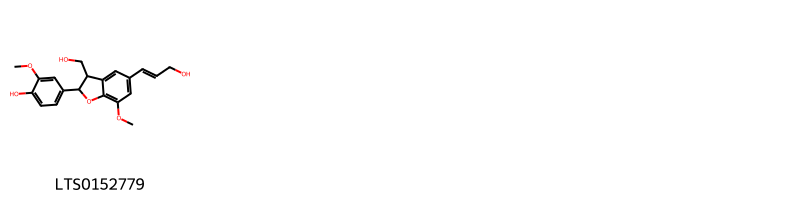
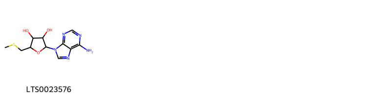
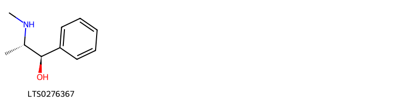
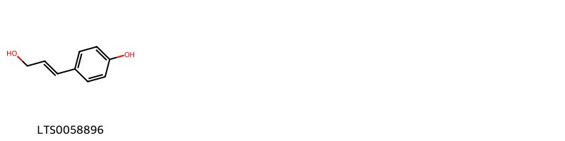
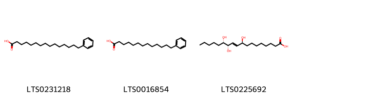
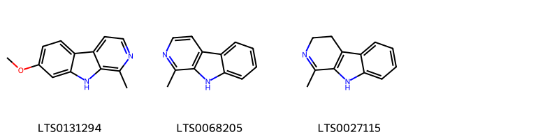
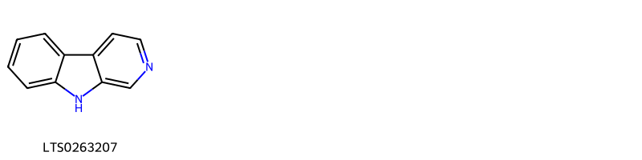
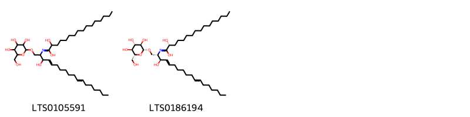
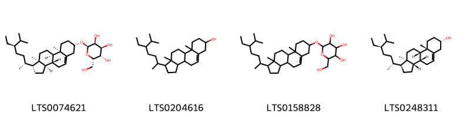

::: {.callout-note title = "Tóm tắt"}

Bán hạ (Thân rễ) (Rhizoma Pinelliae) là thân rễ của cây Bán hạ, thuộc họ Ráy (Araceae). Cây phân bố ở các vùng đất ẩm tại Việt Nam từ Bắc vào Nam, và trên thế giới tại Trung Quốc, Ấn Độ, và Nhật Bản. Theo kinh nghiệm dân gian, Bán hạ có tác dụng giáng nghịch cầm nôn, tiêu đờm hóa thấp, tán kết tiêu bĩ. Bán hạ thường được dùng để chủ trị các chứng ho có đờm, nôn mửa, chóng mặt, đau đầu do đờm thấp, đờm hạch, và các trường hợp đờm kết với khí gây mai hạch khí.Tác dụng dược lý của Bán hạ bao gồm tác dụng chữa ho, chống nôn, và hỗ trợ làm tiêu đờm. Thành phần hóa học của Bán hạ bao gồm một ít tinh dầu, alkaloid, một ancol, chất cay, phytosterol, cùng với dầu béo, tinh bột và chất nhầy, mang lại hiệu quả trong điều trị các bệnh liên quan đến hô hấp và tiêu hóa.

:::

## I. Thông tin về dược liệu 

::: {.panel-tabset}

### Định danh

- Dược liệu tiếng Việt: Bán Hạ - Củ
- Dược liệu tiếng Trung: nan (nan)
- Dược liệu tiếng Anh: nan
- Dược liệu latin thông dụng: Rhizoma Pinelliae
- Dược liệu latin kiểu DĐVN: *Semen Pharbitidis*
- Dược liệu latin kiểu DĐVN: *nan*
- Dược liệu latin kiểu thông tư: *nan*
- Bộ phận dùng: Thân rễ (Rhizoma)

### Mô tả dược liệu 

**Theo dược điển Việt nam V:** nan 
 
**Mô tả dược liệu theo thông tư chế biến dược liệu theo phương pháp cổ truyền:** nan

### Chế biến 

**Chế biến theo dược điển việt nam V**: nan 

**Chế biến theo thông tư:** nan

::: 

## II. Thông tin về thực vật

Dược liệu **Bán Hạ - Củ** từ bộ phận **Thân rễ** từ loài *Pinellia ternata*.

**Mô tả thực vật:** Là 1 loại cỏ không có thân, có củ hình cầu đường kính tới 2 cm. Lá hình tim, hay hình mác, hoặc chia 3 thuỳ dài 4-15cm, rộng 3,5-9 cm. Bông mo với phần hoa đực dài 5-9mm, phần trần dài 17-27mm. Quả mọng hình trứng dài 6mm.

*Tài liệu tham khảo:* "Những cây thuốc và vị thuốc Việt Nam" - Đỗ Tất Lợi 
Trong dược điển Việt nam, loài *Pinellia ternata* được sử dụng làm dược liệu.

            
::: {.callout-note title = "Phân loại thực vật của *Pinellia ternata*"}

**Kingdom:** Plantae 

**Phylum:** Tracheophyta 

**Order:** Alismatales 
 
**Family:** Araceae 
 
**Genus:** Pinellia 
 
**Species:** *Pinellia ternata* 
 

:::

::: {style="display: grid;grid-template-columns: repeat(auto-fill, minmax(150px, 1fr));grid-gap: 1em;"}
{ group="GIBF" }

{ group="GIBF" }

{ group="GIBF" }

{ group="GIBF" }

{ group="GIBF" }

{ group="GIBF" }

{ group="GIBF" }

{ group="GIBF" }

{ group="GIBF" }

{ group="GIBF" }

{ group="GIBF" }
:::

**Phân bố trên thế giới:** Germany, United States of America, Chinese Taipei, China, Japan, Korea, Republic of, Netherlands

**Phân bố tại Việt nam:** Không có ghi nhận ở Việt Nam

<iframe src="Rhizoma Pinelliae/map_distribution.html" width="100%" height="600" style="border:none;"></iframe>

## III. Thành phần hóa học

Theo tài liệu của GS. Đỗ Tất Lợi:  (1) Bán hạ Trung Quốc có 1 ít tinh dầu, 1 ít ancaloit, 1 ancol, 1 chất cay, phytosterol, ngoài ra còn dầu béo, tinh bột, chất nhầy
    

Theo cơ sở dữ liệu lotus, loài *Pinellia ternata* đã phân lập và xác định được **17** hoạt chất thuộc về các nhóm 2-arylbenzofuran flavonoids, Harmala alkaloids, Sphingolipids, Steroids and steroid derivatives, Benzene and substituted derivatives, Indoles and derivatives, Fatty Acyls, 5'-deoxyribonucleosides, Cinnamyl alcohols trong bảng dưới đây.
        
| chemicalTaxonomyClassyfireClass     |   smiles_count |
|:------------------------------------|---------------:|
| 2-arylbenzofuran flavonoids         |             41 |
| 5'-deoxyribonucleosides             |             32 |
| Benzene and substituted derivatives |             27 |
| Cinnamyl alcohols                   |             18 |
| Fatty Acyls                         |            103 |
| Harmala alkaloids                   |             76 |
| Indoles and derivatives             |             24 |
| Sphingolipids                       |            177 |
| Steroids and steroid derivatives    |            334 |

Danh sách chi tiết các hoạt chất như sau: 

::: {style="display: grid;grid-template-columns: repeat(auto-fill, minmax(150px, 1fr));grid-gap: 1em;"}

                                                              
{ group="compound" description="Cấu trúc hóa học của các hoạt chất thuộc nhóm *2-arylbenzofuran flavonoids* là dehydrodiconiferyl alcohol [(LTS0152779)](https://lotus.naturalproducts.net/compound/lotus_id/LTS0152779)." }

                                                              
{ group="compound" description="Cấu trúc hóa học của các hoạt chất thuộc nhóm *5'-deoxyribonucleosides* là methylthioadenosine [(LTS0023576)](https://lotus.naturalproducts.net/compound/lotus_id/LTS0023576)." }

                                                              
{ group="compound" description="Cấu trúc hóa học của các hoạt chất thuộc nhóm *Benzene and substituted derivatives* là ephedrine [(LTS0276367)](https://lotus.naturalproducts.net/compound/lotus_id/LTS0276367)." }

                                                              
{ group="compound" description="Cấu trúc hóa học của các hoạt chất thuộc nhóm *Cinnamyl alcohols* là p-coumaryl alcohol [(LTS0058896)](https://lotus.naturalproducts.net/compound/lotus_id/LTS0058896)." }

                                                              
{ group="compound" description="Cấu trúc hóa học của các hoạt chất thuộc nhóm *Fatty Acyls* là 15-phenylpentadecanoic acid [(LTS0231218)](https://lotus.naturalproducts.net/compound/lotus_id/LTS0231218), 13-phenyltridecanoic acid [(LTS0016854)](https://lotus.naturalproducts.net/compound/lotus_id/LTS0016854), pinellic acid [(LTS0225692)](https://lotus.naturalproducts.net/compound/lotus_id/LTS0225692)." }

                                                              
{ group="compound" description="Cấu trúc hóa học của các hoạt chất thuộc nhóm *Harmala alkaloids* là harmine [(LTS0131294)](https://lotus.naturalproducts.net/compound/lotus_id/LTS0131294), harmane [(LTS0068205)](https://lotus.naturalproducts.net/compound/lotus_id/LTS0068205), 1-methyl-3h,4h,9h-pyrido[3,4-b]indole [(LTS0027115)](https://lotus.naturalproducts.net/compound/lotus_id/LTS0027115)." }

                                                              
{ group="compound" description="Cấu trúc hóa học của các hoạt chất thuộc nhóm *Indoles and derivatives* là β-carboline [(LTS0263207)](https://lotus.naturalproducts.net/compound/lotus_id/LTS0263207)." }

                                                              
{ group="compound" description="Cấu trúc hóa học của các hoạt chất thuộc nhóm *Sphingolipids* là 2-hydroxy-n-(3-hydroxy-1-{[3,4,5-trihydroxy-6-(hydroxymethyl)oxan-2-yl]oxy}octadeca-4,11-dien-2-yl)hexadecanimidic acid [(LTS0105591)](https://lotus.naturalproducts.net/compound/lotus_id/LTS0105591), (2r)-2-hydroxy-n-[(2s,3r,4e,11e)-3-hydroxy-1-{[(2r,3r,4s,5s,6r)-3,4,5-trihydroxy-6-(hydroxymethyl)oxan-2-yl]oxy}octadeca-4,11-dien-2-yl]hexadecanimidic acid [(LTS0186194)](https://lotus.naturalproducts.net/compound/lotus_id/LTS0186194)." }

                                                              
{ group="compound" description="Cấu trúc hóa học của các hoạt chất thuộc nhóm *Steroids and steroid derivatives* là (2r,3s,4s,5s,6s)-2-{[(1r,3ar,3br,7s,9ar,9br,11ar)-1-[(2r,5r)-5-ethyl-6-methylheptan-2-yl]-9a,11a-dimethyl-1h,2h,3h,3ah,3bh,4h,6h,7h,8h,9h,9bh,10h,11h-cyclopenta[a]phenanthren-7-yl]oxy}-6-(hydroxymethyl)oxane-3,4,5-triol [(LTS0074621)](https://lotus.naturalproducts.net/compound/lotus_id/LTS0074621), stigmast-5-en-3-ol, (3β)- [(LTS0204616)](https://lotus.naturalproducts.net/compound/lotus_id/LTS0204616), 2-{[1-(5-ethyl-6-methylheptan-2-yl)-9a,11a-dimethyl-1h,2h,3h,3ah,3bh,4h,6h,7h,8h,9h,9bh,10h,11h-cyclopenta[a]phenanthren-7-yl]oxy}-6-(hydroxymethyl)oxane-3,4,5-triol [(LTS0158828)](https://lotus.naturalproducts.net/compound/lotus_id/LTS0158828), (1s,3as,3br,7s,9as,9bs,11ar)-1-[(2r,5r)-5-ethyl-6-methylheptan-2-yl]-9a,11a-dimethyl-1h,2h,3h,3ah,3bh,4h,6h,7h,8h,9h,9bh,10h,11h-cyclopenta[a]phenanthren-7-ol [(LTS0248311)](https://lotus.naturalproducts.net/compound/lotus_id/LTS0248311)." }

:::

---

## IV. Tác dụng dược lý

Theo tài liệu quốc tế: nan

---

## V. Dược điển Việt Nam V

### Soi bột

nan

::: {#listing-soibot}
:::

### Vi phẫu

nan

::: {#listing-viphau}
:::

### Định tính

nan

### Định lượng

nan

### Thông tin khác 

- **Độ ẩm:** nan
- **Bảo quản:** nan

## VI. Dược điển Hồng kong

::: {#listing-DDHK}
:::

---

## VII. Y dược học cổ truyền

::: {.callout-note title = "nan" }

**Tên vị thuốc:** nan

**Tính:** nan

**Vị:** nan

**Quy kinh:**  nan

**Công năng chủ trị:** nan

**Phân loại theo thông tư:** nan

**Tác dụng theo y dược cổ truyền:** nan

**Chú ý:** nan

**Kiêng kỵ:** nan 

:::

::: {#listing-ViThuoc}
:::

