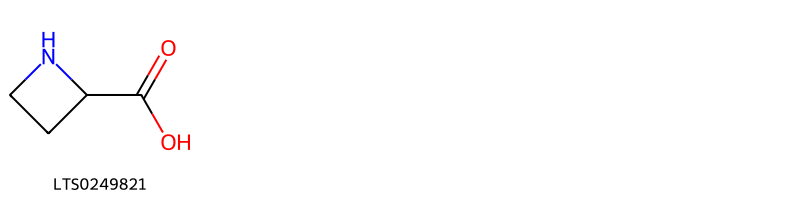
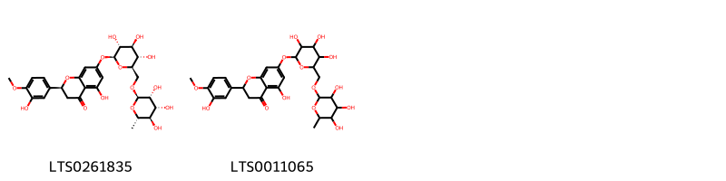
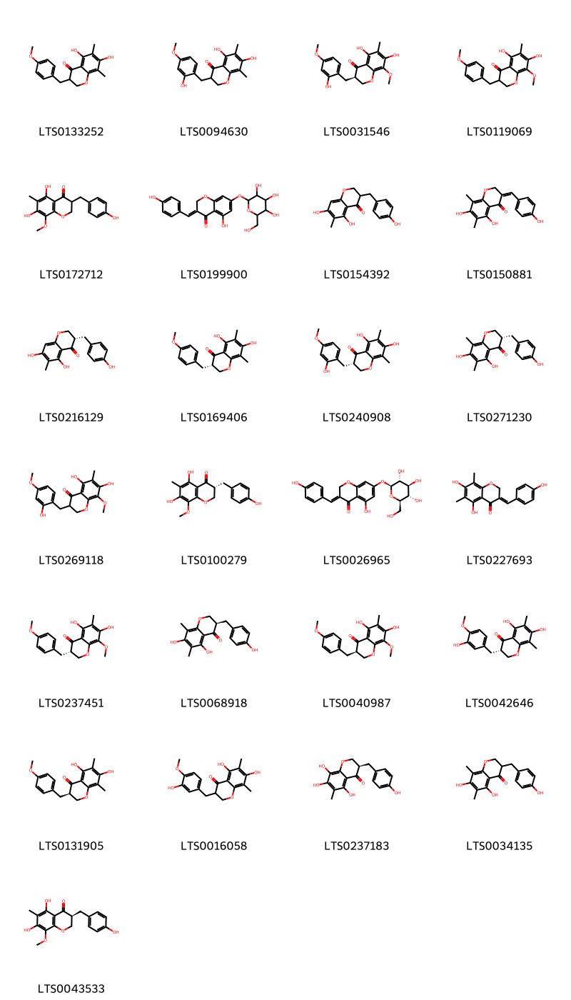
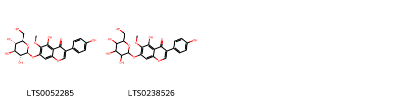
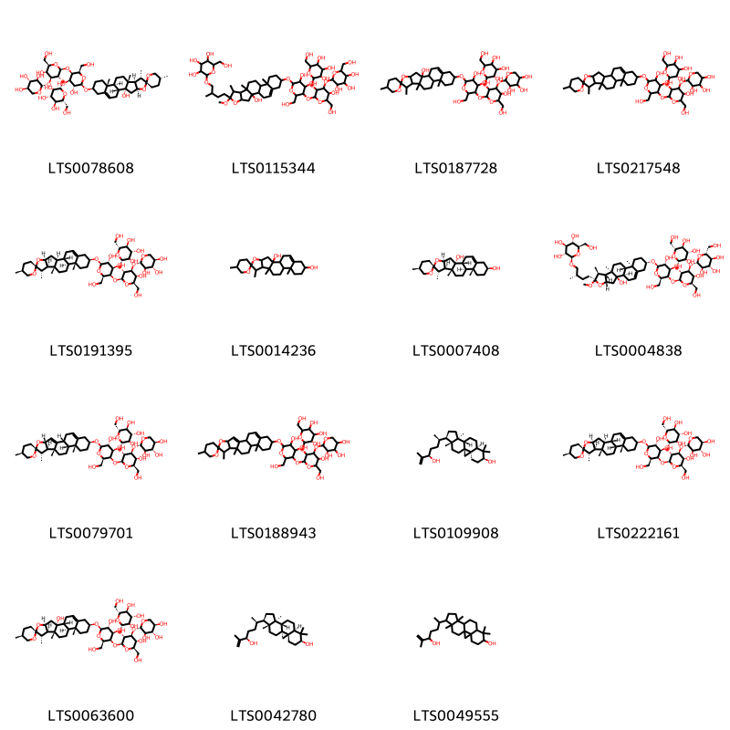

::: {.callout-note title = "Tóm tắt"}

Ngọc trúc (Rhizoma Polygonati Odorati) là thân rễ đã phơi khô của cây Ngọc trúc [Polygonatum odoratum (Mm.) Druce], thuộc họ Mạch môn đông  (Convallariaceae). Cây ngọc trúc phân bố chủ yếu ở châu Á, châu Âu và châu Phi. Tại Việt Nam, cây thường được trồng trong vườn ở các tỉnh miền núi phía Bắc như Lào Cai, Hà Giang và Lai Châu. Theo y học cổ truyền, ngọc trúc có vị ngọt, tính hơi hàn, quy vào 2 kinh phế và vị, có tác dụng tư âm, nhuận táo, và sinh tân chỉ khát. Thành phần hóa học chính của ngọc trúc gồm các glycosid chữa tim. như convallamarin và convallarin, cùng với các hợp chất flavonoid, saponin, chất nhầy, và các chất vô cơ.  

:::

## I. Thông tin về dược liệu 

::: {.panel-tabset}

### Định danh

- Dược liệu tiếng Việt: Ngọc Trúc - Thân Rễ
- Dược liệu tiếng Trung: nan (nan)
- Dược liệu tiếng Anh: nan
- Dược liệu latin thông dụng: Rhizoma Polygonati Odorati
- Dược liệu latin kiểu DĐVN: *nan*
- Dược liệu latin kiểu DĐVN: *nan*
- Dược liệu latin kiểu thông tư: *nan*
- Bộ phận dùng: Thân Rễ (Rhizoma)

### Mô tả dược liệu 

**Theo dược điển Việt nam V:** nan 
 
**Mô tả dược liệu theo thông tư chế biến dược liệu theo phương pháp cổ truyền:** nan

### Chế biến 

**Chế biến theo dược điển việt nam V**: nan 

**Chế biến theo thông tư:** nan

::: 

## II. Thông tin về thực vật

Dược liệu **Ngọc Trúc - Thân Rễ** từ bộ phận **Thân Rễ** từ loài *Polygonatum odoratum*.

**Mô tả thực vật:** Ngọc trúc là một loại cỏ sống dai cao 40 – 60cm, thân rễ mọc ngang màu vàng trắng nhạt, đường kính 0,5-1,5cm, trên thân rễ có nhiều rễ con. Lá mọc so le từ giữa thân trở lên, không có cuồng, cứng dài, hình trứng rộng, dài 6-12cm, rộng 3-6cm, mặt dưới màu trắng nhạt. Hoa mọc ở kẽ lá có cuống dài 1-1,4cm, mỗi kẽ mọc 1-2 hoa, màu trắng, hình chuông. Nếu 2 hoa thì có một cuống chung và 2 cuống con riêng. Quả mọng, hình cầu, đường kính 1-7mm, khi chín có màu tím đen.

*Tài liệu tham khảo:* "Những cây thuốc và vị thuốc Việt Nam" - Đỗ Tất Lợi 
Trong dược điển Việt nam, loài *Polygonatum odoratum* được sử dụng làm dược liệu.

            
::: {.callout-note title = "Phân loại thực vật của *Polygonatum odoratum*"}

**Kingdom:** Plantae 

**Phylum:** Tracheophyta 

**Order:** Asparagales 
 
**Family:** Asparagaceae 
 
**Genus:** Polygonatum 
 
**Species:** *Polygonatum odoratum* 
 

:::

::: {style="display: grid;grid-template-columns: repeat(auto-fill, minmax(150px, 1fr));grid-gap: 1em;"}
{ group="GIBF" }

{ group="GIBF" }

{ group="GIBF" }

{ group="GIBF" }

{ group="GIBF" }

{ group="GIBF" }
:::

**Phân bố trên thế giới:** Germany, France, Switzerland, Czechia, Korea, Republic of, Netherlands, Austria, Hungary, Spain, Poland, Sweden, Japan, Belarus, Russian Federation, Portugal, Romania, Ukraine, Croatia, China, Italy, Slovenia, Slovakia, Belgium

**Phân bố tại Việt nam:** Không có ghi nhận ở Việt Nam

<iframe src="Rhizoma Polygonati Odorati/map_distribution.html" width="100%" height="600" style="border:none;"></iframe>

## III. Thành phần hóa học

Theo tài liệu của GS. Đỗ Tất Lợi:  (1) Nhóm hoá học: 
- Theo tài liệu Trung Quốc, ngọc trúc chứa các glycosid convallamarin, convallarin, azetidine acid carboxylic, các flavonoid như vitextin, vitextin 2- glucoside, saponarin acid chelidonic, các chất vô cơ Ca, P, K, Mg, Mn, Si (Trung dược từ hải I - 1985)
- Ngoài ra, còn chất nhầy odoranan, polygonum – fructan O, A B C D (Từ điển cây thuốc Việt Nam 1999 – Võ Văn Chi). Từ dịch chiết methanol của ngọc trúc đã loại chất béo; Zaneczko Z; Jansson P.E; Sendra J đã chiết được một hỗn hợp các saponin steroid polyfurosid và sản phẩm thuỷ phân do men của nó là odospirosid. 
(2)Biomaker: Polysacharid
    

Theo cơ sở dữ liệu lotus, loài *Polygonatum odoratum* đã phân lập và xác định được **45** hoạt chất thuộc về các nhóm Isoflavonoids, Flavonoids, Steroids and steroid derivatives, Carboxylic acids and derivatives, Homoisoflavonoids trong bảng dưới đây.
        
| chemicalTaxonomyClassyfireClass   |   smiles_count |
|:----------------------------------|---------------:|
| Carboxylic acids and derivatives  |             12 |
| Flavonoids                        |            198 |
| Homoisoflavonoids                 |           1162 |
| Isoflavonoids                     |            136 |
| Steroids and steroid derivatives  |           2494 |

Danh sách chi tiết các hoạt chất như sau: 

::: {style="display: grid;grid-template-columns: repeat(auto-fill, minmax(150px, 1fr));grid-gap: 1em;"}

                                                              
{ group="compound" description="Cấu trúc hóa học của các hoạt chất thuộc nhóm *Carboxylic acids and derivatives* là azetidine-2-carboxylic acid [(LTS0249821)](https://lotus.naturalproducts.net/compound/lotus_id/LTS0249821)." }

                                                              
{ group="compound" description="Cấu trúc hóa học của các hoạt chất thuộc nhóm *Flavonoids* là hesperidin [(LTS0261835)](https://lotus.naturalproducts.net/compound/lotus_id/LTS0261835), hesperidin [(LTS0011065)](https://lotus.naturalproducts.net/compound/lotus_id/LTS0011065)." }

                                                              
{ group="compound" description="Cấu trúc hóa học của các hoạt chất thuộc nhóm *Homoisoflavonoids* là 5,7-dihydroxy-3-[(4-methoxyphenyl)methyl]-6,8-dimethyl-2,3-dihydro-1-benzopyran-4-one [(LTS0133252)](https://lotus.naturalproducts.net/compound/lotus_id/LTS0133252), 5,7-dihydroxy-3-[(2-hydroxy-4-methoxyphenyl)methyl]-6,8-dimethyl-2,3-dihydro-1-benzopyran-4-one [(LTS0094630)](https://lotus.naturalproducts.net/compound/lotus_id/LTS0094630), (3r)-5,7-dihydroxy-3-[(2-hydroxy-4-methoxyphenyl)methyl]-8-methoxy-6-methyl-2,3-dihydro-1-benzopyran-4-one [(LTS0031546)](https://lotus.naturalproducts.net/compound/lotus_id/LTS0031546), 5,7-dihydroxy-8-methoxy-3-[(4-methoxyphenyl)methyl]-6-methyl-2,3-dihydro-1-benzopyran-4-one [(LTS0119069)](https://lotus.naturalproducts.net/compound/lotus_id/LTS0119069), 5,7-dihydroxy-3-[(4-hydroxyphenyl)methyl]-8-methoxy-6-methyl-2,3-dihydro-1-benzopyran-4-one [(LTS0172712)](https://lotus.naturalproducts.net/compound/lotus_id/LTS0172712), 5-hydroxy-3-[(4-hydroxyphenyl)methylidene]-7-{[3,4,5-trihydroxy-6-(hydroxymethyl)oxan-2-yl]oxy}-2h-1-benzopyran-4-one [(LTS0199900)](https://lotus.naturalproducts.net/compound/lotus_id/LTS0199900), 5,7-dihydroxy-3-[(4-hydroxyphenyl)methyl]-6-methyl-2,3-dihydro-1-benzopyran-4-one [(LTS0154392)](https://lotus.naturalproducts.net/compound/lotus_id/LTS0154392), 5,7-dihydroxy-3-[(4-hydroxyphenyl)methylidene]-6,8-dimethyl-2h-1-benzopyran-4-one [(LTS0150881)](https://lotus.naturalproducts.net/compound/lotus_id/LTS0150881), (3s)-5,7-dihydroxy-3-[(4-hydroxyphenyl)methyl]-6-methyl-2,3-dihydro-1-benzopyran-4-one [(LTS0216129)](https://lotus.naturalproducts.net/compound/lotus_id/LTS0216129), (3s)-5,7-dihydroxy-3-[(4-methoxyphenyl)methyl]-6,8-dimethyl-2,3-dihydro-1-benzopyran-4-one [(LTS0169406)](https://lotus.naturalproducts.net/compound/lotus_id/LTS0169406), (3s)-5,7-dihydroxy-3-[(2-hydroxy-4-methoxyphenyl)methyl]-6,8-dimethyl-2,3-dihydro-1-benzopyran-4-one [(LTS0240908)](https://lotus.naturalproducts.net/compound/lotus_id/LTS0240908), (3s)-5,7-dihydroxy-3-[(4-hydroxyphenyl)methyl]-6,8-dimethyl-2,3-dihydro-1-benzopyran-4-one [(LTS0271230)](https://lotus.naturalproducts.net/compound/lotus_id/LTS0271230), 5,7-dihydroxy-3-[(2-hydroxy-4-methoxyphenyl)methyl]-8-methoxy-6-methyl-2,3-dihydro-1-benzopyran-4-one [(LTS0269118)](https://lotus.naturalproducts.net/compound/lotus_id/LTS0269118), (3r)-5,7-dihydroxy-3-[(4-hydroxyphenyl)methyl]-8-methoxy-6-methyl-2,3-dihydro-1-benzopyran-4-one [(LTS0100279)](https://lotus.naturalproducts.net/compound/lotus_id/LTS0100279), (3e)-5-hydroxy-3-[(4-hydroxyphenyl)methylidene]-7-{[(2s,3r,4s,5s,6r)-3,4,5-trihydroxy-6-(hydroxymethyl)oxan-2-yl]oxy}-2h-1-benzopyran-4-one [(LTS0026965)](https://lotus.naturalproducts.net/compound/lotus_id/LTS0026965), (3e)-5,7-dihydroxy-3-[(4-hydroxyphenyl)methylidene]-6,8-dimethyl-2h-1-benzopyran-4-one [(LTS0227693)](https://lotus.naturalproducts.net/compound/lotus_id/LTS0227693), (3s)-5,7-dihydroxy-8-methoxy-3-[(4-methoxyphenyl)methyl]-6-methyl-2,3-dihydro-1-benzopyran-4-one [(LTS0237451)](https://lotus.naturalproducts.net/compound/lotus_id/LTS0237451), (3r)-5,7-dihydroxy-3-[(4-hydroxyphenyl)methyl]-6,8-dimethyl-2,3-dihydro-1-benzopyran-4-one [(LTS0068918)](https://lotus.naturalproducts.net/compound/lotus_id/LTS0068918), (3r)-5,7-dihydroxy-8-methoxy-3-[(4-methoxyphenyl)methyl]-6-methyl-2,3-dihydro-1-benzopyran-4-one [(LTS0040987)](https://lotus.naturalproducts.net/compound/lotus_id/LTS0040987), (3s)-5,7-dihydroxy-3-[(3-hydroxy-4-methoxyphenyl)methyl]-6,8-dimethyl-2,3-dihydro-1-benzopyran-4-one [(LTS0042646)](https://lotus.naturalproducts.net/compound/lotus_id/LTS0042646), (3r)-5,7-dihydroxy-3-[(4-methoxyphenyl)methyl]-6,8-dimethyl-2,3-dihydro-1-benzopyran-4-one [(LTS0131905)](https://lotus.naturalproducts.net/compound/lotus_id/LTS0131905), 5,7-dihydroxy-3-[(3-hydroxy-4-methoxyphenyl)methyl]-6,8-dimethyl-2,3-dihydro-1-benzopyran-4-one [(LTS0016058)](https://lotus.naturalproducts.net/compound/lotus_id/LTS0016058), (3r)-5,7,8-trihydroxy-3-[(4-hydroxyphenyl)methyl]-6-methyl-2,3-dihydro-1-benzopyran-4-one [(LTS0237183)](https://lotus.naturalproducts.net/compound/lotus_id/LTS0237183), 5,7-dihydroxy-3-[(4-hydroxyphenyl)methyl]-6,8-dimethyl-2,3-dihydro-1-benzopyran-4-one [(LTS0034135)](https://lotus.naturalproducts.net/compound/lotus_id/LTS0034135), (3s)-5,7-dihydroxy-3-[(4-hydroxyphenyl)methyl]-8-methoxy-6-methyl-2,3-dihydro-1-benzopyran-4-one [(LTS0043533)](https://lotus.naturalproducts.net/compound/lotus_id/LTS0043533)." }

                                                              
{ group="compound" description="Cấu trúc hóa học của các hoạt chất thuộc nhóm *Isoflavonoids* là tectoridin [(LTS0052285)](https://lotus.naturalproducts.net/compound/lotus_id/LTS0052285), 5-hydroxy-3-(4-hydroxyphenyl)-6-methoxy-7-{[3,4,5-trihydroxy-6-(hydroxymethyl)oxan-2-yl]oxy}chromen-4-one [(LTS0238526)](https://lotus.naturalproducts.net/compound/lotus_id/LTS0238526)." }

                                                              
{ group="compound" description="Cấu trúc hóa học của các hoạt chất thuộc nhóm *Steroids and steroid derivatives* là (2s,3r,4s,5s,6r)-2-{[(2s,3r,4s,5r,6r)-2-{[(2r,3r,4r,5r,6r)-4,5-dihydroxy-2-(hydroxymethyl)-6-[(1'r,2r,2'r,4's,5r,7's,8'r,9'r,12's,13'r,16's)-5,7',9',13'-tetramethyl-5'-oxaspiro[oxane-2,6'-pentacyclo[10.8.0.0²,⁹.0⁴,⁸.0¹³,¹⁸]icosan]-18'-en-2'-oloxy]oxan-3-yl]oxy}-5-hydroxy-6-(hydroxymethyl)-4-{[(2s,3r,4s,5r)-3,4,5-trihydroxyoxan-2-yl]oxy}oxan-3-yl]oxy}-6-(hydroxymethyl)oxane-3,4,5-triol [(LTS0078608)](https://lotus.naturalproducts.net/compound/lotus_id/LTS0078608), 2-(4-{16-[(3,4-dihydroxy-5-{[5-hydroxy-6-(hydroxymethyl)-3,4-bis({[3,4,5-trihydroxy-6-(hydroxymethyl)oxan-2-yl]oxy})oxan-2-yl]oxy}-6-(hydroxymethyl)oxan-2-yl)oxy]-2-hydroxy-6-methoxy-7,9,13-trimethyl-5-oxapentacyclo[10.8.0.0²,⁹.0⁴,⁸.0¹³,¹⁸]icos-18-en-6-yl}-2-methylbutoxy)-6-(hydroxymethyl)oxane-3,4,5-triol [(LTS0115344)](https://lotus.naturalproducts.net/compound/lotus_id/LTS0115344), 2-[(2-{[4,5-dihydroxy-2-(hydroxymethyl)-6-{5,7',9',13'-tetramethyl-5'-oxaspiro[oxane-2,6'-pentacyclo[10.8.0.0²,⁹.0⁴,⁸.0¹³,¹⁸]icosan]-18'-en-2'-oloxy}oxan-3-yl]oxy}-5-hydroxy-6-(hydroxymethyl)-4-[(3,4,5-trihydroxyoxan-2-yl)oxy]oxan-3-yl)oxy]-6-(hydroxymethyl)oxane-3,4,5-triol [(LTS0187728)](https://lotus.naturalproducts.net/compound/lotus_id/LTS0187728), 2-[(2-{[4,5-dihydroxy-2-(hydroxymethyl)-6-{5,7',9',13'-tetramethyl-5'-oxaspiro[oxane-2,6'-pentacyclo[10.8.0.0²,⁹.0⁴,⁸.0¹³,¹⁸]icosan]-18'-eneoxy}oxan-3-yl]oxy}-5-hydroxy-6-(hydroxymethyl)-4-[(3,4,5-trihydroxyoxan-2-yl)oxy]oxan-3-yl)oxy]-6-(hydroxymethyl)oxane-3,4,5-triol [(LTS0217548)](https://lotus.naturalproducts.net/compound/lotus_id/LTS0217548), (2s,3r,4s,5s,6r)-2-{[(2s,3r,4s,5r,6r)-2-{[(2r,3r,4r,5r,6r)-4,5-dihydroxy-2-(hydroxymethyl)-6-[(1's,2r,2's,4's,5s,7's,8'r,9's,12's,13'r,16's)-5,7',9',13'-tetramethyl-5'-oxaspiro[oxane-2,6'-pentacyclo[10.8.0.0²,⁹.0⁴,⁸.0¹³,¹⁸]icosan]-18'-eneoxy]oxan-3-yl]oxy}-5-hydroxy-6-(hydroxymethyl)-4-{[(2s,3r,4s,5r)-3,4,5-trihydroxyoxan-2-yl]oxy}oxan-3-yl]oxy}-6-(hydroxymethyl)oxane-3,4,5-triol [(LTS0191395)](https://lotus.naturalproducts.net/compound/lotus_id/LTS0191395), 5,7',9',13'-tetramethyl-5'-oxaspiro[oxane-2,6'-pentacyclo[10.8.0.0²,⁹.0⁴,⁸.0¹³,¹⁸]icosan]-18'-ene-2',16'-diol [(LTS0014236)](https://lotus.naturalproducts.net/compound/lotus_id/LTS0014236), (1'r,2r,2'r,4's,5s,7's,8'r,9'r,12's,13'r,16's)-5,7',9',13'-tetramethyl-5'-oxaspiro[oxane-2,6'-pentacyclo[10.8.0.0²,⁹.0⁴,⁸.0¹³,¹⁸]icosan]-18'-ene-2',16'-diol [(LTS0007408)](https://lotus.naturalproducts.net/compound/lotus_id/LTS0007408), (2r,3r,4s,5s,6r)-2-[(2s)-4-[(1r,2r,4s,6r,7s,8r,9r,12s,13r,16s)-16-{[(2r,3r,4r,5r,6r)-3,4-dihydroxy-5-{[(2s,3r,4s,5r,6r)-5-hydroxy-6-(hydroxymethyl)-3,4-bis({[(2s,3r,4s,5s,6r)-3,4,5-trihydroxy-6-(hydroxymethyl)oxan-2-yl]oxy})oxan-2-yl]oxy}-6-(hydroxymethyl)oxan-2-yl]oxy}-2-hydroxy-6-methoxy-7,9,13-trimethyl-5-oxapentacyclo[10.8.0.0²,⁹.0⁴,⁸.0¹³,¹⁸]icos-18-en-6-yl]-2-methylbutoxy]-6-(hydroxymethyl)oxane-3,4,5-triol [(LTS0004838)](https://lotus.naturalproducts.net/compound/lotus_id/LTS0004838), (2s,3r,4s,5s,6r)-2-{[(2s,3r,4s,5r,6r)-2-{[(2r,3r,4r,5r,6r)-4,5-dihydroxy-2-(hydroxymethyl)-6-[(1'r,2r,4'r,5s,7's,8'r,9'r,12'r,13'r,16's)-5,7',9',13'-tetramethyl-5'-oxaspiro[oxane-2,6'-pentacyclo[10.8.0.0²,⁹.0⁴,⁸.0¹³,¹⁸]icosane]-2',18'-dieneoxy]oxan-3-yl]oxy}-5-hydroxy-6-(hydroxymethyl)-4-{[(2s,3r,4s,5r)-3,4,5-trihydroxyoxan-2-yl]oxy}oxan-3-yl]oxy}-6-(hydroxymethyl)oxane-3,4,5-triol [(LTS0079701)](https://lotus.naturalproducts.net/compound/lotus_id/LTS0079701), 2-[(2-{[4,5-dihydroxy-2-(hydroxymethyl)-6-{5,7',9',13'-tetramethyl-5'-oxaspiro[oxane-2,6'-pentacyclo[10.8.0.0²,⁹.0⁴,⁸.0¹³,¹⁸]icosane]-2',18'-dieneoxy}oxan-3-yl]oxy}-5-hydroxy-6-(hydroxymethyl)-4-[(3,4,5-trihydroxyoxan-2-yl)oxy]oxan-3-yl)oxy]-6-(hydroxymethyl)oxane-3,4,5-triol [(LTS0188943)](https://lotus.naturalproducts.net/compound/lotus_id/LTS0188943), (1s,3r,6s,8r,11s,12s,15r,16r)-15-[(2r,5r)-5-hydroxy-6-methylhept-6-en-2-yl]-7,7,12,16-tetramethylpentacyclo[9.7.0.0¹,³.0³,⁸.0¹²,¹⁶]octadecan-6-ol [(LTS0109908)](https://lotus.naturalproducts.net/compound/lotus_id/LTS0109908), (2s,3r,4s,5s,6r)-2-{[(2s,3r,4s,5r,6r)-2-{[(2r,3r,4r,5r,6r)-4,5-dihydroxy-2-(hydroxymethyl)-6-[(1's,2r,2's,4's,5s,7's,8'r,9's,12'r,13'r,16's)-5,7',9',13'-tetramethyl-5'-oxaspiro[oxane-2,6'-pentacyclo[10.8.0.0²,⁹.0⁴,⁸.0¹³,¹⁸]icosan]-18'-eneoxy]oxan-3-yl]oxy}-5-hydroxy-6-(hydroxymethyl)-4-{[(2s,3r,4s,5r)-3,4,5-trihydroxyoxan-2-yl]oxy}oxan-3-yl]oxy}-6-(hydroxymethyl)oxane-3,4,5-triol [(LTS0222161)](https://lotus.naturalproducts.net/compound/lotus_id/LTS0222161), (2s,3r,4s,5s,6r)-2-{[(2s,3r,4s,5r,6r)-2-{[(2r,3r,4r,5r,6r)-4,5-dihydroxy-2-(hydroxymethyl)-6-[(1'r,2r,2'r,4's,5s,7's,8'r,9'r,12's,13'r,16's)-5,7',9',13'-tetramethyl-5'-oxaspiro[oxane-2,6'-pentacyclo[10.8.0.0²,⁹.0⁴,⁸.0¹³,¹⁸]icosan]-18'-en-2'-oloxy]oxan-3-yl]oxy}-5-hydroxy-6-(hydroxymethyl)-4-{[(2s,3r,4s,5r)-3,4,5-trihydroxyoxan-2-yl]oxy}oxan-3-yl]oxy}-6-(hydroxymethyl)oxane-3,4,5-triol [(LTS0063600)](https://lotus.naturalproducts.net/compound/lotus_id/LTS0063600), (1r,3s,6s,8r,11s,12s,15r,16r)-15-[(2r,5r)-5-hydroxy-6-methylhept-6-en-2-yl]-7,7,12,16-tetramethylpentacyclo[9.7.0.0¹,³.0³,⁸.0¹²,¹⁶]octadecan-6-ol [(LTS0042780)](https://lotus.naturalproducts.net/compound/lotus_id/LTS0042780), 15-(5-hydroxy-6-methylhept-6-en-2-yl)-7,7,12,16-tetramethylpentacyclo[9.7.0.0¹,³.0³,⁸.0¹²,¹⁶]octadecan-6-ol [(LTS0049555)](https://lotus.naturalproducts.net/compound/lotus_id/LTS0049555)." }

:::

---

## IV. Tác dụng dược lý

Theo tài liệu quốc tế: nan

---

## V. Dược điển Việt Nam V

### Soi bột

nan

::: {#listing-soibot}
:::

### Vi phẫu

nan

::: {#listing-viphau}
:::

### Định tính

nan

### Định lượng

nan

### Thông tin khác 

- **Độ ẩm:** nan
- **Bảo quản:** nan

## VI. Dược điển Hồng kong

::: {#listing-DDHK}
:::

---

## VII. Y dược học cổ truyền

::: {.callout-note title = "nan" }

**Tên vị thuốc:** nan

**Tính:** nan

**Vị:** nan

**Quy kinh:**  nan

**Công năng chủ trị:** nan

**Phân loại theo thông tư:** nan

**Tác dụng theo y dược cổ truyền:** nan

**Chú ý:** nan

**Kiêng kỵ:** nan 

:::

::: {#listing-ViThuoc}
:::

