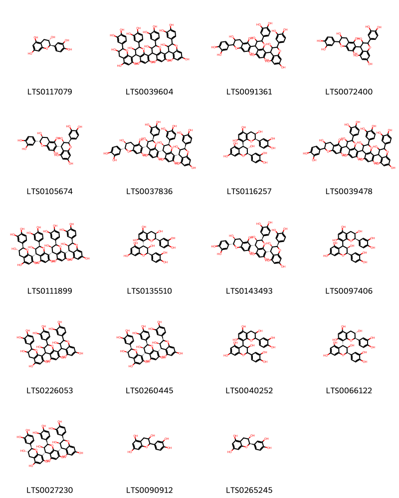
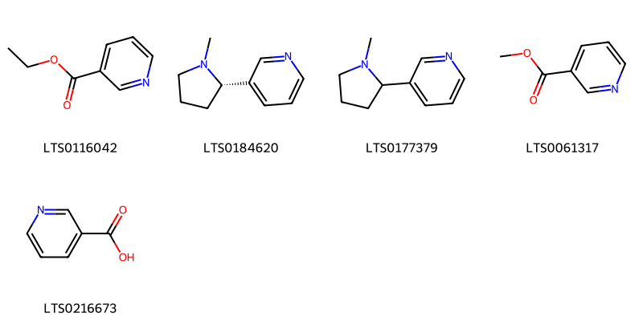

::: {.callout-note title = "Tóm tắt"}

Cau (Semen Arecae catechi) là là hạt đã phơi hoặc sấy khô lấy từ quả chín của cây Cau (Areca catechu L.), thuộc họ Cau (Arecaceae).  Cây Cau có nguồn gốc từ Philippines và đã được du nhập vào nhiều khu vực trên thế giới, bao gồm châu Á, châu Đại Dương, châu Mỹ và châu Phi. Ở Việt Nam, cây Cau được trồng phổ biến khắp nơi. Theo kinh nghiệm dân gian, hạt cau được mài thành bột, phơi khô, hòa với dầu để bôi lên giúp chữa trẻ con bị chốc đầu. Ngoài ra, hạt cau còn được kết hợp với thường sơn, thảo quả để chữa sốt rét. Thành phần hóa học chính trong hạt cau gồm alkaloid, đặc biệt là arecolin, giúp kích thích tiết nước bọt và dịch vị, hỗ trợ tiêu hóa. 

:::

## I. Thông tin về dược liệu 

::: {.panel-tabset}

### Định danh

- Dược liệu tiếng Việt: Cau - Hạt
- Dược liệu tiếng Trung: nan (nan)
- Dược liệu tiếng Anh: nan
- Dược liệu latin thông dụng: Semen Arecae Catechi
- Dược liệu latin kiểu DĐVN: *Folium Steviae Rebaudiana*
- Dược liệu latin kiểu DĐVN: *nan*
- Dược liệu latin kiểu thông tư: *nan*
- Bộ phận dùng: Hạt (Semen)

### Mô tả dược liệu 

**Theo dược điển Việt nam V:** Khối cứng, hình trắng hoặc hình cầu dẹt, cao khoảng 1,5 cm đến 3,5 cm; đường kính khoảng  1,5 cm đến 3,5 cm. Đáy phẳng, ở giữa lõm, đôi khi có một cụm xơ (cuống noãn). Mặt ngoài  màu nâu vàng nhạt hoặc màu nâu đỏ nhạt với những nếp nhăn hình mạng lưới, cắt ngang thấy vỏ hạt ăn sâu vào nội nhũ tạo thành những nếp màu nâu xen kẽ với màu trắng nhạt. Phôi nhỏ nằm ở đáy hạt. Vị chát và hơi đắng. 
 
**Mô tả dược liệu theo thông tư chế biến dược liệu theo phương pháp cổ truyền:** nan

### Chế biến 

**Chế biến theo dược điển việt nam V**: Thu hái quả chín, bổ lấy hạt. Hạt được cắt lát (binh lang phiến) hay bổ đôi, phơi hoặc sấy khô.Binh lang sao đen (Tiêu binh lang): Lấy binh lang phiên, sao nhỏ lửa đến khi có màu vàng đen. 

**Chế biến theo thông tư:** nan

::: 

## II. Thông tin về thực vật

Dược liệu **Cau - Hạt** từ bộ phận **Hạt** từ loài *Areca catechu*.

**Mô tả thực vật:** Cây cau là một cây có thân mọc thẳng cao chừng 15-20m, đường kính 10-15cm. Toàn thân không có lá mà có nhiều vết lá cũ mọc, chỉ ở ngọn có một chùm lá to rộng xẻ lông chim. Lá có bẹ to. Mo ở bông mo sớm rụng. Trong cụm hoa hoa đực ở trên, hoa cái ở dưới. Hoa đực nhỏ màu trắng, thơm gồm 3 lá đài màu lục, 3 cánh hoa trắng, 6 nhị. Hoa cái to, bao hoa không phân hóa. Noãn sào thượng 3 ô. Quả hạch hình trứng to bằng quả trứng gà. Quả bì có sợi, hạt có nội nhũ xếp cuốn. Hạt hơi hình nón cụt, đầu tròn giữa dáy hơi lõm, màu nâu nhạt, vị chát.

*Tài liệu tham khảo:* "Những cây thuốc và vị thuốc Việt Nam" - Đỗ Tất Lợi 
Trong dược điển Việt nam, loài *Areca catechu* được sử dụng làm dược liệu.

            
::: {.callout-note title = "Phân loại thực vật của *Areca catechu*"}

**Kingdom:** Plantae 

**Phylum:** Tracheophyta 

**Order:** Arecales 
 
**Family:** Arecaceae 
 
**Genus:** Areca 
 
**Species:** *Areca catechu* 
 

:::

::: {style="display: grid;grid-template-columns: repeat(auto-fill, minmax(150px, 1fr));grid-gap: 1em;"}
{ group="GIBF" }

{ group="GIBF" }

{ group="GIBF" }

{ group="GIBF" }

{ group="GIBF" }
:::

**Phân bố trên thế giới:** nan, Micronesia (Federated States of), Bhutan, Solomon Islands, Mayotte, Singapore, Sri Lanka, French Polynesia, Seychelles, Chinese Taipei, Colombia, Papua New Guinea, Timor-Leste, Cambodia, Bangladesh, South Africa, Indonesia, Grenada, Madagascar, Myanmar, Trinidad and Tobago, India, Palau, Costa Rica, Viet Nam, Guam, Thailand, United States of America, Philippines, China, Comoros, Dominican Republic, Fiji, Malaysia, Maldives, Puerto Rico

**Phân bố tại Việt nam:** Gia Lai, Hà Nội, Ninh Bình

<iframe src="Semen Arecae Catechi/map_distribution.html" width="100%" height="600" style="border:none;"></iframe>

## III. Thành phần hóa học

Theo tài liệu của GS. Đỗ Tất Lợi:  (1) Tỷ lệ tanin trong hạt cau khoảng  chừng 70% nhưng khi chín chỉ còn 15-20%.
Hoạt chất chính là 4 ancaloit: Arecolin C3H13NO2, guvacolin C7H11NO2, arecaidin C7H11NO2, guvaxin C6H9NO2.
Ngoài ra còn chất mỡ (14%) với thành phần chủ yếu gồm: myristin 1/5, olein 1/4, laurin 1/2, các chất đường: sacaroza, mannan, galactan 2% và muối vò cơ.
(2) Trong dược điển Hồng Kông, hoạt chất chính của hạt cau là Arecolin
    

Theo cơ sở dữ liệu lotus, loài *Areca catechu* đã phân lập và xác định được **65** hoạt chất thuộc về các nhóm Pyridines and derivatives, Benzimidazoles, Harmala alkaloids, Flavonoids, Piperidines, Carboxylic acids and derivatives, Indoles and derivatives, Fatty Acyls trong bảng dưới đây.
        
| chemicalTaxonomyClassyfireClass   |   smiles_count |
|:----------------------------------|---------------:|
|                                   |             88 |
| Benzimidazoles                    |             75 |
| Carboxylic acids and derivatives  |            398 |
| Fatty Acyls                       |            151 |
| Flavonoids                        |           2177 |
| Harmala alkaloids                 |             47 |
| Indoles and derivatives           |             56 |
| Piperidines                       |             99 |
| Pyridines and derivatives         |             81 |

Danh sách chi tiết các hoạt chất như sau: 

::: {style="display: grid;grid-template-columns: repeat(auto-fill, minmax(150px, 1fr));grid-gap: 1em;"}

                                                              
{ group="compound" description="Cấu trúc hóa học của các hoạt chất thuộc nhóm ** là ethyl 1-methyl-5,6-dihydro-2h-pyridine-3-carboxylate [(LTS0084130)](https://lotus.naturalproducts.net/compound/lotus_id/LTS0084130), guvacine [(LTS0119984)](https://lotus.naturalproducts.net/compound/lotus_id/LTS0119984), arecoline [(LTS0116578)](https://lotus.naturalproducts.net/compound/lotus_id/LTS0116578), arecaidine [(LTS0048904)](https://lotus.naturalproducts.net/compound/lotus_id/LTS0048904), guvacoline [(LTS0003782)](https://lotus.naturalproducts.net/compound/lotus_id/LTS0003782)." }

                                                              
{ group="compound" description="Cấu trúc hóa học của các hoạt chất thuộc nhóm *Benzimidazoles* là 2-[methyl(2-[(r)-[3-methyl-4-(2,2,2-trifluoroethoxy)pyridin-2-yl]methanesulfinyl]-1,3-benzodiazole-1-carbonyl)amino]ethyl 1-methylpiperidine-4-carboxylate [(LTS0062729)](https://lotus.naturalproducts.net/compound/lotus_id/LTS0062729)." }

                                                              
{ group="compound" description="Cấu trúc hóa học của các hoạt chất thuộc nhóm *Carboxylic acids and derivatives* là l-threonine [(LTS0184056)](https://lotus.naturalproducts.net/compound/lotus_id/LTS0184056), l-serine [(LTS0106692)](https://lotus.naturalproducts.net/compound/lotus_id/LTS0106692), l-alanine [(LTS0042208)](https://lotus.naturalproducts.net/compound/lotus_id/LTS0042208), l-lysine [(LTS0068734)](https://lotus.naturalproducts.net/compound/lotus_id/LTS0068734), d-methionine [(LTS0108782)](https://lotus.naturalproducts.net/compound/lotus_id/LTS0108782), l-aspartic acid [(LTS0205466)](https://lotus.naturalproducts.net/compound/lotus_id/LTS0205466), l-proline [(LTS0090383)](https://lotus.naturalproducts.net/compound/lotus_id/LTS0090383), d-phenylalanine [(LTS0048920)](https://lotus.naturalproducts.net/compound/lotus_id/LTS0048920), l-methionine [(LTS0196746)](https://lotus.naturalproducts.net/compound/lotus_id/LTS0196746), l-isoleucine [(LTS0249538)](https://lotus.naturalproducts.net/compound/lotus_id/LTS0249538), (2s)-2-(phenylamino)propanoic acid [(LTS0199539)](https://lotus.naturalproducts.net/compound/lotus_id/LTS0199539), l-valine [(LTS0231703)](https://lotus.naturalproducts.net/compound/lotus_id/LTS0231703), d-aspartic acid [(LTS0144001)](https://lotus.naturalproducts.net/compound/lotus_id/LTS0144001), d-alanine [(LTS0272178)](https://lotus.naturalproducts.net/compound/lotus_id/LTS0272178), l-glutamic acid [(LTS0037133)](https://lotus.naturalproducts.net/compound/lotus_id/LTS0037133), l-arginine [(LTS0064737)](https://lotus.naturalproducts.net/compound/lotus_id/LTS0064737), l-tyrosine [(LTS0029981)](https://lotus.naturalproducts.net/compound/lotus_id/LTS0029981), l-leucine [(LTS0113423)](https://lotus.naturalproducts.net/compound/lotus_id/LTS0113423), l-histidine [(LTS0094081)](https://lotus.naturalproducts.net/compound/lotus_id/LTS0094081)." }

                                                              
{ group="compound" description="Cấu trúc hóa học của các hoạt chất thuộc nhóm *Fatty Acyls* là palmitic acid [(LTS0079439)](https://lotus.naturalproducts.net/compound/lotus_id/LTS0079439), pentadecanoic acid [(LTS0227120)](https://lotus.naturalproducts.net/compound/lotus_id/LTS0227120), nonadec-2-enoic acid [(LTS0229279)](https://lotus.naturalproducts.net/compound/lotus_id/LTS0229279), oleic acid [(LTS0256910)](https://lotus.naturalproducts.net/compound/lotus_id/LTS0256910), myristic acid [(LTS0102566)](https://lotus.naturalproducts.net/compound/lotus_id/LTS0102566), lauric acid [(LTS0051907)](https://lotus.naturalproducts.net/compound/lotus_id/LTS0051907), stearic acid [(LTS0237766)](https://lotus.naturalproducts.net/compound/lotus_id/LTS0237766)." }

                                                              
{ group="compound" description="Cấu trúc hóa học của các hoạt chất thuộc nhóm *Flavonoids* là (+)-catechol [(LTS0117079)](https://lotus.naturalproducts.net/compound/lotus_id/LTS0117079), 2-(3,4-dihydroxyphenyl)-8-[2-(3,4-dihydroxyphenyl)-3,5,7-trihydroxy-3,4-dihydro-2h-1-benzopyran-4-yl]-4-[2-(3,4-dihydroxyphenyl)-4-[2-(3,4-dihydroxyphenyl)-3,5,7-trihydroxy-3,4-dihydro-2h-1-benzopyran-8-yl]-3,5,7-trihydroxy-3,4-dihydro-2h-1-benzopyran-8-yl]-3,4-dihydro-2h-1-benzopyran-3,5,7-triol [(LTS0039604)](https://lotus.naturalproducts.net/compound/lotus_id/LTS0039604), arecatannin b1 [(LTS0091361)](https://lotus.naturalproducts.net/compound/lotus_id/LTS0091361), 2-(3,4-dihydroxyphenyl)-4-[2-(3,4-dihydroxyphenyl)-3,5,7-trihydroxy-3,4-dihydro-2h-1-benzopyran-6-yl]-3,4-dihydro-2h-1-benzopyran-3,5,7-triol [(LTS0072400)](https://lotus.naturalproducts.net/compound/lotus_id/LTS0072400), (2r,3r,4s)-2-(3,4-dihydroxyphenyl)-4-[(2r,3s)-2-(3,4-dihydroxyphenyl)-3,5,7-trihydroxy-3,4-dihydro-2h-1-benzopyran-6-yl]-3,4-dihydro-2h-1-benzopyran-3,5,7-triol [(LTS0105674)](https://lotus.naturalproducts.net/compound/lotus_id/LTS0105674), (2r,3r,4r)-2-(3,4-dihydroxyphenyl)-8-[(2r,3r,4r)-2-(3,4-dihydroxyphenyl)-3,5,7-trihydroxy-3,4-dihydro-2h-1-benzopyran-4-yl]-4-[(2r,3r,4s)-2-(3,4-dihydroxyphenyl)-4-[(2r,3s)-2-(3,4-dihydroxyphenyl)-3,5,7-trihydroxy-3,4-dihydro-2h-1-benzopyran-6-yl]-3,5,7-trihydroxy-3,4-dihydro-2h-1-benzopyran-8-yl]-3,4-dihydro-2h-1-benzopyran-3,5,7-triol [(LTS0037836)](https://lotus.naturalproducts.net/compound/lotus_id/LTS0037836), (2r,3s,4s)-2-(3,4-dihydroxyphenyl)-4-[(2r,3r)-2-(3,4-dihydroxyphenyl)-3,5,7-trihydroxy-3,4-dihydro-2h-1-benzopyran-8-yl]-3,4-dihydro-2h-1-benzopyran-3,5,7-triol [(LTS0116257)](https://lotus.naturalproducts.net/compound/lotus_id/LTS0116257), 2-(3,4-dihydroxyphenyl)-8-[2-(3,4-dihydroxyphenyl)-3,5,7-trihydroxy-3,4-dihydro-2h-1-benzopyran-4-yl]-4-[2-(3,4-dihydroxyphenyl)-4-[2-(3,4-dihydroxyphenyl)-3,5,7-trihydroxy-3,4-dihydro-2h-1-benzopyran-6-yl]-3,5,7-trihydroxy-3,4-dihydro-2h-1-benzopyran-8-yl]-3,4-dihydro-2h-1-benzopyran-3,5,7-triol [(LTS0039478)](https://lotus.naturalproducts.net/compound/lotus_id/LTS0039478), (2r,3r,4r)-2-(3,4-dihydroxyphenyl)-8-[(2r,3r,4r)-2-(3,4-dihydroxyphenyl)-3,5,7-trihydroxy-3,4-dihydro-2h-1-benzopyran-4-yl]-4-[(2r,3r,4s)-2-(3,4-dihydroxyphenyl)-4-[(2r,3s)-2-(3,4-dihydroxyphenyl)-3,5,7-trihydroxy-3,4-dihydro-2h-1-benzopyran-8-yl]-3,5,7-trihydroxy-3,4-dihydro-2h-1-benzopyran-8-yl]-3,4-dihydro-2h-1-benzopyran-3,5,7-triol [(LTS0111899)](https://lotus.naturalproducts.net/compound/lotus_id/LTS0111899), (2r,3r,4r)-2-(3,4-dihydroxyphenyl)-4-[(2r,3r)-2-(3,4-dihydroxyphenyl)-3,5,7-trihydroxy-3,4-dihydro-2h-1-benzopyran-8-yl]-3,4-dihydro-2h-1-benzopyran-3,5,7-triol [(LTS0135510)](https://lotus.naturalproducts.net/compound/lotus_id/LTS0135510), arecatannin b1 [(LTS0143493)](https://lotus.naturalproducts.net/compound/lotus_id/LTS0143493), (2r,3r)-2-(3,4-dihydroxyphenyl)-4-[(2r,3r)-2-(3,4-dihydroxyphenyl)-3,5,7-trihydroxy-3,4-dihydro-2h-1-benzopyran-8-yl]-3,4-dihydro-2h-1-benzopyran-3,5,7-triol [(LTS0097406)](https://lotus.naturalproducts.net/compound/lotus_id/LTS0097406), procyanidin c2 [(LTS0226053)](https://lotus.naturalproducts.net/compound/lotus_id/LTS0226053), procyanidin c1 [(LTS0260445)](https://lotus.naturalproducts.net/compound/lotus_id/LTS0260445), 2-(3,4-dihydroxyphenyl)-4-[2-(3,4-dihydroxyphenyl)-3,5,7-trihydroxy-3,4-dihydro-2h-1-benzopyran-8-yl]-3,4-dihydro-2h-1-benzopyran-3,5,7-triol [(LTS0040252)](https://lotus.naturalproducts.net/compound/lotus_id/LTS0040252), (2r,3r,4r)-2-(3,4-dihydroxyphenyl)-4-[(2r,3s)-2-(3,4-dihydroxyphenyl)-3,5,7-trihydroxy-3,4-dihydro-2h-1-benzopyran-8-yl]-3,4-dihydro-2h-1-benzopyran-3,5,7-triol [(LTS0066122)](https://lotus.naturalproducts.net/compound/lotus_id/LTS0066122), (2r,3r,4s)-2-(3,4-dihydroxyphenyl)-8-[(2r,3r,4r)-2-(3,4-dihydroxyphenyl)-3,5,7-trihydroxy-3,4-dihydro-2h-1-benzopyran-4-yl]-4-[(2r,3s)-2-(3,4-dihydroxyphenyl)-3,5,7-trihydroxy-3,4-dihydro-2h-1-benzopyran-8-yl]-3,4-dihydro-2h-1-benzopyran-3,5,7-triol [(LTS0027230)](https://lotus.naturalproducts.net/compound/lotus_id/LTS0027230), catechol [(LTS0090912)](https://lotus.naturalproducts.net/compound/lotus_id/LTS0090912), ent-epicatechin [(LTS0265245)](https://lotus.naturalproducts.net/compound/lotus_id/LTS0265245)." }

                                                              
{ group="compound" description="Cấu trúc hóa học của các hoạt chất thuộc nhóm *Harmala alkaloids* là harmane [(LTS0068205)](https://lotus.naturalproducts.net/compound/lotus_id/LTS0068205), 1-methyl-3h,4h,9h-pyrido[3,4-b]indole [(LTS0027115)](https://lotus.naturalproducts.net/compound/lotus_id/LTS0027115)." }

                                                              
{ group="compound" description="Cấu trúc hóa học của các hoạt chất thuộc nhóm *Indoles and derivatives* là l-tryptophan [(LTS0263809)](https://lotus.naturalproducts.net/compound/lotus_id/LTS0263809), β-carboline [(LTS0263207)](https://lotus.naturalproducts.net/compound/lotus_id/LTS0263207)." }

                                                              
{ group="compound" description="Cấu trúc hóa học của các hoạt chất thuộc nhóm *Piperidines* là ethyl 1-methylpiperidine-3-carboxylate [(LTS0082807)](https://lotus.naturalproducts.net/compound/lotus_id/LTS0082807), ethyl (3s)-1-methylpiperidine-3-carboxylate [(LTS0123043)](https://lotus.naturalproducts.net/compound/lotus_id/LTS0123043), 1-methylpiperidine-3-carboxylic acid [(LTS0221482)](https://lotus.naturalproducts.net/compound/lotus_id/LTS0221482), methyl n-methylnipecotate [(LTS0024921)](https://lotus.naturalproducts.net/compound/lotus_id/LTS0024921), methyl (3s)-1-methylpiperidine-3-carboxylate [(LTS0074657)](https://lotus.naturalproducts.net/compound/lotus_id/LTS0074657)." }

                                                              
{ group="compound" description="Cấu trúc hóa học của các hoạt chất thuộc nhóm *Pyridines and derivatives* là ethyl nicotinate [(LTS0116042)](https://lotus.naturalproducts.net/compound/lotus_id/LTS0116042), (-)-nicotine [(LTS0184620)](https://lotus.naturalproducts.net/compound/lotus_id/LTS0184620), nicotine [(LTS0177379)](https://lotus.naturalproducts.net/compound/lotus_id/LTS0177379), heat spray [(LTS0061317)](https://lotus.naturalproducts.net/compound/lotus_id/LTS0061317), niacin [(LTS0216673)](https://lotus.naturalproducts.net/compound/lotus_id/LTS0216673)." }

:::

---

## IV. Tác dụng dược lý

Theo tài liệu quốc tế: To reduce toxic and to remove dampness.

---

## V. Dược điển Việt Nam V

### Soi bột

Bột màu nâu đỏ, vị chát, soi  kính hiển vi thấy: Tế bào đá của vò hạt hình bầu dục, dài, thành hơi dày. Mành nội nhũ với những tế bào thành dày, có lỗ đặc sắc. Hạt alơron 5 μm đến 40 pm. Mảnh mạch.

::: {#listing-soibot}
:::

### Vi phẫu

Lớp ngoài của vỏ hạt gồm nhiều hàng tế bào đá dẹt, hình thon dài, xếp tiếp tuyến, chứa chất màu nâu đỏ; tế bào đá có hình dạng và kích thước khác nhau, thường có những  khoảng gian bào. Lớp trong gồm nhiều lớp tế bào mô mềm, chứa chất màu nâu đỏ, rải rác có ít bó libe-gỗ. Ngoại nhũ hẹp và thường ẩn sâu vào nội nhũ tạo thành mô xâm nhập. Tế bào nội nhũ, hình nhiều cạnh, lỗ to đặc biệt trên thành tế bào.

::: {#listing-viphau}
:::

### Định tính

Phương pháp sắc ký lớp mỏng (Phụ lục 5.4).<i>Bản mỏng</i>:  Silica  gel G.<i>Dung môi khai triển</i>:  Cloroform  –  methanol –  amoniac ( 9 :1 :0,2 )<i>Dung dịch thử:</i> Lấy 8 g bột thô dược liệu, thêm 50 ml cloroform (TT), lắc đều, thêm tiếp 4 ml amoniac(TT), lắ siêu âm 10 min. Lọc lấy dịch chiết cloroform. Rửa cắn với 10 ml cloroform (TT). Gộp dịch rửa với dịch chiết cloroform, chuyển vào bình gạn, thêm 5 ml dung dịch acid hydrocloric 10 % (TT) và 20 ml nước, lắc kỹ. Gạn bỏ lớp cloroform. Rửa lóp nước bằng 10 ml cloroform (TT), gạn bỏ lớp cloroform. Kiềm hóa lớp nước bằng amoniac (TT) đến pH 9 đến 11 (thử bằng giấy quỳ) rồi lắc với coroform (TT) hai lần, mỗi lân 10 ml. Gộp các dịch chiết cloroform, bốc hơi trên cách thủy đến khô. Hòa tan cắn trong 1 ml ethanol 96% (TT) làm dung dịch thử.<i>Dung dịch đối chiếu</i>: Lấy 8 g bột thô hạt Cau (mẫu chuẩn), tiến hành chiết như mô tả ở phần Dung dịch thử.<i>Cách tiến hành</i>: Chấm riêng biệt lên bản mỏng 15 μl mỗi dung dịch trên, triển khai sắc ký đến khi dung môi đi được khoảng 12 cm đến 13 cm, lấy bản mỏng ra, để khô ở nhiệt độ phòng, phun dung dịch thuốc thử Dragendorff(TT). Quan sát dưới ánh sáng thường. Trên sắc ký đồ của dung dịch thử phải có các vết cùng màu và giá trị Rf với các vết của dung dịch đối chiếu.

### Định lượng

Cân chính xác khoảng 8 g bột thô dược liệu vào bình nón nút mài 250 ml, thêm 80 ml ether ethylic (TT) và 4 ml amoniac đậm đặc (TT), lắc trong 10 min. Thêm 10 g natri sulfat khan (TT) lac trong 5 min, để yên. Gạn lấy lớp ether, rửa cắn bằng ether ethylic (TT) 3 íần, mỗi lần 10 ml. Gộp các dịch chiết ether vào bình gạn, lắc với 0,5 g bột talc (TT) trong 3 min, thêm 2,5 ml nước, lắc trong 3 min. Để lắng, gạn lấy lớp ether trong ở phía trên, rửa lớp nước bằng 5 ml ether ethylic(TT). Gộp các dịch chiết ether vào một cốc có mỏ, để bay hơi tự nhiên đến khi còn khoảng 15 ml, chuyển vào bình gạn. Tráng cốc bằng ether ethylic (TT) 2 lần, mỗi lần 5 ml. Gộp dịch rửa ether vào bình gạn trên. Thêm chính xác 20 ml dung dịch acid sulfuric 0,02 N (CĐ) vào bình gạn, lắc kỹ. Để lắng, gạn lấy lớp acid. Rửa lớp ether 3 lần bằng nước, môi lân 5 ml. Gộp nước rửa với lớp acid, lọc. Rửa giấy lọc và phễu lọc bằng nước 4 lần, mỗi lần 10 ml, tập trung nước rửa vào dịch lọc. Thêm 3 đến 4 giọt dung dịch đỏ methyl (TT), định lượng bằng dung dịch natri hydroxyd 0,02 N (CD) đến khi chuyển sang màu vàng. 1 ml dung dịch acid sulfuric 0,02 N (CĐ) tương ứng với 0,003104 garecolin (C8H13NO2). Hàm lượng phần trăm alcaloid toàn phần (X) của dược liệu được tính theo công thức sau:[pmath size=16]X% =((20-n)31,04)/(m(100-a))[/pmath]Trong đó:n là thể tích dung dịch natri hydroxyd 0,02 N (CD) đã dùng để chuẩn độ (ml)m là khối lượng  mẫu thử (g)a là độ ẩm của dược liệu (%).Dược liệu phải chứa ít nhất 0,3 % alcaloid tan trong ether tính theo arecolin, tính theo dược liệu khô kiệt.

### Thông tin khác 

- **Độ ẩm:** Không quá 10,0 % (Phụ lục 9.6, 1 g, 100 °C đến 105 °C, 5 h).
- **Bảo quản:** Đề nơi khô mát, tránh mốc mọt.

## VI. Dược điển Hồng kong

::: {#listing-DDHK}
:::

---

## VII. Y dược học cổ truyền

::: {.callout-note title = "Tân lang" }

**Tên vị thuốc:** Tân lang

**Tính:** khô, ôn

**Vị:** Tân

**Quy kinh:**  vị, đại tràng

**Công năng chủ trị:** nan

**Phân loại theo thông tư:** nan

**Tác dụng theo y dược cổ truyền:** nan

**Chú ý:** nan

**Kiêng kỵ:** Cơ thể hư nhược không nên dùng. 

:::

::: {#listing-ViThuoc}
:::

