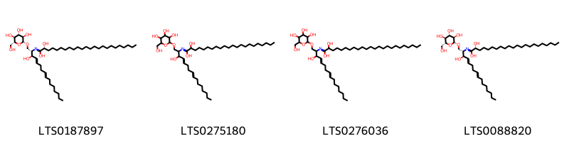
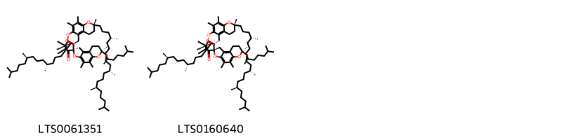

::: {.callout-note title = "Tóm tắt"}

Khiếm Thực (Semen Euryales) là hạt của quả chín đã phơi hay sấy khô của cây Khiếm thực (Einyales ferox Salisb.), thuộc họ Súng (Nymphaeaceae). Loài cây này phân bố chủ yếu ở Châu Á, các khu vực nhiệt đới, cận nhiệt đới trên thế giới và chưa được trồng tại Việt Nam. Theo y học cổ truyền, khiếm thực thường được sử dụng để điều trị các bệnh như đau nhức dây thần kinh, tê thấp, đau lưng, đau đầu gối. Thành phần hóa học phong phú của khiếm thực bao gồm các hợp chất như saponin steroid, alcaloid, flavonoid, tanin, cùng với chất béo (lipids), tinh dầu (essential oils), vitamin, khoáng chất, và acid amin (amino acids) với chất tiềm năng là isoflavonoids.

:::

## I. Thông tin về dược liệu 

::: {.panel-tabset}

### Định danh

- Dược liệu tiếng Việt: Khiếm Thực - Hạt
- Dược liệu tiếng Trung: nan (nan)
- Dược liệu tiếng Anh: nan
- Dược liệu latin thông dụng: Semen Euryales
- Dược liệu latin kiểu DĐVN: *Radix Codonopsis Javanicae Praeparata*
- Dược liệu latin kiểu DĐVN: *nan*
- Dược liệu latin kiểu thông tư: *nan*
- Bộ phận dùng: Hạt (Semen)

### Mô tả dược liệu 

**Theo dược điển Việt nam V:** nan 
 
**Mô tả dược liệu theo thông tư chế biến dược liệu theo phương pháp cổ truyền:** nan

### Chế biến 

**Chế biến theo dược điển việt nam V**: nan 

**Chế biến theo thông tư:** nan

::: 

## II. Thông tin về thực vật

Dược liệu **Khiếm Thực - Hạt** từ bộ phận **Hạt** từ loài *Euryale ferox*.

**Mô tả thực vật:** Khiếm thực chính thức là một loại cây mọc ở đầm ao, sống hàng năm, lá hình tròn rộng, nổi trên mặt nước, mặt trên màu xanh, mặt dưới màu tím. Mùa hạ, cành mang hoa trồi lên trên mặt nước, đầu cành có một hoa sáng nở chiều héo. Quả hình cầu chất xốp màu tím hồng bẩn, mặt ngoài có gai, đỉnh còn đài sót lại, hạt chắc, hình cầu, màu đen.

Hạt hình cầu, thường bị vỡ; hạt nguyên có đường kính 5 mm đến 10 mm, mặt ngoài có vỏ lụa, một đầu màu nâu đỏ hoặc đỏ nâu, đầu còn lại màu trắng vàng chiếm khoảng 1/3 hạt và có vết lõm là rốn hạt dạng điểm. Khi bỏ vỏ lụa hạt sẽ có màu trắng. Chất tương đối cứng. Mặt gãy màu trắng, chất bột. Không mùi, vị nhạt.

*Tài liệu tham khảo:* "Những cây thuốc và vị thuốc Việt Nam" - Đỗ Tất Lợi 
Trong dược điển Việt nam, loài *Euryale ferox* được sử dụng làm dược liệu.

            
::: {.callout-note title = "Phân loại thực vật của *Euryale ferox*"}

**Kingdom:** Plantae 

**Phylum:** Tracheophyta 

**Order:** Nymphaeales 
 
**Family:** Nymphaeaceae 
 
**Genus:** Euryale 
 
**Species:** *Euryale ferox* 
 

:::

::: {style="display: grid;grid-template-columns: repeat(auto-fill, minmax(150px, 1fr));grid-gap: 1em;"}
{ group="GIBF" }

{ group="GIBF" }

{ group="GIBF" }

{ group="GIBF" }

{ group="GIBF" }

{ group="GIBF" }

{ group="GIBF" }
:::

**Phân bố trên thế giới:** nan, United States of America, Russian Federation, China, Chinese Taipei, Hong Kong, Norway, Japan, India, Korea, Republic of, Australia

**Phân bố tại Việt nam:** Không có ghi nhận ở Việt Nam

<iframe src="Semen Euryales/map_distribution.html" width="100%" height="600" style="border:none;"></iframe>

## III. Thành phần hóa học

Theo tài liệu của GS. Đỗ Tất Lợi:  1) Thành phần hóa học: Saponin steroid, Alcaloid, Flavonoid, Tanin, Chất béo (Lipids), Tinh dầu (Essential oils), Vitamin và khoáng chất, Acid amin (Amino acids)
2) Tên hoạt chất là biomaker : Isoflavonoids
    

Theo cơ sở dữ liệu lotus, loài *Euryale ferox* đã phân lập và xác định được **6** hoạt chất thuộc về các nhóm Prenol lipids, Fatty Acyls trong bảng dưới đây.
        
| chemicalTaxonomyClassyfireClass   |   smiles_count |
|:----------------------------------|---------------:|
| Fatty Acyls                       |            374 |
| Prenol lipids                     |            407 |

Danh sách chi tiết các hoạt chất như sau: 

::: {style="display: grid;grid-template-columns: repeat(auto-fill, minmax(150px, 1fr));grid-gap: 1em;"}

                                                              
{ group="compound" description="Cấu trúc hóa học của các hoạt chất thuộc nhóm *Fatty Acyls* là (2r)-2-hydroxy-n-[(2s,3r,4e,8e)-3-hydroxy-1-{[(2r,3r,4s,5s,6r)-3,4,5-trihydroxy-6-(hydroxymethyl)oxan-2-yl]oxy}hexadeca-4,8-dien-2-yl]tetracosanimidic acid [(LTS0187897)](https://lotus.naturalproducts.net/compound/lotus_id/LTS0187897), 2-hydroxy-n-(3-hydroxy-1-{[3,4,5-trihydroxy-6-(hydroxymethyl)oxan-2-yl]oxy}hexadeca-4,8-dien-2-yl)docosanimidic acid [(LTS0275180)](https://lotus.naturalproducts.net/compound/lotus_id/LTS0275180), 2-hydroxy-n-(3-hydroxy-1-{[3,4,5-trihydroxy-6-(hydroxymethyl)oxan-2-yl]oxy}hexadeca-4,8-dien-2-yl)tetracosanimidic acid [(LTS0276036)](https://lotus.naturalproducts.net/compound/lotus_id/LTS0276036), (2r)-2-hydroxy-n-[(2s,3r,4e,8e)-3-hydroxy-1-{[(2r,3r,4s,5s,6r)-3,4,5-trihydroxy-6-(hydroxymethyl)oxan-2-yl]oxy}hexadeca-4,8-dien-2-yl]docosanimidic acid [(LTS0088820)](https://lotus.naturalproducts.net/compound/lotus_id/LTS0088820)." }

                                                              
{ group="compound" description="Cấu trúc hóa học của các hoạt chất thuộc nhóm *Prenol lipids* là (1s,7r,11'r,14r,18r,21r)-7,7',8',10,11,11',15,16,21-nonamethyl-7,11',21-tris[(4r,8r)-4,8,12-trimethyltridecyl]-5',8,10',13,22-pentaoxaspiro[pentacyclo[12.4.4.0¹,¹⁴.0³,¹².0⁴,⁹]docosane-18,4'-tricyclo[7.4.0.0²,⁶]tridecane]-1',3,6',8',9,11,15-heptaen-17-one [(LTS0061351)](https://lotus.naturalproducts.net/compound/lotus_id/LTS0061351), (1r,7r,11'r,14s,18s,21r)-7,7',8',10,11,11',15,16,21-nonamethyl-7,11',21-tris[(4r,8r)-4,8,12-trimethyltridecyl]-5',8,10',13,22-pentaoxaspiro[pentacyclo[12.4.4.0¹,¹⁴.0³,¹².0⁴,⁹]docosane-18,4'-tricyclo[7.4.0.0²,⁶]tridecane]-1',3,6',8',9,11,15-heptaen-17-one [(LTS0160640)](https://lotus.naturalproducts.net/compound/lotus_id/LTS0160640)." }

:::

---

## IV. Tác dụng dược lý

Theo tài liệu quốc tế: nan

---

## V. Dược điển Việt Nam V

### Soi bột

nan

::: {#listing-soibot}
:::

### Vi phẫu

nan

::: {#listing-viphau}
:::

### Định tính

nan

### Định lượng

nan

### Thông tin khác 

- **Độ ẩm:** nan
- **Bảo quản:** nan

## VI. Dược điển Hồng kong

::: {#listing-DDHK}
:::

---

## VII. Y dược học cổ truyền

::: {.callout-note title = "nan" }

**Tên vị thuốc:** nan

**Tính:** nan

**Vị:** nan

**Quy kinh:**  nan

**Công năng chủ trị:** nan

**Phân loại theo thông tư:** nan

**Tác dụng theo y dược cổ truyền:** nan

**Chú ý:** nan

**Kiêng kỵ:** nan 

:::

::: {#listing-ViThuoc}
:::

