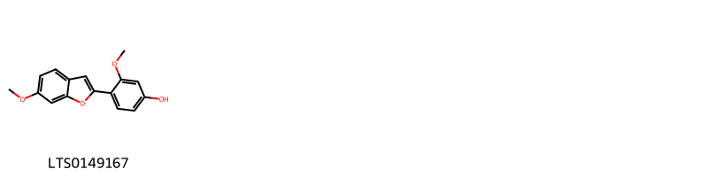
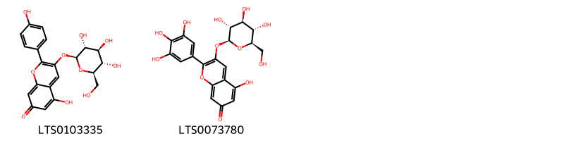
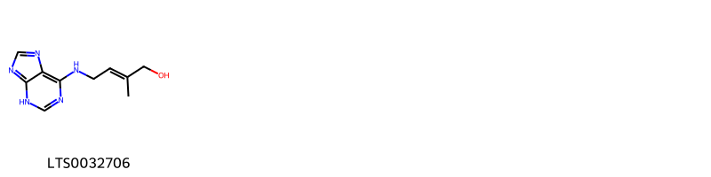
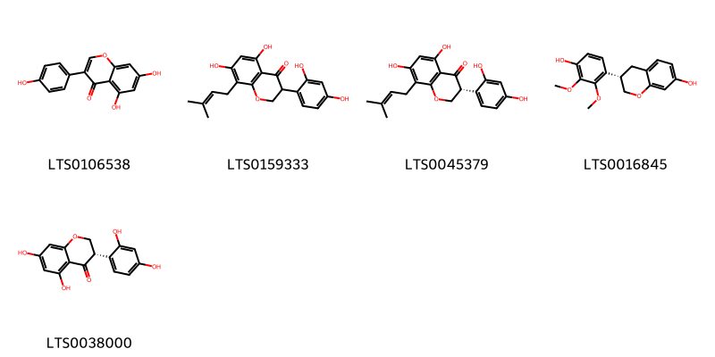
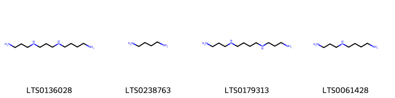
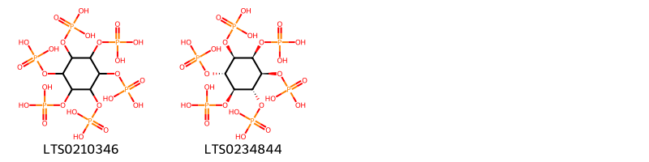
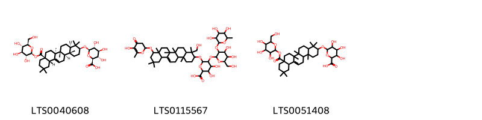
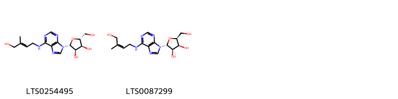
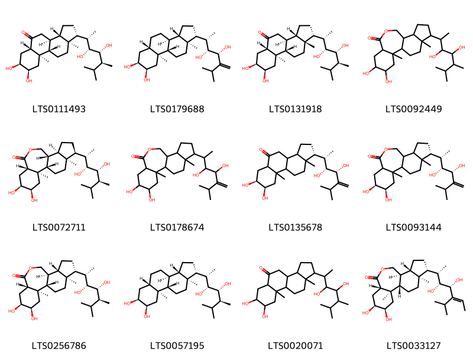

::: {.callout-note title = "Tóm tắt"}

Đậu ván trắng (Hạt) (Semen Lablabi purpurei) là hạt của cây đậu ván trắng (Lablab purpureus (L.) Sweet), thuộc họ Đậu (Fabaceae). Đậu ván trắng phân bố chủ yếu ở các khu vực nhiệt đới và cận nhiệt đới của châu Phi như Angola, Ghana, Nigeria, và được trồng rộng rãi tại Việt Nam, Ấn Độ, Thái Lan, Brazil, và nhiều nơi khác. Theo y học cổ truyền, đậu ván trắng có vị ngọt, tính bình, quy vào kinh tỳ và vị, thường được dùng để kiện tỳ hòa trung, giải thử hóa thấp, giải độc rượu, và hỗ trợ điều trị các bệnh về tiêu hóa như nôn mửa, tỳ vị hư nhược, và đại tiện lỏng. Tác dụng dược lý của đậu ván trắng bao gồm kháng viêm, giải độc, hỗ trợ tiêu hóa, chống ngộ độc thực phẩm, và viêm dạ dày ruột cấp tính. Thành phần hóa học chính gồm flavonoid, alkaloid, và saponin.

:::

## I. Thông tin về dược liệu 

::: {.panel-tabset}

### Định danh

- Dược liệu tiếng Việt: Đậu Ván Trắng - Hạt
- Dược liệu tiếng Trung: nan (nan)
- Dược liệu tiếng Anh: nan
- Dược liệu latin thông dụng: Semen Lablab
- Dược liệu latin kiểu DĐVN: *nan*
- Dược liệu latin kiểu DĐVN: *nan*
- Dược liệu latin kiểu thông tư: *nan*
- Bộ phận dùng: Hạt (Semen)

### Mô tả dược liệu 

**Theo dược điển Việt nam V:** nan 
 
**Mô tả dược liệu theo thông tư chế biến dược liệu theo phương pháp cổ truyền:** nan

### Chế biến 

**Chế biến theo dược điển việt nam V**: nan 

**Chế biến theo thông tư:** nan

::: 

## II. Thông tin về thực vật

Dược liệu **Đậu Ván Trắng - Hạt** từ bộ phận **Hạt** từ loài *Lablab purpureus*.

**Mô tả thực vật:** Đậu ván trắng là một loại dây leo, sống 1-3 năm, có thể leo dài tới 5m hay hơn. Thân leo màu xanh có góc, hơi có rãnh, trên mép của hạt, kéo dài chiếm 1/3-1/2 chu vi có lòng thưa dài, mềm. Lá mọc cách, kép, mỗi lá có 3 lá chét hình trứng, phía dưới hơi bè ra hình quả trầm, lá chét dài 5-10cm, rộng 4-8cm, cuống lá chét giữa dài 2-3,5cm, cuống lá chét 2 bên dài chừng 5mm. Cuống chung dài 4-13cm, phần cuối hơi phình ra. Hoa mọc thành chùm, ở ngọn cành và kẽ lá, cuống cụm hoa dài 6-15cm, mang hoa ở 1/3-1/2 trên. Mỗi mẫu có 2-3 hoa hình bướm màu tím nhạt, cuống của từng hoa dài 2-3cm. Đài hoa hình ống, có 5 răng đều nhau hình tam giác. Tràng 5 cánh, tiền khai hoa cờ 10 nhị xếp thành 2 vòng, 1 nhị đơn độc, 9 nhị khác dính vào nhau thành màng bao quanh nhụy 1 lá noãn. Quả giáp màu xanh nhạt, khi chín có màu vàng nhạt, dài 5-9cm, rộng 1,5- 2,5cm, hơi cong về một phía giống hình lưỡi liềm, trên đầu có mỏ nhọn cong lên phía lưng quả, hai mép sần sùi, trong quả chứa 2-4 hạt hình trứng hay hình thận, không cân đối, màu trắng ngà, dài 8- 12mm, rộng 6-8mm, dày 2-4mm, rốn hạt hình trái xoan, dài 3mm, màu trắng, ngay sát rốn là lỗ noãn màu nâu thẫm. Từ rốn có một mồng màu trắng, nổi hẳn lên một phía hạt đậu thành hình lưỡi liềm, rộng 3-4mm, trên mỏng trắng có 2 đường rãnh chia mồng thành 3 phần. Mùa hoa: Cuối hạ đầu thu

*Tài liệu tham khảo:* "Những cây thuốc và vị thuốc Việt Nam" - Đỗ Tất Lợi 
Trong dược điển Việt nam, loài *Lablab purpureus* được sử dụng làm dược liệu.

            
::: {.callout-note title = "Phân loại thực vật của *Lablab purpureus*"}

**Kingdom:** Plantae 

**Phylum:** Tracheophyta 

**Order:** Fabales 
 
**Family:** Fabaceae 
 
**Genus:** Lablab 
 
**Species:** *Lablab purpureus* 
 

:::

::: {style="display: grid;grid-template-columns: repeat(auto-fill, minmax(150px, 1fr));grid-gap: 1em;"}
{ group="GIBF" }

{ group="GIBF" }

{ group="GIBF" }

{ group="GIBF" }

{ group="GIBF" }

{ group="GIBF" }

{ group="GIBF" }

{ group="GIBF" }

{ group="GIBF" }

{ group="GIBF" }

{ group="GIBF" }
:::

**Phân bố trên thế giới:** Haiti, Korea, Republic of, Cuba, Singapore, Cabo Verde, Guadeloupe, Spain, Mexico, Chinese Taipei, Hong Kong, Réunion, South Africa, British Indian Ocean Territory, Eswatini, Indonesia, Myanmar, Virgin Islands (U.S.), Mozambique, Romania, Saint Kitts and Nevis, India, Palau, Brazil, Northern Mariana Islands, Thailand, Serbia, United States of America, China, Dominican Republic, Fiji, Malaysia, New Zealand, Canada, Ecuador, Maldives, Puerto Rico

**Phân bố tại Việt nam:** Không có ghi nhận ở Việt Nam

<iframe src="Semen Lablab/map_distribution.html" width="100%" height="600" style="border:none;"></iframe>

## III. Thành phần hóa học

Theo tài liệu của GS. Đỗ Tất Lợi:  Hạt đậu ván trắng chứa các thành phần có tác dụng kháng viêm, giải độc và hỗ trợ tiêu hóa, trong đó có thể bao gồm các hợp chất flavonoid, alkaloid và saponin.
    

Theo cơ sở dữ liệu lotus, loài *Lablab purpureus* đã phân lập và xác định được **55** hoạt chất thuộc về các nhóm 2-arylbenzofuran flavonoids, Isoflavonoids, Flavonoids, Purine nucleosides, Organonitrogen compounds, Steroids and steroid derivatives, Organooxygen compounds, Imidazopyrimidines, Prenol lipids trong bảng dưới đây.
        
| chemicalTaxonomyClassyfireClass   |   smiles_count |
|:----------------------------------|---------------:|
| 2-arylbenzofuran flavonoids       |             31 |
| Flavonoids                        |            162 |
| Imidazopyrimidines                |             29 |
| Isoflavonoids                     |            206 |
| Organonitrogen compounds          |             44 |
| Organooxygen compounds            |            178 |
| Prenol lipids                     |            425 |
| Purine nucleosides                |            117 |
| Steroids and steroid derivatives  |           1147 |

Danh sách chi tiết các hoạt chất như sau: 

::: {style="display: grid;grid-template-columns: repeat(auto-fill, minmax(150px, 1fr));grid-gap: 1em;"}

                                                              
{ group="compound" description="Cấu trúc hóa học của các hoạt chất thuộc nhóm *2-arylbenzofuran flavonoids* là vignafuran [(LTS0149167)](https://lotus.naturalproducts.net/compound/lotus_id/LTS0149167)." }

                                                              
{ group="compound" description="Cấu trúc hóa học của các hoạt chất thuộc nhóm *Flavonoids* là 5-hydroxy-2-(4-hydroxyphenyl)-3-{[(2s,3r,4s,5s,6r)-3,4,5-trihydroxy-6-(hydroxymethyl)oxan-2-yl]oxy}chromen-7-one [(LTS0103335)](https://lotus.naturalproducts.net/compound/lotus_id/LTS0103335), 5-hydroxy-3-{[(2s,3r,4s,5s,6r)-3,4,5-trihydroxy-6-(hydroxymethyl)oxan-2-yl]oxy}-2-(3,4,5-trihydroxyphenyl)chromen-7-one [(LTS0073780)](https://lotus.naturalproducts.net/compound/lotus_id/LTS0073780)." }

                                                              
{ group="compound" description="Cấu trúc hóa học của các hoạt chất thuộc nhóm *Imidazopyrimidines* là zeatine [(LTS0032706)](https://lotus.naturalproducts.net/compound/lotus_id/LTS0032706)." }

                                                              
{ group="compound" description="Cấu trúc hóa học của các hoạt chất thuộc nhóm *Isoflavonoids* là genistein [(LTS0106538)](https://lotus.naturalproducts.net/compound/lotus_id/LTS0106538), kievitone [(LTS0159333)](https://lotus.naturalproducts.net/compound/lotus_id/LTS0159333), (3r)-3-(2,4-dihydroxyphenyl)-5,7-dihydroxy-8-(3-methylbut-2-en-1-yl)-2,3-dihydro-1-benzopyran-4-one [(LTS0045379)](https://lotus.naturalproducts.net/compound/lotus_id/LTS0045379), (3s)-3-(4-hydroxy-2,3-dimethoxyphenyl)-3,4-dihydro-2h-1-benzopyran-7-ol [(LTS0016845)](https://lotus.naturalproducts.net/compound/lotus_id/LTS0016845), (3s)-3-(2,4-dihydroxyphenyl)-5,7-dihydroxy-2,3-dihydro-1-benzopyran-4-one [(LTS0038000)](https://lotus.naturalproducts.net/compound/lotus_id/LTS0038000)." }

                                                              
{ group="compound" description="Cấu trúc hóa học của các hoạt chất thuộc nhóm *Organonitrogen compounds* là thermospermine [(LTS0136028)](https://lotus.naturalproducts.net/compound/lotus_id/LTS0136028), putrescine [(LTS0238763)](https://lotus.naturalproducts.net/compound/lotus_id/LTS0238763), spermine [(LTS0179313)](https://lotus.naturalproducts.net/compound/lotus_id/LTS0179313), spermidine [(LTS0061428)](https://lotus.naturalproducts.net/compound/lotus_id/LTS0061428)." }

                                                              
{ group="compound" description="Cấu trúc hóa học của các hoạt chất thuộc nhóm *Organooxygen compounds* là phytic acid [(LTS0210346)](https://lotus.naturalproducts.net/compound/lotus_id/LTS0210346), [(1r,2r,3s,4r,5s,6s)-2,3,4,5,6-pentakis(phosphonooxy)cyclohexyl]oxyphosphonic acid [(LTS0234844)](https://lotus.naturalproducts.net/compound/lotus_id/LTS0234844)." }

                                                              
{ group="compound" description="Cấu trúc hóa học của các hoạt chất thuộc nhóm *Prenol lipids* là calenduloside f [(LTS0040608)](https://lotus.naturalproducts.net/compound/lotus_id/LTS0040608), 5-{[4,5-dihydroxy-6-(hydroxymethyl)-3-[(3,4,5-trihydroxy-6-methyloxan-2-yl)oxy]oxan-2-yl]oxy}-3,4-dihydroxy-6-({9-[(5-hydroxy-6-methyl-4-oxo-2,3-dihydropyran-2-yl)oxy]-4-(hydroxymethyl)-4,6a,6b,8a,11,11,14b-heptamethyl-1,2,3,4a,5,6,7,8,9,10,12,12a,14,14a-tetradecahydropicen-3-yl}oxy)oxane-2-carboxylic acid [(LTS0115567)](https://lotus.naturalproducts.net/compound/lotus_id/LTS0115567), 6-{[4,4,6a,6b,11,11,14b-heptamethyl-8a-({[3,4,5-trihydroxy-6-(hydroxymethyl)oxan-2-yl]oxy}carbonyl)-1,2,3,4a,5,6,7,8,9,10,12,12a,14,14a-tetradecahydropicen-3-yl]oxy}-3,4,5-trihydroxyoxane-2-carboxylic acid [(LTS0051408)](https://lotus.naturalproducts.net/compound/lotus_id/LTS0051408)." }

                                                              
{ group="compound" description="Cấu trúc hóa học của các hoạt chất thuộc nhóm *Purine nucleosides* là zeatin riboside [(LTS0254495)](https://lotus.naturalproducts.net/compound/lotus_id/LTS0254495), (2r,3r,4s,5s)-2-(6-{[(2z)-4-hydroxy-3-methylbut-2-en-1-yl]amino}purin-9-yl)-5-(hydroxymethyl)oxolane-3,4-diol [(LTS0087299)](https://lotus.naturalproducts.net/compound/lotus_id/LTS0087299)." }

                                                              
{ group="compound" description="Cấu trúc hóa học của các hoạt chất thuộc nhóm *Steroids and steroid derivatives* là castasterone [(LTS0111493)](https://lotus.naturalproducts.net/compound/lotus_id/LTS0111493), (2s,3r,4r)-2-[(1r,3as,3br,5as,7s,8r,9as,9bs,11as)-7,8-dihydroxy-9a,11a-dimethyl-tetradecahydro-1h-cyclopenta[a]phenanthren-1-yl]-6-methyl-5-methylideneheptane-3,4-diol [(LTS0179688)](https://lotus.naturalproducts.net/compound/lotus_id/LTS0179688), (1r,3as,3bs,5as,7s,8r,9ar,9bs,11ar)-1-[(2s,3r,4r,5s)-3,4-dihydroxy-5,6-dimethylheptan-2-yl]-7,8-dihydroxy-9a,11a-dimethyl-tetradecahydrocyclopenta[a]phenanthren-5-one [(LTS0131918)](https://lotus.naturalproducts.net/compound/lotus_id/LTS0131918), 24-epibrassinolide [(LTS0092449)](https://lotus.naturalproducts.net/compound/lotus_id/LTS0092449), (1s,2r,4r,5s,7s,11r,12r,15s,16s)-15-[(2s,3r,4r,5s)-3,4-dihydroxy-5,6-dimethylheptan-2-yl]-4,5-dihydroxy-2,16-dimethyl-9-oxatetracyclo[9.7.0.0²,⁷.0¹²,¹⁶]octadecan-8-one [(LTS0072711)](https://lotus.naturalproducts.net/compound/lotus_id/LTS0072711), 15-(3,4-dihydroxy-6-methyl-5-methylideneheptan-2-yl)-4,5-dihydroxy-2,16-dimethyl-9-oxatetracyclo[9.7.0.0²,⁷.0¹²,¹⁶]octadecan-8-one [(LTS0178674)](https://lotus.naturalproducts.net/compound/lotus_id/LTS0178674), (1r,7s,8r)-1-[(2s,3r,4r)-3,4-dihydroxy-6-methyl-5-methylideneheptan-2-yl]-7,8-dihydroxy-9a,11a-dimethyl-tetradecahydrocyclopenta[a]phenanthren-5-one [(LTS0135678)](https://lotus.naturalproducts.net/compound/lotus_id/LTS0135678), (4r,5s,15r)-15-[(2s,3r,4r)-3,4-dihydroxy-6-methyl-5-methylideneheptan-2-yl]-4,5-dihydroxy-2,16-dimethyl-9-oxatetracyclo[9.7.0.0²,⁷.0¹²,¹⁶]octadecan-8-one [(LTS0093144)](https://lotus.naturalproducts.net/compound/lotus_id/LTS0093144), brassinolide [(LTS0256786)](https://lotus.naturalproducts.net/compound/lotus_id/LTS0256786), 6-deoxocastasterone [(LTS0057195)](https://lotus.naturalproducts.net/compound/lotus_id/LTS0057195), 1-(3,4-dihydroxy-5,6-dimethylheptan-2-yl)-7,8-dihydroxy-9a,11a-dimethyl-tetradecahydrocyclopenta[a]phenanthren-5-one [(LTS0020071)](https://lotus.naturalproducts.net/compound/lotus_id/LTS0020071), (1s,2r,4r,5s,7s,11s,12s,15r,16s)-15-[(2s,3r,4r,5e)-3,4-dihydroxy-5-isopropylhept-5-en-2-yl]-4,5-dihydroxy-2,16-dimethyl-9-oxatetracyclo[9.7.0.0²,⁷.0¹²,¹⁶]octadecan-8-one [(LTS0033127)](https://lotus.naturalproducts.net/compound/lotus_id/LTS0033127)." }

:::

---

## IV. Tác dụng dược lý

Theo tài liệu quốc tế: nan

---

## V. Dược điển Việt Nam V

### Soi bột

nan

::: {#listing-soibot}
:::

### Vi phẫu

nan

::: {#listing-viphau}
:::

### Định tính

nan

### Định lượng

nan

### Thông tin khác 

- **Độ ẩm:** nan
- **Bảo quản:** nan

## VI. Dược điển Hồng kong

::: {#listing-DDHK}
:::

---

## VII. Y dược học cổ truyền

::: {.callout-note title = "nan" }

**Tên vị thuốc:** nan

**Tính:** nan

**Vị:** nan

**Quy kinh:**  nan

**Công năng chủ trị:** nan

**Phân loại theo thông tư:** nan

**Tác dụng theo y dược cổ truyền:** nan

**Chú ý:** nan

**Kiêng kỵ:** nan 

:::

::: {#listing-ViThuoc}
:::

