::: {.callout-note title = "Tóm tắt"}

nan

:::

## I. Thông tin về dược liệu 

::: {.panel-tabset}

### Định danh

- Dược liệu tiếng Việt: Nhục Đậu Khấu - Hạt
- Dược liệu tiếng Trung: nan (nan)
- Dược liệu tiếng Anh: nan
- Dược liệu latin thông dụng: Semen Myristicae
- Dược liệu latin kiểu DĐVN: *nan*
- Dược liệu latin kiểu DĐVN: *Myristicae Semen*
- Dược liệu latin kiểu thông tư: *Semen Myristicae*
- Bộ phận dùng: Hạt (Semen)

### Mô tả dược liệu 

**Theo dược điển Việt nam V:** Hạt hình trứng hoặc hình bầu dục, dài 2 cm đến 3 cm, đường kính 1,5 cm đến 2,5 cm. Mặt ngoài màu nâu tro hoặc vàng xám, có khi phủ phấn trắng, có rãnh dọc, mờ nhạt và nếp nhăn hình mạng lưới không đều. Có rốn ở đầu tù (rốn ở vị trí rễ mầm) là một điểm lồi tròn, màu nhạt. Hợp điểm lõm và tối, noãn nhân dọc nối hai đầu hạt. Ngoài cùng là lớp vỏ hạt rồi đến lớp ngoại nhũ sát lớp vỏ hạt. Cây mầm nàm trong một khoang rộng. Chất cứng, mặt gãy có vân hoa đá màu vàng nâu, đầu tù. Có thể thấy phôi nhăn, khô, nhiêu dầu, mùi thơm nồng, vị cay. 
 
**Mô tả dược liệu theo thông tư chế biến dược liệu theo phương pháp cổ truyền:** nan

### Chế biến 

**Chế biến theo dược điển việt nam V**: Thu hái vào mùa hè và mùa thu, hái quả nở, bóc bỏ vỏ, tách riêng phần thịt quả và hạt. Hạt phơi và sấy khô, đập lấy nhân hạt. Bào chế Nhục đậu khấu sống: Loại bỏ tạp chất, rửa sạch, phơi hoặc sấy khô. Nhục đậu khấu lùi (ổi Nhục đậu khấu): Lấy bột mỳ hòa vào lượng nước thích hợp, cho Nhục đậu khấu vào khuấy đều đổ tạo lớp áo hoặc tẩm ẩm Nhục đậu khấu cho vào nồi bao, vừa quay nồi bao vừa cho bột mỳ vừa phun nước và đun nóng nhẹ để tạo 3 lóp đến 4 lớp bao bột mỳ. Cho Nhục đậu khấu đã được bao ở trên vào chảo cát hoặc Hoạt thạch nóng, sao cho đến khi lớp bột mỳ có màu xém, sàng bỏ cát hoặc Hoạt thạch, bỏ vỏ bột mỳ và để nguội. Dùng 50 kg Hoạt thạch cho 100 kg Nhục đậu khấu. 

**Chế biến theo thông tư:** nan

::: 

## II. Thông tin về thực vật

Dược liệu **Nhục Đậu Khấu - Hạt** từ bộ phận **Hạt** từ loài *Myristica fragrans*.

**Mô tả thực vật:** nan

*Tài liệu tham khảo:* nan 
Trong dược điển Việt nam, loài *Myristica fragrans* được sử dụng làm dược liệu.

            
::: {.callout-note title = "Phân loại thực vật của *Myristica fragrans*"}

**Kingdom:** Plantae 

**Phylum:** Tracheophyta 

**Order:** Magnoliales 
 
**Family:** Myristicaceae 
 
**Genus:** Myristica 
 
**Species:** *Myristica fragrans* 
 

:::

::: {style="display: grid;grid-template-columns: repeat(auto-fill, minmax(150px, 1fr));grid-gap: 1em;"}
{ group="GIBF" }

{ group="GIBF" }

{ group="GIBF" }

{ group="GIBF" }

{ group="GIBF" }

{ group="GIBF" }

{ group="GIBF" }

{ group="GIBF" }

{ group="GIBF" }

{ group="GIBF" }

{ group="GIBF" }
:::

**Phân bố trên thế giới:** nan, French Polynesia, El Salvador, Trinidad and Tobago, unknown or invalid, Dominican Republic, Comoros, Indonesia, Panama, Réunion, Saint Lucia, Türkiye, Papua New Guinea, Jamaica, Georgia, Micronesia (Federated States of), India, Belgium, Madagascar, Dominica, Brazil, Chinese Taipei, Tanzania, United Republic of, Sao Tome and Principe, Nicaragua, Grenada, Sri Lanka, Bangladesh, Cook Islands, Thailand, Honduras, Benin, Philippines, Puerto Rico, Malaysia, Equatorial Guinea, Mauritius, Guadeloupe, Norway, Singapore, Côte d’Ivoire, Peru, Saint Vincent and the Grenadines, France, China, Spain, Samoa, Costa Rica, United States of America, Mayotte, Seychelles, Iraq

**Phân bố tại Việt nam:** Không có ghi nhận ở Việt Nam

<iframe src="Semen Myristicae/map_distribution.html" width="100%" height="600" style="border:none;"></iframe>

## III. Thành phần hóa học

Theo tài liệu của GS. Đỗ Tất Lợi:  nan
    

Theo cơ sở dữ liệu lotus, loài *Myristica fragrans* đã phân lập và xác định được **178** hoạt chất thuộc về các nhóm Cinnamic acids and derivatives, Dibenzylbutane lignans, Aryltetralin lignans, Organooxygen compounds, Benzene and substituted derivatives, Glycerolipids, Prenol lipids, Furanoid lignans, Phenol esters, 2-arylbenzofuran flavonoids, Stilbenes, Fatty Acyls, Benzodioxoles, Cinnamyl alcohols, Benzofurans, Flavonoids, Phenol ethers, Linear 1,3-diarylpropanoids, Oxepanes, Phenols trong bảng dưới đây.
        
| chemicalTaxonomyClassyfireClass     |   smiles_count |
|:------------------------------------|---------------:|
|                                     |           1298 |
| 2-arylbenzofuran flavonoids         |           1107 |
| Aryltetralin lignans                |            219 |
| Benzene and substituted derivatives |            199 |
| Benzodioxoles                       |             82 |
| Benzofurans                         |             46 |
| Cinnamic acids and derivatives      |            120 |
| Cinnamyl alcohols                   |             94 |
| Dibenzylbutane lignans              |            828 |
| Fatty Acyls                         |            156 |
| Flavonoids                          |            129 |
| Furanoid lignans                    |           1855 |
| Glycerolipids                       |             62 |
| Linear 1,3-diarylpropanoids         |             84 |
| Organooxygen compounds              |            272 |
| Oxepanes                            |             22 |
| Phenol esters                       |             25 |
| Phenol ethers                       |             74 |
| Phenols                             |            401 |
| Prenol lipids                       |            425 |
| Stilbenes                           |             87 |

Danh sách chi tiết các hoạt chất như sau: 

::: {style="display: grid;grid-template-columns: repeat(auto-fill, minmax(150px, 1fr));grid-gap: 1em;"}

                                                              
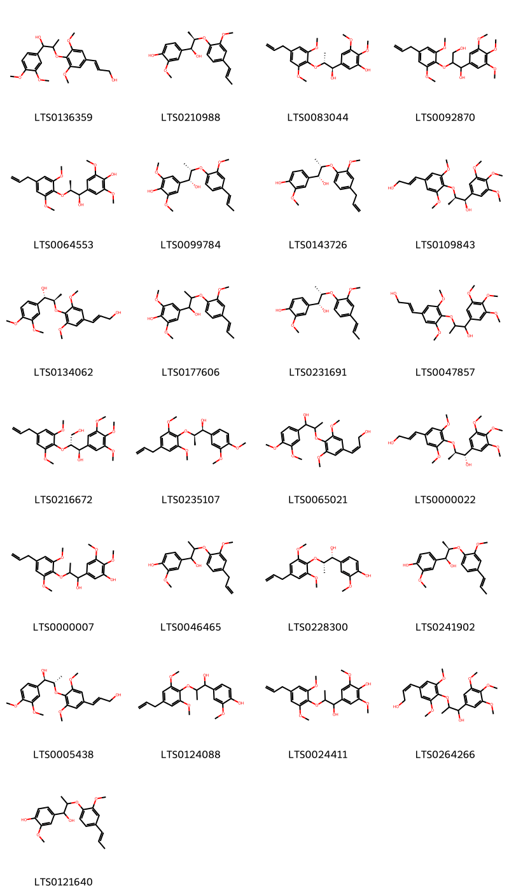{ group="compound" description="Cấu trúc hóa học của các hoạt chất thuộc nhóm ** là 3-(4-{[1-(3,4-dimethoxyphenyl)-1-hydroxypropan-2-yl]oxy}-3,5-dimethoxyphenyl)prop-2-en-1-ol [(LTS0136359)](https://lotus.naturalproducts.net/compound/lotus_id/LTS0136359), 4-[(1s,2r)-1-hydroxy-2-{2-methoxy-4-[(1e)-prop-1-en-1-yl]phenoxy}propyl]-2-methoxyphenol [(LTS0210988)](https://lotus.naturalproducts.net/compound/lotus_id/LTS0210988), 5-[(1r,2r)-2-[2,6-dimethoxy-4-(prop-2-en-1-yl)phenoxy]-1-hydroxypropyl]-2,3-dimethoxyphenol [(LTS0083044)](https://lotus.naturalproducts.net/compound/lotus_id/LTS0083044), 2-[2,6-dimethoxy-4-(prop-2-en-1-yl)phenoxy]-1-(3,4,5-trimethoxyphenyl)propane-1,3-diol [(LTS0092870)](https://lotus.naturalproducts.net/compound/lotus_id/LTS0092870), 4-[(1r,2s)-2-[2,6-dimethoxy-4-(prop-2-en-1-yl)phenoxy]-1-hydroxypropyl]-2,6-dimethoxyphenol [(LTS0064553)](https://lotus.naturalproducts.net/compound/lotus_id/LTS0064553), 4-[(1r,2s)-1-hydroxy-2-{2-methoxy-4-[(1e)-prop-1-en-1-yl]phenoxy}propyl]-2,6-dimethoxyphenol [(LTS0099784)](https://lotus.naturalproducts.net/compound/lotus_id/LTS0099784), 4-[(1r,2s)-1-hydroxy-2-[2-methoxy-4-(prop-2-en-1-yl)phenoxy]propyl]-2-methoxyphenol [(LTS0143726)](https://lotus.naturalproducts.net/compound/lotus_id/LTS0143726), (2e)-3-(4-{[(1r,2r)-1-hydroxy-1-(3,4,5-trimethoxyphenyl)propan-2-yl]oxy}-3,5-dimethoxyphenyl)prop-2-en-1-ol [(LTS0109843)](https://lotus.naturalproducts.net/compound/lotus_id/LTS0109843), (2e)-3-(4-{[(1s,2r)-1-(3,4-dimethoxyphenyl)-1-hydroxypropan-2-yl]oxy}-3,5-dimethoxyphenyl)prop-2-en-1-ol [(LTS0134062)](https://lotus.naturalproducts.net/compound/lotus_id/LTS0134062), 4-{1-hydroxy-2-[2-methoxy-4-(prop-1-en-1-yl)phenoxy]propyl}-2,6-dimethoxyphenol [(LTS0177606)](https://lotus.naturalproducts.net/compound/lotus_id/LTS0177606), 4-[(1r,2s)-1-hydroxy-2-{2-methoxy-4-[(1e)-prop-1-en-1-yl]phenoxy}propyl]-2-methoxyphenol [(LTS0231691)](https://lotus.naturalproducts.net/compound/lotus_id/LTS0231691), 3-(4-{[1-hydroxy-1-(3,4,5-trimethoxyphenyl)propan-2-yl]oxy}-3,5-dimethoxyphenyl)prop-2-en-1-ol [(LTS0047857)](https://lotus.naturalproducts.net/compound/lotus_id/LTS0047857), (1r,2r)-2-[2,6-dimethoxy-4-(prop-2-en-1-yl)phenoxy]-1-(3,4,5-trimethoxyphenyl)propane-1,3-diol [(LTS0216672)](https://lotus.naturalproducts.net/compound/lotus_id/LTS0216672), (1s,2r)-2-[2,6-dimethoxy-4-(prop-2-en-1-yl)phenoxy]-1-(3,4-dimethoxyphenyl)propan-1-ol [(LTS0235107)](https://lotus.naturalproducts.net/compound/lotus_id/LTS0235107), (2z)-3-(4-{[1-(3,4-dimethoxyphenyl)-1-hydroxypropan-2-yl]oxy}-3,5-dimethoxyphenyl)prop-2-en-1-ol [(LTS0065021)](https://lotus.naturalproducts.net/compound/lotus_id/LTS0065021), (2e)-3-(4-{[(1s,2r)-1-hydroxy-1-(3,4,5-trimethoxyphenyl)propan-2-yl]oxy}-3,5-dimethoxyphenyl)prop-2-en-1-ol [(LTS0000022)](https://lotus.naturalproducts.net/compound/lotus_id/LTS0000022), 5-{2-[2,6-dimethoxy-4-(prop-2-en-1-yl)phenoxy]-1-hydroxypropyl}-2,3-dimethoxyphenol [(LTS0000007)](https://lotus.naturalproducts.net/compound/lotus_id/LTS0000007), 4-{1-hydroxy-2-[2-methoxy-4-(prop-2-en-1-yl)phenoxy]propyl}-2-methoxyphenol [(LTS0046465)](https://lotus.naturalproducts.net/compound/lotus_id/LTS0046465), 4-[(1r,2s)-2-[2,6-dimethoxy-4-(prop-2-en-1-yl)phenoxy]-1-hydroxypropyl]-2-methoxyphenol [(LTS0228300)](https://lotus.naturalproducts.net/compound/lotus_id/LTS0228300), 4-[(1s,2r)-1-hydroxy-2-[2-methoxy-4-(prop-1-en-1-yl)phenoxy]propyl]-2-methoxyphenol [(LTS0241902)](https://lotus.naturalproducts.net/compound/lotus_id/LTS0241902), (2e)-3-(4-{[(1r,2s)-1-(3,4-dimethoxyphenyl)-1-hydroxypropan-2-yl]oxy}-3,5-dimethoxyphenyl)prop-2-en-1-ol [(LTS0005438)](https://lotus.naturalproducts.net/compound/lotus_id/LTS0005438), 4-{2-[2,6-dimethoxy-4-(prop-2-en-1-yl)phenoxy]-1-hydroxypropyl}-2-methoxyphenol [(LTS0124088)](https://lotus.naturalproducts.net/compound/lotus_id/LTS0124088), 4-{2-[2,6-dimethoxy-4-(prop-2-en-1-yl)phenoxy]-1-hydroxypropyl}-2,6-dimethoxyphenol [(LTS0024411)](https://lotus.naturalproducts.net/compound/lotus_id/LTS0024411), (2z)-3-(4-{[1-hydroxy-1-(3,4,5-trimethoxyphenyl)propan-2-yl]oxy}-3,5-dimethoxyphenyl)prop-2-en-1-ol [(LTS0264266)](https://lotus.naturalproducts.net/compound/lotus_id/LTS0264266), 4-{1-hydroxy-2-[2-methoxy-4-(prop-1-en-1-yl)phenoxy]propyl}-2-methoxyphenol [(LTS0121640)](https://lotus.naturalproducts.net/compound/lotus_id/LTS0121640)." }

                                                              
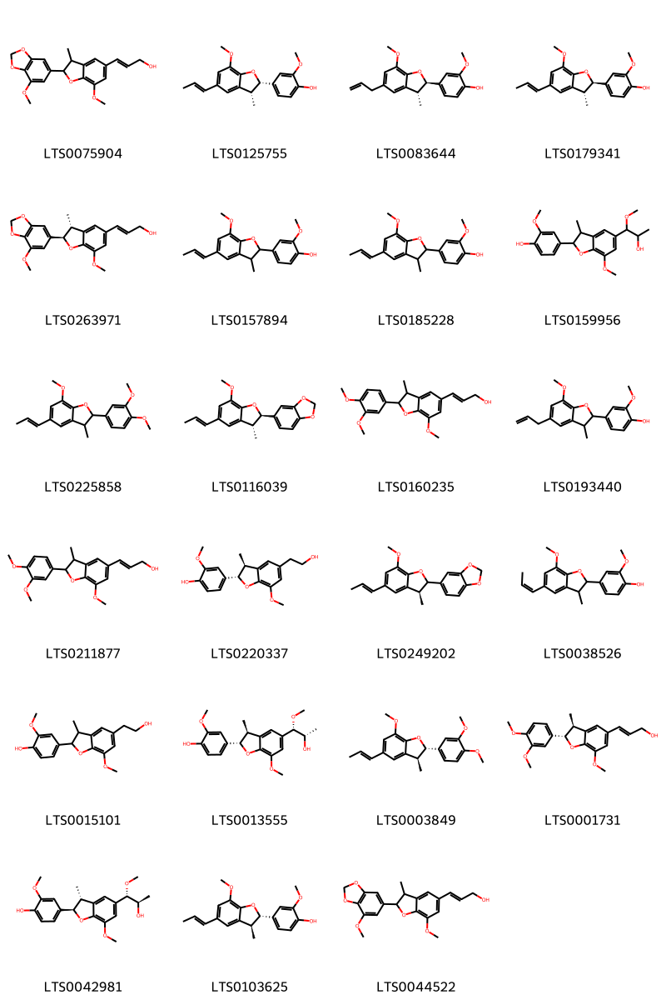{ group="compound" description="Cấu trúc hóa học của các hoạt chất thuộc nhóm *2-arylbenzofuran flavonoids* là (2e)-3-[7-methoxy-2-(7-methoxy-2h-1,3-benzodioxol-5-yl)-3-methyl-2,3-dihydro-1-benzofuran-5-yl]prop-2-en-1-ol [(LTS0075904)](https://lotus.naturalproducts.net/compound/lotus_id/LTS0075904), 2-methoxy-4-[(2s,3r)-7-methoxy-3-methyl-5-[(1e)-prop-1-en-1-yl]-2,3-dihydro-1-benzofuran-2-yl]phenol [(LTS0125755)](https://lotus.naturalproducts.net/compound/lotus_id/LTS0125755), 2-methoxy-4-[(2r,3r)-7-methoxy-3-methyl-5-(prop-2-en-1-yl)-2,3-dihydro-1-benzofuran-2-yl]phenol [(LTS0083644)](https://lotus.naturalproducts.net/compound/lotus_id/LTS0083644), 2-methoxy-4-[(2r,3r)-7-methoxy-3-methyl-5-[(1e)-prop-1-en-1-yl]-2,3-dihydro-1-benzofuran-2-yl]phenol [(LTS0179341)](https://lotus.naturalproducts.net/compound/lotus_id/LTS0179341), (2e)-3-[(2r,3r)-7-methoxy-2-(7-methoxy-2h-1,3-benzodioxol-5-yl)-3-methyl-2,3-dihydro-1-benzofuran-5-yl]prop-2-en-1-ol [(LTS0263971)](https://lotus.naturalproducts.net/compound/lotus_id/LTS0263971), 2-methoxy-4-{7-methoxy-3-methyl-5-[(1e)-prop-1-en-1-yl]-2,3-dihydro-1-benzofuran-2-yl}phenol [(LTS0157894)](https://lotus.naturalproducts.net/compound/lotus_id/LTS0157894), 2-methoxy-4-[7-methoxy-3-methyl-5-(prop-1-en-1-yl)-2,3-dihydro-1-benzofuran-2-yl]phenol [(LTS0185228)](https://lotus.naturalproducts.net/compound/lotus_id/LTS0185228), 4-[5-(2-hydroxy-1-methoxypropyl)-7-methoxy-3-methyl-2,3-dihydro-1-benzofuran-2-yl]-2-methoxyphenol [(LTS0159956)](https://lotus.naturalproducts.net/compound/lotus_id/LTS0159956), 2-(3,4-dimethoxyphenyl)-7-methoxy-3-methyl-5-(prop-1-en-1-yl)-2,3-dihydro-1-benzofuran [(LTS0225858)](https://lotus.naturalproducts.net/compound/lotus_id/LTS0225858), 5-[(2r,3r)-7-methoxy-3-methyl-5-[(1e)-prop-1-en-1-yl]-2,3-dihydro-1-benzofuran-2-yl]-2h-1,3-benzodioxole [(LTS0116039)](https://lotus.naturalproducts.net/compound/lotus_id/LTS0116039), (2e)-3-[2-(3,4-dimethoxyphenyl)-7-methoxy-3-methyl-2,3-dihydro-1-benzofuran-5-yl]prop-2-en-1-ol [(LTS0160235)](https://lotus.naturalproducts.net/compound/lotus_id/LTS0160235), 2-methoxy-4-[7-methoxy-3-methyl-5-(prop-2-en-1-yl)-2,3-dihydro-1-benzofuran-2-yl]phenol [(LTS0193440)](https://lotus.naturalproducts.net/compound/lotus_id/LTS0193440), 3-[2-(3,4-dimethoxyphenyl)-7-methoxy-3-methyl-2,3-dihydro-1-benzofuran-5-yl]prop-2-en-1-ol [(LTS0211877)](https://lotus.naturalproducts.net/compound/lotus_id/LTS0211877), 4-[(2s,3s)-5-(2-hydroxyethyl)-7-methoxy-3-methyl-2,3-dihydro-1-benzofuran-2-yl]-2-methoxyphenol [(LTS0220337)](https://lotus.naturalproducts.net/compound/lotus_id/LTS0220337), 5-[(3s)-7-methoxy-3-methyl-5-[(1e)-prop-1-en-1-yl]-2,3-dihydro-1-benzofuran-2-yl]-2h-1,3-benzodioxole [(LTS0249202)](https://lotus.naturalproducts.net/compound/lotus_id/LTS0249202), 2-methoxy-4-{7-methoxy-3-methyl-5-[(1z)-prop-1-en-1-yl]-2,3-dihydro-1-benzofuran-2-yl}phenol [(LTS0038526)](https://lotus.naturalproducts.net/compound/lotus_id/LTS0038526), 4-[5-(2-hydroxyethyl)-7-methoxy-3-methyl-2,3-dihydro-1-benzofuran-2-yl]-2-methoxyphenol [(LTS0015101)](https://lotus.naturalproducts.net/compound/lotus_id/LTS0015101), 4-[(2s,3s)-5-[(1s,2s)-2-hydroxy-1-methoxypropyl]-7-methoxy-3-methyl-2,3-dihydro-1-benzofuran-2-yl]-2-methoxyphenol [(LTS0013555)](https://lotus.naturalproducts.net/compound/lotus_id/LTS0013555), (2s,3s)-2-(3,4-dimethoxyphenyl)-7-methoxy-3-methyl-5-[(1e)-prop-1-en-1-yl]-2,3-dihydro-1-benzofuran [(LTS0003849)](https://lotus.naturalproducts.net/compound/lotus_id/LTS0003849), (2e)-3-[(2s,3s)-2-(3,4-dimethoxyphenyl)-7-methoxy-3-methyl-2,3-dihydro-1-benzofuran-5-yl]prop-2-en-1-ol [(LTS0001731)](https://lotus.naturalproducts.net/compound/lotus_id/LTS0001731), 4-[(2r,3r)-5-[(1s,2r)-2-hydroxy-1-methoxypropyl]-7-methoxy-3-methyl-2,3-dihydro-1-benzofuran-2-yl]-2-methoxyphenol [(LTS0042981)](https://lotus.naturalproducts.net/compound/lotus_id/LTS0042981), licarin a [(LTS0103625)](https://lotus.naturalproducts.net/compound/lotus_id/LTS0103625), 3-[7-methoxy-2-(7-methoxy-2h-1,3-benzodioxol-5-yl)-3-methyl-2,3-dihydro-1-benzofuran-5-yl]prop-2-en-1-ol [(LTS0044522)](https://lotus.naturalproducts.net/compound/lotus_id/LTS0044522)." }

                                                              
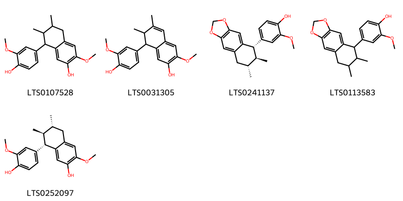{ group="compound" description="Cấu trúc hóa học của các hoạt chất thuộc nhóm *Aryltetralin lignans* là 8-(4-hydroxy-3-methoxyphenyl)-3-methoxy-6,7-dimethyl-5,6,7,8-tetrahydronaphthalen-2-ol [(LTS0107528)](https://lotus.naturalproducts.net/compound/lotus_id/LTS0107528), 8-(4-hydroxy-3-methoxyphenyl)-3-methoxy-6,7-dimethyl-7,8-dihydronaphthalen-2-ol [(LTS0031305)](https://lotus.naturalproducts.net/compound/lotus_id/LTS0031305), 4-[(5s,6s,7r)-6,7-dimethyl-2h,5h,6h,7h,8h-naphtho[2,3-d][1,3]dioxol-5-yl]-2-methoxyphenol [(LTS0241137)](https://lotus.naturalproducts.net/compound/lotus_id/LTS0241137), 4-{6,7-dimethyl-2h,5h,6h,7h,8h-naphtho[2,3-d][1,3]dioxol-5-yl}-2-methoxyphenol [(LTS0113583)](https://lotus.naturalproducts.net/compound/lotus_id/LTS0113583), (+)-guaiacin [(LTS0252097)](https://lotus.naturalproducts.net/compound/lotus_id/LTS0252097)." }

                                                              
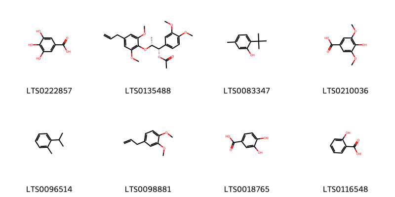{ group="compound" description="Cấu trúc hóa học của các hoạt chất thuộc nhóm *Benzene and substituted derivatives* là galop [(LTS0222857)](https://lotus.naturalproducts.net/compound/lotus_id/LTS0222857), (1s,2r)-2-[2,6-dimethoxy-4-(prop-2-en-1-yl)phenoxy]-1-(3,4-dimethoxyphenyl)propyl acetate [(LTS0135488)](https://lotus.naturalproducts.net/compound/lotus_id/LTS0135488), 6-tert-butyl-m-cresol [(LTS0083347)](https://lotus.naturalproducts.net/compound/lotus_id/LTS0083347), syringic acid [(LTS0210036)](https://lotus.naturalproducts.net/compound/lotus_id/LTS0210036), o-cymene [(LTS0096514)](https://lotus.naturalproducts.net/compound/lotus_id/LTS0096514), methyl eugenol [(LTS0098881)](https://lotus.naturalproducts.net/compound/lotus_id/LTS0098881), 3,4-dihydroxybenzoic acid [(LTS0018765)](https://lotus.naturalproducts.net/compound/lotus_id/LTS0018765), salicyclic acid [(LTS0116548)](https://lotus.naturalproducts.net/compound/lotus_id/LTS0116548)." }

                                                              
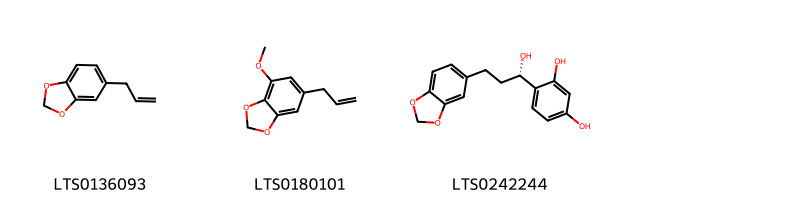{ group="compound" description="Cấu trúc hóa học của các hoạt chất thuộc nhóm *Benzodioxoles* là sassafras [(LTS0136093)](https://lotus.naturalproducts.net/compound/lotus_id/LTS0136093), myristicin [(LTS0180101)](https://lotus.naturalproducts.net/compound/lotus_id/LTS0180101), 4-[(1s)-3-(2h-1,3-benzodioxol-5-yl)-1-hydroxypropyl]benzene-1,3-diol [(LTS0242244)](https://lotus.naturalproducts.net/compound/lotus_id/LTS0242244)." }

                                                              
{ group="compound" description="Cấu trúc hóa học của các hoạt chất thuộc nhóm *Benzofurans* là 7-hydroxy-6-isopropyl-3',3'-dimethyl-2-oxospiro[1-benzofuran-3,1'-cyclohexane]-2',4-dicarbaldehyde [(LTS0255026)](https://lotus.naturalproducts.net/compound/lotus_id/LTS0255026)." }

                                                              
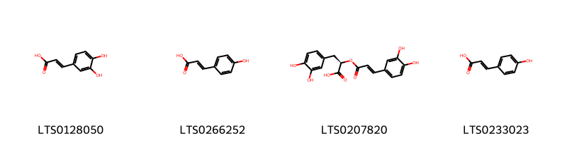{ group="compound" description="Cấu trúc hóa học của các hoạt chất thuộc nhóm *Cinnamic acids and derivatives* là 3,4-dihydroxycinnamic acid [(LTS0128050)](https://lotus.naturalproducts.net/compound/lotus_id/LTS0128050), para-coumaric acid [(LTS0266252)](https://lotus.naturalproducts.net/compound/lotus_id/LTS0266252), rosemary acid [(LTS0207820)](https://lotus.naturalproducts.net/compound/lotus_id/LTS0207820), hydroxycinnamic acid [(LTS0233023)](https://lotus.naturalproducts.net/compound/lotus_id/LTS0233023)." }

                                                              
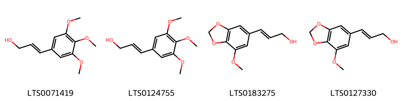{ group="compound" description="Cấu trúc hóa học của các hoạt chất thuộc nhóm *Cinnamyl alcohols* là 3-(3,4,5-trimethoxyphenyl)prop-2-en-1-ol [(LTS0071419)](https://lotus.naturalproducts.net/compound/lotus_id/LTS0071419), (2e)-3-(3,4,5-trimethoxyphenyl)prop-2-en-1-ol [(LTS0124755)](https://lotus.naturalproducts.net/compound/lotus_id/LTS0124755), (2e)-3-(7-methoxy-2h-1,3-benzodioxol-5-yl)prop-2-en-1-ol [(LTS0183275)](https://lotus.naturalproducts.net/compound/lotus_id/LTS0183275), 3-(7-methoxy-2h-1,3-benzodioxol-5-yl)prop-2-en-1-ol [(LTS0127330)](https://lotus.naturalproducts.net/compound/lotus_id/LTS0127330)." }

                                                              
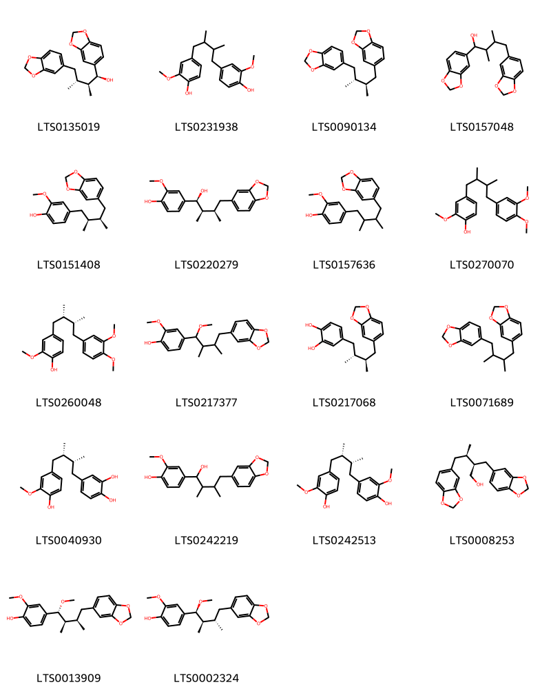{ group="compound" description="Cấu trúc hóa học của các hoạt chất thuộc nhóm *Dibenzylbutane lignans* là (1s,2s,3r)-1,4-bis(2h-1,3-benzodioxol-5-yl)-2,3-dimethylbutan-1-ol [(LTS0135019)](https://lotus.naturalproducts.net/compound/lotus_id/LTS0135019), 4-[4-(4-hydroxy-3-methoxyphenyl)-2,3-dimethylbutyl]-2-methoxyphenol [(LTS0231938)](https://lotus.naturalproducts.net/compound/lotus_id/LTS0231938), 5-[(2r,3r)-4-(2h-1,3-benzodioxol-5-yl)-2,3-dimethylbutyl]-2h-1,3-benzodioxole [(LTS0090134)](https://lotus.naturalproducts.net/compound/lotus_id/LTS0090134), 1,4-bis(2h-1,3-benzodioxol-5-yl)-2,3-dimethylbutan-1-ol [(LTS0157048)](https://lotus.naturalproducts.net/compound/lotus_id/LTS0157048), macelignan [(LTS0151408)](https://lotus.naturalproducts.net/compound/lotus_id/LTS0151408), 4-[(1s,2r,3r)-4-(2h-1,3-benzodioxol-5-yl)-1-hydroxy-2,3-dimethylbutyl]-2-methoxyphenol [(LTS0220279)](https://lotus.naturalproducts.net/compound/lotus_id/LTS0220279), macelignan [(LTS0157636)](https://lotus.naturalproducts.net/compound/lotus_id/LTS0157636), 4-[4-(3,4-dimethoxyphenyl)-2,3-dimethylbutyl]-2-methoxyphenol [(LTS0270070)](https://lotus.naturalproducts.net/compound/lotus_id/LTS0270070), 4-[(2s,3r)-4-(3,4-dimethoxyphenyl)-2,3-dimethylbutyl]-2-methoxyphenol [(LTS0260048)](https://lotus.naturalproducts.net/compound/lotus_id/LTS0260048), 4-[4-(2h-1,3-benzodioxol-5-yl)-1-methoxy-2,3-dimethylbutyl]-2-methoxyphenol [(LTS0217377)](https://lotus.naturalproducts.net/compound/lotus_id/LTS0217377), 4-[(2r,3r)-4-(2h-1,3-benzodioxol-5-yl)-2,3-dimethylbutyl]benzene-1,2-diol [(LTS0217068)](https://lotus.naturalproducts.net/compound/lotus_id/LTS0217068), 5-[4-(2h-1,3-benzodioxol-5-yl)-2,3-dimethylbutyl]-2h-1,3-benzodioxole [(LTS0071689)](https://lotus.naturalproducts.net/compound/lotus_id/LTS0071689), 4-[(2r,3s)-4-(4-hydroxy-3-methoxyphenyl)-2,3-dimethylbutyl]benzene-1,2-diol [(LTS0040930)](https://lotus.naturalproducts.net/compound/lotus_id/LTS0040930), 4-[4-(2h-1,3-benzodioxol-5-yl)-1-hydroxy-2,3-dimethylbutyl]-2-methoxyphenol [(LTS0242219)](https://lotus.naturalproducts.net/compound/lotus_id/LTS0242219), meso-dihydroguaiaretic acid [(LTS0242513)](https://lotus.naturalproducts.net/compound/lotus_id/LTS0242513), (2r,3r)-4-(2h-1,3-benzodioxol-5-yl)-2-(2h-1,3-benzodioxol-5-ylmethyl)-3-methylbutan-1-ol [(LTS0008253)](https://lotus.naturalproducts.net/compound/lotus_id/LTS0008253), 4-[(1r,2r,3r)-4-(2h-1,3-benzodioxol-5-yl)-1-methoxy-2,3-dimethylbutyl]-2-methoxyphenol [(LTS0013909)](https://lotus.naturalproducts.net/compound/lotus_id/LTS0013909), 4-[(1s,2r,3s)-4-(2h-1,3-benzodioxol-5-yl)-1-methoxy-2,3-dimethylbutyl]-2-methoxyphenol [(LTS0002324)](https://lotus.naturalproducts.net/compound/lotus_id/LTS0002324)." }

                                                              
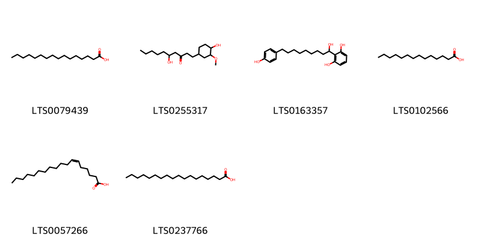{ group="compound" description="Cấu trúc hóa học của các hoạt chất thuộc nhóm *Fatty Acyls* là palmitic acid [(LTS0079439)](https://lotus.naturalproducts.net/compound/lotus_id/LTS0079439), 5-hydroxy-1-(4-hydroxy-3-methoxycyclohexyl)decan-3-one [(LTS0255317)](https://lotus.naturalproducts.net/compound/lotus_id/LTS0255317), 2-[1-hydroxy-9-(4-hydroxyphenyl)nonyl]benzene-1,3-diol [(LTS0163357)](https://lotus.naturalproducts.net/compound/lotus_id/LTS0163357), myristic acid [(LTS0102566)](https://lotus.naturalproducts.net/compound/lotus_id/LTS0102566), petroselinic acid [(LTS0057266)](https://lotus.naturalproducts.net/compound/lotus_id/LTS0057266), stearic acid [(LTS0237766)](https://lotus.naturalproducts.net/compound/lotus_id/LTS0237766)." }

                                                              
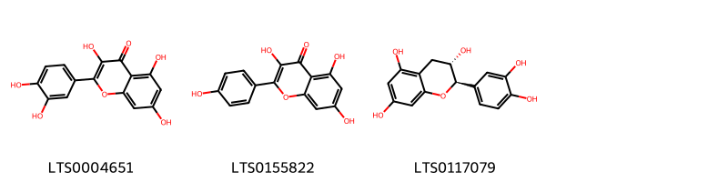{ group="compound" description="Cấu trúc hóa học của các hoạt chất thuộc nhóm *Flavonoids* là quercetin [(LTS0004651)](https://lotus.naturalproducts.net/compound/lotus_id/LTS0004651), kaempherol [(LTS0155822)](https://lotus.naturalproducts.net/compound/lotus_id/LTS0155822), (+)-catechol [(LTS0117079)](https://lotus.naturalproducts.net/compound/lotus_id/LTS0117079)." }

                                                              
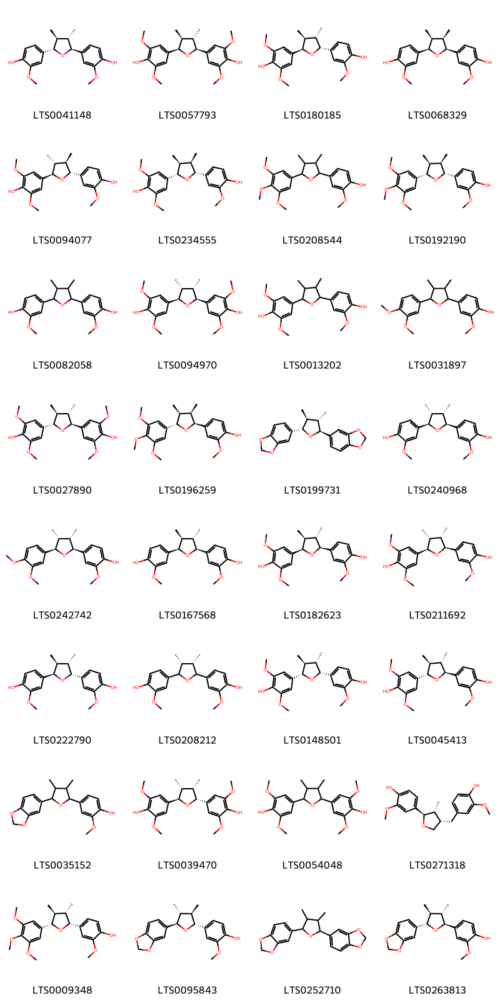{ group="compound" description="Cấu trúc hóa học của các hoạt chất thuộc nhóm *Furanoid lignans* là 4-[(2s,3s,4s,5s)-5-(4-hydroxy-3-methoxyphenyl)-3,4-dimethyloxolan-2-yl]-2-methoxyphenol [(LTS0041148)](https://lotus.naturalproducts.net/compound/lotus_id/LTS0041148), 4-[(2s,3s,4s,5r)-5-(4-hydroxy-3,5-dimethoxyphenyl)-3,4-dimethyloxolan-2-yl]-2,6-dimethoxyphenol [(LTS0057793)](https://lotus.naturalproducts.net/compound/lotus_id/LTS0057793), 4-[(2r,3s,4s,5r)-5-(4-hydroxy-3-methoxyphenyl)-3,4-dimethyloxolan-2-yl]-2,6-dimethoxyphenol [(LTS0180185)](https://lotus.naturalproducts.net/compound/lotus_id/LTS0180185), 4-[(2s,3r,4s,5r)-5-(4-hydroxy-3-methoxyphenyl)-3,4-dimethyloxolan-2-yl]-2-methoxyphenol [(LTS0068329)](https://lotus.naturalproducts.net/compound/lotus_id/LTS0068329), 4-[(2r,3r,4r,5r)-5-(4-hydroxy-3-methoxyphenyl)-3,4-dimethyloxolan-2-yl]-2,6-dimethoxyphenol [(LTS0094077)](https://lotus.naturalproducts.net/compound/lotus_id/LTS0094077), 4-[(2s,3s,4r,5r)-5-(4-hydroxy-3-methoxyphenyl)-3,4-dimethyloxolan-2-yl]-2,6-dimethoxyphenol [(LTS0234555)](https://lotus.naturalproducts.net/compound/lotus_id/LTS0234555), 4-[3,4-dimethyl-5-(3,4,5-trimethoxyphenyl)oxolan-2-yl]-2-methoxyphenol [(LTS0208544)](https://lotus.naturalproducts.net/compound/lotus_id/LTS0208544), 4-[(2r,3r,4s,5s)-3,4-dimethyl-5-(3,4,5-trimethoxyphenyl)oxolan-2-yl]-2-methoxyphenol [(LTS0192190)](https://lotus.naturalproducts.net/compound/lotus_id/LTS0192190), 4-[5-(4-hydroxy-3-methoxyphenyl)-3,4-dimethyloxolan-2-yl]-2-methoxyphenol [(LTS0082058)](https://lotus.naturalproducts.net/compound/lotus_id/LTS0082058), 4-[(2s,3s,4r,5r)-5-(4-hydroxy-3,5-dimethoxyphenyl)-3,4-dimethyloxolan-2-yl]-2,6-dimethoxyphenol [(LTS0094970)](https://lotus.naturalproducts.net/compound/lotus_id/LTS0094970), 4-[5-(4-hydroxy-3-methoxyphenyl)-3,4-dimethyloxolan-2-yl]-2,6-dimethoxyphenol [(LTS0013202)](https://lotus.naturalproducts.net/compound/lotus_id/LTS0013202), 4-[5-(3,4-dimethoxyphenyl)-3,4-dimethyloxolan-2-yl]-2-methoxyphenol [(LTS0031897)](https://lotus.naturalproducts.net/compound/lotus_id/LTS0031897), 4-[(2s,3s,4s,5s)-5-(4-hydroxy-3,5-dimethoxyphenyl)-3,4-dimethyloxolan-2-yl]-2,6-dimethoxyphenol [(LTS0027890)](https://lotus.naturalproducts.net/compound/lotus_id/LTS0027890), 4-[(2s,3r,4s,5s)-3,4-dimethyl-5-(3,4,5-trimethoxyphenyl)oxolan-2-yl]-2-methoxyphenol [(LTS0196259)](https://lotus.naturalproducts.net/compound/lotus_id/LTS0196259), galbacin [(LTS0199731)](https://lotus.naturalproducts.net/compound/lotus_id/LTS0199731), 4-[(2s,3s,4r,5r)-5-(4-hydroxy-3-methoxyphenyl)-3,4-dimethyloxolan-2-yl]-2-methoxyphenol [(LTS0240968)](https://lotus.naturalproducts.net/compound/lotus_id/LTS0240968), 4-[(2s,3s,4r,5r)-5-(3,4-dimethoxyphenyl)-3,4-dimethyloxolan-2-yl]-2-methoxyphenol [(LTS0242742)](https://lotus.naturalproducts.net/compound/lotus_id/LTS0242742), 4-[(2s,3s,4s,5r)-5-(4-hydroxy-3-methoxyphenyl)-3,4-dimethyloxolan-2-yl]-2-methoxyphenol [(LTS0167568)](https://lotus.naturalproducts.net/compound/lotus_id/LTS0167568), 4-[(2r,3s,4s,5s)-5-(4-hydroxy-3-methoxyphenyl)-3,4-dimethyloxolan-2-yl]-2,6-dimethoxyphenol [(LTS0182623)](https://lotus.naturalproducts.net/compound/lotus_id/LTS0182623), 4-[(2r,3r,4s,5s)-5-(4-hydroxy-3-methoxyphenyl)-3,4-dimethyloxolan-2-yl]-2,6-dimethoxyphenol [(LTS0211692)](https://lotus.naturalproducts.net/compound/lotus_id/LTS0211692), 4-[(2r,3s,4s,5r)-5-(4-hydroxy-3-methoxyphenyl)-3,4-dimethyloxolan-2-yl]-2-methoxyphenol [(LTS0222790)](https://lotus.naturalproducts.net/compound/lotus_id/LTS0222790), 4-[(3s,4r)-5-(4-hydroxy-3-methoxyphenyl)-3,4-dimethyloxolan-2-yl]-2-methoxyphenol [(LTS0208212)](https://lotus.naturalproducts.net/compound/lotus_id/LTS0208212), 4-[(2s,3s,4s,5r)-5-(4-hydroxy-3-methoxyphenyl)-3,4-dimethyloxolan-2-yl]-2,6-dimethoxyphenol [(LTS0148501)](https://lotus.naturalproducts.net/compound/lotus_id/LTS0148501), 4-[(2s,3s,4s,5s)-5-(4-hydroxy-3-methoxyphenyl)-3,4-dimethyloxolan-2-yl]-2,6-dimethoxyphenol [(LTS0045413)](https://lotus.naturalproducts.net/compound/lotus_id/LTS0045413), 4-[5-(2h-1,3-benzodioxol-5-yl)-3,4-dimethyloxolan-2-yl]-2-methoxyphenol [(LTS0035152)](https://lotus.naturalproducts.net/compound/lotus_id/LTS0035152), 4-[(2r,3s,4r,5r)-5-(4-hydroxy-3,5-dimethoxyphenyl)-3,4-dimethyloxolan-2-yl]-2,6-dimethoxyphenol [(LTS0039470)](https://lotus.naturalproducts.net/compound/lotus_id/LTS0039470), 4-[5-(4-hydroxy-3,5-dimethoxyphenyl)-3,4-dimethyloxolan-2-yl]-2,6-dimethoxyphenol [(LTS0054048)](https://lotus.naturalproducts.net/compound/lotus_id/LTS0054048), 4-[(2r,3r,4s)-4-[(4-hydroxy-3-methoxyphenyl)methyl]-3-methyloxolan-2-yl]-2-methoxyphenol [(LTS0271318)](https://lotus.naturalproducts.net/compound/lotus_id/LTS0271318), 4-[(2r,3s,4s,5s)-3,4-dimethyl-5-(3,4,5-trimethoxyphenyl)oxolan-2-yl]-2-methoxyphenol [(LTS0009348)](https://lotus.naturalproducts.net/compound/lotus_id/LTS0009348), 4-[(2r,3r,4r,5r)-5-(2h-1,3-benzodioxol-5-yl)-3,4-dimethyloxolan-2-yl]-2-methoxyphenol [(LTS0095843)](https://lotus.naturalproducts.net/compound/lotus_id/LTS0095843), 5-[5-(2h-1,3-benzodioxol-5-yl)-3,4-dimethyloxolan-2-yl]-2h-1,3-benzodioxole [(LTS0252710)](https://lotus.naturalproducts.net/compound/lotus_id/LTS0252710), 4-[(2s,3s,4s,5s)-5-(2h-1,3-benzodioxol-5-yl)-3,4-dimethyloxolan-2-yl]-2-methoxyphenol [(LTS0263813)](https://lotus.naturalproducts.net/compound/lotus_id/LTS0263813)." }

                                                              
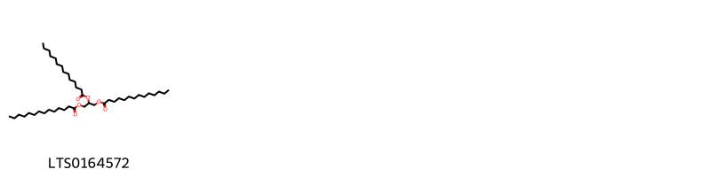{ group="compound" description="Cấu trúc hóa học của các hoạt chất thuộc nhóm *Glycerolipids* là trimyristin [(LTS0164572)](https://lotus.naturalproducts.net/compound/lotus_id/LTS0164572)." }

                                                              
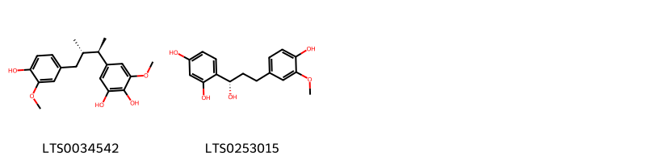{ group="compound" description="Cấu trúc hóa học của các hoạt chất thuộc nhóm *Linear 1,3-diarylpropanoids* là 5-[(2r,3s)-4-(4-hydroxy-3-methoxyphenyl)-3-methylbutan-2-yl]-3-methoxybenzene-1,2-diol [(LTS0034542)](https://lotus.naturalproducts.net/compound/lotus_id/LTS0034542), 4-[(1s)-1-hydroxy-3-(4-hydroxy-3-methoxyphenyl)propyl]benzene-1,3-diol [(LTS0253015)](https://lotus.naturalproducts.net/compound/lotus_id/LTS0253015)." }

                                                              
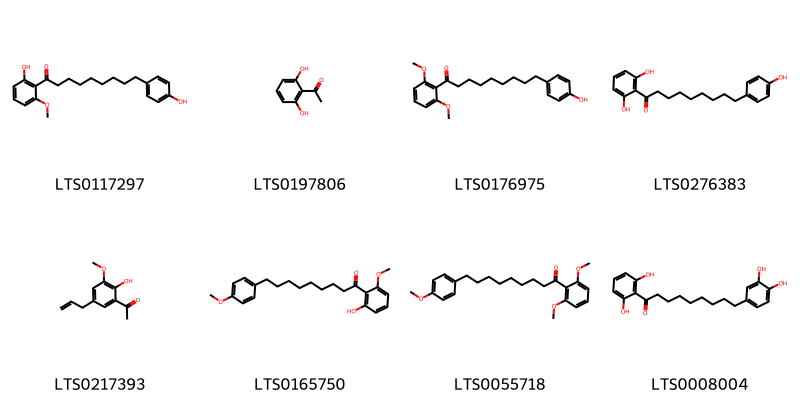{ group="compound" description="Cấu trúc hóa học của các hoạt chất thuộc nhóm *Organooxygen compounds* là 1-(2-hydroxy-6-methoxyphenyl)-9-(4-hydroxyphenyl)nonan-1-one [(LTS0117297)](https://lotus.naturalproducts.net/compound/lotus_id/LTS0117297), 2',6'-dihydroxyacetophenone [(LTS0197806)](https://lotus.naturalproducts.net/compound/lotus_id/LTS0197806), 1-(2,6-dimethoxyphenyl)-9-(4-hydroxyphenyl)nonan-1-one [(LTS0176975)](https://lotus.naturalproducts.net/compound/lotus_id/LTS0176975), 1-(2,6-dihydroxyphenyl)-9-(4-hydroxyphenyl)nonan-1-one [(LTS0276383)](https://lotus.naturalproducts.net/compound/lotus_id/LTS0276383), 1-[2-hydroxy-3-methoxy-5-(prop-2-en-1-yl)phenyl]ethanone [(LTS0217393)](https://lotus.naturalproducts.net/compound/lotus_id/LTS0217393), 1-(2-hydroxy-6-methoxyphenyl)-9-(4-methoxyphenyl)nonan-1-one [(LTS0165750)](https://lotus.naturalproducts.net/compound/lotus_id/LTS0165750), 1-(2,6-dimethoxyphenyl)-9-(4-methoxyphenyl)nonan-1-one [(LTS0055718)](https://lotus.naturalproducts.net/compound/lotus_id/LTS0055718), malabaricone c [(LTS0008004)](https://lotus.naturalproducts.net/compound/lotus_id/LTS0008004)." }

                                                              
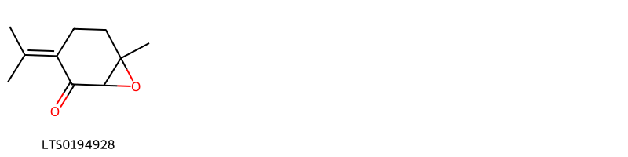{ group="compound" description="Cấu trúc hóa học của các hoạt chất thuộc nhóm *Oxepanes* là 6-methyl-3-(propan-2-ylidene)-7-oxabicyclo[4.1.0]heptan-2-one [(LTS0194928)](https://lotus.naturalproducts.net/compound/lotus_id/LTS0194928)." }

                                                              
{ group="compound" description="Cấu trúc hóa học của các hoạt chất thuộc nhóm *Phenol esters* là eugenyl acetate [(LTS0165886)](https://lotus.naturalproducts.net/compound/lotus_id/LTS0165886)." }

                                                              
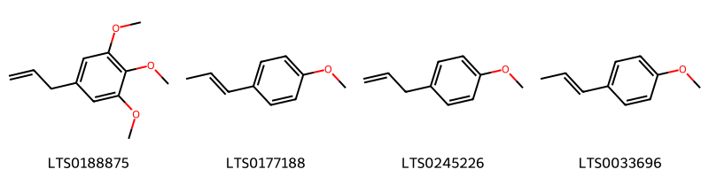{ group="compound" description="Cấu trúc hóa học của các hoạt chất thuộc nhóm *Phenol ethers* là elemicin [(LTS0188875)](https://lotus.naturalproducts.net/compound/lotus_id/LTS0188875), p-propenylanisole [(LTS0177188)](https://lotus.naturalproducts.net/compound/lotus_id/LTS0177188), tarragon [(LTS0245226)](https://lotus.naturalproducts.net/compound/lotus_id/LTS0245226), anethole [(LTS0033696)](https://lotus.naturalproducts.net/compound/lotus_id/LTS0033696)." }

                                                              
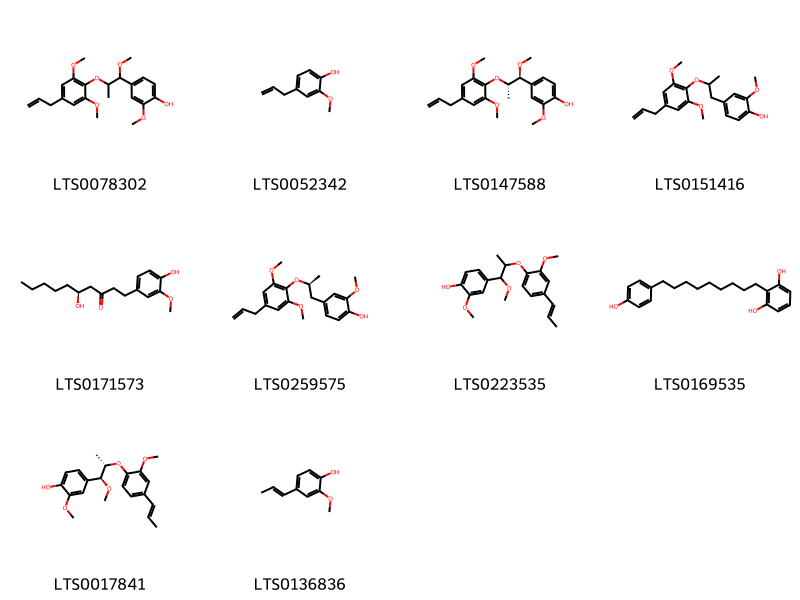{ group="compound" description="Cấu trúc hóa học của các hoạt chất thuộc nhóm *Phenols* là 4-{2-[2,6-dimethoxy-4-(prop-2-en-1-yl)phenoxy]-1-methoxypropyl}-2-methoxyphenol [(LTS0078302)](https://lotus.naturalproducts.net/compound/lotus_id/LTS0078302), eugenol [(LTS0052342)](https://lotus.naturalproducts.net/compound/lotus_id/LTS0052342), 4-[(1s,2s)-2-[2,6-dimethoxy-4-(prop-2-en-1-yl)phenoxy]-1-methoxypropyl]-2-methoxyphenol [(LTS0147588)](https://lotus.naturalproducts.net/compound/lotus_id/LTS0147588), 4-{2-[2,6-dimethoxy-4-(prop-2-en-1-yl)phenoxy]propyl}-2-methoxyphenol [(LTS0151416)](https://lotus.naturalproducts.net/compound/lotus_id/LTS0151416), gingerol [(LTS0171573)](https://lotus.naturalproducts.net/compound/lotus_id/LTS0171573), 4-[(2s)-2-[2,6-dimethoxy-4-(prop-2-en-1-yl)phenoxy]propyl]-2-methoxyphenol [(LTS0259575)](https://lotus.naturalproducts.net/compound/lotus_id/LTS0259575), 2-methoxy-4-{1-methoxy-2-[2-methoxy-4-(prop-1-en-1-yl)phenoxy]propyl}phenol [(LTS0223535)](https://lotus.naturalproducts.net/compound/lotus_id/LTS0223535), 2-[9-(4-hydroxyphenyl)nonyl]benzene-1,3-diol [(LTS0169535)](https://lotus.naturalproducts.net/compound/lotus_id/LTS0169535), 2-methoxy-4-[(1s,2s)-1-methoxy-2-{2-methoxy-4-[(1e)-prop-1-en-1-yl]phenoxy}propyl]phenol [(LTS0017841)](https://lotus.naturalproducts.net/compound/lotus_id/LTS0017841), isoeugenol [(LTS0136836)](https://lotus.naturalproducts.net/compound/lotus_id/LTS0136836)." }

                                                              
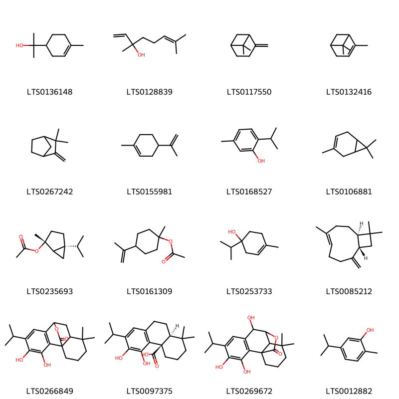{ group="compound" description="Cấu trúc hóa học của các hoạt chất thuộc nhóm *Prenol lipids* là terpineol [(LTS0136148)](https://lotus.naturalproducts.net/compound/lotus_id/LTS0136148), linalool, (+-)- [(LTS0128839)](https://lotus.naturalproducts.net/compound/lotus_id/LTS0128839), β-pinene [(LTS0117550)](https://lotus.naturalproducts.net/compound/lotus_id/LTS0117550), α pinene [(LTS0132416)](https://lotus.naturalproducts.net/compound/lotus_id/LTS0132416), camphene [(LTS0267242)](https://lotus.naturalproducts.net/compound/lotus_id/LTS0267242), limonene,  [(LTS0155981)](https://lotus.naturalproducts.net/compound/lotus_id/LTS0155981), thymol [(LTS0168527)](https://lotus.naturalproducts.net/compound/lotus_id/LTS0168527), monoterpenes [(LTS0106881)](https://lotus.naturalproducts.net/compound/lotus_id/LTS0106881), (2r,5s)-5-isopropyl-2-methylbicyclo[3.1.0]hexan-2-yl acetate [(LTS0235693)](https://lotus.naturalproducts.net/compound/lotus_id/LTS0235693), β-terpinyl acetate [(LTS0161309)](https://lotus.naturalproducts.net/compound/lotus_id/LTS0161309), 4-terpineol [(LTS0253733)](https://lotus.naturalproducts.net/compound/lotus_id/LTS0253733), caryophyllene [(LTS0085212)](https://lotus.naturalproducts.net/compound/lotus_id/LTS0085212), 3,4-dihydroxy-5-isopropyl-11,11-dimethyl-16-oxatetracyclo[6.6.2.0¹,¹⁰.0²,⁷]hexadeca-2(7),3,5-trien-15-one [(LTS0266849)](https://lotus.naturalproducts.net/compound/lotus_id/LTS0266849), carnosic acid [(LTS0097375)](https://lotus.naturalproducts.net/compound/lotus_id/LTS0097375), 3,4,8-trihydroxy-5-isopropyl-11,11-dimethyl-16-oxatetracyclo[7.5.2.0¹,¹⁰.0²,⁷]hexadeca-2(7),3,5-trien-15-one [(LTS0269672)](https://lotus.naturalproducts.net/compound/lotus_id/LTS0269672), carvacrol [(LTS0012882)](https://lotus.naturalproducts.net/compound/lotus_id/LTS0012882)." }

                                                              
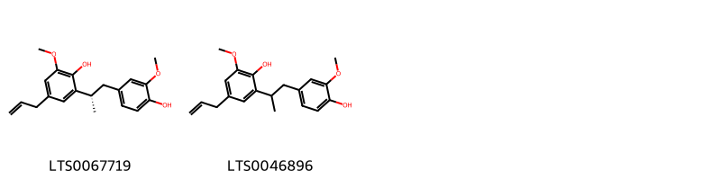{ group="compound" description="Cấu trúc hóa học của các hoạt chất thuộc nhóm *Stilbenes* là 2-[(2s)-1-(4-hydroxy-3-methoxyphenyl)propan-2-yl]-6-methoxy-4-(prop-2-en-1-yl)phenol [(LTS0067719)](https://lotus.naturalproducts.net/compound/lotus_id/LTS0067719), 2-[1-(4-hydroxy-3-methoxyphenyl)propan-2-yl]-6-methoxy-4-(prop-2-en-1-yl)phenol [(LTS0046896)](https://lotus.naturalproducts.net/compound/lotus_id/LTS0046896)." }

:::

---

## IV. Tác dụng dược lý

Theo tài liệu quốc tế: To warm the spleen and stomach and promote the flow of qi , to arrest diarrhea as an astringent.

---

## V. Dược điển Việt Nam V

### Soi bột

Màụ nâu đỏ đến nâu xám, mùi thơm hắc, vị cay đắng. Có nhiều mảnh nội nhũ có chứa hạt tinh bột, giọt dầu và hạt aleuron. Mảnh vỏ hạt đôi khi có chứa tinh thể calci oxalat hình nhiều cạnh. Rải rác có tinh thể calci oxalat tách rời. Giọt dầu. Mảnh tế bào ngoại nhũ chứa chất màu nâu. Mảnh mạch ít gặp. Tinh bột đa số là hạt đơn, đường kính 25 µm đến 30 µm, điểm rốn rõ.

::: {#listing-soibot}
:::

### Vi phẫu

Ngoài cùng là lớp vỏ hạt, tế bào có thành hơi dày. Lớp ngoại nhũ sát lớp vỏ hạt, tế bào nhỏ có chứa chất màu nâu và xếp kéo dài theo hướng tiếp tuyến. Rải rác có những bó mạch, những tinh thể calci oxalat hình nhiều cạnh trong phần vỏ. Phần ngoại nhũ ăn sâu vào nội nhũ, phần nội nhũ gồm các tế bào to nhỏ không đều, chứa hạt tinh bột, giọt dầu và giọt aleuron. Hạt tinh bột đơn có đường kính 10 µm đến 20 µm, có rốn rỗ, thường tụ lại thành đám 2 hạt đến 6 hạt, đường kính 25 µm đến 30 µm.

::: {#listing-viphau}
:::

### Định tính

A. Cắt vi phẫu rồi nhuộm bằng dung dịch iod (TT), nhỏ glycerin (TT) lên vi phẫu, quan sát ngay dưới kính hiển vi, thấy hạt aleuron tương đối lớn giữa các hạt tinh bột màu xanh lam. Nếu thay glycerin (TT) bằng cloral hydrat (TT), quan sát thấy dầu béo hiện ra dưới dạng khối phiến, dạng lát vảy, hơ nóng lập tức biến thành giọt dầu. B. Phương pháp sắc ký lớp mỏng (Phụ lục 5.4). Bản mỏng: Silica gel G. Dung môi khai triển: Cyclohexan – ethyl acetat (8 : 2). Dung dịch thử: Hòa tan tinh dầu của dược liệu thu được ở phần định lượng trong cloroform (TT) để được dung dịch chứa 0,2 ml tinh dầu trong 1 ml. Dung dịch đối chiếu: Hòa tinh dầu của Nhục đậu khấu (mẫu chuẩn) trong cloroform (TT) để được dung dịch chứa 0,2 ml tinh dầu trong 1 ml. Cách tiến hành: Chấm riêng biệt lên bản mỏng 10 µl mỗi dung dịch thử và dung dịch đối chiếu. Sau khi triển khai sắc ký, lấy bản mỏng ra để khô ở nhiệt độ phòng, phun dung dịch vanilin – acid sulfuric (TT). Sấy ở 105 °C cho đến khi các vết hiện rõ. Quan sát dưới ánh sáng thường, sắc ký đồ của dung dịch thử phải có các vết cùng màu sắc và giá trị Rf với các vết trên sắc ký đồ của dung dịch đối chiếu.

### Định lượng

Tiến hành theo phương pháp định lượng tinh dầu trong dược liệu (Phụ lục 12.7). Dùng 20 g bột dược liệu. Dược liệu phải chứa ít nhất 6,0 % tinh dầu tính theo dược liệu khô kiệt.

### Thông tin khác 

- **Độ ẩm:** Không quá 12,0 % (Phụ lục 12.13).
- **Bảo quản:** Nơi khô, mát, tránh mốc mọt.

## VI. Dược điển Hồng kong

::: {#listing-DDHK}
:::

---

## VII. Y dược học cổ truyền

::: {.callout-note title = "nan" }

**Tên vị thuốc:** nan

**Tính:** nan

**Vị:** nan

**Quy kinh:**  nan

**Công năng chủ trị:** Tân, ôn. Quy vào kinh tỳ, vị, đại tràng.

**Phân loại theo thông tư:** Thu liễm, cố sáp

**Tác dụng theo y dược cổ truyền:** nan

**Chú ý:** nan

**Kiêng kỵ:** Nhiệt tả, nhiệt lỵ không dùng. 

:::

::: {#listing-ViThuoc}
:::

