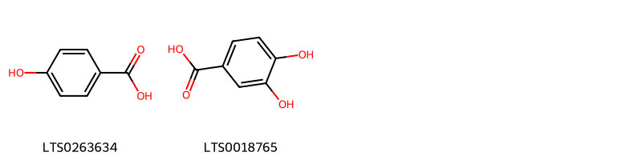
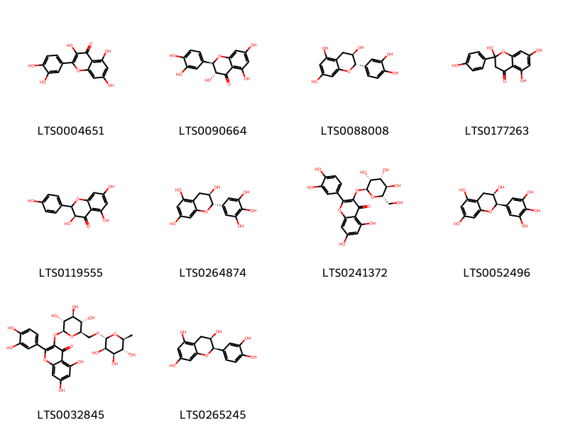
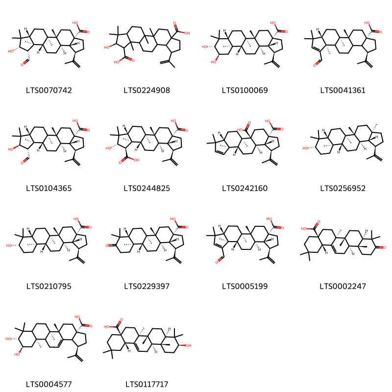
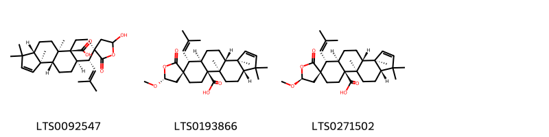

::: {.callout-note title = "Tóm tắt"}

nan

:::

## I. Thông tin về dược liệu 

::: {.panel-tabset}

### Định danh

- Dược liệu tiếng Việt: Táo - Hạt
- Dược liệu tiếng Trung: ? (?)
- Dược liệu tiếng Anh: ?
- Dược liệu latin thông dụng: Semen Ziziphi Mauritianae
- Dược liệu latin kiểu DĐVN: *Semen Ziziphi Mauritianae*
- Dược liệu latin kiểu DĐVN: *nan*
- Dược liệu latin kiểu thông tư: *nan*
- Bộ phận dùng: Quả (Semen)

### Mô tả dược liệu 

**Theo dược điển Việt nam V:** Hạt hình cầu hay hình trứng dẹt có một đầu hơi nhọn, một mặt gần như phẳng, một mặt khum hình thấu kính, dài 5 mm đến 8 mm, rộng 4 mm đến 6 mm, dày 1 mm đến 2 mm. ở đầu nhọn có rốn hạt hơi lõm xuống, màu nâu thẫm. Mặt ngoài màu nâu đỏ hay nâu vàng, đôi khi có màu nâu thẫm, Chất mềm, dễ cất ngang. 
 
**Mô tả dược liệu theo thông tư chế biến dược liệu theo phương pháp cổ truyền:** nan

### Chế biến 

**Chế biến theo dược điển việt nam V**: Thu hoạch quả chín từ cuối mùa thu đến đầu mùa đông, loại bỏ thịt quả, lấy hạch cứng rửa sạch, phơi hoặc sấy khô, xay bỏ vỏ hạch cứng, sàng lấy hạt, phơi hoặc sấy khô. Bào chế Toan táo nhân: Loại bỏ vỏ hạch cứng sót lại, khi dùng giã nát. Toan táo nhân sao: Lấy toan táo nhân sạch, sao nhỏ lửa đến khi phồng lên và hơi thẫm màu. Khi dùng giã nát. 

**Chế biến theo thông tư:** nan

::: 

## II. Thông tin về thực vật

Dược liệu **Táo - Hạt** từ bộ phận **Quả** từ loài *Ziziphus mauritiana*.

**Mô tả thực vật:** nan

*Tài liệu tham khảo:* nan 
Trong dược điển Việt nam, loài *Ziziphus mauritiana* được sử dụng làm dược liệu.

            
::: {.callout-note title = "Phân loại thực vật của *Ziziphus mauritiana*"}

**Kingdom:** Plantae 

**Phylum:** Tracheophyta 

**Order:** Rosales 
 
**Family:** Rhamnaceae 
 
**Genus:** Ziziphus 
 
**Species:** *Ziziphus mauritiana* 
 

:::

::: {style="display: grid;grid-template-columns: repeat(auto-fill, minmax(150px, 1fr));grid-gap: 1em;"}
{ group="GIBF" }

{ group="GIBF" }

{ group="GIBF" }

{ group="GIBF" }

{ group="GIBF" }

{ group="GIBF" }

{ group="GIBF" }

{ group="GIBF" }

{ group="GIBF" }

{ group="GIBF" }

{ group="GIBF" }

{ group="GIBF" }

{ group="GIBF" }

{ group="GIBF" }
:::

**Phân bố trên thế giới:** Benin, Chad, Gambia, Nepal, Jamaica, Sri Lanka, Antigua and Barbuda, Cabo Verde, Guadeloupe, French Guiana, Chinese Taipei, Australia, Saint Martin (French part), Panama, Indonesia, Virgin Islands (U.S.), Dominica, Trinidad and Tobago, Nigeria, Senegal, Mozambique, Burkina Faso, India, Thailand, Ethiopia, Malaysia, Maldives, Puerto Rico, El Salvador

**Phân bố tại Việt nam:** Không có ghi nhận ở Việt Nam

<iframe src="Semen Ziziphi Mauritianae/map_distribution.html" width="100%" height="600" style="border:none;"></iframe>

## III. Thành phần hóa học

Theo tài liệu của GS. Đỗ Tất Lợi:  nan
    

Theo cơ sở dữ liệu lotus, loài *Ziziphus mauritiana* đã phân lập và xác định được **29** hoạt chất thuộc về các nhóm Steroids and steroid derivatives, Prenol lipids, Flavonoids, Benzene and substituted derivatives trong bảng dưới đây.
        
| chemicalTaxonomyClassyfireClass     |   smiles_count |
|:------------------------------------|---------------:|
| Benzene and substituted derivatives |             37 |
| Flavonoids                          |            570 |
| Prenol lipids                       |           1400 |
| Steroids and steroid derivatives    |            305 |

Danh sách chi tiết các hoạt chất như sau: 

::: {style="display: grid;grid-template-columns: repeat(auto-fill, minmax(150px, 1fr));grid-gap: 1em;"}

                                                              
{ group="compound" description="Cấu trúc hóa học của các hoạt chất thuộc nhóm *Benzene and substituted derivatives* là p-hydroxybenzoic acid [(LTS0263634)](https://lotus.naturalproducts.net/compound/lotus_id/LTS0263634), 3,4-dihydroxybenzoic acid [(LTS0018765)](https://lotus.naturalproducts.net/compound/lotus_id/LTS0018765)." }

                                                              
{ group="compound" description="Cấu trúc hóa học của các hoạt chất thuộc nhóm *Flavonoids* là quercetin [(LTS0004651)](https://lotus.naturalproducts.net/compound/lotus_id/LTS0004651), (+)-taxifolin [(LTS0090664)](https://lotus.naturalproducts.net/compound/lotus_id/LTS0090664), α catechin [(LTS0088008)](https://lotus.naturalproducts.net/compound/lotus_id/LTS0088008), 2-hydroxynaringenin [(LTS0177263)](https://lotus.naturalproducts.net/compound/lotus_id/LTS0177263), (3s)-3,5,7-trihydroxy-2-(4-hydroxyphenyl)-2,3-dihydro-1-benzopyran-4-one [(LTS0119555)](https://lotus.naturalproducts.net/compound/lotus_id/LTS0119555), (-)-gallocatechin [(LTS0264874)](https://lotus.naturalproducts.net/compound/lotus_id/LTS0264874), 2-(3,4-dihydroxyphenyl)-5,7-dihydroxy-3-{[(2s,3r,4r,5r,6s)-3,4,5-trihydroxy-6-(hydroxymethyl)oxan-2-yl]oxy}chromen-4-one [(LTS0241372)](https://lotus.naturalproducts.net/compound/lotus_id/LTS0241372), epigallocatechin [(LTS0052496)](https://lotus.naturalproducts.net/compound/lotus_id/LTS0052496), 3-rutinosyl quercetin [(LTS0032845)](https://lotus.naturalproducts.net/compound/lotus_id/LTS0032845), ent-epicatechin [(LTS0265245)](https://lotus.naturalproducts.net/compound/lotus_id/LTS0265245)." }

                                                              
{ group="compound" description="Cấu trúc hóa học của các hoạt chất thuộc nhóm *Prenol lipids* là (1r,2r,5s,8r,9r,10r,13r,14r,15s,16s,18r)-15-formyl-16-hydroxy-1,2,14,17,17-pentamethyl-8-(prop-1-en-2-yl)pentacyclo[11.7.0.0²,¹⁰.0⁵,⁹.0¹⁴,¹⁸]icosane-5-carboxylic acid [(LTS0070742)](https://lotus.naturalproducts.net/compound/lotus_id/LTS0070742), 16-hydroxy-1,2,14,17,17-pentamethyl-8-(prop-1-en-2-yl)pentacyclo[11.7.0.0²,¹⁰.0⁵,⁹.0¹⁴,¹⁸]icosane-5,15-dicarboxylic acid [(LTS0224908)](https://lotus.naturalproducts.net/compound/lotus_id/LTS0224908), (1r,3as,5ar,5br,7ar,9r,10r,11ar,11br,13ar,13br)-9,10-dihydroxy-5a,5b,8,8,11a-pentamethyl-1-(prop-1-en-2-yl)-hexadecahydrocyclopenta[a]chrysene-3a-carboxylic acid [(LTS0100069)](https://lotus.naturalproducts.net/compound/lotus_id/LTS0100069), (1r,2r,5s,8r,14s,18s)-15-formyl-1,2,14,17,17-pentamethyl-8-(prop-1-en-2-yl)pentacyclo[11.7.0.0²,¹⁰.0⁵,⁹.0¹⁴,¹⁸]icos-15-ene-5-carboxylic acid [(LTS0041361)](https://lotus.naturalproducts.net/compound/lotus_id/LTS0041361), zizyberanalic acid [(LTS0104365)](https://lotus.naturalproducts.net/compound/lotus_id/LTS0104365), ceanothic acid [(LTS0244825)](https://lotus.naturalproducts.net/compound/lotus_id/LTS0244825), (1s,2r,5s,9s,10r,13r,14r,15r,18s)-2,6,6,9-tetramethyl-15-(prop-1-en-2-yl)pentacyclo[11.7.0.0²,¹⁰.0⁵,⁹.0¹⁴,¹⁸]icos-7-ene-1,18-dicarboxylic acid [(LTS0242160)](https://lotus.naturalproducts.net/compound/lotus_id/LTS0242160), lupeol [(LTS0256952)](https://lotus.naturalproducts.net/compound/lotus_id/LTS0256952), betulinic acid [(LTS0210795)](https://lotus.naturalproducts.net/compound/lotus_id/LTS0210795), (1r,3as,5ar,5br,7ar,11ar,11br,13ar,13br)-5a,5b,8,8,11a-pentamethyl-9-oxo-1-(prop-1-en-2-yl)-tetradecahydro-1h-cyclopenta[a]chrysene-3a-carboxylic acid [(LTS0229397)](https://lotus.naturalproducts.net/compound/lotus_id/LTS0229397), (1r,2r,5s,8r,9r,10r,13s,14s,18s)-15-formyl-1,2,14,17,17-pentamethyl-8-(prop-1-en-2-yl)pentacyclo[11.7.0.0²,¹⁰.0⁵,⁹.0¹⁴,¹⁸]icos-15-ene-5-carboxylic acid [(LTS0005199)](https://lotus.naturalproducts.net/compound/lotus_id/LTS0005199), (4as,6as,6br,8ar,12ar,12br,14bs)-2,2,6a,6b,9,9,12a-heptamethyl-10-oxo-3,4,5,6,7,8,8a,11,12,12b,13,14b-dodecahydro-1h-picene-4a-carboxylic acid [(LTS0002247)](https://lotus.naturalproducts.net/compound/lotus_id/LTS0002247), (1r,3as,5as,5br,9r,10r,11ar)-9,10-dihydroxy-5a,5b,8,8,11a-pentamethyl-1-(prop-1-en-2-yl)-1h,2h,3h,4h,5h,6h,7h,7ah,9h,10h,11h,11bh,12h,13bh-cyclopenta[a]chrysene-3a-carboxylic acid [(LTS0004577)](https://lotus.naturalproducts.net/compound/lotus_id/LTS0004577), oleanolic acid [(LTS0117717)](https://lotus.naturalproducts.net/compound/lotus_id/LTS0117717)." }

                                                              
{ group="compound" description="Cấu trúc hóa học của các hoạt chất thuộc nhóm *Steroids and steroid derivatives* là (3as,3br,5ar,6r,7r,9as,9br,11as)-5'-hydroxy-1,1,3a,9b-tetramethyl-6-(2-methylprop-1-en-1-yl)-2'-oxo-3b,4,5,5a,6,8,9,10,11,11a-decahydrospiro[cyclopenta[a]phenanthrene-7,3'-oxolane]-9a-carboxylic acid [(LTS0092547)](https://lotus.naturalproducts.net/compound/lotus_id/LTS0092547), (3as,3br,5'r,5ar,6r,7r,9as,9br,11as)-5'-methoxy-1,1,3a,9b-tetramethyl-6-(2-methylprop-1-en-1-yl)-2'-oxo-3b,4,5,5a,6,8,9,10,11,11a-decahydrospiro[cyclopenta[a]phenanthrene-7,3'-oxolane]-9a-carboxylic acid [(LTS0193866)](https://lotus.naturalproducts.net/compound/lotus_id/LTS0193866), (3as,3br,5's,5ar,6r,7r,9as,9br,11as)-5'-methoxy-1,1,3a,9b-tetramethyl-6-(2-methylprop-1-en-1-yl)-2'-oxo-3b,4,5,5a,6,8,9,10,11,11a-decahydrospiro[cyclopenta[a]phenanthrene-7,3'-oxolane]-9a-carboxylic acid [(LTS0271502)](https://lotus.naturalproducts.net/compound/lotus_id/LTS0271502)." }

:::

---

## IV. Tác dụng dược lý

Theo tài liệu quốc tế: nan

---

## V. Dược điển Việt Nam V

### Soi bột

Mảnh mô cứng của vỏ ngoài gồm tế bào khá to, màu vàng hay vàng nâu. Mảnh mô mềm vỏ giữa là những tế bào thành mỏng, không đều. Mảnh vỏ trong gồm tế bào màu vàng, hình nhiều cạnh, thành dày và lượn sóng. Mảnh nội nhũ gồm các tế bào chứa những hạt tinh bột nhỏ và chất dự trữ. Mảnh lá mầm gồm những tế bào có nhiều cạnh tương đối đều, thành mỏng, trong có những giọt dầu. Những giọt dầu rải rác.

::: {#listing-soibot}
:::

### Vi phẫu

Vỏ hạt có hai lớp tế bào: Bên ngoài là lớp tế bào biểu bì xếp đều đặn, bên trong là lớp tế bào mô cứng hình chữ nhật, thành dày, xếp đứng theo hướng xuyên tâm. Sát với tế bào mô cứng có vài hàng tế bào mô mềm thành mỏng bị bẹp, rải rác có một vài bó libe-gỗ. Nội nhũ gồm tế bào hình nhiều cạnh, thành mỏng xếp lộn xộn, trong tế bào có những giọt dầu và các chất dự trữ. Mặt trong gồm một lớp tế bào hình bầu dục dài. Trong cùng là hai lá mầm bằng nhau, xếp úp vào nhau. nn

::: {#listing-viphau}
:::

### Định tính

A. Lấy 2 g bột dược liệu, thêm 20 ml ethanol (TT). Lắc đều, đun hồi lưu trên cách thủy trong 1 h, để nguội. Lọc, dịch lọc đem có cách thủy đến khi còn lại 5 ml đến 6 ml, dùng dung dịch này làm các phản ứng sau: Lấy 2 ống nghiệm, cho vào mỗi ống 1 ml dung dịch trên. Ống 1 them 1 ml dung dịch na tri hydroxyd 10 % (TT) và đun nhẹ. Sau đó cho vào mỗi ống 5 ml nước. Dung dịch trong ống 1 trong suốt hoặc ít đục hơn ống 2. Sau đó cho vào ống 1 hai giọt dung dịch acid hydrocloric 10 % (TT), lập tức có vẩn đục roi kết tủa bông lắng xuống. B. Phương pháp sắc ký lớp mỏng (Phụ lục 5.4). Bản mỏng: Silica gel G. Dung môi khai triển: Toluen – acid acetic – nước (7:5:1). Dung dịch thử: Lấy 1 g bột dược liệu, thêm 30 ml ether dầu hỏa (40 ° C đến 60 °C) (TT), đun hồi lưu trên cách thủy trong 2 h, lọc bỏ dịch ether dầu. Bã còn lại được loại bỏ hết dung môi bằng cách đặt trên cách thủy nóng, thêm 30 ml methanol (TT), đun hồi lưu trên cách thủy trong 2 h, để nguội, lọc. Cô dịch lọc trên cách thủy đến cạn. Hòa tan cắn trong 2 ml ethanol (TT). Dung dịch đối chiếu: Lấy 1 g bột Táo nhân (mẫu chuẩn), tiến hành chiết như mô tả ở phần Dung dịch thử. Cách tiến hành: Chấm riêng biệt lên bản mỏng 10 μl mỗi dung dịch trên. Sau khi triển khai sắc ký lấy bản mỏng ra để khô ngoài không khí, phun dung dịch vanilin 1 % trong acid sulfuric (TT), sấy bản mỏng ờ 110 °C cho đến khi hiện rõ vết. Quan sát dưới ánh sáng thường. Trên sắc ký đồ của dung dịch thử phải có các vết có cùng màu sắc và cùng giá trị Rf với các vết trên sắc ký đồ của dung dịch đối chiếu.

### Định lượng

nan

### Thông tin khác 

- **Độ ẩm:** Không quá 8,0 % (Phụ lục 9.6, 105 °c, 2 g, 5 h).
- **Bảo quản:** Nơi thoáng mát, tránh mốc mọt.

## VI. Dược điển Hồng kong

::: {#listing-DDHK}
:::

---

## VII. Y dược học cổ truyền

::: {.callout-note title = "nan" }

**Tên vị thuốc:** nan

**Tính:** nan

**Vị:** nan

**Quy kinh:**  nan

**Công năng chủ trị:** Cam, toan, bình. Quy vào các kinh can, đờm, tâm, tỳ.

**Phân loại theo thông tư:** nan

**Tác dụng theo y dược cổ truyền:** nan

**Chú ý:** nan

**Kiêng kỵ:** Người thực tả uất hòa không dùng. 

:::

::: {#listing-ViThuoc}
:::

